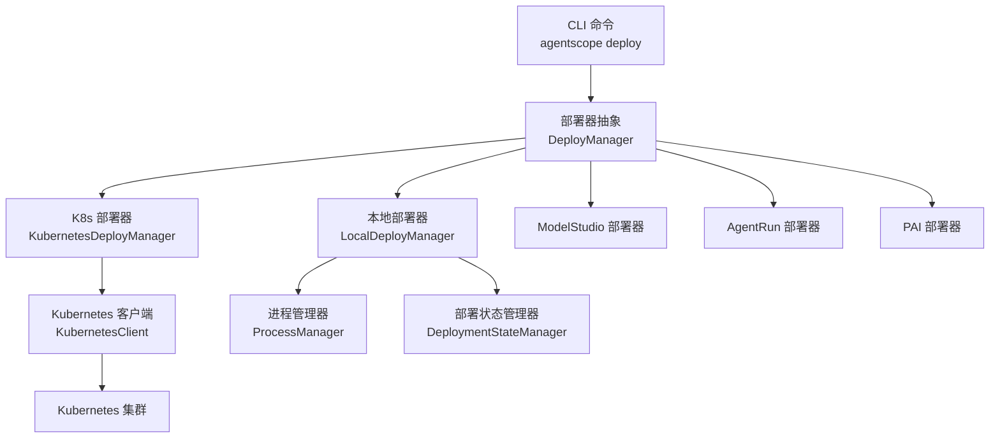
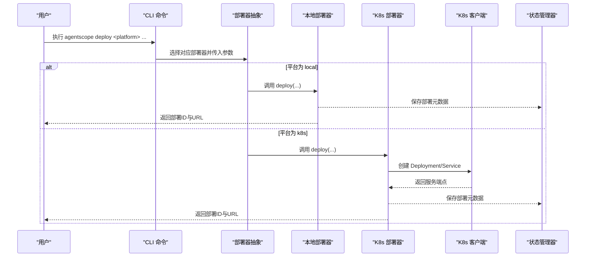
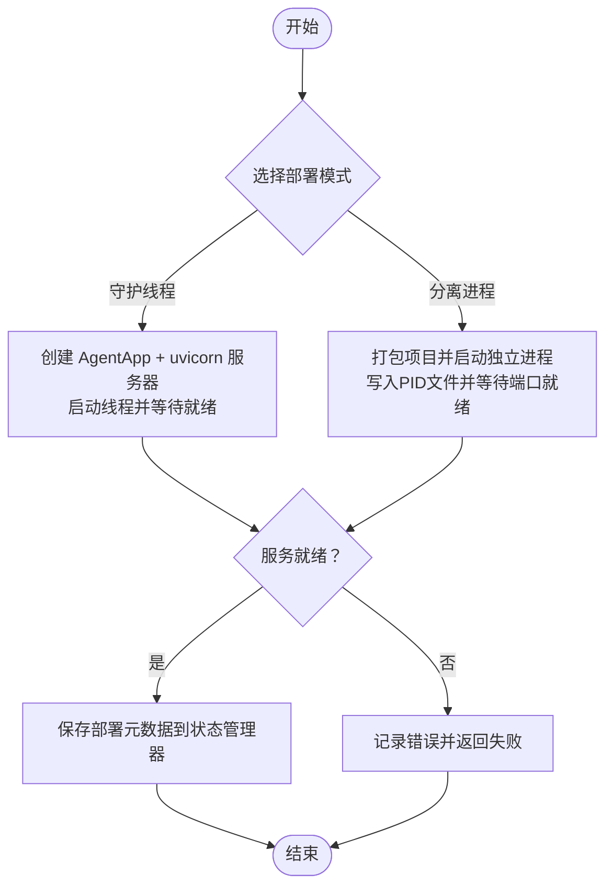
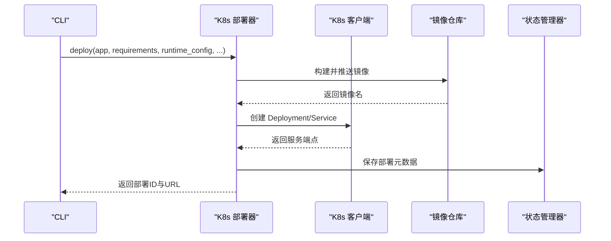
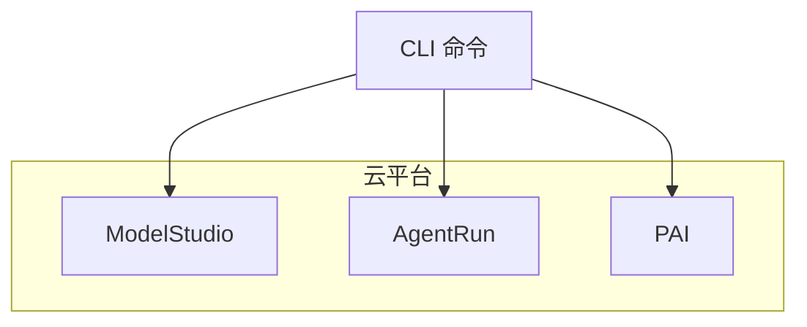
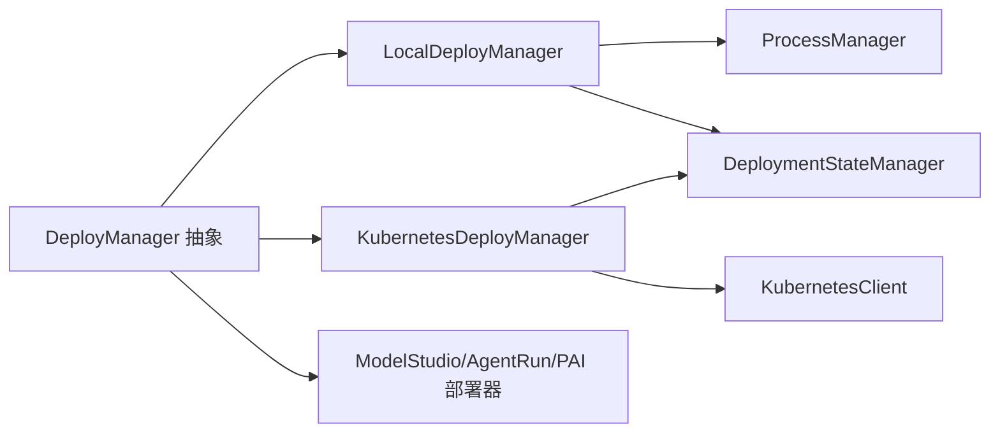

# 部署与生产

<cite>
**本文引用的文件**
- [kubernetes_deployer.py](file://src/agentscope_runtime/engine/deployers/kubernetes_deployer.py)
- [local_deployer.py](file://src/agentscope_runtime/engine/deployers/local_deployer.py)
- [base.py](file://src/agentscope_runtime/engine/deployers/base.py)
- [deployment_modes.py](file://src/agentscope_runtime/engine/deployers/utils/deployment_modes.py)
- [manager.py](file://src/agentscope_runtime/engine/deployers/state/manager.py)
- [kubernetes_client.py](file://src/agentscope_runtime/common/container_clients/kubernetes_client.py)
- [deploy.py](file://src/agentscope_runtime/cli/commands/deploy.py)
- [k8s_deploy_config.yaml](file://examples/deployments/k8s_deploy/k8s_deploy_config.yaml)
- [k8s_deploy_config.json](file://examples/deployments/k8s_deploy/k8s_deploy_config.json)
- [local_deploy_config.yaml](file://examples/deployments/local_deploy_config.yaml)
- [pai_deploy_config.yaml](file://examples/deployments/pai_deploy_config.yaml)
- [modelstudio_deploy_config.yaml](file://examples/deployments/modelstudio_deploy_config.yaml)
- [README.md（Kubernetes 示例）](file://examples/deployments/k8s_deploy/README.md)
- [README.md（ModelStudio 示例）](file://examples/deployments/modelstudio_deploy/README.md)
- [README.md（本地守护进程示例）](file://examples/deployments/daemon_local_deploy/README.md)
- [README.md（本地分离进程示例）](file://examples/deployments/detached_local_deploy/README.md)
</cite>

## 目录
1. [简介](#简介)
2. [项目结构](#项目结构)
3. [核心组件](#核心组件)
4. [架构总览](#架构总览)
5. [详细组件分析](#详细组件分析)
6. [依赖分析](#依赖分析)
7. [性能考虑](#性能考虑)
8. [故障排查指南](#故障排查指南)
9. [结论](#结论)
10. [附录](#附录)

## 简介
本指南面向在生产环境中使用 AgentScope Runtime 的工程团队，系统性介绍多种部署模式与运维最佳实践，覆盖本地部署、Kubernetes 集群部署、云平台（ModelStudio、AgentRun、PAI）部署，并给出监控、日志、性能优化、容器化、负载均衡与自动扩缩容等高级主题的实施建议。

## 项目结构
- 命令行入口提供统一的部署子命令，支持多平台：local、k8s、modelstudio、agentrun、pai、knative、kruise 等。
- 部署器抽象基类定义了统一接口，具体平台实现负责打包、镜像构建、资源编排与状态管理。
- Kubernetes 客户端封装了 Pod/Deployment/Service 生命周期管理与日志采集。
- 部署状态管理器持久化部署元数据，支持查询、更新状态与清理。

图示来源
- [deploy.py:301-318](file://src/agentscope_runtime/cli/commands/deploy.py#L301-L318)
- [base.py:9-44](file://src/agentscope_runtime/engine/deployers/base.py#L9-L44)
- [local_deployer.py:27-67](file://src/agentscope_runtime/engine/deployers/local_deployer.py#L27-L67)
- [kubernetes_deployer.py:48-71](file://src/agentscope_runtime/engine/deployers/kubernetes_deployer.py#L48-L71)
- [kubernetes_client.py:19-53](file://src/agentscope_runtime/common/container_clients/kubernetes_client.py#L19-L53)
- [manager.py:17-38](file://src/agentscope_runtime/engine/deployers/state/manager.py#L17-L38)

章节来源
- [deploy.py:301-318](file://src/agentscope_runtime/cli/commands/deploy.py#L301-L318)
- [base.py:9-44](file://src/agentscope_runtime/engine/deployers/base.py#L9-L44)

## 核心组件
- 部署器抽象层：定义 deploy/stop 接口，统一不同平台的生命周期管理。
- 本地部署器：支持守护线程与分离进程两种模式，内置进程管理与优雅停机。
- Kubernetes 部署器：封装镜像构建、推送、Deployment/Service 创建与端点解析；支持本地/远程集群差异处理。
- Kubernetes 客户端：封装 Pod/Deployment/Service 操作、日志拉取、就绪检查与节点 IP 解析。
- 部署状态管理器：以 JSON 文件持久化部署元数据，提供备份、校验与导入导出能力。

章节来源
- [base.py:9-44](file://src/agentscope_runtime/engine/deployers/base.py#L9-L44)
- [local_deployer.py:27-67](file://src/agentscope_runtime/engine/deployers/local_deployer.py#L27-L67)
- [kubernetes_deployer.py:48-71](file://src/agentscope_runtime/engine/deployers/kubernetes_deployer.py#L48-L71)
- [kubernetes_client.py:19-53](file://src/agentscope_runtime/common/container_clients/kubernetes_client.py#L19-L53)
- [manager.py:17-38](file://src/agentscope_runtime/engine/deployers/state/manager.py#L17-L38)

## 架构总览
下图展示从 CLI 到各部署器与平台客户端的整体调用链路，以及状态持久化的路径。

图示来源
- [deploy.py:354-446](file://src/agentscope_runtime/cli/commands/deploy.py#L354-L446)
- [local_deployer.py:68-174](file://src/agentscope_runtime/engine/deployers/local_deployer.py#L68-L174)
- [kubernetes_deployer.py:126-312](file://src/agentscope_runtime/engine/deployers/kubernetes_deployer.py#L126-L312)
- [kubernetes_client.py:263-441](file://src/agentscope_runtime/common/container_clients/kubernetes_client.py#L263-L441)
- [manager.py:232-242](file://src/agentscope_runtime/engine/deployers/state/manager.py#L232-L242)

## 详细组件分析

### 本地部署（守护线程与分离进程）
- 守护线程模式：在主线程中启动 uvicorn 服务器，阻塞直至手动停止，适合开发调试。
- 分离进程模式：打包项目后以独立进程运行，支持远程关闭与进程健康检查，适合单节点生产场景。
- 进程管理：提供 PID 文件、日志轮转、超时等待与异常回退。
- 状态管理：保存部署元数据，支持按部署 ID 查询与停止。

图示来源
- [local_deployer.py:175-260](file://src/agentscope_runtime/engine/deployers/local_deployer.py#L175-L260)
- [local_deployer.py:260-383](file://src/agentscope_runtime/engine/deployers/local_deployer.py#L260-L383)
- [manager.py:232-242](file://src/agentscope_runtime/engine/deployers/state/manager.py#L232-L242)

章节来源
- [local_deployer.py:27-67](file://src/agentscope_runtime/engine/deployers/local_deployer.py#L27-L67)
- [local_deployer.py:68-174](file://src/agentscope_runtime/engine/deployers/local_deployer.py#L68-L174)
- [local_deployer.py:175-383](file://src/agentscope_runtime/engine/deployers/local_deployer.py#L175-L383)
- [deployment_modes.py:7-15](file://src/agentscope_runtime/engine/deployers/utils/deployment_modes.py#L7-L15)
- [manager.py:232-242](file://src/agentscope_runtime/engine/deployers/state/manager.py#L232-L242)

### Kubernetes 部署
- 镜像构建与推送：根据应用源码与依赖生成 Docker 镜像，可选推送到私有仓库。
- 资源编排：创建 Deployment 与 Service，支持多端口、资源限制、亲和性与容忍度。
- 端点解析：区分本地集群（Minikube/Kind）与云端集群，自动选择合适的访问地址。
- 健康检查：支持就绪探针与超时控制，确保服务可用性。
- 停止与回滚：删除 Deployment 与关联 Service，更新状态管理器。

图示来源
- [kubernetes_deployer.py:126-312](file://src/agentscope_runtime/engine/deployers/kubernetes_deployer.py#L126-L312)
- [kubernetes_client.py:669-800](file://src/agentscope_runtime/common/container_clients/kubernetes_client.py#L669-L800)
- [kubernetes_client.py:527-552](file://src/agentscope_runtime/common/container_clients/kubernetes_client.py#L527-L552)
- [manager.py:232-242](file://src/agentscope_runtime/engine/deployers/state/manager.py#L232-L242)

章节来源
- [kubernetes_deployer.py:48-71](file://src/agentscope_runtime/engine/deployers/kubernetes_deployer.py#L48-L71)
- [kubernetes_deployer.py:126-312](file://src/agentscope_runtime/engine/deployers/kubernetes_deployer.py#L126-L312)
- [kubernetes_client.py:19-53](file://src/agentscope_runtime/common/container_clients/kubernetes_client.py#L19-L53)
- [kubernetes_client.py:527-552](file://src/agentscope_runtime/common/container_clients/kubernetes_client.py#L527-L552)

### 云平台部署（ModelStudio、AgentRun、PAI）
- ModelStudio：通过 OSS 上传打包产物，平台托管运行，提供可视化控制台与监控。
- AgentRun：平台提供资源调度与弹性能力，支持指定区域与资源规格。
- PAI：支持公共池、专用资源组与配额三种资源模式，可配置 VPC、安全组与工作目录。

图示来源
- [deploy.py:480-595](file://src/agentscope_runtime/cli/commands/deploy.py#L480-L595)
- [deploy.py:637-767](file://src/agentscope_runtime/cli/commands/deploy.py#L637-L767)
- [deploy.py:769-889](file://src/agentscope_runtime/cli/commands/deploy.py#L769-L889)

章节来源
- [deploy.py:480-595](file://src/agentscope_runtime/cli/commands/deploy.py#L480-L595)
- [deploy.py:637-767](file://src/agentscope_runtime/cli/commands/deploy.py#L637-L767)
- [deploy.py:769-889](file://src/agentscope_runtime/cli/commands/deploy.py#L769-L889)

## 依赖分析
- 组件耦合：部署器抽象与平台实现松耦合，通过统一接口扩展新平台；Kubernetes 客户端与集群交互独立于业务逻辑。
- 外部依赖：Kubernetes 客户端依赖 kubernetes Python SDK；本地部署依赖 uvicorn；云平台部署依赖对应 SDK。
- 状态一致性：状态管理器采用原子写入与备份机制，防止数据丢失；提供导入导出用于迁移与备份。

图示来源
- [base.py:9-44](file://src/agentscope_runtime/engine/deployers/base.py#L9-L44)
- [local_deployer.py:27-67](file://src/agentscope_runtime/engine/deployers/local_deployer.py#L27-L67)
- [kubernetes_deployer.py:48-71](file://src/agentscope_runtime/engine/deployers/kubernetes_deployer.py#L48-L71)
- [kubernetes_client.py:19-53](file://src/agentscope_runtime/common/container_clients/kubernetes_client.py#L19-L53)
- [manager.py:17-38](file://src/agentscope_runtime/engine/deployers/state/manager.py#L17-L38)

章节来源
- [base.py:9-44](file://src/agentscope_runtime/engine/deployers/base.py#L9-L44)
- [manager.py:146-231](file://src/agentscope_runtime/engine/deployers/state/manager.py#L146-L231)

## 性能考虑
- 资源配额：为容器设置合理的 requests/limits，避免资源争抢；结合业务峰值评估内存与 CPU。
- 启动与就绪：配置启动延迟与探针阈值，减少冷启动抖动；对大模型推理场景预热关键资源。
- 日志与追踪：生产环境启用结构化日志与采样追踪，避免日志风暴；集中化收集与索引。
- 缓存与依赖：利用镜像缓存与依赖复用，缩短构建时间；对静态资源进行 CDN 加速。
- 连接池与并发：合理设置 HTTP/TCP 连接池大小与并发上限，避免过载。
- 自动扩缩容：基于 CPU/内存或自定义指标触发 HPA；结合队列长度或请求延迟触发任务型扩缩容。

## 故障排查指南
- 本地守护线程模式
  - 现象：服务未就绪或主线程无法退出。
  - 处理：检查主机绑定地址与端口占用；查看日志定位阻塞点；必要时调整超时参数。
- 分离进程模式
  - 现象：进程启动后很快退出或端口未开放。
  - 处理：检查打包产物完整性与环境变量注入；查看 PID 文件与日志；确认进程是否被 OOM 杀死。
- Kubernetes 模式
  - 现象：Pod 无法进入 Running 或 CrashLoopBackOff。
  - 处理：查看 Pod 事件与日志；检查镜像拉取策略与 Secret；核对资源配额与节点亲和性；验证 Service 端口映射。
- 云平台模式
  - 现象：部署失败或无法访问。
  - 处理：检查凭据与权限；确认 OSS/对象存储可用性；查看平台控制台日志与构建状态。

章节来源
- [local_deployer.py:597-608](file://src/agentscope_runtime/engine/deployers/local_deployer.py#L597-L608)
- [local_deployer.py:332-352](file://src/agentscope_runtime/engine/deployers/local_deployer.py#L332-L352)
- [kubernetes_client.py:527-552](file://src/agentscope_runtime/common/container_clients/kubernetes_client.py#L527-L552)
- [README.md（Kubernetes 示例）:215-245](file://examples/deployments/k8s_deploy/README.md#L215-L245)
- [README.md（ModelStudio 示例）:236-264](file://examples/deployments/modelstudio_deploy/README.md#L236-L264)

## 结论
AgentScope Runtime 提供统一的部署抽象与多平台适配能力，结合状态管理与日志追踪，能够满足从开发到生产的全生命周期需求。建议在生产中优先采用 Kubernetes 或云平台托管方案，配合完善的监控、日志与自动扩缩容策略，确保高可用与可维护性。

## 附录

### 部署模式与配置要点
- 本地部署
  - 守护线程：适合开发联调，注意端口与资源占用。
  - 分离进程：适合单机生产，需完善进程监控与日志落盘。
- Kubernetes
  - 使用示例配置文件与脚本，明确命名空间、副本数、镜像标签与资源配额。
  - 通过端点解析函数自动适配本地/远程集群访问方式。
- 云平台
  - ModelStudio：关注 OSS 与工作区配置，便于可视化管理。
  - AgentRun：可按区域与资源规格精细化配置。
  - PAI：灵活选择资源模式，结合 VPC/安全组与工作目录。

章节来源
- [local_deploy_config.yaml:1-16](file://examples/deployments/local_deploy_config.yaml#L1-L16)
- [k8s_deploy_config.yaml:1-53](file://examples/deployments/k8s_deploy/k8s_deploy_config.yaml#L1-L53)
- [k8s_deploy_config.json:1-40](file://examples/deployments/k8s_deploy/k8s_deploy_config.json#L1-L40)
- [modelstudio_deploy_config.yaml:1-22](file://examples/deployments/modelstudio_deploy_config.yaml#L1-L22)
- [pai_deploy_config.yaml:1-111](file://examples/deployments/pai_deploy_config.yaml#L1-L111)
- [README.md（Kubernetes 示例）:159-214](file://examples/deployments/k8s_deploy/README.md#L159-L214)
- [README.md（ModelStudio 示例）:120-147](file://examples/deployments/modelstudio_deploy/README.md#L120-L147)
- [README.md（本地守护进程示例）:23-44](file://examples/deployments/daemon_local_deploy/README.md#L23-L44)
- [README.md（本地分离进程示例）:28-43](file://examples/deployments/detached_local_deploy/README.md#L28-L43)