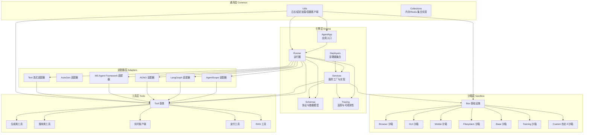
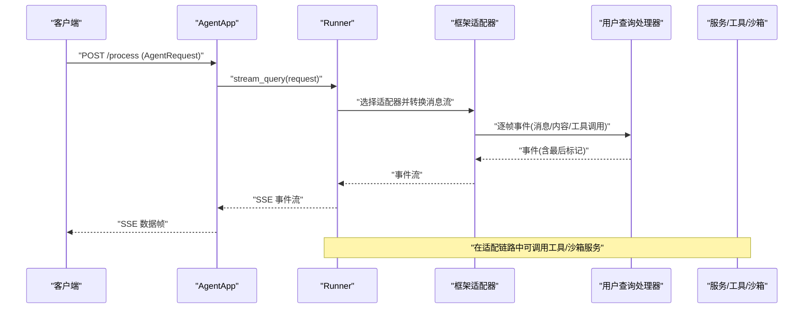
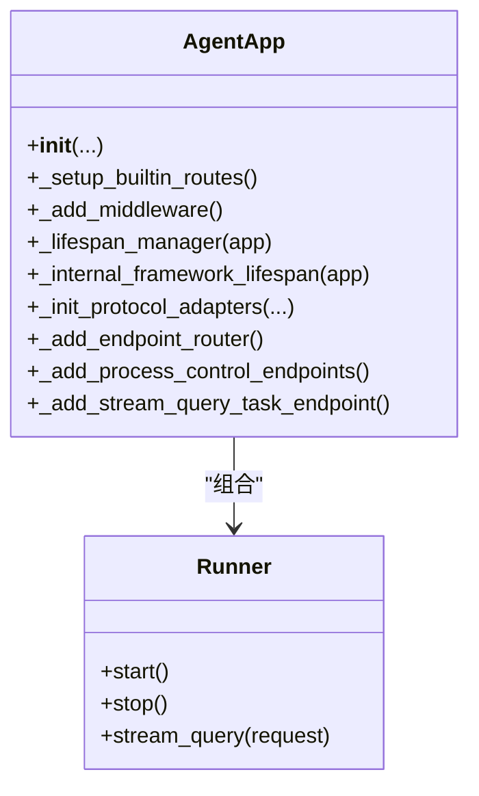
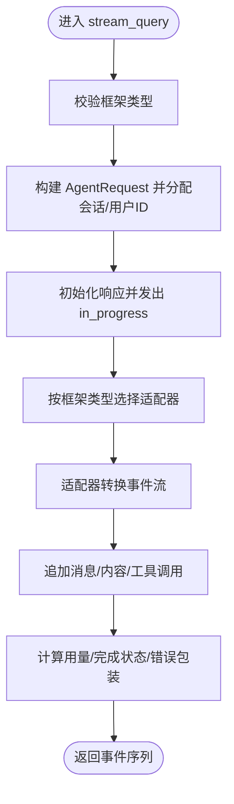
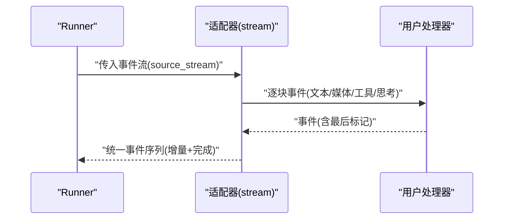
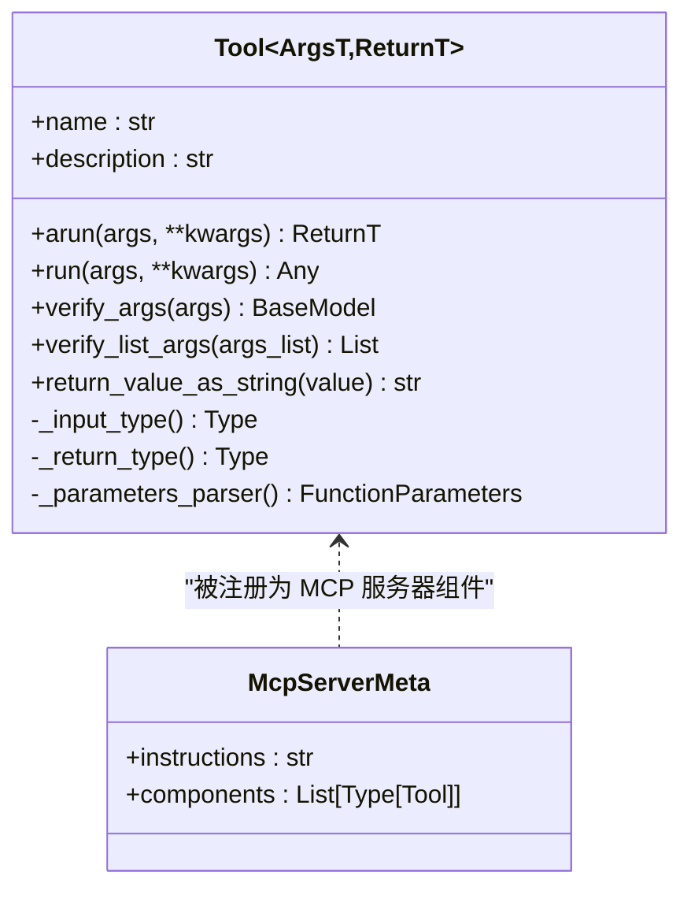
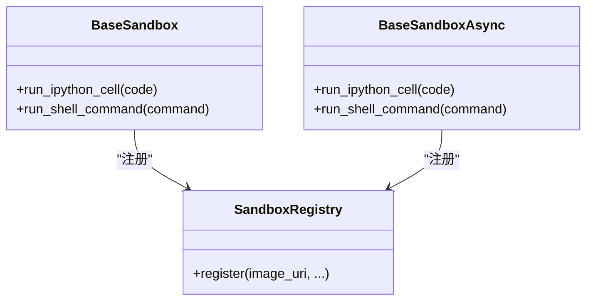
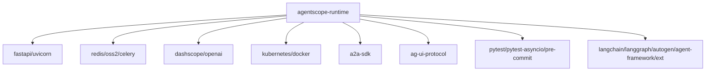

# 项目结构设计

<cite>
**本文引用的文件**
- [src/agentscope_runtime/__init__.py](file://src/agentscope_runtime/__init__.py)
- [src/agentscope_runtime/engine/__init__.py](file://src/agentscope_runtime/engine/__init__.py)
- [src/agentscope_runtime/engine/app/agent_app.py](file://src/agentscope_runtime/engine/app/agent_app.py)
- [src/agentscope_runtime/engine/runner.py](file://src/agentscope_runtime/engine/runner.py)
- [src/agentscope_runtime/engine/deployers/base.py](file://src/agentscope_runtime/engine/deployers/base.py)
- [src/agentscope_runtime/tools/base.py](file://src/agentscope_runtime/tools/base.py)
- [src/agentscope_runtime/tools/__init__.py](file://src/agentscope_runtime/tools/__init__.py)
- [src/agentscope_runtime/adapters/agentscope/stream.py](file://src/agentscope_runtime/adapters/agentscope/stream.py)
- [src/agentscope_runtime/sandbox/__init__.py](file://src/agentscope_runtime/sandbox/__init__.py)
- [src/agentscope_runtime/sandbox/box/base/base_sandbox.py](file://src/agentscope_runtime/sandbox/box/base/base_sandbox.py)
- [src/agentscope_runtime/common/utils/logging.py](file://src/agentscope_runtime/common/utils/logging.py)
- [pyproject.toml](file://pyproject.toml)
- [README.md](file://README.md)
</cite>

## 目录
1. [引言](#引言)
2. [项目结构](#项目结构)
3. [核心组件](#核心组件)
4. [架构总览](#架构总览)
5. [详细组件分析](#详细组件分析)
6. [依赖分析](#依赖分析)
7. [性能考虑](#性能考虑)
8. [故障排查指南](#故障排查指南)
9. [结论](#结论)
10. [附录：项目模板与最佳实践](#附录项目模板与最佳实践)

## 引言
本文件系统化阐述 AgentScope Runtime 的结构设计原则与最佳实践，聚焦 engine、sandbox、tools、adapters 等核心模块的组织方式与设计理念，解释模块间依赖关系与交互模式，并提供可复用的项目模板、标准化结构建议、配置与资源文件组织、命名规范以及按业务需求调整结构的方法。

## 项目结构
AgentScope Runtime 采用“分层+功能域”的混合组织方式：
- 分层：engine（引擎）、sandbox（沙箱）、tools（工具）、adapters（适配器）、common（通用工具）。
- 功能域：每个功能域下再按子模块细分，如 engine 下的 app、deployers、schemas、services、tracing 等；sandbox 下按能力类型划分 base/browser/gui/mobile 等；tools 下按能力域划分 generations/searches/realtime_clients 等。
- 包布局：使用 setuptools 的 find 包扫描，源码位于 src/agentscope_runtime，便于发布为 agentscope-runtime 包。

图表来源
- [src/agentscope_runtime/engine/app/agent_app.py](file://src/agentscope_runtime/engine/app/agent_app.py)
- [src/agentscope_runtime/engine/runner.py](file://src/agentscope_runtime/engine/runner.py)
- [src/agentscope_runtime/engine/deployers/base.py](file://src/agentscope_runtime/engine/deployers/base.py)
- [src/agentscope_runtime/tools/base.py](file://src/agentscope_runtime/tools/base.py)
- [src/agentscope_runtime/adapters/agentscope/stream.py](file://src/agentscope_runtime/adapters/agentscope/stream.py)
- [src/agentscope_runtime/sandbox/box/base/base_sandbox.py](file://src/agentscope_runtime/sandbox/box/base/base_sandbox.py)
- [src/agentscope_runtime/common/utils/logging.py](file://src/agentscope_runtime/common/utils/logging.py)

章节来源
- [pyproject.toml](file://pyproject.toml)
- [README.md](file://README.md)

## 核心组件
- 引擎层（Engine）
  - AgentApp：基于 FastAPI 的应用入口，集成 Runner，支持多协议适配（A2A、Response API、AGUI），内置健康检查、流式任务队列、中断服务等。
  - Runner：统一的执行器，负责框架类型切换、消息流适配、事件序列化、错误包装与追踪埋点。
  - Deployers：抽象部署器接口，具体实现包括本地、K8s、Knative、Kruise、ModelStudio、AgentRun、FC 等。
  - Services：服务工厂与实现，如沙箱服务、状态服务等。
  - Tracing：统一追踪与可观测性，支持事件序列号、完成原因提取、指标与日志。
- 沙箱层（Sandbox）
  - 提供多种沙箱类型（Base、Browser、GUI、Filesystem、Mobile、Training、Agentbay、Cloud），均通过注册表集中注册，便于统一发现与管理。
- 工具层（Tools）
  - Tool 基类提供输入/输出类型校验、参数解析、同步/异步执行、字符串化返回值等能力；内置生成、搜索、实时、支付、RAG 等工具集。
- 适配器层（Adapters）
  - 针对不同框架的消息流与内容块进行转换，如 AgentScope、LangGraph、AGNO、MS Agent Framework、Text 等。

章节来源
- [src/agentscope_runtime/engine/app/agent_app.py](file://src/agentscope_runtime/engine/app/agent_app.py)
- [src/agentscope_runtime/engine/runner.py](file://src/agentscope_runtime/engine/runner.py)
- [src/agentscope_runtime/engine/deployers/base.py](file://src/agentscope_runtime/engine/deployers/base.py)
- [src/agentscope_runtime/sandbox/__init__.py](file://src/agentscope_runtime/sandbox/__init__.py)
- [src/agentscope_runtime/sandbox/box/base/base_sandbox.py](file://src/agentscope_runtime/sandbox/box/base/base_sandbox.py)
- [src/agentscope_runtime/tools/base.py](file://src/agentscope_runtime/tools/base.py)
- [src/agentscope_runtime/tools/__init__.py](file://src/agentscope_runtime/tools/__init__.py)
- [src/agentscope_runtime/adapters/agentscope/stream.py](file://src/agentscope_runtime/adapters/agentscope/stream.py)

## 架构总览
AgentApp 作为应用入口，内部持有 Runner 并通过协议适配器暴露统一的推理端点；Runner 根据框架类型选择对应适配器，将框架消息流转换为统一的事件序列；工具与沙箱通过服务工厂与部署器接入，形成“应用-运行器-适配器-工具/沙箱”的闭环。

图表来源
- [src/agentscope_runtime/engine/app/agent_app.py](file://src/agentscope_runtime/engine/app/agent_app.py)
- [src/agentscope_runtime/engine/runner.py](file://src/agentscope_runtime/engine/runner.py)
- [src/agentscope_runtime/adapters/agentscope/stream.py](file://src/agentscope_runtime/adapters/agentscope/stream.py)

## 详细组件分析

### 组件一：AgentApp（应用入口）
- 设计理念
  - 直接继承 FastAPI，无缝对接 FastAPI 生态；通过生命周期管理统一启动/停止 Runner 与钩子函数。
  - 内置多协议适配器（A2A、Response API、AGUI），自动注入 OpenAPI schema。
  - 支持分布式中断服务、流式任务队列、自定义中间件与路由。
- 关键交互
  - 在 lifespan 中构建 Runner、注册协议端点、启动嵌入式 Celery Worker（可选）、启动过期任务清理协程。
  - 提供健康检查、根路径信息、进程控制（关闭/状态）等内置路由。
- 最佳实践
  - 使用 lifespan 管理资源初始化与清理，避免在装饰器中直接绑定复杂逻辑。
  - 合理设置响应类型（SSE/JSON）与流式开关，结合前端或 SDK 的消费能力。

图表来源
- [src/agentscope_runtime/engine/app/agent_app.py](file://src/agentscope_runtime/engine/app/agent_app.py)
- [src/agentscope_runtime/engine/runner.py](file://src/agentscope_runtime/engine/runner.py)

章节来源
- [src/agentscope_runtime/engine/app/agent_app.py](file://src/agentscope_runtime/engine/app/agent_app.py)

### 组件二：Runner（运行器）
- 设计理念
  - 以框架类型为中心，动态选择适配器，屏蔽不同框架的消息结构差异。
  - 统一事件序列号、消息追加、完成状态与错误包装，确保上层消费一致性。
- 关键流程
  - 输入请求校验与会话/用户 ID 分配。
  - 根据框架类型导入对应适配器，将用户处理器的事件流转换为统一事件序列。
  - 计算用量、聚合最终响应、失败时包装为统一错误对象。
- 最佳实践
  - 明确设置 framework_type，避免非法或未设置导致的运行时异常。
  - 在处理器中遵循“yield msg, last”的约定，保证流式输出的完整性。

图表来源
- [src/agentscope_runtime/engine/runner.py](file://src/agentscope_runtime/engine/runner.py)

章节来源
- [src/agentscope_runtime/engine/runner.py](file://src/agentscope_runtime/engine/runner.py)

### 组件三：适配器（Adapters）
- 设计理念
  - 将不同框架的消息/内容块转换为统一的事件模型（消息、内容、工具调用/结果等），并支持增量与完成标记。
  - 支持自定义类型转换器，扩展非标准内容块的渲染与事件产出。
- 典型流程
  - 解析消息块（文本、思考、图片/音频/视频/文件、工具调用/结果等）。
  - 逐块生成增量事件并在最后合并为完成事件。
  - 对工具调用/结果进行消息体封装与索引管理。

图表来源
- [src/agentscope_runtime/adapters/agentscope/stream.py](file://src/agentscope_runtime/adapters/agentscope/stream.py)

章节来源
- [src/agentscope_runtime/adapters/agentscope/stream.py](file://src/agentscope_runtime/adapters/agentscope/stream.py)

### 组件四：工具（Tools）
- 设计理念
  - Tool 基类提供泛型输入/输出类型约束、参数模式解析、同步/异步执行、字符串化返回值等。
  - 通过 FunctionTool/FunctionParameters 将工具参数映射为 OpenAPI 友好的 schema，便于协议层消费。
- 最佳实践
  - 明确输入/输出 Pydantic 模型，利用类型转换器保证跨框架一致性。
  - 工具方法应幂等或具备可恢复性，配合 Runner 的错误包装与追踪定位问题。

图表来源
- [src/agentscope_runtime/tools/base.py](file://src/agentscope_runtime/tools/base.py)
- [src/agentscope_runtime/tools/__init__.py](file://src/agentscope_runtime/tools/__init__.py)

章节来源
- [src/agentscope_runtime/tools/base.py](file://src/agentscope_runtime/tools/base.py)
- [src/agentscope_runtime/tools/__init__.py](file://src/agentscope_runtime/tools/__init__.py)

### 组件五：沙箱（Sandbox）
- 设计理念
  - 通过注册表集中注册各类沙箱，统一生命周期管理与工具调用接口；提供同步与异步版本，满足并发场景。
  - 按能力域拆分（Base、Browser、GUI、Filesystem、Mobile、Training、Agentbay、Cloud），便于按需启用。
- 最佳实践
  - 在 Agent 应用中通过沙箱工具适配器将沙箱能力注入 Toolkit，实现“安全工具执行”。

图表来源
- [src/agentscope_runtime/sandbox/box/base/base_sandbox.py](file://src/agentscope_runtime/sandbox/box/base/base_sandbox.py)
- [src/agentscope_runtime/sandbox/__init__.py](file://src/agentscope_runtime/sandbox/__init__.py)

章节来源
- [src/agentscope_runtime/sandbox/box/base/base_sandbox.py](file://src/agentscope_runtime/sandbox/box/base/base_sandbox.py)
- [src/agentscope_runtime/sandbox/__init__.py](file://src/agentscope_runtime/sandbox/__init__.py)

## 依赖分析
- 包与脚本
  - 核心包名 agentscope-runtime，使用 setuptools.find_packages 扫描 src；scripts 定义 CLI 入口。
- 外部依赖
  - web：fastapi、uvicorn、a2a-sdk、ag-ui-protocol
  - 通信/存储：redis、oss2、celery[redis]
  - 模型/SDK：dashscope、openai
  - 部署：kubernetes、docker、gunicorn（可选）
  - 开发测试：pytest、pytest-asyncio、pre-commit、fakeredis、sphinx、mermaid
- 可选扩展
  - ext 分组包含 langchain、langgraph、autogen、agent-framework、alipay、azure-cognitiveservices-speech 等生态依赖。

图表来源
- [pyproject.toml](file://pyproject.toml)

章节来源
- [pyproject.toml](file://pyproject.toml)

## 性能考虑
- 流式传输
  - 使用 SSE 输出事件流，降低延迟与内存占用；Runner 在适配器层进行增量事件生成，避免一次性聚合。
- 并发与中断
  - 支持分布式中断服务与本地中断后端，结合流式任务队列与后台清理协程，提升长任务稳定性。
- 资源管理
  - 通过 lifespan 管理 Runner 与服务生命周期，减少重复初始化成本；日志着色与路径简化有助于快速定位问题。
- 部署弹性
  - 多种 DeployManager 实现（本地/K8s/Knative/Kruise/ModelStudio/AgentRun/FC），按环境弹性伸缩。

## 故障排查指南
- 日志与颜色
  - 初始化阶段会设置带颜色的日志格式，便于在终端中快速识别级别与文件位置。
- 错误包装
  - Runner 在适配器抛出异常时，统一包装为 AppBaseException 或 UnknownAgentException，保留原始堆栈信息。
- 健康检查
  - 提供 /health 与根路径信息接口，用于快速判断服务与 Runner 状态。
- 进程控制
  - 提供 /shutdown 与 /admin/shutdown 端点，支持优雅停机与状态查询。

章节来源
- [src/agentscope_runtime/common/utils/logging.py](file://src/agentscope_runtime/common/utils/logging.py)
- [src/agentscope_runtime/engine/runner.py](file://src/agentscope_runtime/engine/runner.py)
- [src/agentscope_runtime/engine/app/agent_app.py](file://src/agentscope_runtime/engine/app/agent_app.py)

## 结论
AgentScope Runtime 通过清晰的分层与功能域划分，实现了“应用-运行器-适配器-工具/沙箱”的解耦协作；以 FastAPI 为入口、Runner 为核心、适配器为桥梁、服务为支撑，既保证了开发体验，也兼顾了生产级的可观测性、可扩展性与安全性。遵循本文的最佳实践与模板，可在不同业务场景下快速落地 Agent-as-a-Service 的稳定实现。

## 附录：项目模板与最佳实践

### 项目模板与标准化结构建议
- 包布局
  - 推荐使用 src/agentscope_runtime 作为包根目录，便于 setuptools 自动发现与发布。
  - 按功能域划分子包：engine、sandbox、tools、adapters、common、cli、web 等。
- 配置文件管理
  - 使用 pydantic-settings 与 python-dotenv 管理环境变量与配置文件，区分 dev/prod/test。
  - CLI 提供配置加载与验证（如示例中的 agent_loader），确保部署一致性。
- 资源文件组织
  - 模板与静态资源放置于包内 data 目录，通过包数据声明 include-package-data 与 package-data。
- 命名规范
  - 模块/类：采用帕斯卡命名法；常量使用全大写；私有成员以下划线前缀。
  - 文件：小写短横线命名，避免空格与特殊字符。
  - 包名：agentscope-runtime，遵循 PyPI 规范。

### 如何根据业务需求调整项目结构
- 轻量化场景
  - 仅保留 engine 与 tools，移除不使用的沙箱与适配器子模块，减少安装体积。
- 多框架集成
  - 在 adapters 下新增框架适配器，Runner 中按 framework_type 分支引入；保持事件流转换一致。
- 安全与合规
  - 将敏感工具放入沙箱执行，通过 sandbox_tool_adapter 注入 Toolkit；在 Runner 中开启中断服务与超时控制。
- 部署策略
  - 本地开发使用 LocalDeployManager；生产优先 K8s/Knative/Kruise；边缘/低延迟场景可考虑 FC/ModelStudio。
- 可观测性
  - 在 Runner 中启用 tracing，结合统一的事件序列号与完成原因提取，便于审计与排障。

章节来源
- [pyproject.toml](file://pyproject.toml)
- [README.md](file://README.md)