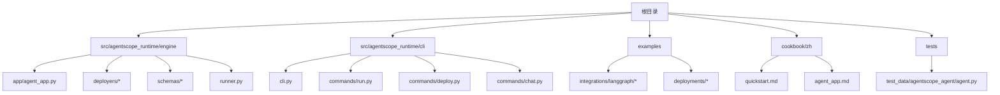
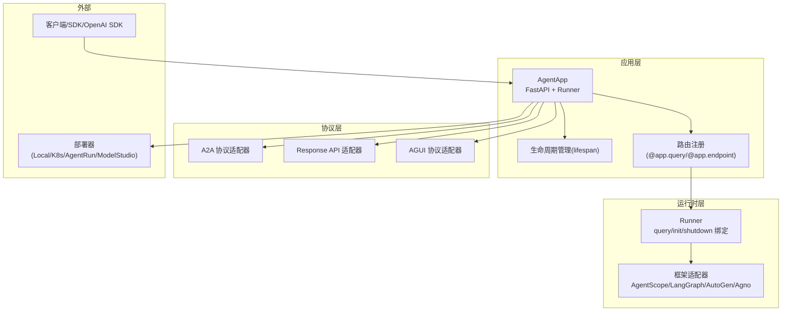
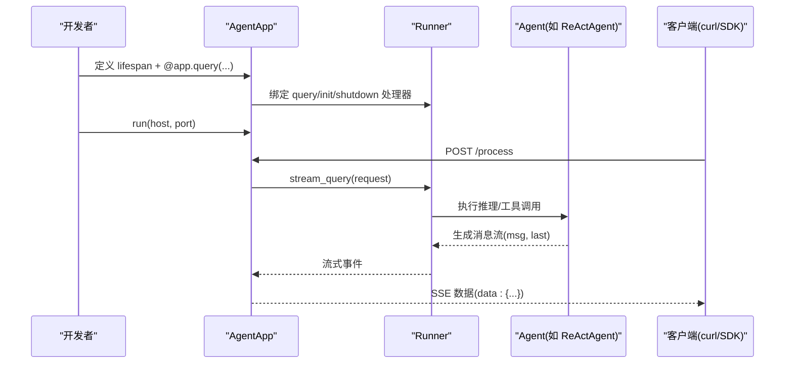
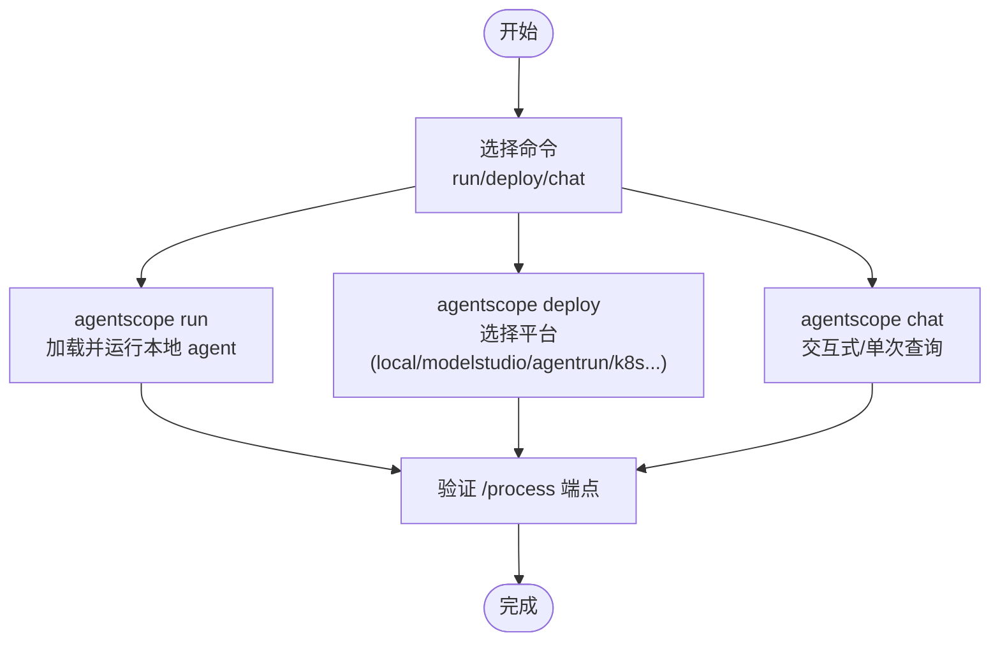
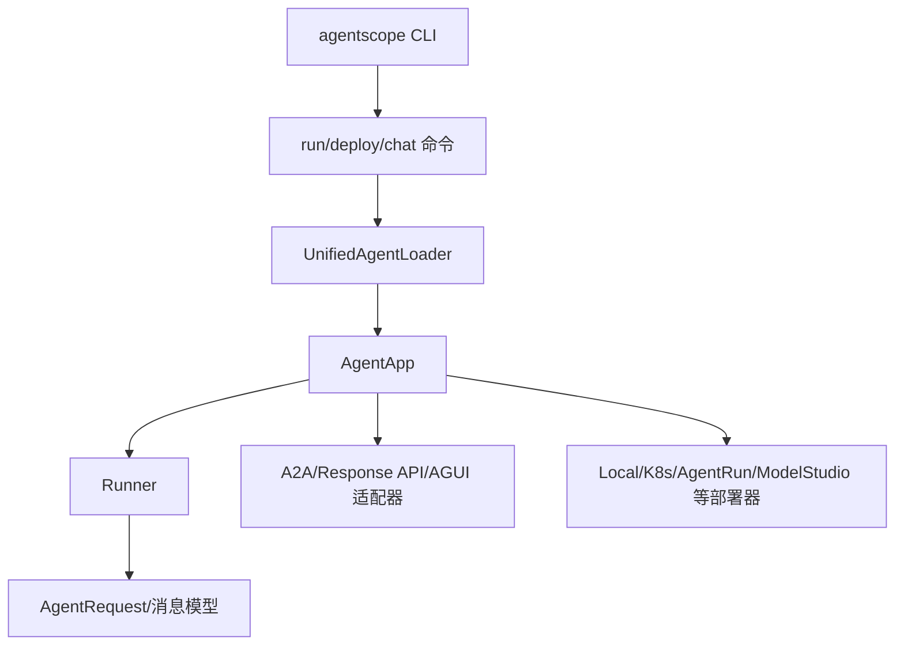

# 快速开始教程

<cite>
**本文引用的文件**
- [README.md](file://README.md)
- [agent_app.py](file://src/agentscope_runtime/engine/app/agent_app.py)
- [cli.py](file://src/agentscope_runtime/cli/cli.py)
- [run.py](file://src/agentscope_runtime/cli/commands/run.py)
- [deploy.py](file://src/agentscope_runtime/cli/commands/deploy.py)
- [chat.py](file://src/agentscope_runtime/cli/commands/chat.py)
- [quickstart.md](file://cookbook/zh/quickstart.md)
- [agent_app.md](file://cookbook/zh/agent_app.md)
- [run_langgraph_agent.py](file://examples/integrations/langgraph/run_langgraph_agent.py)
- [my_tools.py](file://examples/integrations/langgraph/my_tools.py)
- [local_deploy_config.yaml](file://examples/deployments/local_deploy_config.yaml)
- [agentrun_deploy_config.yaml](file://examples/deployments/agentrun_deploy_config.yaml)
- [agent.py](file://tests/test_data/agentscope_agent/agent.py)
</cite>

## 目录
1. [简介](#简介)
2. [项目结构](#项目结构)
3. [核心组件](#核心组件)
4. [架构总览](#架构总览)
5. [详细组件分析](#详细组件分析)
6. [依赖关系分析](#依赖关系分析)
7. [性能考虑](#性能考虑)
8. [故障排查指南](#故障排查指南)
9. [结论](#结论)
10. [附录](#附录)

## 简介
本教程面向首次接触 AgentScope Runtime 的开发者，提供从零到一的完整开发流程：创建第一个智能体应用、配置、本地运行、部署与测试。重点覆盖 AgentApp 的基本使用方法（初始化、注册工具、处理请求、启动服务），并通过 agentscope CLI 命令进行本地开发与部署。教程同时给出可直接运行的示例代码路径与详细注释说明，并总结常见开发场景与最佳实践。

## 项目结构
AgentScope Runtime 采用模块化设计，核心能力集中在 engine、cli、sandbox、tools 等子包中。下图展示与“快速开始”最相关的目录与文件：

图表来源
- [agent_app.py](file://src/agentscope_runtime/engine/app/agent_app.py)
- [cli.py](file://src/agentscope_runtime/cli/cli.py)
- [run.py](file://src/agentscope_runtime/cli/commands/run.py)
- [deploy.py](file://src/agentscope_runtime/cli/commands/deploy.py)
- [chat.py](file://src/agentscope_runtime/cli/commands/chat.py)
- [quickstart.md](file://cookbook/zh/quickstart.md)
- [agent_app.md](file://cookbook/zh/agent_app.md)
- [run_langgraph_agent.py](file://examples/integrations/langgraph/run_langgraph_agent.py)
- [my_tools.py](file://examples/integrations/langgraph/my_tools.py)
- [local_deploy_config.yaml](file://examples/deployments/local_deploy_config.yaml)
- [agentrun_deploy_config.yaml](file://examples/deployments/agentrun_deploy_config.yaml)
- [agent.py](file://tests/test_data/agentscope_agent/agent.py)

章节来源
- [README.md](file://README.md)
- [quickstart.md](file://cookbook/zh/quickstart.md)

## 核心组件
- AgentApp：基于 FastAPI 的智能体应用封装器，提供生命周期管理、流式输出（SSE）、协议适配（A2A/Response API/AGUI）、任务中断与恢复、内置健康检查等能力。
- CLI：agentscope 命令行工具，提供 run、deploy、chat、list、status、stop、invoke、sandbox 等子命令，覆盖本地开发、部署与运维全流程。
- Runner：内部运行器，承载 query/init/shutdown 等处理器绑定，负责与 Agent 框架（如 AgentScope、LangGraph、AutoGen、Agno）对接。
- Schema：统一的 AgentRequest、消息与内容模型，保证跨协议的一致性输入输出。

章节来源
- [agent_app.py](file://src/agentscope_runtime/engine/app/agent_app.py)
- [cli.py](file://src/agentscope_runtime/cli/cli.py)
- [agent_app.md](file://cookbook/zh/agent_app.md)

## 架构总览
AgentApp 继承自 FastAPI，结合 Runner 与协议适配器，形成“应用服务 + 框架适配 + 协议扩展”的三层架构。下图展示关键交互：

图表来源
- [agent_app.py](file://src/agentscope_runtime/engine/app/agent_app.py)
- [agent_app.md](file://cookbook/zh/agent_app.md)

## 详细组件分析

### AgentApp 基础使用
- 初始化与生命周期
  - 使用 lifespan 管理 RedisSession 等资源；也可通过 before_start/after_finish 注入启动/收尾逻辑。
  - 参考：[quickstart 示例](file://cookbook/zh/quickstart.md)，[AgentApp 生命周期说明](file://cookbook/zh/agent_app.md)
- 注册查询处理
  - 使用 @agent_app.query(framework="agentscope") 注册处理函数，返回流式消息元组 (msg, last)。
  - 参考：[query 装饰器与框架支持](file://src/agentscope_runtime/engine/app/agent_app.py)，[示例实现](file://cookbook/zh/quickstart.md)
- 启动服务
  - 调用 agent_app.run(host, port) 启动 HTTP 服务，默认提供 /process、/health 等端点。
  - 参考：[README 中的示例与端点说明](file://README.md)

图表来源
- [agent_app.py](file://src/agentscope_runtime/engine/app/agent_app.py)
- [quickstart.md](file://cookbook/zh/quickstart.md)

章节来源
- [agent_app.py](file://src/agentscope_runtime/engine/app/agent_app.py)
- [quickstart.md](file://cookbook/zh/quickstart.md)
- [README.md](file://README.md)

### 工具注册与状态管理
- 工具注册
  - 使用 Toolkit.register_tool_function 注册工具函数（如执行 Python 代码）。
  - 参考：[工具注册示例](file://cookbook/zh/quickstart.md)
- 状态管理
  - 使用 RedisSession.load/save_session_state 持久化会话状态，确保多轮对话一致性。
  - 参考：[状态加载/保存](file://cookbook/zh/quickstart.md)

章节来源
- [quickstart.md](file://cookbook/zh/quickstart.md)

### 流式输出（SSE）
- AgentApp 默认开启流式输出（response_type="sse", stream=True），客户端通过 SSE 接收增量内容。
- 参考：[SSE 示例与格式](file://README.md)，[AgentApp 流式说明](file://cookbook/zh/agent_app.md)

章节来源
- [README.md](file://README.md)
- [agent_app.md](file://cookbook/zh/agent_app.md)

### 任务中断与恢复
- AgentApp 支持分布式中断（Redis 后端），在长耗时任务中可优雅取消并保存状态。
- 参考：[中断配置与处理](file://cookbook/zh/agent_app.md)

章节来源
- [agent_app.md](file://cookbook/zh/agent_app.md)

### 部署与测试
- 本地部署
  - 使用 LocalDeployManager 或 agentscope deploy local，支持配置 host/port/entrypoint/environment。
  - 参考：[本地部署示例](file://README.md)，[deploy 命令实现](file://src/agentscope_runtime/cli/commands/deploy.py)，[配置样例](file://examples/deployments/local_deploy_config.yaml)
- 云端部署
  - 支持 ModelStudio、AgentRun、K8s、Knative、Kruise 等平台，按需选择 deploy 子命令。
  - 参考：[deploy 命令实现](file://src/agentscope_runtime/cli/commands/deploy.py)，[AgentRun 配置样例](file://examples/deployments/agentrun_deploy_config.yaml)
- 测试与验证
  - 使用 curl 或 OpenAI SDK 调用 /process 端点，验证流式输出与协议兼容。
  - 参考：[README 中的 curl 示例](file://README.md)

章节来源
- [README.md](file://README.md)
- [deploy.py](file://src/agentscope_runtime/cli/commands/deploy.py)
- [local_deploy_config.yaml](file://examples/deployments/local_deploy_config.yaml)
- [agentrun_deploy_config.yaml](file://examples/deployments/agentrun_deploy_config.yaml)

### CLI 命令详解
- agentscope run
  - 用途：直接运行本地 agent 文件或目录，支持 host/port/entrypoint/verbose。
  - 参考：[run 命令实现](file://src/agentscope_runtime/cli/commands/run.py)
- agentscope deploy
  - 用途：将 agent 部署到本地或云端平台，支持多种子命令（local/modelstudio/agentrun/k8s/knative/kruise）。
  - 参考：[deploy 命令实现](file://src/agentscope_runtime/cli/commands/deploy.py)
- agentscope chat
  - 用途：交互式或单次查询 agent，支持本地加载与部署实例访问。
  - 参考：[chat 命令实现](file://src/agentscope_runtime/cli/commands/chat.py)

图表来源
- [cli.py](file://src/agentscope_runtime/cli/cli.py)
- [run.py](file://src/agentscope_runtime/cli/commands/run.py)
- [deploy.py](file://src/agentscope_runtime/cli/commands/deploy.py)
- [chat.py](file://src/agentscope_runtime/cli/commands/chat.py)

章节来源
- [cli.py](file://src/agentscope_runtime/cli/cli.py)
- [run.py](file://src/agentscope_runtime/cli/commands/run.py)
- [deploy.py](file://src/agentscope_runtime/cli/commands/deploy.py)
- [chat.py](file://src/agentscope_runtime/cli/commands/chat.py)

### 多框架集成示例
- AgentScope
  - 参考：[示例 agent.py](file://tests/test_data/agentscope_agent/agent.py)
- LangGraph
  - 参考：[run_langgraph_agent.py](file://examples/integrations/langgraph/run_langgraph_agent.py)，[my_tools.py](file://examples/integrations/langgraph/my_tools.py)

章节来源
- [agent.py](file://tests/test_data/agentscope_agent/agent.py)
- [run_langgraph_agent.py](file://examples/integrations/langgraph/run_langgraph_agent.py)
- [my_tools.py](file://examples/integrations/langgraph/my_tools.py)

## 依赖关系分析
AgentApp 与 CLI、Runner、Schema、协议适配器之间的依赖关系如下：

图表来源
- [cli.py](file://src/agentscope_runtime/cli/cli.py)
- [run.py](file://src/agentscope_runtime/cli/commands/run.py)
- [deploy.py](file://src/agentscope_runtime/cli/commands/deploy.py)
- [chat.py](file://src/agentscope_runtime/cli/commands/chat.py)
- [agent_app.py](file://src/agentscope_runtime/engine/app/agent_app.py)

章节来源
- [agent_app.py](file://src/agentscope_runtime/engine/app/agent_app.py)
- [cli.py](file://src/agentscope_runtime/cli/cli.py)

## 性能考虑
- 流式输出（SSE）适合长文本生成与逐步反馈，避免一次性大响应导致延迟。
- 合理设置任务超时与清理策略，避免长时间运行任务占用资源。
- 在生产环境使用 Redis 中断后端，支持分布式任务中断与状态同步。
- 选择合适的部署模式（本地/容器/K8s/Serverless），平衡弹性与成本。

## 故障排查指南
- 端点无法访问
  - 检查是否正确注册 @app.query；确认 run(host, port) 是否生效。
  - 参考：[AgentApp 端点说明](file://cookbook/zh/agent_app.md)
- 流式输出异常
  - 确认客户端使用正确的 Accept: text/event-stream；检查服务端日志与 TRACE_ENABLE_LOG。
  - 参考：[SSE 示例](file://README.md)
- 部署失败
  - 检查配置文件（如 local_deploy_config.yaml）与环境变量；查看 deploy 命令输出。
  - 参考：[deploy 命令实现](file://src/agentscope_runtime/cli/commands/deploy.py)，[配置样例](file://examples/deployments/local_deploy_config.yaml)

章节来源
- [agent_app.md](file://cookbook/zh/agent_app.md)
- [README.md](file://README.md)
- [deploy.py](file://src/agentscope_runtime/cli/commands/deploy.py)
- [local_deploy_config.yaml](file://examples/deployments/local_deploy_config.yaml)

## 结论
通过本教程，你已经掌握了 AgentScope Runtime 的核心使用方式：从 AgentApp 初始化、工具注册、请求处理到服务启动与部署测试。配合 agentscope CLI，你可以高效完成本地开发与多平台部署。建议在实际项目中结合状态管理、任务中断与多框架适配，进一步提升系统的可维护性与扩展性。

## 附录

### 可直接运行的完整示例（路径与说明）
- AgentScope 快速开始示例
  - [示例脚本路径](file://cookbook/zh/quickstart.md)
  - 包含：生命周期管理、Agent 构建、工具注册、流式输出、状态持久化、服务启动与 curl 测试
- LangGraph 集成示例
  - [主入口](file://examples/integrations/langgraph/run_langgraph_agent.py)
  - [工具定义](file://examples/integrations/langgraph/my_tools.py)
- 测试数据示例（AgentScope）
  - [示例 agent.py](file://tests/test_data/agentscope_agent/agent.py)

章节来源
- [quickstart.md](file://cookbook/zh/quickstart.md)
- [run_langgraph_agent.py](file://examples/integrations/langgraph/run_langgraph_agent.py)
- [my_tools.py](file://examples/integrations/langgraph/my_tools.py)
- [agent.py](file://tests/test_data/agentscope_agent/agent.py)