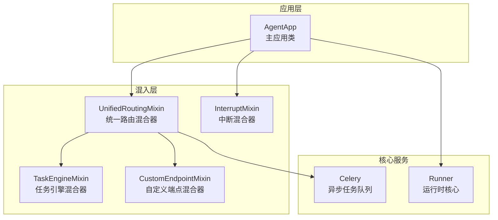
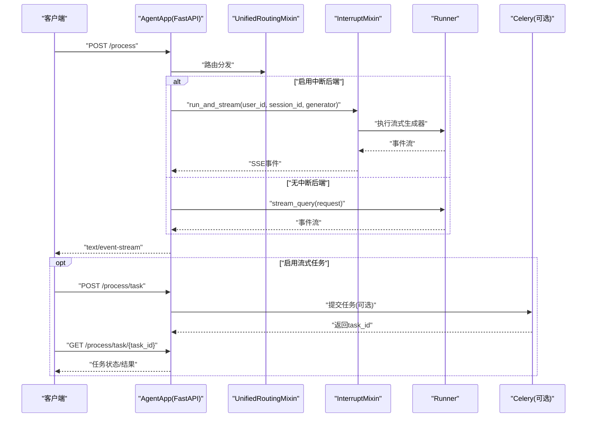
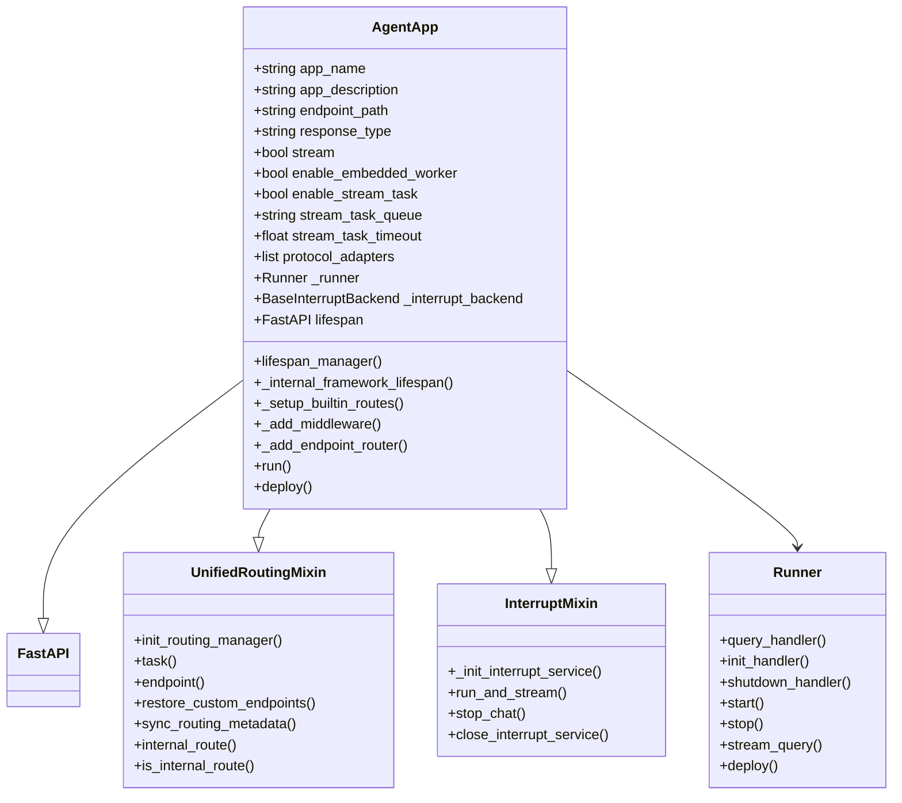
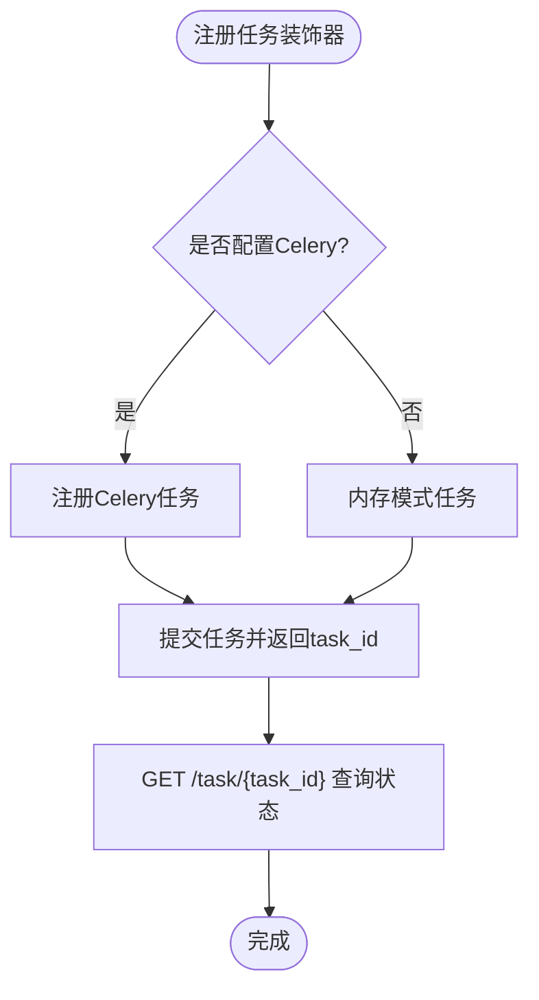
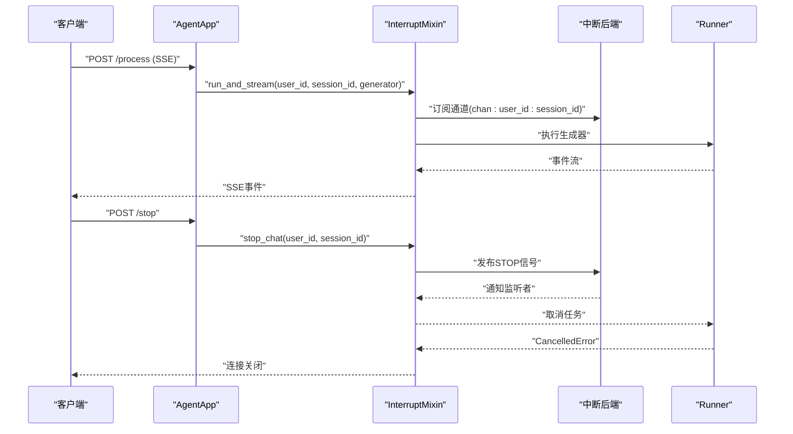
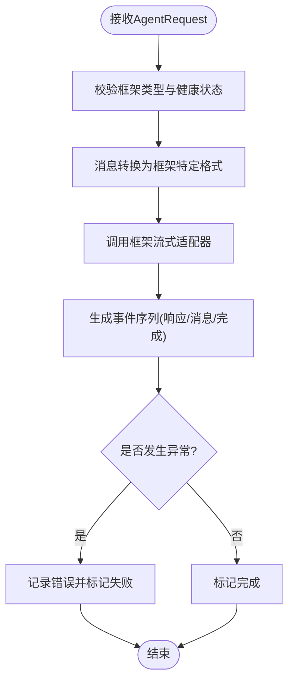
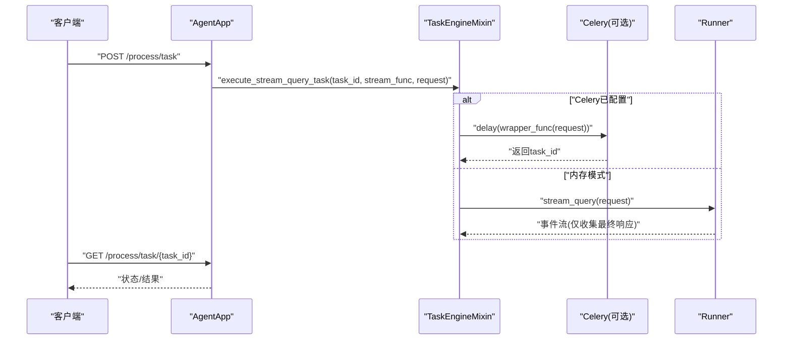
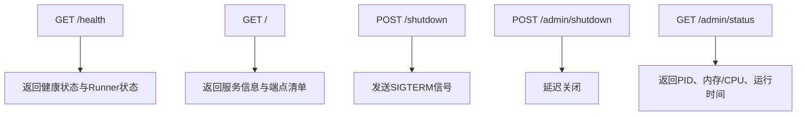
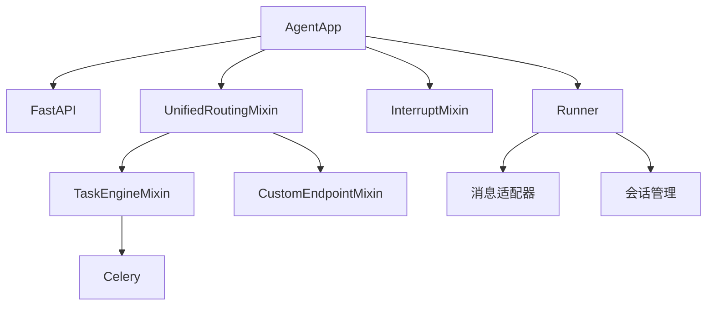

# AgentApp应用框架

<cite>
**本文档引用的文件**
- [agent_app.py](file://src/agentscope_runtime/engine/app/agent_app.py)
- [unified_routing_mixin.py](file://src/agentscope_runtime/engine/deployers/utils/service_utils/routing/unified_routing_mixin.py)
- [interrupt_mixin.py](file://src/agentscope_runtime/engine/deployers/utils/service_utils/interrupt/interrupt_mixin.py)
- [task_engine_mixin.py](file://src/agentscope_runtime/engine/deployers/utils/service_utils/routing/task_engine_mixin.py)
- [custom_endpoint_mixin.py](file://src/agentscope_runtime/engine/deployers/utils/service_utils/routing/custom_endpoint_mixin.py)
- [runner.py](file://src/agentscope_runtime/engine/runner.py)
- [celery_mixin.py](file://src/agentscope_runtime/engine/app/celery_mixin.py)
- [test_agent_app.py](file://tests/integrated/test_agent_app.py)
- [run_langgraph_agent.py](file://examples/integrations/langgraph/run_langgraph_agent.py)
- [agent_app.md](file://cookbook/en/agent_app.md)
</cite>

## 目录
1. [简介](#简介)
2. [项目结构](#项目结构)
3. [核心组件](#核心组件)
4. [架构总览](#架构总览)
5. [详细组件分析](#详细组件分析)
6. [依赖关系分析](#依赖关系分析)
7. [性能考虑](#性能考虑)
8. [故障排除指南](#故障排除指南)
9. [结论](#结论)
10. [附录](#附录)

## 简介
AgentApp是AgentScope Runtime中的全栈应用服务封装器，基于FastAPI构建，专为智能体应用提供统一的HTTP服务框架。它不仅继承了FastAPI的完整生态能力（路由注册、中间件、生命周期管理），还深度集成了运行时特有的功能：流式响应（SSE）、任务中断管理、内置健康检查端点、可选的Celery异步任务队列以及部署到本地或远程环境的能力。

AgentApp的核心设计目标是在保持高灵活性的同时，为智能体业务场景提供开箱即用的增强特性，包括统一的协议适配、会话状态管理、分布式中断控制和生产级的部署工具链。

## 项目结构
AgentApp位于引擎模块的app目录下，围绕其展开的是一系列混入（Mixin）类，分别负责路由管理、任务执行、中断控制和自定义端点处理。这些混入与Runner协同工作，形成完整的应用生命周期管理。

**图表来源**
- [agent_app.py:60-220](file://src/agentscope_runtime/engine/app/agent_app.py#L60-L220)
- [unified_routing_mixin.py:16-253](file://src/agentscope_runtime/engine/deployers/utils/service_utils/routing/unified_routing_mixin.py#L16-L253)
- [interrupt_mixin.py:8-151](file://src/agentscope_runtime/engine/deployers/utils/service_utils/interrupt/interrupt_mixin.py#L8-L151)
- [task_engine_mixin.py:13-391](file://src/agentscope_runtime/engine/deployers/utils/service_utils/routing/task_engine_mixin.py#L13-L391)
- [custom_endpoint_mixin.py:15-235](file://src/agentscope_runtime/engine/deployers/utils/service_utils/routing/custom_endpoint_mixin.py#L15-L235)
- [runner.py:46-356](file://src/agentscope_runtime/engine/runner.py#L46-L356)

**章节来源**
- [agent_app.py:60-220](file://src/agentscope_runtime/engine/app/agent_app.py#L60-L220)
- [unified_routing_mixin.py:16-253](file://src/agentscope_runtime/engine/deployers/utils/service_utils/routing/unified_routing_mixin.py#L16-L253)
- [interrupt_mixin.py:8-151](file://src/agentscope_runtime/engine/deployers/utils/service_utils/interrupt/interrupt_mixin.py#L8-L151)
- [task_engine_mixin.py:13-391](file://src/agentscope_runtime/engine/deployers/utils/service_utils/routing/task_engine_mixin.py#L13-L391)
- [custom_endpoint_mixin.py:15-235](file://src/agentscope_runtime/engine/deployers/utils/service_utils/routing/custom_endpoint_mixin.py#L15-L235)
- [runner.py:46-356](file://src/agentscope_runtime/engine/runner.py#L46-L356)

## 核心组件
- AgentApp：继承FastAPI，集成Runner、协议适配器、生命周期管理、内置路由和中间件。支持流式输出、任务中断、健康检查、进程控制端点以及可选的Celery任务队列。
- 统一路由混合器（UnifiedRoutingMixin）：提供任务装饰器、自定义端点注册、路由元数据同步与恢复、系统内部路由标记等功能。
- 中断混合器（InterruptMixin）：提供分布式中断管理，支持Redis或本地后端，确保同一会话的并发安全和优雅取消。
- 任务引擎混合器（TaskEngineMixin）：封装Celery任务注册、嵌入式工作进程、后台任务执行、任务状态查询与超时控制。
- 自定义端点混合器（CustomEndpointMixin）：为非Agent请求提供便捷的端点注册与参数解析，支持同步/异步/生成器函数自动包装为SSE响应。
- Runner：智能体运行时核心，负责处理查询、流式输出、框架类型适配、会话状态管理和资源清理。

**章节来源**
- [agent_app.py:60-220](file://src/agentscope_runtime/engine/app/agent_app.py#L60-L220)
- [unified_routing_mixin.py:16-253](file://src/agentscope_runtime/engine/deployers/utils/service_utils/routing/unified_routing_mixin.py#L16-L253)
- [interrupt_mixin.py:8-151](file://src/agentscope_runtime/engine/deployers/utils/service_utils/interrupt/interrupt_mixin.py#L8-L151)
- [task_engine_mixin.py:13-391](file://src/agentscope_runtime/engine/deployers/utils/service_utils/routing/task_engine_mixin.py#L13-L391)
- [custom_endpoint_mixin.py:15-235](file://src/agentscope_runtime/engine/deployers/utils/service_utils/routing/custom_endpoint_mixin.py#L15-L235)
- [runner.py:46-356](file://src/agentscope_runtime/engine/runner.py#L46-L356)

## 架构总览
AgentApp通过多继承的方式将FastAPI与多个功能混合器组合，形成一个高度模块化的应用框架。其核心交互流程如下：

**图表来源**
- [agent_app.py:643-703](file://src/agentscope_runtime/engine/app/agent_app.py#L643-L703)
- [interrupt_mixin.py:38-139](file://src/agentscope_runtime/engine/deployers/utils/service_utils/interrupt/interrupt_mixin.py#L38-L139)
- [runner.py:199-356](file://src/agentscope_runtime/engine/runner.py#L199-L356)
- [task_engine_mixin.py:117-391](file://src/agentscope_runtime/engine/deployers/utils/service_utils/routing/task_engine_mixin.py#L117-L391)

## 详细组件分析

### AgentApp类设计与生命周期
AgentApp继承FastAPI并融合多个混合器，提供统一的应用生命周期管理。其关键特性包括：
- 构造参数：支持应用名称、描述、端点路径、响应类型、流式开关、请求模型、启动/关闭钩子、Broker/Backend URL、Runner实例、嵌入式工作进程、流式任务开关、协议适配器、自定义端点等。
- 生命周期管理：通过内部框架生命周期与用户提供的lifespan组合，确保Runner初始化、协议适配器挂载、中断服务准备、嵌入式Celery工作进程启动、任务清理协程等步骤有序执行。
- 协议适配器：默认初始化A2A、ResponseAPI、AGUI三种适配器，用于扩展不同协议的API接口。
- 内置路由：提供健康检查、根路径信息、进程控制端点等系统级接口。
- 中间件：添加CORS中间件，并根据部署模式动态设置响应头以标识进程模式。

**图表来源**
- [agent_app.py:60-220](file://src/agentscope_runtime/engine/app/agent_app.py#L60-L220)
- [unified_routing_mixin.py:16-253](file://src/agentscope_runtime/engine/deployers/utils/service_utils/routing/unified_routing_mixin.py#L16-L253)
- [interrupt_mixin.py:8-151](file://src/agentscope_runtime/engine/deployers/utils/service_utils/interrupt/interrupt_mixin.py#L8-L151)
- [runner.py:46-356](file://src/agentscope_runtime/engine/runner.py#L46-L356)

**章节来源**
- [agent_app.py:124-339](file://src/agentscope_runtime/engine/app/agent_app.py#L124-L339)
- [agent_app.py:382-425](file://src/agentscope_runtime/engine/app/agent_app.py#L382-L425)
- [agent_app.py:359-381](file://src/agentscope_runtime/engine/app/agent_app.py#L359-L381)
- [agent_app.py:781-846](file://src/agentscope_runtime/engine/app/agent_app.py#L781-L846)

### 统一路由混合器（UnifiedRoutingMixin）
UnifiedRoutingMixin负责应用的路由管理与任务编排，主要功能：
- 任务装饰器：通过@task装饰器注册异步任务端点，支持Celery或内存模式的任务提交与状态查询。
- 自定义端点：通过@endpoint装饰器注册普通业务端点，自动处理参数解析与SSE响应包装。
- 路由元数据：同步当前路由表，过滤内部系统路由，生成可用于发现的自定义端点列表。
- 系统内部路由标记：通过@internal_route标记内部系统路由，避免被路由发现暴露给外部。

**图表来源**
- [unified_routing_mixin.py:25-101](file://src/agentscope_runtime/engine/deployers/utils/service_utils/routing/unified_routing_mixin.py#L25-L101)
- [task_engine_mixin.py:112-160](file://src/agentscope_runtime/engine/deployers/utils/service_utils/routing/task_engine_mixin.py#L112-L160)

**章节来源**
- [unified_routing_mixin.py:16-253](file://src/agentscope_runtime/engine/deployers/utils/service_utils/routing/unified_routing_mixin.py#L16-L253)
- [task_engine_mixin.py:13-391](file://src/agentscope_runtime/engine/deployers/utils/service_utils/routing/task_engine_mixin.py#L13-L391)

### 中断混合器（InterruptMixin）
InterruptMixin提供分布式中断管理能力，确保长任务在多节点环境下也能被精确控制：
- 中断后端：支持Redis或本地后端，通过compare-and-set保证同一会话的并发安全。
- 任务执行：run_and_stream包装生成器，监听中断信号并在取消时进行资源清理与状态更新。
- 停止接口：stop_chat广播停止信号，触发对应会话的取消。
- 关闭服务：统一关闭底层中断后端连接。

**图表来源**
- [interrupt_mixin.py:38-139](file://src/agentscope_runtime/engine/deployers/utils/service_utils/interrupt/interrupt_mixin.py#L38-L139)
- [agent_app.py:669-688](file://src/agentscope_runtime/engine/app/agent_app.py#L669-L688)

**章节来源**
- [interrupt_mixin.py:8-151](file://src/agentscope_runtime/engine/deployers/utils/service_utils/interrupt/interrupt_mixin.py#L8-L151)
- [agent_app.py:643-688](file://src/agentscope_runtime/engine/app/agent_app.py#L643-L688)

### Runner运行时核心
Runner是AgentApp的核心执行单元，负责：
- 查询处理：根据框架类型（agentscope、langgraph、agno等）选择对应的流式适配器，将用户消息转换为框架特定的消息格式。
- 流式输出：统一产生事件序列，包含响应创建、进行中、消息、完成等阶段，支持错误捕获与状态回传。
- 框架适配：针对不同框架提供消息转换与流式适配，确保上层Agent逻辑与底层模型调用解耦。
- 资源管理：通过start/stop生命周期管理模型加载、会话状态保存与清理。

**图表来源**
- [runner.py:199-356](file://src/agentscope_runtime/engine/runner.py#L199-L356)

**章节来源**
- [runner.py:46-356](file://src/agentscope_runtime/engine/runner.py#L46-L356)

### 流式查询任务端点实现
AgentApp支持将stream_query作为后台任务执行，提供“提交后轮询”的能力：
- 任务提交：POST /process/task，返回task_id；若配置Celery则提交到队列，否则在内存中异步执行。
- 状态查询：GET /process/task/{task_id}，返回任务状态与最终结果。
- 设计要点：仅存储最终响应，忽略中间事件以降低内存占用；支持超时控制与错误处理；支持嵌入式Celery工作进程。

**图表来源**
- [agent_app.py:497-597](file://src/agentscope_runtime/engine/app/agent_app.py#L497-L597)
- [task_engine_mixin.py:241-347](file://src/agentscope_runtime/engine/deployers/utils/service_utils/routing/task_engine_mixin.py#L241-L347)

**章节来源**
- [agent_app.py:497-597](file://src/agentscope_runtime/engine/app/agent_app.py#L497-L597)
- [task_engine_mixin.py:241-347](file://src/agentscope_runtime/engine/deployers/utils/service_utils/routing/task_engine_mixin.py#L241-L347)

### 健康检查端点与根路径信息
AgentApp提供以下内置端点：
- GET /health：返回服务健康状态、部署模式、Runner就绪状态等信息。
- GET /：返回服务信息、部署模式与可用端点清单（包含/process、/process/stream、/process/task等）。
- 进程控制端点：/shutdown（简单关闭）、/admin/shutdown（延迟关闭）、/admin/status（进程状态信息）。

**图表来源**
- [agent_app.py:382-425](file://src/agentscope_runtime/engine/app/agent_app.py#L382-L425)
- [agent_app.py:598-642](file://src/agentscope_runtime/engine/app/agent_app.py#L598-L642)

**章节来源**
- [agent_app.py:382-425](file://src/agentscope_runtime/engine/app/agent_app.py#L382-L425)
- [agent_app.py:598-642](file://src/agentscope_runtime/engine/app/agent_app.py#L598-L642)

### 使用示例与最佳实践
以下示例展示了如何使用AgentApp创建智能体应用，包括配置选项、装饰器使用和错误处理策略：

- 基础示例（ReActAgent + Agentscope）
  - 使用@agent_app.query(framework="agentscope")注册查询处理函数，结合会话状态管理与工具包。
  - 通过lifespan注入Redis会话服务，实现跨请求的状态持久化。
  - 支持流式输出与中断控制，中断时保存状态并优雅退出。

- LangGraph集成示例
  - 使用@agent_app.query(framework="langgraph")注册LangGraph代理，支持检查点与长期记忆。
  - 通过@agent_app.endpoint定义自定义端点，查询短期/长期记忆状态。
  - 展示了自定义端点混合器对生成器函数的SSE自动包装能力。

- 错误处理策略
  - 在流式处理器中捕获CancelledError并手动中断底层Agent，确保状态一致性。
  - 使用统一的异常包装机制，将未知异常转换为标准错误响应。
  - 对于任务超时与无事件情况，提供明确的错误信息与状态码。

**章节来源**
- [test_agent_app.py:25-88](file://tests/integrated/test_agent_app.py#L25-L88)
- [run_langgraph_agent.py:29-172](file://examples/integrations/langgraph/run_langgraph_agent.py#L29-L172)
- [agent_app.md:156-234](file://cookbook/en/agent_app.md#L156-L234)
- [agent_app.md:301-444](file://cookbook/en/agent_app.md#L301-L444)
- [agent_app.md:639-745](file://cookbook/en/agent_app.md#L639-L745)

## 依赖关系分析
AgentApp的依赖关系体现了清晰的分层与低耦合设计：
- AgentApp依赖FastAPI作为Web框架基座，同时组合多个混合器以获得特定功能。
- UnifiedRoutingMixin依赖TaskEngineMixin与CustomEndpointMixin，提供任务与端点管理能力。
- InterruptMixin独立于Web框架，专注于分布式中断控制，可与任何后端集成。
- Runner作为核心执行单元，依赖多种适配器与消息转换器，实现多框架兼容。
- CeleryMixin已被废弃，迁移至TaskEngineMixin，体现版本演进与向后兼容策略。

**图表来源**
- [agent_app.py:60-220](file://src/agentscope_runtime/engine/app/agent_app.py#L60-L220)
- [unified_routing_mixin.py:16-253](file://src/agentscope_runtime/engine/deployers/utils/service_utils/routing/unified_routing_mixin.py#L16-L253)
- [task_engine_mixin.py:13-391](file://src/agentscope_runtime/engine/deployers/utils/service_utils/routing/task_engine_mixin.py#L13-L391)
- [runner.py:46-356](file://src/agentscope_runtime/engine/runner.py#L46-L356)

**章节来源**
- [agent_app.py:60-220](file://src/agentscope_runtime/engine/app/agent_app.py#L60-L220)
- [unified_routing_mixin.py:16-253](file://src/agentscope_runtime/engine/deployers/utils/service_utils/routing/unified_routing_mixin.py#L16-L253)
- [task_engine_mixin.py:13-391](file://src/agentscope_runtime/engine/deployers/utils/service_utils/routing/task_engine_mixin.py#L13-L391)
- [runner.py:46-356](file://src/agentscope_runtime/engine/runner.py#L46-L356)

## 性能考虑
- 流式输出优化：SSE事件按需生成，避免一次性缓冲大量中间事件，降低内存峰值。
- 任务清理：定期清理过期任务，防止active_tasks字典无限增长。
- Celery集成：在生产环境建议使用Redis作为Broker/Backend，配合嵌入式工作进程或独立Celery集群，提升吞吐量与可靠性。
- 中断控制：通过compare-and-set与通道订阅实现低延迟中断传播，减少不必要的轮询。
- 超时控制：为长任务设置合理超时，防止资源泄漏与雪崩效应。

## 故障排除指南
- 启动/关闭钩子不生效
  - 确保使用lifespan而非@agent_app.init/@agent_app.shutdown（后者已弃用）。
  - 检查lifespan函数签名与@asynccontextmanager装饰器。
- 中断无效
  - 确认已正确配置中断后端（Redis或本地），且user_id与session_id匹配。
  - 在流式处理器中捕获CancelledError并调用agent.interrupt()。
- 任务状态查询异常
  - 若使用Celery，确认任务ID有效且结果后端可达。
  - 若使用内存模式，检查active_tasks字典是否存在该task_id。
- 流式任务无事件
  - 确认stream_query确实产生事件；检查框架适配器与消息转换器配置。
  - 设置合理超时，避免长时间无响应导致的超时错误。

**章节来源**
- [agent_app.py:248-316](file://src/agentscope_runtime/engine/app/agent_app.py#L248-L316)
- [interrupt_mixin.py:38-139](file://src/agentscope_runtime/engine/deployers/utils/service_utils/interrupt/interrupt_mixin.py#L38-L139)
- [task_engine_mixin.py:349-391](file://src/agentscope_runtime/engine/deployers/utils/service_utils/routing/task_engine_mixin.py#L349-L391)
- [runner.py:322-356](file://src/agentscope_runtime/engine/runner.py#L322-L356)

## 结论
AgentApp通过多继承与混合器模式，将FastAPI的强大生态与智能体运行时的特殊需求有机结合。其统一的生命周期管理、流式输出、任务中断、内置健康检查与进程控制端点，以及对Celery的无缝集成，使其成为构建生产级智能体应用的理想选择。配合完善的文档与示例，开发者可以快速搭建从单机到分布式、从开发到生产的全栈智能体服务。

## 附录
- 配置选项速查
  - 应用名称与描述：app_name、app_description
  - 端点路径：endpoint_path
  - 响应类型：response_type（默认SSE）
  - 流式开关：stream
  - 请求模型：request_model（默认AgentRequest）
  - 生命周期钩子：before_start、after_finish
  - Broker/Backend URL：broker_url、backend_url
  - Runner实例：runner
  - 嵌入式工作进程：enable_embedded_worker
  - 流式任务：enable_stream_task、stream_task_queue、stream_task_timeout
  - 协议适配器：protocol_adapters
  - 自定义端点：custom_endpoints
  - 部署模式：mode（DeploymentMode）
  - 中断后端：interrupt_backend、interrupt_redis_url

- 示例参考
  - ReActAgent基础示例：[test_agent_app.py:25-88](file://tests/integrated/test_agent_app.py#L25-L88)
  - LangGraph集成示例：[run_langgraph_agent.py:29-172](file://examples/integrations/langgraph/run_langgraph_agent.py#L29-L172)
  - 官方文档示例：[agent_app.md:156-234](file://cookbook/en/agent_app.md#L156-L234)