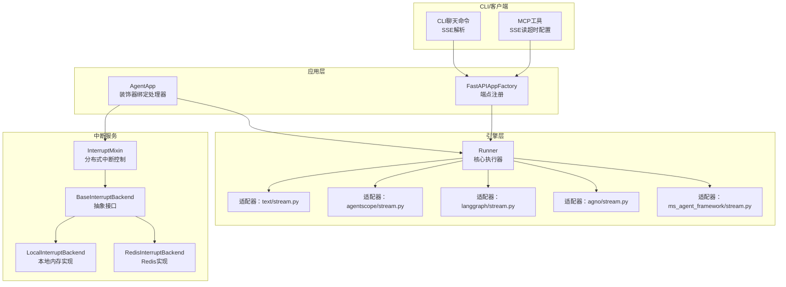
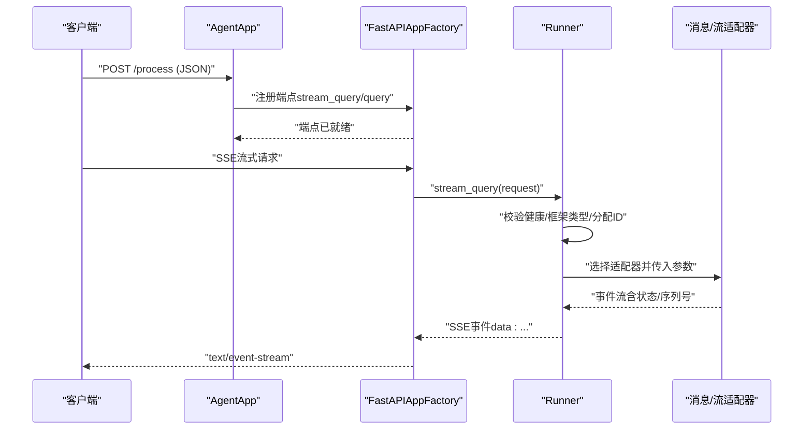
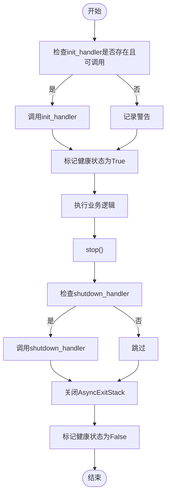
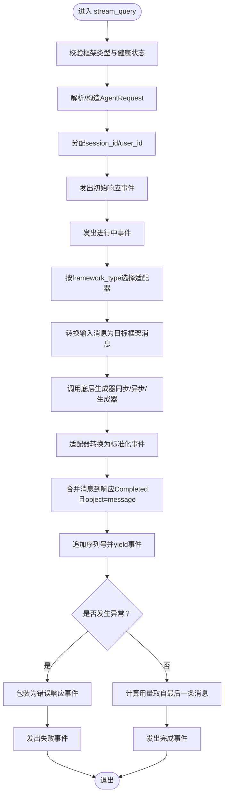
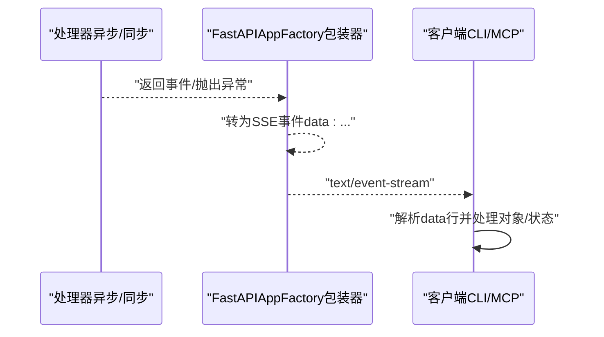
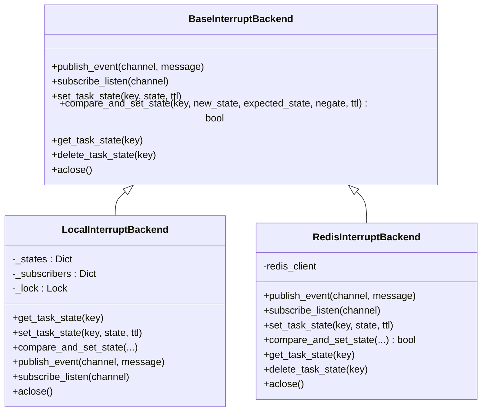
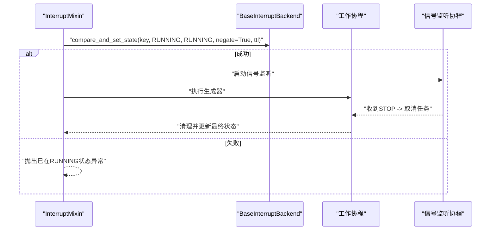
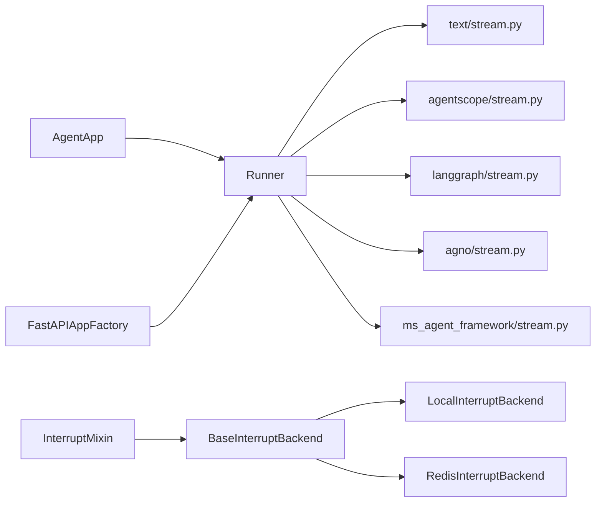

# Runner执行器

<cite>
**本文引用的文件**
- [runner.py](file://src/agentscope_runtime/engine/runner.py)
- [runner.py（示例）](file://src/agentscope_runtime/engine/helpers/runner.py)
- [agent_app.py](file://src/agentscope_runtime/engine/app/agent_app.py)
- [fastapi_factory.py](file://src/agentscope_runtime/engine/deployers/utils/service_utils/fastapi_factory.py)
- [interrupt_mixin.py](file://src/agentscope_runtime/engine/deployers/utils/service_utils/interrupt/interrupt_mixin.py)
- [base_backend.py](file://src/agentscope_runtime/engine/deployers/utils/service_utils/interrupt/base_backend.py)
- [local_backend.py](file://src/agentscope_runtime/engine/deployers/utils/service_utils/interrupt/local_backend.py)
- [redis_backend.py](file://src/agentscope_runtime/engine/deployers/utils/service_utils/interrupt/redis_backend.py)
- [test_runner_stream.py](file://tests/unit/test_runner_stream.py)
- [chat.py](file://src/agentscope_runtime/cli/commands/chat.py)
- [mcp_utils.py](file://src/agentscope_runtime/sandbox/box/shared/routers/mcp_utils.py)
</cite>

## 目录
1. [简介](#简介)
2. [项目结构](#项目结构)
3. [核心组件](#核心组件)
4. [架构总览](#架构总览)
5. [详细组件分析](#详细组件分析)
6. [依赖分析](#依赖分析)
7. [性能考虑](#性能考虑)
8. [故障排查指南](#故障排查指南)
9. [结论](#结论)
10. [附录](#附录)

## 简介
本文件系统性解析Runner执行器的架构设计与执行机制，重点覆盖以下方面：
- Runner作为智能体逻辑执行核心的职责：查询处理、流式响应生成、生命周期管理与资源回收。
- 查询处理器（query_handler）、初始化处理器（init_handler）与关闭处理器（shutdown_handler）的注册与调用机制。
- 流式查询（stream_query）的工作原理：事件生成、序列号与状态流转、SSE格式化与数据传输。
- 中断处理机制：分布式中断后端（Redis）与本地中断后端（内存）的实现差异与协作。
- Runner配置最佳实践与性能优化建议：并发控制、资源管理与部署策略。

## 项目结构
Runner位于引擎层，负责统一接入不同框架类型（如text、agentscope、langgraph、agno、ms_agent_framework），并通过适配器将底层生成器转换为标准化事件流；应用层通过装饰器绑定处理器到Runner实例，并在FastAPI工厂中注册端点；中断混合类提供分布式任务状态与信号订阅能力，支持本地或Redis后端。

图示来源
- [runner.py:46-356](file://src/agentscope_runtime/engine/runner.py#L46-L356)
- [agent_app.py:760-773](file://src/agentscope_runtime/engine/app/agent_app.py#L760-L773)
- [fastapi_factory.py:254-288](file://src/agentscope_runtime/engine/deployers/utils/service_utils/fastapi_factory.py#L254-L288)
- [interrupt_mixin.py:1-140](file://src/agentscope_runtime/engine/deployers/utils/service_utils/interrupt/interrupt_mixin.py#L1-L140)
- [base_backend.py:25-90](file://src/agentscope_runtime/engine/deployers/utils/service_utils/interrupt/base_backend.py#L25-L90)
- [local_backend.py:9-132](file://src/agentscope_runtime/engine/deployers/utils/service_utils/interrupt/local_backend.py#L9-L132)
- [redis_backend.py:7-107](file://src/agentscope_runtime/engine/deployers/utils/service_utils/interrupt/redis_backend.py#L7-L107)
- [chat.py:517-737](file://src/agentscope_runtime/cli/commands/chat.py#L517-L737)
- [mcp_utils.py:73-102](file://src/agentscope_runtime/sandbox/box/shared/routers/mcp_utils.py#L73-L102)

章节来源
- [runner.py:46-356](file://src/agentscope_runtime/engine/runner.py#L46-L356)
- [agent_app.py:760-773](file://src/agentscope_runtime/engine/app/agent_app.py#L760-L773)
- [fastapi_factory.py:254-288](file://src/agentscope_runtime/engine/deployers/utils/service_utils/fastapi_factory.py#L254-L288)

## 核心组件
- Runner：统一的执行器，负责启动/停止、查询处理、流式事件生成与适配器桥接。
- 处理器绑定：AgentApp通过装饰器将query/init/shutdown处理器注入Runner。
- 适配器：根据framework_type选择对应消息/流适配器，将底层生成器转换为标准化事件。
- 中断服务：InterruptMixin结合BaseInterruptBackend实现任务状态原子更新与信号监听，支持本地与Redis两种后端。
- 端点注册：FastAPIAppFactory在runner可用后自动注册stream_query或query端点。

章节来源
- [runner.py:46-356](file://src/agentscope_runtime/engine/runner.py#L46-L356)
- [agent_app.py:760-773](file://src/agentscope_runtime/engine/app/agent_app.py#L760-L773)
- [interrupt_mixin.py:1-140](file://src/agentscope_runtime/engine/deployers/utils/service_utils/interrupt/interrupt_mixin.py#L1-L140)
- [base_backend.py:25-90](file://src/agentscope_runtime/engine/deployers/utils/service_utils/interrupt/base_backend.py#L25-L90)
- [fastapi_factory.py:254-288](file://src/agentscope_runtime/engine/deployers/utils/service_utils/fastapi_factory.py#L254-L288)

## 架构总览
Runner以“框架无关”的方式接收请求，分配会话ID与用户ID，生成初始响应事件，进入“进行中”状态，随后调用适配器将底层生成器转换为标准化事件流。事件包含对象类型、运行状态、序列号等元信息，最终在完成或失败时输出最终响应事件。

图示来源
- [agent_app.py:760-773](file://src/agentscope_runtime/engine/app/agent_app.py#L760-L773)
- [fastapi_factory.py:254-288](file://src/agentscope_runtime/engine/deployers/utils/service_utils/fastapi_factory.py#L254-L288)
- [runner.py:199-356](file://src/agentscope_runtime/engine/runner.py#L199-L356)

## 详细组件分析

### Runner执行器与处理器绑定
- 生命周期：start()调用init_handler（若存在且可调用），stop()调用shutdown_handler并关闭退出栈资源。
- 处理器注入：AgentApp通过装饰器将query/init/shutdown处理器绑定到Runner实例，设置framework_type后构建Runner。
- 启动/停止流程：支持异步/同步处理器；异常在shutdown阶段记录警告但不中断资源释放。

图示来源
- [runner.py:76-121](file://src/agentscope_runtime/engine/runner.py#L76-L121)
- [agent_app.py:760-773](file://src/agentscope_runtime/engine/app/agent_app.py#L760-L773)

章节来源
- [runner.py:76-121](file://src/agentscope_runtime/engine/runner.py#L76-L121)
- [agent_app.py:760-773](file://src/agentscope_runtime/engine/app/agent_app.py#L760-L773)

### 流式查询（stream_query）工作原理
- 输入校验：框架类型必须在允许列表内；Runner需处于健康状态；请求可为字典或AgentRequest，自动补全session_id与user_id。
- 事件序列：先发出初始响应事件，再进入“进行中”状态事件；随后由适配器将底层生成器转换为标准化事件流。
- 适配器选择：根据framework_type选择对应适配器；将输入消息转换为目标框架的消息结构（如agentscope/langgraph/agno/ms_agent_framework）。
- 错误处理：捕获异常并包装为错误响应事件；最终输出完成或失败事件，附带用量统计（取自最后一条消息）。
- 输出格式：事件包含对象类型、状态、序列号等，最终形成SSE事件流。

图示来源
- [runner.py:199-356](file://src/agentscope_runtime/engine/runner.py#L199-L356)

章节来源
- [runner.py:199-356](file://src/agentscope_runtime/engine/runner.py#L199-L356)

### SSE格式化与数据传输
- FastAPI端点封装：对异步生成器与同步生成器分别进行包装，统一转为SSE事件；异常时输出包含错误类型与消息的SSE事件。
- 客户端解析：CLI命令行工具解析SSE行，提取data字段并处理不同对象类型与状态，支持流式打印与错误展示。
- MCP工具：SSE客户端默认超时与SSE读超时可配置，确保长连接稳定。

图示来源
- [fastapi_factory.py:743-801](file://src/agentscope_runtime/engine/deployers/utils/service_utils/fastapi_factory.py#L743-L801)
- [chat.py:517-737](file://src/agentscope_runtime/cli/commands/chat.py#L517-L737)
- [mcp_utils.py:73-102](file://src/agentscope_runtime/sandbox/box/shared/routers/mcp_utils.py#L73-L102)

章节来源
- [fastapi_factory.py:743-801](file://src/agentscope_runtime/engine/deployers/utils/service_utils/fastapi_factory.py#L743-L801)
- [chat.py:517-737](file://src/agentscope_runtime/cli/commands/chat.py#L517-L737)
- [mcp_utils.py:73-102](file://src/agentscope_runtime/sandbox/box/shared/routers/mcp_utils.py#L73-L102)

### 中断处理机制（分布式与本地）
- 原子状态管理：通过compare_and_set_state实现“当前状态非RUNNING”才允许进入RUNNING，避免并发冲突；任务结束后根据是否被中断更新为FINISHED或STOPPED。
- 信号监听：订阅通道收到STOP信号后取消工作协程；清理阶段统一取消监听与工作任务，更新最终状态并移除本地任务映射。
- 后端差异：
  - 本地后端：基于内存字典与队列，适合单进程环境；支持发布/订阅与TTL过期。
  - Redis后端：基于Lua脚本实现原子CAS，适合多节点/多实例场景；支持发布/订阅与持久化状态。

图示来源
- [base_backend.py:25-90](file://src/agentscope_runtime/engine/deployers/utils/service_utils/interrupt/base_backend.py#L25-L90)
- [local_backend.py:9-132](file://src/agentscope_runtime/engine/deployers/utils/service_utils/interrupt/local_backend.py#L9-L132)
- [redis_backend.py:7-107](file://src/agentscope_runtime/engine/deployers/utils/service_utils/interrupt/redis_backend.py#L7-L107)

图示来源
- [interrupt_mixin.py:38-140](file://src/agentscope_runtime/engine/deployers/utils/service_utils/interrupt/interrupt_mixin.py#L38-L140)
- [base_backend.py:50-77](file://src/agentscope_runtime/engine/deployers/utils/service_utils/interrupt/base_backend.py#L50-L77)

章节来源
- [interrupt_mixin.py:1-140](file://src/agentscope_runtime/engine/deployers/utils/service_utils/interrupt/interrupt_mixin.py#L1-L140)
- [base_backend.py:25-90](file://src/agentscope_runtime/engine/deployers/utils/service_utils/interrupt/base_backend.py#L25-L90)
- [local_backend.py:9-132](file://src/agentscope_runtime/engine/deployers/utils/service_utils/interrupt/local_backend.py#L9-L132)
- [redis_backend.py:7-107](file://src/agentscope_runtime/engine/deployers/utils/service_utils/interrupt/redis_backend.py#L7-L107)

### 示例Runner与测试验证
- SimpleRunner：演示最简query_handler，返回分片文本，验证流式输出与最终完成事件。
- ErrorRunner：演示异常路径，验证最终失败事件与错误信息。
- 单元测试：验证流式输出顺序、最终消息内容与失败事件。

章节来源
- [runner.py（示例）:13-41](file://src/agentscope_runtime/engine/helpers/runner.py#L13-L41)
- [test_runner_stream.py:40-78](file://tests/unit/test_runner_stream.py#L40-L78)

## 依赖分析
- Runner依赖适配器模块，按framework_type动态导入对应适配器与消息转换函数。
- 应用层通过装饰器将处理器注入Runner，再由FastAPI工厂在runner可用后注册端点。
- 中断服务通过InterruptMixin与BaseInterruptBackend抽象，具体实现可切换为本地或Redis后端。

图示来源
- [runner.py:246-320](file://src/agentscope_runtime/engine/runner.py#L246-L320)
- [agent_app.py:760-773](file://src/agentscope_runtime/engine/app/agent_app.py#L760-L773)
- [fastapi_factory.py:254-288](file://src/agentscope_runtime/engine/deployers/utils/service_utils/fastapi_factory.py#L254-L288)
- [interrupt_mixin.py:1-140](file://src/agentscope_runtime/engine/deployers/utils/service_utils/interrupt/interrupt_mixin.py#L1-L140)
- [base_backend.py:25-90](file://src/agentscope_runtime/engine/deployers/utils/service_utils/interrupt/base_backend.py#L25-L90)
- [local_backend.py:9-132](file://src/agentscope_runtime/engine/deployers/utils/service_utils/interrupt/local_backend.py#L9-L132)
- [redis_backend.py:7-107](file://src/agentscope_runtime/engine/deployers/utils/service_utils/interrupt/redis_backend.py#L7-L107)

章节来源
- [runner.py:246-320](file://src/agentscope_runtime/engine/runner.py#L246-L320)
- [agent_app.py:760-773](file://src/agentscope_runtime/engine/app/agent_app.py#L760-L773)
- [fastapi_factory.py:254-288](file://src/agentscope_runtime/engine/deployers/utils/service_utils/fastapi_factory.py#L254-L288)

## 性能考虑
- 并发与限流
  - 使用InterruptMixin的compare_and_set_state确保同一会话不会并发运行多个任务，避免竞争条件。
  - 在高并发场景下优先使用Redis后端，保证跨实例的一致性与可扩展性。
- 资源管理
  - 通过Runner的stop()与AsyncExitStack确保资源释放与异常安全关闭。
  - 中断清理阶段统一取消监听与工作任务，防止悬挂任务占用资源。
- 流式传输
  - SSE事件应尽量小而频繁，减少单次事件体积；客户端侧及时消费，避免缓冲堆积。
  - 配置合理的SSE读超时（如MCP工具中的sse_read_timeout），平衡稳定性与延迟。
- 框架适配
  - 不同framework_type的适配器可能引入额外转换开销，建议在生产环境评估并缓存必要的消息转换结果。

[本节为通用指导，无需列出具体文件来源]

## 故障排查指南
- 无法启动或健康状态异常
  - 确认已调用start()或使用异步上下文管理器；检查init_handler是否抛出未捕获异常。
- 流式输出为空或异常
  - 检查query_handler是否正确返回异步/同步生成器；确认framework_type与适配器匹配。
  - 查看SSE事件中是否包含错误对象，定位异常类型与消息。
- 中断无效或重复触发
  - 核对compare_and_set_state是否成功；检查后端状态键与TTL设置。
  - 确保STOP信号正确发布至对应通道，监听协程未提前退出。
- 客户端解析问题
  - 确认Accept头设置为text/event-stream；逐行解析data字段并处理对象类型与状态。

章节来源
- [runner.py:76-121](file://src/agentscope_runtime/engine/runner.py#L76-L121)
- [runner.py:199-356](file://src/agentscope_runtime/engine/runner.py#L199-L356)
- [interrupt_mixin.py:38-140](file://src/agentscope_runtime/engine/deployers/utils/service_utils/interrupt/interrupt_mixin.py#L38-L140)
- [fastapi_factory.py:743-801](file://src/agentscope_runtime/engine/deployers/utils/service_utils/fastapi_factory.py#L743-L801)
- [chat.py:517-737](file://src/agentscope_runtime/cli/commands/chat.py#L517-L737)

## 结论
Runner执行器通过清晰的生命周期管理、可插拔的适配器体系与统一的SSE事件模型，实现了跨框架的智能体执行与流式输出。结合InterruptMixin提供的分布式中断能力，可在多实例环境下可靠地控制任务状态与资源回收。生产部署建议采用Redis后端以获得更好的一致性与可扩展性，并配合合理的并发与超时配置提升整体稳定性与性能。

[本节为总结性内容，无需列出具体文件来源]

## 附录
- 配置要点
  - framework_type：确保与实际使用的框架一致。
  - 类型转换器：in_type_converters/out_type_converters用于消息与事件的双向转换。
  - 端点注册：由FastAPIAppFactory在runner可用后自动添加，支持stream_query或query。
- 最佳实践
  - 将业务逻辑集中在query_handler中，保持init_handler与shutdown_handler职责单一。
  - 对长耗时任务启用中断后端，避免资源泄漏。
  - 在CLI或Web客户端中实现SSE事件的健壮解析与错误提示。

[本节为通用指导，无需列出具体文件来源]