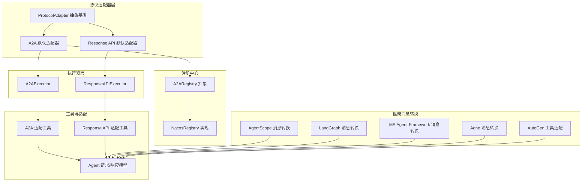
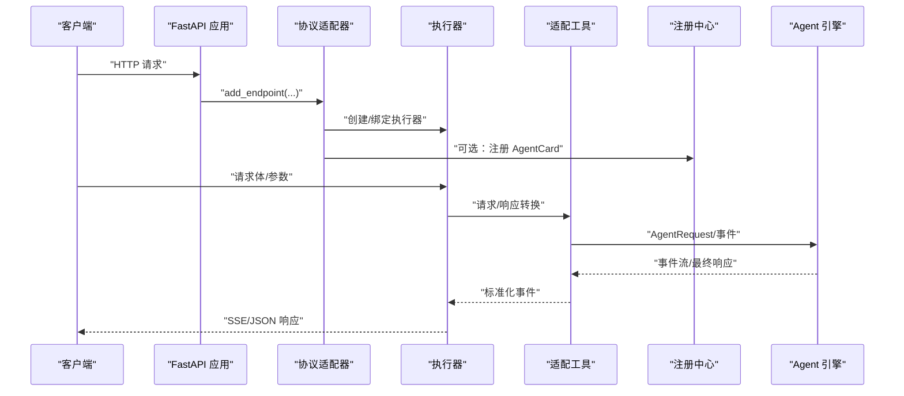
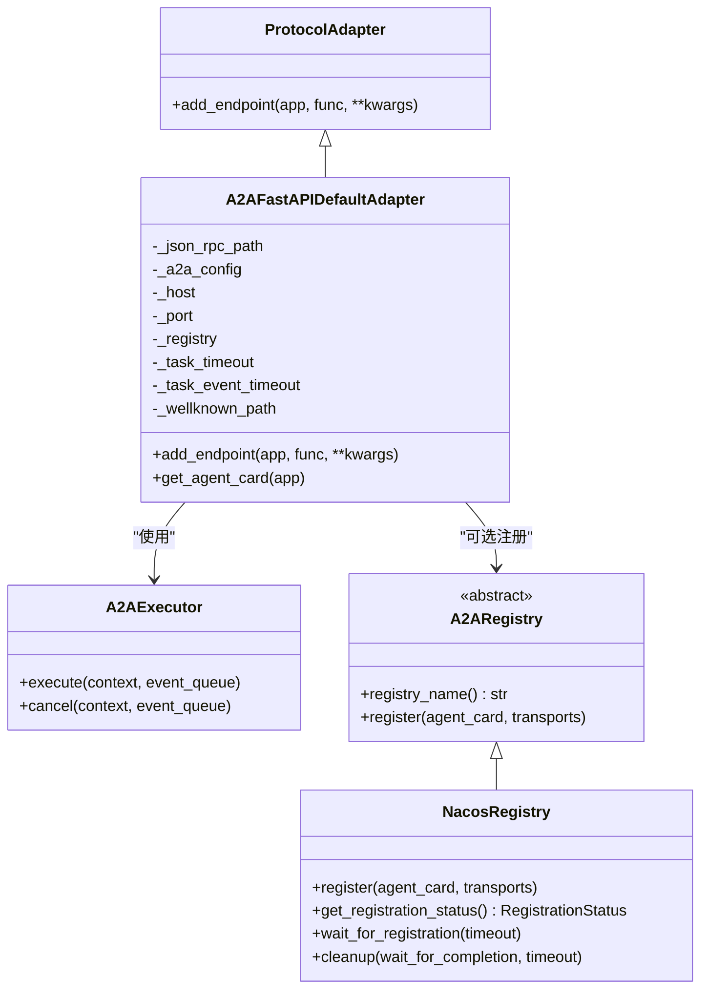
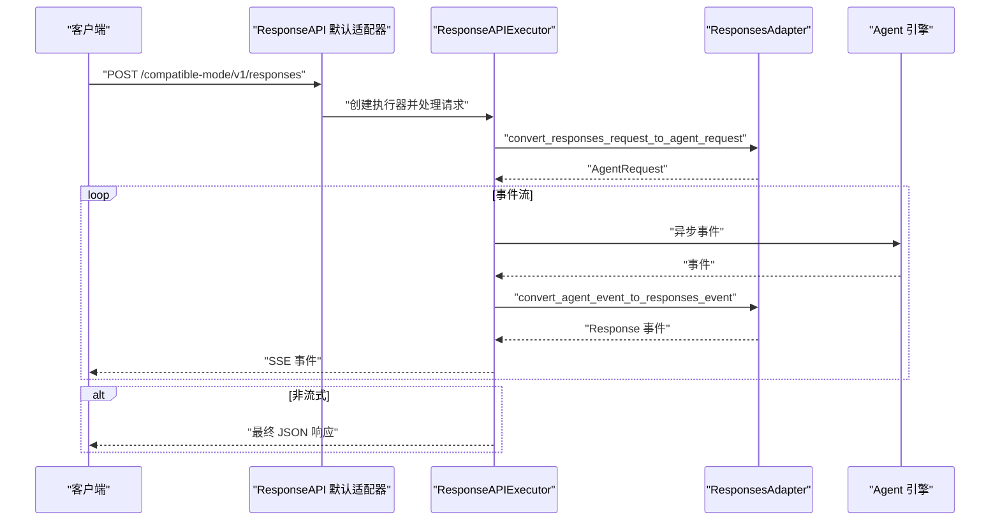
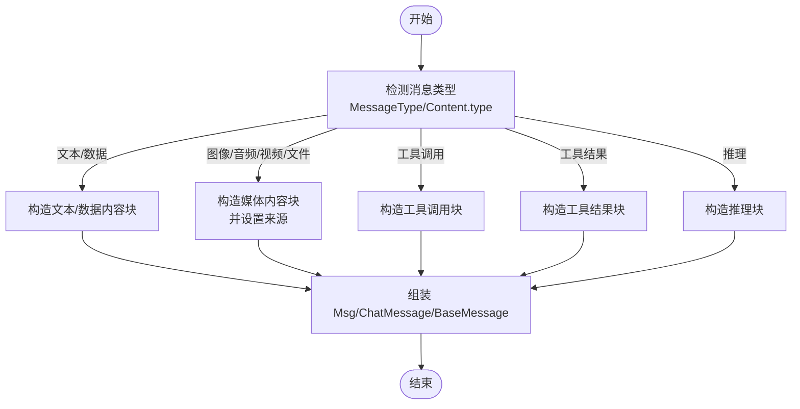
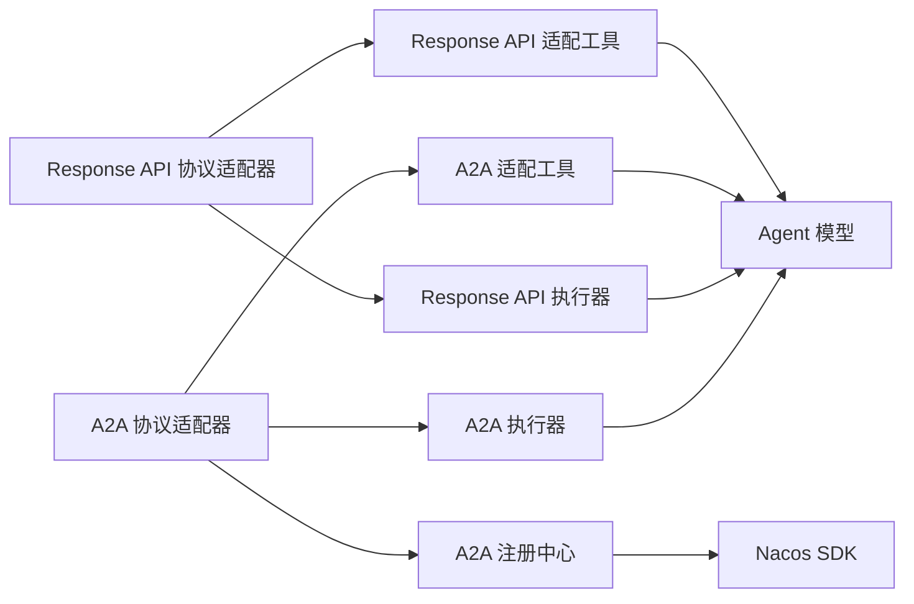

# 协议适配器

<cite>
**本文引用的文件**
- [protocol_adapter.py](file://src/agentscope_runtime/engine/deployers/adapter/protocol_adapter.py)
- [a2a_protocol_adapter.py](file://src/agentscope_runtime/engine/deployers/adapter/a2a/a2a_protocol_adapter.py)
- [response_api_protocol_adapter.py](file://src/agentscope_runtime/engine/deployers/adapter/responses/response_api_protocol_adapter.py)
- [a2a_agent_adapter.py](file://src/agentscope_runtime/engine/deployers/adapter/a2a/a2a_agent_adapter.py)
- [response_api_agent_adapter.py](file://src/agentscope_runtime/engine/deployers/adapter/responses/response_api_agent_adapter.py)
- [a2a_registry.py](file://src/agentscope_runtime/engine/deployers/adapter/a2a/a2a_registry.py)
- [nacos_a2a_registry.py](file://src/agentscope_runtime/engine/deployers/adapter/a2a/nacos_a2a_registry.py)
- [a2a_adapter_utils.py](file://src/agentscope_runtime/engine/deployers/adapter/a2a/a2a_adapter_utils.py)
- [response_api_adapter_utils.py](file://src/agentscope_runtime/engine/deployers/adapter/responses/response_api_adapter_utils.py)
- [agent_schemas.py](file://src/agentscope_runtime/engine/schemas/agent_schemas.py)
- [agentscope_message.py](file://src/agentscope_runtime/adapters/agentscope/message.py)
- [langgraph_message.py](file://src/agentscope_runtime/adapters/langgraph/message.py)
- [ms_agent_framework_message.py](file://src/agentscope_runtime/adapters/ms_agent_framework/message.py)
- [agno_message.py](file://src/agentscope_runtime/adapters/agno/message.py)
- [autogen_tool.py](file://src/agentscope_runtime/adapters/autogen/tool/tool.py)
- [utils.py](file://src/agentscope_runtime/adapters/utils.py)
</cite>

## 目录
1. [引言](#引言)
2. [项目结构](#项目结构)
3. [核心组件](#核心组件)
4. [架构总览](#架构总览)
5. [详细组件分析](#详细组件分析)
6. [依赖分析](#依赖分析)
7. [性能考虑](#性能考虑)
8. [故障排查指南](#故障排查指南)
9. [结论](#结论)
10. [附录](#附录)

## 引言
本文件系统化解析 AgentScope Runtime 的协议适配器体系与多框架兼容性设计，重点覆盖：
- 协议适配器的架构原理：适配器接口设计、消息转换机制、协议抽象层
- 不同框架适配器：AgentScope 适配器、LangGraph 适配器、MS Agent Framework 适配器、Agno 适配器、AutoGen 工具适配器
- 消息格式转换、参数映射与响应标准化的实现细节
- A2A 协议与 Response API 协议的支持机制
- 扩展指南：自定义适配器的开发流程与集成最佳实践
- 如何通过适配器实现“框架无关”的智能体开发

## 项目结构
协议适配器相关代码主要分布在以下模块：
- 协议适配器基类与默认实现：engine/deployers/adapter 下的 protocol_adapter 与两类协议适配器（A2A 与 Response API）
- 适配器工具与消息转换：engine/deployers/adapter/*/ 下的工具与引擎内部数据模型（agent_schemas）
- 多框架消息转换：adapters/* 下的各框架消息转换模块
- 注册中心扩展：A2A 注册表与 Nacos 实现

图表来源
- [protocol_adapter.py:6-25](file://src/agentscope_runtime/engine/deployers/adapter/protocol_adapter.py#L6-L25)
- [a2a_protocol_adapter.py:136-258](file://src/agentscope_runtime/engine/deployers/adapter/a2a/a2a_protocol_adapter.py#L136-L258)
- [response_api_protocol_adapter.py:33-315](file://src/agentscope_runtime/engine/deployers/adapter/responses/response_api_protocol_adapter.py#L33-L315)
- [a2a_agent_adapter.py:23-70](file://src/agentscope_runtime/engine/deployers/adapter/a2a/a2a_agent_adapter.py#L23-L70)
- [response_api_agent_adapter.py:14-52](file://src/agentscope_runtime/engine/deployers/adapter/responses/response_api_agent_adapter.py#L14-L52)
- [a2a_registry.py:45-77](file://src/agentscope_runtime/engine/deployers/adapter/a2a/a2a_registry.py#L45-L77)
- [nacos_a2a_registry.py:221-286](file://src/agentscope_runtime/engine/deployers/adapter/a2a/nacos_a2a_registry.py#L221-L286)
- [a2a_adapter_utils.py:35-114](file://src/agentscope_runtime/engine/deployers/adapter/a2a/a2a_adapter_utils.py#L35-L114)
- [response_api_adapter_utils.py:103-301](file://src/agentscope_runtime/engine/deployers/adapter/responses/response_api_adapter_utils.py#L103-L301)
- [agent_schemas.py:18-78](file://src/agentscope_runtime/engine/schemas/agent_schemas.py#L18-L78)
- [agentscope_message.py:53-394](file://src/agentscope_runtime/adapters/agentscope/message.py#L53-L394)
- [langgraph_message.py:23-163](file://src/agentscope_runtime/adapters/langgraph/message.py#L23-L163)
- [ms_agent_framework_message.py:23-216](file://src/agentscope_runtime/adapters/ms_agent_framework/message.py#L23-L216)
- [agno_message.py:10-40](file://src/agentscope_runtime/adapters/agno/message.py#L10-L40)
- [autogen_tool.py:28-212](file://src/agentscope_runtime/adapters/autogen/tool/tool.py#L28-L212)

章节来源
- [protocol_adapter.py:6-25](file://src/agentscope_runtime/engine/deployers/adapter/protocol_adapter.py#L6-L25)
- [a2a_protocol_adapter.py:136-258](file://src/agentscope_runtime/engine/deployers/adapter/a2a/a2a_protocol_adapter.py#L136-L258)
- [response_api_protocol_adapter.py:33-315](file://src/agentscope_runtime/engine/deployers/adapter/responses/response_api_protocol_adapter.py#L33-L315)

## 核心组件
- 协议适配器抽象基类：定义统一的 add_endpoint 接口，约束具体协议适配器的端点注册行为
- A2A 协议适配器：为 FastAPI 应用添加 A2A 端点，生成 AgentCard，支持任务管理与服务发现注册
- Response API 协议适配器：提供 OpenAI Response API 兼容端点，支持流式与非流式响应，内置并发控制与超时处理
- 执行器：A2AExecutor 与 ResponseAPIExecutor 将外部请求转换为 Agent API 请求并驱动事件流
- 适配工具：在 A2A 与 Response API 之间进行双向转换，并与引擎内部消息模型对齐
- 注册中心：A2ARegistry 抽象与 NacosRegistry 实现，负责将 Agent 服务注册到服务发现系统
- 框架消息转换：将 AgentScope 内部消息模型转换为各框架的消息表示，或反向转换

章节来源
- [protocol_adapter.py:6-25](file://src/agentscope_runtime/engine/deployers/adapter/protocol_adapter.py#L6-L25)
- [a2a_agent_adapter.py:23-70](file://src/agentscope_runtime/engine/deployers/adapter/a2a/a2a_agent_adapter.py#L23-L70)
- [response_api_agent_adapter.py:14-52](file://src/agentscope_runtime/engine/deployers/adapter/responses/response_api_agent_adapter.py#L14-L52)
- [a2a_adapter_utils.py:35-114](file://src/agentscope_runtime/engine/deployers/adapter/a2a/a2a_adapter_utils.py#L35-L114)
- [response_api_adapter_utils.py:103-301](file://src/agentscope_runtime/engine/deployers/adapter/responses/response_api_adapter_utils.py#L103-L301)
- [a2a_registry.py:45-77](file://src/agentscope_runtime/engine/deployers/adapter/a2a/a2a_registry.py#L45-L77)
- [nacos_a2a_registry.py:221-286](file://src/agentscope_runtime/engine/deployers/adapter/a2a/nacos_a2a_registry.py#L221-L286)

## 架构总览
下图展示了协议适配器与执行器、工具及注册中心之间的交互关系，以及消息在不同协议与框架间的转换路径。

图表来源
- [a2a_protocol_adapter.py:222-258](file://src/agentscope_runtime/engine/deployers/adapter/a2a/a2a_protocol_adapter.py#L222-L258)
- [response_api_protocol_adapter.py:285-315](file://src/agentscope_runtime/engine/deployers/adapter/responses/response_api_protocol_adapter.py#L285-L315)
- [a2a_agent_adapter.py:27-63](file://src/agentscope_runtime/engine/deployers/adapter/a2a/a2a_agent_adapter.py#L27-L63)
- [response_api_agent_adapter.py:18-51](file://src/agentscope_runtime/engine/deployers/adapter/responses/response_api_agent_adapter.py#L18-L51)
- [a2a_registry.py:58-76](file://src/agentscope_runtime/engine/deployers/adapter/a2a/a2a_registry.py#L58-L76)
- [nacos_a2a_registry.py:256-286](file://src/agentscope_runtime/engine/deployers/adapter/a2a/nacos_a2a_registry.py#L256-L286)

## 详细组件分析

### 协议适配器接口设计
- 抽象基类 ProtocolAdapter 定义 add_endpoint(app, func, **kwargs)，用于在具体 Web 框架中注册协议端点
- 子类需实现协议特定的端点配置、路由挂载与生命周期管理

章节来源
- [protocol_adapter.py:6-25](file://src/agentscope_runtime/engine/deployers/adapter/protocol_adapter.py#L6-L25)

### A2A 协议适配器
- 职责：为 FastAPI 应用添加 A2A 端点，生成 AgentCard，配置任务存储与传输属性，支持服务注册
- 关键能力：
  - 自动构建 AgentCard（名称、描述、URL、版本、技能、输入输出模式等），并忽略用户覆盖的受控字段
  - 注册到多个注册中心（如 Nacos），支持多传输配置
  - 将 A2A 请求转换为 Agent API 请求，驱动事件流并回传 A2A 事件

图表来源
- [a2a_protocol_adapter.py:136-498](file://src/agentscope_runtime/engine/deployers/adapter/a2a/a2a_protocol_adapter.py#L136-L498)
- [a2a_agent_adapter.py:23-70](file://src/agentscope_runtime/engine/deployers/adapter/a2a/a2a_agent_adapter.py#L23-L70)
- [a2a_registry.py:45-77](file://src/agentscope_runtime/engine/deployers/adapter/a2a/a2a_registry.py#L45-L77)
- [nacos_a2a_registry.py:221-286](file://src/agentscope_runtime/engine/deployers/adapter/a2a/nacos_a2a_registry.py#L221-L286)

章节来源
- [a2a_protocol_adapter.py:136-498](file://src/agentscope_runtime/engine/deployers/adapter/a2a/a2a_protocol_adapter.py#L136-L498)
- [a2a_agent_adapter.py:23-70](file://src/agentscope_runtime/engine/deployers/adapter/a2a/a2a_agent_adapter.py#L23-L70)
- [a2a_registry.py:45-77](file://src/agentscope_runtime/engine/deployers/adapter/a2a/a2a_registry.py#L45-L77)
- [nacos_a2a_registry.py:221-286](file://src/agentscope_runtime/engine/deployers/adapter/a2a/nacos_a2a_registry.py#L221-L286)

### Response API 协议适配器
- 职责：提供 OpenAI Response API 兼容端点，支持流式与非流式响应，内置并发限制与超时控制
- 关键能力：
  - 将 OpenAI Response API 请求转换为 Agent API 请求
  - 将 Agent 事件流转换为 Response API 事件流，统一序列号与错误处理
  - 流式场景下使用 SSE，非流式返回单个 JSON 对象

图表来源
- [response_api_protocol_adapter.py:285-315](file://src/agentscope_runtime/engine/deployers/adapter/responses/response_api_protocol_adapter.py#L285-L315)
- [response_api_agent_adapter.py:18-51](file://src/agentscope_runtime/engine/deployers/adapter/responses/response_api_agent_adapter.py#L18-L51)
- [response_api_adapter_utils.py:103-301](file://src/agentscope_runtime/engine/deployers/adapter/responses/response_api_adapter_utils.py#L103-L301)

章节来源
- [response_api_protocol_adapter.py:33-315](file://src/agentscope_runtime/engine/deployers/adapter/responses/response_api_protocol_adapter.py#L33-L315)
- [response_api_agent_adapter.py:14-52](file://src/agentscope_runtime/engine/deployers/adapter/responses/response_api_agent_adapter.py#L14-L52)
- [response_api_adapter_utils.py:103-301](file://src/agentscope_runtime/engine/deployers/adapter/responses/response_api_adapter_utils.py#L103-L301)

### 消息格式转换与参数映射
- AgentScope 内部消息模型：Message、Content、MessageType、Role、RunStatus 等
- 各框架消息转换：
  - AgentScope 适配器：将 AgentScope runtime Message 转换为 AgentScope Msg，支持多种内容块类型与工具调用
  - LangGraph 适配器：将 AgentScope runtime Message 转换为 LangChain BaseMessage，支持工具调用与工具结果
  - MS Agent Framework 适配器：将 AgentScope runtime Message 转换为 ChatMessage，支持函数调用与结果
  - Agno 适配器：基于 OpenAI Chat 格式器，将 AgentScope Msg 转换为 Agno 消息
  - AutoGen 工具适配：将 agentscope_runtime 工具包装为 AutoGen 工具，支持参数与返回值的转换

图表来源
- [agentscope_message.py:53-394](file://src/agentscope_runtime/adapters/agentscope/message.py#L53-L394)
- [langgraph_message.py:23-163](file://src/agentscope_runtime/adapters/langgraph/message.py#L23-L163)
- [ms_agent_framework_message.py:23-216](file://src/agentscope_runtime/adapters/ms_agent_framework/message.py#L23-L216)
- [agno_message.py:10-40](file://src/agentscope_runtime/adapters/agno/message.py#L10-L40)
- [autogen_tool.py:28-212](file://src/agentscope_runtime/adapters/autogen/tool/tool.py#L28-L212)
- [agent_schemas.py:18-78](file://src/agentscope_runtime/engine/schemas/agent_schemas.py#L18-L78)

章节来源
- [agentscope_message.py:53-394](file://src/agentscope_runtime/adapters/agentscope/message.py#L53-L394)
- [langgraph_message.py:23-163](file://src/agentscope_runtime/adapters/langgraph/message.py#L23-L163)
- [ms_agent_framework_message.py:23-216](file://src/agentscope_runtime/adapters/ms_agent_framework/message.py#L23-L216)
- [agno_message.py:10-40](file://src/agentscope_runtime/adapters/agno/message.py#L10-L40)
- [autogen_tool.py:28-212](file://src/agentscope_runtime/adapters/autogen/tool/tool.py#L28-L212)
- [agent_schemas.py:18-78](file://src/agentscope_runtime/engine/schemas/agent_schemas.py#L18-L78)

### 响应标准化与事件序列
- Response API 适配器将 Agent 事件转换为 Response API 事件，统一序列号与事件类型
- A2A 适配器将 AgentResponse 转换为 Task 与 TaskStatusUpdateEvent、TaskArtifactUpdateEvent，确保状态与工件更新的标准化

章节来源
- [response_api_adapter_utils.py:800-1000](file://src/agentscope_runtime/engine/deployers/adapter/responses/response_api_adapter_utils.py#L800-L1000)
- [a2a_adapter_utils.py:218-375](file://src/agentscope_runtime/engine/deployers/adapter/a2a/a2a_adapter_utils.py#L218-L375)

### 注册中心与服务发现
- A2ARegistry 抽象定义了注册名与注册方法
- NacosRegistry 实现了两阶段注册：发布 AgentCard 与注册端点，支持后台任务与线程两种运行模式，具备状态查询与清理能力

章节来源
- [a2a_registry.py:45-77](file://src/agentscope_runtime/engine/deployers/adapter/a2a/a2a_registry.py#L45-L77)
- [nacos_a2a_registry.py:221-286](file://src/agentscope_runtime/engine/deployers/adapter/a2a/nacos_a2a_registry.py#L221-L286)
- [nacos_a2a_registry.py:423-573](file://src/agentscope_runtime/engine/deployers/adapter/a2a/nacos_a2a_registry.py#L423-L573)
- [nacos_a2a_registry.py:583-624](file://src/agentscope_runtime/engine/deployers/adapter/a2a/nacos_a2a_registry.py#L583-L624)
- [nacos_a2a_registry.py:626-768](file://src/agentscope_runtime/engine/deployers/adapter/a2a/nacos_a2a_registry.py#L626-L768)

## 依赖分析
- 组件耦合与内聚
  - 协议适配器与执行器解耦：通过 add_endpoint 将路由与执行逻辑分离
  - 执行器与适配工具解耦：通过统一的请求/响应转换接口对接引擎
  - 注册中心与适配器弱耦合：可选注册，失败不影响启动
- 外部依赖
  - A2A 协议依赖 a2a.server.* 与 a2a.types
  - Response API 依赖 openai.types.responses
  - AutoGen 工具适配依赖 autogen_core 与 pydantic
- 循环依赖规避
  - 注册中心的 Nacos 实现延迟导入 v2.nacos.*，避免硬依赖

图表来源
- [a2a_protocol_adapter.py:136-258](file://src/agentscope_runtime/engine/deployers/adapter/a2a/a2a_protocol_adapter.py#L136-L258)
- [response_api_protocol_adapter.py:285-315](file://src/agentscope_runtime/engine/deployers/adapter/responses/response_api_protocol_adapter.py#L285-L315)
- [a2a_agent_adapter.py:23-70](file://src/agentscope_runtime/engine/deployers/adapter/a2a/a2a_agent_adapter.py#L23-L70)
- [response_api_agent_adapter.py:14-52](file://src/agentscope_runtime/engine/deployers/adapter/responses/response_api_agent_adapter.py#L14-L52)
- [a2a_adapter_utils.py:35-114](file://src/agentscope_runtime/engine/deployers/adapter/a2a/a2a_adapter_utils.py#L35-L114)
- [response_api_adapter_utils.py:103-301](file://src/agentscope_runtime/engine/deployers/adapter/responses/response_api_adapter_utils.py#L103-L301)
- [nacos_a2a_registry.py:35-66](file://src/agentscope_runtime/engine/deployers/adapter/a2a/nacos_a2a_registry.py#L35-L66)

章节来源
- [a2a_protocol_adapter.py:136-258](file://src/agentscope_runtime/engine/deployers/adapter/a2a/a2a_protocol_adapter.py#L136-L258)
- [response_api_protocol_adapter.py:285-315](file://src/agentscope_runtime/engine/deployers/adapter/responses/response_api_protocol_adapter.py#L285-L315)
- [nacos_a2a_registry.py:35-66](file://src/agentscope_runtime/engine/deployers/adapter/a2a/nacos_a2a_registry.py#L35-L66)

## 性能考虑
- 并发与限流
  - Response API 适配器使用信号量限制并发请求数，避免过载
- 超时控制
  - Response API 适配器在流式场景使用 asyncio.wait_for 控制超时，及时返回超时事件
- 事件序列化
  - Response API 适配器统一设置 sequence_number，便于客户端有序消费
- 注册中心异步化
  - Nacos 注册在后台任务或线程中执行，避免阻塞主流程；提供状态查询与等待接口

章节来源
- [response_api_protocol_adapter.py:34-96](file://src/agentscope_runtime/engine/deployers/adapter/responses/response_api_protocol_adapter.py#L34-L96)
- [response_api_protocol_adapter.py:161-218](file://src/agentscope_runtime/engine/deployers/adapter/responses/response_api_protocol_adapter.py#L161-L218)
- [response_api_agent_adapter.py:42-49](file://src/agentscope_runtime/engine/deployers/adapter/responses/response_api_agent_adapter.py#L42-L49)
- [nacos_a2a_registry.py:287-409](file://src/agentscope_runtime/engine/deployers/adapter/a2a/nacos_a2a_registry.py#L287-L409)
- [nacos_a2a_registry.py:583-624](file://src/agentscope_runtime/engine/deployers/adapter/a2a/nacos_a2a_registry.py#L583-L624)

## 故障排查指南
- A2A 注册失败
  - 现象：启动日志出现注册警告但不阻断启动
  - 排查：检查 Nacos 配置（地址、认证、命名空间）与网络连通性；使用 get_registration_status/wait_for_registration 获取状态
- Response API 错误处理
  - 现象：流式或非流式响应异常
  - 排查：查看日志中的异常栈；确认请求体格式与工具参数；检查超时阈值
- 工具适配异常
  - 现象：AutoGen 工具执行失败
  - 排查：确认 agentscope_runtime 工具的输入/输出类型与名称；检查返回值是否可序列化为字符串

章节来源
- [nacos_a2a_registry.py:275-299](file://src/agentscope_runtime/engine/deployers/adapter/a2a/nacos_a2a_registry.py#L275-L299)
- [response_api_protocol_adapter.py:83-96](file://src/agentscope_runtime/engine/deployers/adapter/responses/response_api_protocol_adapter.py#L83-L96)
- [autogen_tool.py:133-137](file://src/agentscope_runtime/adapters/autogen/tool/tool.py#L133-L137)

## 结论
AgentScope Runtime 的协议适配器体系通过抽象接口、清晰的执行器与适配工具分层，实现了对 A2A 与 Response API 的统一支持，并以消息转换模块打通了与多框架（AgentScope、LangGraph、MS Agent Framework、Agno、AutoGen）的互操作。该设计既保证了协议层面的标准化，又保留了框架层面的灵活性，为“框架无关”的智能体开发提供了坚实基础。

## 附录

### A2A 协议与 Response API 支持机制
- A2A 协议
  - 端点：/a2a（JSON-RPC）、/.wellknown/agent-card.json
  - 功能：任务管理、传输配置、服务注册
- Response API 协议
  - 端点：/compatible-mode/v1/responses
  - 功能：OpenAI 兼容响应、流式与非流式、并发与超时控制

章节来源
- [a2a_protocol_adapter.py:45-49](file://src/agentscope_runtime/engine/deployers/adapter/a2a/a2a_protocol_adapter.py#L45-L49)
- [a2a_protocol_adapter.py:222-258](file://src/agentscope_runtime/engine/deployers/adapter/a2a/a2a_protocol_adapter.py#L222-L258)
- [response_api_protocol_adapter.py:22-31](file://src/agentscope_runtime/engine/deployers/adapter/responses/response_api_protocol_adapter.py#L22-L31)
- [response_api_protocol_adapter.py:285-315](file://src/agentscope_runtime/engine/deployers/adapter/responses/response_api_protocol_adapter.py#L285-L315)

### 扩展指南：自定义适配器开发流程
- 设计步骤
  - 定义适配器类，继承 ProtocolAdapter 并实现 add_endpoint
  - 编写执行器类，接收外部请求并转换为 Agent API 请求，驱动事件流
  - 实现请求/响应双向转换工具，确保消息与参数映射正确
  - 可选：实现注册中心接口，接入服务发现
- 集成最佳实践
  - 明确端点路径与请求体规范
  - 统一错误处理与超时策略
  - 提供并发控制与资源清理
  - 在文档中明确消息类型与事件序列化规则

章节来源
- [protocol_adapter.py:6-25](file://src/agentscope_runtime/engine/deployers/adapter/protocol_adapter.py#L6-L25)
- [a2a_protocol_adapter.py:136-258](file://src/agentscope_runtime/engine/deployers/adapter/a2a/a2a_protocol_adapter.py#L136-L258)
- [response_api_protocol_adapter.py:33-315](file://src/agentscope_runtime/engine/deployers/adapter/responses/response_api_protocol_adapter.py#L33-L315)
- [a2a_registry.py:45-77](file://src/agentscope_runtime/engine/deployers/adapter/a2a/a2a_registry.py#L45-L77)