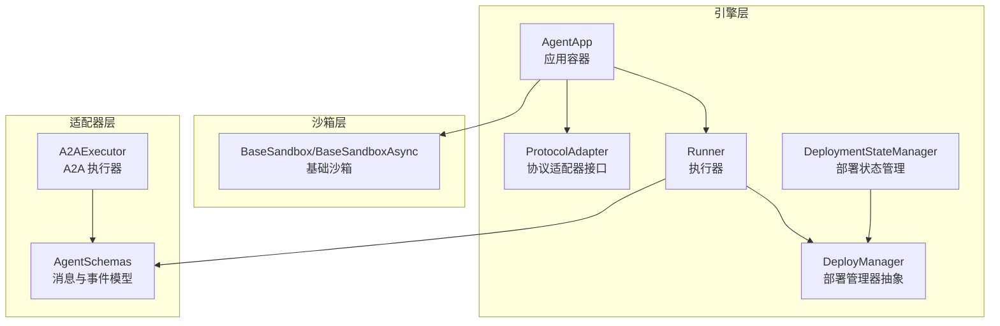
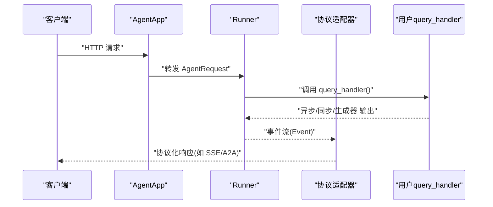
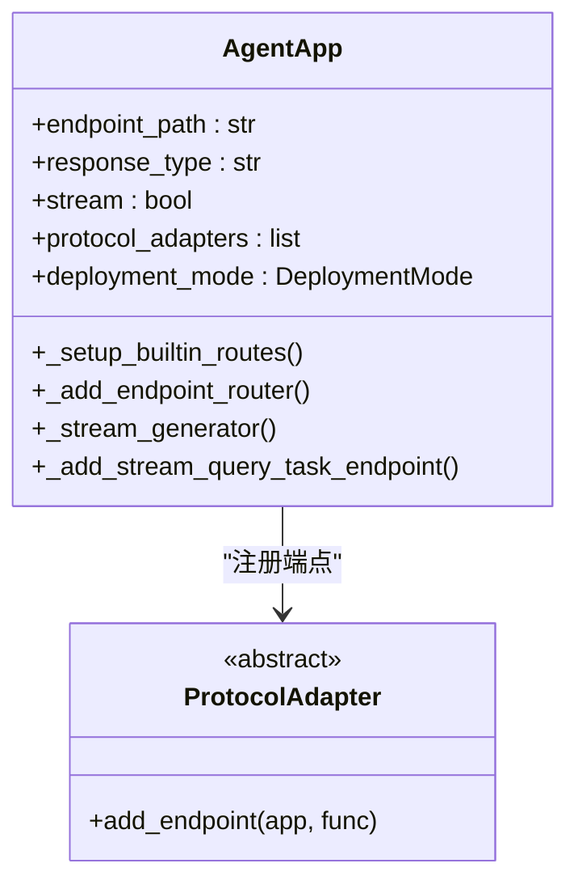
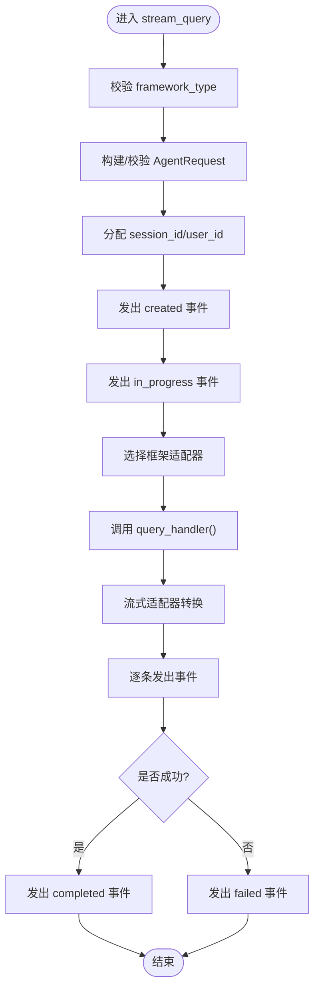
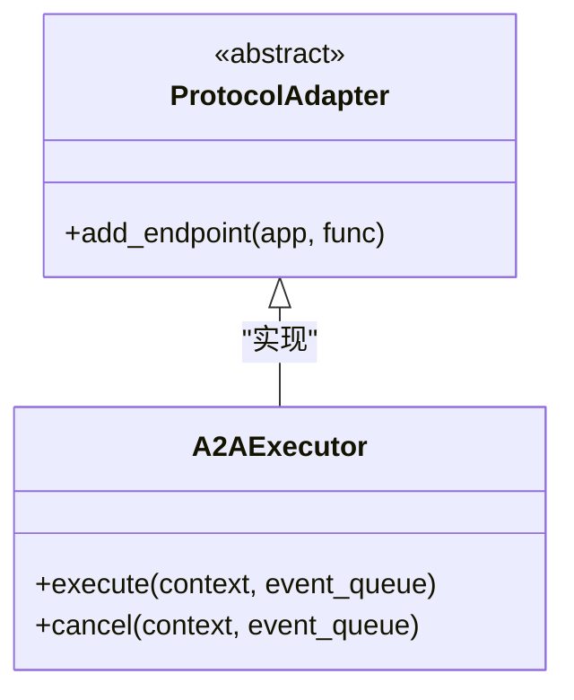
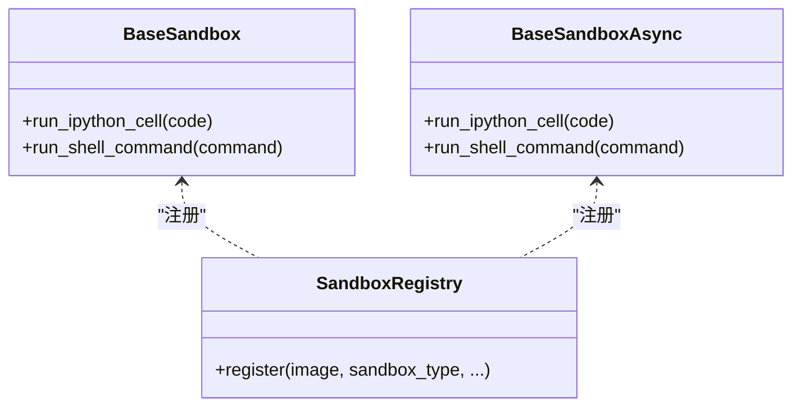
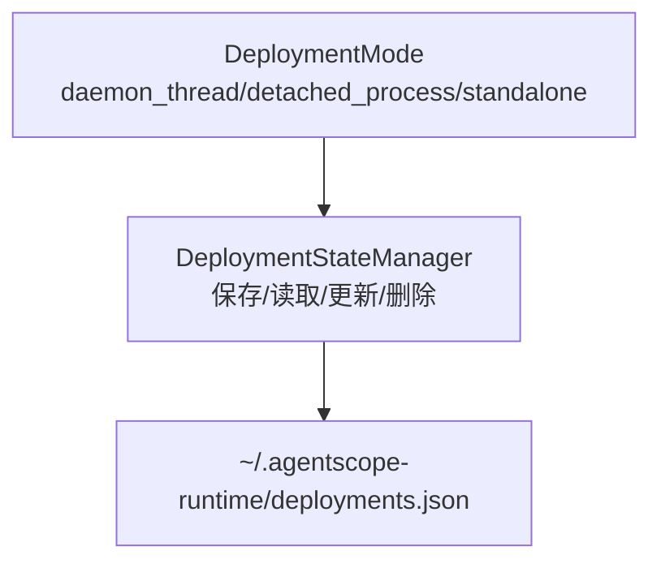
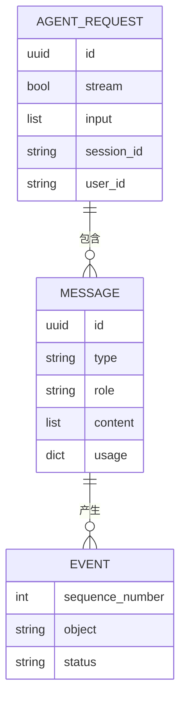
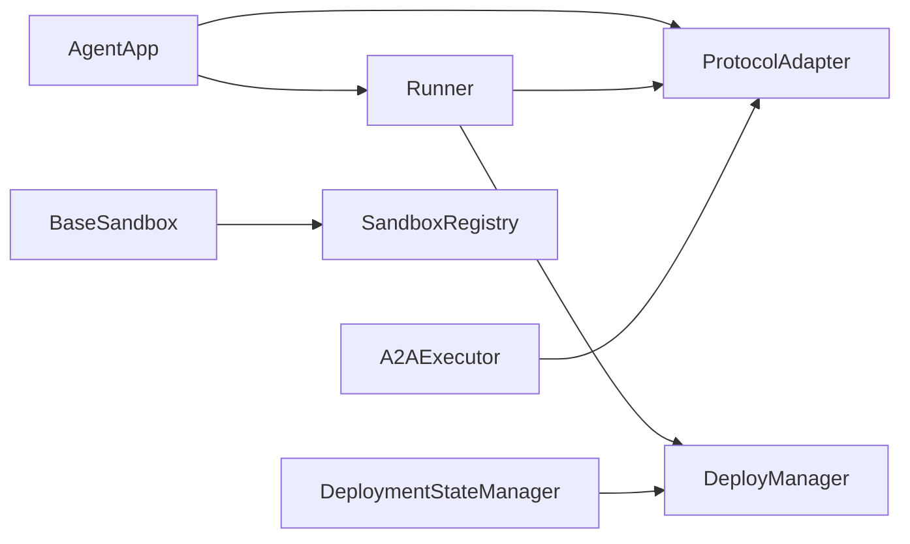

# 核心概念解析

<cite>
**本文引用的文件**
- [agent_app.py](file://src/agentscope_runtime/engine/app/agent_app.py)
- [runner.py](file://src/agentscope_runtime/engine/helpers/runner.py)
- [runner.py](file://src/agentscope_runtime/engine/runner.py)
- [base_sandbox.py](file://src/agentscope_runtime/sandbox/box/base/base_sandbox.py)
- [a2a_agent_adapter.py](file://src/agentscope_runtime/engine/deployers/adapter/a2a/a2a_agent_adapter.py)
- [protocol_adapter.py](file://src/agentscope_runtime/engine/deployers/adapter/protocol_adapter.py)
- [deployment_modes.py](file://src/agentscope_runtime/engine/deployers/utils/deployment_modes.py)
- [agent_schemas.py](file://src/agentscope_runtime/engine/schemas/agent_schemas.py)
- [base.py](file://src/agentscope_runtime/engine/deployers/base.py)
- [manager.py](file://src/agentscope_runtime/engine/deployers/state/manager.py)
- [in_memory_mapping.py](file://src/agentscope_runtime/common/collections/in_memory_mapping.py)
</cite>

## 目录
1. [引言](#引言)
2. [项目结构](#项目结构)
3. [核心组件](#核心组件)
4. [架构总览](#架构总览)
5. [详细组件分析](#详细组件分析)
6. [依赖关系分析](#依赖关系分析)
7. [性能考量](#性能考量)
8. [故障排查指南](#故障排查指南)
9. [结论](#结论)
10. [附录](#附录)

## 引言
本文件面向初学者与有经验的开发者，系统性解析 AgentScope Runtime 的核心概念与架构设计，重点覆盖以下主题：
- AgentApp 应用容器的工作原理与生命周期管理
- Runner 执行器的调度机制与事件流
- 沙箱系统的安全隔离机制与类型体系
- 协议适配器的作用与白盒适配器模式优势
- 部署模式的选择原则与运行时配置
- AaaS（Agent as a Service）理念在系统中的落地方式

通过架构图、数据流图与代码级类图，帮助读者建立从高层到实现细节的完整认知。

## 项目结构
AgentScope Runtime 采用模块化分层组织：引擎层（engine）、沙箱层（sandbox）、适配器层（adapters）、CLI 层（cli）等。其中引擎层是核心，包含应用容器 AgentApp、执行器 Runner、协议适配器、部署工具与状态管理；沙箱层提供多类型的安全隔离环境；适配器层负责对接不同框架的消息与流式输出；CLI 层提供命令行工具与打包能力。

图表来源
- [agent_app.py:60-120](file://src/agentscope_runtime/engine/app/agent_app.py#L60-L120)
- [runner.py:46-120](file://src/agentscope_runtime/engine/runner.py#L46-L120)
- [protocol_adapter.py:6-25](file://src/agentscope_runtime/engine/deployers/adapter/protocol_adapter.py#L6-L25)
- [base.py:9-44](file://src/agentscope_runtime/engine/deployers/base.py#L9-L44)
- [manager.py:17-60](file://src/agentscope_runtime/engine/deployers/state/manager.py#L17-L60)
- [base_sandbox.py:11-76](file://src/agentscope_runtime/sandbox/box/base/base_sandbox.py#L11-L76)
- [a2a_agent_adapter.py:23-70](file://src/agentscope_runtime/engine/deployers/adapter/a2a/a2a_agent_adapter.py#L23-L70)
- [agent_schemas.py:263-510](file://src/agentscope_runtime/engine/schemas/agent_schemas.py#L263-L510)

章节来源
- [agent_app.py:124-220](file://src/agentscope_runtime/engine/app/agent_app.py#L124-L220)
- [runner.py:46-120](file://src/agentscope_runtime/engine/runner.py#L46-L120)
- [base.py:9-44](file://src/agentscope_runtime/engine/deployers/base.py#L9-L44)

## 核心组件
- AgentApp：基于 FastAPI 的应用容器，集成 Runner、路由与中间件，支持多协议适配器与中断服务，统一生命周期管理。
- Runner：核心执行器，负责接收请求、选择框架适配器、驱动用户自定义 query_handler，并以事件流形式产出结果。
- 协议适配器：将 Runner 的事件流映射为不同协议的端点（如 A2A、ResponseAPI、AGUI），实现“白盒适配器”模式。
- 沙箱系统：提供多种隔离级别与类型（同步/异步）的基础沙箱，封装工具调用与超时控制。
- 部署模式：定义本地守护线程、分离进程与独立打包三种运行模式，便于按场景选择。
- 部署状态管理：持久化部署元数据，支持备份、迁移、清理与导入导出。

章节来源
- [agent_app.py:60-120](file://src/agentscope_runtime/engine/app/agent_app.py#L60-L120)
- [runner.py:46-120](file://src/agentscope_runtime/engine/runner.py#L46-L120)
- [protocol_adapter.py:6-25](file://src/agentscope_runtime/engine/deployers/adapter/protocol_adapter.py#L6-L25)
- [base_sandbox.py:11-76](file://src/agentscope_runtime/sandbox/box/base/base_sandbox.py#L11-L76)
- [deployment_modes.py:7-15](file://src/agentscope_runtime/engine/deployers/utils/deployment_modes.py#L7-L15)
- [manager.py:17-60](file://src/agentscope_runtime/engine/deployers/state/manager.py#L17-L60)

## 架构总览
AgentScope Runtime 的整体架构围绕“应用容器 + 执行器 + 适配器 + 沙箱”的组合展开。AgentApp 负责 HTTP 入口与路由注册，Runner 负责业务逻辑与事件流生成，协议适配器将事件流转换为外部可消费的协议格式，沙箱提供受控执行环境。

图表来源
- [agent_app.py:781-800](file://src/agentscope_runtime/engine/app/agent_app.py#L781-L800)
- [runner.py:199-356](file://src/agentscope_runtime/engine/runner.py#L199-L356)
- [protocol_adapter.py:10-24](file://src/agentscope_runtime/engine/deployers/adapter/protocol_adapter.py#L10-L24)

## 详细组件分析

### AgentApp 应用容器
- 生命周期管理：通过 FastAPI 的 lifespan 管理内部 Runner 启停、钩子函数与中断服务初始化，支持用户自定义 lifespan。
- 路由与中间件：内置健康检查、根信息、进程控制端点；根据部署模式动态设置响应头；统一 CORS 中间件。
- 协议适配器：默认初始化 A2A、ResponseAPI、AGUI 适配器，将 Runner 的事件流注册为不同协议的处理端点。
- 流式任务：支持将 stream_query 提交为后台任务，返回 task_id 并提供状态查询；内置过期任务清理协程。
- 中断服务：支持本地或 Redis 分布式后端，结合统一路由混合器实现跨节点中断。

图表来源
- [agent_app.py:60-120](file://src/agentscope_runtime/engine/app/agent_app.py#L60-L120)
- [agent_app.py:340-357](file://src/agentscope_runtime/engine/app/agent_app.py#L340-L357)
- [protocol_adapter.py:6-25](file://src/agentscope_runtime/engine/deployers/adapter/protocol_adapter.py#L6-L25)

章节来源
- [agent_app.py:124-220](file://src/agentscope_runtime/engine/app/agent_app.py#L124-L220)
- [agent_app.py:248-316](file://src/agentscope_runtime/engine/app/agent_app.py#L248-L316)
- [agent_app.py:382-471](file://src/agentscope_runtime/engine/app/agent_app.py#L382-L471)
- [agent_app.py:598-641](file://src/agentscope_runtime/engine/app/agent_app.py#L598-L641)

### Runner 执行器
- 框架类型与适配器：根据 framework_type 动态选择对应框架的消息/流适配器，将用户 query_handler 的输出标准化为事件流。
- 事件序列：自动注入创建、进行中、完成/失败等状态事件，支持使用序列号生成器保证事件顺序。
- 错误处理：捕获异常并包装为统一错误对象，记录堆栈信息；统计 token 使用并附加到最终响应。
- 部署集成：提供 deploy 方法，委托给 DeployManager 完成服务打包与发布。

图表来源
- [runner.py:199-356](file://src/agentscope_runtime/engine/runner.py#L199-L356)

章节来源
- [runner.py:46-120](file://src/agentscope_runtime/engine/runner.py#L46-L120)
- [runner.py:199-356](file://src/agentscope_runtime/engine/runner.py#L199-L356)

### 协议适配器与 A2A 执行器
- 协议适配器接口：统一 add_endpoint 行为，允许不同协议（A2A、ResponseAPI、AGUI）以一致方式注册端点。
- A2A 执行器：将 AgentApp 的事件流转换为 A2A 的事件队列消息，支持取消操作（抛出不支持错误）。

图表来源
- [protocol_adapter.py:6-25](file://src/agentscope_runtime/engine/deployers/adapter/protocol_adapter.py#L6-L25)
- [a2a_agent_adapter.py:23-70](file://src/agentscope_runtime/engine/deployers/adapter/a2a/a2a_agent_adapter.py#L23-L70)

章节来源
- [protocol_adapter.py:6-25](file://src/agentscope_runtime/engine/deployers/adapter/protocol_adapter.py#L6-L25)
- [a2a_agent_adapter.py:23-70](file://src/agentscope_runtime/engine/deployers/adapter/a2a/a2a_agent_adapter.py#L23-L70)

### 沙箱系统与安全隔离
- 基础沙箱：提供同步与异步两类基础沙箱，注册到沙箱注册表，支持 IPython 单元执行与 shell 命令执行。
- 类型与超时：通过枚举定义沙箱类型，统一超时常量，确保资源可控。
- 工具调用：通过统一工具调用接口封装底层执行，便于扩展 GUI、浏览器、移动设备等沙箱类型。

图表来源
- [base_sandbox.py:11-76](file://src/agentscope_runtime/sandbox/box/base/base_sandbox.py#L11-L76)

章节来源
- [base_sandbox.py:11-76](file://src/agentscope_runtime/sandbox/box/base/base_sandbox.py#L11-L76)

### 部署模式与状态管理
- 部署模式：daemon_thread（本地守护线程）、detached_process（分离进程）、standalone（独立打包模板），用于匹配不同运行环境。
- 状态管理：以 JSON 文件持久化部署元数据，支持备份、迁移、清理、导入导出；提供增删改查与列表过滤能力。

图表来源
- [deployment_modes.py:7-15](file://src/agentscope_runtime/engine/deployers/utils/deployment_modes.py#L7-L15)
- [manager.py:17-60](file://src/agentscope_runtime/engine/deployers/state/manager.py#L17-L60)

章节来源
- [deployment_modes.py:7-15](file://src/agentscope_runtime/engine/deployers/utils/deployment_modes.py#L7-L15)
- [manager.py:17-60](file://src/agentscope_runtime/engine/deployers/state/manager.py#L17-L60)

### 数据模型与事件流
- 消息与事件：定义消息类型、内容类型、角色、运行状态、工具调用与输出、MCP 相关结构等。
- 事件序列：统一的 Event/Message 结构，支持增量内容拼接、完成标记与错误封装。
- 请求模型：AgentRequest 统一输入消息列表、流式开关、会话与用户标识等。

图表来源
- [agent_schemas.py:751-800](file://src/agentscope_runtime/engine/schemas/agent_schemas.py#L751-L800)
- [agent_schemas.py:263-510](file://src/agentscope_runtime/engine/schemas/agent_schemas.py#L263-L510)

章节来源
- [agent_schemas.py:18-78](file://src/agentscope_runtime/engine/schemas/agent_schemas.py#L18-L78)
- [agent_schemas.py:263-510](file://src/agentscope_runtime/engine/schemas/agent_schemas.py#L263-L510)
- [agent_schemas.py:751-800](file://src/agentscope_runtime/engine/schemas/agent_schemas.py#L751-L800)

## 依赖关系分析
- AgentApp 依赖 Runner、协议适配器、统一路由与中断混合器；通过 lifespan 组合用户自定义逻辑。
- Runner 依赖 DeployManager 抽象与协议适配器；内部维护事件序列与错误包装。
- 协议适配器为接口层，具体实现（如 A2A）依赖 Runner 的事件流。
- 沙箱系统通过注册表与枚举类型解耦不同类型沙箱的创建与使用。
- 部署状态管理器提供持久化能力，避免重复写入与数据丢失风险。

图表来源
- [agent_app.py:60-120](file://src/agentscope_runtime/engine/app/agent_app.py#L60-L120)
- [runner.py:20-32](file://src/agentscope_runtime/engine/runner.py#L20-L32)
- [protocol_adapter.py:6-25](file://src/agentscope_runtime/engine/deployers/adapter/protocol_adapter.py#L6-L25)
- [a2a_agent_adapter.py:23-70](file://src/agentscope_runtime/engine/deployers/adapter/a2a/a2a_agent_adapter.py#L23-L70)
- [base_sandbox.py:11-17](file://src/agentscope_runtime/sandbox/box/base/base_sandbox.py#L11-L17)
- [manager.py:232-241](file://src/agentscope_runtime/engine/deployers/state/manager.py#L232-L241)

章节来源
- [agent_app.py:60-120](file://src/agentscope_runtime/engine/app/agent_app.py#L60-L120)
- [runner.py:20-32](file://src/agentscope_runtime/engine/runner.py#L20-L32)
- [base.py:9-44](file://src/agentscope_runtime/engine/deployers/base.py#L9-L44)

## 性能考量
- 流式输出：Runner 以事件流形式产出，降低单次响应体积，提升前端交互体验。
- 异步与生成器：支持异步生成器与协程，充分利用 I/O 密集场景的并发优势。
- 中断与清理：分布式中断后端与过期任务清理协程，避免资源泄漏与僵尸任务堆积。
- 部署缓存：状态管理器提供原子写入与备份策略，减少频繁 I/O 对性能的影响。

## 故障排查指南
- 生命周期错误：若未正确启动 Runner 或未设置 framework_type，将触发运行时错误提示。
- 中断服务异常：检查中断后端配置（本地/Redis），确认连接可用性与权限。
- 任务清理失败：查看日志中任务清理失败的异常堆栈，定位定时任务或存储问题。
- 状态文件损坏：状态管理器具备损坏检测与回退策略，必要时手动恢复备份文件。

章节来源
- [runner.py:207-219](file://src/agentscope_runtime/engine/runner.py#L207-L219)
- [agent_app.py:222-246](file://src/agentscope_runtime/engine/app/agent_app.py#L222-L246)
- [agent_app.py:460-471](file://src/agentscope_runtime/engine/app/agent_app.py#L460-L471)
- [manager.py:137-144](file://src/agentscope_runtime/engine/deployers/state/manager.py#L137-L144)

## 结论
AgentScope Runtime 将“应用容器 + 执行器 + 适配器 + 沙箱”的架构思想落地为可插拔、可扩展、可部署的服务化平台。通过统一的事件流模型与协议适配器，实现对多框架的白盒适配；通过沙箱与中断机制保障运行时安全与可控；通过多种部署模式满足从本地开发到生产部署的多样化需求。该设计既适合初学者快速上手，也为高级用户提供深度定制空间。

## 附录
- A2A（Agent as a Service）理念：通过协议适配器将 Runner 的事件流映射为标准协议，使外部系统无需感知内部实现即可消费智能体输出。
- 白盒适配器模式：直接访问 Runner 的事件流，而非仅暴露 HTTP 接口，从而在协议适配层实现更细粒度的控制与扩展。