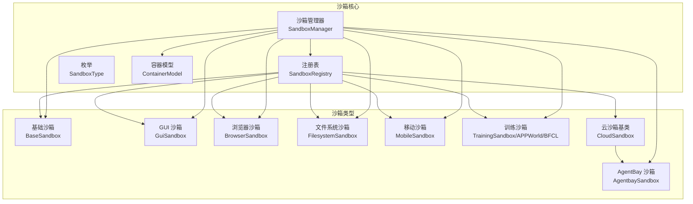
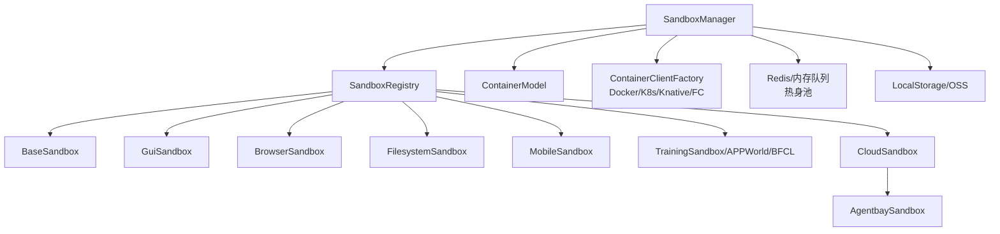
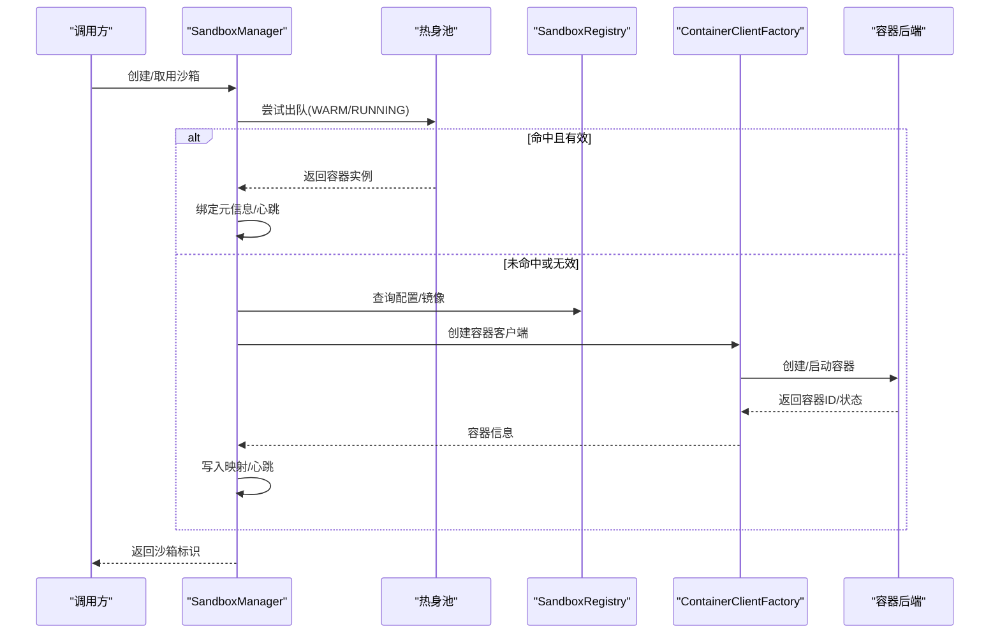
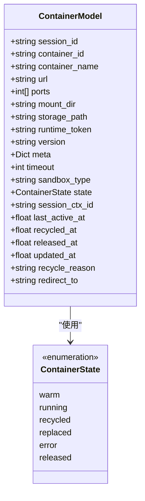
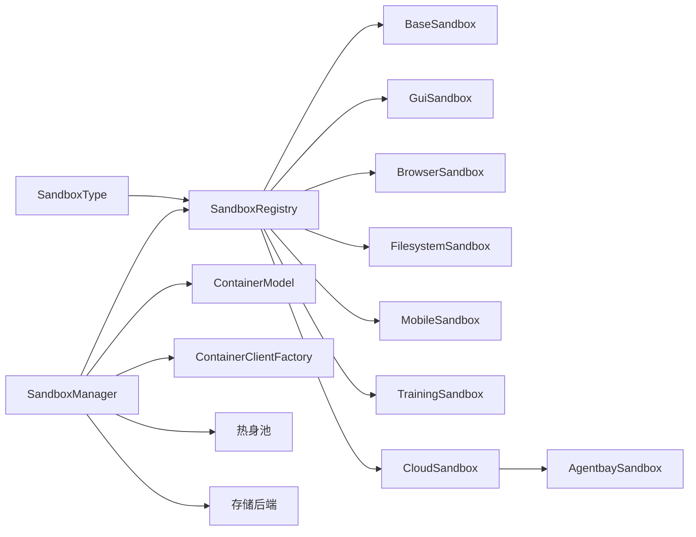
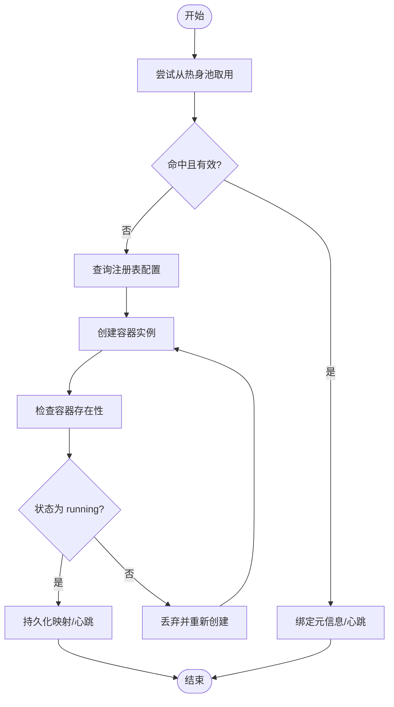

# 沙箱系统

<cite>
**本文引用的文件**
- [src/agentscope_runtime/sandbox/__init__.py](file://src/agentscope_runtime/sandbox/__init__.py)
- [src/agentscope_runtime/sandbox/enums.py](file://src/agentscope_runtime/sandbox/enums.py)
- [src/agentscope_runtime/sandbox/model/container.py](file://src/agentscope_runtime/sandbox/model/container.py)
- [src/agentscope_runtime/sandbox/manager/sandbox_manager.py](file://src/agentscope_runtime/sandbox/manager/sandbox_manager.py)
- [src/agentscope_runtime/sandbox/registry.py](file://src/agentscope_runtime/sandbox/registry.py)
- [src/agentscope_runtime/sandbox/box/base/base_sandbox.py](file://src/agentscope_runtime/sandbox/box/base/base_sandbox.py)
- [src/agentscope_runtime/sandbox/box/gui/gui_sandbox.py](file://src/agentscope_runtime/sandbox/box/gui/gui_sandbox.py)
- [src/agentscope_runtime/sandbox/box/browser/browser_sandbox.py](file://src/agentscope_runtime/sandbox/box/browser/browser_sandbox.py)
- [src/agentscope_runtime/sandbox/box/filesystem/filesystem_sandbox.py](file://src/agentscope_runtime/sandbox/box/filesystem/filesystem_sandbox.py)
- [src/agentscope_runtime/sandbox/box/mobile/mobile_sandbox.py](file://src/agentscope_runtime/sandbox/box/mobile/mobile_sandbox.py)
- [src/agentscope_runtime/sandbox/box/cloud/cloud_sandbox.py](file://src/agentscope_runtime/sandbox/box/cloud/cloud_sandbox.py)
- [src/agentscope_runtime/sandbox/box/agentbay/agentbay_sandbox.py](file://src/agentscope_runtime/sandbox/box/agentbay/agentbay_sandbox.py)
- [src/agentscope_runtime/sandbox/box/training_box/training_box.py](file://src/agentscope_runtime/sandbox/box/training_box/training_box.py)
</cite>

## 目录
1. [引言](#引言)
2. [项目结构](#项目结构)
3. [核心组件](#核心组件)
4. [架构总览](#架构总览)
5. [详细组件分析](#详细组件分析)
6. [依赖分析](#依赖分析)
7. [性能考虑](#性能考虑)
8. [故障排查指南](#故障排查指南)
9. [结论](#结论)
10. [附录](#附录)

## 引言
本文件系统性解析 AgentScope Runtime 的沙箱系统架构与安全隔离机制，覆盖沙箱基本概念、类型分类、安全边界设计、沙箱管理器职责（创建/销毁/状态管理/资源分配）、容器模型（Docker 集成、资源限制、网络配置）、各类沙箱特性（基础、GUI、浏览器、文件系统、移动、训练、云），以及配置最佳实践（安全策略、性能优化、故障恢复）与扩展指南（自定义沙箱开发）。

## 项目结构
沙箱系统位于 src/agentscope_runtime/sandbox 目录下，采用“按功能域分层 + 按类型聚合”的组织方式：
- 枚举与注册表：定义沙箱类型、安全等级、超时等元数据，并集中注册各沙箱类与其配置。
- 管理器：负责沙箱生命周期、池化复用、心跳扫描、清理回收、远程/本地模式切换。
- 容器模型：抽象容器实例的状态、端口、挂载、令牌、版本、超时、重定向等。
- 各类沙箱：基础、GUI、浏览器、文件系统、移动、训练、云（AgentBay）等。
- 云基类：为不依赖本地容器的云环境提供统一接口。

图表来源
- [src/agentscope_runtime/sandbox/registry.py:33-131](file://src/agentscope_runtime/sandbox/registry.py#L33-L131)
- [src/agentscope_runtime/sandbox/enums.py:61-80](file://src/agentscope_runtime/sandbox/enums.py#L61-L80)
- [src/agentscope_runtime/sandbox/model/container.py:19-158](file://src/agentscope_runtime/sandbox/model/container.py#L19-L158)
- [src/agentscope_runtime/sandbox/manager/sandbox_manager.py:140-520](file://src/agentscope_runtime/sandbox/manager/sandbox_manager.py#L140-L520)
- [src/agentscope_runtime/sandbox/box/base/base_sandbox.py:11-17](file://src/agentscope_runtime/sandbox/box/base/base_sandbox.py#L11-L17)
- [src/agentscope_runtime/sandbox/box/gui/gui_sandbox.py:65-71](file://src/agentscope_runtime/sandbox/box/gui/gui_sandbox.py#L65-L71)
- [src/agentscope_runtime/sandbox/box/browser/browser_sandbox.py:31-37](file://src/agentscope_runtime/sandbox/box/browser/browser_sandbox.py#L31-L37)
- [src/agentscope_runtime/sandbox/box/filesystem/filesystem_sandbox.py:13-19](file://src/agentscope_runtime/sandbox/box/filesystem/filesystem_sandbox.py#L13-L19)
- [src/agentscope_runtime/sandbox/box/mobile/mobile_sandbox.py:80-87](file://src/agentscope_runtime/sandbox/box/mobile/mobile_sandbox.py#L80-L87)
- [src/agentscope_runtime/sandbox/box/training_box/training_box.py:18-47](file://src/agentscope_runtime/sandbox/box/training_box/training_box.py#L18-L47)
- [src/agentscope_runtime/sandbox/box/cloud/cloud_sandbox.py:19-82](file://src/agentscope_runtime/sandbox/box/cloud/cloud_sandbox.py#L19-L82)
- [src/agentscope_runtime/sandbox/box/agentbay/agentbay_sandbox.py:20-26](file://src/agentscope_runtime/sandbox/box/agentbay/agentbay_sandbox.py#L20-L26)

章节来源
- [src/agentscope_runtime/sandbox/__init__.py:1-33](file://src/agentscope_runtime/sandbox/__init__.py#L1-L33)
- [src/agentscope_runtime/sandbox/registry.py:33-131](file://src/agentscope_runtime/sandbox/registry.py#L33-L131)
- [src/agentscope_runtime/sandbox/enums.py:61-80](file://src/agentscope_runtime/sandbox/enums.py#L61-L80)

## 核心组件
- 沙箱类型与枚举：通过动态枚举支持内置与扩展类型，涵盖基础、GUI、浏览器、文件系统、移动、训练（APPWorld/BFCL）、AgentBay 等。
- 注册表：集中管理沙箱类与其镜像、资源限制、安全等级、超时、运行时配置等元信息；提供按类型查询与映射。
- 容器模型：统一描述容器实例的标识、名称、URL、端口、挂载目录/存储路径、运行时令牌、镜像版本、会话上下文、心跳时间戳、回收/释放时间戳、状态、重定向目标等。
- 沙箱管理器：负责实例上限控制、池化复用（热身/运行）、心跳扫描、释放清理、远程/本地模式、工作区挂载、存储后端（本地/OSS）、容器客户端工厂（Docker/Kubernetes 等）。

章节来源
- [src/agentscope_runtime/sandbox/enums.py:19-80](file://src/agentscope_runtime/sandbox/enums.py#L19-L80)
- [src/agentscope_runtime/sandbox/registry.py:9-131](file://src/agentscope_runtime/sandbox/registry.py#L9-L131)
- [src/agentscope_runtime/sandbox/model/container.py:19-158](file://src/agentscope_runtime/sandbox/model/container.py#L19-L158)
- [src/agentscope_runtime/sandbox/manager/sandbox_manager.py:140-520](file://src/agentscope_runtime/sandbox/manager/sandbox_manager.py#L140-L520)

## 架构总览
沙箱系统以“注册表驱动 + 管理器编排 + 类型化沙箱 + 统一容器模型”为核心，结合容器客户端工厂实现对 Docker、Kubernetes、Knative、FC 等部署后端的抽象。管理器在本地或远程模式下统一调度，支持心跳扫描、池化复用、实例上限、回收与清理。

图表来源
- [src/agentscope_runtime/sandbox/manager/sandbox_manager.py:140-350](file://src/agentscope_runtime/sandbox/manager/sandbox_manager.py#L140-L350)
- [src/agentscope_runtime/sandbox/registry.py:33-131](file://src/agentscope_runtime/sandbox/registry.py#L33-L131)
- [src/agentscope_runtime/sandbox/model/container.py:19-158](file://src/agentscope_runtime/sandbox/model/container.py#L19-L158)
- [src/agentscope_runtime/sandbox/box/cloud/cloud_sandbox.py:19-82](file://src/agentscope_runtime/sandbox/box/cloud/cloud_sandbox.py#L19-L82)
- [src/agentscope_runtime/sandbox/box/agentbay/agentbay_sandbox.py:20-86](file://src/agentscope_runtime/sandbox/box/agentbay/agentbay_sandbox.py#L20-L86)

## 详细组件分析

### 沙箱类型与安全边界
- 类型体系：包含基础、GUI、浏览器、文件系统、移动、训练（APPWorld/BFCL）、AgentBay 等；支持同步/异步变体。
- 安全等级：注册表中为不同沙箱标注安全等级（如 high/medium），用于策略与审计。
- 边界设计：通过容器模型中的 runtime_token、version、sandbox_type、meta、redirect_to 等字段实现会话绑定、版本校验、重定向与兼容性处理。

章节来源
- [src/agentscope_runtime/sandbox/enums.py:61-80](file://src/agentscope_runtime/sandbox/enums.py#L61-L80)
- [src/agentscope_runtime/sandbox/registry.py:9-31](file://src/agentscope_runtime/sandbox/registry.py#L9-L31)
- [src/agentscope_runtime/sandbox/model/container.py:76-123](file://src/agentscope_runtime/sandbox/model/container.py#L76-L123)

### 沙箱管理器职责
- 生命周期与池化：从热身池尝试取用，若不可用则创建新实例；支持版本检查、状态检查与回收标记清除。
- 资源与配额：限制活跃实例数量，避免资源耗尽；支持多类型池队列。
- 心跳与清理：后台扫描线程定期执行心跳扫描、池内回收、释放清理。
- 远程/本地：支持远程模式（HTTP 客户端）与本地模式（直接调用），装饰器统一远程/本地行为。
- 存储与挂载：支持本地存储与 OSS；默认挂载目录可配置；支持只读挂载。
- 容器客户端：通过工厂选择 Docker/Kubernetes 等后端，统一 inspect/status 等操作。

图表来源
- [src/agentscope_runtime/sandbox/manager/sandbox_manager.py:592-704](file://src/agentscope_runtime/sandbox/manager/sandbox_manager.py#L592-L704)
- [src/agentscope_runtime/sandbox/registry.py:115-131](file://src/agentscope_runtime/sandbox/registry.py#L115-L131)

章节来源
- [src/agentscope_runtime/sandbox/manager/sandbox_manager.py:444-520](file://src/agentscope_runtime/sandbox/manager/sandbox_manager.py#L444-L520)
- [src/agentscope_runtime/sandbox/manager/sandbox_manager.py:592-704](file://src/agentscope_runtime/sandbox/manager/sandbox_manager.py#L592-L704)
- [src/agentscope_runtime/sandbox/manager/sandbox_manager.py:706-800](file://src/agentscope_runtime/sandbox/manager/sandbox_manager.py#L706-L800)

### 容器模型与资源限制
- 字段语义：session_id、container_id/name、url、ports、mount_dir/storage_path、runtime_token、version、meta、timeout、sandbox_type、state、session_ctx_id、last_active_at/recycled_at/released_at/updated_at、recycle_reason、redirect_to。
- 状态机：warm/running/recycled/replaced/error/released，用于生命周期与回收策略。
- 兼容性：自动补齐 meta 与 session_ctx_id，确保旧代码兼容。
- 资源映射：注册表中的 resource_limits 自动映射到 runtime_config（如 mem_limit、nano_cpus）。

图表来源
- [src/agentscope_runtime/sandbox/model/container.py:10-158](file://src/agentscope_runtime/sandbox/model/container.py#L10-L158)

章节来源
- [src/agentscope_runtime/sandbox/model/container.py:19-158](file://src/agentscope_runtime/sandbox/model/container.py#L19-L158)
- [src/agentscope_runtime/sandbox/registry.py:22-31](file://src/agentscope_runtime/sandbox/registry.py#L22-L31)

### 容器客户端与网络配置
- 客户端工厂：根据部署类型选择具体客户端（Docker/Kubernetes/Knative/FC 等），统一提供 inspect/get_status 等能力。
- 网络与端口：容器模型记录占用端口列表；沙箱类通过工具调用与 URL 拼接暴露访问入口（如 VNC、WebSockify、桌面 URL）。
- 认证令牌：runtime_token 用于沙箱内部认证或安全通信。

章节来源
- [src/agentscope_runtime/sandbox/manager/sandbox_manager.py:245-251](file://src/agentscope_runtime/sandbox/manager/sandbox_manager.py#L245-L251)
- [src/agentscope_runtime/sandbox/model/container.py:37-61](file://src/agentscope_runtime/sandbox/model/container.py#L37-L61)
- [src/agentscope_runtime/sandbox/box/gui/gui_sandbox.py:17-35](file://src/agentscope_runtime/sandbox/box/gui/gui_sandbox.py#L17-L35)
- [src/agentscope_runtime/sandbox/box/mobile/mobile_sandbox.py:17-41](file://src/agentscope_runtime/sandbox/box/mobile/mobile_sandbox.py#L17-L41)

### 不同类型沙箱特点
- 基础沙箱（BaseSandbox/BaseSandboxAsync）
  - 提供运行 IPython 单元格与 shell 命令的能力，适合通用命令行与脚本执行。
- GUI 沙箱（GuiSandbox/GUI_ASYNC）
  - 支持桌面 URL 与 VNC，提供鼠标键盘交互与截图；注意部分平台兼容性提示。
- 浏览器沙箱（BrowserSandbox/BROWSER_ASYNC）
  - 提供导航、点击、输入、截图、PDF 导出、网络请求、标签页管理等完整浏览器操作。
- 文件系统沙箱（FilesystemSandbox/FILESYSTEM_ASYNC）
  - 提供文件读写、目录树、搜索、移动、权限与允许目录列表等文件操作。
- 移动沙箱（MobileSandbox/MOBILE_ASYNC）
  - 通过 ADB 动作（点击、滑动、按键、文本输入、截图）与屏幕分辨率查询；需要主机准备。
- 训练沙箱（TrainingSandbox/APPWorld/BFCL）
  - 提供训练环境实例创建、任务 ID 获取、环境画像、单步执行、评估与实例释放；针对不同场景设置共享内存等运行时参数。
- 云沙箱基类（CloudSandbox）
  - 不依赖本地容器，直接对接云 API；提供统一接口与清理流程。
- AgentBay 沙箱（AgentbaySandbox）
  - 基于 AgentBay 云服务，支持多种镜像类型与会话管理，封装文件系统、命令、浏览器、截图等工具调用。

章节来源
- [src/agentscope_runtime/sandbox/box/base/base_sandbox.py:11-102](file://src/agentscope_runtime/sandbox/box/base/base_sandbox.py#L11-L102)
- [src/agentscope_runtime/sandbox/box/gui/gui_sandbox.py:65-240](file://src/agentscope_runtime/sandbox/box/gui/gui_sandbox.py#L65-L240)
- [src/agentscope_runtime/sandbox/box/browser/browser_sandbox.py:31-498](file://src/agentscope_runtime/sandbox/box/browser/browser_sandbox.py#L31-L498)
- [src/agentscope_runtime/sandbox/box/filesystem/filesystem_sandbox.py:13-254](file://src/agentscope_runtime/sandbox/box/filesystem/filesystem_sandbox.py#L13-L254)
- [src/agentscope_runtime/sandbox/box/mobile/mobile_sandbox.py:80-342](file://src/agentscope_runtime/sandbox/box/mobile/mobile_sandbox.py#L80-L342)
- [src/agentscope_runtime/sandbox/box/training_box/training_box.py:18-295](file://src/agentscope_runtime/sandbox/box/training_box/training_box.py#L18-L295)
- [src/agentscope_runtime/sandbox/box/cloud/cloud_sandbox.py:19-251](file://src/agentscope_runtime/sandbox/box/cloud/cloud_sandbox.py#L19-L251)
- [src/agentscope_runtime/sandbox/box/agentbay/agentbay_sandbox.py:20-558](file://src/agentscope_runtime/sandbox/box/agentbay/agentbay_sandbox.py#L20-L558)

### 沙箱配置最佳实践
- 安全策略
  - 使用 runtime_token 与版本号进行容器绑定与校验，避免过期或被替换。
  - 对高风险类型（GUI、移动、浏览器）启用更严格的安全等级与资源限制。
  - 通过 meta/session_ctx_id 绑定会话上下文，便于审计与追踪。
- 性能优化
  - 启用热身池（WARM/RUNNING）减少冷启动延迟；合理设置 watcher 扫描间隔。
  - 为训练类沙箱设置合适的共享内存与 CPU/内存限制，避免资源争用。
  - 使用 OSS 存储大文件，减少本地磁盘压力。
- 故障恢复
  - 利用回收/释放时间戳与状态机，定期扫描并清理异常容器。
  - 在远程模式下统一错误返回格式，便于上层处理。
  - 云沙箱提供显式清理流程，确保资源回收。

章节来源
- [src/agentscope_runtime/sandbox/model/container.py:82-123](file://src/agentscope_runtime/sandbox/model/container.py#L82-L123)
- [src/agentscope_runtime/sandbox/manager/sandbox_manager.py:444-520](file://src/agentscope_runtime/sandbox/manager/sandbox_manager.py#L444-L520)
- [src/agentscope_runtime/sandbox/box/training_box/training_box.py:206-265](file://src/agentscope_runtime/sandbox/box/training_box/training_box.py#L206-L265)
- [src/agentscope_runtime/sandbox/box/cloud/cloud_sandbox.py:222-251](file://src/agentscope_runtime/sandbox/box/cloud/cloud_sandbox.py#L222-L251)

### 扩展方法与自定义沙箱开发指南
- 新增沙箱类型
  - 在枚举中添加新类型（或使用动态添加），并在注册表中通过装饰器注册镜像、资源限制、安全等级、超时、环境变量与运行时配置。
  - 实现对应沙箱类，继承相应基类（如 Sandbox/SandboxAsync），并通过 call_tool 调用工具。
- 容器集成
  - 通过容器客户端工厂接入新的部署后端；确保提供 inspect/get_status 等能力。
  - 在容器模型中补充必要的元信息（如 ports、runtime_token、redirect_to）。
- 云沙箱
  - 继承 CloudSandbox，实现初始化云客户端、创建/删除会话、工具调用映射与清理逻辑。
- 测试与验证
  - 编写单元测试覆盖创建/销毁、心跳、池化、远程/本地模式切换等关键路径。
  - 针对平台差异（如 ARM64）添加兼容性告警与降级策略。

章节来源
- [src/agentscope_runtime/sandbox/enums.py:19-80](file://src/agentscope_runtime/sandbox/enums.py#L19-L80)
- [src/agentscope_runtime/sandbox/registry.py:39-91](file://src/agentscope_runtime/sandbox/registry.py#L39-L91)
- [src/agentscope_runtime/sandbox/box/cloud/cloud_sandbox.py:83-138](file://src/agentscope_runtime/sandbox/box/cloud/cloud_sandbox.py#L83-L138)
- [src/agentscope_runtime/sandbox/box/agentbay/agentbay_sandbox.py:88-187](file://src/agentscope_runtime/sandbox/box/agentbay/agentbay_sandbox.py#L88-L187)

## 依赖分析
- 模块耦合
  - 管理器依赖注册表与容器模型；通过客户端工厂解耦具体容器后端。
  - 各沙箱类依赖注册表元信息与工具调用框架。
  - 云沙箱独立于本地容器管理，仅依赖云 SDK。
- 可能的循环依赖
  - 当前结构清晰，无明显循环导入；注册表装饰器在模块导入时完成注册，避免延迟加载导致的类型缺失。
- 外部依赖
  - Docker/Kubernetes/Knative/FC 等容器后端；OSS/Redis 等外部存储与缓存；AgentBay SDK。

图表来源
- [src/agentscope_runtime/sandbox/enums.py:61-80](file://src/agentscope_runtime/sandbox/enums.py#L61-L80)
- [src/agentscope_runtime/sandbox/registry.py:33-131](file://src/agentscope_runtime/sandbox/registry.py#L33-L131)
- [src/agentscope_runtime/sandbox/manager/sandbox_manager.py:140-350](file://src/agentscope_runtime/sandbox/manager/sandbox_manager.py#L140-L350)

章节来源
- [src/agentscope_runtime/sandbox/registry.py:33-131](file://src/agentscope_runtime/sandbox/registry.py#L33-L131)
- [src/agentscope_runtime/sandbox/manager/sandbox_manager.py:140-350](file://src/agentscope_runtime/sandbox/manager/sandbox_manager.py#L140-L350)

## 性能考虑
- 池化复用：优先从热身池取用，显著降低创建开销；版本与状态校验保证可用性。
- 心跳扫描：后台线程定期扫描，及时发现异常并回收，避免资源泄漏。
- 实例上限：防止并发过多导致资源耗尽；统计活跃状态（WARM/ RUNNING）进行配额控制。
- 存储与网络：OSS 与本地存储的选择影响 I/O 性能；端口与 URL 暴露需谨慎规划，避免冲突。
- 平台兼容：GUI 沙箱在特定架构存在兼容性问题，应提前预警并提供替代方案。

## 故障排查指南
- 远程模式错误
  - 统一的 HTTP 请求包装会将服务器错误详情拼接到返回中，便于定位。
- 容器不可用
  - 检查容器是否存在、状态是否为 running；若不满足则释放并重新创建。
- 回收与释放
  - 通过回收时间戳与状态机判断容器是否已回收/释放；必要时触发清理流程。
- 云沙箱
  - 确认 API Key 与网络连通性；查看会话创建/删除结果与错误信息。

章节来源
- [src/agentscope_runtime/sandbox/manager/sandbox_manager.py:344-442](file://src/agentscope_runtime/sandbox/manager/sandbox_manager.py#L344-L442)
- [src/agentscope_runtime/sandbox/manager/sandbox_manager.py:510-585](file://src/agentscope_runtime/sandbox/manager/sandbox_manager.py#L510-L585)
- [src/agentscope_runtime/sandbox/box/agentbay/agentbay_sandbox.py:115-187](file://src/agentscope_runtime/sandbox/box/agentbay/agentbay_sandbox.py#L115-L187)

## 结论
AgentScope Runtime 的沙箱系统通过“注册表驱动 + 管理器编排 + 类型化沙箱 + 统一容器模型”的架构实现了高内聚、低耦合的隔离执行环境。它在安全边界、资源限制、网络配置、心跳与回收、远程/本地模式等方面具备完善的机制，并提供了丰富的沙箱类型与云集成能力。遵循本文的最佳实践与扩展指南，可在保证安全与稳定的前提下灵活扩展与定制。

## 附录
- 关键流程图（算法实现）
  - 创建/取用流程（含池化与版本/状态校验）
  - 清理回收流程（含热身池与映射清理）

图表来源
- [src/agentscope_runtime/sandbox/manager/sandbox_manager.py:592-704](file://src/agentscope_runtime/sandbox/manager/sandbox_manager.py#L592-L704)