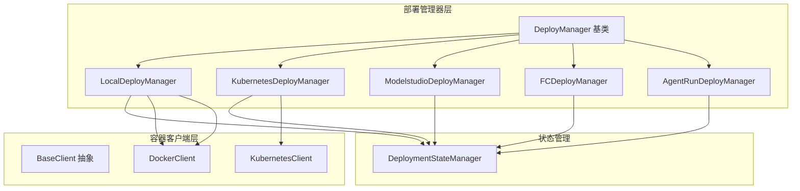
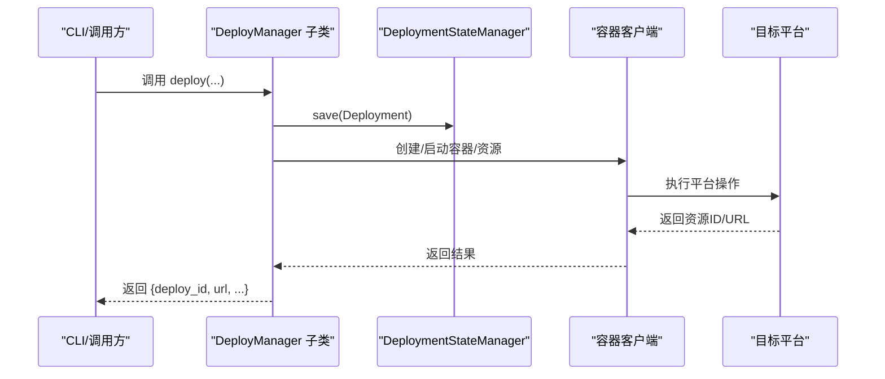
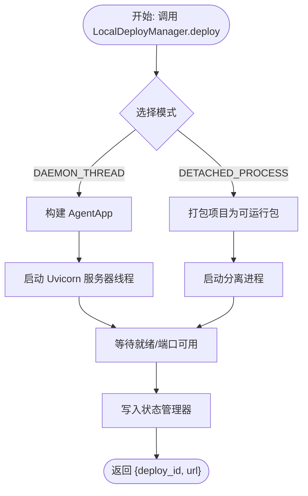
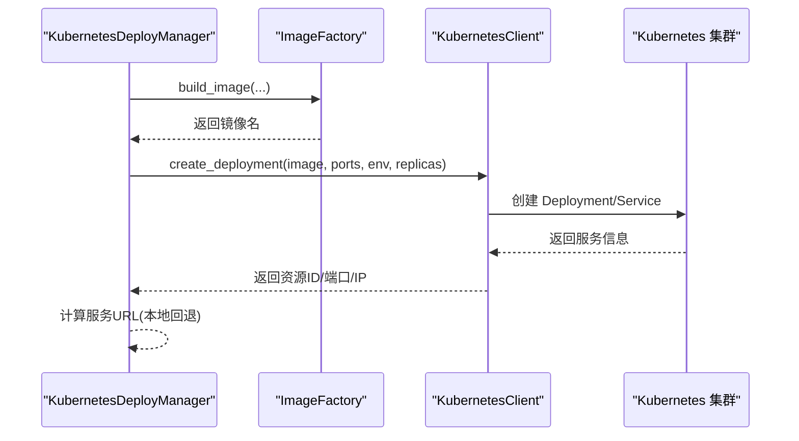
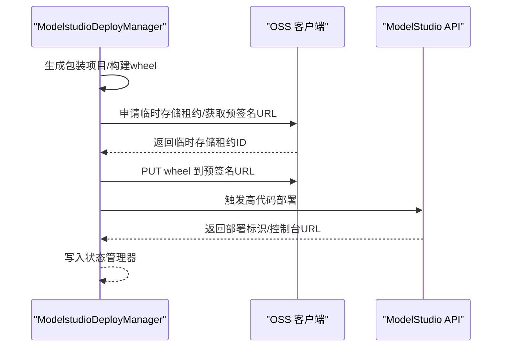
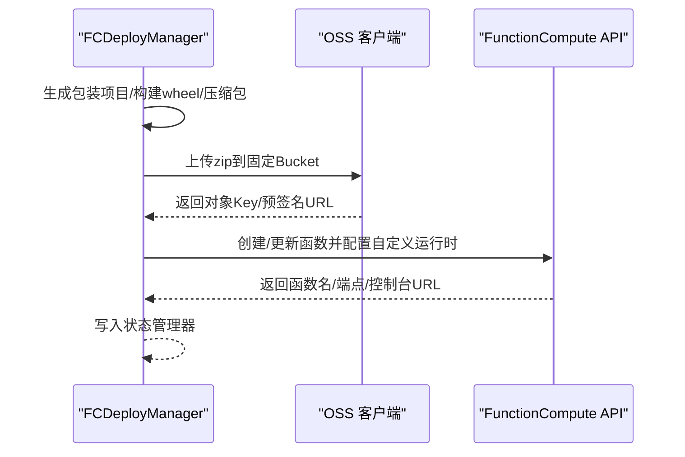
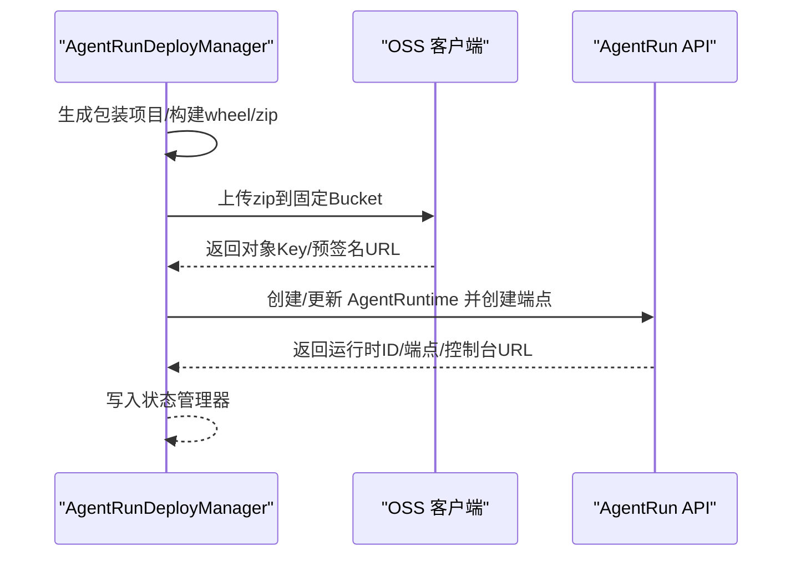
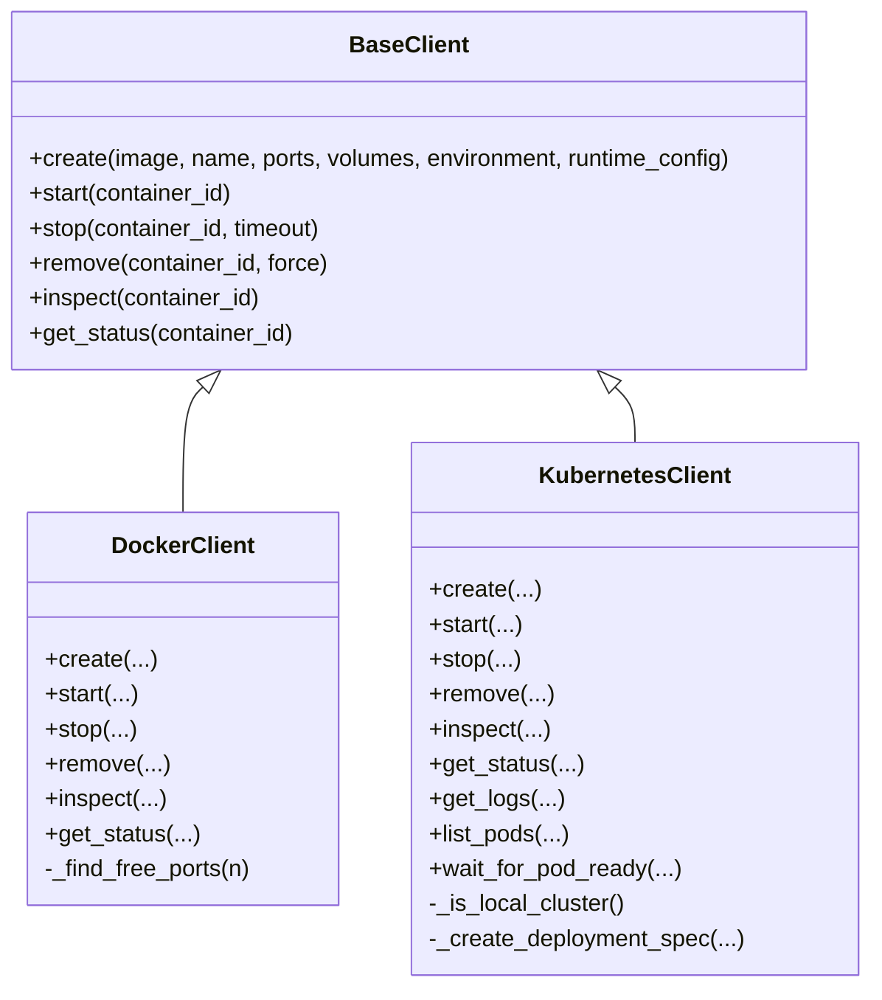
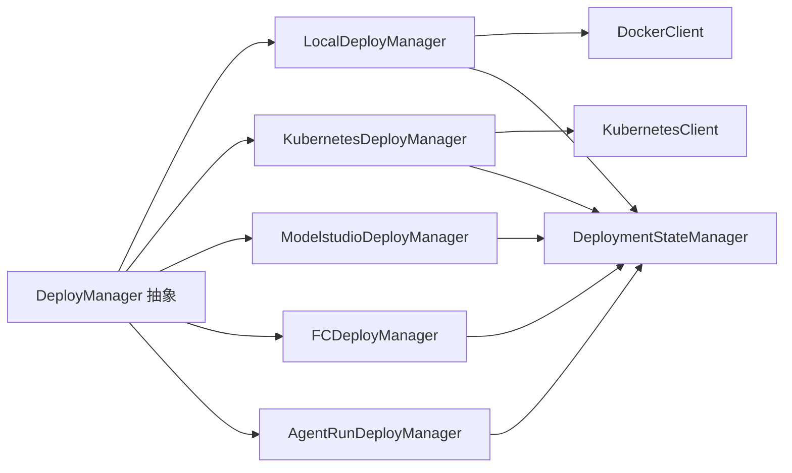

# 部署模式

<cite>
**本文引用的文件**
- [src/agentscope_runtime/engine/deployers/__init__.py](file://src/agentscope_runtime/engine/deployers/__init__.py)
- [src/agentscope_runtime/engine/deployers/base.py](file://src/agentscope_runtime/engine/deployers/base.py)
- [src/agentscope_runtime/engine/deployers/local_deployer.py](file://src/agentscope_runtime/engine/deployers/local_deployer.py)
- [src/agentscope_runtime/engine/deployers/utils/deployment_modes.py](file://src/agentscope_runtime/engine/deployers/utils/deployment_modes.py)
- [src/agentscope_runtime/engine/deployers/state/manager.py](file://src/agentscope_runtime/engine/deployers/state/manager.py)
- [src/agentscope_runtime/common/container_clients/base_client.py](file://src/agentscope_runtime/common/container_clients/base_client.py)
- [src/agentscope_runtime/common/container_clients/docker_client.py](file://src/agentscope_runtime/common/container_clients/docker_client.py)
- [src/agentscope_runtime/common/container_clients/kubernetes_client.py](file://src/agentscope_runtime/common/container_clients/kubernetes_client.py)
- [src/agentscope_runtime/engine/deployers/kubernetes_deployer.py](file://src/agentscope_runtime/engine/deployers/kubernetes_deployer.py)
- [src/agentscope_runtime/engine/deployers/modelstudio_deployer.py](file://src/agentscope_runtime/engine/deployers/modelstudio_deployer.py)
- [src/agentscope_runtime/engine/deployers/fc_deployer.py](file://src/agentscope_runtime/engine/deployers/fc_deployer.py)
- [src/agentscope_runtime/engine/deployers/agentrun_deployer.py](file://src/agentscope_runtime/engine/deployers/agentrun_deployer.py)
- [examples/deployments/local_deploy_config.yaml](file://examples/deployments/local_deploy_config.yaml)
</cite>

## 目录
1. [引言](#引言)
2. [项目结构](#项目结构)
3. [核心组件](#核心组件)
4. [架构总览](#架构总览)
5. [详细组件分析](#详细组件分析)
6. [依赖分析](#依赖分析)
7. [性能考虑](#性能考虑)
8. [故障排查指南](#故障排查指南)
9. [结论](#结论)
10. [附录](#附录)

## 引言
本文件系统化解析 AgentScope Runtime 的多种部署模式与部署管理器架构，重点覆盖以下主题：
- 多种部署模式：本地部署（守护进程模式、分离进程模式）、Kubernetes 集群部署、阿里云函数计算（FC）、阿里云 ModelStudio、阿里云 AgentRun 等。
- 统一部署管理器接口设计：抽象基类、通用部署流程、状态管理。
- 容器客户端抽象层：Docker 客户端、Kubernetes 客户端、AgentRun 客户端等。
- 动态部署配置生成、镜像构建与服务发现机制。
- 部署模式选择的决策指南与最佳实践。

## 项目结构
AgentScope Runtime 将“部署模式”与“容器平台”解耦，通过统一的 DeployManager 抽象与平台特定的 DeployManager 实现，结合容器客户端抽象层，实现跨平台一致的部署体验。

图表来源
- [src/agentscope_runtime/engine/deployers/base.py:9-44](file://src/agentscope_runtime/engine/deployers/base.py#L9-L44)
- [src/agentscope_runtime/engine/deployers/local_deployer.py:27-645](file://src/agentscope_runtime/engine/deployers/local_deployer.py#L27-L645)
- [src/agentscope_runtime/engine/deployers/kubernetes_deployer.py:48-391](file://src/agentscope_runtime/engine/deployers/kubernetes_deployer.py#L48-L391)
- [src/agentscope_runtime/engine/deployers/modelstudio_deployer.py:544-947](file://src/agentscope_runtime/engine/deployers/modelstudio_deployer.py#L544-L947)
- [src/agentscope_runtime/engine/deployers/fc_deployer.py:246-1507](file://src/agentscope_runtime/engine/deployers/fc_deployer.py#L246-L1507)
- [src/agentscope_runtime/engine/deployers/agentrun_deployer.py:264-800](file://src/agentscope_runtime/engine/deployers/agentrun_deployer.py#L264-L800)
- [src/agentscope_runtime/common/container_clients/base_client.py:5-40](file://src/agentscope_runtime/common/container_clients/base_client.py#L5-L40)
- [src/agentscope_runtime/common/container_clients/docker_client.py:20-231](file://src/agentscope_runtime/common/container_clients/docker_client.py#L20-L231)
- [src/agentscope_runtime/common/container_clients/kubernetes_client.py:19-1144](file://src/agentscope_runtime/common/container_clients/kubernetes_client.py#L19-L1144)
- [src/agentscope_runtime/engine/deployers/state/manager.py:17-389](file://src/agentscope_runtime/engine/deployers/state/manager.py#L17-L389)

章节来源
- [src/agentscope_runtime/engine/deployers/__init__.py:18-51](file://src/agentscope_runtime/engine/deployers/__init__.py#L18-L51)

## 核心组件
- DeployManager 抽象基类：定义统一的部署与停止接口，内置唯一部署标识与共享状态管理器。
- 平台特定 DeployManager：LocalDeployManager、KubernetesDeployManager、ModelstudioDeployManager、FCDeployManager、AgentRunDeployManager。
- 容器客户端抽象层：BaseClient 及其实现（DockerClient、KubernetesClient），屏蔽底层平台差异。
- 状态管理：DeploymentStateManager 提供持久化存储、备份与恢复、列表过滤与更新状态能力。

章节来源
- [src/agentscope_runtime/engine/deployers/base.py:9-44](file://src/agentscope_runtime/engine/deployers/base.py#L9-L44)
- [src/agentscope_runtime/engine/deployers/state/manager.py:17-389](file://src/agentscope_runtime/engine/deployers/state/manager.py#L17-L389)
- [src/agentscope_runtime/common/container_clients/base_client.py:5-40](file://src/agentscope_runtime/common/container_clients/base_client.py#L5-L40)

## 架构总览
统一接口 + 平台适配 + 容器抽象 + 状态持久化

图表来源
- [src/agentscope_runtime/engine/deployers/base.py:23-43](file://src/agentscope_runtime/engine/deployers/base.py#L23-L43)
- [src/agentscope_runtime/engine/deployers/state/manager.py:232-260](file://src/agentscope_runtime/engine/deployers/state/manager.py#L232-L260)
- [src/agentscope_runtime/common/container_clients/base_client.py:6-39](file://src/agentscope_runtime/common/container_clients/base_client.py#L6-L39)
- [src/agentscope_runtime/common/container_clients/docker_client.py:67-135](file://src/agentscope_runtime/common/container_clients/docker_client.py#L67-L135)
- [src/agentscope_runtime/common/container_clients/kubernetes_client.py:263-440](file://src/agentscope_runtime/common/container_clients/kubernetes_client.py#L263-L440)

## 详细组件分析

### 本地部署模式
- 模式类型：守护进程模式（DAEMON_THREAD）与分离进程模式（DETACHED_PROCESS）。
- 特点：
  - 守护进程模式：在当前进程中以异步服务器方式运行，适合开发调试与快速验证。
  - 分离进程模式：打包项目为可运行包，独立进程启动，支持优雅关闭与 PID 文件管理。
- 关键流程：
  - 本地打包与入口脚本生成。
  - 进程启动、端口等待与健康检查。
  - 停止时优先 HTTP /shutdown，失败则直接进程停止。
- 状态管理：保存部署元数据（平台、URL、配置、创建时间、状态）。

图表来源
- [src/agentscope_runtime/engine/deployers/local_deployer.py:68-174](file://src/agentscope_runtime/engine/deployers/local_deployer.py#L68-L174)
- [src/agentscope_runtime/engine/deployers/local_deployer.py:260-383](file://src/agentscope_runtime/engine/deployers/local_deployer.py#L260-L383)
- [src/agentscope_runtime/engine/deployers/state/manager.py:232-260](file://src/agentscope_runtime/engine/deployers/state/manager.py#L232-L260)

章节来源
- [src/agentscope_runtime/engine/deployers/local_deployer.py:27-645](file://src/agentscope_runtime/engine/deployers/local_deployer.py#L27-L645)
- [src/agentscope_runtime/engine/deployers/utils/deployment_modes.py:7-15](file://src/agentscope_runtime/engine/deployers/utils/deployment_modes.py#L7-L15)

### Kubernetes 部署模式
- 特点：基于镜像构建与 Kubernetes 资源编排，支持自动选择服务端点（本地环境回退到 127.0.0.1）。
- 关键流程：
  - 使用 ImageFactory 构建镜像（含缓存、推送选项）。
  - 通过 KubernetesClient 创建 Deployment 与 Service。
  - 自动推断服务 URL（LoadBalancer/ExternalIP 或本地回退）。
- 状态管理：保存镜像名、副本数、端口、环境变量等配置。

图表来源
- [src/agentscope_runtime/engine/deployers/kubernetes_deployer.py:126-312](file://src/agentscope_runtime/engine/deployers/kubernetes_deployer.py#L126-L312)
- [src/agentscope_runtime/engine/deployers/kubernetes_deployer.py:313-391](file://src/agentscope_runtime/engine/deployers/kubernetes_deployer.py#L313-L391)
- [src/agentscope_runtime/common/container_clients/kubernetes_client.py:263-440](file://src/agentscope_runtime/common/container_clients/kubernetes_client.py#L263-L440)

章节来源
- [src/agentscope_runtime/engine/deployers/kubernetes_deployer.py:48-391](file://src/agentscope_runtime/engine/deployers/kubernetes_deployer.py#L48-L391)
- [src/agentscope_runtime/common/container_clients/kubernetes_client.py:19-1144](file://src/agentscope_runtime/common/container_clients/kubernetes_client.py#L19-L1144)

### 阿里云 ModelStudio 部署模式
- 特点：将项目打包为 wheel，上传至 OSS，触发 ModelStudio 全量代码部署。
- 关键流程：
  - 生成包装项目与 wheel。
  - 申请临时存储租约，获取预签名 URL 并上传 wheel。
  - 调用 ModelStudio 高代码部署接口。
- 状态管理：保存控制台 URL、资源名、轮子路径等。

图表来源
- [src/agentscope_runtime/engine/deployers/modelstudio_deployer.py:727-800](file://src/agentscope_runtime/engine/deployers/modelstudio_deployer.py#L727-L800)
- [src/agentscope_runtime/engine/deployers/modelstudio_deployer.py:413-542](file://src/agentscope_runtime/engine/deployers/modelstudio_deployer.py#L413-L542)

章节来源
- [src/agentscope_runtime/engine/deployers/modelstudio_deployer.py:544-947](file://src/agentscope_runtime/engine/deployers/modelstudio_deployer.py#L544-L947)

### 阿里云函数计算（FC）部署模式
- 特点：使用自定义运行时，支持会话亲和、超时与并发限制配置；支持更新现有函数或创建新函数。
- 关键流程：
  - 包装项目为 wheel 并在容器内构建压缩包。
  - 上传至固定 OSS Bucket，创建/更新函数并配置 HTTP 触发器。
- 状态管理：保存函数名、公网/内网端点、控制台 URL 等。

图表来源
- [src/agentscope_runtime/engine/deployers/fc_deployer.py:416-582](file://src/agentscope_runtime/engine/deployers/fc_deployer.py#L416-L582)
- [src/agentscope_runtime/engine/deployers/fc_deployer.py:587-800](file://src/agentscope_runtime/engine/deployers/fc_deployer.py#L587-L800)

章节来源
- [src/agentscope_runtime/engine/deployers/fc_deployer.py:246-1507](file://src/agentscope_runtime/engine/deployers/fc_deployer.py#L246-L1507)

### 阿里云 AgentRun 部署模式
- 特点：面向 Agent 运行时的托管服务，支持版本发布、网络与日志配置。
- 关键流程：
  - 生成包装项目与 wheel，构建容器内 zip 包。
  - 上传至 OSS，创建/更新 AgentRuntime 并创建公开端点。
- 状态管理：保存运行时ID、公开端点、控制台URL等。

图表来源
- [src/agentscope_runtime/engine/deployers/agentrun_deployer.py:521-733](file://src/agentscope_runtime/engine/deployers/agentrun_deployer.py#L521-L733)
- [src/agentscope_runtime/engine/deployers/agentrun_deployer.py:734-800](file://src/agentscope_runtime/engine/deployers/agentrun_deployer.py#L734-L800)

章节来源
- [src/agentscope_runtime/engine/deployers/agentrun_deployer.py:264-800](file://src/agentscope_runtime/engine/deployers/agentrun_deployer.py#L264-L800)

### 容器客户端抽象层
- BaseClient：定义 create/start/stop/remove/inspect/get_status 等通用方法。
- DockerClient：封装 Docker 客户端，负责镜像拉取、容器创建与端口分配、状态查询与清理。
- KubernetesClient：封装 Kubernetes 客户端，负责 Pod/Deployment/Service 生命周期管理、日志与节点IP解析、本地集群识别与回退策略。

图表来源
- [src/agentscope_runtime/common/container_clients/base_client.py:5-40](file://src/agentscope_runtime/common/container_clients/base_client.py#L5-L40)
- [src/agentscope_runtime/common/container_clients/docker_client.py:20-231](file://src/agentscope_runtime/common/container_clients/docker_client.py#L20-L231)
- [src/agentscope_runtime/common/container_clients/kubernetes_client.py:19-1144](file://src/agentscope_runtime/common/container_clients/kubernetes_client.py#L19-L1144)

章节来源
- [src/agentscope_runtime/common/container_clients/base_client.py:5-40](file://src/agentscope_runtime/common/container_clients/base_client.py#L5-L40)
- [src/agentscope_runtime/common/container_clients/docker_client.py:20-231](file://src/agentscope_runtime/common/container_clients/docker_client.py#L20-L231)
- [src/agentscope_runtime/common/container_clients/kubernetes_client.py:19-1144](file://src/agentscope_runtime/common/container_clients/kubernetes_client.py#L19-L1144)

### 部署配置与动态生成
- 本地部署配置示例：包含主机、端口、环境变量等。
- 动态生成：LocalDeployManager 支持从 runner/app 生成分离进程项目，自动注入入口脚本与环境变量。
- 镜像构建：KubernetesDeployManager 使用 ImageFactory 构建镜像，支持缓存、推送与自定义基础镜像。
- 服务发现：KubernetesDeployManager 自动根据外部IP与端口生成服务URL，并在本地集群回退到 127.0.0.1。

章节来源
- [examples/deployments/local_deploy_config.yaml:1-16](file://examples/deployments/local_deploy_config.yaml#L1-L16)
- [src/agentscope_runtime/engine/deployers/local_deployer.py:387-414](file://src/agentscope_runtime/engine/deployers/local_deployer.py#L387-L414)
- [src/agentscope_runtime/engine/deployers/kubernetes_deployer.py:122-121](file://src/agentscope_runtime/engine/deployers/kubernetes_deployer.py#L122-L121)

### 统一部署流程与状态管理
- 统一接口：所有 DeployManager 实现均需实现 deploy/stop 接口，返回标准结构。
- 状态持久化：DeploymentStateManager 提供保存、读取、列表、更新状态、导入导出与备份清理。
- 错误处理：各 DeployManager 在异常时记录日志并抛出，避免静默失败。

章节来源
- [src/agentscope_runtime/engine/deployers/base.py:23-43](file://src/agentscope_runtime/engine/deployers/base.py#L23-L43)
- [src/agentscope_runtime/engine/deployers/state/manager.py:232-389](file://src/agentscope_runtime/engine/deployers/state/manager.py#L232-L389)

## 依赖分析
- 模块耦合：
  - DeployManager 抽象与具体实现低耦合，通过统一接口与状态管理器交互。
  - 平台特定 DeployManager 仅依赖容器客户端抽象与状态管理器，不直接依赖具体平台SDK。
  - 容器客户端抽象层隔离平台差异，便于扩展新的平台适配器。
- 外部依赖：
  - Docker SDK、Kubernetes Python SDK、阿里云相关 SDK（OSS、ModelStudio、FC、AgentRun）。
- 循环依赖：未见循环依赖迹象。

图表来源
- [src/agentscope_runtime/engine/deployers/base.py:9-44](file://src/agentscope_runtime/engine/deployers/base.py#L9-L44)
- [src/agentscope_runtime/engine/deployers/local_deployer.py:27-645](file://src/agentscope_runtime/engine/deployers/local_deployer.py#L27-L645)
- [src/agentscope_runtime/engine/deployers/kubernetes_deployer.py:48-391](file://src/agentscope_runtime/engine/deployers/kubernetes_deployer.py#L48-L391)
- [src/agentscope_runtime/engine/deployers/modelstudio_deployer.py:544-947](file://src/agentscope_runtime/engine/deployers/modelstudio_deployer.py#L544-L947)
- [src/agentscope_runtime/engine/deployers/fc_deployer.py:246-1507](file://src/agentscope_runtime/engine/deployers/fc_deployer.py#L246-L1507)
- [src/agentscope_runtime/engine/deployers/agentrun_deployer.py:264-800](file://src/agentscope_runtime/engine/deployers/agentrun_deployer.py#L264-L800)
- [src/agentscope_runtime/common/container_clients/docker_client.py:20-231](file://src/agentscope_runtime/common/container_clients/docker_client.py#L20-L231)
- [src/agentscope_runtime/common/container_clients/kubernetes_client.py:19-1144](file://src/agentscope_runtime/common/container_clients/kubernetes_client.py#L19-L1144)
- [src/agentscope_runtime/engine/deployers/state/manager.py:17-389](file://src/agentscope_runtime/engine/deployers/state/manager.py#L17-L389)

## 性能考虑
- 本地守护进程模式：启动快、内存占用低，适合开发与小规模测试。
- 分离进程模式：进程隔离更好，但额外进程开销；建议启用优雅关闭与日志保留策略。
- Kubernetes 模式：具备弹性伸缩与资源隔离优势，镜像构建与缓存策略影响部署速度。
- 云函数（FC）模式：按需扩缩容、冷启动成本需考虑；会话亲和与超时配置影响用户体验。
- ModelStudio/AgentRun 模式：托管服务简化运维，但受限于平台能力与网络配置。

## 故障排查指南
- 本地部署
  - 启动失败：检查端口占用与主机绑定（0.0.0.0 绑定时连接到 127.0.0.1）。
  - 分离进程：查看 PID 文件与日志文件，确认进程是否存活与端口监听。
  - 停止失败：优先尝试 HTTP /shutdown，失败后检查进程是否存在并手动清理。
- Kubernetes
  - 服务不可达：确认 ExternalIP/LoadBalancer 是否可用，本地集群回退逻辑是否生效。
  - 镜像拉取失败：检查镜像名称、私有仓库凭据与网络连通性。
- 云平台
  - ModelStudio/FC/AgentRun：检查 SDK 依赖安装、AK/安全令牌、Bucket 权限与网络配置。
  - 状态异常：使用状态管理器的导入导出与备份恢复功能进行修复。

章节来源
- [src/agentscope_runtime/engine/deployers/local_deployer.py:566-622](file://src/agentscope_runtime/engine/deployers/local_deployer.py#L566-L622)
- [src/agentscope_runtime/engine/deployers/kubernetes_deployer.py:98-121](file://src/agentscope_runtime/engine/deployers/kubernetes_deployer.py#L98-L121)
- [src/agentscope_runtime/engine/deployers/state/manager.py:39-88](file://src/agentscope_runtime/engine/deployers/state/manager.py#L39-L88)

## 结论
AgentScope Runtime 通过统一的 DeployManager 抽象与容器客户端抽象层，实现了对本地、Kubernetes、阿里云多平台的一致部署体验。配合完善的部署状态管理与错误处理机制，既满足开发调试的灵活性，也兼顾生产环境的稳定性与可观测性。选择部署模式应综合考虑性能、扩展性与运维复杂度，并结合实际平台能力与团队运维能力进行权衡。

## 附录
- 配置示例参考
  - 本地部署配置示例：[examples/deployments/local_deploy_config.yaml:1-16](file://examples/deployments/local_deploy_config.yaml#L1-L16)
- 最佳实践
  - 本地开发：优先使用守护进程模式，便于热迭代；生产或集成测试使用分离进程模式。
  - Kubernetes：合理设置副本数与资源限制，开启镜像缓存与推送策略。
  - 云函数：根据业务流量特征配置并发与超时，利用会话亲和提升用户体验。
  - 状态管理：定期备份 deployments.json，必要时进行导入导出与清理。