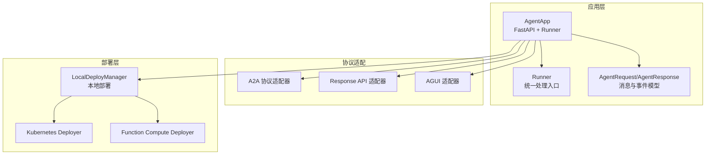
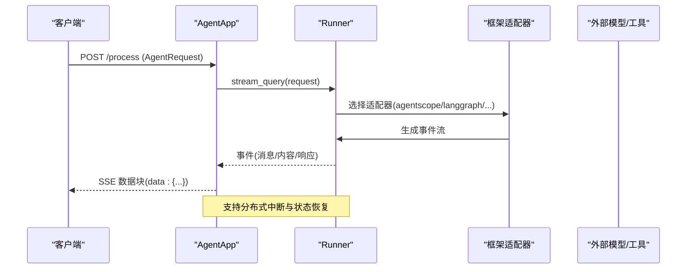
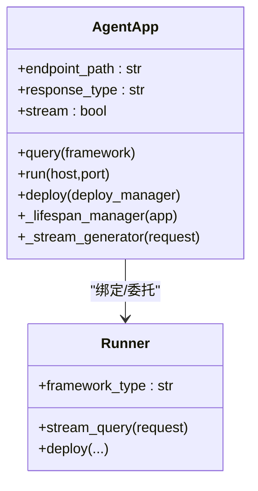
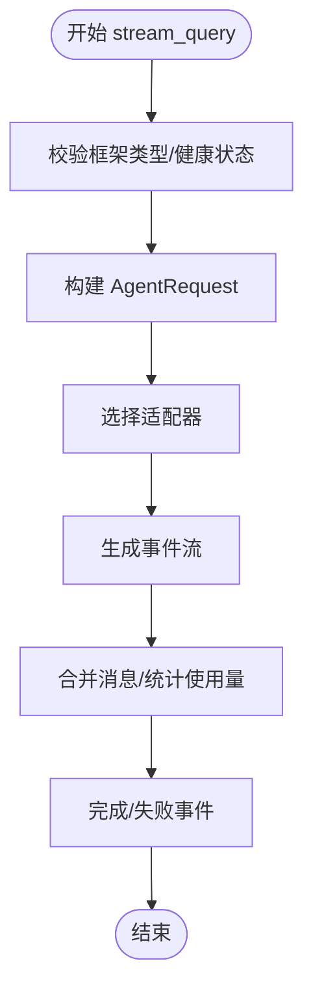
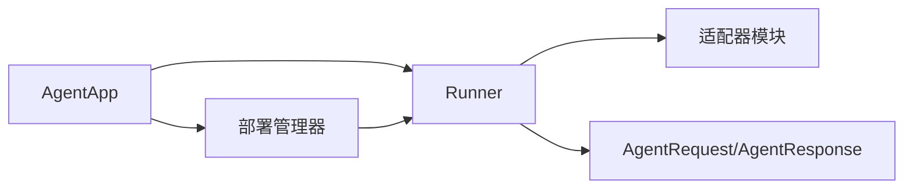

# 第一个智能体示例

<cite>
**本文引用的文件**
- [README.md](file://README.md)
- [agent_app.md](file://cookbook/zh/agent_app.md)
- [agent_app.py](file://src/agentscope_runtime/engine/app/agent_app.py)
- [runner.py](file://src/agentscope_runtime/engine/runner.py)
- [agent_schemas.py](file://src/agentscope_runtime/engine/schemas/agent_schemas.py)
- [local_deployer.py](file://src/agentscope_runtime/engine/deployers/local_deployer.py)
- [app_deploy.py](file://examples/deployments/daemon_local_deploy/app_deploy.py)
- [app_agent.py](file://examples/deployments/detached_local_deploy/app_agent.py)
- [run_langgraph_agent.py](file://examples/integrations/langgraph/run_langgraph_agent.py)
- [local_deploy_config.yaml](file://examples/deployments/local_deploy_config.yaml)
</cite>

## 目录
1. [简介](#简介)
2. [项目结构](#项目结构)
3. [核心组件](#核心组件)
4. [架构总览](#架构总览)
5. [详细组件分析](#详细组件分析)
6. [依赖关系分析](#依赖关系分析)
7. [性能考虑](#性能考虑)
8. [故障排查指南](#故障排查指南)
9. [结论](#结论)
10. [附录](#附录)

## 简介
本教程面向首次接触 AgentScope Runtime 的开发者，提供“从零到一”的完整智能体应用示例。你将学会：
- 如何使用 AgentApp 构建一个可流式输出的智能体服务
- 如何在本地快速启动服务并通过 curl 验证
- 如何集成工具（如 Python 代码执行）与外部模型服务
- 如何通过部署管理器将应用部署到本地或云端
- 如何处理中断、状态管理与错误

本教程强调“可直接运行”，并提供分步骤开发指导与最佳实践。

## 项目结构
AgentScope Runtime 提供了统一的 Agent 应用封装器 AgentApp，它基于 FastAPI，结合 Runner 与协议适配器，提供：
- 流式响应（SSE）
- 生命周期管理（lifespan）
- 任务中断与恢复
- 多框架适配（AgentScope、LangGraph、Agno、MS Agent Framework）
- 部署支持（本地、K8s、Serverless）

图表来源
- [agent_app.py:60-220](file://src/agentscope_runtime/engine/app/agent_app.py#L60-L220)
- [runner.py:46-120](file://src/agentscope_runtime/engine/runner.py#L46-L120)
- [agent_schemas.py:751-865](file://src/agentscope_runtime/engine/schemas/agent_schemas.py#L751-L865)
- [local_deployer.py:27-88](file://src/agentscope_runtime/engine/deployers/local_deployer.py#L27-L88)

章节来源
- [README.md:141-270](file://README.md#L141-L270)
- [agent_app.md:15-65](file://cookbook/zh/agent_app.md#L15-L65)

## 核心组件
- AgentApp：继承自 FastAPI，负责路由、生命周期、协议适配与中断服务的统一管理。
- Runner：统一的查询与流式处理入口，按框架类型（AgentScope、LangGraph 等）适配消息流。
- AgentRequest/AgentResponse：标准化的消息与事件模型，支持多模态内容（文本、图片、音频、文件等）。
- 部署管理器：LocalDeployManager 等，支持本地守护线程、分离进程等多种部署模式。

章节来源
- [agent_app.py:60-220](file://src/agentscope_runtime/engine/app/agent_app.py#L60-L220)
- [runner.py:46-120](file://src/agentscope_runtime/engine/runner.py#L46-L120)
- [agent_schemas.py:751-917](file://src/agentscope_runtime/engine/schemas/agent_schemas.py#L751-L917)
- [local_deployer.py:27-88](file://src/agentscope_runtime/engine/deployers/local_deployer.py#L27-L88)

## 架构总览
下图展示从请求到响应的端到端流程，包括流式事件生成、中断处理与协议适配。

图表来源
- [agent_app.py:643-703](file://src/agentscope_runtime/engine/app/agent_app.py#L643-L703)
- [runner.py:199-356](file://src/agentscope_runtime/engine/runner.py#L199-L356)
- [agent_schemas.py:263-320](file://src/agentscope_runtime/engine/schemas/agent_schemas.py#L263-L320)

## 详细组件分析

### AgentApp：应用封装与生命周期
- 继承 FastAPI，内置健康检查、根路径信息、进程控制端点。
- 支持 lifespan 管理，自动协调 Runner、协议适配器与中断服务。
- 提供 query 装饰器注册处理函数，支持多框架类型。
- 支持任务中断后端（本地/Redis）与流式任务队列。

图表来源
- [agent_app.py:124-220](file://src/agentscope_runtime/engine/app/agent_app.py#L124-L220)
- [runner.py:46-120](file://src/agentscope_runtime/engine/runner.py#L46-L120)

章节来源
- [agent_app.py:124-220](file://src/agentscope_runtime/engine/app/agent_app.py#L124-L220)
- [agent_app.md:155-234](file://cookbook/zh/agent_app.md#L155-L234)

### Runner：统一查询与流式处理
- 根据 framework_type 选择对应适配器，将通用消息流转换为框架特定的消息。
- 生成序列号事件流，支持错误包装与使用量统计。
- 提供部署能力，支持多种部署管理器。

图表来源
- [runner.py:199-356](file://src/agentscope_runtime/engine/runner.py#L199-L356)
- [agent_schemas.py:918-958](file://src/agentscope_runtime/engine/schemas/agent_schemas.py#L918-L958)

章节来源
- [runner.py:199-356](file://src/agentscope_runtime/engine/runner.py#L199-L356)

### AgentRequest/AgentResponse：消息与事件模型
- 支持多角色（user/system/assistant/tool）与多内容类型（文本、图片、音频、文件、数据）。
- 事件包含状态（created/in_progress/completed/failed 等）与序列号。
- 提供 OpenAI 工具调用与消息格式转换工具。

章节来源
- [agent_schemas.py:751-1020](file://src/agentscope_runtime/engine/schemas/agent_schemas.py#L751-L1020)

### 部署管理器：本地与云端部署
- LocalDeployManager 支持守护线程与分离进程两种模式。
- 提供 HTTP 停止接口与进程管理，便于调试与运维。
- 支持打包与远端部署（K8s、FC 等）。

章节来源
- [local_deployer.py:68-174](file://src/agentscope_runtime/engine/deployers/local_deployer.py#L68-L174)
- [local_deployer.py:260-383](file://src/agentscope_runtime/engine/deployers/local_deployer.py#L260-L383)

## 依赖关系分析
- AgentApp 依赖 Runner 与协议适配器，统一处理不同框架的消息流。
- Runner 依赖适配器模块，按框架类型动态导入。
- AgentRequest/AgentResponse 为跨框架的统一数据契约。
- 部署管理器与 AgentApp 解耦，通过 Runner 与协议适配器协作。

图表来源
- [agent_app.py:340-357](file://src/agentscope_runtime/engine/app/agent_app.py#L340-L357)
- [runner.py:246-312](file://src/agentscope_runtime/engine/runner.py#L246-L312)
- [agent_schemas.py:751-917](file://src/agentscope_runtime/engine/schemas/agent_schemas.py#L751-L917)
- [local_deployer.py:27-88](file://src/agentscope_runtime/engine/deployers/local_deployer.py#L27-L88)

## 性能考虑
- 流式输出（SSE）避免一次性返回大响应，提升用户体验。
- 使用序列号生成器保证事件有序，便于前端渲染与调试。
- 任务中断与状态恢复减少长耗时任务对系统的压力。
- 部署模式选择（守护线程 vs 分离进程）影响资源占用与隔离性。

## 故障排查指南
- 启动失败：检查端口占用与权限；确认 DASHSCOPE_API_KEY 环境变量。
- 流式输出异常：确认 query 函数返回的是生成器且遵循事件格式。
- 中断无效：确认中断后端配置（本地/Redis），并在处理函数中捕获 CancelledError 并调用 agent.interrupt()。
- 部署失败：查看部署日志与进程状态，必要时使用 HTTP /shutdown 或进程管理器停止服务。

章节来源
- [agent_app.md:642-750](file://cookbook/zh/agent_app.md#L642-L750)
- [local_deployer.py:415-511](file://src/agentscope_runtime/engine/deployers/local_deployer.py#L415-L511)

## 结论
通过本教程，你已经掌握了如何使用 AgentScope Runtime 构建一个可流式输出、可中断、可部署的智能体应用。建议在实际项目中：
- 明确生命周期与状态管理策略
- 为工具调用与外部 API 设计健壮的错误处理
- 选择合适的部署模式与中断后端
- 使用 OpenAPI 与健康检查接口提升可观测性

## 附录

### 第一步：安装与准备
- 安装依赖：参见安装章节，确保 Python 3.10+ 与 pip/uv。
- 准备模型密钥：设置 DASHSCOPE_API_KEY 环境变量。

章节来源
- [README.md:115-140](file://README.md#L115-L140)

### 第二步：创建第一个智能体应用
- 使用 AgentApp 创建应用实例，定义 lifespan 管理资源。
- 注册 query 处理函数，使用 ReActAgent 与 Toolkit。
- 启动服务并通过 curl 验证流式输出。

章节来源
- [README.md:141-270](file://README.md#L141-L270)
- [agent_app.md:452-531](file://cookbook/zh/agent_app.md#L452-L531)

### 第三步：集成工具与外部 API
- 将工具函数注册到 Toolkit，如 execute_python_code。
- 在 query 中调用 agent(msgs)，通过 stream_printing_messages 获取流式事件。
- 可选：集成 LangGraph 示例，了解多框架适配。

章节来源
- [README.md:141-270](file://README.md#L141-L270)
- [run_langgraph_agent.py:59-107](file://examples/integrations/langgraph/run_langgraph_agent.py#L59-L107)

### 第四步：状态管理与中断处理
- 使用 lifespan 加载/保存会话状态，确保中断后可恢复。
- 在 query 中捕获 CancelledError 并调用 agent.interrupt()。
- 配置 Redis 中断后端以支持分布式场景。

章节来源
- [agent_app.md:642-750](file://cookbook/zh/agent_app.md#L642-L750)

### 第五步：本地部署与验证
- 使用 LocalDeployManager 启动服务，或通过命令行配置文件部署。
- 通过 /process 端点发送 JSON 请求，验证 SSE 输出。
- 可选：使用 Response API 兼容模式对接 OpenAI SDK。

章节来源
- [README.md:538-581](file://README.md#L538-L581)
- [local_deploy_config.yaml:1-16](file://examples/deployments/local_deploy_config.yaml#L1-L16)

### 第六步：运行示例
- 守护线程示例：参考 daemon_local_deploy/app_deploy.py。
- 分离进程示例：参考 detached_local_deploy/app_agent.py。
- LangGraph 示例：参考 integrations/langgraph/run_langgraph_agent.py。

章节来源
- [app_deploy.py:21-83](file://examples/deployments/daemon_local_deploy/app_deploy.py#L21-L83)
- [app_agent.py:15-82](file://examples/deployments/detached_local_deploy/app_agent.py#L15-L82)
- [run_langgraph_agent.py:29-107](file://examples/integrations/langgraph/run_langgraph_agent.py#L29-L107)