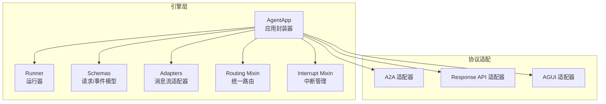
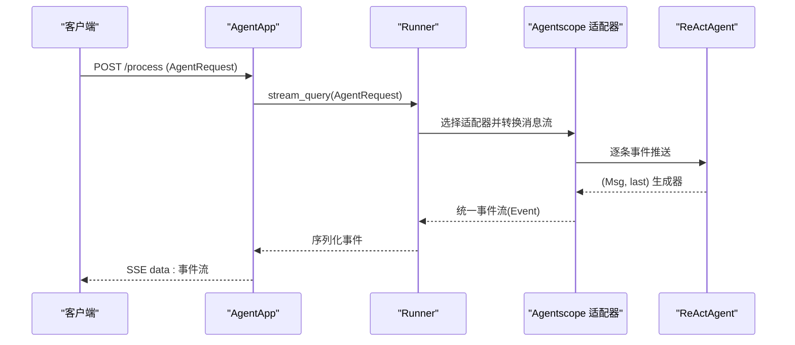
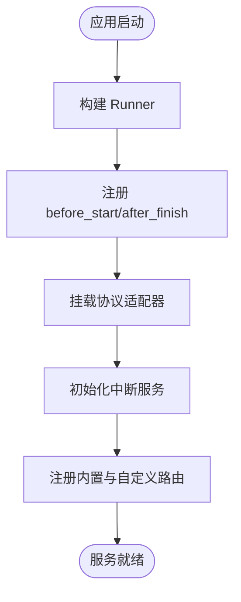
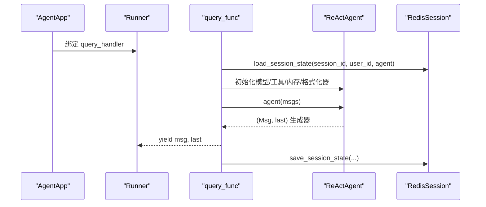
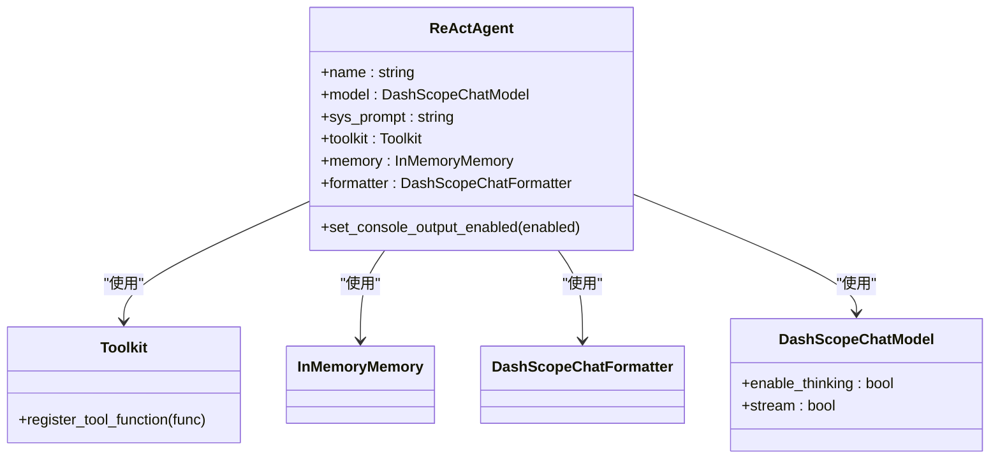
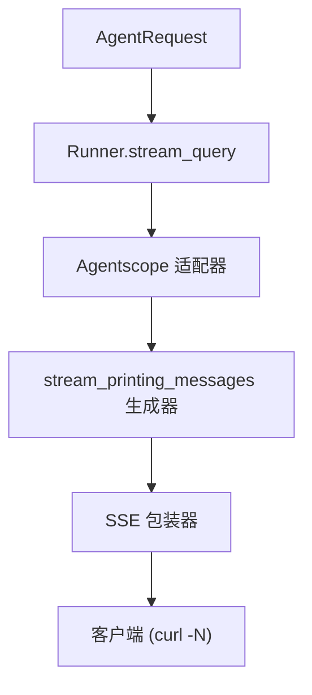
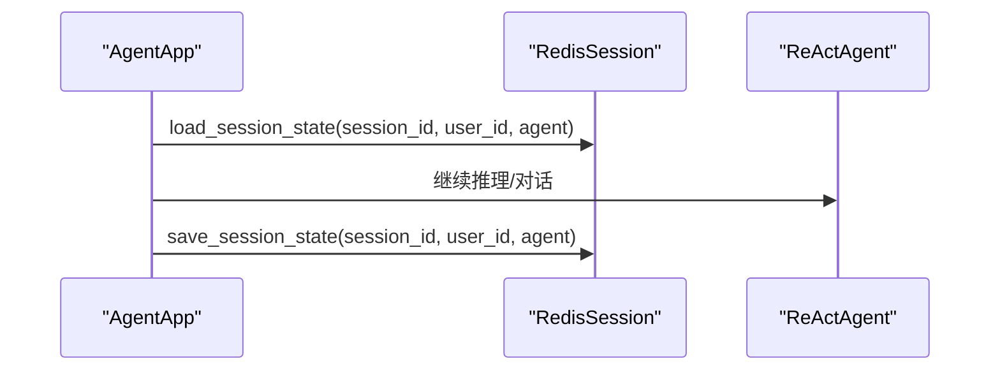
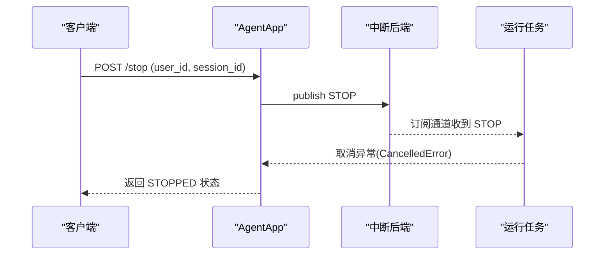
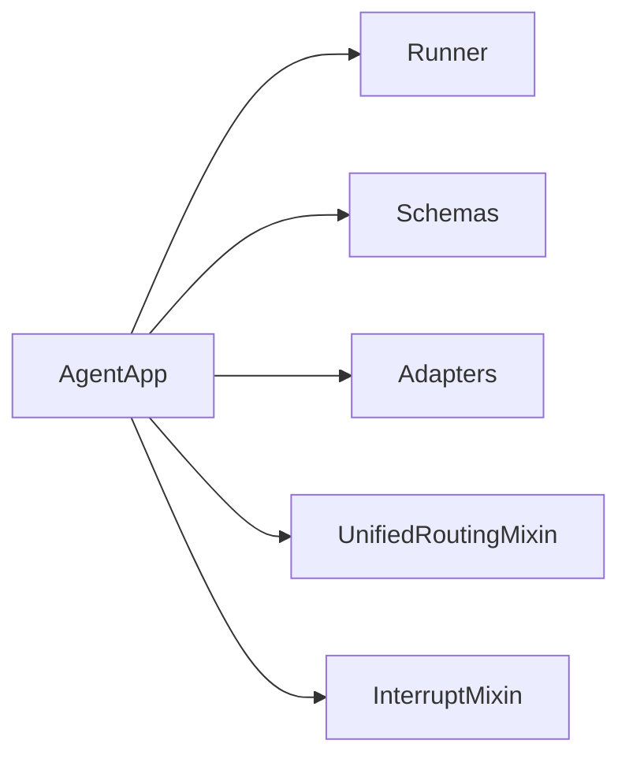

# AgentApp示例

<cite>
**本文引用的文件**
- [agent_app.py](file://src/agentscope_runtime/engine/app/agent_app.py)
- [runner.py](file://src/agentscope_runtime/engine/runner.py)
- [agent_schemas.py](file://src/agentscope_runtime/engine/schemas/agent_schemas.py)
- [stream.py](file://src/agentscope_runtime/adapters/agentscope/stream.py)
- [unified_routing_mixin.py](file://src/agentscope_runtime/engine/deployers/utils/service_utils/routing/unified_routing_mixin.py)
- [interrupt_mixin.py](file://src/agentscope_runtime/engine/deployers/utils/service_utils/interrupt/interrupt_mixin.py)
- [agent_app.md](file://cookbook/zh/agent_app.md)
- [test_agent_app.py](file://tests/integrated/test_agent_app.py)
</cite>

## 目录
1. [简介](#简介)
2. [项目结构](#项目结构)
3. [核心组件](#核心组件)
4. [架构总览](#架构总览)
5. [详细组件分析](#详细组件分析)
6. [依赖分析](#依赖分析)
7. [性能考虑](#性能考虑)
8. [故障排除指南](#故障排除指南)
9. [结论](#结论)
10. [附录](#附录)

## 简介
本指南面向希望在 AgentScope Runtime 中快速搭建并运行 AgentApp 的工程师与产品人员。文档围绕以下目标展开：
- 完整的 AgentApp 创建流程：从生命周期管理器到实例初始化、查询函数编写与状态管理
- ReActAgent 的配置与使用：模型选择、工具注册、内存与格式化器设置
- SSE 流式响应的实现原理与 stream_printing_messages 的使用方法
- curl 测试示例与预期输出格式
- 状态持久化：会话状态的加载与保存机制
- 故障排除：常见错误与调试技巧

## 项目结构
AgentApp 位于引擎模块中，围绕 FastAPI 构建，提供协议适配、路由、中断与任务队列等能力；配套的适配器负责将不同框架的消息流转换为统一的事件流。

图示来源
- [agent_app.py:60-220](file://src/agentscope_runtime/engine/app/agent_app.py#L60-L220)
- [runner.py:46-120](file://src/agentscope_runtime/engine/runner.py#L46-L120)
- [agent_schemas.py:751-800](file://src/agentscope_runtime/engine/schemas/agent_schemas.py#L751-L800)
- [stream.py:33-684](file://src/agentscope_runtime/adapters/agentscope/stream.py#L33-L684)
- [unified_routing_mixin.py:16-120](file://src/agentscope_runtime/engine/deployers/utils/service_utils/routing/unified_routing_mixin.py#L16-L120)
- [interrupt_mixin.py:8-60](file://src/agentscope_runtime/engine/deployers/utils/service_utils/interrupt/interrupt_mixin.py#L8-L60)

章节来源
- [agent_app.py:60-220](file://src/agentscope_runtime/engine/app/agent_app.py#L60-L220)
- [runner.py:46-120](file://src/agentscope_runtime/engine/runner.py#L46-L120)

## 核心组件
- AgentApp：继承 FastAPI，集成 Runner、协议适配器、路由与中断管理，提供 /process、/health 等内置端点，支持流式输出与后台任务
- Runner：封装 query_handler，按框架类型选择适配器，驱动消息流并生成统一事件序列
- Schemas：定义 AgentRequest、Event、Message、Content 等模型，支撑请求与事件的结构化
- Adapters：将不同框架的消息流（如 Agentscope）转换为统一的事件流
- Routing/Interrupt Mixin：提供统一路由、任务队列与分布式中断能力

章节来源
- [agent_app.py:60-220](file://src/agentscope_runtime/engine/app/agent_app.py#L60-L220)
- [runner.py:193-356](file://src/agentscope_runtime/engine/runner.py#L193-L356)
- [agent_schemas.py:751-800](file://src/agentscope_runtime/engine/schemas/agent_schemas.py#L751-L800)
- [stream.py:33-684](file://src/agentscope_runtime/adapters/agentscope/stream.py#L33-L684)
- [unified_routing_mixin.py:16-120](file://src/agentscope_runtime/engine/deployers/utils/service_utils/routing/unified_routing_mixin.py#L16-L120)
- [interrupt_mixin.py:8-60](file://src/agentscope_runtime/engine/deployers/utils/service_utils/interrupt/interrupt_mixin.py#L8-L60)

## 架构总览
AgentApp 通过生命周期管理器统一调度 Runner、协议适配器与中断服务；查询处理通过 Runner 的 stream_query 将框架特定的消息流转换为统一事件流，再经 SSE 返回给客户端。

图示来源
- [agent_app.py:781-800](file://src/agentscope_runtime/engine/app/agent_app.py#L781-L800)
- [runner.py:193-356](file://src/agentscope_runtime/engine/runner.py#L193-L356)
- [stream.py:33-684](file://src/agentscope_runtime/adapters/agentscope/stream.py#L33-L684)

## 详细组件分析

### 生命周期管理器与 AgentApp 初始化
- 使用 lifespan 参数或内部生命周期管理器统一启动 Runner、注册协议适配器与中断服务
- 支持 before_start/after_finish 钩子与自定义中间件
- 提供 /health、/、/process 等内置端点

图示来源
- [agent_app.py:248-316](file://src/agentscope_runtime/engine/app/agent_app.py#L248-L316)
- [agent_app.py:382-424](file://src/agentscope_runtime/engine/app/agent_app.py#L382-L424)

章节来源
- [agent_app.md:155-234](file://cookbook/zh/agent_app.md#L155-L234)
- [agent_app.py:248-316](file://src/agentscope_runtime/engine/app/agent_app.py#L248-L316)

### 查询函数与状态管理
- 使用 @app.query(framework="agentscope") 注册查询函数，绑定 Runner 的 query_handler
- 在查询函数中创建 ReActAgent，注册工具，设置内存与格式化器
- 通过 app.state.session.load/save_session_state 实现会话状态的加载与保存

图示来源
- [agent_app.py:722-740](file://src/agentscope_runtime/engine/app/agent_app.py#L722-L740)
- [agent_app.py:781-800](file://src/agentscope_runtime/engine/app/agent_app.py#L781-L800)
- [test_agent_app.py:42-86](file://tests/integrated/test_agent_app.py#L42-L86)

章节来源
- [agent_app.md:452-531](file://cookbook/zh/agent_app.md#L452-L531)
- [test_agent_app.py:42-86](file://tests/integrated/test_agent_app.py#L42-L86)

### ReActAgent 配置与使用
- 模型选择：DashScopeChatModel，支持开启思考与流式输出
- 工具注册：Toolkit.register_tool_function(execute_python_code)
- 内存与格式化器：InMemoryMemory、DashScopeChatFormatter
- 输出控制：禁用控制台输出，使用 stream_printing_messages 生成事件流

图示来源
- [test_agent_app.py:55-67](file://tests/integrated/test_agent_app.py#L55-L67)
- [agent_app.md:474-514](file://cookbook/zh/agent_app.md#L474-L514)

章节来源
- [test_agent_app.py:55-67](file://tests/integrated/test_agent_app.py#L55-L67)
- [agent_app.md:474-514](file://cookbook/zh/agent_app.md#L474-L514)

### SSE 流式响应与 stream_printing_messages
- AgentApp 通过 _stream_generator/_common_stream_generator 将 Runner 的事件流包装为 SSE
- stream_printing_messages 将 Agent 的生成器输出转换为 (Msg, last) 事件，便于统一序列化
- 客户端以 -N 参数接收持续更新的数据块

图示来源
- [agent_app.py:643-702](file://src/agentscope_runtime/engine/app/agent_app.py#L643-L702)
- [runner.py:193-356](file://src/agentscope_runtime/engine/runner.py#L193-L356)
- [stream.py:33-684](file://src/agentscope_runtime/adapters/agentscope/stream.py#L33-L684)
- [agent_app.md:118-152](file://cookbook/zh/agent_app.md#L118-L152)

章节来源
- [agent_app.md:118-152](file://cookbook/zh/agent_app.md#L118-L152)
- [agent_app.py:643-702](file://src/agentscope_runtime/engine/app/agent_app.py#L643-L702)

### 状态持久化：会话加载与保存
- 使用 app.state.session（如 RedisSession）在查询开始前加载历史状态
- 在查询结束后保存最终状态，确保中断/重启后可恢复

图示来源
- [test_agent_app.py:70-86](file://tests/integrated/test_agent_app.py#L70-L86)
- [agent_app.md:496-513](file://cookbook/zh/agent_app.md#L496-L513)

章节来源
- [test_agent_app.py:70-86](file://tests/integrated/test_agent_app.py#L70-L86)
- [agent_app.md:496-513](file://cookbook/zh/agent_app.md#L496-L513)

### 任务中断与管理
- 通过 InterruptMixin 提供分布式中断：compare_and_set_state 防止并发冲突，订阅通道接收 STOP 信号
- stop_chat 广播停止信号，run_and_stream 包装生成器并在取消时更新状态

图示来源
- [interrupt_mixin.py:38-147](file://src/agentscope_runtime/engine/deployers/utils/service_utils/interrupt/interrupt_mixin.py#L38-L147)
- [agent_app.md:642-748](file://cookbook/zh/agent_app.md#L642-L748)

章节来源
- [interrupt_mixin.py:38-147](file://src/agentscope_runtime/engine/deployers/utils/service_utils/interrupt/interrupt_mixin.py#L38-L147)
- [agent_app.md:642-748](file://cookbook/zh/agent_app.md#L642-L748)

### 自定义端点与后台任务
- 使用 @app.endpoint/@app.task 注册自定义端点与后台任务，支持 Celery 或内存模式
- stream_query 后台任务模式：提交后返回 task_id，轮询查询状态与最终结果

章节来源
- [agent_app.md:546-748](file://cookbook/zh/agent_app.md#L546-L748)
- [unified_routing_mixin.py:25-101](file://src/agentscope_runtime/engine/deployers/utils/service_utils/routing/unified_routing_mixin.py#L25-L101)

## 依赖分析
- AgentApp 依赖 Runner 提供统一的查询与事件流；依赖适配器将框架消息转换为统一事件
- 统一路由与任务系统由 UnifiedRoutingMixin 提供；中断能力由 InterruptMixin 提供
- Schemas 定义请求与事件模型，保证跨组件一致性

图示来源
- [agent_app.py:60-220](file://src/agentscope_runtime/engine/app/agent_app.py#L60-L220)
- [runner.py:46-120](file://src/agentscope_runtime/engine/runner.py#L46-L120)
- [unified_routing_mixin.py:16-120](file://src/agentscope_runtime/engine/deployers/utils/service_utils/routing/unified_routing_mixin.py#L16-L120)
- [interrupt_mixin.py:8-60](file://src/agentscope_runtime/engine/deployers/utils/service_utils/interrupt/interrupt_mixin.py#L8-L60)

章节来源
- [agent_app.py:60-220](file://src/agentscope_runtime/engine/app/agent_app.py#L60-L220)
- [runner.py:46-120](file://src/agentscope_runtime/engine/runner.py#L46-L120)

## 性能考虑
- 流式输出：SSE 逐条事件推送，避免一次性大响应，降低延迟
- 事件序列化：统一事件模型与序列号生成，便于前端增量渲染
- 中断与并发：compare_and_set_state 防止同一会话并发执行，提升稳定性
- 后台任务：Celery 模式支持任务持久化与异步执行，减轻主线程压力

## 故障排除指南
- 未注册查询函数导致 404/无响应：确保使用 @app.query(...) 注册处理函数
- 流式输出为空：确认 framework 类型与适配器匹配，检查 stream_printing_messages 的使用
- 中断无效：确认中断后端配置（Redis 或本地），调用 /stop 时 user_id/session_id 与运行时一致
- 状态未恢复：检查 load/save_session_state 的调用时机与 session 实例配置
- 超时与内存占用：合理设置 stream_task_timeout，后台任务仅保存最终响应，避免中间事件存储

章节来源
- [agent_app.md:642-748](file://cookbook/zh/agent_app.md#L642-L748)
- [test_agent_app.py:115-174](file://tests/integrated/test_agent_app.py#L115-L174)

## 结论
通过 AgentApp，开发者可以以最少的样板代码快速构建具备流式输出、状态管理与任务中断能力的智能体服务。结合 ReActAgent 与 Agentscope 适配器，可在统一事件流之上实现多轮对话、工具调用与状态持久化，满足生产级部署与运维需求。

## 附录

### curl 测试示例与预期输出
- 流式输出（SSE）
  - 命令：curl -N -X POST "http://localhost:8090/process" -H "Content-Type: application/json" -d '{"input":[{"role":"user","content":[{"type":"text","text":"你好"}]}]}'
  - 预期：SSE 数据块，包含 response/message/content 等对象，最后以 [DONE] 结束
- 多轮对话
  - 第一次：携带 session_id，观察助手回复
  - 第二次：复用相同 session_id，验证记忆效果
- 后台任务（stream_query）
  - 提交：POST /process/task，返回 task_id
  - 轮询：GET /process/task/{task_id}，直到状态为 finished 并获取最终结果

章节来源
- [agent_app.md:118-152](file://cookbook/zh/agent_app.md#L118-L152)
- [agent_app.md:305-449](file://cookbook/zh/agent_app.md#L305-L449)
- [test_agent_app.py:115-271](file://tests/integrated/test_agent_app.py#L115-L271)