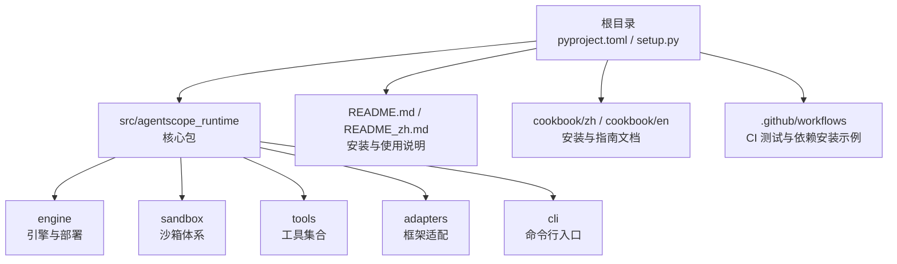
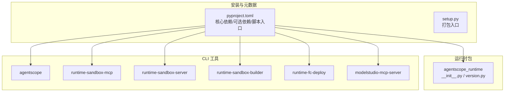
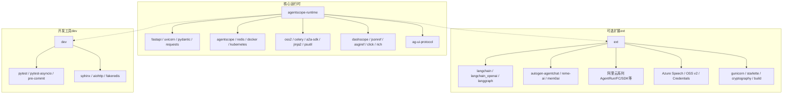

# 安装配置

<cite>
**本文引用的文件**   
- [README.md](file://README.md)
- [README_zh.md](file://README_zh.md)
- [cookbook/zh/install.md](file://cookbook/zh/install.md)
- [cookbook/en/install.md](file://cookbook/en/install.md)
- [pyproject.toml](file://pyproject.toml)
- [setup.py](file://setup.py)
- [src/agentscope_runtime/version.py](file://src/agentscope_runtime/version.py)
- [src/agentscope_runtime/__init__.py](file://src/agentscope_runtime/__init__.py)
- [src/agentscope_runtime/engine/requirements.txt](file://src/agentscope_runtime/engine/requirements.txt)
- [src/agentscope_runtime/sandbox/box/base/box/requirements.txt](file://src/agentscope_runtime/sandbox/box/base/box/requirements.txt)
- [.github/workflows/unit_test.yml](file://.github/workflows/unit_test.yml)
- [CONTRIBUTING.md](file://CONTRIBUTING.md)
</cite>

## 目录
1. [简介](#简介)
2. [项目结构](#项目结构)
3. [核心组件](#核心组件)
4. [架构总览](#架构总览)
5. [详细组件分析](#详细组件分析)
6. [依赖关系分析](#依赖关系分析)
7. [性能考虑](#性能考虑)
8. [故障排查指南](#故障排查指南)
9. [结论](#结论)
10. [附录](#附录)

## 简介
本指南面向首次接触 AgentScope Runtime 的用户与开发者，提供从零开始的完整安装与配置流程。内容覆盖：
- 从 PyPI 安装标准版与扩展版的差异与启用方式
- 从源码安装的全流程（含开发模式）
- 虚拟环境创建与激活、依赖版本管理
- 安装验证（导入测试、版本检查、基础功能验证）
- 常见问题与解决方案（网络、权限、依赖冲突等）

## 项目结构
AgentScope Runtime 采用标准的 Python 包结构，核心代码位于 src/agentscope_runtime 下，安装元数据由 pyproject.toml 统一声明；README 提供快速开始与安装指引；cookbook 提供中英文安装章节与进阶说明。

图表来源
- [pyproject.toml:1-104](file://pyproject.toml#L1-L104)
- [README.md:115-140](file://README.md#L115-L140)
- [cookbook/zh/install.md:1-84](file://cookbook/zh/install.md#L1-L84)

章节来源
- [pyproject.toml:1-104](file://pyproject.toml#L1-L104)
- [README.md:115-140](file://README.md#L115-L140)
- [cookbook/zh/install.md:1-84](file://cookbook/zh/install.md#L1-L84)

## 核心组件
- 核心运行时（agentscope-runtime）：包含 AgentScope 框架与 Sandbox 依赖，满足最小运行需求。
- 开发工具（dev）：测试、代码检查、文档生成等开发辅助工具。
- 扩展（ext）：部署相关增强，涵盖 REME AI、Mem0、阿里云服务、LangChain、Azure 语音、对象存储、认证、构建工具等。

章节来源
- [cookbook/zh/install.md:75-84](file://cookbook/zh/install.md#L75-L84)
- [cookbook/en/install.md:77-87](file://cookbook/en/install.md#L77-L87)
- [pyproject.toml:53-99](file://pyproject.toml#L53-L99)

## 架构总览
下图展示安装阶段的关键构件与关系：包元数据、脚本入口、可选依赖与 CLI 工具。

图表来源
- [pyproject.toml:1-104](file://pyproject.toml#L1-L104)
- [setup.py:1-5](file://setup.py#L1-L5)
- [src/agentscope_runtime/version.py:1-3](file://src/agentscope_runtime/version.py#L1-L3)
- [src/agentscope_runtime/__init__.py:1-7](file://src/agentscope_runtime/__init__.py#L1-L7)

章节来源
- [pyproject.toml:1-104](file://pyproject.toml#L1-L104)
- [setup.py:1-5](file://setup.py#L1-L5)
- [src/agentscope_runtime/version.py:1-3](file://src/agentscope_runtime/version.py#L1-L3)
- [src/agentscope_runtime/__init__.py:1-7](file://src/agentscope_runtime/__init__.py#L1-L7)

## 详细组件分析

### 从 PyPI 安装：标准版与扩展版
- 标准版安装：仅安装核心运行时，满足基础 Agent 服务与沙箱运行需求。
- 扩展版安装：通过 extras 安装部署增强能力，适合需要对接云服务、LangGraph、AutoGen、Azure 语音、对象存储等场景。
- 预览版本：安装预发布版本以体验尚未正式稳定的特性，建议在测试环境使用。

章节来源
- [README.md:117-128](file://README.md#L117-L128)
- [README_zh.md:118-129](file://README_zh.md#L118-L129)
- [cookbook/zh/install.md:21-44](file://cookbook/zh/install.md#L21-L44)
- [cookbook/en/install.md:23-44](file://cookbook/en/install.md#L23-L44)

### 从源码安装：开发模式与依赖
- 源码安装：克隆仓库后使用可编辑安装，便于本地修改与调试。
- 开发依赖：安装 dev 可选组以支持测试、文档与代码质量工具。
- CI 示例：工作流中展示了在受限超时与缓存策略下的安装实践，可作为企业内网或 CI 环境的参考。

章节来源
- [README.md:130-139](file://README.md#L130-L139)
- [README_zh.md:131-140](file://README_zh.md#L131-L140)
- [cookbook/zh/install.md:44-61](file://cookbook/zh/install.md#L44-L61)
- [cookbook/en/install.md:46-62](file://cookbook/en/install.md#L46-L62)
- [.github/workflows/unit_test.yml:50-57](file://.github/workflows/unit_test.yml#L50-L57)

### 虚拟环境与版本管理
- Python 版本：要求 Python 3.10 或更高。
- 虚拟环境：建议使用 venv 或 conda 创建隔离环境，避免全局污染。
- 依赖锁定：可通过 pip-tools、Poetry 或 pipenv 管理锁定文件，保证团队一致性。
- CI 缓存：工作流展示了 pip cache 的使用，可加速重复安装。

章节来源
- [README.md:111-114](file://README.md#L111-L114)
- [README_zh.md:112-114](file://README_zh.md#L112-L114)
- [.github/workflows/unit_test.yml:33-40](file://.github/workflows/unit_test.yml#L33-L40)

### 安装验证：导入测试、版本检查与基础功能
- 导入测试：在 Python 中导入主包并打印版本，确认安装成功。
- 版本检查：主包导出版本常量，可在运行时查询。
- 基础功能验证：可尝试启动 CLI 工具或最小 AgentApp 示例，验证核心链路。

章节来源
- [cookbook/zh/install.md:62-74](file://cookbook/zh/install.md#L62-L74)
- [cookbook/en/install.md:64-74](file://cookbook/en/install.md#L64-L74)
- [src/agentscope_runtime/version.py:1-3](file://src/agentscope_runtime/version.py#L1-L3)
- [src/agentscope_runtime/__init__.py:1-7](file://src/agentscope_runtime/__init__.py#L1-L7)

### 扩展功能启用与 CLI 工具
- 扩展安装：通过 extras 安装部署增强能力，覆盖云服务、语音、认证、构建工具等。
- CLI 工具：安装后可直接使用多个命令行工具，如 agentscope、runtime-sandbox-server 等，用于沙箱与部署。

章节来源
- [pyproject.toml:53-99](file://pyproject.toml#L53-L99)
- [pyproject.toml:45-51](file://pyproject.toml#L45-L51)

## 依赖关系分析
下图展示核心运行时的主要依赖与可选扩展的分层关系。

图表来源
- [pyproject.toml:7-32](file://pyproject.toml#L7-L32)
- [pyproject.toml:53-99](file://pyproject.toml#L53-L99)
- [pyproject.toml:54-66](file://pyproject.toml#L54-L66)

章节来源
- [pyproject.toml:1-104](file://pyproject.toml#L1-L104)

## 性能考虑
- 依赖精简：仅安装所需 extras，避免不必要的下载与解析时间。
- 缓存策略：在 CI 或本地使用 pip 缓存，减少重复安装耗时。
- 并行安装：在多环境复用缓存与锁定文件，缩短安装周期。
- 依赖冲突：优先使用锁定文件或容器化环境，降低版本漂移风险。

## 故障排查指南
- 网络问题
  - 现象：pip 安装超时或下载失败。
  - 解决：配置国内镜像源、提高超时时间、使用缓存；参考 CI 中的超时与缓存设置。
- 权限问题
  - 现象：安装时报权限错误。
  - 解决：使用虚拟环境、避免使用 sudo；在容器或 CI 中固定权限。
- 依赖冲突
  - 现象：安装报错或运行时报模块导入异常。
  - 解决：使用锁定文件或容器化；必要时降级/升级冲突包；仅安装所需 extras。
- Python 版本不符
  - 现象：安装或运行时报 Python 版本不满足要求。
  - 解决：确保使用 Python 3.10 或更高版本。
- CLI 工具不可用
  - 现象：安装后无法找到命令。
  - 解决：确认 extras 已安装；检查 PATH 与虚拟环境激活状态。

章节来源
- [.github/workflows/unit_test.yml:50-57](file://.github/workflows/unit_test.yml#L50-L57)
- [CONTRIBUTING.md:50-62](file://CONTRIBUTING.md#L50-L62)

## 结论
通过本指南，您已掌握从 PyPI 与源码安装 AgentScope Runtime 的完整流程，理解了标准版与扩展版的差异，明确了开发模式与依赖管理策略，并具备安装验证与常见问题排查的能力。建议在生产环境中结合容器化与锁定文件，确保一致性与可重复性。

## 附录
- 安装命令速查
  - 标准版：pip install agentscope-runtime
  - 扩展版：pip install "agentscope-runtime[ext]"
  - 预览版：pip install --pre agentscope-runtime
  - 源码安装：git clone ... && pip install -e .
  - 开发依赖：pip install ".[dev]"
- CLI 工具清单（安装后可用）
  - agentscope、runtime-sandbox-mcp、runtime-sandbox-server、runtime-sandbox-builder、runtime-fc-deploy、modelstudio-mcp-server

章节来源
- [README.md:117-139](file://README.md#L117-L139)
- [README_zh.md:118-139](file://README_zh.md#L118-L139)
- [cookbook/zh/install.md:21-61](file://cookbook/zh/install.md#L21-L61)
- [cookbook/en/install.md:23-62](file://cookbook/en/install.md#L23-L62)
- [pyproject.toml:45-51](file://pyproject.toml#L45-L51)