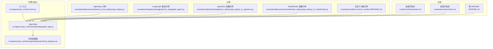
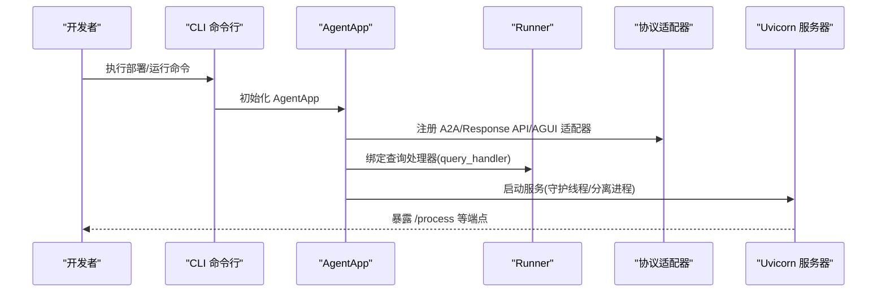
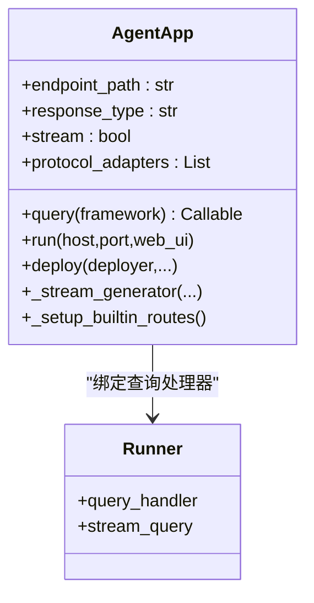
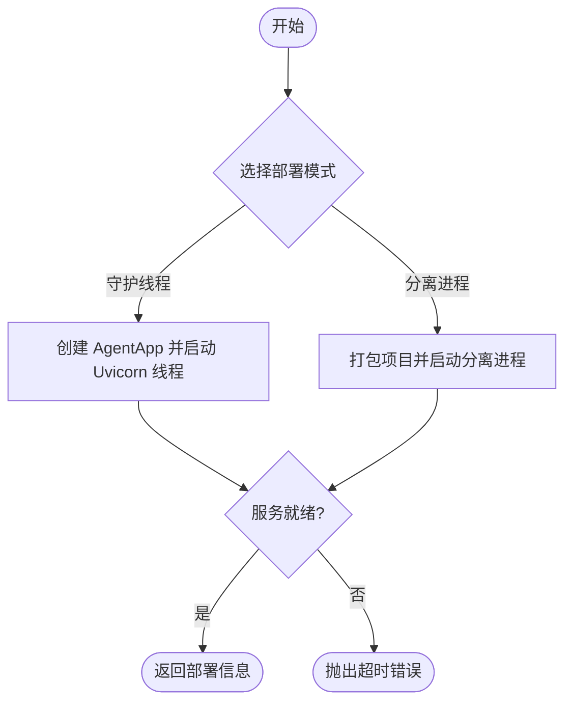
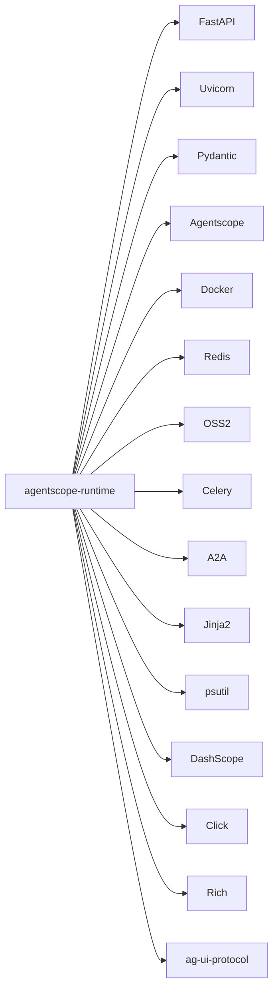

# 快速开始

<cite>
**本文引用的文件列表**
- [README.md](file://README.md)
- [cookbook/zh/quickstart.md](file://cookbook/zh/quickstart.md)
- [cookbook/en/quickstart.md](file://cookbook/en/quickstart.md)
- [examples/sandbox/custom_sandbox/README.md](file://examples/sandbox/custom_sandbox/README.md)
- [examples/deployments/local_deploy_config.yaml](file://examples/deployments/local_deploy_config.yaml)
- [examples/integrations/langgraph/run_langgraph_agent.py](file://examples/integrations/langgraph/run_langgraph_agent.py)
- [examples/deployments/daemon_local_deploy/app_deploy.py](file://examples/deployments/daemon_local_deploy/app_deploy.py)
- [examples/deployments/agentrun_deploy/app_deploy_to_agentrun.py](file://examples/deployments/agentrun_deploy/app_deploy_to_agentrun.py)
- [examples/deployments/modelstudio_deploy/app_deploy_to_modelstudio.py](file://examples/deployments/modelstudio_deploy/app_deploy_to_modelstudio.py)
- [src/agentscope_runtime/engine/app/agent_app.py](file://src/agentscope_runtime/engine/app/agent_app.py)
- [src/agentscope_runtime/engine/deployers/local_deployer.py](file://src/agentscope_runtime/engine/deployers/local_deployer.py)
- [src/agentscope_runtime/cli/cli.py](file://src/agentscope_runtime/cli/cli.py)
- [pyproject.toml](file://pyproject.toml)
</cite>

## 目录
1. [简介](#简介)
2. [项目结构](#项目结构)
3. [核心组件](#核心组件)
4. [架构总览](#架构总览)
5. [详细组件解析](#详细组件解析)
6. [依赖关系分析](#依赖关系分析)
7. [性能与可用性建议](#性能与可用性建议)
8. [故障排除指南](#故障排除指南)
9. [结论](#结论)
10. [附录](#附录)

## 简介
本指南面向首次接触 AgentScope Runtime 的开发者，目标是在约 30 分钟内完成从环境准备、安装、配置到成功运行第一个 Agent 应用的全流程。内容覆盖：
- 系统要求与安装
- Agent App 示例（ReActAgent + AgentApp）
- 沙箱示例（基础、GUI、浏览器、文件系统、移动端）
- 多种部署方式（本地、AgentRun、ModelStudio 等）
- 常见问题与调试技巧

## 项目结构
仓库采用“引擎 + 引擎扩展 + 示例 + 文档”的组织方式：
- 引擎与核心能力位于 src/agentscope_runtime 下，包含 AgentApp、部署器、沙箱、工具集等
- examples 提供多类示例（部署、集成、沙箱自定义等）
- cookbook 提供中英文快速开始与进阶教程
- pyproject.toml 定义依赖与脚本入口

图表来源
- [src/agentscope_runtime/engine/app/agent_app.py](file://src/agentscope_runtime/engine/app/agent_app.py)
- [src/agentscope_runtime/engine/deployers/local_deployer.py](file://src/agentscope_runtime/engine/deployers/local_deployer.py)
- [src/agentscope_runtime/cli/cli.py](file://src/agentscope_runtime/cli/cli.py)
- [examples/deployments/daemon_local_deploy/app_deploy.py](file://examples/deployments/daemon_local_deploy/app_deploy.py)
- [examples/integrations/langgraph/run_langgraph_agent.py](file://examples/integrations/langgraph/run_langgraph_agent.py)
- [examples/deployments/agentrun_deploy/app_deploy_to_agentrun.py](file://examples/deployments/agentrun_deploy/app_deploy_to_agentrun.py)
- [examples/deployments/modelstudio_deploy/app_deploy_to_modelstudio.py](file://examples/deployments/modelstudio_deploy/app_deploy_to_modelstudio.py)
- [examples/sandbox/custom_sandbox/README.md](file://examples/sandbox/custom_sandbox/README.md)
- [cookbook/zh/quickstart.md](file://cookbook/zh/quickstart.md)
- [cookbook/en/quickstart.md](file://cookbook/en/quickstart.md)
- [README.md](file://README.md)

章节来源
- [README.md](file://README.md)
- [cookbook/zh/quickstart.md](file://cookbook/zh/quickstart.md)
- [cookbook/en/quickstart.md](file://cookbook/en/quickstart.md)

## 核心组件
- AgentApp：基于 FastAPI 的 Agent 应用封装，提供生命周期管理、协议适配（A2A、Response API、AGUI）、流式输出、任务队列等能力
- 本地部署器 LocalDeployManager：统一管理本地部署模式（守护线程/分离进程），支持健康检查、优雅停机、状态持久化
- CLI：提供 agentscope 命令，统一管理 agent 生命周期与部署操作
- 沙箱：提供多种隔离执行环境（基础、GUI、浏览器、文件系统、移动端），支持同步/异步版本
- 工具与适配：对主流框架（AgentScope、LangGraph、AutoGen、AGNO）提供适配与工具

章节来源
- [src/agentscope_runtime/engine/app/agent_app.py](file://src/agentscope_runtime/engine/app/agent_app.py)
- [src/agentscope_runtime/engine/deployers/local_deployer.py](file://src/agentscope_runtime/engine/deployers/local_deployer.py)
- [src/agentscope_runtime/cli/cli.py](file://src/agentscope_runtime/cli/cli.py)

## 架构总览
AgentApp 将 FastAPI 与 Runner 结合，自动注入协议适配器（A2A、Response API、AGUI），并提供统一的流式推理接口。部署器负责将应用打包、启动、监控与停止。

图表来源
- [src/agentscope_runtime/engine/app/agent_app.py](file://src/agentscope_runtime/engine/app/agent_app.py)
- [src/agentscope_runtime/engine/deployers/local_deployer.py](file://src/agentscope_runtime/engine/deployers/local_deployer.py)
- [src/agentscope_runtime/cli/cli.py](file://src/agentscope_runtime/cli/cli.py)

## 详细组件解析

### AgentApp 类与生命周期
- 支持通过装饰器注册查询处理函数，并自动注入协议适配器
- 内置健康检查、根路径信息、任务控制端点
- 支持中断服务（分布式/本地），便于任务预占与恢复

图表来源
- [src/agentscope_runtime/engine/app/agent_app.py](file://src/agentscope_runtime/engine/app/agent_app.py)

章节来源
- [src/agentscope_runtime/engine/app/agent_app.py](file://src/agentscope_runtime/engine/app/agent_app.py)

### 本地部署器 LocalDeployManager
- 支持两种模式：守护线程（DAEMON_THREAD）与分离进程（DETACHED_PROCESS）
- 自动等待服务就绪、健康检查、优雅停机、状态持久化
- 提供停止接口与部署信息查询

图表来源
- [src/agentscope_runtime/engine/deployers/local_deployer.py](file://src/agentscope_runtime/engine/deployers/local_deployer.py)

章节来源
- [src/agentscope_runtime/engine/deployers/local_deployer.py](file://src/agentscope_runtime/engine/deployers/local_deployer.py)

### CLI 命令入口
- agentscope 命令统一入口，注册 chat、run、web、deploy、list、status、stop、invoke、sandbox 等子命令
- 可直接用于部署与运维

章节来源
- [src/agentscope_runtime/cli/cli.py](file://src/agentscope_runtime/cli/cli.py)

### Agent App 示例（从零到一）
- 步骤概览
  1) 导入依赖与 AgentApp
  2) 定义生命周期函数（启动/关闭）
  3) 创建 AgentApp 实例
  4) 使用 @agent_app.query(framework="agentscope") 定义查询逻辑
  5) 运行服务或通过 LocalDeployManager 部署
  6) 使用 curl 或 OpenAI SDK 调用 /process 接口，观察 SSE 流式输出

- 关键要点
  - 查询函数需返回 (msg, last)，以支持流式输出
  - 使用会话加载/保存状态，保证多轮对话一致性
  - 可选开启内置 Web 界面（web_ui=True）

- 预期输出
  - SSE 数据帧逐条推送，包含 response/message/content 等对象，最后以 completed 结束

章节来源
- [README.md](file://README.md)
- [cookbook/zh/quickstart.md](file://cookbook/zh/quickstart.md)
- [cookbook/en/quickstart.md](file://cookbook/en/quickstart.md)
- [examples/deployments/daemon_local_deploy/app_deploy.py](file://examples/deployments/daemon_local_deploy/app_deploy.py)

### 沙箱示例（安全执行工具）
- 支持的沙箱类型
  - 基础沙箱：执行 Python/Shell 命令
  - GUI 沙箱：虚拟桌面，支持鼠标键盘与截图
  - 浏览器沙箱：在隔离环境中打开网页
  - 文件系统沙箱：文件读写与目录操作
  - 移动端沙箱：Android 模拟器，支持点击、输入、截图等

- 运行方式
  - 同步/异步两类，分别对应 BaseSandbox/BaseSandboxAsync 等
  - 默认镜像来自 DockerHub；可通过环境变量切换镜像源、命名空间与标签
  - 服务器无状态部署时，可使用 FC 等无服务器后端

- 环境变量配置（镜像与命名空间）
  - RUNTIME_SANDBOX_REGISTRY：镜像仓库地址
  - RUNTIME_SANDBOX_IMAGE_NAMESPACE：命名空间
  - RUNTIME_SANDBOX_IMAGE_TAG：镜像标签（latest/preview/版本号）

- 移动端沙箱注意事项
  - Linux 主机需加载 binder/ashmem 内核模块
  - ARM64 架构可能遇到兼容性或性能问题，建议使用 x86_64

章节来源
- [README.md](file://README.md)
- [examples/sandbox/custom_sandbox/README.md](file://examples/sandbox/custom_sandbox/README.md)

### 部署示例（本地/云端）
- 本地部署
  - 使用 LocalDeployManager 在守护线程或分离进程中启动服务
  - 可通过配置文件设置 host/port、环境变量与入口点

- AgentRun 部署
  - 支持三种方式：通过 AgentApp 部署、直接从项目目录部署、从已有 wheel 部署
  - 需要 OSS 与 AgentRun 凭据，以及 DashScope API Key

- ModelStudio 部署
  - 支持三种方式：通过 AgentApp 部署、直接从项目目录部署、从已有 wheel 部署
  - 需要 OSS、ModelStudio 工作区与 DashScope API Key

- 配置文件示例
  - examples/deployments/local_deploy_config.yaml 展示了本地部署的 host/port、环境变量等配置

章节来源
- [examples/deployments/daemon_local_deploy/app_deploy.py](file://examples/deployments/daemon_local_deploy/app_deploy.py)
- [examples/deployments/agentrun_deploy/app_deploy_to_agentrun.py](file://examples/deployments/agentrun_deploy/app_deploy_to_agentrun.py)
- [examples/deployments/modelstudio_deploy/app_deploy_to_modelstudio.py](file://examples/deployments/modelstudio_deploy/app_deploy_to_modelstudio.py)
- [examples/deployments/local_deploy_config.yaml](file://examples/deployments/local_deploy_config.yaml)

## 依赖关系分析
- Python 版本要求：>=3.10
- 核心依赖：FastAPI、Uvicorn、Pydantic、Agentscope、Docker、Redis、OSS2、Celery、A2A、Jinja2、psutil、DashScope、Click、Rich、ag-ui-protocol 等
- 可选扩展：LangChain、LangGraph、AutoGen、AGNO、AgentRun、FC、Azure 认知服务、支付宝 SDK、Gunicorn 等

图表来源
- [pyproject.toml](file://pyproject.toml)

章节来源
- [pyproject.toml](file://pyproject.toml)

## 性能与可用性建议
- 流式输出：使用 stream_printing_messages 与 SSE，降低首字延迟，提升用户体验
- 中断服务：在长任务场景下启用分布式中断服务，支持手动预占与状态恢复
- 部署模式选择
  - 开发/单机：守护线程模式，便于调试
  - 生产/弹性：分离进程或云端部署（AgentRun/ModelStudio/K8s 等）
- 资源管理：合理设置超时、清理过期任务、健康检查与优雅停机
- 沙箱镜像：优先使用国内镜像源与稳定标签，减少拉取失败与网络抖动

## 故障排除指南
- 无法启动本地服务
  - 检查端口占用与防火墙
  - 使用健康检查端点 /health 与根端点 / 查看服务状态
  - 分离进程模式下，查看日志文件定位启动失败原因

- 沙箱镜像拉取失败
  - 设置镜像仓库、命名空间与标签环境变量
  - 切换至国内镜像源或代理网络

- 部署失败
  - AgentRun/ModelStudio 部署需正确配置凭据与 API Key
  - 检查 OSS 配置与 Bucket 权限
  - 使用 CLI 查看部署状态与日志

- 会话状态异常
  - 确保在查询前后正确加载/保存会话状态
  - 使用 Redis/FakeRedis 等会话存储，避免数据丢失

- 调试技巧
  - 启用 TRACE_ENABLE_LOG 或设置 LOG_LEVEL/INFO/DEBUG
  - 使用 curl 观察 SSE 输出，确认事件顺序与完整性
  - 通过 /admin/shutdown 与 /admin/status 获取进程状态

章节来源
- [src/agentscope_runtime/engine/deployers/local_deployer.py](file://src/agentscope_runtime/engine/deployers/local_deployer.py)
- [README.md](file://README.md)

## 结论
通过本快速开始指南，您可以在 30 分钟内完成 AgentScope Runtime 的环境准备、安装、配置与首个 Agent 应用的运行，并掌握沙箱与多部署方式的基本使用。建议在完成本地验证后，逐步探索 LangGraph 集成、自定义沙箱与云端部署的最佳实践。

## 附录

### 环境准备与安装
- Python 版本：>=3.10
- 安装方式
  - 从 PyPI 安装核心与扩展包
  - 从源码安装（可选，便于自定义沙箱与工具）

章节来源
- [README.md](file://README.md)
- [pyproject.toml](file://pyproject.toml)

### 第一个 Agent 应用（ReActAgent + AgentApp）
- 步骤
  1) 导入依赖与 AgentApp
  2) 定义生命周期函数（启动/关闭）
  3) 创建 AgentApp 实例
  4) 使用 @agent_app.query(framework="agentscope") 定义查询逻辑
  5) 运行服务或通过 LocalDeployManager 部署
  6) 使用 curl 或 OpenAI SDK 调用 /process 接口，观察 SSE 流式输出

- 预期输出
  - SSE 数据帧逐条推送，包含 response/message/content 等对象，最后以 completed 结束

章节来源
- [README.md](file://README.md)
- [cookbook/zh/quickstart.md](file://cookbook/zh/quickstart.md)
- [cookbook/en/quickstart.md](file://cookbook/en/quickstart.md)
- [examples/deployments/daemon_local_deploy/app_deploy.py](file://examples/deployments/daemon_local_deploy/app_deploy.py)

### 沙箱示例（基础/GUI/浏览器/文件系统/移动端）
- 运行方式
  - 同步/异步两类，分别对应 BaseSandbox/BaseSandboxAsync 等
  - 默认镜像来自 DockerHub；可通过环境变量切换镜像源、命名空间与标签
  - 服务器无状态部署时，可使用 FC 等无服务器后端

- 环境变量配置（镜像与命名空间）
  - RUNTIME_SANDBOX_REGISTRY：镜像仓库地址
  - RUNTIME_SANDBOX_IMAGE_NAMESPACE：命名空间
  - RUNTIME_SANDBOX_IMAGE_TAG：镜像标签（latest/preview/版本号）

- 移动端沙箱注意事项
  - Linux 主机需加载 binder/ashmem 内核模块
  - ARM64 架构可能遇到兼容性或性能问题，建议使用 x86_64

章节来源
- [README.md](file://README.md)
- [examples/sandbox/custom_sandbox/README.md](file://examples/sandbox/custom_sandbox/README.md)

### 多种部署方式选择与配置
- 本地部署
  - 使用 LocalDeployManager 在守护线程或分离进程中启动服务
  - 可通过配置文件设置 host/port、环境变量与入口点

- AgentRun 部署
  - 支持三种方式：通过 AgentApp 部署、直接从项目目录部署、从已有 wheel 部署
  - 需要 OSS 与 AgentRun 凭据，以及 DashScope API Key

- ModelStudio 部署
  - 支持三种方式：通过 AgentApp 部署、直接从项目目录部署、从已有 wheel 部署
  - 需要 OSS、ModelStudio 工作区与 DashScope API Key

- 配置文件示例
  - examples/deployments/local_deploy_config.yaml 展示了本地部署的 host/port、环境变量等配置

章节来源
- [examples/deployments/daemon_local_deploy/app_deploy.py](file://examples/deployments/daemon_local_deploy/app_deploy.py)
- [examples/deployments/agentrun_deploy/app_deploy_to_agentrun.py](file://examples/deployments/agentrun_deploy/app_deploy_to_agentrun.py)
- [examples/deployments/modelstudio_deploy/app_deploy_to_modelstudio.py](file://examples/deployments/modelstudio_deploy/app_deploy_to_modelstudio.py)
- [examples/deployments/local_deploy_config.yaml](file://examples/deployments/local_deploy_config.yaml)