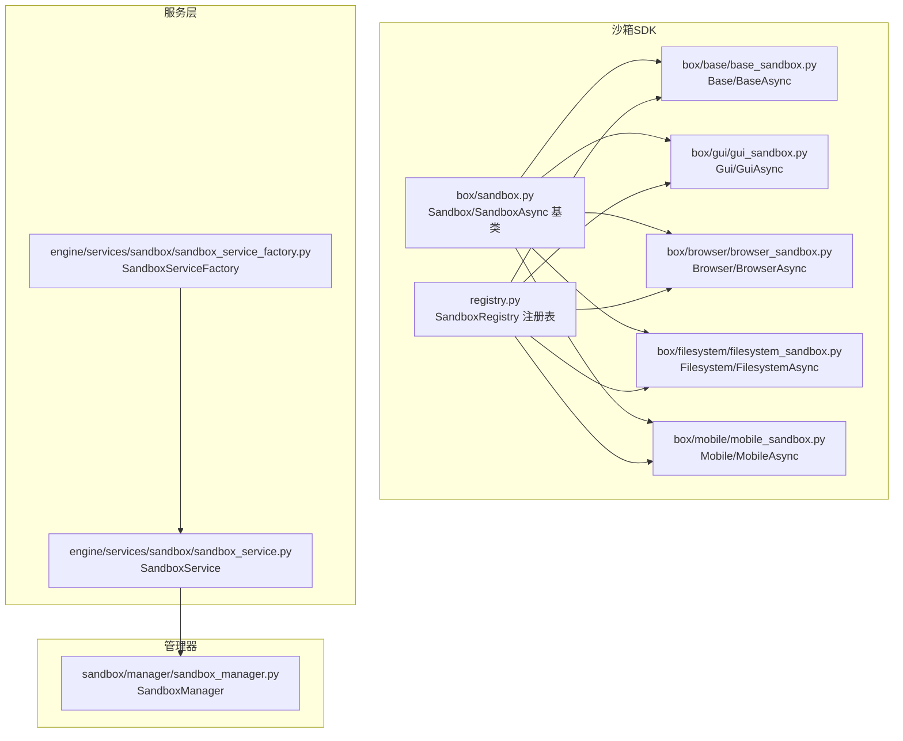
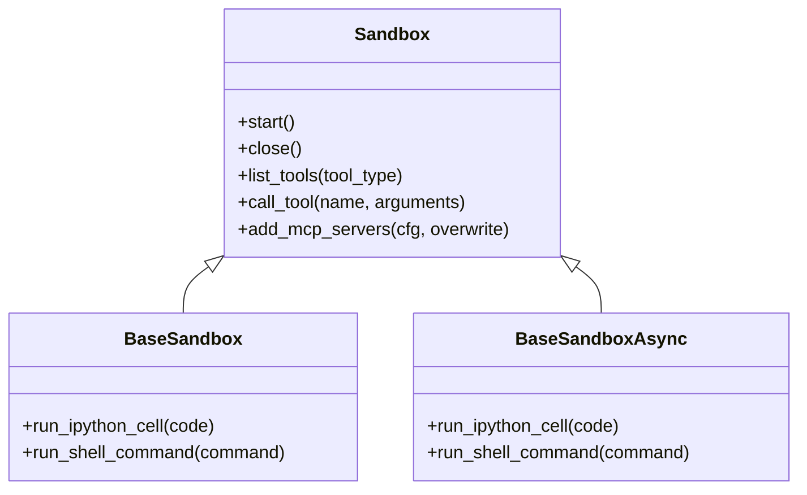
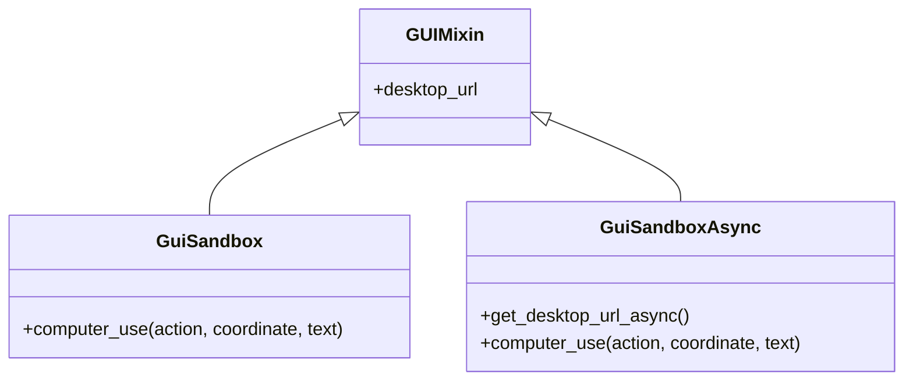
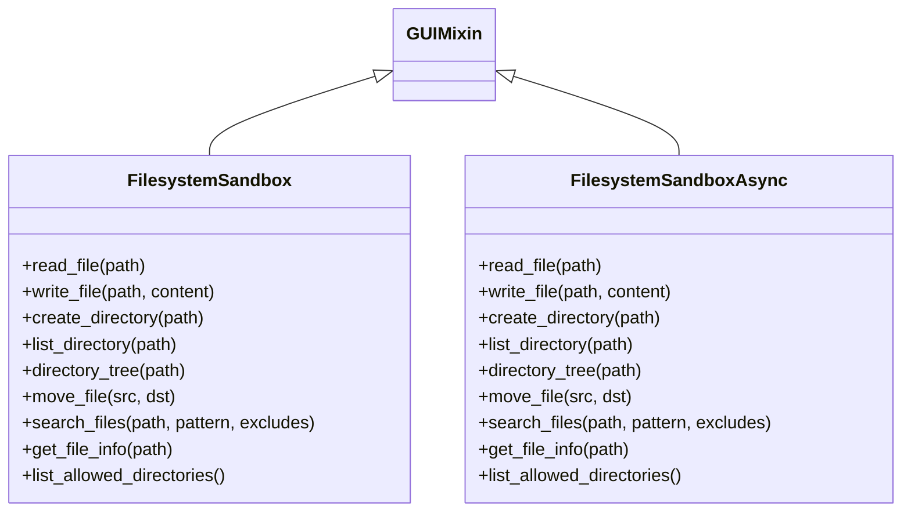
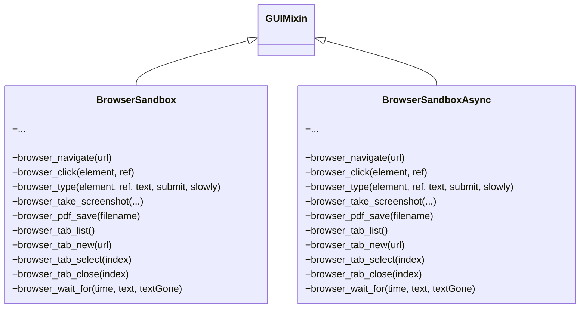
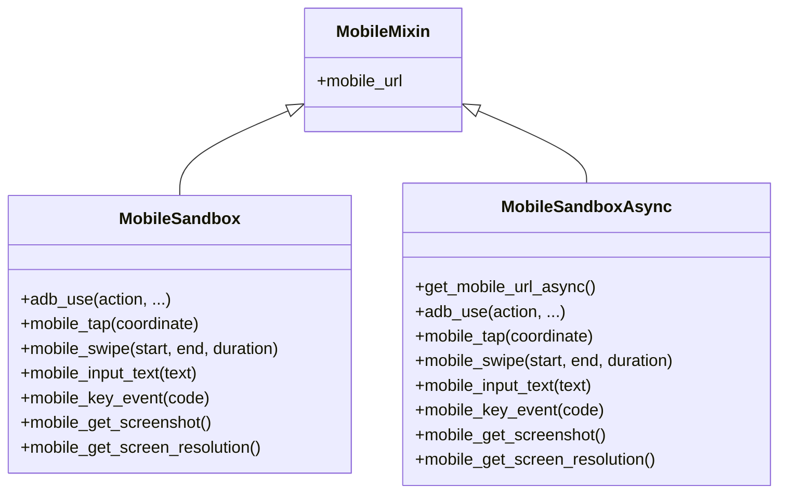
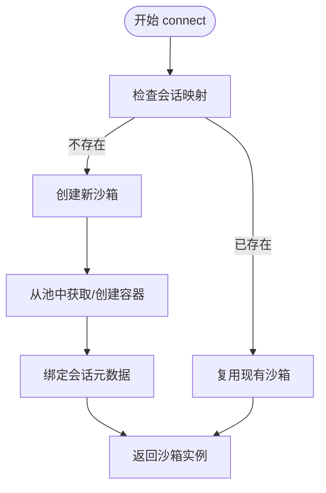
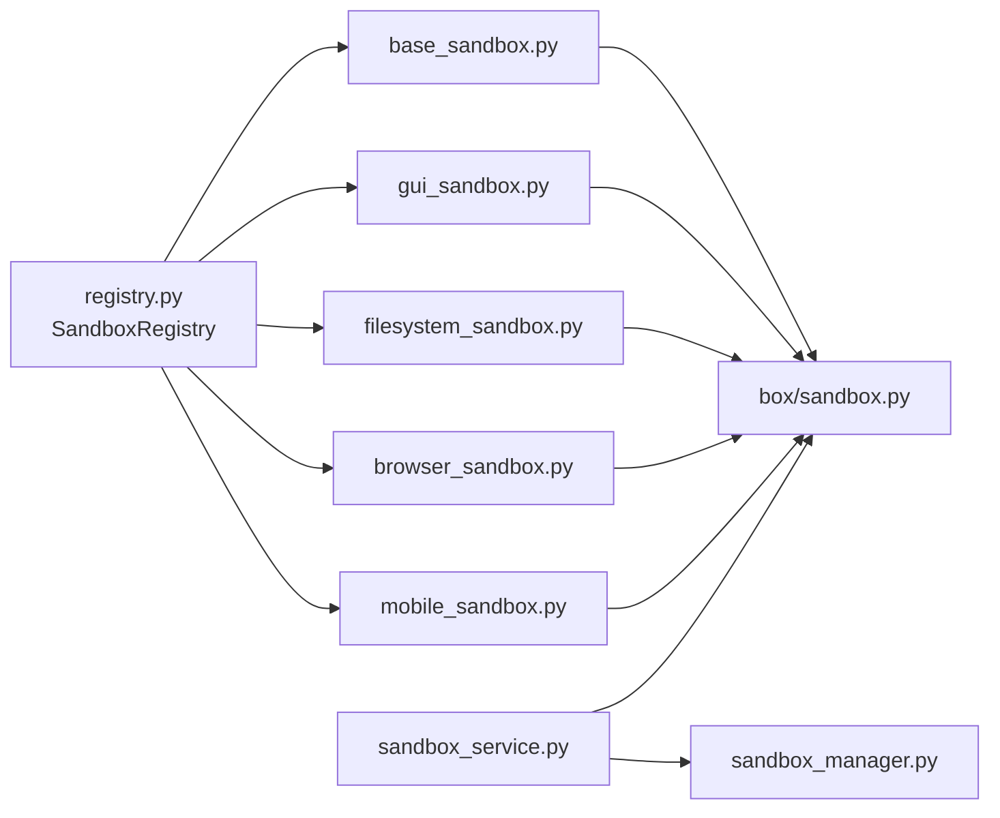

# 沙箱示例

<cite>
**本文引用的文件**
- [sandbox.md（中文）](file://cookbook/zh/sandbox/sandbox.md)
- [sandbox.md（英文）](file://cookbook/en/sandbox/sandbox.md)
- [__init__.py（沙箱导出）](file://src/agentscope_runtime/sandbox/__init__.py)
- [sandbox.py（沙箱基类）](file://src/agentscope_runtime/sandbox/box/sandbox.py)
- [base_sandbox.py](file://src/agentscope_runtime/sandbox/box/base/base_sandbox.py)
- [gui_sandbox.py](file://src/agentscope_runtime/sandbox/box/gui/gui_sandbox.py)
- [browser_sandbox.py](file://src/agentscope_runtime/sandbox/box/browser/browser_sandbox.py)
- [filesystem_sandbox.py](file://src/agentscope_runtime/sandbox/box/filesystem/filesystem_sandbox.py)
- [mobile_sandbox.py](file://src/agentscope_runtime/sandbox/box/mobile/mobile_sandbox.py)
- [sandbox_service.py](file://src/agentscope_runtime/engine/services/sandbox/sandbox_service.py)
- [sandbox_service_factory.py](file://src/agentscope_runtime/engine/services/sandbox/sandbox_service_factory.py)
- [sandbox_manager.py](file://src/agentscope_runtime/sandbox/manager/sandbox_manager.py)
- [registry.py（沙箱注册表）](file://src/agentscope_runtime/sandbox/registry.py)
- [README.md（AgentBay 示例）](file://examples/sandbox/agentbay_sandbox/README.md)
- [README.md（自定义沙箱）](file://examples/sandbox/custom_sandbox/README.md)
</cite>

## 目录
1. [简介](#简介)
2. [项目结构](#项目结构)
3. [核心组件](#核心组件)
4. [架构总览](#架构总览)
5. [详细组件分析](#详细组件分析)
6. [依赖关系分析](#依赖关系分析)
7. [性能考量](#性能考量)
8. [故障排查指南](#故障排查指南)
9. [结论](#结论)
10. [附录](#附录)

## 简介
本指南面向 AgentScope Runtime 的沙箱能力，系统讲解各类沙箱（基础、GUI、浏览器、文件系统、移动、云沙箱）的使用方法与差异，涵盖同步与异步沙箱的适用场景、工具注册与适配、镜像配置与管理、以及高级部署（本地/远程/生产环境）。文档同时提供可直接定位到源码路径的示例片段，便于快速上手与深入理解。

## 项目结构
- 沙箱 SDK 位于 src/agentscope_runtime/sandbox，包含各类型沙箱实现、注册表、管理器与工具适配层。
- 服务层位于 src/agentscope_runtime/engine/services/sandbox，提供统一的沙箱服务与工厂，支持会话管理、复用与远程连接。
- 教程与示例位于 cookbook 与 examples，覆盖中文/英文教程、AgentBay 云沙箱与自定义沙箱示例。



图表来源
- [sandbox.py:148-313](file://src/agentscope_runtime/sandbox/box/sandbox.py#L148-L313)
- [base_sandbox.py:18-102](file://src/agentscope_runtime/sandbox/box/base/base_sandbox.py#L18-L102)
- [gui_sandbox.py:72-240](file://src/agentscope_runtime/sandbox/box/gui/gui_sandbox.py#L72-L240)
- [browser_sandbox.py:38-498](file://src/agentscope_runtime/sandbox/box/browser/browser_sandbox.py#L38-L498)
- [filesystem_sandbox.py:20-254](file://src/agentscope_runtime/sandbox/box/filesystem/filesystem_sandbox.py#L20-L254)
- [mobile_sandbox.py:88-342](file://src/agentscope_runtime/sandbox/box/mobile/mobile_sandbox.py#L88-L342)
- [registry.py:33-131](file://src/agentscope_runtime/sandbox/registry.py#L33-L131)
- [sandbox_service.py:11-238](file://src/agentscope_runtime/engine/services/sandbox/sandbox_service.py#L11-L238)
- [sandbox_service_factory.py:9-50](file://src/agentscope_runtime/engine/services/sandbox/sandbox_service_factory.py#L9-L50)
- [sandbox_manager.py:140-800](file://src/agentscope_runtime/sandbox/manager/sandbox_manager.py#L140-L800)

章节来源
- [sandbox.md（中文）:15-124](file://cookbook/zh/sandbox/sandbox.md#L15-L124)
- [sandbox.md（英文）:15-124](file://cookbook/en/sandbox/sandbox.md#L15-L124)

## 核心组件
- 沙箱基类与生命周期
  - Sandbox/SandboxAsync：封装创建、销毁、工具调用、MCP 服务器注入等通用逻辑。
  - 支持嵌入式（本地）与远程两种模式，自动注册信号处理与清理。
- 各类型沙箱
  - Base/BaseSandboxAsync：提供 Python 代码执行与 Shell 命令执行。
  - Gui/GuiSandboxAsync：提供桌面 URL、鼠标键盘交互与截图。
  - Browser/BrowserSandboxAsync：提供浏览器导航、点击、输入、截图、PDF、标签页等。
  - Filesystem/FilesystemSandboxAsync：提供文件读写、目录操作、搜索、信息查询等。
  - Mobile/MobileSandboxAsync：提供 ADB 动作、截图、分辨率、按键、滑动、点击等。
- 服务与工厂
  - SandboxService：统一管理会话、复用沙箱、远程连接、释放资源。
  - SandboxServiceFactory：支持环境变量与自定义后端注册。
- 注册表与镜像
  - SandboxRegistry：装饰器注册沙箱类与其镜像、超时、资源限制、运行时配置等。
  - 镜像命名与来源：中文教程给出镜像来源与命名规范，英文教程提供镜像清单。

章节来源
- [sandbox.py:148-313](file://src/agentscope_runtime/sandbox/box/sandbox.py#L148-L313)
- [base_sandbox.py:18-102](file://src/agentscope_runtime/sandbox/box/base/base_sandbox.py#L18-L102)
- [gui_sandbox.py:72-240](file://src/agentscope_runtime/sandbox/box/gui/gui_sandbox.py#L72-L240)
- [browser_sandbox.py:38-498](file://src/agentscope_runtime/sandbox/box/browser/browser_sandbox.py#L38-L498)
- [filesystem_sandbox.py:20-254](file://src/agentscope_runtime/sandbox/box/filesystem/filesystem_sandbox.py#L20-L254)
- [mobile_sandbox.py:88-342](file://src/agentscope_runtime/sandbox/box/mobile/mobile_sandbox.py#L88-L342)
- [sandbox_service.py:11-238](file://src/agentscope_runtime/engine/services/sandbox/sandbox_service.py#L11-L238)
- [sandbox_service_factory.py:9-50](file://src/agentscope_runtime/engine/services/sandbox/sandbox_service_factory.py#L9-L50)
- [registry.py:33-131](file://src/agentscope_runtime/sandbox/registry.py#L33-L131)
- [sandbox.md（中文）:45-88](file://cookbook/zh/sandbox/sandbox.md#L45-L88)
- [sandbox.md（英文）:45-88](file://cookbook/en/sandbox/sandbox.md#L45-L88)

## 架构总览
AgentScope Runtime 的沙箱体系由“SDK 层（沙箱类与注册表）+ 服务层（SandboxService/Factory）+ 管理器层（SandboxManager）”构成，支持本地嵌入与远程模式。服务层负责会话与沙箱复用，管理器负责容器生命周期与池化调度。

```mermaid
sequenceDiagram
participant U as "用户代码"
participant Svc as "SandboxService"
participant Fac as "SandboxServiceFactory"
participant Mgr as "SandboxManager"
participant Box as "具体沙箱类(Base/GUI/Browser/FS/Mobile)"
participant Ctr as "容器/云服务"
U->>Fac : 创建服务工厂
Fac-->>Svc : 实例化 SandboxService
U->>Svc : connect(session_id, user_id, types)
Svc->>Mgr : get_session_mapping()/create_from_pool()
Mgr->>Ctr : 创建/复用容器或云会话
Ctr-->>Mgr : 返回沙箱标识
Mgr-->>Svc : 返回沙箱ID
Svc-->>U : 返回沙箱实例
U->>Box : 调用工具/执行命令
Box->>Mgr : 调用工具/添加MCP
Mgr-->>Box : 返回结果
```

图表来源
- [sandbox_service.py:82-200](file://src/agentscope_runtime/engine/services/sandbox/sandbox_service.py#L82-L200)
- [sandbox_manager.py:592-704](file://src/agentscope_runtime/sandbox/manager/sandbox_manager.py#L592-L704)
- [sandbox.py:198-218](file://src/agentscope_runtime/sandbox/box/sandbox.py#L198-L218)

## 详细组件分析

### 基础沙箱（Base）
- 用途：在隔离环境中执行 Python 代码与 Shell 命令。
- 同步/异步：BaseSandbox/BaseSandboxAsync 提供 run_ipython_cell 与 run_shell_command。
- 镜像：agentscope/runtime-sandbox-base:latest。
- 使用要点：适合轻量工具执行与脚本运行；异步版本适合并发场景。



图表来源
- [sandbox.py:148-313](file://src/agentscope_runtime/sandbox/box/sandbox.py#L148-L313)
- [base_sandbox.py:18-102](file://src/agentscope_runtime/sandbox/box/base/base_sandbox.py#L18-L102)

章节来源
- [sandbox.md（中文）:126-148](file://cookbook/zh/sandbox/sandbox.md#L126-L148)
- [sandbox.md（英文）:126-148](file://cookbook/en/sandbox/sandbox.md#L126-L148)
- [base_sandbox.py:35-51](file://src/agentscope_runtime/sandbox/box/base/base_sandbox.py#L35-L51)
- [base_sandbox.py:78-101](file://src/agentscope_runtime/sandbox/box/base/base_sandbox.py#L78-L101)

### GUI 沙箱（Gui）
- 用途：提供可视化桌面环境，支持鼠标、键盘与截图。
- URL：desktop_url 可访问 VNC 桌面；异步版本提供 get_desktop_url_async。
- 工具：computer_use(action, coordinate, text) 支持多种桌面操作。
- 注意：在 arm64 架构可能有兼容性风险，详见注释。



图表来源
- [gui_sandbox.py:17-63](file://src/agentscope_runtime/sandbox/box/gui/gui_sandbox.py#L17-L63)
- [gui_sandbox.py:72-240](file://src/agentscope_runtime/sandbox/box/gui/gui_sandbox.py#L72-L240)

章节来源
- [sandbox.md（中文）:150-176](file://cookbook/zh/sandbox/sandbox.md#L150-L176)
- [sandbox.md（英文）:150-176](file://cookbook/en/sandbox/sandbox.md#L150-L176)
- [gui_sandbox.py:98-151](file://src/agentscope_runtime/sandbox/box/gui/gui_sandbox.py#L98-L151)
- [gui_sandbox.py:188-239](file://src/agentscope_runtime/sandbox/box/gui/gui_sandbox.py#L188-L239)

### 文件系统沙箱（Filesystem）
- 用途：在 GUI 环境中进行文件系统操作（读写、创建、移动、搜索、信息查询等）。
- 工具：read_file/read_multiple_files/write_file/edit_file/create_directory/list_directory/directory_tree/move_file/search_files/get_file_info/list_allowed_directories。



图表来源
- [filesystem_sandbox.py:20-254](file://src/agentscope_runtime/sandbox/box/filesystem/filesystem_sandbox.py#L20-L254)

章节来源
- [sandbox.md（中文）:178-202](file://cookbook/zh/sandbox/sandbox.md#L178-L202)
- [sandbox.md（英文）:178-202](file://cookbook/en/sandbox/sandbox.md#L178-L202)
- [filesystem_sandbox.py:37-156](file://src/agentscope_runtime/sandbox/box/filesystem/filesystem_sandbox.py#L37-L156)
- [filesystem_sandbox.py:183-253](file://src/agentscope_runtime/sandbox/box/filesystem/filesystem_sandbox.py#L183-L253)

### 浏览器沙箱（Browser）
- 用途：在隔离沙箱中进行浏览器自动化（导航、点击、输入、截图、PDF、标签页、等待等）。
- 工具：browser_navigate/browser_click/browser_type/browser_take_screenshot/browser_pdf_save/browser_tab_* 等。



图表来源
- [browser_sandbox.py:38-498](file://src/agentscope_runtime/sandbox/box/browser/browser_sandbox.py#L38-L498)

章节来源
- [sandbox.md（中文）:204-228](file://cookbook/zh/sandbox/sandbox.md#L204-L228)
- [sandbox.md（英文）:204-228](file://cookbook/en/sandbox/sandbox.md#L204-L228)
- [browser_sandbox.py:104-301](file://src/agentscope_runtime/sandbox/box/browser/browser_sandbox.py#L104-L301)
- [browser_sandbox.py:361-497](file://src/agentscope_runtime/sandbox/box/browser/browser_sandbox.py#L361-L497)

### 移动沙箱（Mobile）
- 用途：基于 Android 模拟器的移动端操作（点击、滑动、输入、按键、截图、分辨率）。
- URL：mobile_url 可访问 websockify/VNC；异步版本提供 get_mobile_url_async。
- 注意：Linux 主机需加载 binder/ashmem 内核模块；ARM64 可能存在兼容性问题。



图表来源
- [mobile_sandbox.py:17-78](file://src/agentscope_runtime/sandbox/box/mobile/mobile_sandbox.py#L17-L78)
- [mobile_sandbox.py:88-342](file://src/agentscope_runtime/sandbox/box/mobile/mobile_sandbox.py#L88-L342)

章节来源
- [sandbox.md（中文）:230-279](file://cookbook/zh/sandbox/sandbox.md#L230-L279)
- [sandbox.md（英文）:230-279](file://cookbook/en/sandbox/sandbox.md#L230-L279)
- [mobile_sandbox.py:114-229](file://src/agentscope_runtime/sandbox/box/mobile/mobile_sandbox.py#L114-L229)
- [mobile_sandbox.py:266-341](file://src/agentscope_runtime/sandbox/box/mobile/mobile_sandbox.py#L266-L341)

### 云沙箱与 AgentBay
- 云沙箱：CloudSandbox 作为抽象基类，AgentbaySandbox 为具体实现，无需本地容器。
- 特性：多环境类型（Linux/Windows/Browser/CodeSpace/Mobile），自动会话生命周期管理，API 直连云服务。
- 使用：通过环境变量配置 API Key，或在 SandboxService 中传入 bearer_token。

章节来源
- [sandbox.md（中文）:292-321](file://cookbook/zh/sandbox/sandbox.md#L292-L321)
- [sandbox.md（英文）:292-315](file://cookbook/en/sandbox/sandbox.md#L292-L315)
- [README.md（AgentBay 示例）:88-134](file://examples/sandbox/agentbay_sandbox/README.md#L88-L134)

### 沙箱服务与会话管理
- SandboxService：支持会话级复用、远程连接、释放策略、AgentBay 会话识别与特殊处理。
- SandboxServiceFactory：支持环境变量驱动与自定义后端注册。



图表来源
- [sandbox_service.py:82-200](file://src/agentscope_runtime/engine/services/sandbox/sandbox_service.py#L82-L200)
- [sandbox_manager.py:592-704](file://src/agentscope_runtime/sandbox/manager/sandbox_manager.py#L592-L704)

章节来源
- [sandbox_service.py:11-238](file://src/agentscope_runtime/engine/services/sandbox/sandbox_service.py#L11-L238)
- [sandbox_service_factory.py:9-50](file://src/agentscope_runtime/engine/services/sandbox/sandbox_service_factory.py#L9-L50)

### 工具注册与适配（MCP）
- 添加 MCP 服务器：在沙箱中通过 add_mcp_servers 注入 MCP 服务，随后 list_tools 与 call_tool 使用。
- 服务侧注入：SandboxService.connect 后可在沙箱上调用 add_mcp_servers。
- 示例：中文教程提供 uvx mcp-server-time 的集成示例。

章节来源
- [sandbox.md（中文）:326-362](file://cookbook/zh/sandbox/sandbox.md#L326-L362)
- [sandbox.md（英文）:317-352](file://cookbook/en/sandbox/sandbox.md#L317-L352)
- [sandbox_service.py:119-142](file://src/agentscope_runtime/engine/services/sandbox/sandbox_service.py#L119-L142)

### 镜像配置与管理
- 镜像来源：阿里云容器镜像服务（ACR），镜像命名统一为 agentscope/runtime-sandbox-*:latest。
- 清单：基础、GUI、文件系统、浏览器、移动端镜像；也可按需拉取或全量拉取。
- 自定义镜像：可通过 runtime-sandbox-builder 构建自定义镜像，配合自定义沙箱类注册。

章节来源
- [sandbox.md（中文）:45-88](file://cookbook/zh/sandbox/sandbox.md#L45-L88)
- [sandbox.md（英文）:45-88](file://cookbook/en/sandbox/sandbox.md#L45-L88)
- [README.md（自定义沙箱）:171-184](file://examples/sandbox/custom_sandbox/README.md#L171-L184)

### 部署与高级配置
- 本地/远程：SandboxManager 支持 base_url/bearer_token 远程模式；本地模式自动启动 watcher。
- 生产部署：支持 Kubernetes、函数计算、ACK 等后端；通过 CONTAINER_DEPLOYMENT 环境变量切换。
- 服务工厂：SandboxServiceFactory 支持环境变量与自定义后端注册。

章节来源
- [sandbox.md（中文）:19-34](file://cookbook/zh/sandbox/sandbox.md#L19-L34)
- [sandbox.md（英文）:19-34](file://cookbook/en/sandbox/sandbox.md#L19-L34)
- [sandbox_manager.py:140-270](file://src/agentscope_runtime/sandbox/manager/sandbox_manager.py#L140-L270)
- [sandbox_service_factory.py:9-50](file://src/agentscope_runtime/engine/services/sandbox/sandbox_service_factory.py#L9-L50)

## 依赖关系分析



图表来源
- [registry.py:33-131](file://src/agentscope_runtime/sandbox/registry.py#L33-L131)
- [base_sandbox.py:11-17](file://src/agentscope_runtime/sandbox/box/base/base_sandbox.py#L11-L17)
- [gui_sandbox.py:65-71](file://src/agentscope_runtime/sandbox/box/gui/gui_sandbox.py#L65-L71)
- [filesystem_sandbox.py:13-19](file://src/agentscope_runtime/sandbox/box/filesystem/filesystem_sandbox.py#L13-L19)
- [browser_sandbox.py:31-37](file://src/agentscope_runtime/sandbox/box/browser/browser_sandbox.py#L31-L37)
- [mobile_sandbox.py:80-87](file://src/agentscope_runtime/sandbox/box/mobile/mobile_sandbox.py#L80-L87)
- [sandbox.py:18-86](file://src/agentscope_runtime/sandbox/box/sandbox.py#L18-L86)
- [sandbox_service.py:11-55](file://src/agentscope_runtime/engine/services/sandbox/sandbox_service.py#L11-L55)
- [sandbox_manager.py:140-270](file://src/agentscope_runtime/sandbox/manager/sandbox_manager.py#L140-L270)

章节来源
- [__init__.py（沙箱导出）:6-16](file://src/agentscope_runtime/sandbox/__init__.py#L6-L16)

## 性能考量
- 池化与复用：SandboxManager 支持容器池（Redis/内存队列）与会话映射，减少创建/销毁开销。
- 超时与资源限制：通过 SandboxRegistry 的 timeout 与 runtime_config（如内存/CPU）控制资源占用。
- 异步执行：Browser/Filesystem/Mobile 等异步沙箱适合高并发与长耗时操作。
- 远程模式：通过 bearer_token 与 base_url 连接远端管理器，避免本地资源压力。

## 故障排查指南
- 沙箱未启动：sandbox_id 为空时会记录错误日志，需先进入上下文或显式 start/start_async。
- 健康检查失败：GUI/Mobile 沙箱在 desktop_url/get_desktop_url_async 前会检查健康状态，不健康抛出异常。
- 移动端宿主准备：Linux 主机需加载 binder/ashmem 模块；ARM64 架构可能不稳定。
- 远程连接：确认 base_url 与 bearer_token 正确；检查服务端可达与鉴权头。
- AgentBay：确认 API Key 环境变量；注意 AgentBay 会话生命周期与自动清理。

章节来源
- [sandbox.py:87-104](file://src/agentscope_runtime/sandbox/box/sandbox.py#L87-L104)
- [gui_sandbox.py:18-34](file://src/agentscope_runtime/sandbox/box/gui/gui_sandbox.py#L18-L34)
- [mobile_sandbox.py:18-41](file://src/agentscope_runtime/sandbox/box/mobile/mobile_sandbox.py#L18-L41)
- [README.md（AgentBay 示例）:90-96](file://examples/sandbox/agentbay_sandbox/README.md#L90-L96)

## 结论
AgentScope Runtime 的沙箱体系以“统一接口 + 多类型实现 + 服务编排”为核心，既满足本地开发的灵活性，也支持远程与生产的规模化部署。通过 SandboxRegistry 注册镜像与配置、SandboxService/Factory 统一会话与后端、SandboxManager 管理容器池与生命周期，开发者可快速组合不同沙箱类型完成复杂任务。

## 附录
- 快速定位示例
  - 基础沙箱：[run_ipython_cell/run_shell_command 示例:128-148](file://cookbook/zh/sandbox/sandbox.md#L128-L148)
  - GUI 沙箱：[desktop_url/computer_use 示例:154-176](file://cookbook/zh/sandbox/sandbox.md#L154-L176)
  - 文件系统沙箱：[目录与文件操作示例:182-202](file://cookbook/zh/sandbox/sandbox.md#L182-L202)
  - 浏览器沙箱：[导航与截图示例:208-228](file://cookbook/zh/sandbox/sandbox.md#L208-L228)
  - 移动沙箱：[ADB 动作与截图示例:251-279](file://cookbook/zh/sandbox/sandbox.md#L251-L279)
  - 云沙箱（AgentBay）：[API Key 与会话示例:90-134](file://examples/sandbox/agentbay_sandbox/README.md#L90-L134)
  - 自定义沙箱：[注册与镜像构建示例:23-184](file://examples/sandbox/custom_sandbox/README.md#L23-L184)