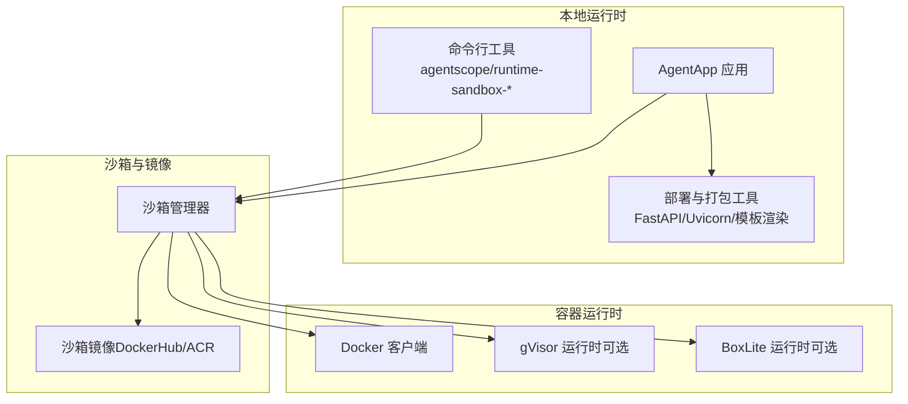
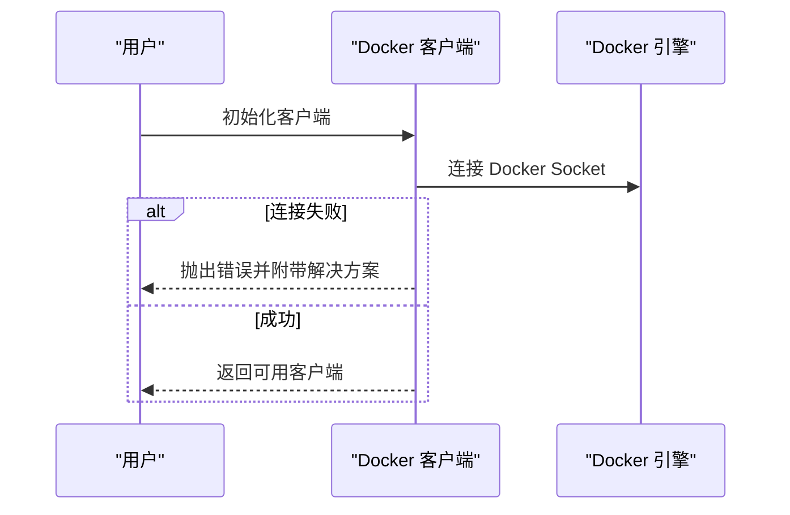
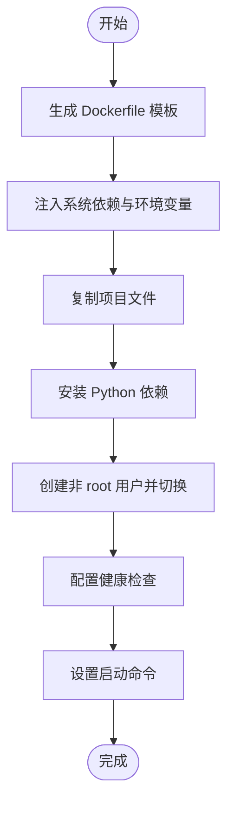
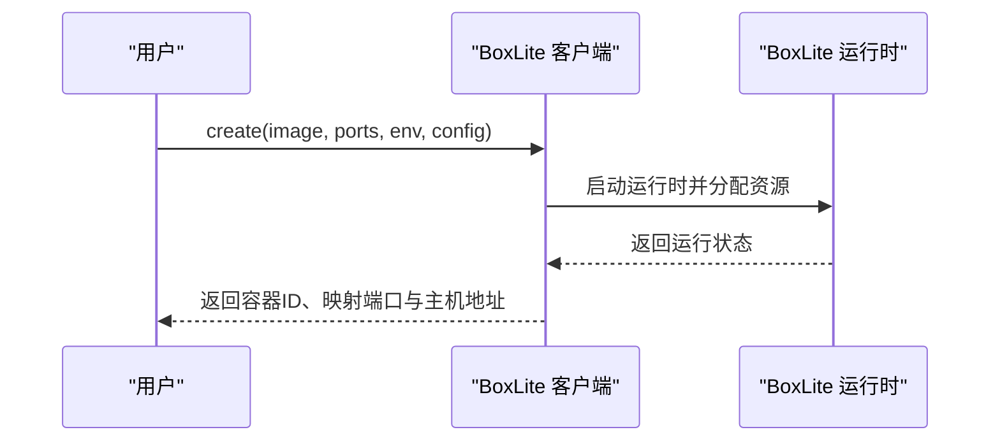
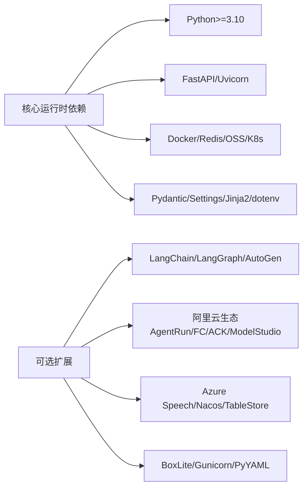

# 环境准备

<cite>
**本文引用的文件**
- [README.md](file://README.md)
- [README_zh.md](file://README_zh.md)
- [pyproject.toml](file://pyproject.toml)
- [install.md（英文）](file://cookbook/en/install.md)
- [install.md（中文）](file://cookbook/zh/install.md)
- [quickstart.md（英文）](file://cookbook/en/quickstart.md)
- [quickstart.md（中文）](file://cookbook/zh/quickstart.md)
- [docker_client.py](file://src/agentscope_runtime/common/container_clients/docker_client.py)
- [dockerfile_generator.py](file://src/agentscope_runtime/engine/deployers/utils/docker_image_utils/dockerfile_generator.py)
- [boxlite_client.py](file://src/agentscope_runtime/common/container_clients/boxlite_client.py)
- [manager_config.py](file://src/agentscope_runtime/sandbox/model/manager_config.py)
- [sandbox.md（英文）](file://cookbook/en/sandbox/sandbox.md)
- [sandbox.md（中文）](file://cookbook/zh/sandbox/sandbox.md)
- [advanced.md（英文）](file://cookbook/en/sandbox/advanced.md)
</cite>

## 目录
1. [简介](#简介)
2. [系统要求与兼容性](#系统要求与兼容性)
3. [依赖项清单](#依赖项清单)
4. [Docker 环境安装与配置](#docker-环境安装与配置)
5. [可选后端：gVisor 与 BoxLite](#可选后端gvisor-与-boxlite)
6. [环境验证方法](#环境验证方法)
7. [常见问题排查](#常见问题排查)
8. [架构概览](#架构概览)
9. [详细组件分析](#详细组件分析)
10. [依赖关系分析](#依赖关系分析)
11. [性能考量](#性能考量)
12. [故障排查指南](#故障排查指南)
13. [结论](#结论)

## 简介
本指南面向首次部署 AgentScope Runtime 的用户，聚焦“环境准备”阶段的关键步骤：系统要求（Python 3.10+、操作系统兼容性）、必需与可选依赖项（Docker、uv 等）、Docker 环境安装与配置（含 Docker Desktop、权限与网络）、可选后端（gVisor、BoxLite）的适用场景、环境验证方法（Docker 版本检查、权限验证、基础功能测试），以及常见问题排查（守护进程、权限不足、网络连接等）。文中所有技术细节均来源于仓库内的 README、安装与快速开始文档、以及核心实现文件。

## 系统要求与兼容性
- 运行时要求
  - Python 3.10 或更高版本
  - 支持的操作系统：Linux、macOS、Windows（Docker Desktop 用于本地开发时的常用方案）
- 语言与文档
  - 项目同时提供中英文 README 与教程，便于多语言用户理解

章节来源
- [README.md:111-114](file://README.md#L111-L114)
- [README_zh.md:112-114](file://README_zh.md#L112-L114)

## 依赖项清单
- 必需依赖（核心运行时）
  - 语言与运行时：Python >= 3.10
  - Web 框架与服务：FastAPI、Uvicorn
  - 模型与通信：DashScope、OpenAI SDK
  - 容器与编排：Docker（>=7.1.0）、Kubernetes（>=33.1.0）
  - 存储与状态：Redis（>=6.0.0）、OSS（对象存储）
  - 配置与模板：Pydantic、Pydantic Settings、Jinja2、python-dotenv
  - 其他：Celery（带 Redis）、A2A 协议 SDK、Click、Rich、短 ID 生成等
- 可选扩展（部署与生态）
  - 大模型生态：LangChain、LangChain OpenAI、LangGraph、AutoGen
  - 云与平台：阿里云 AgentRun、FC、ACK、ModelStudio、Azure Speech、Nacos、TableStore 等
  - 开发工具：pytest、Sphinx、Mermaid、fakeredis 等
  - 其他：BoxLite（>=0.5.2）、Gunicorn、PyYAML 等
- 包管理器
  - pip 或 uv（推荐 uv）

章节来源
- [pyproject.toml:6-32](file://pyproject.toml#L6-L32)
- [pyproject.toml:53-99](file://pyproject.toml#L53-L99)
- [install.md（英文）:77-86](file://cookbook/en/install.md#L77-L86)
- [install.md（中文）:75-84](file://cookbook/zh/install.md#L75-L84)

## Docker 环境安装与配置
- 安装 Docker
  - 在 Linux/macOS/Windows 上安装 Docker Engine 或 Docker Desktop（Windows 用户推荐 Docker Desktop）
  - 确保 Docker 服务已启动并可被当前用户访问
- 权限配置
  - 将当前用户加入 docker 组（Linux/macOS），避免每次使用 sudo
  - 如使用 Colima 等替代 Docker Engine，需设置 DOCKER_HOST 环境变量指向其 socket
- 网络要求
  - 沙箱镜像默认从 DockerHub 拉取；若网络受限，可切换至阿里云容器镜像服务（ACR），并通过环境变量配置镜像仓库、命名空间与标签
- 镜像准备
  - 可选择拉取全部沙箱镜像以获得完整功能，或仅拉取所需镜像
  - 镜像来源：阿里云容器镜像服务（ACR），拉取后重命名为标准名称以与运行时无缝集成

章节来源
- [docker_client.py:55-65](file://src/agentscope_runtime/common/container_clients/docker_client.py#L55-L65)
- [sandbox.md（英文）:32-57](file://cookbook/en/sandbox/sandbox.md#L32-L57)
- [sandbox.md（中文）:32-57](file://cookbook/zh/sandbox/sandbox.md#L32-L57)
- [README_zh.md:480-525](file://README_zh.md#L480-L525)

## 可选后端：gVisor 与 BoxLite
- CONTAINER_DEPLOYMENT 环境变量
  - 支持值：docker、gvisor、boxlite 等，默认 docker
- gVisor（可选）
  - 适用于需要更高本地隔离的安全运行场景（用户态内核）
  - 需要安装并运行 runsc（gVisor 的运行时）
- BoxLite（可选）
  - 适用于需要“嵌入式轻量虚拟机”隔离的本地运行场景
  - 无需守护进程，以库形式嵌入
- 后端对比（本地/远程/生产）
  - 详见“后端对比表”，涵盖隔离强度、启动时间、是否需要守护进程、OCI 支持、可嵌入性、操作系统支持与适用场景

章节来源
- [README_zh.md:277-281](file://README_zh.md#L277-L281)
- [advanced.md（英文）:129-143](file://cookbook/en/sandbox/advanced.md#L129-L143)

## 环境验证方法
- Python 与包管理器
  - 安装完成后，通过 Python 导入并打印版本号，确认安装成功
- Docker 客户端连通性
  - 初始化 Docker 客户端时会抛出明确异常，包含“确保 Docker 正在运行”“检查 Docker 权限”“Colima 场景下的 DOCKER_HOST 设置”等解决方案提示
- 基础功能测试
  - 使用 curl 调用 Agent API 端点，验证 SSE 流式输出
  - 启动 AgentApp 并访问 /process 端点，观察消息序列与状态流转
- 沙箱镜像可用性
  - 拉取并重命名沙箱镜像后，可在本地运行对应沙箱示例，验证工具列表、命令执行与 GUI/浏览器/文件系统/移动端功能

章节来源
- [install.md（英文）:64-74](file://cookbook/en/install.md#L64-L74)
- [install.md（中文）:62-72](file://cookbook/zh/install.md#L62-L72)
- [docker_client.py:55-65](file://src/agentscope_runtime/common/container_clients/docker_client.py#L55-L65)
- [quickstart.md（英文）:174-204](file://cookbook/en/quickstart.md#L174-L204)
- [quickstart.md（中文）:174-204](file://cookbook/zh/quickstart.md#L174-L204)

## 常见问题排查
- Docker 守护进程未运行或无法连接
  - 现象：初始化 Docker 客户端时报错
  - 解决：启动 Docker 服务；Linux/macOS 检查 docker 组权限；Windows 使用 Docker Desktop；Colima 用户设置 DOCKER_HOST
- 权限不足（Permission Denied）
  - 现象：拉取镜像或创建容器时报权限错误
  - 解决：将当前用户加入 docker 组；在 macOS/Linux 上重新登录生效
- 网络连接问题（镜像拉取失败）
  - 现象：DockerHub 拉取超时或失败
  - 解决：配置镜像仓库为阿里云容器镜像服务（ACR），设置 RUNTIME_SANDBOX_REGISTRY、RUNTIME_SANDBOX_IMAGE_NAMESPACE、RUNTIME_SANDBOX_IMAGE_TAG
- gVisor 运行时缺失
  - 现象：选择 gvisor 后启动失败
  - 解决：安装并正确配置 runsc（gVisor 运行时）
- BoxLite 未安装或不可用
  - 现象：选择 boxlite 后报错
  - 解决：安装 boxlite（>=0.5.2），或改用 docker 后端

章节来源
- [docker_client.py:55-65](file://src/agentscope_runtime/common/container_clients/docker_client.py#L55-L65)
- [README_zh.md:480-525](file://README_zh.md#L480-L525)
- [advanced.md（英文）:129-143](file://cookbook/en/sandbox/advanced.md#L129-L143)

## 架构概览
下图展示 AgentScope Runtime 在本地运行时的典型组件与依赖关系，突出 Docker 客户端、沙箱管理器与可选后端（gVisor/BoxLite）之间的交互。

图表来源
- [docker_client.py:55-65](file://src/agentscope_runtime/common/container_clients/docker_client.py#L55-L65)
- [boxlite_client.py:123-149](file://src/agentscope_runtime/common/container_clients/boxlite_client.py#L123-L149)
- [manager_config.py:318-375](file://src/agentscope_runtime/sandbox/model/manager_config.py#L318-L375)

## 详细组件分析

### Docker 客户端初始化流程
- 初始化过程会尝试从环境加载 Docker 客户端
- 若失败，抛出包含具体解决建议的异常，包括：
  - 确保 Docker 正在运行
  - 检查 Docker 权限
  - Colima 场景下的 DOCKER_HOST 设置

图表来源
- [docker_client.py:55-65](file://src/agentscope_runtime/common/container_clients/docker_client.py#L55-L65)

章节来源
- [docker_client.py:55-65](file://src/agentscope_runtime/common/container_clients/docker_client.py#L55-L65)

### Docker 镜像构建与健康检查
- 生成 Dockerfile 时可配置额外系统依赖、环境变量、健康检查端点与启动命令
- 健康检查通过 curl 访问应用端点，确保容器就绪

图表来源
- [dockerfile_generator.py:98-123](file://src/agentscope_runtime/engine/deployers/utils/docker_image_utils/dockerfile_generator.py#L98-L123)

章节来源
- [dockerfile_generator.py:98-123](file://src/agentscope_runtime/engine/deployers/utils/docker_image_utils/dockerfile_generator.py#L98-L123)

### BoxLite 客户端创建流程
- BoxLite 作为本地轻量虚拟机运行时，无需守护进程
- 支持 CPU/内存等资源配置，创建后返回容器标识与映射端口

图表来源
- [boxlite_client.py:123-149](file://src/agentscope_runtime/common/container_clients/boxlite_client.py#L123-L149)

章节来源
- [boxlite_client.py:123-149](file://src/agentscope_runtime/common/container_clients/boxlite_client.py#L123-L149)

## 依赖关系分析
- 运行时依赖
  - Python 3.10+、FastAPI、Uvicorn、Docker、Redis、OSS、Kubernetes、A2A 协议 SDK、Click、Rich 等
- 可选扩展
  - LangChain/LangGraph/AutoGen、阿里云生态（AgentRun/FC/ACK/ModelStudio）、Azure Speech、BoxLite、Gunicorn、PyYAML 等
- 包管理器
  - pip 或 uv（推荐 uv）

图表来源
- [pyproject.toml:6-32](file://pyproject.toml#L6-L32)
- [pyproject.toml:53-99](file://pyproject.toml#L53-L99)

章节来源
- [pyproject.toml:6-32](file://pyproject.toml#L6-L32)
- [pyproject.toml:53-99](file://pyproject.toml#L53-L99)

## 性能考量
- 启动时间
  - Docker/BoxLite：毫秒级冷启动（本地）
  - gVisor：略高于 Docker（用户态内核）
  - Kubernetes/FC/ACK：受调度与镜像拉取影响，通常为秒级
- 隔离强度
  - gVisor 与 BoxLite 明显优于传统容器，接近硬件虚拟机隔离
- 资源占用
  - BoxLite 更轻量，适合本地嵌入式运行
  - Docker 适合通用场景，资源可控
- 网络与镜像
  - 使用阿里云 ACR 可降低拉取延迟，提高稳定性

章节来源
- [advanced.md（英文）:129-143](file://cookbook/en/sandbox/advanced.md#L129-L143)

## 故障排查指南
- Docker 客户端初始化失败
  - 检查 Docker 是否已启动
  - 校验当前用户是否在 docker 组
  - Colima 用户需设置 DOCKER_HOST 环境变量
- 权限不足
  - 在 Linux/macOS 上将用户加入 docker 组并重新登录
- 网络问题
  - 切换镜像仓库为阿里云 ACR，配置 RUNTIME_SANDBOX_REGISTRY、NAMESPACE、TAG
- gVisor 缺失
  - 安装并配置 runsc（gVisor 运行时）
- BoxLite 不可用
  - 安装 boxlite（>=0.5.2），或回退到 docker

章节来源
- [docker_client.py:55-65](file://src/agentscope_runtime/common/container_clients/docker_client.py#L55-L65)
- [README_zh.md:480-525](file://README_zh.md#L480-L525)
- [advanced.md（英文）:129-143](file://cookbook/en/sandbox/advanced.md#L129-L143)

## 结论
完成 Python 3.10+、包管理器（pip/uv）与 Docker（含权限与网络）的基础准备后，即可顺利安装 AgentScope Runtime 并运行沙箱示例。若对隔离性有更高要求，可选择 gVisor；若追求本地嵌入式运行体验，可选择 BoxLite。通过环境变量与镜像仓库配置，可有效规避网络限制。最后，结合 Docker 客户端初始化异常提示与 curl 基础验证，可快速定位并解决问题。