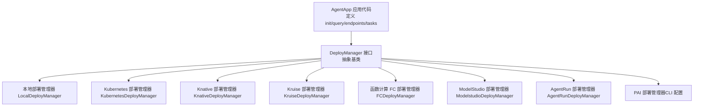
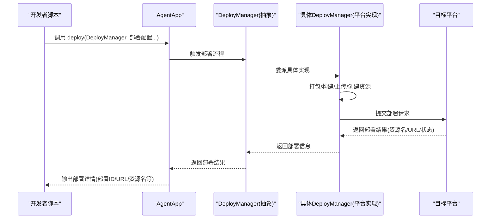
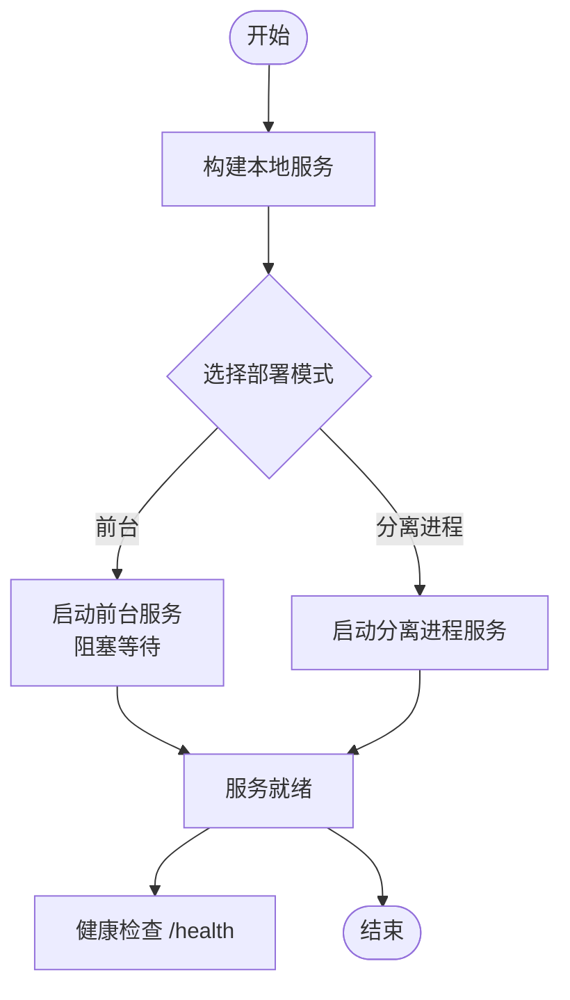
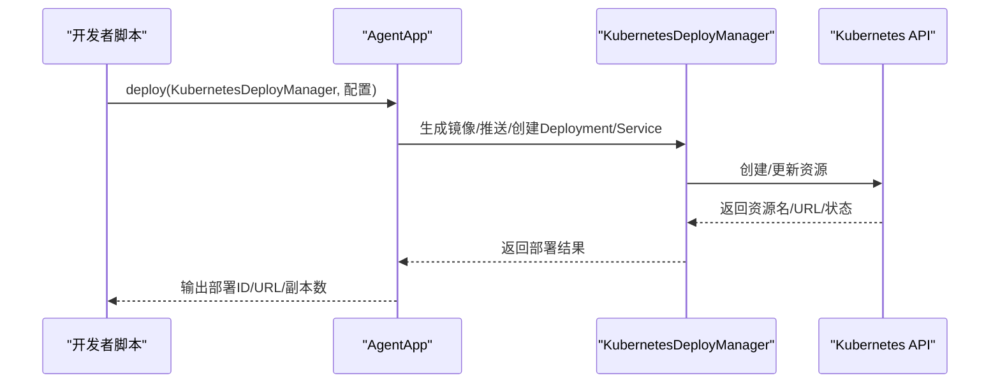
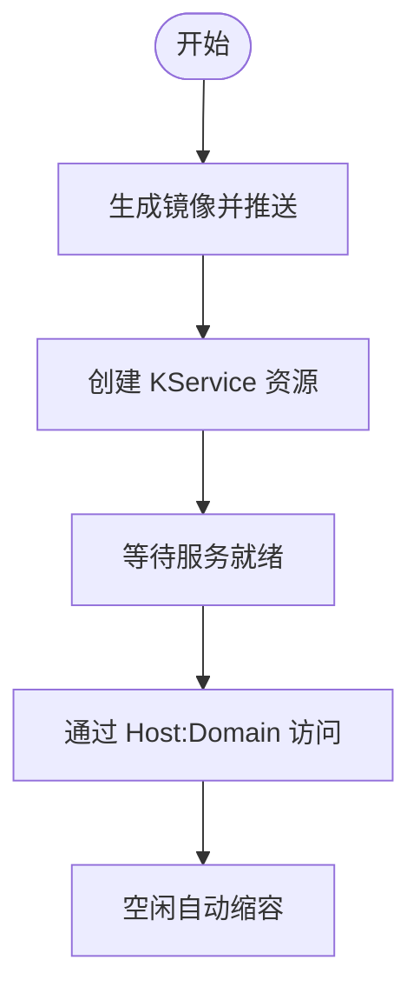
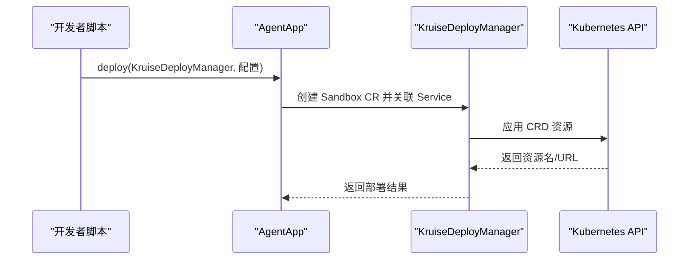
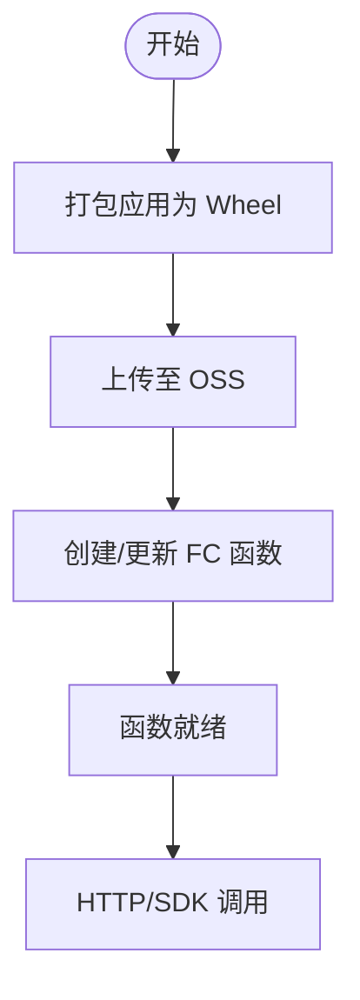
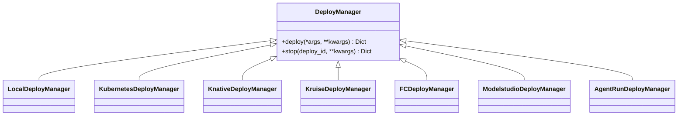

# 部署示例

<cite>
**本文引用的文件**
- [examples/deployments/agentrun_deploy/app_deploy_to_agentrun.py](file://examples/deployments/agentrun_deploy/app_deploy_to_agentrun.py)
- [examples/deployments/daemon_local_deploy/app_deploy.py](file://examples/deployments/daemon_local_deploy/app_deploy.py)
- [examples/deployments/detached_local_deploy/app_detached_deploy.py](file://examples/deployments/detached_local_deploy/app_detached_deploy.py)
- [examples/deployments/fc_deploy/app_deploy_to_fc.py](file://examples/deployments/fc_deploy/app_deploy_to_fc.py)
- [examples/deployments/k8s_deploy/app_deploy_to_k8s.py](file://examples/deployments/k8s_deploy/app_deploy_to_k8s.py)
- [examples/deployments/knative_deploy/app_deploy_to_knative.py](file://examples/deployments/knative_deploy/app_deploy_to_knative.py)
- [examples/deployments/kruise_deploy/app_deploy_to_kruise.py](file://examples/deployments/kruise_deploy/app_deploy_to_kruise.py)
- [examples/deployments/modelstudio_deploy/app_deploy_to_modelstudio.py](file://examples/deployments/modelstudio_deploy/app_deploy_to_modelstudio.py)
- [examples/deployments/pai_deploy/deploy_config.yaml](file://examples/deployments/pai_deploy/deploy_config.yaml)
- [examples/deployments/agentrun_deploy_config.yaml](file://examples/deployments/agentrun_deploy_config.yaml)
- [examples/deployments/local_deploy_config.yaml](file://examples/deployments/local_deploy_config.yaml)
- [examples/deployments/modelstudio_deploy_config.yaml](file://examples/deployments/modelstudio_deploy_config.yaml)
- [examples/deployments/k8s_deploy/k8s_deploy_config.yaml](file://examples/deployments/k8s_deploy/k8s_deploy_config.yaml)
- [examples/deployments/knative_deploy/knative_deploy_config.yaml](file://examples/deployments/knative_deploy/knative_deploy_config.yaml)
- [examples/deployments/kruise_deploy/kruise_deploy_config.yaml](file://examples/deployments/kruise_deploy/kruise_deploy_config.yaml)
- [src/agentscope_runtime/engine/deployers/base.py](file://src/agentscope_runtime/engine/deployers/base.py)
</cite>

## 目录
1. [简介](#简介)
2. [项目结构](#项目结构)
3. [核心组件](#核心组件)
4. [架构总览](#架构总览)
5. [详细组件分析](#详细组件分析)
6. [依赖关系分析](#依赖关系分析)
7. [性能考虑](#性能考虑)
8. [故障排查指南](#故障排查指南)
9. [结论](#结论)
10. [附录](#附录)

## 简介
本指南面向使用 AgentScope Runtime 的开发者与运维人员，系统性讲解如何通过 AgentApp 的 deploy 方法与各类 DeployManager 实现，完成从本地到多云平台的多种部署方式：本地部署、Kubernetes 集群部署、Knative 无服务器部署、Kruise Sandbox 部署、函数计算（FC）部署、ModelStudio 部署以及 PAI 部署。文档覆盖每种部署方式的配置参数、环境要求、适用场景、完整配置示例、服务访问方法（A2A 协议、Response API、OpenAI SDK 兼容模式）、部署验证与测试方法，以及最佳实践与运维建议。

## 项目结构
本仓库在 examples/deployments 下提供了多套可直接运行的部署示例，分别对应不同的目标平台；同时在 examples/deployments/*/config.* 提供了 YAML 配置模板，便于通过命令行工具进行部署。

图示来源
- [src/agentscope_runtime/engine/deployers/base.py:9-44](file://src/agentscope_runtime/engine/deployers/base.py#L9-L44)

章节来源
- [src/agentscope_runtime/engine/deployers/base.py:1-44](file://src/agentscope_runtime/engine/deployers/base.py#L1-L44)

## 核心组件
- AgentApp：应用入口，负责注册初始化逻辑、查询处理、端点与任务队列，并通过 deploy 方法统一调度 DeployManager 完成部署。
- DeployManager 抽象接口：定义 deploy 与 stop 两个核心方法，各平台具体实现负责打包、构建镜像/包、上传、创建资源、健康检查与状态管理。
- 各平台 DeployManager：如 LocalDeployManager、KubernetesDeployManager、KnativeDeployManager、KruiseDeployManager、FCDeployManager、ModelstudioDeployManager、AgentRunDeployManager，分别封装平台特定的部署流程与参数。

章节来源
- [src/agentscope_runtime/engine/deployers/base.py:9-44](file://src/agentscope_runtime/engine/deployers/base.py#L9-L44)

## 架构总览
下图展示了 AgentApp 如何通过 deploy 方法选择并调用不同 DeployManager，最终在目标平台上完成部署与服务暴露。

图示来源
- [src/agentscope_runtime/engine/deployers/base.py:23-43](file://src/agentscope_runtime/engine/deployers/base.py#L23-L43)

## 详细组件分析

### 本地部署（Daemon/前台/分离进程）
- 适用场景：开发调试、单机快速验证、无需外部集群。
- 关键参数：
  - host/port：服务监听地址与端口
  - 模式：支持前台阻塞、分离进程等
- 环境要求：Python 运行时、所需依赖（见 requirements 示例）
- 访问方式：通过返回的 url 进行健康检查与端点测试
- 示例路径：
  - [examples/deployments/daemon_local_deploy/app_deploy.py:122-129](file://examples/deployments/daemon_local_deploy/app_deploy.py#L122-L129)
  - [examples/deployments/detached_local_deploy/app_detached_deploy.py:52-121](file://examples/deployments/detached_local_deploy/app_detached_deploy.py#L52-L121)
- 配置模板：
  - [examples/deployments/local_deploy_config.yaml:1-16](file://examples/deployments/local_deploy_config.yaml#L1-L16)

图示来源
- [examples/deployments/daemon_local_deploy/app_deploy.py:122-129](file://examples/deployments/daemon_local_deploy/app_deploy.py#L122-L129)
- [examples/deployments/detached_local_deploy/app_detached_deploy.py:52-121](file://examples/deployments/detached_local_deploy/app_detached_deploy.py#L52-L121)

章节来源
- [examples/deployments/daemon_local_deploy/app_deploy.py:1-129](file://examples/deployments/daemon_local_deploy/app_deploy.py#L1-L129)
- [examples/deployments/detached_local_deploy/app_detached_deploy.py:1-125](file://examples/deployments/detached_local_deploy/app_detached_deploy.py#L1-L125)
- [examples/deployments/local_deploy_config.yaml:1-16](file://examples/deployments/local_deploy_config.yaml#L1-L16)

### Kubernetes 集群部署
- 适用场景：需要弹性扩缩容、资源隔离、持久化与可观测性的生产环境。
- 关键参数：
  - 命名空间、副本数、端口、镜像名称/标签、基础镜像、平台架构
  - 依赖 requirements、额外包 extra_packages、环境变量 environment
  - 资源 requests/limits、镜像拉取策略、部署超时、健康检查
- 环境要求：kubectl 可访问集群、容器镜像仓库权限、网络策略
- 访问方式：通过返回的 service URL 或通过 Ingress/NLB 暴露
- 示例路径：
  - [examples/deployments/k8s_deploy/app_deploy_to_k8s.py:124-222](file://examples/deployments/k8s_deploy/app_deploy_to_k8s.py#L124-L222)
- 配置模板：
  - [examples/deployments/k8s_deploy/k8s_deploy_config.yaml:1-53](file://examples/deployments/k8s_deploy/k8s_deploy_config.yaml#L1-L53)

图示来源
- [examples/deployments/k8s_deploy/app_deploy_to_k8s.py:124-222](file://examples/deployments/k8s_deploy/app_deploy_to_k8s.py#L124-L222)

章节来源
- [examples/deployments/k8s_deploy/app_deploy_to_k8s.py:1-374](file://examples/deployments/k8s_deploy/app_deploy_to_k8s.py#L1-L374)
- [examples/deployments/k8s_deploy/k8s_deploy_config.yaml:1-53](file://examples/deployments/k8s_deploy/k8s_deploy_config.yaml#L1-L53)

### Knative 无服务器部署
- 适用场景：按需弹性、冷启动优化、事件驱动与自动扩缩容。
- 关键参数：与 K8s 类似，但以 KService 形式部署，支持更细粒度的资源与注解。
- 环境要求：已安装 Knative Serving 与网关
- 访问方式：通过 Host 头与网关域名访问
- 示例路径：
  - [examples/deployments/knative_deploy/app_deploy_to_knative.py:123-224](file://examples/deployments/knative_deploy/app_deploy_to_knative.py#L123-L224)
- 配置模板：
  - [examples/deployments/knative_deploy/knative_deploy_config.yaml:1-56](file://examples/deployments/knative_deploy/knative_deploy_config.yaml#L1-L56)

图示来源
- [examples/deployments/knative_deploy/app_deploy_to_knative.py:123-224](file://examples/deployments/knative_deploy/app_deploy_to_knative.py#L123-L224)

章节来源
- [examples/deployments/knative_deploy/app_deploy_to_knative.py:1-328](file://examples/deployments/knative_deploy/app_deploy_to_knative.py#L1-L328)
- [examples/deployments/knative_deploy/knative_deploy_config.yaml:1-56](file://examples/deployments/knative_deploy/knative_deploy_config.yaml#L1-L56)

### Kruise Sandbox 部署
- 适用场景：需要更强隔离与自定义资源编排的高级场景。
- 关键参数：与 K8s 类似，但以 Kruise 自定义资源形式部署。
- 环境要求：Kruise CRD 已安装
- 访问方式：通过 Service 或网关访问
- 示例路径：
  - [examples/deployments/kruise_deploy/app_deploy_to_kruise.py:119-221](file://examples/deployments/kruise_deploy/app_deploy_to_kruise.py#L119-L221)
- 配置模板：
  - [examples/deployments/kruise_deploy/kruise_deploy_config.yaml:1-59](file://examples/deployments/kruise_deploy/kruise_deploy_config.yaml#L1-L59)

图示来源
- [examples/deployments/kruise_deploy/app_deploy_to_kruise.py:119-221](file://examples/deployments/kruise_deploy/app_deploy_to_kruise.py#L119-L221)

章节来源
- [examples/deployments/kruise_deploy/app_deploy_to_kruise.py:1-377](file://examples/deployments/kruise_deploy/app_deploy_to_kruise.py#L1-L377)
- [examples/deployments/kruise_deploy/kruise_deploy_config.yaml:1-59](file://examples/deployments/kruise_deploy/kruise_deploy_config.yaml#L1-L59)

### 函数计算（FC）部署
- 适用场景：事件驱动、低维护成本、按量计费。
- 关键参数：函数名、运行时、环境变量、超时、并发等（由平台决定）
- 环境要求：阿里云账号、FC 与 OSS 权限
- 访问方式：通过函数提供的公网/内网域名或别名访问
- 示例路径：
  - [examples/deployments/fc_deploy/app_deploy_to_fc.py:125-207](file://examples/deployments/fc_deploy/app_deploy_to_fc.py#L125-L207)
- 配置模板：可在脚本中直接传参，或通过 CLI 配置

图示来源
- [examples/deployments/fc_deploy/app_deploy_to_fc.py:125-207](file://examples/deployments/fc_deploy/app_deploy_to_fc.py#L125-L207)

章节来源
- [examples/deployments/fc_deploy/app_deploy_to_fc.py:1-459](file://examples/deployments/fc_deploy/app_deploy_to_fc.py#L1-L459)

### ModelStudio 部署
- 适用场景：模型即服务、可视化管理与工作区集成。
- 关键参数：工作区 ID、环境变量、依赖、上传路径等
- 环境要求：阿里云账号、ModelStudio 工作区权限
- 访问方式：通过返回的 URL 进行健康检查与端点测试
- 示例路径：
  - [examples/deployments/modelstudio_deploy/app_deploy_to_modelstudio.py:125-198](file://examples/deployments/modelstudio_deploy/app_deploy_to_modelstudio.py#L125-L198)
- 配置模板：
  - [examples/deployments/modelstudio_deploy_config.yaml:1-22](file://examples/deployments/modelstudio_deploy_config.yaml#L1-L22)

章节来源
- [examples/deployments/modelstudio_deploy/app_deploy_to_modelstudio.py:1-440](file://examples/deployments/modelstudio_deploy/app_deploy_to_modelstudio.py#L1-L440)
- [examples/deployments/modelstudio_deploy_config.yaml:1-22](file://examples/deployments/modelstudio_deploy_config.yaml#L1-L22)

### AgentRun 部署
- 适用场景：快速托管 Agent 应用，支持会话绑定与流式输出。
- 关键参数：部署名称、Telemetry 开关、依赖、环境变量、上传路径等
- 环境要求：阿里云账号、AgentRun 权限
- 访问方式：通过 AgentRun 控制台查看状态与 URL，使用会话头绑定实例
- 示例路径：
  - [examples/deployments/agentrun_deploy/app_deploy_to_agentrun.py:125-198](file://examples/deployments/agentrun_deploy/app_deploy_to_agentrun.py#L125-L198)
- 配置模板：
  - [examples/deployments/agentrun_deploy_config.yaml:1-28](file://examples/deployments/agentrun_deploy_config.yaml#L1-L28)

章节来源
- [examples/deployments/agentrun_deploy/app_deploy_to_agentrun.py:1-449](file://examples/deployments/agentrun_deploy/app_deploy_to_agentrun.py#L1-L449)
- [examples/deployments/agentrun_deploy_config.yaml:1-28](file://examples/deployments/agentrun_deploy_config.yaml#L1-L28)

### PAI 部署（CLI 配置）
- 适用场景：PAI 平台上的托管服务，适合企业级资源池与配额管理。
- 关键参数：工作区、区域、服务名、代码目录、入口文件、实例类型/数量、VPC、标签、环境变量等
- 环境要求：PAI 工作区权限、OSS 存储
- 访问方式：通过 PAI 控制台查看状态与 URL
- 配置模板：
  - [examples/deployments/pai_deploy/deploy_config.yaml:1-111](file://examples/deployments/pai_deploy/deploy_config.yaml#L1-L111)

章节来源
- [examples/deployments/pai_deploy/deploy_config.yaml:1-111](file://examples/deployments/pai_deploy/deploy_config.yaml#L1-L111)

## 依赖关系分析
- AgentApp 与 DeployManager 为组合关系：AgentApp 通过 deploy 将部署委托给具体 DeployManager。
- DeployManager 与平台实现为多态关系：不同平台实现继承抽象接口，提供各自部署细节。
- 配置文件与脚本共同决定部署行为：YAML 配置用于 CLI 场景，脚本中的字典配置用于 SDK 场景。

图示来源
- [src/agentscope_runtime/engine/deployers/base.py:9-44](file://src/agentscope_runtime/engine/deployers/base.py#L9-L44)

章节来源
- [src/agentscope_runtime/engine/deployers/base.py:1-44](file://src/agentscope_runtime/engine/deployers/base.py#L1-L44)

## 性能考虑
- 资源配额：合理设置 requests/limits，避免过度占用或频繁 OOM。
- 镜像大小与构建缓存：复用基础镜像、分层缓存、剔除无关文件。
- 并发与队列：结合任务队列（如 Celery）与异步端点，提升吞吐。
- 网络与存储：优先使用就近区域与内网访问，减少跨域与带宽消耗。
- 监控与日志：开启 Telemetry 与平台日志采集，建立告警阈值。

## 故障排查指南
- 健康检查：所有部署完成后，优先访问 /health 确认服务可用。
- 日志定位：查看平台日志（Pod/KService/函数执行日志），关注初始化失败、依赖缺失、端口冲突。
- 端点测试：使用 curl 或 SDK 发送典型请求，观察响应格式与流式输出是否正常。
- 回滚与清理：通过 stop 或平台控制台回滚/删除资源，确保资源不泄露。
- 常见问题：
  - 环境变量未注入：核对 environment 字段与平台注入机制
  - 依赖冲突：检查 requirements 与平台运行时版本
  - 网络不通：核对 VPC/安全组/Ingress/网关配置

## 结论
通过统一的 AgentApp.deploy 与 DeployManager 抽象，AgentScope Runtime 支持从本地到多云平台的一致化部署体验。建议根据业务规模与 SLA 要求选择合适的部署方式，并结合配置模板与示例脚本快速落地。同时，完善监控、日志与备份策略，确保服务稳定与可恢复。

## 附录

### 服务访问方法与协议
- A2A 协议：适用于 AgentRun 等平台，支持会话绑定与流式输出，示例中使用会话头进行实例绑定。
- Response API：通用响应式 API，适用于大多数平台，支持同步与流式响应。
- OpenAI SDK 兼容模式：通过适配层将 AgentApp 的响应转换为 OpenAI 风格，便于现有客户端迁移。

### 部署验证清单
- 健康检查：/health
- 同步端点：POST /sync
- 异步端点：POST /async
- 流式端点：POST /stream_async 或 /stream_sync
- 任务端点：POST /task 或 /atask（如定义）

### 最佳实践与运维建议
- 配置管理：将敏感信息放入环境变量，避免硬编码；使用 CI/CD 注入密钥。
- 版本化：固定镜像标签与依赖版本，便于回滚与审计。
- 扩展性：在 K8s/Knative 中启用水平/垂直扩缩容策略。
- 备份与恢复：定期导出配置与日志，制定灾难恢复预案。
- 安全：最小权限原则、网络隔离、TLS 终止与访问控制。