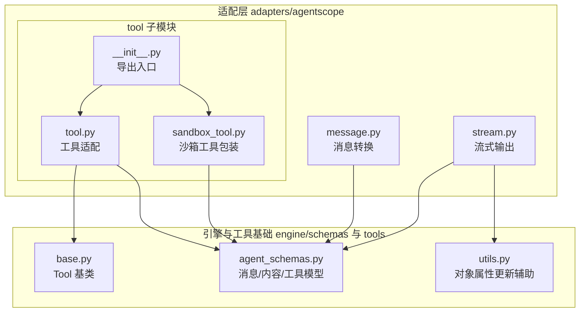
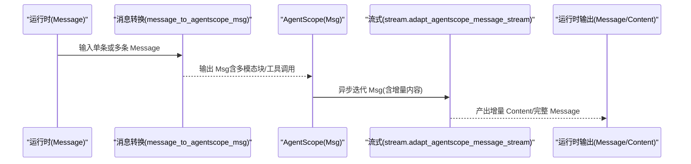
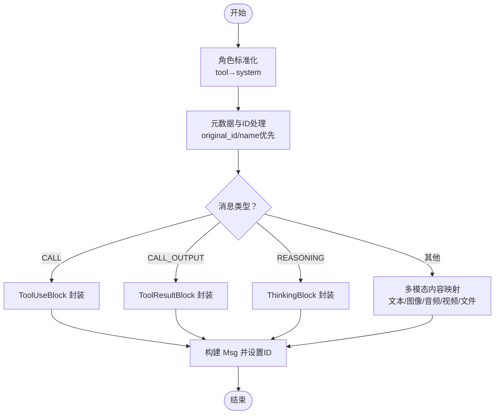
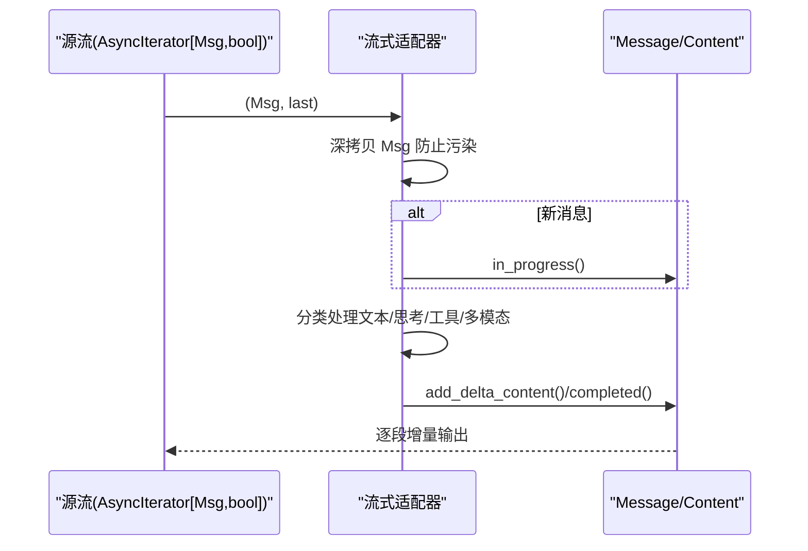
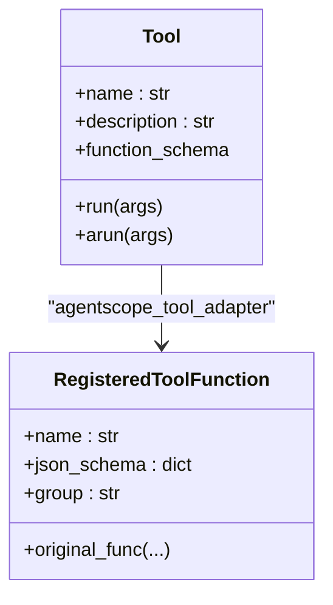
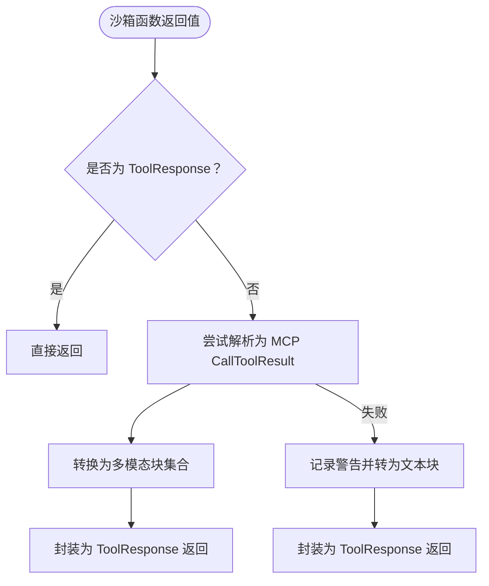
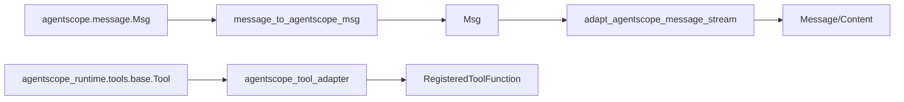

# AgentScope适配器

<cite>
**本文引用的文件**
- [message.py](file://src/agentscope_runtime/adapters/agentscope/message.py)
- [stream.py](file://src/agentscope_runtime/adapters/agentscope/stream.py)
- [tool.py](file://src/agentscope_runtime/adapters/agentscope/tool/tool.py)
- [sandbox_tool.py](file://src/agentscope_runtime/adapters/agentscope/tool/sandbox_tool.py)
- [__init__.py](file://src/agentscope_runtime/adapters/agentscope/tool/__init__.py)
- [agent_schemas.py](file://src/agentscope_runtime/engine/schemas/agent_schemas.py)
- [base.py](file://src/agentscope_runtime/tools/base.py)
- [utils.py](file://src/agentscope_runtime/adapters/utils.py)
- [test_agentscope_tool_adapter.py](file://tests/tools/test_agentscope_tool_adapter.py)
</cite>

## 目录
1. [简介](#简介)
2. [项目结构](#项目结构)
3. [核心组件](#核心组件)
4. [架构总览](#架构总览)
5. [组件详解](#组件详解)
6. [依赖关系分析](#依赖关系分析)
7. [性能考量](#性能考量)
8. [故障排查指南](#故障排查指南)
9. [结论](#结论)
10. [附录：集成与使用示例](#附录集成与使用示例)

## 简介
本文件面向需要在 AgentScope 框架中使用 agentscope-runtime 工具链的开发者，系统化阐述 AgentScope 适配器的设计与实现，重点覆盖：
- 消息转换机制：从 AgentScope 运行时的 Message 到 AgentScope 的 Msg 的双向转换，以及多模态内容（文本、图像、音频、视频、文件）的处理与工具调用适配。
- 角色与元数据：tool 到 system 的角色转换、原始 ID 与名称的保留、元数据透传与 ID 管理。
- 流式传输与 SSE：基于异步迭代器的流式输出，增量内容拼接、推理消息与普通消息的区分、工具调用的增量更新。
- 工具调用适配：将 agentscope-runtime 的 Tool 包装为 AgentScope 可识别的 RegisteredToolFunction，并支持沙箱工具结果的统一转换。
- 错误处理策略：输入校验失败、执行异常、结果格式化异常的兜底返回。

## 项目结构
AgentScope 适配器位于 adapters/agentscope 目录下，围绕消息转换、流式输出、工具适配三个维度组织代码；同时依赖运行时的通用消息模型与工具基类。

图表来源
- [message.py:1-394](file://src/agentscope_runtime/adapters/agentscope/message.py#L1-L394)
- [stream.py:1-684](file://src/agentscope_runtime/adapters/agentscope/stream.py#L1-L684)
- [tool.py:1-232](file://src/agentscope_runtime/adapters/agentscope/tool/tool.py#L1-L232)
- [sandbox_tool.py:1-70](file://src/agentscope_runtime/adapters/agentscope/tool/sandbox_tool.py#L1-L70)
- [__init__.py:1-10](file://src/agentscope_runtime/adapters/agentscope/tool/__init__.py#L1-L10)
- [agent_schemas.py:1-800](file://src/agentscope_runtime/engine/schemas/agent_schemas.py#L1-L800)
- [base.py:1-265](file://src/agentscope_runtime/tools/base.py#L1-L265)
- [utils.py:1-7](file://src/agentscope_runtime/adapters/utils.py#L1-L7)

章节来源
- [message.py:1-394](file://src/agentscope_runtime/adapters/agentscope/message.py#L1-L394)
- [stream.py:1-684](file://src/agentscope_runtime/adapters/agentscope/stream.py#L1-L684)
- [tool.py:1-232](file://src/agentscope_runtime/adapters/agentscope/tool/tool.py#L1-L232)
- [sandbox_tool.py:1-70](file://src/agentscope_runtime/adapters/agentscope/tool/sandbox_tool.py#L1-L70)
- [__init__.py:1-10](file://src/agentscope_runtime/adapters/agentscope/tool/__init__.py#L1-L10)
- [agent_schemas.py:1-800](file://src/agentscope_runtime/engine/schemas/agent_schemas.py#L1-L800)
- [base.py:1-265](file://src/agentscope_runtime/tools/base.py#L1-L265)
- [utils.py:1-7](file://src/agentscope_runtime/adapters/utils.py#L1-L7)

## 核心组件
- 消息转换器：将运行时 Message 转换为 AgentScope Msg，支持多模态块、工具调用/结果、推理块、角色与元数据映射。
- 流式适配器：将 AgentScope Msg 的增量内容流式转换为运行时 Message/Content，支持文本、图像、音频、视频、文件等增量拼接。
- 工具适配器：将 agentscope-runtime 的 Tool 包装为 AgentScope 的 RegisteredToolFunction，自动进行输入校验、执行与结果格式化。
- 沙箱工具包装器：确保沙箱工具返回统一的 ToolResponse，必要时将 MCP 结果转换为多模态块集合。

章节来源
- [message.py:53-394](file://src/agentscope_runtime/adapters/agentscope/message.py#L53-L394)
- [stream.py:33-684](file://src/agentscope_runtime/adapters/agentscope/stream.py#L33-L684)
- [tool.py:17-232](file://src/agentscope_runtime/adapters/agentscope/tool/tool.py#L17-L232)
- [sandbox_tool.py:15-70](file://src/agentscope_runtime/adapters/agentscope/tool/sandbox_tool.py#L15-L70)

## 架构总览
AgentScope 适配器通过“消息转换 + 流式输出 + 工具适配”三件套，打通 agentscope-runtime 与 AgentScope 生态：

图表来源
- [message.py:53-394](file://src/agentscope_runtime/adapters/agentscope/message.py#L53-L394)
- [stream.py:33-684](file://src/agentscope_runtime/adapters/agentscope/stream.py#L33-L684)
- [agent_schemas.py:480-734](file://src/agentscope_runtime/engine/schemas/agent_schemas.py#L480-L734)

## 组件详解

### 消息转换：Message → Msg（双向要点）
- 角色映射：当运行时消息角色为 tool 时，转换为 system，避免 AgentScope 不支持 tool 角色。
- 元数据与 ID：优先使用 metadata 中的 original_id/original_name，否则回退到消息原始 id/name；最终设置到 Msg.id 与 Msg.name。
- 多模态内容：
  - 文本/数据：字符串直接转为 TextBlock；非字符串尝试 JSON 序列化后封装。
  - 图像/音频/视频/文件：支持 dataURL 与 URL 两种来源；音频还支持解析扩展名构造 dataURL。
- 工具调用/结果：
  - CALL 类型：提取 arguments，封装为 ToolUseBlock；call_id 来自 content[0].data。
  - CALL_OUTPUT 类型：提取 output，优先按列表/字典尝试 MCP CallToolResult 转换为多模态块，否则回退为原始输出字符串。
- 推理消息：REASONING 类型转换为 ThinkingBlock。
- 批量消息分组：按 original_id 合并多个片段，形成完整 Msg。

图表来源
- [message.py:82-394](file://src/agentscope_runtime/adapters/agentscope/message.py#L82-L394)

章节来源
- [message.py:53-394](file://src/agentscope_runtime/adapters/agentscope/message.py#L53-L394)

### 流式传输：Msg → 运行时增量内容
- 增量拼接：对文本、图像、音频、视频、文件等增量内容进行拼接与去重（本地截断记忆），仅输出有效增量。
- 推理与普通消息分离：分别维护独立的 reasoning_message 与 message，避免混流。
- 工具调用/结果：
  - 工具调用：根据工具类型（plugin/mcp）选择对应消息体类，增量更新 arguments。
  - 工具结果：根据原始调用消息类型决定输出消息体类，增量更新 output。
- 完整性标记：在 last 或工具开始时，发出 completed 事件，随后重置状态机。
- 自定义转换器：type_converters 支持按块类型注入自定义生成器/异步生成器，实现扩展。

图表来源
- [stream.py:33-684](file://src/agentscope_runtime/adapters/agentscope/stream.py#L33-L684)
- [utils.py:2-7](file://src/agentscope_runtime/adapters/utils.py#L2-L7)

章节来源
- [stream.py:33-684](file://src/agentscope_runtime/adapters/agentscope/stream.py#L33-L684)
- [utils.py:2-7](file://src/agentscope_runtime/adapters/utils.py#L2-L7)

### 工具适配：agentscope-runtime Tool → AgentScope RegisteredToolFunction
- 输入校验：若 Tool 定义了输入类型，则使用 Pydantic 校验参数，失败时返回带错误标记的 ToolResponse。
- 执行策略：优先检测是否为协程函数，若在事件循环内则复用，否则使用线程池包装 asyncio.run；同步工具直接执行。
- 结果格式化：优先将 Pydantic 模型转为 JSON 字符串，否则转为字符串；结果封装为 ToolResponse，metadata 中携带原始结果字典。
- JSON Schema：将 Tool 的 function_schema 转换为 AgentScope 的 function 类型 JSON Schema，便于注册到 Toolkit。

图表来源
- [tool.py:17-232](file://src/agentscope_runtime/adapters/agentscope/tool/tool.py#L17-L232)
- [base.py:34-143](file://src/agentscope_runtime/tools/base.py#L34-L143)

章节来源
- [tool.py:17-232](file://src/agentscope_runtime/adapters/agentscope/tool/tool.py#L17-L232)
- [base.py:34-143](file://src/agentscope_runtime/tools/base.py#L34-L143)

### 沙箱工具包装：统一 ToolResponse 输出
- 目标：确保沙箱工具返回值能被 Toolkit 正确消费，统一为 ToolResponse。
- 行为：
  - 若原函数已返回 ToolResponse，直接透传。
  - 尝试将返回值解析为 MCP 的 CallToolResult，再转换为 AgentScope 多模态块集合；失败则回退为文本块。
  - 记录警告日志并兜底返回文本块，保证稳定性。

图表来源
- [sandbox_tool.py:15-70](file://src/agentscope_runtime/adapters/agentscope/tool/sandbox_tool.py#L15-L70)

章节来源
- [sandbox_tool.py:15-70](file://src/agentscope_runtime/adapters/agentscope/tool/sandbox_tool.py#L15-L70)

### 消息类型与内容模型（参考）
- 消息类型：MESSAGE、FUNCTION_CALL、FUNCTION_CALL_OUTPUT、PLUGIN_CALL、PLUGIN_CALL_OUTPUT、COMPONENT_CALL、COMPONENT_CALL_OUTPUT、MCP_LIST_TOOLS、MCP_APPROVAL_REQUEST、MCP_TOOL_CALL、MCP_APPROVAL_RESPONSE、MCP_TOOL_CALL_OUTPUT、REASONING、HEARTBEAT、ERROR、A2UI_RESPONSE、A2UI_ACTION。
- 内容类型：TEXT、DATA、IMAGE、AUDIO、FILE、REFUSAL、VIDEO。
- 关键模型：Message、Content、TextContent、ImageContent、AudioContent、VideoContent、FileContent、DataContent、FunctionCall、FunctionCallOutput、McpCall、McpCallOutput 等。

章节来源
- [agent_schemas.py:18-510](file://src/agentscope_runtime/engine/schemas/agent_schemas.py#L18-L510)

## 依赖关系分析
- 适配器与引擎模型：
  - message.py 依赖运行时消息模型（Message、MessageType）与 AgentScope 的 Msg/多模态块类型。
  - stream.py 依赖运行时消息模型（Message、Content、各子类）与工具调用/输出模型。
- 工具适配：
  - tool.py 依赖 agentscope-runtime 的 Tool 基类与 AgentScope 的 Toolkit/RegisteredToolFunction。
  - sandbox_tool.py 依赖 MCP 的 CallToolResult 与 AgentScope 的 ToolResponse/MCPClientBase。
- 辅助工具：
  - utils.py 提供对象属性更新能力，用于在流式过程中透传 metadata/usage。

图表来源
- [message.py:12-29](file://src/agentscope_runtime/adapters/agentscope/message.py#L12-L29)
- [stream.py:14-28](file://src/agentscope_runtime/adapters/agentscope/stream.py#L14-L28)
- [tool.py:14-16](file://src/agentscope_runtime/adapters/agentscope/tool/tool.py#L14-L16)
- [sandbox_tool.py:6-9](file://src/agentscope_runtime/adapters/agentscope/tool/sandbox_tool.py#L6-L9)

章节来源
- [message.py:12-29](file://src/agentscope_runtime/adapters/agentscope/message.py#L12-L29)
- [stream.py:14-28](file://src/agentscope_runtime/adapters/agentscope/stream.py#L14-L28)
- [tool.py:14-16](file://src/agentscope_runtime/adapters/agentscope/tool/tool.py#L14-L16)
- [sandbox_tool.py:6-9](file://src/agentscope_runtime/adapters/agentscope/tool/sandbox_tool.py#L6-L9)

## 性能考量
- 流式处理：
  - 使用异步迭代器逐段输出，降低内存峰值；通过本地截断记忆避免重复增量。
  - 工具调用/结果采用增量更新，减少序列化开销。
- 对象深拷贝：
  - 在流式适配器中对 Msg 进行深拷贝，避免影响上游消息对象，但需注意额外的 CPU/内存消耗。
- 执行策略：
  - 工具执行在无事件循环时使用线程池包装 asyncio.run，避免阻塞主线程；建议在已有事件循环环境中尽量复用。

[本节为通用指导，无需列出章节来源]

## 故障排查指南
- 输入校验失败：
  - 现象：ToolResponse.content 包含错误提示且 metadata.error 为真。
  - 处理：检查 Tool 的输入类型定义与传入参数结构。
- 执行异常：
  - 现象：ToolResponse.content 包含执行错误提示且 metadata.error 为真。
  - 处理：捕获工具内部异常，确保返回稳定的 ToolResponse。
- 结果格式化异常：
  - 现象：ToolResponse.content 包含格式化错误提示。
  - 处理：确保工具返回值可被序列化或具备字符串表示。
- 沙箱工具返回值不符合规范：
  - 现象：日志出现警告，最终回退为文本块。
  - 处理：遵循 MCP CallToolResult 规范或直接返回 ToolResponse。

章节来源
- [tool.py:59-143](file://src/agentscope_runtime/adapters/agentscope/tool/tool.py#L59-L143)
- [sandbox_tool.py:38-67](file://src/agentscope_runtime/adapters/agentscope/tool/sandbox_tool.py#L38-L67)

## 结论
AgentScope 适配器通过严谨的消息转换、稳健的流式输出与完善的工具适配，实现了 agentscope-runtime 与 AgentScope 的无缝对接。其设计兼顾多模态支持、工具调用兼容与错误兜底，适合在复杂对话与工具编排场景中稳定运行。

[本节为总结性内容，无需列出章节来源]

## 附录：集成与使用示例

### 示例一：将 agentscope-runtime 工具适配为 AgentScope 工具
- 目标：将任意 Tool 包装为 AgentScope 的 RegisteredToolFunction，并加入 Toolkit。
- 关键点：
  - 使用 agentscope_tool_adapter 对 Tool 进行包装。
  - 可选地提供 name/description 覆盖。
  - 通过 agentscope_toolkit_adapter 快速批量包装并加入 Toolkit。

章节来源
- [tool.py:17-232](file://src/agentscope_runtime/adapters/agentscope/tool/tool.py#L17-L232)
- [test_agentscope_tool_adapter.py:39-95](file://tests/tools/test_agentscope_tool_adapter.py#L39-L95)

### 示例二：在 AgentScope 中执行工具
- 目标：通过 Toolkit 调用已注册的工具，验证输入校验与结果格式化。
- 关键点：
  - 使用 Toolkit.get_json_schemas() 获取 AgentScope 兼容的 JSON Schema。
  - 通过 Toolkit.call_tool_function 发起工具调用，异步迭代响应。

章节来源
- [test_agentscope_tool_adapter.py:164-194](file://tests/tools/test_agentscope_tool_adapter.py#L164-L194)
- [test_agentscope_tool_adapter.py:196-244](file://tests/tools/test_agentscope_tool_adapter.py#L196-L244)

### 示例三：沙箱工具统一输出
- 目标：确保沙箱工具返回值能被 Toolkit 正确消费。
- 关键点：
  - 使用 sandbox_tool_adapter 包装原函数。
  - 若返回值符合 MCP 规范，自动转换为多模态块集合；否则回退为文本块。

章节来源
- [sandbox_tool.py:15-70](file://src/agentscope_runtime/adapters/agentscope/tool/sandbox_tool.py#L15-L70)

### 示例四：消息转换与流式输出
- 目标：将运行时 Message 转换为 AgentScope Msg，并将其流式输出为运行时增量内容。
- 关键点：
  - 使用 message_to_agentscope_msg 完成转换。
  - 使用 adapt_agentscope_message_stream 进行增量输出，支持自定义转换器。

章节来源
- [message.py:53-394](file://src/agentscope_runtime/adapters/agentscope/message.py#L53-L394)
- [stream.py:33-684](file://src/agentscope_runtime/adapters/agentscope/stream.py#L33-L684)