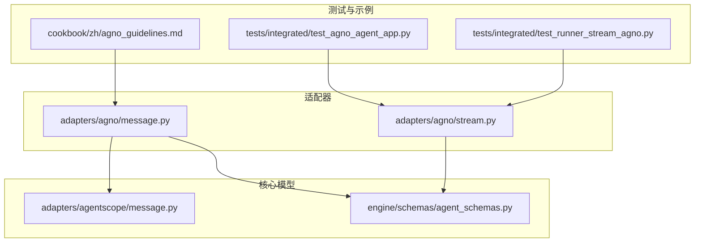
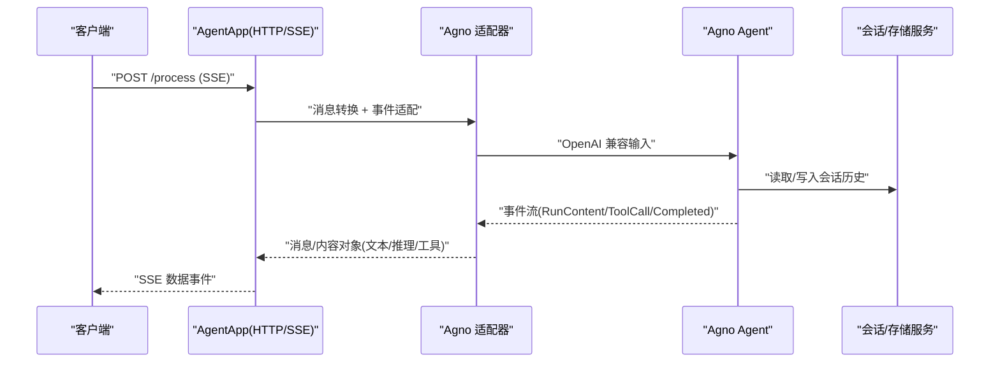
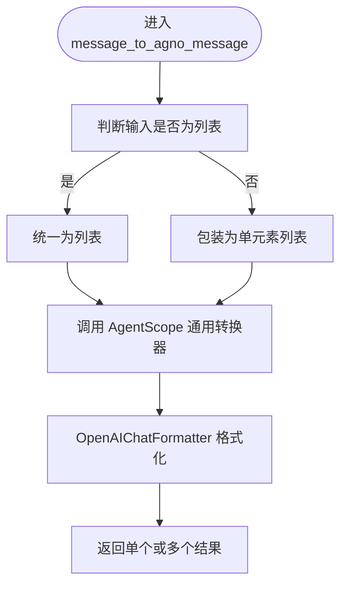
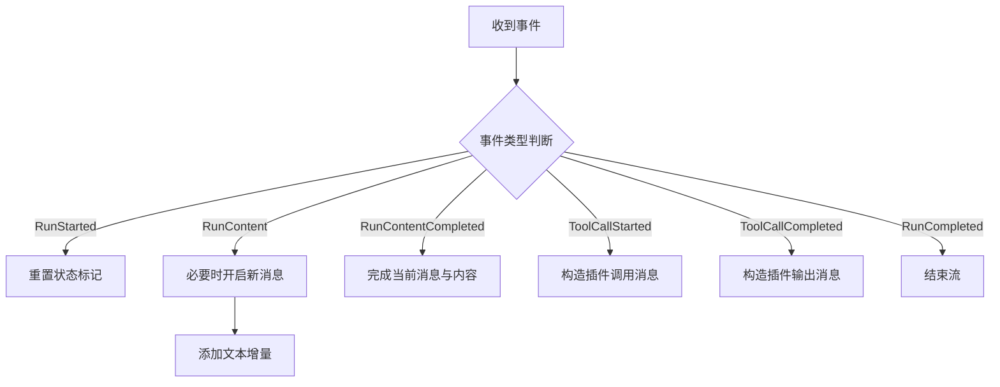
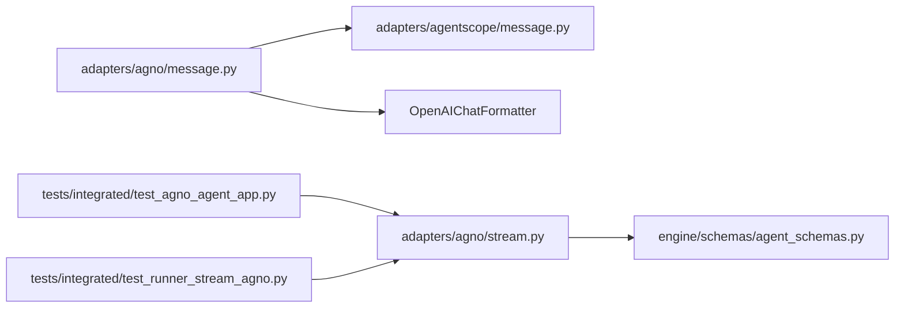
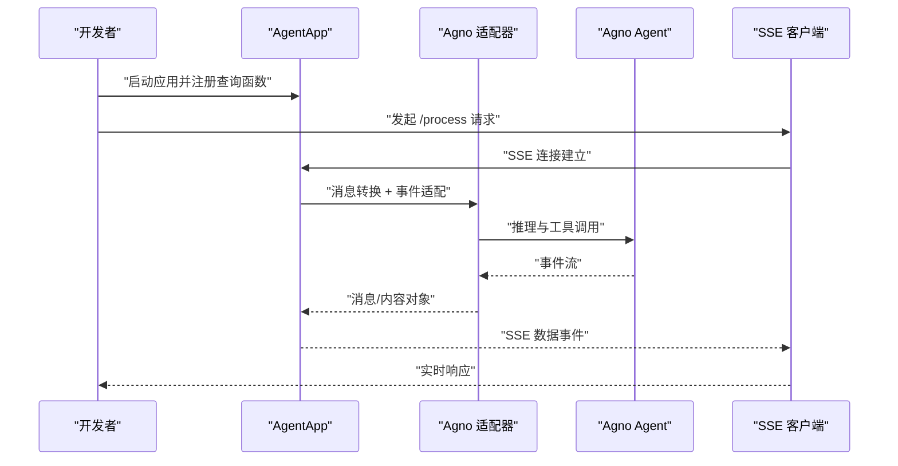

# Agno适配器

<cite>
**本文引用的文件**
- [message.py](file://src/agentscope_runtime/adapters/agno/message.py)
- [stream.py](file://src/agentscope_runtime/adapters/agno/stream.py)
- [message.py](file://src/agentscope_runtime/adapters/agentscope/message.py)
- [agent_schemas.py](file://src/agentscope_runtime/engine/schemas/agent_schemas.py)
- [test_agno_agent_app.py](file://tests/integrated/test_agno_agent_app.py)
- [test_runner_stream_agno.py](file://tests/integrated/test_runner_stream_agno.py)
- [agno_guidelines.md](file://cookbook/zh/agno_guidelines.md)
</cite>

## 目录
1. [简介](#简介)
2. [项目结构](#项目结构)
3. [核心组件](#核心组件)
4. [架构总览](#架构总览)
5. [组件详解](#组件详解)
6. [依赖关系分析](#依赖关系分析)
7. [性能考量](#性能考量)
8. [故障排查指南](#故障排查指南)
9. [结论](#结论)
10. [附录](#附录)

## 简介
本技术文档面向在 AgentScope Runtime 中集成 Agno 框架的开发者，系统性阐述 Agno 适配器的消息转换机制、会话管理与交互模式适配、消息格式标准化、参数映射与响应处理、流式传输与实时通信协议、状态管理、Agno 特定数据结构处理、回调机制与异常处理策略，并提供完整的集成示例与配置说明。读者无需深入底层即可理解并正确使用 Agno 适配器。

## 项目结构
Agno 适配器位于 adapters/agno 目录下，核心文件包括消息转换与流式事件适配两个模块；配套的 AgentScope 消息转换模块用于统一消息格式；测试用例覆盖端到端流式交互与兼容模式；Cookbook 提供中文集成指南与示例。

**图表来源**
- [message.py:1-40](file://src/agentscope_runtime/adapters/agno/message.py#L1-L40)
- [stream.py:1-124](file://src/agentscope_runtime/adapters/agno/stream.py#L1-L124)
- [message.py:1-394](file://src/agentscope_runtime/adapters/agentscope/message.py#L1-L394)
- [agent_schemas.py:1-200](file://src/agentscope_runtime/engine/schemas/agent_schemas.py#L1-L200)
- [test_agno_agent_app.py:1-248](file://tests/integrated/test_agno_agent_app.py#L1-L248)
- [test_runner_stream_agno.py:1-206](file://tests/integrated/test_runner_stream_agno.py#L1-L206)
- [agno_guidelines.md:1-172](file://cookbook/zh/agno_guidelines.md#L1-L172)

**章节来源**
- [message.py:1-40](file://src/agentscope_runtime/adapters/agno/message.py#L1-L40)
- [stream.py:1-124](file://src/agentscope_runtime/adapters/agno/stream.py#L1-L124)
- [message.py:1-394](file://src/agentscope_runtime/adapters/agentscope/message.py#L1-L394)
- [agent_schemas.py:1-200](file://src/agentscope_runtime/engine/schemas/agent_schemas.py#L1-L200)
- [test_agno_agent_app.py:1-248](file://tests/integrated/test_agno_agent_app.py#L1-L248)
- [test_runner_stream_agno.py:1-206](file://tests/integrated/test_runner_stream_agno.py#L1-L206)
- [agno_guidelines.md:1-172](file://cookbook/zh/agno_guidelines.md#L1-L172)

## 核心组件
- 消息转换器：将 AgentScope Runtime 的 Message/Content 结构转换为 OpenAI 兼容格式，供 Agno Agent 使用。
- 流式事件适配器：将 Agno Agent 的运行事件流（内容增量、工具调用、完成等）转换为 AgentScope 的消息/内容对象，支持多轮与工具调用的分片输出。
- AgentScope 消息转换器：作为通用桥接层，负责将统一的 Message/Content 转换为 AgentScope 原生 Msg，支撑多模态与工具调用的标准化。
- 测试与示例：覆盖 /process SSE 流式接口、OpenAI 兼容模式、多轮会话记忆、工具调用与输出等场景。

**章节来源**
- [message.py:10-39](file://src/agentscope_runtime/adapters/agno/message.py#L10-L39)
- [stream.py:32-124](file://src/agentscope_runtime/adapters/agno/stream.py#L32-L124)
- [message.py:53-394](file://src/agentscope_runtime/adapters/agentscope/message.py#L53-L394)
- [agent_schemas.py:18-78](file://src/agentscope_runtime/engine/schemas/agent_schemas.py#L18-L78)

## 架构总览
Agno 适配器通过“消息转换 + 事件流适配”的双通道工作：
- 输入侧：将 AgentScope 的统一消息结构转换为 OpenAI 兼容格式，交由 Agno Agent 执行推理与工具调用。
- 输出侧：将 Agno Agent 的事件流转换为 AgentScope 的消息/内容对象，按类型分发（文本、推理、工具调用、工具输出），并维护会话状态与多轮上下文。

**图表来源**
- [test_agno_agent_app.py:92-151](file://tests/integrated/test_agno_agent_app.py#L92-L151)
- [stream.py:32-124](file://src/agentscope_runtime/adapters/agno/stream.py#L32-L124)
- [message.py:10-39](file://src/agentscope_runtime/adapters/agno/message.py#L10-L39)

## 组件详解

### 消息转换模块（Agno）
职责：将 AgentScope Runtime 的 Message/Content 转换为 OpenAI 兼容格式，以便 Agno Agent 使用。支持单条或列表输入，可注入自定义类型转换器。

关键点：
- 输入：单个 Message 或消息列表，包含角色、类型、内容块等。
- 转换链路：先经 AgentScope 通用转换器生成 Msg，再由 OpenAIChatFormatter 格式化为 OpenAI 兼容结构。
- 输出：单个字典或字典列表，对应 Agno Agent 的输入格式。

**图表来源**
- [message.py:10-39](file://src/agentscope_runtime/adapters/agno/message.py#L10-L39)
- [message.py:53-394](file://src/agentscope_runtime/adapters/agentscope/message.py#L53-L394)

**章节来源**
- [message.py:10-39](file://src/agentscope_runtime/adapters/agno/message.py#L10-L39)

### 流式事件适配模块（Agno）
职责：将 Agno Agent 的运行事件流转换为 AgentScope 的消息/内容对象，支持文本增量、推理内容、工具调用与工具输出的分片推送，并维护消息边界与状态切换。

关键点：
- 事件类型识别：RunStarted/RunContent/RunContentCompleted/ToolCallStarted/ToolCallCompleted/RunCompleted。
- 类型映射：推理内容映射为推理消息，其余映射为普通消息；工具调用与输出分别映射为插件调用与插件输出消息。
- 状态管理：通过 should_start_new_message 控制新消息的开启；mb/mb_type/cb 分别管理消息构建器、消息类型与内容构建器。
- 完成信号：RunCompleted 作为结束标志；RunContentCompleted 触发当前消息与内容的完成。

**图表来源**
- [stream.py:32-124](file://src/agentscope_runtime/adapters/agno/stream.py#L32-L124)

**章节来源**
- [stream.py:32-124](file://src/agentscope_runtime/adapters/agno/stream.py#L32-L124)

### AgentScope 消息转换（通用桥接）
职责：将统一的 Message/Content 转换为 AgentScope 原生 Msg，支持多模态（文本、图像、音频、视频、文件）与工具调用/输出的标准化。

关键点：
- 工具调用：从内容块中提取 arguments，封装为 ToolUseBlock。
- 工具输出：从内容块中提取 output，尝试解析为多模态块或回退为原始字符串。
- 推理内容：映射为 ThinkingBlock。
- 多模态：对 data:URL、URL、Base64 等多种来源进行统一处理。
- 分组聚合：根据 original_id 对消息进行分组合并，保持多轮一致性。

**章节来源**
- [message.py:53-394](file://src/agentscope_runtime/adapters/agentscope/message.py#L53-L394)

### 数据模型与状态
- 消息类型：MESSAGE、FUNCTION_CALL、FUNCTION_CALL_OUTPUT、PLUGIN_CALL、PLUGIN_CALL_OUTPUT、REASONING、ERROR 等。
- 内容类型：TEXT、DATA、IMAGE、AUDIO、FILE、VIDEO、REFUSAL 等。
- 运行状态：Created、InProgress、Completed、Canceled、Failed、Rejected、Unknown、Queued、Incomplete 等。
- 工具调用与输出：FunctionCall、FunctionCallOutput、McpCall、McpCallOutput 等。

**章节来源**
- [agent_schemas.py:18-78](file://src/agentscope_runtime/engine/schemas/agent_schemas.py#L18-L78)
- [agent_schemas.py:122-156](file://src/agentscope_runtime/engine/schemas/agent_schemas.py#L122-L156)
- [agent_schemas.py:158-200](file://src/agentscope_runtime/engine/schemas/agent_schemas.py#L158-L200)

### 会话管理与交互模式
- 会话标识：通过 AgentRequest.session_id 在 AgentApp 中传递给 Agno Agent，实现跨轮次上下文记忆。
- 记忆存储：示例中使用 InMemoryDb 存储会话历史，支持 add_history_to_context 将历史注入上下文。
- 交互模式：支持标准 /process SSE 流式接口与 OpenAI 兼容模式，便于前端与 SDK 适配。

**章节来源**
- [test_agno_agent_app.py:40-65](file://tests/integrated/test_agno_agent_app.py#L40-L65)
- [agno_guidelines.md:67-88](file://cookbook/zh/agno_guidelines.md#L67-L88)

### 回调机制与异常处理
- 事件回调：适配器通过异步迭代器逐事件推送，上层可按消息类型与状态进行处理。
- 异常处理：工具调用输出序列化失败时回退为字符串；多模态解析失败时回退为原始内容。
- 完成信号：RunCompleted 作为终止信号，避免后续事件继续推送。

**章节来源**
- [stream.py:103-124](file://src/agentscope_runtime/adapters/agno/stream.py#L103-L124)

## 依赖关系分析
- Agno 消息转换依赖 AgentScope 通用消息转换与 OpenAIChatFormatter。
- Agno 流式适配依赖 AgentScope 的消息/内容模型与 ResponseBuilder。
- 测试用例依赖 Agno Agent、DashScope 模型与 InMemoryDb，验证 SSE 与兼容模式。

**图表来源**
- [message.py:1-40](file://src/agentscope_runtime/adapters/agno/message.py#L1-L40)
- [message.py:1-394](file://src/agentscope_runtime/adapters/agentscope/message.py#L1-L394)
- [stream.py:1-124](file://src/agentscope_runtime/adapters/agno/stream.py#L1-L124)
- [agent_schemas.py:1-200](file://src/agentscope_runtime/engine/schemas/agent_schemas.py#L1-L200)
- [test_agno_agent_app.py:1-248](file://tests/integrated/test_agno_agent_app.py#L1-L248)
- [test_runner_stream_agno.py:1-206](file://tests/integrated/test_runner_stream_agno.py#L1-L206)

**章节来源**
- [message.py:1-40](file://src/agentscope_runtime/adapters/agno/message.py#L1-L40)
- [stream.py:1-124](file://src/agentscope_runtime/adapters/agno/stream.py#L1-L124)
- [message.py:1-394](file://src/agentscope_runtime/adapters/agentscope/message.py#L1-L394)
- [agent_schemas.py:1-200](file://src/agentscope_runtime/engine/schemas/agent_schemas.py#L1-L200)
- [test_agno_agent_app.py:1-248](file://tests/integrated/test_agno_agent_app.py#L1-L248)
- [test_runner_stream_agno.py:1-206](file://tests/integrated/test_runner_stream_agno.py#L1-L206)

## 性能考量
- 流式传输：采用 SSE 与异步迭代器，降低首包延迟，提升实时性。
- 事件粒度：按内容增量与工具调用阶段推送，减少一次性大对象的序列化开销。
- 序列化回退：在复杂输出无法解析时采用字符串回退，保证稳定性与吞吐。
- 多模态处理：对 data:URL 与 Base64 进行预处理，避免重复解码与转换。

[本节为通用指导，不直接分析具体文件]

## 故障排查指南
- SSE 未返回：确认 /process 接口 Content-Type 为 text/event-stream，检查服务端是否正确开启流式。
- OpenAI 兼容模式无效：确认兼容模式路径与模型名称配置正确，检查代理头与网络连通性。
- 工具调用未触发：确认工具注册与权限配置，检查工具参数 JSON 是否有效。
- 多轮会话异常：确认 session_id 一致且 InMemoryDb 正常初始化，检查 add_history_to_context 配置。
- 输出乱码或缺失：检查内容块的 data/文本编码，必要时启用字符串回退逻辑。

**章节来源**
- [test_agno_agent_app.py:92-151](file://tests/integrated/test_agno_agent_app.py#L92-L151)
- [test_agno_agent_app.py:170-248](file://tests/integrated/test_agno_agent_app.py#L170-L248)
- [agno_guidelines.md:122-158](file://cookbook/zh/agno_guidelines.md#L122-L158)

## 结论
Agno 适配器通过“消息转换 + 事件流适配”两条主线，实现了 AgentScope Runtime 与 Agno 框架的无缝对接。其设计兼顾了多模态、工具调用、推理内容与会话记忆等复杂场景，配合 SSE 流式输出与 OpenAI 兼容模式，满足实时交互与生态兼容需求。建议在生产环境中结合缓存、超时与重试策略进一步优化稳定性与性能。

[本节为总结性内容，不直接分析具体文件]

## 附录

### 集成示例与配置说明
- 快速开始：参考 Cookbook 中的示例脚本，配置 DashScope 模型与 InMemoryDb，启动 AgentApp 并启用流式输出。
- 环境变量：设置 DASHSCOPE_API_KEY；如需本地部署，确保端口开放与网络可达。
- API 交互：使用 curl 或 OpenAI SDK 调用 /process 与兼容模式端点，验证 SSE 与多轮会话。

**章节来源**
- [agno_guidelines.md:1-172](file://cookbook/zh/agno_guidelines.md#L1-L172)

### 关键流程图（端到端）

**图表来源**
- [test_agno_agent_app.py:92-151](file://tests/integrated/test_agno_agent_app.py#L92-L151)
- [stream.py:32-124](file://src/agentscope_runtime/adapters/agno/stream.py#L32-L124)
- [message.py:10-39](file://src/agentscope_runtime/adapters/agno/message.py#L10-L39)