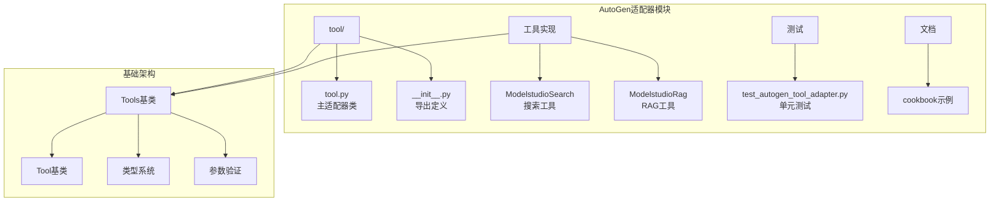
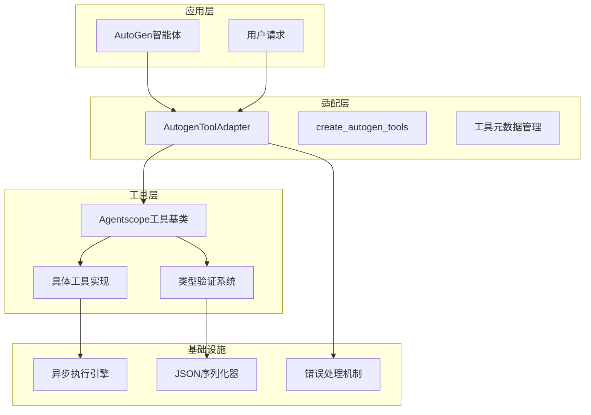
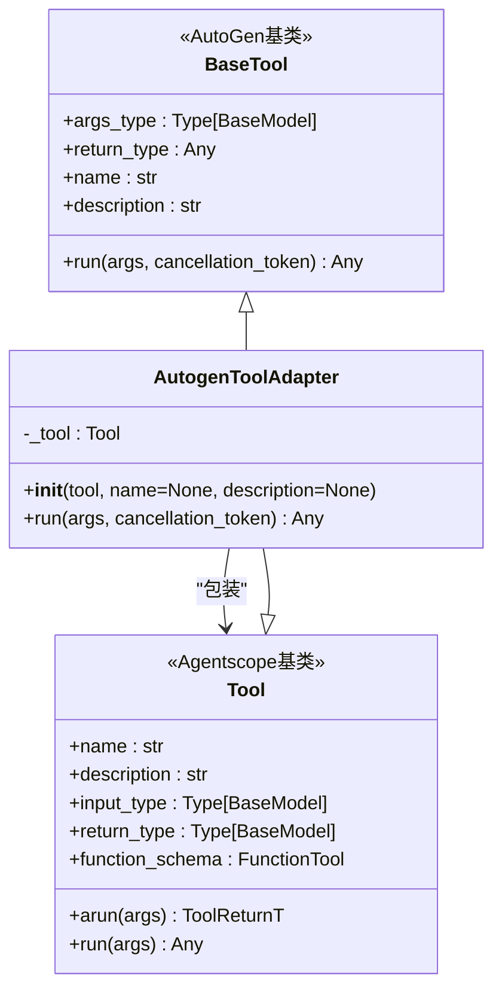
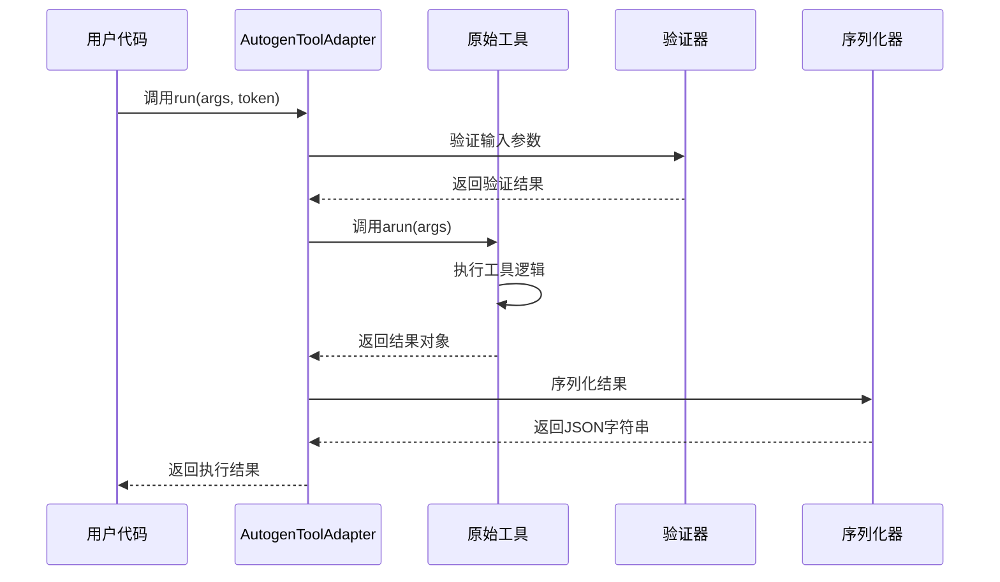
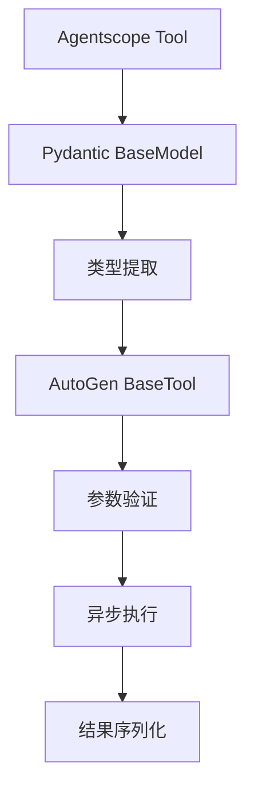
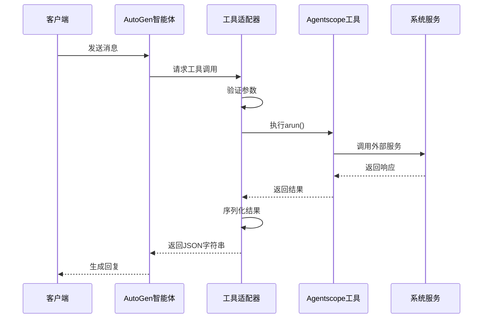
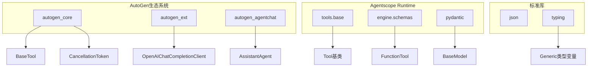
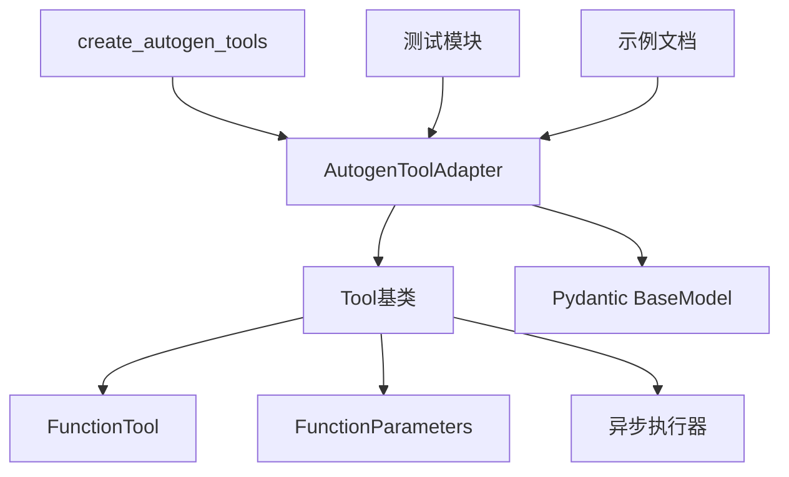

# AutoGen适配器

<cite>
**本文档引用的文件**
- [src/agentscope_runtime/adapters/autogen/tool/tool.py](file://src/agentscope_runtime/adapters/autogen/tool/tool.py)
- [src/agentscope_runtime/adapters/autogen/tool/__init__.py](file://src/agentscope_runtime/adapters/autogen/tool/__init__.py)
- [src/agentscope_runtime/tools/base.py](file://src/agentscope_runtime/tools/base.py)
- [src/agentscope_runtime/tools/searches/modelstudio_search.py](file://src/agentscope_runtime/tools/searches/modelstudio_search.py)
- [src/agentscope_runtime/tools/RAGs/modelstudio_rag.py](file://src/agentscope_runtime/tools/RAGs/modelstudio_rag.py)
- [tests/tools/test_autogen_tool_adapter.py](file://tests/tools/test_autogen_tool_adapter.py)
- [cookbook/zh/tools/tools.md](file://cookbook/zh/tools/tools.md)
</cite>

## 目录
1. [简介](#简介)
2. [项目结构](#项目结构)
3. [核心组件](#核心组件)
4. [架构概览](#架构概览)
5. [详细组件分析](#详细组件分析)
6. [依赖关系分析](#依赖关系分析)
7. [性能考虑](#性能考虑)
8. [故障排除指南](#故障排除指南)
9. [结论](#结论)
10. [附录](#附录)

## 简介

AutoGen适配器是Agentscope Runtime生态系统中的关键组件，负责将Agentscope的工具系统与AutoGen框架进行无缝集成。该适配器的核心目标是提供一个统一的接口，使得Agentscope中开发的各种工具能够被AutoGen智能体直接使用，同时保持类型安全性和异步执行能力。

AutoGen适配器主要解决以下关键问题：
- 工具包装器实现：将Agentscope的Tool基类转换为AutoGen兼容的工具格式
- 参数传递和结果处理：确保工具输入输出的正确序列化和反序列化
- 类型系统兼容：维护Pydantic模型的类型约束和验证
- 异步执行支持：充分利用Agentscope工具的异步特性

## 项目结构

AutoGen适配器位于`src/agentscope_runtime/adapters/autogen/`目录下，采用模块化的组织方式：



**图表来源**
- [src/agentscope_runtime/adapters/autogen/tool/tool.py:1-212](file://src/agentscope_runtime/adapters/autogen/tool/tool.py#L1-L212)
- [src/agentscope_runtime/tools/base.py:1-265](file://src/agentscope_runtime/tools/base.py#L1-L265)

**章节来源**
- [src/agentscope_runtime/adapters/autogen/tool/tool.py:1-212](file://src/agentscope_runtime/adapters/autogen/tool/tool.py#L1-L212)
- [src/agentscope_runtime/adapters/autogen/tool/__init__.py:1-7](file://src/agentscope_runtime/adapters/autogen/tool/__init__.py#L1-L7)

## 核心组件

AutoGen适配器的核心由两个主要组件构成：

### 1. AutogenToolAdapter类

这是适配器的核心实现，负责将Agentscope的Tool转换为AutoGen兼容的工具格式。该类继承自`BaseTool[BaseModel, Any]`，并实现了完整的工具包装功能。

### 2. create_autogen_tools函数

这是一个便捷函数，用于批量创建多个工具适配器实例，简化了多工具场景下的适配过程。

### 3. 工具基类系统

AutoGen适配器依赖于Agentscope的完整工具系统，包括：
- 类型安全的输入输出模型
- 参数验证和序列化
- 异步执行支持

**章节来源**
- [src/agentscope_runtime/adapters/autogen/tool/tool.py:28-138](file://src/agentscope_runtime/adapters/autogen/tool/tool.py#L28-L138)
- [src/agentscope_runtime/tools/base.py:34-127](file://src/agentscope_runtime/tools/base.py#L34-L127)

## 架构概览

AutoGen适配器采用分层架构设计，确保了良好的可扩展性和维护性：



**图表来源**
- [src/agentscope_runtime/adapters/autogen/tool/tool.py:28-138](file://src/agentscope_runtime/adapters/autogen/tool/tool.py#L28-L138)
- [src/agentscope_runtime/tools/base.py:34-127](file://src/agentscope_runtime/tools/base.py#L34-L127)

## 详细组件分析

### AutogenToolAdapter类深度分析

#### 类设计模式

AutogenToolAdapter采用了适配器设计模式，通过继承AutoGen的BaseTool类来实现向后兼容性：



**图表来源**
- [src/agentscope_runtime/adapters/autogen/tool/tool.py:28-138](file://src/agentscope_runtime/adapters/autogen/tool/tool.py#L28-L138)
- [src/agentscope_runtime/tools/base.py:34-127](file://src/agentscope_runtime/tools/base.py#L34-L127)

#### 关键方法实现

##### 初始化过程

初始化过程中，适配器会：
1. 存储原始工具引用
2. 处理名称和描述的覆盖
3. 提取工具的输入输出类型
4. 调用父类构造函数完成初始化

##### 运行方法

运行方法实现了核心的工具执行逻辑：



**图表来源**
- [src/agentscope_runtime/adapters/autogen/tool/tool.py:109-137](file://src/agentscope_runtime/adapters/autogen/tool/tool.py#L109-L137)

**章节来源**
- [src/agentscope_runtime/adapters/autogen/tool/tool.py:83-137](file://src/agentscope_runtime/adapters/autogen/tool/tool.py#L83-L137)

### 工具包装器实现

#### 类型系统集成

AutoGen适配器成功集成了两个不同的类型系统：



**图表来源**
- [src/agentscope_runtime/tools/base.py:144-160](file://src/agentscope_runtime/tools/base.py#L144-L160)
- [src/agentscope_runtime/adapters/autogen/tool/tool.py:104-107](file://src/agentscope_runtime/adapters/autogen/tool/tool.py#L104-L107)

#### 参数传递机制

参数传递过程确保了类型安全和数据完整性：

1. **输入验证**：使用Pydantic模型验证传入参数
2. **类型转换**：自动处理不同类型的参数格式
3. **异步执行**：保持原始工具的异步特性
4. **结果处理**：统一序列化为JSON格式

**章节来源**
- [src/agentscope_runtime/tools/base.py:214-246](file://src/agentscope_runtime/tools/base.py#L214-L246)
- [src/agentscope_runtime/adapters/autogen/tool/tool.py:128-137](file://src/agentscope_runtime/adapters/autogen/tool/tool.py#L128-L137)

### 工具调用流程

#### 完整执行链路



**图表来源**
- [src/agentscope_runtime/adapters/autogen/tool/tool.py:109-137](file://src/agentscope_runtime/adapters/autogen/tool/tool.py#L109-L137)

**章节来源**
- [src/agentscope_runtime/adapters/autogen/tool/tool.py:109-137](file://src/agentscope_runtime/adapters/autogen/tool/tool.py#L109-L137)

## 依赖关系分析

### 外部依赖

AutoGen适配器对外部系统的依赖关系如下：



**图表来源**
- [src/agentscope_runtime/adapters/autogen/tool/tool.py:13-25](file://src/agentscope_runtime/adapters/autogen/tool/tool.py#L13-L25)

### 内部依赖关系

内部模块间的依赖关系体现了清晰的分层架构：



**图表来源**
- [src/agentscope_runtime/adapters/autogen/tool/tool.py:25-26](file://src/agentscope_runtime/adapters/autogen/tool/tool.py#L25-L26)
- [src/agentscope_runtime/tools/base.py:22-25](file://src/agentscope_runtime/tools/base.py#L22-L25)

**章节来源**
- [src/agentscope_runtime/adapters/autogen/tool/tool.py:13-25](file://src/agentscope_runtime/adapters/autogen/tool/tool.py#L13-L25)
- [src/agentscope_runtime/tools/base.py:22-25](file://src/agentscope_runtime/tools/base.py#L22-L25)

## 性能考虑

### 异步执行优化

AutoGen适配器充分利用了Agentscope工具的异步特性，避免了阻塞操作：

- **非阻塞I/O**：工具调用保持异步特性
- **并发处理**：支持多个工具的并发执行
- **内存效率**：避免不必要的数据复制

### 序列化开销

JSON序列化是适配器的主要性能瓶颈：

- **最小化序列化**：只在必要时进行序列化
- **缓存策略**：对频繁使用的工具结果进行缓存
- **流式处理**：支持大型响应的流式传输

### 内存管理

适配器实现了高效的内存管理策略：

- **及时释放**：异步操作完成后立即释放资源
- **垃圾回收**：合理使用Python的垃圾回收机制
- **内存监控**：提供内存使用情况的监控接口

## 故障排除指南

### 常见问题及解决方案

#### 工具导入失败

**问题**：安装autogen-core包时出现导入错误

**解决方案**：
1. 确保已安装autogen-core包
2. 检查Python版本兼容性
3. 验证安装路径的正确性

#### 类型验证错误

**问题**：工具参数验证失败

**解决方案**：
1. 检查输入参数是否符合Pydantic模型定义
2. 验证参数的数据类型和格式
3. 确认必需字段的完整性

#### 异步执行超时

**问题**：工具执行超时或取消

**解决方案**：
1. 检查cancellation_token的状态
2. 调整工具的超时设置
3. 优化工具的执行逻辑

**章节来源**
- [src/agentscope_runtime/adapters/autogen/tool/tool.py:16-21](file://src/agentscope_runtime/adapters/autogen/tool/tool.py#L16-L21)
- [src/agentscope_runtime/tools/base.py:111-127](file://src/agentscope_runtime/tools/base.py#L111-L127)

### 调试技巧

#### 日志记录

建议在开发过程中启用详细的日志记录：

```python
import logging
logging.basicConfig(level=logging.DEBUG)
```

#### 错误处理

实现适当的错误处理机制：

```python
try:
    result = await adapter.run(args, token)
except Exception as e:
    logging.error(f"工具执行失败: {e}")
    # 实现降级策略
```

## 结论

AutoGen适配器成功地将Agentscope的工具系统与AutoGen框架进行了深度集成，提供了以下关键价值：

### 主要成就

1. **无缝集成**：实现了两个不同生态系统的无缝连接
2. **类型安全**：保持了完整的类型系统和验证机制
3. **性能优化**：充分利用异步执行和内存管理
4. **易用性**：提供了简洁的API接口和丰富的示例

### 技术优势

- **模块化设计**：清晰的分层架构便于维护和扩展
- **类型系统**：完整的Pydantic集成确保数据完整性
- **异步支持**：充分利用现代Python的异步特性
- **错误处理**：完善的异常处理和恢复机制

### 未来发展方向

1. **性能优化**：进一步减少序列化开销
2. **监控增强**：添加更详细的性能监控指标
3. **扩展支持**：支持更多类型的AutoGen工具
4. **文档完善**：提供更丰富的使用示例和最佳实践

AutoGen适配器为构建复杂的多智能体应用奠定了坚实的基础，是Agentscope Runtime生态系统中的重要组成部分。

## 附录

### 使用示例

#### 基础工具适配

```python
from agentscope_runtime.adapters.autogen.tool import AutogenToolAdapter
from agentscope_runtime.tools.searches import ModelstudioSearchLite

# 创建搜索工具
search_tool = ModelstudioSearchLite()

# 创建AutoGen工具适配器
autogen_tool = AutogenToolAdapter(search_tool)
```

#### 批量工具创建

```python
from agentscope_runtime.adapters.autogen.tool import create_autogen_tools

# 创建多个工具
tools = [search_tool, rag_tool]
autogen_tools = create_autogen_tools(tools)
```

#### 自定义名称和描述

```python
overrides = {
    "modelstudio_search_pro": "custom_search_tool",
    "modelstudio_RAG": "custom_rag_tool"
}

autogen_tools = create_autogen_tools(tools, 
                                   name_overrides=overrides)
```

**章节来源**
- [cookbook/zh/tools/tools.md:208-245](file://cookbook/zh/tools/tools.md#L208-L245)
- [tests/tools/test_autogen_tool_adapter.py:52-77](file://tests/tools/test_autogen_tool_adapter.py#L52-L77)