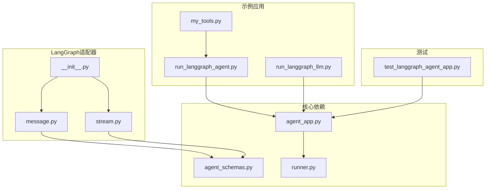
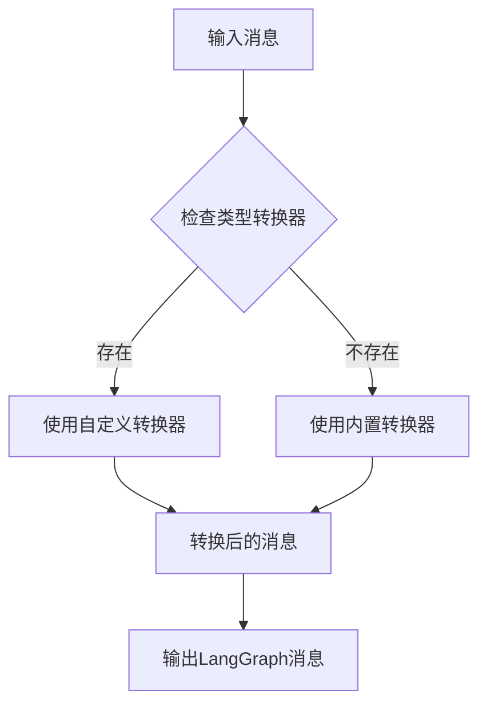
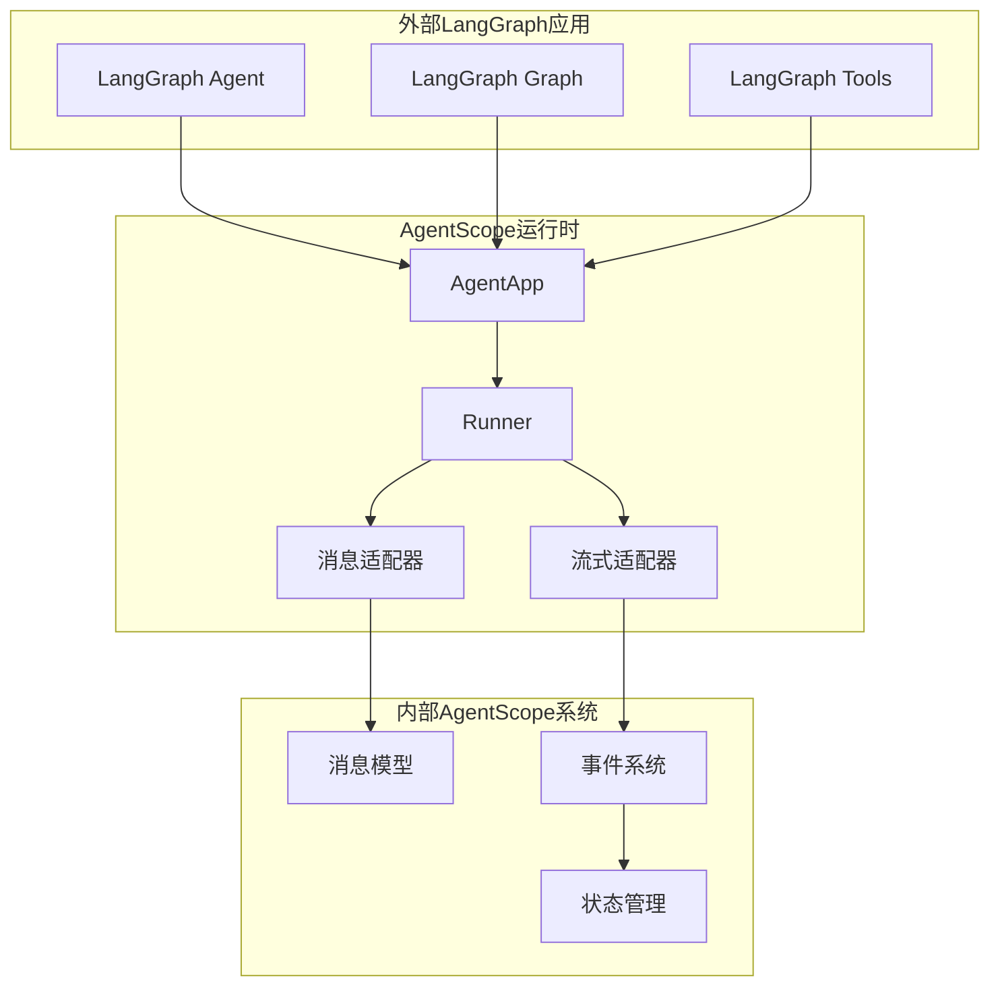
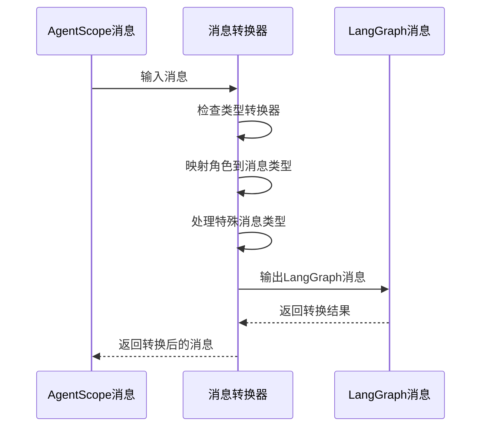
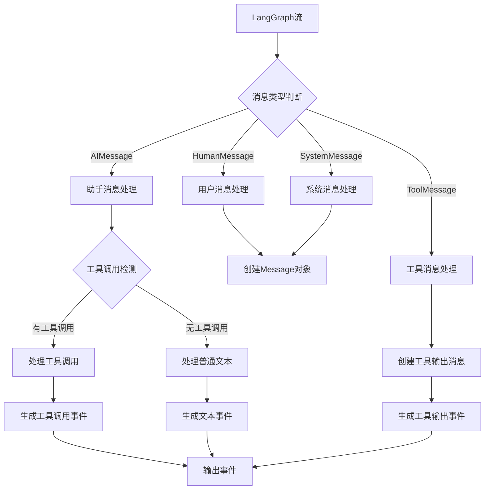
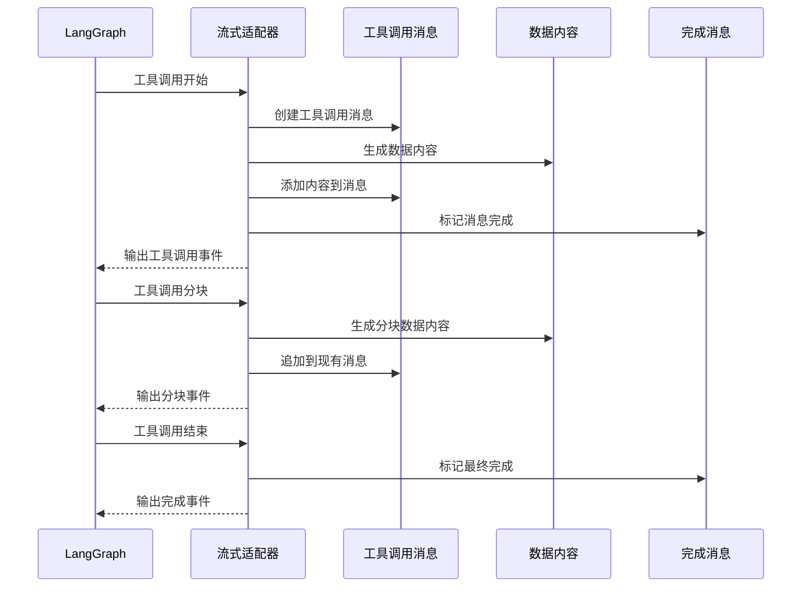
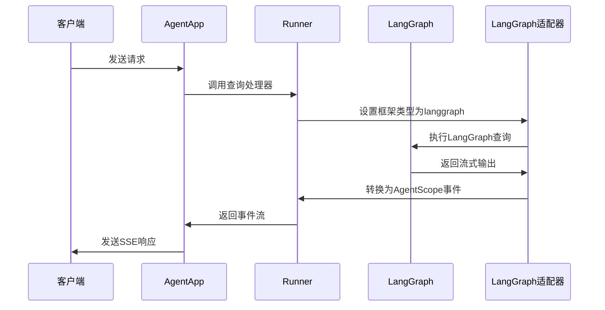
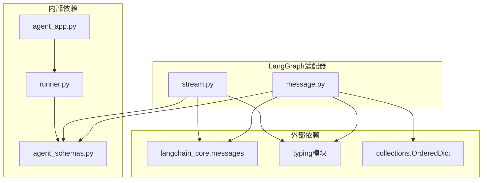
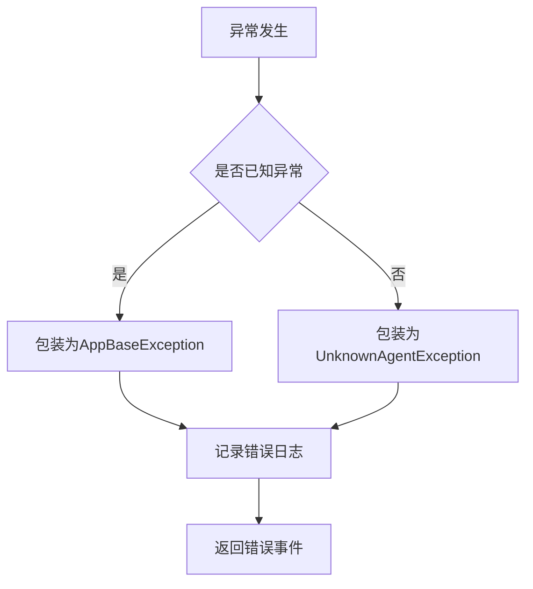

# LangGraph适配器

<cite>
**本文档引用的文件**
- [src/agentscope_runtime/adapters/langgraph/__init__.py](file://src/agentscope_runtime/adapters/langgraph/__init__.py)
- [src/agentscope_runtime/adapters/langgraph/message.py](file://src/agentscope_runtime/adapters/langgraph/message.py)
- [src/agentscope_runtime/adapters/langgraph/stream.py](file://src/agentscope_runtime/adapters/langgraph/stream.py)
- [src/agentscope_runtime/engine/schemas/agent_schemas.py](file://src/agentscope_runtime/engine/schemas/agent_schemas.py)
- [src/agentscope_runtime/engine/app/agent_app.py](file://src/agentscope_runtime/engine/app/agent_app.py)
- [src/agentscope_runtime/engine/runner.py](file://src/agentscope_runtime/engine/runner.py)
- [examples/integrations/langgraph/run_langgraph_agent.py](file://examples/integrations/langgraph/run_langgraph_agent.py)
- [examples/integrations/langgraph/run_langgraph_llm.py](file://examples/integrations/langgraph/run_langgraph_llm.py)
- [examples/integrations/langgraph/my_tools.py](file://examples/integrations/langgraph/my_tools.py)
- [tests/integrated/test_langgraph_agent_app.py](file://tests/integrated/test_langgraph_agent_app.py)
</cite>

## 目录
1. [简介](#简介)
2. [项目结构](#项目结构)
3. [核心组件](#核心组件)
4. [架构概览](#架构概览)
5. [详细组件分析](#详细组件分析)
6. [依赖关系分析](#依赖关系分析)
7. [性能考虑](#性能考虑)
8. [故障排除指南](#故障排除指南)
9. [结论](#结论)
10. [附录](#附录)

## 简介

LangGraph适配器是AgentScope运行时生态系统中的关键组件，负责在LangGraph框架与AgentScope运行时之间进行消息格式转换和流式传输适配。该适配器实现了以下核心功能：

- **消息格式转换**：将AgentScope运行时的消息格式转换为LangGraph兼容的消息类型
- **流式传输适配**：支持LangGraph的异步流式输出转换为AgentScope的标准事件格式
- **状态管理**：处理LangGraph检查点和内存状态的集成
- **工具调用适配**：支持LangGraph工具调用与AgentScope工具系统的无缝集成
- **事件驱动模式**：实现基于事件的异步处理机制

## 项目结构

LangGraph适配器位于`src/agentscope_runtime/adapters/langgraph/`目录下，包含以下核心文件：



**图表来源**
- [src/agentscope_runtime/adapters/langgraph/__init__.py:1-11](file://src/agentscope_runtime/adapters/langgraph/__init__.py#L1-L11)
- [src/agentscope_runtime/adapters/langgraph/message.py:1-163](file://src/agentscope_runtime/adapters/langgraph/message.py#L1-L163)
- [src/agentscope_runtime/adapters/langgraph/stream.py:1-257](file://src/agentscope_runtime/adapters/langgraph/stream.py#L1-L257)

**章节来源**
- [src/agentscope_runtime/adapters/langgraph/__init__.py:1-11](file://src/agentscope_runtime/adapters/langgraph/__init__.py#L1-L11)
- [src/agentscope_runtime/adapters/langgraph/message.py:1-163](file://src/agentscope_runtime/adapters/langgraph/message.py#L1-L163)
- [src/agentscope_runtime/adapters/langgraph/stream.py:1-257](file://src/agentscope_runtime/adapters/langgraph/stream.py#L1-L257)

## 核心组件

### 消息转换器

消息转换器负责将AgentScope运行时的消息格式转换为LangGraph兼容的消息类型。它支持多种消息类型转换：

- **用户消息**：从`user`角色转换为`HumanMessage`
- **助手消息**：从`assistant`角色转换为`AIMessage`
- **系统消息**：从`system`角色转换为`SystemMessage`
- **工具消息**：从`tool`角色转换为`ToolMessage`

### 流式传输适配器

流式传输适配器实现了LangGraph异步流到AgentScope标准事件格式的转换。它处理以下场景：

- **普通文本消息**：直接转换为文本内容事件
- **工具调用**：将工具调用转换为数据内容事件
- **工具输出**：将工具执行结果转换为函数调用输出事件
- **分块消息**：处理LangGraph的工具调用分块传输

### 类型转换器映射

适配器支持自定义类型转换器映射，允许用户为特定消息类型提供自定义转换逻辑：



**图表来源**
- [src/agentscope_runtime/adapters/langgraph/message.py:44-45](file://src/agentscope_runtime/adapters/langgraph/message.py#L44-L45)

**章节来源**
- [src/agentscope_runtime/adapters/langgraph/message.py:23-163](file://src/agentscope_runtime/adapters/langgraph/message.py#L23-L163)
- [src/agentscope_runtime/adapters/langgraph/stream.py:28-257](file://src/agentscope_runtime/adapters/langgraph/stream.py#L28-L257)

## 架构概览

LangGraph适配器在整个AgentScope生态系统中扮演着桥梁角色，连接了不同的AI框架和消息格式：



**图表来源**
- [src/agentscope_runtime/engine/app/agent_app.py:60-943](file://src/agentscope_runtime/engine/app/agent_app.py#L60-L943)
- [src/agentscope_runtime/engine/runner.py:46-356](file://src/agentscope_runtime/engine/runner.py#L46-L356)

## 详细组件分析

### 消息转换组件

消息转换组件实现了双向的消息格式转换，支持单个消息和消息列表的处理：

#### 转换流程



**图表来源**
- [src/agentscope_runtime/adapters/langgraph/message.py:42-135](file://src/agentscope_runtime/adapters/langgraph/message.py#L42-L135)

#### 特殊消息类型处理

消息转换器对以下特殊消息类型进行了专门处理：

| 消息类型 | LangGraph对应类型 | 处理方式 |
|---------|-------------------|----------|
| PLUGIN_CALL | AIMessage | 创建包含tool_calls的AIMessage |
| FUNCTION_CALL | AIMessage | 创建包含tool_calls的AIMessage |
| PLUGIN_CALL_OUTPUT | ToolMessage | 创建ToolMessage并设置tool_call_id |
| FUNCTION_CALL_OUTPUT | ToolMessage | 创建ToolMessage并设置tool_call_id |

**章节来源**
- [src/agentscope_runtime/adapters/langgraph/message.py:61-106](file://src/agentscope_runtime/adapters/langgraph/message.py#L61-L106)

### 流式传输组件

流式传输组件处理LangGraph的异步流输出，并将其转换为AgentScope的标准事件格式：

#### 流式处理流程



**图表来源**
- [src/agentscope_runtime/adapters/langgraph/stream.py:44-257](file://src/agentscope_runtime/adapters/langgraph/stream.py#L44-L257)

#### 工具调用流式处理

工具调用的流式处理是LangGraph适配器的核心特性之一：



**图表来源**
- [src/agentscope_runtime/adapters/langgraph/stream.py:104-143](file://src/agentscope_runtime/adapters/langgraph/stream.py#L104-L143)

**章节来源**
- [src/agentscope_runtime/adapters/langgraph/stream.py:28-257](file://src/agentscope_runtime/adapters/langgraph/stream.py#L28-L257)

### 集成示例分析

#### 基础LangGraph集成

基础LangGraph集成展示了如何将LangGraph代理与AgentScope运行时结合：



**图表来源**
- [examples/integrations/langgraph/run_langgraph_agent.py:59-107](file://examples/integrations/langgraph/run_langgraph_agent.py#L59-L107)

**章节来源**
- [examples/integrations/langgraph/run_langgraph_agent.py:1-172](file://examples/integrations/langgraph/run_langgraph_agent.py#L1-L172)
- [examples/integrations/langgraph/run_langgraph_llm.py:1-118](file://examples/integrations/langgraph/run_langgraph_llm.py#L1-L118)

## 依赖关系分析

LangGraph适配器的依赖关系相对简洁，主要依赖于以下核心模块：



**图表来源**
- [src/agentscope_runtime/adapters/langgraph/message.py:9-25](file://src/agentscope_runtime/adapters/langgraph/message.py#L9-L25)
- [src/agentscope_runtime/adapters/langgraph/stream.py:10-25](file://src/agentscope_runtime/adapters/langgraph/stream.py#L10-L25)

### 关键依赖说明

| 依赖模块 | 用途 | 版本要求 |
|---------|------|----------|
| langchain_core.messages | LangGraph消息类型 | 最新版本 |
| typing | 类型注解支持 | Python 3.8+ |
| collections | 有序字典支持 | Python 3.8+ |
| agent_schemas | AgentScope消息模型 | 内部版本 |
| agent_app | 应用程序框架 | 内部版本 |
| runner | 查询执行器 | 内部版本 |

**章节来源**
- [src/agentscope_runtime/adapters/langgraph/message.py:6-25](file://src/agentscope_runtime/adapters/langgraph/message.py#L6-L25)
- [src/agentscope_runtime/adapters/langgraph/stream.py:5-25](file://src/agentscope_runtime/adapters/langgraph/stream.py#L5-L25)

## 性能考虑

### 流式处理优化

LangGraph适配器在流式处理方面采用了多项优化措施：

1. **异步流处理**：完全基于异步生成器，避免阻塞操作
2. **内存管理**：使用工具调用分块机制，减少内存占用
3. **消息合并**：支持消息ID跟踪，避免重复消息的处理
4. **类型转换缓存**：通过类型转换器映射提高转换效率

### 错误处理策略

适配器实现了多层次的错误处理机制：



**图表来源**
- [src/agentscope_runtime/engine/runner.py:338-342](file://src/agentscope_runtime/engine/runner.py#L338-L342)

**章节来源**
- [src/agentscope_runtime/engine/runner.py:322-356](file://src/agentscope_runtime/engine/runner.py#L322-L356)

## 故障排除指南

### 常见问题及解决方案

#### 消息转换失败

**问题描述**：LangGraph消息无法正确转换为AgentScope消息格式

**可能原因**：
1. 消息类型不支持
2. 缺少必要的元数据字段
3. JSON解析错误

**解决方案**：
1. 检查消息类型映射表
2. 验证消息元数据完整性
3. 实现自定义类型转换器

#### 流式传输中断

**问题描述**：LangGraph流式输出在传输过程中中断

**可能原因**：
1. 网络连接不稳定
2. LangGraph代理异常退出
3. 适配器处理超时

**解决方案**：
1. 实现重连机制
2. 添加异常恢复逻辑
3. 增加超时配置选项

#### 工具调用处理错误

**问题描述**：LangGraph工具调用无法正确处理

**可能原因**：
1. 工具调用参数格式不正确
2. 工具执行结果无法解析
3. 工具调用分块丢失

**解决方案**：
1. 验证工具调用参数格式
2. 实现结果解析容错机制
3. 改进分块处理逻辑

**章节来源**
- [src/agentscope_runtime/adapters/langgraph/message.py:79-80](file://src/agentscope_runtime/adapters/langgraph/message.py#L79-L80)
- [src/agentscope_runtime/adapters/langgraph/stream.py:110-114](file://src/agentscope_runtime/adapters/langgraph/stream.py#L110-L114)

## 结论

LangGraph适配器成功地实现了AgentScope运行时与LangGraph框架之间的无缝集成。通过精心设计的消息转换和流式传输机制，该适配器为开发者提供了强大的LangGraph集成能力。

### 主要优势

1. **完整的格式支持**：支持所有LangGraph消息类型的转换
2. **高效的流式处理**：基于异步生成器的高性能流式传输
3. **灵活的扩展性**：支持自定义类型转换器和回调函数
4. **健壮的错误处理**：完善的异常捕获和恢复机制

### 未来发展方向

1. **性能优化**：进一步优化流式处理性能
2. **功能扩展**：支持更多LangGraph高级特性
3. **监控增强**：添加更详细的性能监控和调试信息
4. **文档完善**：提供更丰富的使用示例和最佳实践

## 附录

### 使用示例

#### 基础集成示例

以下是一个完整的LangGraph集成示例：

```python
# 创建AgentApp实例
agent_app = AgentApp(
    app_name="LangGraphAgent",
    app_description="A LangGraph-based research assistant",
)

# 注册查询处理器
@agent_app.query(framework="langgraph")
async def query_func(self, msgs, request: AgentRequest = None, **kwargs):
    # 初始化LangGraph组件
    tools = [get_weather]
    llm = ChatOpenAI(model="qwen-plus")
    
    # 创建LangGraph代理
    agent = create_agent(
        llm,
        tools,
        system_prompt="You are a proactive research assistant.",
        checkpointer=self.short_term_mem,
        store=self.long_term_mem,
        state_schema=CustomAgentState,
    )
    
    # 执行LangGraph查询并流式返回
    async for chunk, meta_data in agent.astream(
        input={"messages": msgs, "session_id": session_id, "user_id": user_id},
        stream_mode="messages",
        config={"configurable": {"thread_id": session_id}},
    ):
        is_last_chunk = (
            True if getattr(chunk, "chunk_position", "") == "last" else False
        )
        yield chunk, is_last_chunk
```

#### 自定义类型转换器

```python
# 定义自定义转换器
def custom_message_converter(message):
    """自定义消息转换逻辑"""
    # 实现自定义转换逻辑
    return custom_langgraph_message

# 使用类型转换器
converted_messages = message_to_langgraph_msg(
    messages,
    type_converters={
        "custom_type": custom_message_converter
    }
)
```

### 最佳实践

1. **错误处理**：始终实现适当的错误处理和恢复机制
2. **性能监控**：监控流式处理的性能指标
3. **资源管理**：合理管理LangGraph组件的生命周期
4. **测试覆盖**：确保充分的单元测试和集成测试
5. **文档维护**：保持代码文档与实现同步更新