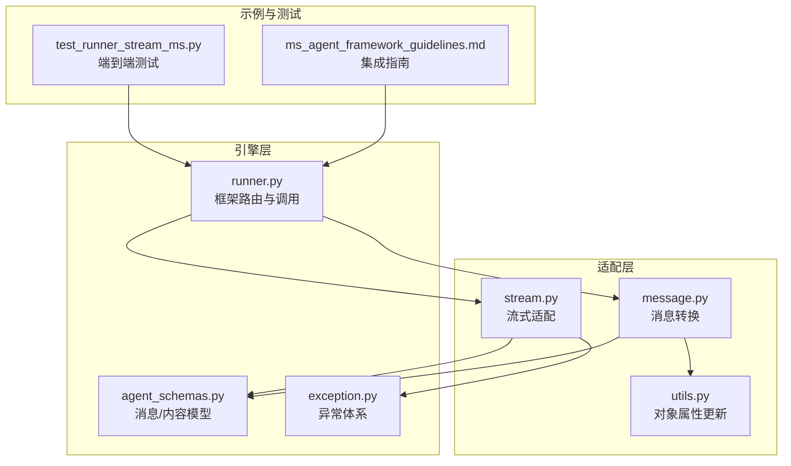
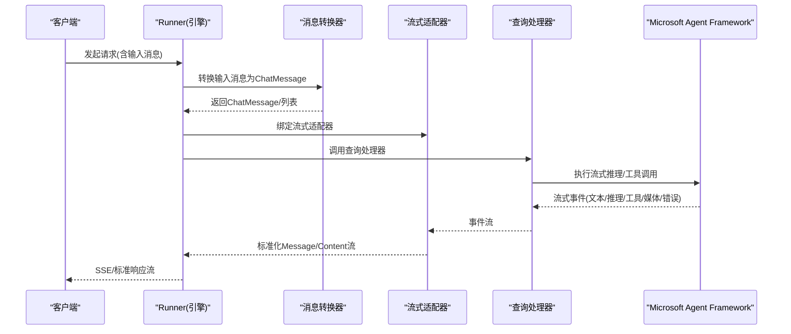
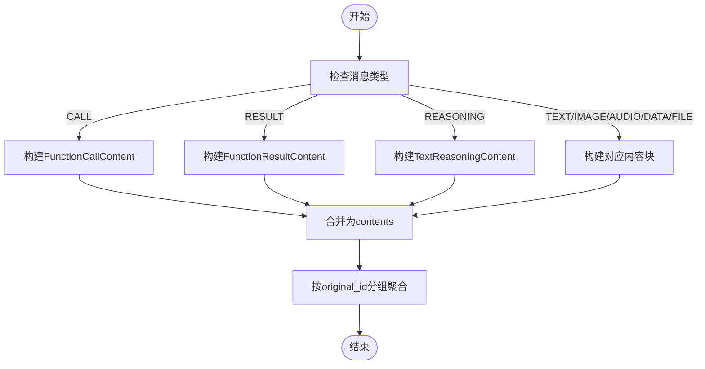
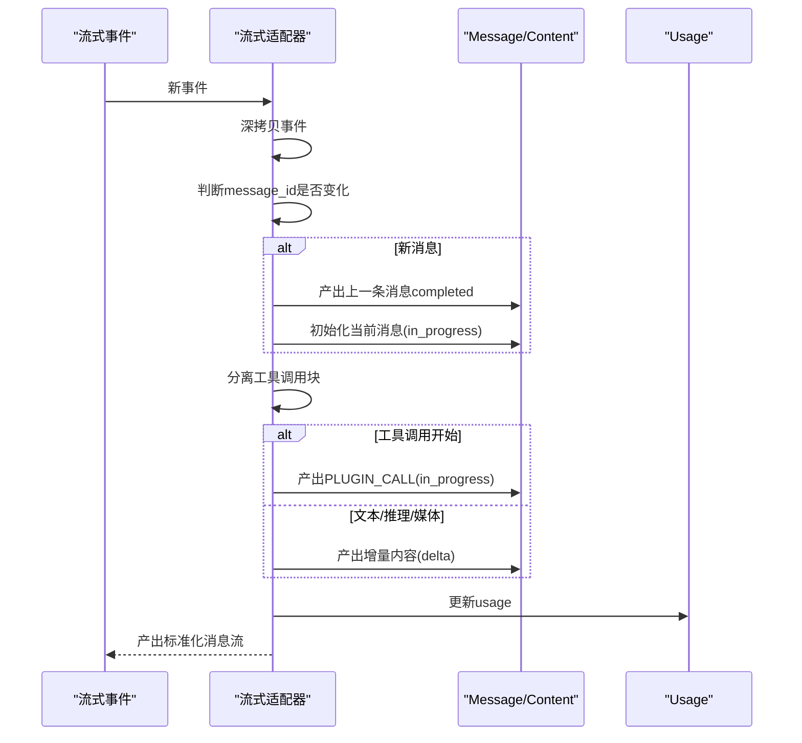
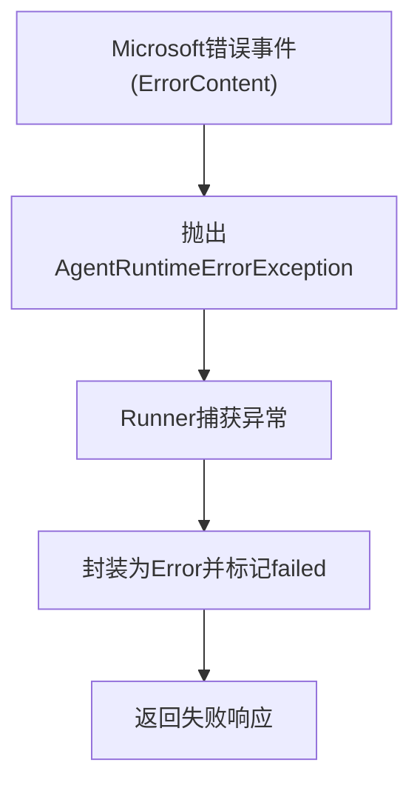
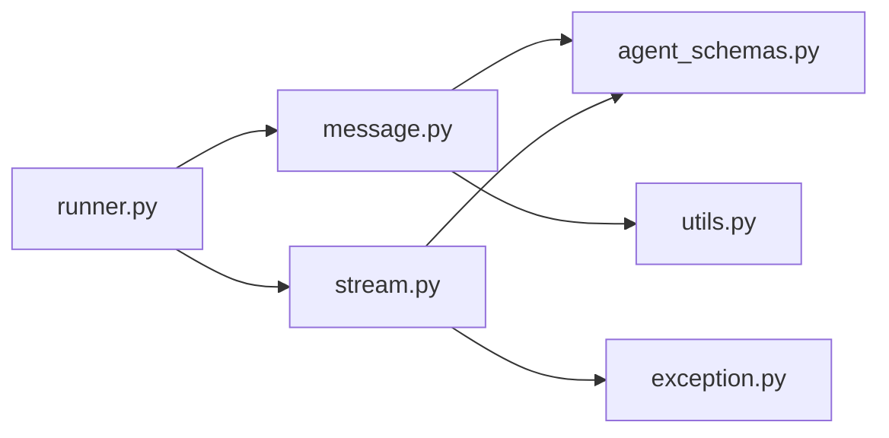

# MS Agent Framework适配器

<cite>
**本文引用的文件列表**
- [message.py](file://src/agentscope_runtime/adapters/ms_agent_framework/message.py)
- [stream.py](file://src/agentscope_runtime/adapters/ms_agent_framework/stream.py)
- [utils.py](file://src/agentscope_runtime/adapters/utils.py)
- [runner.py](file://src/agentscope_runtime/engine/runner.py)
- [agent_schemas.py](file://src/agentscope_runtime/engine/schemas/agent_schemas.py)
- [exception.py](file://src/agentscope_runtime/engine/schemas/exception.py)
- [ms_agent_framework_guidelines.md](file://cookbook/zh/ms_agent_framework_guidelines.md)
- [test_runner_stream_ms.py](file://tests/integrated/test_runner_stream_ms.py)
</cite>

## 目录
1. [简介](#简介)
2. [项目结构](#项目结构)
3. [核心组件](#核心组件)
4. [架构总览](#架构总览)
5. [详细组件分析](#详细组件分析)
6. [依赖关系分析](#依赖关系分析)
7. [性能考量](#性能考量)
8. [故障排查指南](#故障排查指南)
9. [结论](#结论)
10. [附录](#附录)

## 简介
本技术文档面向Microsoft Agent Framework适配器，系统性阐述在AgentScope Runtime中如何完成消息格式转换、代理状态管理与对话流程适配。重点覆盖：
- 消息类型映射与参数序列化/反序列化
- 响应格式化与流式传输处理
- 状态同步机制与并发控制策略
- Microsoft特定API调用适配、认证处理与错误码映射
- 实际集成案例与配置指南

## 项目结构
MS Agent Framework适配器位于适配层，负责将AgentScope内部消息协议与Microsoft Agent Framework的消息结构相互转换，并在流式场景下维持状态一致性与并发安全。

图表来源
- [runner.py:295-311](file://src/agentscope_runtime/engine/runner.py#L295-L311)
- [message.py:23-216](file://src/agentscope_runtime/adapters/ms_agent_framework/message.py#L23-L216)
- [stream.py:36-420](file://src/agentscope_runtime/adapters/ms_agent_framework/stream.py#L36-L420)
- [utils.py:2-7](file://src/agentscope_runtime/adapters/utils.py#L2-L7)
- [agent_schemas.py:18-36](file://src/agentscope_runtime/engine/schemas/agent_schemas.py#L18-L36)
- [exception.py:459-581](file://src/agentscope_runtime/engine/schemas/exception.py#L459-L581)
- [ms_agent_framework_guidelines.md:15-183](file://cookbook/zh/ms_agent_framework_guidelines.md#L15-L183)
- [test_runner_stream_ms.py:17-91](file://tests/integrated/test_runner_stream_ms.py#L17-L91)

章节来源
- [runner.py:295-311](file://src/agentscope_runtime/engine/runner.py#L295-L311)
- [message.py:23-216](file://src/agentscope_runtime/adapters/ms_agent_framework/message.py#L23-L216)
- [stream.py:36-420](file://src/agentscope_runtime/adapters/ms_agent_framework/stream.py#L36-L420)
- [agent_schemas.py:18-36](file://src/agentscope_runtime/engine/schemas/agent_schemas.py#L18-L36)
- [exception.py:459-581](file://src/agentscope_runtime/engine/schemas/exception.py#L459-L581)
- [ms_agent_framework_guidelines.md:15-183](file://cookbook/zh/ms_agent_framework_guidelines.md#L15-L183)
- [test_runner_stream_ms.py:17-91](file://tests/integrated/test_runner_stream_ms.py#L17-L91)

## 核心组件
- 消息转换器：将AgentScope Message/Content转换为Microsoft Agent Framework ChatMessage，支持文本、图像、音频、数据、文件等类型映射，以及函数调用/结果的转换。
- 流式适配器：将Microsoft Agent Framework的流式事件解包为AgentScope的Message/Content流，处理文本增量、推理内容、工具调用/结果、媒体内容与错误事件。
- 工具函数：提供对象属性更新能力，用于在流式过程中附加usage等元信息。
- 异常体系：统一将Microsoft Agent Framework错误映射为AgentScope运行时异常，便于上层处理。

章节来源
- [message.py:23-216](file://src/agentscope_runtime/adapters/ms_agent_framework/message.py#L23-L216)
- [stream.py:36-420](file://src/agentscope_runtime/adapters/ms_agent_framework/stream.py#L36-L420)
- [utils.py:2-7](file://src/agentscope_runtime/adapters/utils.py#L2-L7)
- [exception.py:459-581](file://src/agentscope_runtime/engine/schemas/exception.py#L459-L581)

## 架构总览
MS Agent Framework适配器在引擎层通过框架类型路由选择对应适配器，先进行消息格式转换，再进入流式适配阶段，最终产出标准化的AgentScope消息流。

图表来源
- [runner.py:295-311](file://src/agentscope_runtime/engine/runner.py#L295-L311)
- [message.py:23-216](file://src/agentscope_runtime/adapters/ms_agent_framework/message.py#L23-L216)
- [stream.py:36-420](file://src/agentscope_runtime/adapters/ms_agent_framework/stream.py#L36-L420)

## 详细组件分析

### 消息类型映射与参数序列化
- 输入消息到ChatMessage映射
  - 角色与作者名：优先从metadata中的original_id/original_name恢复；否则回退至message.role与message.name。
  - 内容块映射：text/image/audio/data/file分别映射到TextContent、UriContent、UriContent、DataContent、DataContent。
  - 函数调用/结果：将Plugin/MCP/Fn调用映射为FunctionCallContent；将调用结果映射为FunctionResultContent。
  - 复杂参数：字符串参数尝试JSON解析，失败则保留原值或空字典/空字符串，保证兼容性。
- 输出消息到AgentScope Message映射
  - 文本增量：TextContent(delta=true)逐步拼接，完成后completed。
  - 推理内容：TextReasoningContent映射为MessageType.REASONING消息。
  - 工具调用：FunctionCallContent映射为MessageType.PLUGIN_CALL消息，参数以DataContent携带。
  - 工具结果：FunctionResultContent映射为MessageType.PLUGIN_CALL_OUTPUT消息，结果以DataContent携带。
  - 媒体内容：UriContent/DataContent映射为ImageContent/AudioContent/FileContent等。
  - 错误事件：ErrorContent映射为AgentRuntimeErrorException并抛出。

图表来源
- [message.py:58-178](file://src/agentscope_runtime/adapters/ms_agent_framework/message.py#L58-L178)
- [message.py:180-216](file://src/agentscope_runtime/adapters/ms_agent_framework/message.py#L180-L216)

章节来源
- [message.py:23-216](file://src/agentscope_runtime/adapters/ms_agent_framework/message.py#L23-L216)
- [agent_schemas.py:18-36](file://src/agentscope_runtime/engine/schemas/agent_schemas.py#L18-L36)

### 流式传输处理与状态同步
- 状态机与消息生命周期
  - in_progress：消息/内容开始生成。
  - completed：消息/内容生成完成。
  - failed：遇到错误，抛出AgentRuntimeErrorException。
- 流式事件拆解
  - 文本增量：TextContent(delta=true)逐步产出，必要时触发已完成消息的completed。
  - 推理内容：TextReasoningContent映射为REASONING消息，增量产出后completed。
  - 工具调用：FunctionCallContent作为PLUGIN_CALL消息，参数以DataContent增量产出；当检测到工具调用结束时，发送completed。
  - 工具结果：FunctionResultContent映射为PLUGIN_CALL_OUTPUT消息，一次性产出completed。
  - 媒体内容：UriContent/DataContent映射为具体媒体类型，增量拼接后completed。
  - Usage：UsageContent汇总token统计，随消息完成时更新。
- 并发与深拷贝
  - 流式事件在适配前进行深拷贝，避免修改原始对象导致的竞态问题。
  - 通过message_id区分新消息边界，确保跨消息的状态正确切换。

图表来源
- [stream.py:36-420](file://src/agentscope_runtime/adapters/ms_agent_framework/stream.py#L36-L420)

章节来源
- [stream.py:36-420](file://src/agentscope_runtime/adapters/ms_agent_framework/stream.py#L36-L420)
- [utils.py:2-7](file://src/agentscope_runtime/adapters/utils.py#L2-L7)

### 错误码映射与异常处理
- Microsoft Agent Framework错误映射
  - ErrorContent映射为AgentRuntimeErrorException，包含error_code、message、details。
- 运行时异常分类
  - AgentRuntimeErrorException及其子类用于统一表示工具执行、MCP连接、模型执行、未知错误等。
- 上层处理
  - Runner捕获异常并转换为标准错误响应，确保对外一致的错误语义。

图表来源
- [stream.py:369-375](file://src/agentscope_runtime/adapters/ms_agent_framework/stream.py#L369-L375)
- [exception.py:459-581](file://src/agentscope_runtime/engine/schemas/exception.py#L459-L581)
- [runner.py:338-355](file://src/agentscope_runtime/engine/runner.py#L338-L355)

章节来源
- [stream.py:369-375](file://src/agentscope_runtime/adapters/ms_agent_framework/stream.py#L369-L375)
- [exception.py:459-581](file://src/agentscope_runtime/engine/schemas/exception.py#L459-L581)
- [runner.py:338-355](file://src/agentscope_runtime/engine/runner.py#L338-L355)

### 认证与API调用适配
- 认证处理
  - 适配器本身不直接处理认证，认证由上游查询处理器或客户端负责（如OpenAI兼容客户端传入API Key）。
- API调用适配
  - 通过OpenAI兼容模式访问Microsoft Agent Framework，示例中使用DashScope的兼容接口。
  - 查询处理器负责创建Agent实例、恢复/新建线程、执行流式推理并序列化线程状态。

章节来源
- [ms_agent_framework_guidelines.md:75-99](file://cookbook/zh/ms_agent_framework_guidelines.md#L75-L99)
- [test_runner_stream_ms.py:54-76](file://tests/integrated/test_runner_stream_ms.py#L54-L76)

### 配置与集成指南
- 快速开始
  - 安装依赖与设置环境变量（如DASHSCOPE_API_KEY）。
  - 编写AgentApp，注册framework="ms_agent_framework"的查询端点。
  - 在查询处理器中创建Agent实例、管理会话线程、执行流式推理并持久化线程。
- OpenAI兼容模式
  - 通过OpenAI SDK访问兼容端点，实现与现有生态的无缝对接。
- 多轮对话与会话记忆
  - 使用thread_storage维护用户+会话维度的线程序列化状态，支持断点续跑。

章节来源
- [ms_agent_framework_guidelines.md:108-183](file://cookbook/zh/ms_agent_framework_guidelines.md#L108-L183)
- [ms_agent_framework_guidelines.md:46-101](file://cookbook/zh/ms_agent_framework_guidelines.md#L46-L101)

## 依赖关系分析
- 适配器对引擎模型的依赖
  - 消息转换依赖MessageType、Content类型枚举与Message/Content模型。
  - 流式适配依赖UsageContent、ErrorContent等Microsoft Agent Framework特有的内容类型。
- 适配器对工具函数的依赖
  - _update_obj_attrs用于在流式过程中动态更新消息的usage等属性。
- 适配器对异常体系的依赖
  - 将Microsoft Agent Framework错误映射为AgentRuntimeErrorException，保持对外一致的错误语义。

图表来源
- [message.py:17-33](file://src/agentscope_runtime/adapters/ms_agent_framework/message.py#L17-L33)
- [stream.py:20-33](file://src/agentscope_runtime/adapters/ms_agent_framework/stream.py#L20-L33)
- [runner.py:295-311](file://src/agentscope_runtime/engine/runner.py#L295-L311)

章节来源
- [message.py:17-33](file://src/agentscope_runtime/adapters/ms_agent_framework/message.py#L17-L33)
- [stream.py:20-33](file://src/agentscope_runtime/adapters/ms_agent_framework/stream.py#L20-L33)
- [runner.py:295-311](file://src/agentscope_runtime/engine/runner.py#L295-L311)

## 性能考量
- 流式处理
  - 通过增量内容(delta)与completed的组合，减少大文本/媒体的内存占用。
  - 深拷贝仅在事件进入适配器前进行一次，避免重复开销。
- 并发控制
  - 通过message_id边界与状态机确保消息顺序与完整性，避免竞态。
- 序列化与反序列化
  - 参数JSON解析失败时回退为原值或默认值，提升鲁棒性。
- 线程状态持久化
  - 仅在会话结束时序列化线程，降低频繁IO带来的性能影响。

## 故障排查指南
- 常见错误与定位
  - 不支持的消息类型：检查content.type是否在映射表中。
  - JSON解析失败：确认字符串参数格式，适配器已做回退处理。
  - 工具调用参数为空：确认消息中data.arguments字段存在且可解析。
  - 流式中断：检查ErrorContent是否被抛出，查看details获取更多上下文。
- 日志与调试
  - Runner捕获异常并记录堆栈，便于定位上游问题。
  - 在查询处理器中打印关键事件，验证线程恢复/序列化逻辑。

章节来源
- [message.py:149-150](file://src/agentscope_runtime/adapters/ms_agent_framework/message.py#L149-L150)
- [stream.py:369-375](file://src/agentscope_runtime/adapters/ms_agent_framework/stream.py#L369-L375)
- [runner.py:338-355](file://src/agentscope_runtime/engine/runner.py#L338-L355)

## 结论
MS Agent Framework适配器通过清晰的消息映射与严谨的流式处理机制，实现了AgentScope与Microsoft Agent Framework之间的高效互通。其设计兼顾了兼容性、可扩展性与性能，能够支撑多轮对话、工具调用与多媒体内容的复杂场景。结合示例与测试用例，开发者可快速完成集成与优化。

## 附录
- 关键实现路径参考
  - 消息转换入口：[message_to_ms_agent_framework_message:23-216](file://src/agentscope_runtime/adapters/ms_agent_framework/message.py#L23-L216)
  - 流式适配入口：[adapt_ms_agent_framework_message_stream:36-420](file://src/agentscope_runtime/adapters/ms_agent_framework/stream.py#L36-L420)
  - 引擎框架路由：[runner.py:295-311](file://src/agentscope_runtime/engine/runner.py#L295-L311)
  - 消息/内容模型：[agent_schemas.py:18-600](file://src/agentscope_runtime/engine/schemas/agent_schemas.py#L18-L600)
  - 异常体系：[exception.py:459-581](file://src/agentscope_runtime/engine/schemas/exception.py#L459-L581)
  - 集成示例：[ms_agent_framework_guidelines.md:15-183](file://cookbook/zh/ms_agent_framework_guidelines.md#L15-L183)
  - 端到端测试：[test_runner_stream_ms.py:17-214](file://tests/integrated/test_runner_stream_ms.py#L17-L214)