# 协议适配器系统

<cite>
**本文档引用的文件**
- [protocol_adapter.py](file://src/agentscope_runtime/engine/deployers/adapter/protocol_adapter.py)
- [agent_app.py](file://src/agentscope_runtime/engine/app/agent_app.py)
- [agentscope/message.py](file://src/agentscope_runtime/adapters/agentscope/message.py)
- [agentscope/stream.py](file://src/agentscope_runtime/adapters/agentscope/stream.py)
- [langgraph/message.py](file://src/agentscope_runtime/adapters/langgraph/message.py)
- [ms_agent_framework/message.py](file://src/agentscope_runtime/adapters/ms_agent_framework/message.py)
- [agno/message.py](file://src/agentscope_runtime/adapters/agno/message.py)
- [autogen/tool/tool.py](file://src/agentscope_runtime/adapters/autogen/tool/tool.py)
- [text/stream.py](file://src/agentscope_runtime/adapters/text/stream.py)
- [a2a_agent_adapter.py](file://src/agentscope_runtime/engine/deployers/adapter/a2a/a2a_agent_adapter.py)
- [agui_adapter_utils.py](file://src/agentscope_runtime/engine/deployers/adapter/agui/agui_adapter_utils.py)
- [response_api_agent_adapter.py](file://src/agentscope_runtime/engine/deployers/adapter/responses/response_api_agent_adapter.py)
- [agent_schemas.py](file://src/agentscope_runtime/engine/schemas/agent_schemas.py)
- [run_langgraph_agent.py](file://examples/integrations/langgraph/run_langgraph_agent.py)
- [test_a2a_protocol_adapter.py](file://tests/unit/test_a2a_protocol_adapter.py)
</cite>

## 目录
1. [简介](#简介)
2. [项目结构](#项目结构)
3. [核心组件](#核心组件)
4. [架构总览](#架构总览)
5. [详细组件分析](#详细组件分析)
6. [依赖关系分析](#依赖关系分析)
7. [性能考虑](#性能考虑)
8. [故障排除指南](#故障排除指南)
9. [结论](#结论)
10. [附录](#附录)

## 简介
本文件面向AgentScope Runtime的协议适配器系统，系统性阐述其设计理念、多框架兼容性实现与消息转换机制。文档覆盖AgentScope、LangGraph、MS Agent Framework、Agno以及AutoGen等框架的适配器实现，深入解析消息格式转换、工具调用适配与流式传输处理，并提供适配器注册机制、动态加载与扩展点设计的最佳实践。

## 项目结构
协议适配器系统主要由以下层次构成：
- 协议适配器抽象层：定义统一的协议适配接口，约束具体协议适配器的行为。
- 框架适配层：针对不同框架（AgentScope、LangGraph、MS Agent Framework、Agno）的消息格式与工具调用进行转换。
- 流式传输适配层：将底层运行时产生的增量事件转换为统一的流式输出格式。
- 协议执行适配层：将Agent API事件映射到具体协议（如A2A、AG-UI、Responses API）的事件模型。
- 应用集成层：在AgentApp中注册并启用多种协议适配器，统一对外提供服务端点。

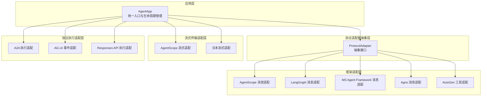

图表来源
- [agent_app.py:340-357](file://src/agentscope_runtime/engine/app/agent_app.py#L340-L357)
- [protocol_adapter.py:6-25](file://src/agentscope_runtime/engine/deployers/adapter/protocol_adapter.py#L6-L25)

章节来源
- [agent_app.py:124-220](file://src/agentscope_runtime/engine/app/agent_app.py#L124-L220)
- [protocol_adapter.py:6-25](file://src/agentscope_runtime/engine/deployers/adapter/protocol_adapter.py#L6-L25)

## 核心组件
- 协议适配器抽象：定义统一的add_endpoint方法，用于向FastAPI应用注册协议特定端点。
- AgentApp：负责初始化Runner、构建路由、注册协议适配器、管理生命周期与中间件。
- 框架消息适配器：将Agent API的消息格式转换为各框架期望的消息类型。
- 工具适配器：将Agent API的工具调用封装为AutoGen等框架可用的工具对象。
- 流式传输适配器：将底层增量事件转换为统一的流式输出（SSE/事件序列）。
- 协议执行适配器：将Agent API事件映射到A2A、AG-UI、Responses API等协议事件。

章节来源
- [protocol_adapter.py:6-25](file://src/agentscope_runtime/engine/deployers/adapter/protocol_adapter.py#L6-L25)
- [agent_app.py:340-357](file://src/agentscope_runtime/engine/app/agent_app.py#L340-L357)
- [agent_schemas.py:18-44](file://src/agentscope_runtime/engine/schemas/agent_schemas.py#L18-L44)

## 架构总览
下图展示了AgentApp如何在启动时初始化协议适配器并注册端点，以及各适配器之间的协作关系。

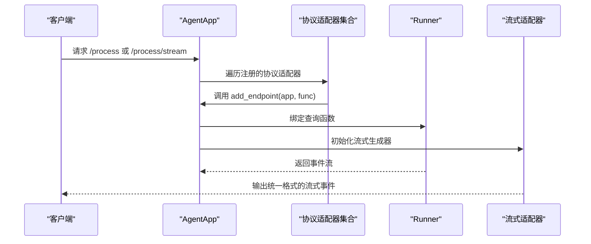

图表来源
- [agent_app.py:273-274](file://src/agentscope_runtime/engine/app/agent_app.py#L273-L274)
- [agent_app.py:798-802](file://src/agentscope_runtime/engine/app/agent_app.py#L798-L802)

## 详细组件分析

### 协议适配器抽象与注册机制
- 抽象接口：ProtocolAdapter定义了add_endpoint方法，要求子类实现具体的端点注册逻辑。
- AgentApp注册流程：在构造函数中根据配置初始化协议适配器列表，并在生命周期内调用每个适配器的add_endpoint方法，将统一的查询函数绑定到不同协议的端点上。
- 动态加载与扩展：通过传入protocol_adapters参数或在构造时自动初始化默认适配器，支持按需扩展新的协议适配器。

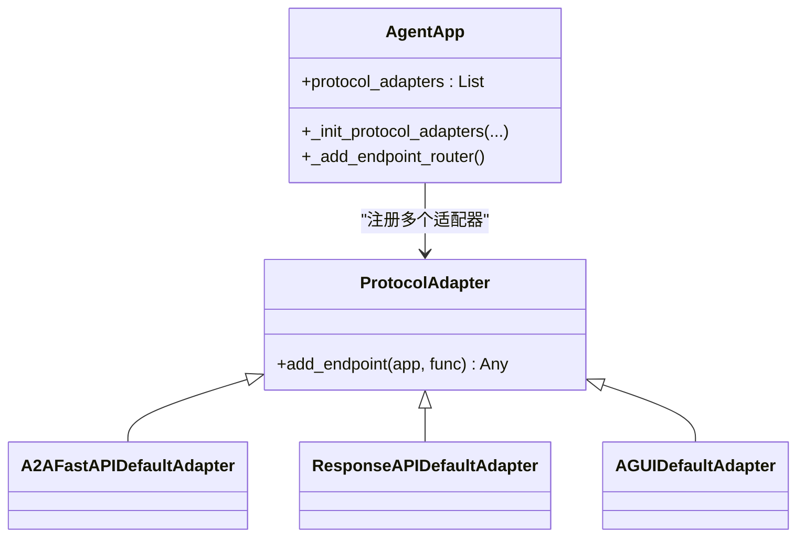

图表来源
- [protocol_adapter.py:6-25](file://src/agentscope_runtime/engine/deployers/adapter/protocol_adapter.py#L6-L25)
- [agent_app.py:340-357](file://src/agentscope_runtime/engine/app/agent_app.py#L340-L357)

章节来源
- [protocol_adapter.py:6-25](file://src/agentscope_runtime/engine/deployers/adapter/protocol_adapter.py#L6-L25)
- [agent_app.py:193-201](file://src/agentscope_runtime/engine/app/agent_app.py#L193-L201)
- [agent_app.py:273-274](file://src/agentscope_runtime/engine/app/agent_app.py#L273-L274)

### AgentScope 消息格式转换
- 支持的消息类型：文本、图像、音频、视频、文件、工具调用、工具结果、推理内容等。
- 角色映射：将框架角色映射到Agent API的角色（如tool映射为system）。
- 工具调用转换：将工具调用与工具结果分别转换为FunctionCall与FunctionCallOutput结构。
- 多媒体内容处理：对base64与URL两种来源进行统一处理，生成标准的块类型。
- 分组与合并：根据原始消息ID对消息进行分组，避免重复与错位。

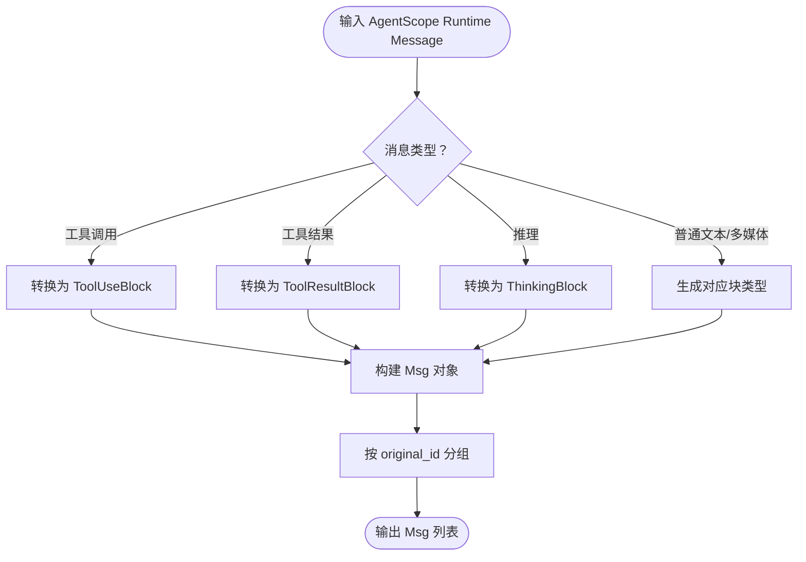

图表来源
- [agentscope/message.py:53-394](file://src/agentscope_runtime/adapters/agentscope/message.py#L53-L394)

章节来源
- [agentscope/message.py:53-394](file://src/agentscope_runtime/adapters/agentscope/message.py#L53-L394)

### LangGraph 消息格式转换
- 角色映射：user->HumanMessage，assistant->AIMessage，system->SystemMessage，tool->ToolMessage。
- 工具调用转换：将工具调用转换为AIMessage中的tool_calls字段。
- 工具结果转换：将工具结果转换为ToolMessage，并携带tool_call_id。
- 文本内容拼接：将多部分内容拼接为字符串内容。

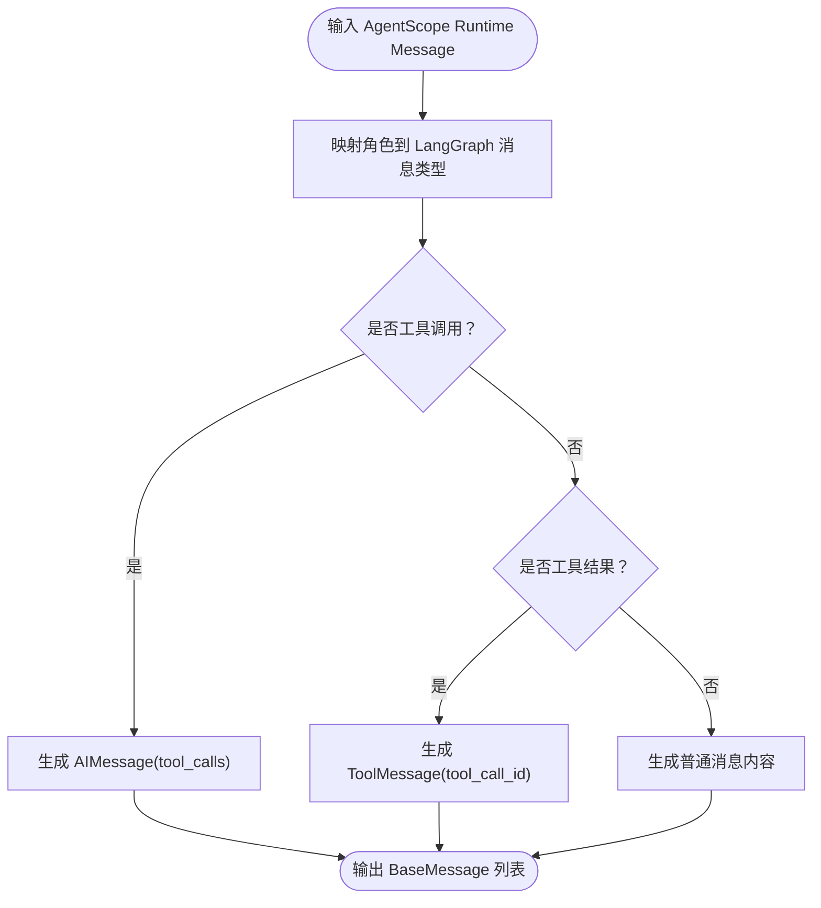

图表来源
- [langgraph/message.py:23-163](file://src/agentscope_runtime/adapters/langgraph/message.py#L23-L163)

章节来源
- [langgraph/message.py:23-163](file://src/agentscope_runtime/adapters/langgraph/message.py#L23-L163)

### MS Agent Framework 消息格式转换
- 将工具调用转换为FunctionCallContent，工具结果转换为FunctionResultContent。
- 推理内容转换为TextReasoningContent。
- 文本、图像、音频、数据与文件内容转换为对应的MS框架块类型。
- 支持additional_properties与message_id的保留与映射。

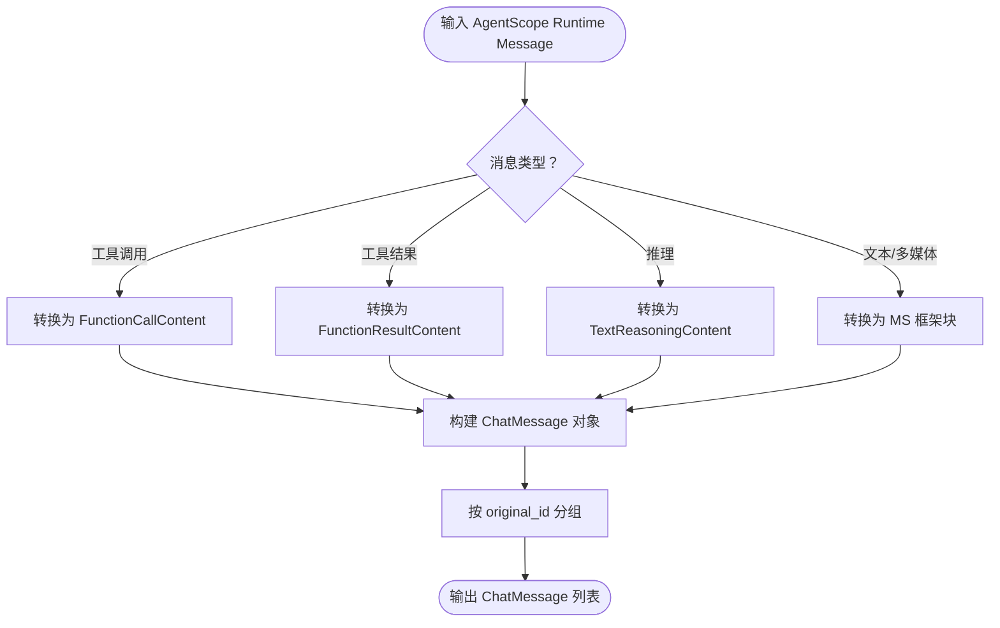

图表来源
- [ms_agent_framework/message.py:23-216](file://src/agentscope_runtime/adapters/ms_agent_framework/message.py#L23-L216)

章节来源
- [ms_agent_framework/message.py:23-216](file://src/agentscope_runtime/adapters/ms_agent_framework/message.py#L23-L216)

### Agno 消息格式转换
- 基于AgentScope消息转换器，先将Agent API消息转换为AgentScope Msg，再通过OpenAI Chat格式化器转换为Agno消息格式。

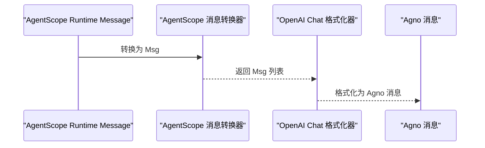

图表来源
- [agno/message.py:10-40](file://src/agentscope_runtime/adapters/agno/message.py#L10-L40)
- [agentscope/message.py:53-394](file://src/agentscope_runtime/adapters/agentscope/message.py#L53-L394)

章节来源
- [agno/message.py:10-40](file://src/agentscope_runtime/adapters/agno/message.py#L10-L40)

### AutoGen 工具适配
- 将Agent API工具封装为AutoGen工具对象，支持名称与描述覆盖。
- 提供批量创建工具适配器的便捷函数，简化多工具集成。

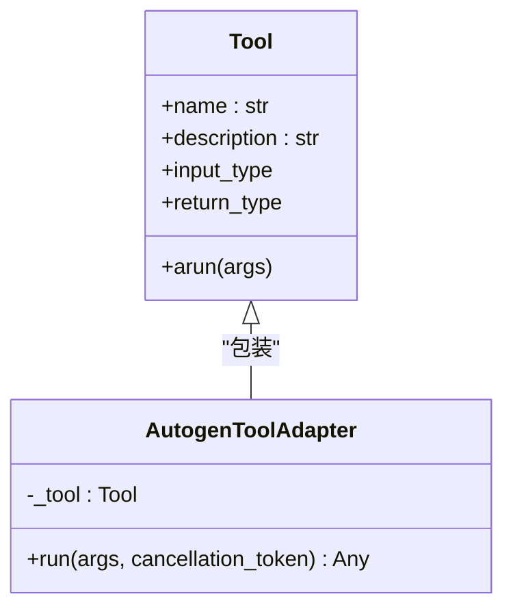

图表来源
- [autogen/tool/tool.py:28-138](file://src/agentscope_runtime/adapters/autogen/tool/tool.py#L28-L138)

章节来源
- [autogen/tool/tool.py:28-212](file://src/agentscope_runtime/adapters/autogen/tool/tool.py#L28-L212)

### AgentScope 流式传输适配
- 支持文本、推理、工具调用、工具结果及多媒体内容的增量输出。
- 使用消息ID区分消息边界，工具调用与工具结果通过call_id关联。
- 支持自定义转换器，允许对特定块类型进行异步/同步迭代器转换。

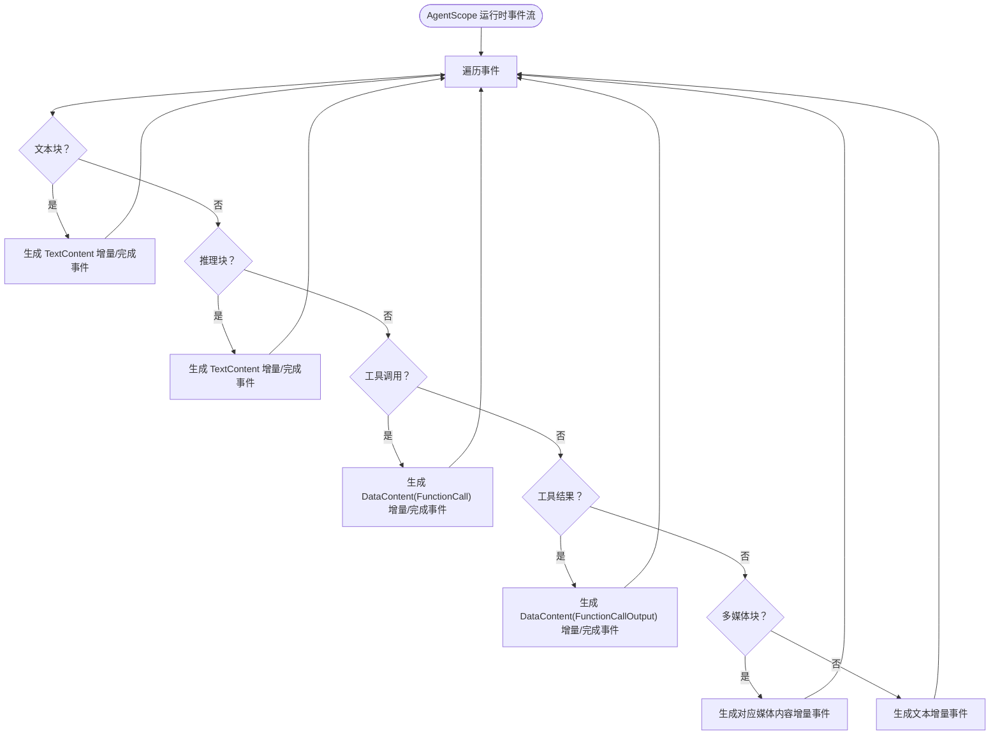

图表来源
- [agentscope/stream.py:33-684](file://src/agentscope_runtime/adapters/agentscope/stream.py#L33-L684)

章节来源
- [agentscope/stream.py:33-684](file://src/agentscope_runtime/adapters/agentscope/stream.py#L33-L684)

### 文本流式适配
- 将纯文本流转换为统一的文本内容增量事件，最终完成消息。

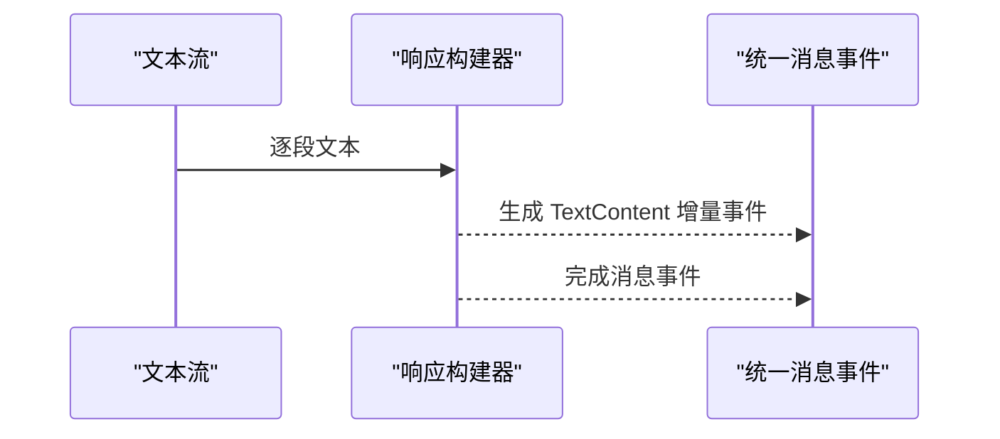

图表来源
- [text/stream.py:12-31](file://src/agentscope_runtime/adapters/text/stream.py#L12-L31)

章节来源
- [text/stream.py:12-31](file://src/agentscope_runtime/adapters/text/stream.py#L12-L31)

### A2A 协议执行适配
- 将Agent API事件转换为A2A消息，支持取消操作错误处理。
- 在AgentApp中通过A2A执行器接收请求，转换为AgentRequest后交由统一查询函数处理。

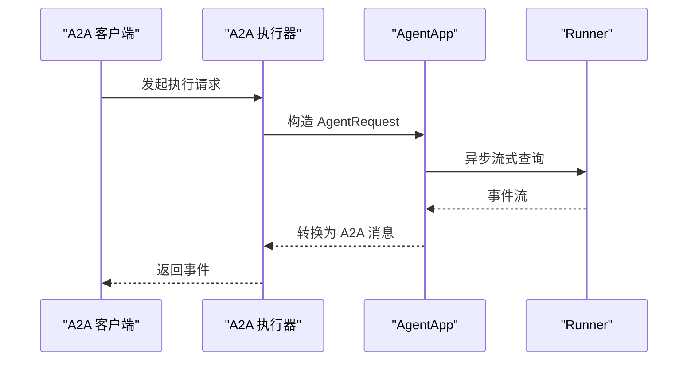

图表来源
- [a2a_agent_adapter.py:27-63](file://src/agentscope_runtime/engine/deployers/adapter/a2a/a2a_agent_adapter.py#L27-L63)
- [agent_app.py:54-96](file://src/agentscope_runtime/engine/app/agent_app.py#L54-L96)

章节来源
- [a2a_agent_adapter.py:27-63](file://src/agentscope_runtime/engine/deployers/adapter/a2a/a2a_agent_adapter.py#L27-L63)

### AG-UI 事件适配
- 将AG-UI消息转换为Agent API消息，支持开发者消息、用户消息、助手消息与工具消息。
- 将Agent API事件转换为AG-UI事件，包括文本消息开始/结束、工具调用开始/结束与结果事件。
- 支持工具Schema参数的兼容性处理。

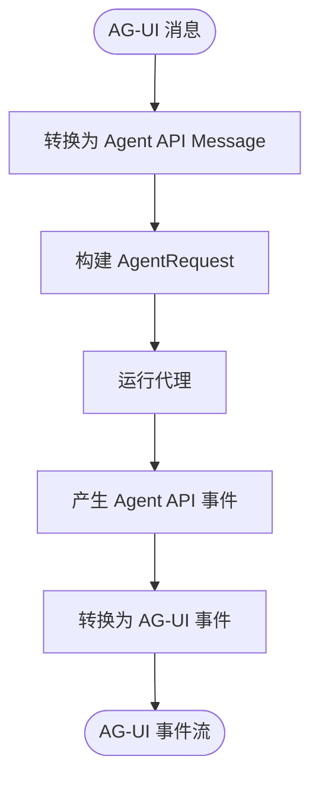

图表来源
- [agui_adapter_utils.py:64-210](file://src/agentscope_runtime/engine/deployers/adapter/agui/agui_adapter_utils.py#L64-L210)
- [agui_adapter_utils.py:360-622](file://src/agentscope_runtime/engine/deployers/adapter/agui/agui_adapter_utils.py#L360-L622)

章节来源
- [agui_adapter_utils.py:64-210](file://src/agentscope_runtime/engine/deployers/adapter/agui/agui_adapter_utils.py#L64-L210)
- [agui_adapter_utils.py:360-622](file://src/agentscope_runtime/engine/deployers/adapter/agui/agui_adapter_utils.py#L360-L622)

### Responses API 执行适配
- 将Responses API请求转换为Agent API请求，将Agent API事件转换为Responses API事件。
- 统一序列号，确保事件顺序一致性。

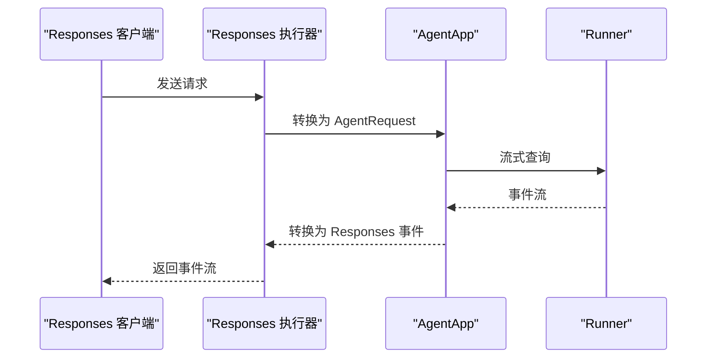

图表来源
- [response_api_agent_adapter.py:18-51](file://src/agentscope_runtime/engine/deployers/adapter/responses/response_api_agent_adapter.py#L18-L51)

章节来源
- [response_api_agent_adapter.py:18-51](file://src/agentscope_runtime/engine/deployers/adapter/responses/response_api_agent_adapter.py#L18-L51)

## 依赖关系分析
- AgentApp依赖协议适配器抽象，通过统一接口注册不同协议的端点。
- 各框架消息适配器依赖Agent API的消息模型（Message、Content等），并通过类型转换器实现扩展。
- 流式适配器依赖Agent API的事件模型，将底层增量事件转换为统一的流式输出。
- 协议执行适配器依赖Agent API事件模型，将其映射到具体协议的事件类型。

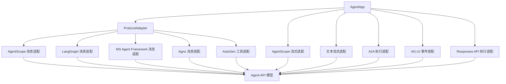

图表来源
- [agent_app.py:340-357](file://src/agentscope_runtime/engine/app/agent_app.py#L340-L357)
- [agentscope/message.py:26-29](file://src/agentscope_runtime/adapters/agentscope/message.py#L26-L29)
- [agent_schemas.py:18-44](file://src/agentscope_runtime/engine/schemas/agent_schemas.py#L18-L44)

章节来源
- [agent_app.py:340-357](file://src/agentscope_runtime/engine/app/agent_app.py#L340-L357)
- [agent_schemas.py:18-44](file://src/agentscope_runtime/engine/schemas/agent_schemas.py#L18-L44)

## 性能考虑
- 流式传输：采用异步迭代器逐段输出，降低内存占用，提升实时性。
- 消息分组：按原始消息ID进行分组，减少重复与错位，提高渲染效率。
- 工具调用批处理：工具调用与结果通过call_id关联，避免多次网络往返。
- 事件序列化：在协议适配器中尽量复用模型的序列化能力，减少额外开销。
- 取消与错误处理：在A2A执行器中对取消操作进行明确错误处理，避免资源泄漏。

## 故障排除指南
- A2A 协议适配器单元测试覆盖了AgentCard配置、传输属性构建与注册集成等场景，可参考测试用例定位问题。
- AG-UI 事件适配器对不支持的消息类型会记录警告信息，检查消息类型与内容结构以定位问题。
- AutoGen 工具适配器在工具执行失败时会抛出带上下文的异常，便于快速定位具体工具与参数。

章节来源
- [test_a2a_protocol_adapter.py:27-498](file://tests/unit/test_a2a_protocol_adapter.py#L27-L498)
- [agui_adapter_utils.py:200-208](file://src/agentscope_runtime/engine/deployers/adapter/agui/agui_adapter_utils.py#L200-L208)
- [autogen/tool/tool.py:133-137](file://src/agentscope_runtime/adapters/autogen/tool/tool.py#L133-L137)

## 结论
AgentScope Runtime的协议适配器系统通过抽象接口与模块化设计，实现了对多框架与多协议的统一接入。借助标准化的消息模型与流式传输机制，系统在保证兼容性的同时兼顾了性能与可扩展性。通过完善的工具适配与事件映射，开发者可以轻松地将现有工具与第三方框架集成到统一的运行时平台中。

## 附录
- 示例：LangGraph 集成示例展示了如何在AgentApp中以框架模式注册查询函数，并与LangGraph代理进行交互。
  
章节来源
- [run_langgraph_agent.py:59-107](file://examples/integrations/langgraph/run_langgraph_agent.py#L59-L107)