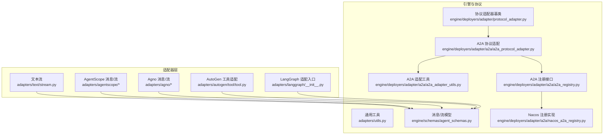
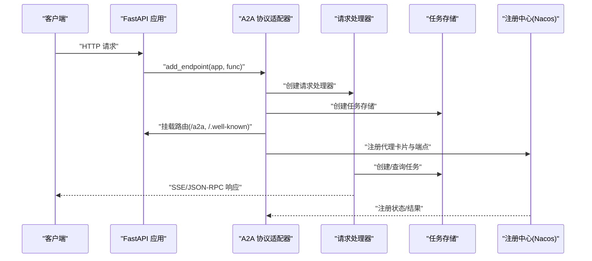
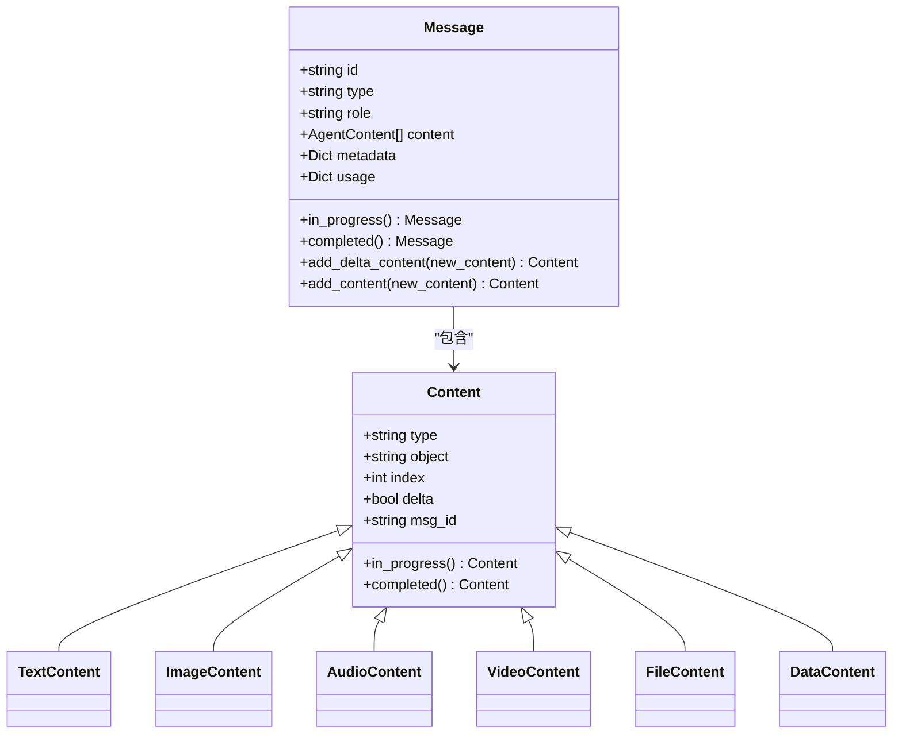
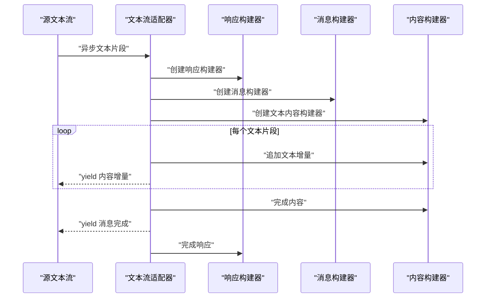
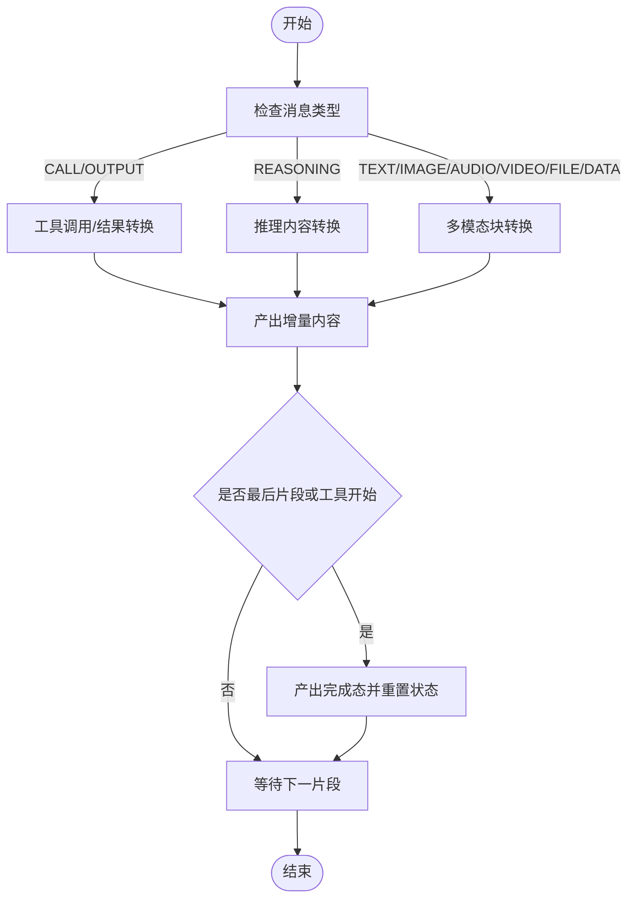
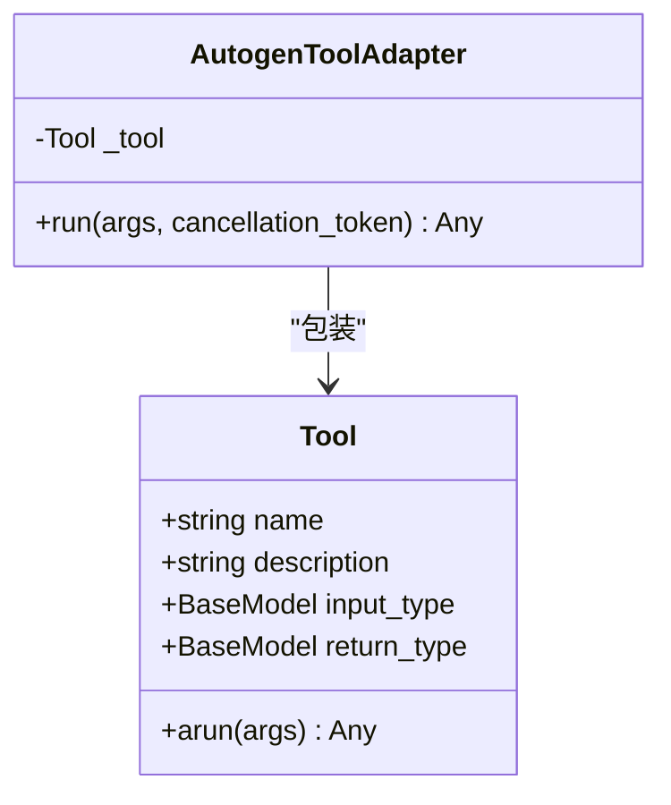
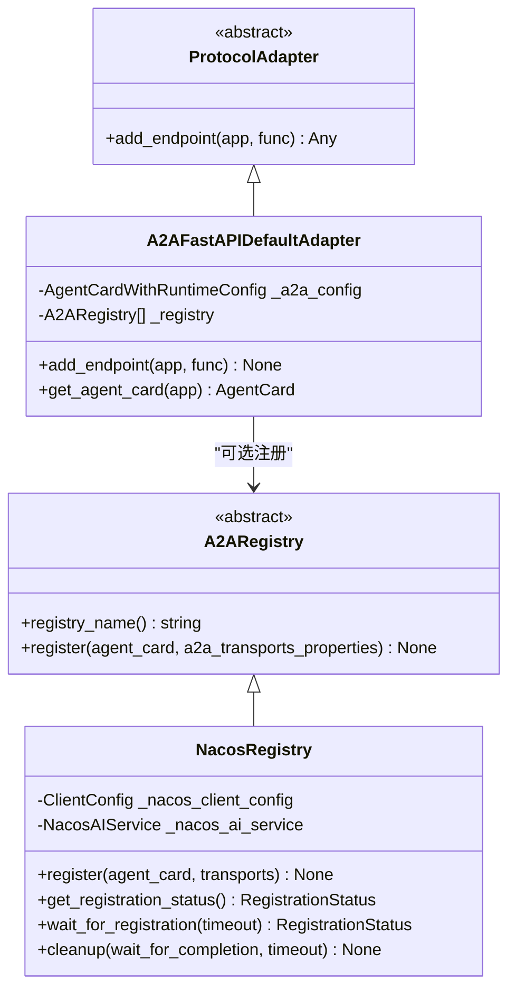
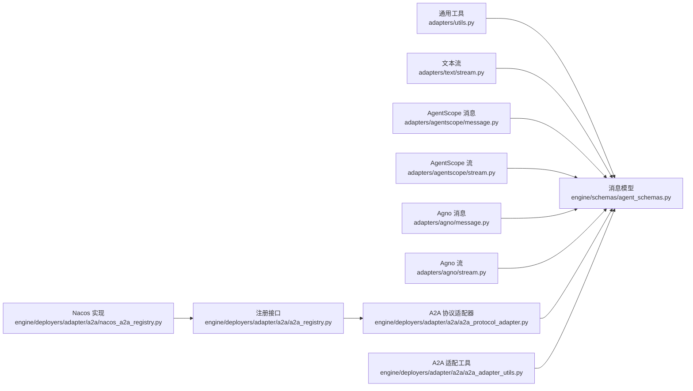

# 适配器工具和通用功能

<cite>
**本文档引用的文件**
- [adapters/utils.py](file://src/agentscope_runtime/adapters/utils.py)
- [adapters/text/stream.py](file://src/agentscope_runtime/adapters/text/stream.py)
- [adapters/agentscope/message.py](file://src/agentscope_runtime/adapters/agentscope/message.py)
- [adapters/agentscope/stream.py](file://src/agentscope_runtime/adapters/agentscope/stream.py)
- [adapters/agno/message.py](file://src/agentscope_runtime/adapters/agno/message.py)
- [adapters/agno/stream.py](file://src/agentscope_runtime/adapters/agno/stream.py)
- [adapters/autogen/tool/tool.py](file://src/agentscope_runtime/adapters/autogen/tool/tool.py)
- [adapters/langgraph/__init__.py](file://src/agentscope_runtime/adapters/langgraph/__init__.py)
- [engine/schemas/agent_schemas.py](file://src/agentscope_runtime/engine/schemas/agent_schemas.py)
- [engine/deployers/adapter/protocol_adapter.py](file://src/agentscope_runtime/engine/deployers/adapter/protocol_adapter.py)
- [engine/deployers/adapter/a2a/a2a_protocol_adapter.py](file://src/agentscope_runtime/engine/deployers/adapter/a2a/a2a_protocol_adapter.py)
- [engine/deployers/adapter/a2a/a2a_adapter_utils.py](file://src/agentscope_runtime/engine/deployers/adapter/a2a/a2a_adapter_utils.py)
- [engine/deployers/adapter/a2a/a2a_registry.py](file://src/agentscope_runtime/engine/deployers/adapter/a2a/a2a_registry.py)
- [engine/deployers/adapter/a2a/nacos_a2a_registry.py](file://src/agentscope_runtime/engine/deployers/adapter/a2a/nacos_a2a_registry.py)
</cite>

## 目录
1. [简介](#简介)
2. [项目结构](#项目结构)
3. [核心组件](#核心组件)
4. [架构总览](#架构总览)
5. [详细组件分析](#详细组件分析)
6. [依赖关系分析](#依赖关系分析)
7. [性能考虑](#性能考虑)
8. [故障排除指南](#故障排除指南)
9. [结论](#结论)
10. [附录](#附录)

## 简介
本文件面向协议适配器系统的通用工具与基础设施，聚焦以下目标：
- 适配器通用工具函数：属性更新、类型转换与消息格式验证
- 消息处理辅助类：事件构建器、内容构建器与增量内容管理
- 流式传输工具：文本流、消息流与工具调用流的转换与输出
- 错误处理机制：状态映射、异常捕获与日志记录
- 文本流处理、编码转换与协议兼容性检查
- 适配器注册机制：扩展点设计、动态加载与服务发现集成
- 自定义适配器开发：工具函数与模板代码指引

## 项目结构
适配器系统位于 `src/agentscope_runtime/adapters/`，按协议与功能分层组织：
- 通用工具与基础设施：`adapters/utils.py`、`adapters/text/stream.py`
- 协议适配器与消息转换：`adapters/agentscope/`、`adapters/agno/`、`adapters/autogen/tool/`
- 语言图（LangGraph）适配入口：`adapters/langgraph/__init__.py`
- 引擎模型与协议适配器基类：`engine/schemas/agent_schemas.py`、`engine/deployers/adapter/protocol_adapter.py`
- A2A 协议适配与注册中心：`engine/deployers/adapter/a2a/`

**图表来源**
- [adapters/text/stream.py:1-31](file://src/agentscope_runtime/adapters/text/stream.py#L1-L31)
- [adapters/agentscope/message.py:1-394](file://src/agentscope_runtime/adapters/agentscope/message.py#L1-L394)
- [adapters/agentscope/stream.py:1-684](file://src/agentscope_runtime/adapters/agentscope/stream.py#L1-L684)
- [adapters/agno/message.py:1-40](file://src/agentscope_runtime/adapters/agno/message.py#L1-L40)
- [adapters/agno/stream.py:1-124](file://src/agentscope_runtime/adapters/agno/stream.py#L1-L124)
- [adapters/autogen/tool/tool.py:1-212](file://src/agentscope_runtime/adapters/autogen/tool/tool.py#L1-L212)
- [adapters/langgraph/__init__.py:1-11](file://src/agentscope_runtime/adapters/langgraph/__init__.py#L1-L11)
- [engine/schemas/agent_schemas.py:1-1020](file://src/agentscope_runtime/engine/schemas/agent_schemas.py#L1-L1020)
- [engine/deployers/adapter/protocol_adapter.py:1-25](file://src/agentscope_runtime/engine/deployers/adapter/protocol_adapter.py#L1-L25)
- [engine/deployers/adapter/a2a/a2a_protocol_adapter.py:1-498](file://src/agentscope_runtime/engine/deployers/adapter/a2a/a2a_protocol_adapter.py#L1-L498)
- [engine/deployers/adapter/a2a/a2a_adapter_utils.py:1-405](file://src/agentscope_runtime/engine/deployers/adapter/a2a/a2a_adapter_utils.py#L1-L405)
- [engine/deployers/adapter/a2a/a2a_registry.py:1-77](file://src/agentscope_runtime/engine/deployers/adapter/a2a/a2a_registry.py#L1-L77)
- [engine/deployers/adapter/a2a/nacos_a2a_registry.py:1-768](file://src/agentscope_runtime/engine/deployers/adapter/a2a/nacos_a2a_registry.py#L1-L768)

**章节来源**
- [adapters/text/stream.py:1-31](file://src/agentscope_runtime/adapters/text/stream.py#L1-L31)
- [adapters/agentscope/message.py:1-394](file://src/agentscope_runtime/adapters/agentscope/message.py#L1-L394)
- [adapters/agentscope/stream.py:1-684](file://src/agentscope_runtime/adapters/agentscope/stream.py#L1-L684)
- [adapters/agno/message.py:1-40](file://src/agentscope_runtime/adapters/agno/message.py#L1-L40)
- [adapters/agno/stream.py:1-124](file://src/agentscope_runtime/adapters/agno/stream.py#L1-L124)
- [adapters/autogen/tool/tool.py:1-212](file://src/agentscope_runtime/adapters/autogen/tool/tool.py#L1-L212)
- [adapters/langgraph/__init__.py:1-11](file://src/agentscope_runtime/adapters/langgraph/__init__.py#L1-L11)
- [engine/schemas/agent_schemas.py:1-1020](file://src/agentscope_runtime/engine/schemas/agent_schemas.py#L1-L1020)
- [engine/deployers/adapter/protocol_adapter.py:1-25](file://src/agentscope_runtime/engine/deployers/adapter/protocol_adapter.py#L1-L25)
- [engine/deployers/adapter/a2a/a2a_protocol_adapter.py:1-498](file://src/agentscope_runtime/engine/deployers/adapter/a2a/a2a_protocol_adapter.py#L1-L498)
- [engine/deployers/adapter/a2a/a2a_adapter_utils.py:1-405](file://src/agentscope_runtime/engine/deployers/adapter/a2a/a2a_adapter_utils.py#L1-L405)
- [engine/deployers/adapter/a2a/a2a_registry.py:1-77](file://src/agentscope_runtime/engine/deployers/adapter/a2a/a2a_registry.py#L1-L77)
- [engine/deployers/adapter/a2a/nacos_a2a_registry.py:1-768](file://src/agentscope_runtime/engine/deployers/adapter/a2a/nacos_a2a_registry.py#L1-L768)

## 核心组件
- 通用工具函数
  - 属性更新：`_update_obj_attrs` 用于在对象上批量设置属性，避免未定义键导致的异常
  - 参考路径：[adapters/utils.py:1-7](file://src/agentscope_runtime/adapters/utils.py#L1-L7)
- 消息与内容模型
  - 定义消息类型、角色、内容类型与事件状态，支持增量内容拼接与完成态标记
  - 参考路径：[engine/schemas/agent_schemas.py:18-511](file://src/agentscope_runtime/engine/schemas/agent_schemas.py#L18-L511)
- 协议适配器基类
  - 抽象接口 `ProtocolAdapter`，约束子类实现 `add_endpoint` 方法
  - 参考路径：[engine/deployers/adapter/protocol_adapter.py:1-25](file://src/agentscope_runtime/engine/deployers/adapter/protocol_adapter.py#L1-L25)
- A2A 协议适配器
  - FastAPI 默认适配器，负责端点路由、任务存储、代理卡片生成与注册
  - 参考路径：[engine/deployers/adapter/a2a/a2a_protocol_adapter.py:1-498](file://src/agentscope_runtime/engine/deployers/adapter/a2a/a2a_protocol_adapter.py#L1-L498)
- A2A 适配工具
  - A2A 协议对象与内部 Agent API 对象之间的双向转换
  - 参考路径：[engine/deployers/adapter/a2a/a2a_adapter_utils.py:1-405](file://src/agentscope_runtime/engine/deployers/adapter/a2a/a2a_adapter_utils.py#L1-L405)
- 注册中心接口与实现
  - 抽象注册接口 `A2ARegistry` 与 Nacos 实现，支持异步注册、线程安全与清理
  - 参考路径：
    - [engine/deployers/adapter/a2a/a2a_registry.py:1-77](file://src/agentscope_runtime/engine/deployers/adapter/a2a/a2a_registry.py#L1-L77)
    - [engine/deployers/adapter/a2a/nacos_a2a_registry.py:1-768](file://src/agentscope_runtime/engine/deployers/adapter/a2a/nacos_a2a_registry.py#L1-L768)

**章节来源**
- [adapters/utils.py:1-7](file://src/agentscope_runtime/adapters/utils.py#L1-L7)
- [engine/schemas/agent_schemas.py:18-511](file://src/agentscope_runtime/engine/schemas/agent_schemas.py#L18-L511)
- [engine/deployers/adapter/protocol_adapter.py:1-25](file://src/agentscope_runtime/engine/deployers/adapter/protocol_adapter.py#L1-L25)
- [engine/deployers/adapter/a2a/a2a_protocol_adapter.py:1-498](file://src/agentscope_runtime/engine/deployers/adapter/a2a/a2a_protocol_adapter.py#L1-L498)
- [engine/deployers/adapter/a2a/a2a_adapter_utils.py:1-405](file://src/agentscope_runtime/engine/deployers/adapter/a2a/a2a_adapter_utils.py#L1-L405)
- [engine/deployers/adapter/a2a/a2a_registry.py:1-77](file://src/agentscope_runtime/engine/deployers/adapter/a2a/a2a_registry.py#L1-L77)
- [engine/deployers/adapter/a2a/nacos_a2a_registry.py:1-768](file://src/agentscope_runtime/engine/deployers/adapter/a2a/nacos_a2a_registry.py#L1-L768)

## 架构总览
适配器系统通过“协议适配器基类”统一端点添加流程；A2A 适配器在 FastAPI 上挂载路由，并可选地注册到服务发现系统（如 Nacos）。消息与流式传输在各协议适配器中进行格式转换与增量输出。

**图表来源**
- [engine/deployers/adapter/a2a/a2a_protocol_adapter.py:222-258](file://src/agentscope_runtime/engine/deployers/adapter/a2a/a2a_protocol_adapter.py#L222-L258)
- [engine/deployers/adapter/a2a/nacos_a2a_registry.py:256-286](file://src/agentscope_runtime/engine/deployers/adapter/a2a/nacos_a2a_registry.py#L256-L286)

## 详细组件分析

### 通用工具与消息处理辅助类
- 属性更新工具
  - `_update_obj_attrs(obj, **attrs)`：仅对已存在属性进行赋值，返回原对象，便于链式配置
  - 适用场景：在消息/内容对象上注入元数据或使用量信息
  - 参考路径：[adapters/utils.py:1-7](file://src/agentscope_runtime/adapters/utils.py#L1-L7)
- 消息与内容模型
  - `Message`：支持增量内容拼接（`add_delta_content`）、完成态标记（`completed/in_progress`）
  - `Content/TextContent/ImageContent/AudioContent/VideoContent/FileContent/DataContent`：统一的内容类型与增量语义
  - 参考路径：[engine/schemas/agent_schemas.py:320-734](file://src/agentscope_runtime/engine/schemas/agent_schemas.py#L320-L734)

**图表来源**
- [engine/schemas/agent_schemas.py:320-734](file://src/agentscope_runtime/engine/schemas/agent_schemas.py#L320-L734)

**章节来源**
- [adapters/utils.py:1-7](file://src/agentscope_runtime/adapters/utils.py#L1-L7)
- [engine/schemas/agent_schemas.py:320-734](file://src/agentscope_runtime/engine/schemas/agent_schemas.py#L320-L734)

### 文本流处理与编码转换
- 文本流适配器
  - 将异步字符串流转换为消息增量输出，使用响应构建器与内容构建器逐段产出
  - 支持文本增量与最终完成态
  - 参考路径：[adapters/text/stream.py:1-31](file://src/agentscope_runtime/adapters/text/stream.py#L1-L31)

**图表来源**
- [adapters/text/stream.py:12-31](file://src/agentscope_runtime/adapters/text/stream.py#L12-L31)

**章节来源**
- [adapters/text/stream.py:1-31](file://src/agentscope_runtime/adapters/text/stream.py#L1-L31)

### AgentScope 消息与流式传输
- 消息转换
  - 将 AgentScope 运行时消息转换为 AgentScope Msg，支持工具调用、工具结果、推理与多模态块
  - 支持自定义类型转换器与 JSON 解析回退
  - 参考路径：[adapters/agentscope/message.py:53-394](file://src/agentscope_runtime/adapters/agentscope/message.py#L53-L394)
- 流式传输
  - 将异步消息流转换为增量内容与完成态，支持文本、推理、工具调用与多模态块
  - 支持自定义块类型转换器（同步/异步迭代器）
  - 参考路径：[adapters/agentscope/stream.py:33-684](file://src/agentscope_runtime/adapters/agentscope/stream.py#L33-L684)

**图表来源**
- [adapters/agentscope/stream.py:58-684](file://src/agentscope_runtime/adapters/agentscope/stream.py#L58-L684)

**章节来源**
- [adapters/agentscope/message.py:53-394](file://src/agentscope_runtime/adapters/agentscope/message.py#L53-L394)
- [adapters/agentscope/stream.py:33-684](file://src/agentscope_runtime/adapters/agentscope/stream.py#L33-L684)

### Agno 消息与流式传输
- 消息转换
  - 先转换为 AgentScope Msg，再通过 OpenAI 格式化器转为 Agno 消息
  - 参考路径：[adapters/agno/message.py:10-40](file://src/agentscope_runtime/adapters/agno/message.py#L10-L40)
- 流式传输
  - 将 Agno 运行事件流转换为增量文本、推理与工具调用/结果消息
  - 使用响应构建器与内容构建器管理消息生命周期
  - 参考路径：[adapters/agno/stream.py:32-124](file://src/agentscope_runtime/adapters/agno/stream.py#L32-L124)

**章节来源**
- [adapters/agno/message.py:10-40](file://src/agentscope_runtime/adapters/agno/message.py#L10-L40)
- [adapters/agno/stream.py:32-124](file://src/agentscope_runtime/adapters/agno/stream.py#L32-L124)

### AutoGen 工具适配
- 工具适配器
  - 将 AgentScope 工具包装为 AutoGen 工具，自动从工具输入/返回类型推导 Pydantic 模型
  - 支持名称与描述覆盖
  - 参考路径：[adapters/autogen/tool/tool.py:28-212](file://src/agentscope_runtime/adapters/autogen/tool/tool.py#L28-L212)

**图表来源**
- [adapters/autogen/tool/tool.py:28-138](file://src/agentscope_runtime/adapters/autogen/tool/tool.py#L28-L138)

**章节来源**
- [adapters/autogen/tool/tool.py:28-212](file://src/agentscope_runtime/adapters/autogen/tool/tool.py#L28-L212)

### A2A 协议适配与注册机制
- 协议适配器基类
  - 统一端点添加接口，约束子类实现
  - 参考路径：[engine/deployers/adapter/protocol_adapter.py:6-25](file://src/agentscope_runtime/engine/deployers/adapter/protocol_adapter.py#L6-L25)
- A2A 协议适配器
  - FastAPI 默认适配器，负责：
    - 代理卡片生成（含能力字段、默认输入/输出模式等）
    - 路由挂载（JSON-RPC 与 well-known）
    - 任务存储与执行器集成
    - 多注册中心支持（列表形式）
  - 参考路径：[engine/deployers/adapter/a2a/a2a_protocol_adapter.py:136-498](file://src/agentscope_runtime/engine/deployers/adapter/a2a/a2a_protocol_adapter.py#L136-L498)
- A2A 适配工具
  - A2A 协议对象与内部 Agent API 的双向转换（消息、内容、任务状态、工件更新事件）
  - 参考路径：[engine/deployers/adapter/a2a/a2a_adapter_utils.py:35-405](file://src/agentscope_runtime/engine/deployers/adapter/a2a/a2a_adapter_utils.py#L35-L405)
- 注册中心接口与实现
  - 抽象接口 `A2ARegistry`：短名标识与注册方法
  - Nacos 实现：支持用户名/密码或 AK/SK 认证、命名空间、异步注册与后台线程、状态跟踪与清理
  - 参考路径：
    - [engine/deployers/adapter/a2a/a2a_registry.py:45-77](file://src/agentscope_runtime/engine/deployers/adapter/a2a/a2a_registry.py#L45-L77)
    - [engine/deployers/adapter/a2a/nacos_a2a_registry.py:221-768](file://src/agentscope_runtime/engine/deployers/adapter/a2a/nacos_a2a_registry.py#L221-L768)

**图表来源**
- [engine/deployers/adapter/protocol_adapter.py:6-25](file://src/agentscope_runtime/engine/deployers/adapter/protocol_adapter.py#L6-L25)
- [engine/deployers/adapter/a2a/a2a_protocol_adapter.py:136-258](file://src/agentscope_runtime/engine/deployers/adapter/a2a/a2a_protocol_adapter.py#L136-L258)
- [engine/deployers/adapter/a2a/a2a_registry.py:45-77](file://src/agentscope_runtime/engine/deployers/adapter/a2a/a2a_registry.py#L45-L77)
- [engine/deployers/adapter/a2a/nacos_a2a_registry.py:221-286](file://src/agentscope_runtime/engine/deployers/adapter/a2a/nacos_a2a_registry.py#L221-L286)

**章节来源**
- [engine/deployers/adapter/protocol_adapter.py:6-25](file://src/agentscope_runtime/engine/deployers/adapter/protocol_adapter.py#L6-L25)
- [engine/deployers/adapter/a2a/a2a_protocol_adapter.py:136-498](file://src/agentscope_runtime/engine/deployers/adapter/a2a/a2a_protocol_adapter.py#L136-L498)
- [engine/deployers/adapter/a2a/a2a_adapter_utils.py:35-405](file://src/agentscope_runtime/engine/deployers/adapter/a2a/a2a_adapter_utils.py#L35-L405)
- [engine/deployers/adapter/a2a/a2a_registry.py:45-77](file://src/agentscope_runtime/engine/deployers/adapter/a2a/a2a_registry.py#L45-L77)
- [engine/deployers/adapter/a2a/nacos_a2a_registry.py:221-768](file://src/agentscope_runtime/engine/deployers/adapter/a2a/nacos_a2a_registry.py#L221-L768)

### LangGraph 适配入口
- 提供消息转换入口，便于将 AgentScope 消息格式转换为 LangGraph 所需的消息结构
- 参考路径：[adapters/langgraph/__init__.py:1-11](file://src/agentscope_runtime/adapters/langgraph/__init__.py#L1-L11)

**章节来源**
- [adapters/langgraph/__init__.py:1-11](file://src/agentscope_runtime/adapters/langgraph/__init__.py#L1-L11)

## 依赖关系分析
- 组件耦合与内聚
  - 适配器层与引擎层通过消息/流模型解耦，适配器仅依赖通用模型与构建器
  - A2A 适配器依赖注册接口抽象，具体实现（如 Nacos）可按需引入
- 直接与间接依赖
  - 文本流适配器直接依赖引擎消息模型与响应构建器
  - AgentScope 与 Agno 适配器均依赖引擎消息模型与各自的格式化器
  - A2A 适配器依赖 A2A 类型与注册接口，注册实现依赖 Nacos SDK
- 外部依赖与集成点
  - AutoGen 工具适配依赖 autogen-core（可选安装）
  - Nacos 注册依赖 v2.nacos SDK（可选安装）

**图表来源**
- [adapters/utils.py:1-7](file://src/agentscope_runtime/adapters/utils.py#L1-L7)
- [adapters/text/stream.py:1-31](file://src/agentscope_runtime/adapters/text/stream.py#L1-L31)
- [adapters/agentscope/message.py:1-394](file://src/agentscope_runtime/adapters/agentscope/message.py#L1-L394)
- [adapters/agentscope/stream.py:1-684](file://src/agentscope_runtime/adapters/agentscope/stream.py#L1-L684)
- [adapters/agno/message.py:1-40](file://src/agentscope_runtime/adapters/agno/message.py#L1-L40)
- [adapters/agno/stream.py:1-124](file://src/agentscope_runtime/adapters/agno/stream.py#L1-L124)
- [engine/schemas/agent_schemas.py:1-1020](file://src/agentscope_runtime/engine/schemas/agent_schemas.py#L1-L1020)
- [engine/deployers/adapter/a2a/a2a_protocol_adapter.py:1-498](file://src/agentscope_runtime/engine/deployers/adapter/a2a/a2a_protocol_adapter.py#L1-L498)
- [engine/deployers/adapter/a2a/a2a_adapter_utils.py:1-405](file://src/agentscope_runtime/engine/deployers/adapter/a2a/a2a_adapter_utils.py#L1-L405)
- [engine/deployers/adapter/a2a/a2a_registry.py:1-77](file://src/agentscope_runtime/engine/deployers/adapter/a2a/a2a_registry.py#L1-L77)
- [engine/deployers/adapter/a2a/nacos_a2a_registry.py:1-768](file://src/agentscope_runtime/engine/deployers/adapter/a2a/nacos_a2a_registry.py#L1-L768)

**章节来源**
- [adapters/utils.py:1-7](file://src/agentscope_runtime/adapters/utils.py#L1-L7)
- [adapters/text/stream.py:1-31](file://src/agentscope_runtime/adapters/text/stream.py#L1-L31)
- [adapters/agentscope/message.py:1-394](file://src/agentscope_runtime/adapters/agentscope/message.py#L1-L394)
- [adapters/agentscope/stream.py:1-684](file://src/agentscope_runtime/adapters/agentscope/stream.py#L1-L684)
- [adapters/agno/message.py:1-40](file://src/agentscope_runtime/adapters/agno/message.py#L1-L40)
- [adapters/agno/stream.py:1-124](file://src/agentscope_runtime/adapters/agno/stream.py#L1-L124)
- [engine/schemas/agent_schemas.py:1-1020](file://src/agentscope_runtime/engine/schemas/agent_schemas.py#L1-L1020)
- [engine/deployers/adapter/a2a/a2a_protocol_adapter.py:1-498](file://src/agentscope_runtime/engine/deployers/adapter/a2a/a2a_protocol_adapter.py#L1-L498)
- [engine/deployers/adapter/a2a/a2a_adapter_utils.py:1-405](file://src/agentscope_runtime/engine/deployers/adapter/a2a/a2a_adapter_utils.py#L1-L405)
- [engine/deployers/adapter/a2a/a2a_registry.py:1-77](file://src/agentscope_runtime/engine/deployers/adapter/a2a/a2a_registry.py#L1-L77)
- [engine/deployers/adapter/a2a/nacos_a2a_registry.py:1-768](file://src/agentscope_runtime/engine/deployers/adapter/a2a/nacos_a2a_registry.py#L1-L768)

## 性能考虑
- 流式处理
  - 采用异步迭代器逐段产出增量内容，降低内存峰值与延迟
  - 合理使用 `deepcopy` 与增量拼接，避免重复序列化
- 注册与清理
  - Nacos 注册支持异步任务与后台线程，失败不阻塞启动；提供清理接口确保资源释放
- 编码与格式化
  - 多模态块优先使用 data URL 或 base64，减少额外网络请求
  - 工具调用参数统一 JSON 序列化，保证跨协议一致性

## 故障排除指南
- 注册失败
  - 现象：注册中心不可用或认证失败
  - 排查：确认环境变量与 SDK 安装；查看日志中的警告与异常堆栈
  - 参考路径：
    - [engine/deployers/adapter/a2a/nacos_a2a_registry.py:151-209](file://src/agentscope_runtime/engine/deployers/adapter/a2a/nacos_a2a_registry.py#L151-L209)
    - [engine/deployers/adapter/a2a/nacos_a2a_registry.py:423-573](file://src/agentscope_runtime/engine/deployers/adapter/a2a/nacos_a2a_registry.py#L423-L573)
- 工具适配异常
  - 现象：AutoGen 工具运行报错
  - 排查：确认工具输入/返回类型与名称描述正确；检查 arun 返回值可 JSON 化
  - 参考路径：[adapters/autogen/tool/tool.py:109-138](file://src/agentscope_runtime/adapters/autogen/tool/tool.py#L109-L138)
- 消息转换错误
  - 现象：类型不支持或 JSON 解析失败
  - 排查：检查消息类型映射与内容字段；必要时提供自定义转换器
  - 参考路径：
    - [adapters/agentscope/message.py:218-220](file://src/agentscope_runtime/adapters/agentscope/message.py#L218-L220)
    - [adapters/agentscope/stream.py:175-181](file://src/agentscope_runtime/adapters/agentscope/stream.py#L175-L181)

**章节来源**
- [engine/deployers/adapter/a2a/nacos_a2a_registry.py:151-209](file://src/agentscope_runtime/engine/deployers/adapter/a2a/nacos_a2a_registry.py#L151-L209)
- [engine/deployers/adapter/a2a/nacos_a2a_registry.py:423-573](file://src/agentscope_runtime/engine/deployers/adapter/a2a/nacos_a2a_registry.py#L423-L573)
- [adapters/autogen/tool/tool.py:109-138](file://src/agentscope_runtime/adapters/autogen/tool/tool.py#L109-L138)
- [adapters/agentscope/message.py:218-220](file://src/agentscope_runtime/adapters/agentscope/message.py#L218-L220)
- [adapters/agentscope/stream.py:175-181](file://src/agentscope_runtime/adapters/agentscope/stream.py#L175-L181)

## 结论
该适配器系统以统一的消息/流模型为核心，通过协议适配器基类与 A2A 适配器实现端点挂载与服务发现集成；AgentScope、Agno 与 AutoGen 适配器分别满足不同生态的消息格式与流式输出需求。通用工具函数与错误处理机制保障了扩展性与稳定性。建议在自定义适配器开发中遵循：
- 使用增量内容与完成态管理消息生命周期
- 提供类型转换器以支持自定义块类型
- 在注册中心不可用时保持降级与可观测性
- 通过异步迭代器实现低延迟流式输出

## 附录
- 自定义适配器开发要点
  - 端点添加：实现 `ProtocolAdapter.add_endpoint`，挂载协议特定路由
  - 消息转换：基于 `Message/Content` 模型，提供双向转换函数
  - 流式传输：使用响应/内容构建器，逐段产出增量内容
  - 注册集成：实现 `A2ARegistry` 接口或复用现有实现（如 Nacos）
  - 参考路径：
    - [engine/deployers/adapter/protocol_adapter.py:6-25](file://src/agentscope_runtime/engine/deployers/adapter/protocol_adapter.py#L6-L25)
    - [engine/deployers/adapter/a2a/a2a_registry.py:45-77](file://src/agentscope_runtime/engine/deployers/adapter/a2a/a2a_registry.py#L45-L77)
    - [engine/deployers/adapter/a2a/a2a_adapter_utils.py:35-405](file://src/agentscope_runtime/engine/deployers/adapter/a2a/a2a_adapter_utils.py#L35-L405)