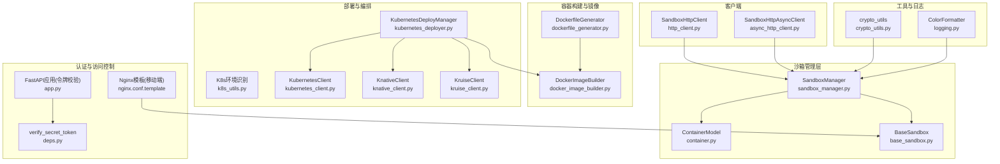
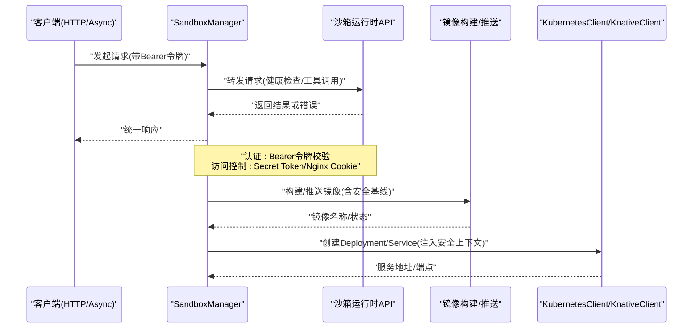
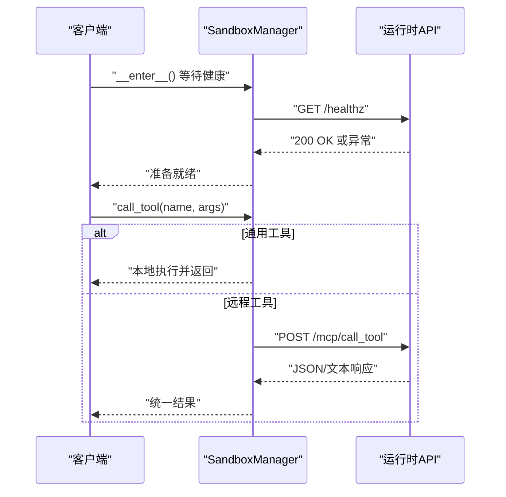
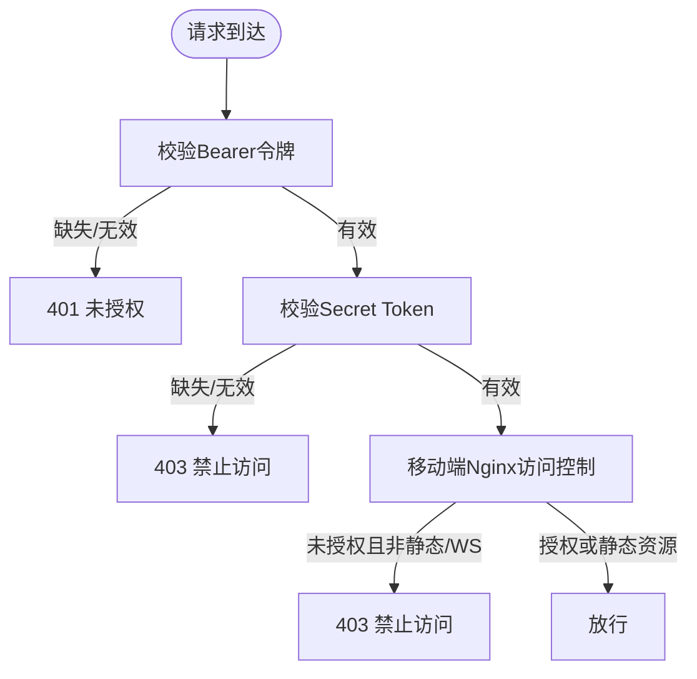
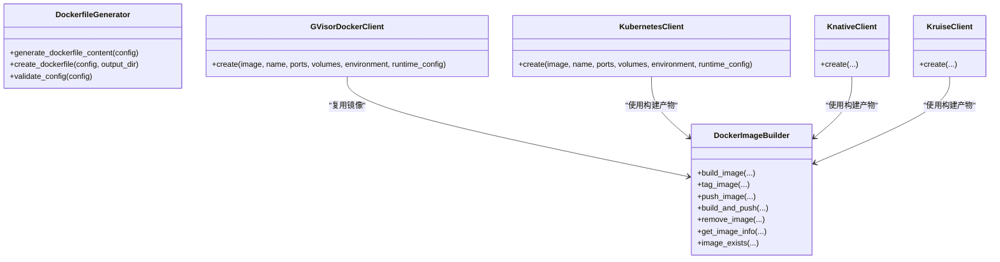
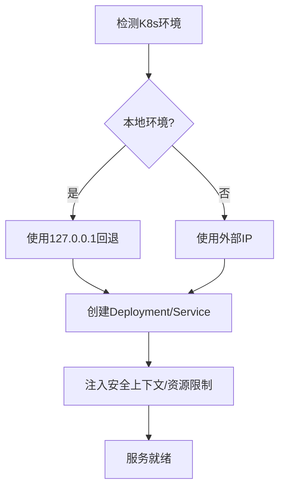
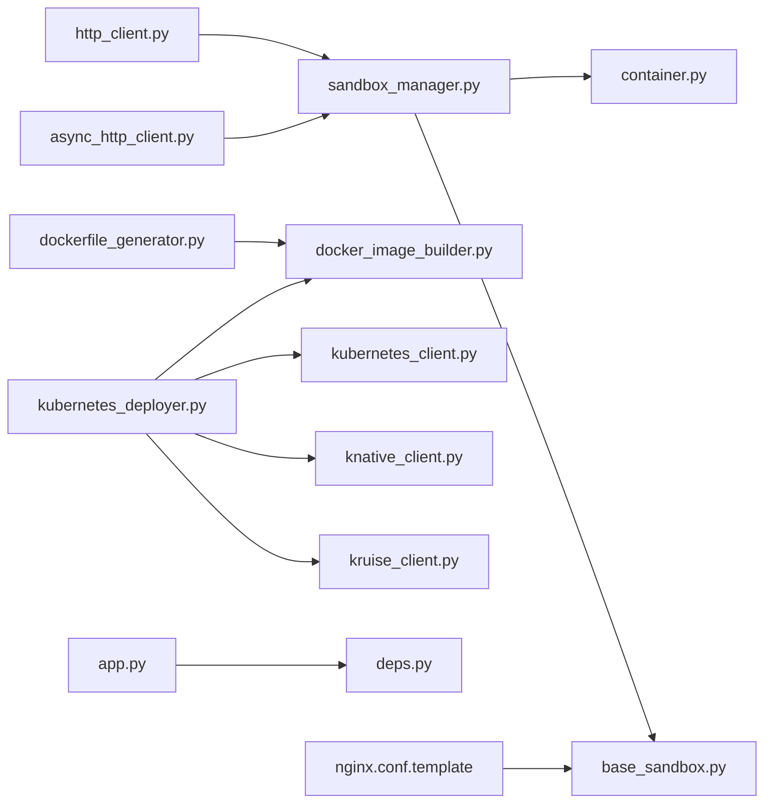

# 安全架构

<cite>
**本文引用的文件**
- [http_client.py](file://src/agentscope_runtime/sandbox/client/http_client.py)
- [async_http_client.py](file://src/agentscope_runtime/sandbox/client/async_http_client.py)
- [container.py](file://src/agentscope_runtime/sandbox/model/container.py)
- [base_sandbox.py](file://src/agentscope_runtime/sandbox/box/base/base_sandbox.py)
- [sandbox_manager.py](file://src/agentscope_runtime/sandbox/manager/sandbox_manager.py)
- [crypto_utils.py](file://src/agentscope_runtime/tools/utils/crypto_utils.py)
- [logging.py](file://src/agentscope_runtime/common/utils/logging.py)
- [deps.py](file://src/agentscope_runtime/sandbox/box/shared/dependencies/deps.py)
- [app.py](file://src/agentscope_runtime/sandbox/manager/server/app.py)
- [kubernetes_deployer.py](file://src/agentscope_runtime/engine/deployers/kubernetes_deployer.py)
- [k8s_utils.py](file://src/agentscope_runtime/engine/deployers/utils/k8s_utils.py)
- [dockerfile_generator.py](file://src/agentscope_runtime/engine/deployers/utils/docker_image_utils/dockerfile_generator.py)
- [docker_image_builder.py](file://src/agentscope_runtime/engine/deployers/utils/docker_image_utils/docker_image_builder.py)
- [nginx.conf.template](file://src/agentscope_runtime/sandbox/box/mobile/box/config/nginx.conf.template)
- [exception.py](file://src/agentscope_runtime/engine/schemas/exception.py)
- [gvisor_client.py](file://src/agentscope_runtime/common/container_clients/gvisor_client.py)
- [kubernetes_client.py](file://src/agentscope_runtime/common/container_clients/kubernetes_client.py)
- [knative_client.py](file://src/agentscope_runtime/common/container_clients/knative_client.py)
- [kruise_client.py](file://src/agentscope_runtime/common/container_clients/kruise_client.py)
- [build.py](file://src/agentscope_runtime/sandbox/build.py)
- [advanced.md](file://cookbook/en/sandbox/advanced.md)
</cite>

## 目录
1. [引言](#引言)
2. [项目结构](#项目结构)
3. [核心组件](#核心组件)
4. [架构总览](#架构总览)
5. [详细组件分析](#详细组件分析)
6. [依赖分析](#依赖分析)
7. [性能考虑](#性能考虑)
8. [故障排查指南](#故障排查指南)
9. [结论](#结论)
10. [附录](#附录)

## 引言
本文件面向AgentScope Runtime的安全架构，系统性阐述沙箱安全隔离机制、容器安全配置与访问控制策略，并深入解析Docker容器安全、Kubernetes安全上下文与网络隔离机制；同时覆盖HTTP客户端的安全通信、认证授权与数据加密要点，以及安全审计、日志记录与威胁检测机制，最后给出安全配置最佳实践、漏洞防护与应急响应策略，以及安全合规与风险评估的指导原则。

## 项目结构
围绕安全主题的关键目录与文件包括：
- 客户端层：同步与异步HTTP客户端，负责与沙箱运行时API交互
- 沙箱管理层：容器生命周期管理、心跳扫描、远程调用封装
- 沙箱类型与模型：容器模型、沙箱注册与类型定义
- 容器构建与镜像：Dockerfile生成、镜像构建与推送
- 部署与编排：Kubernetes部署器、本地环境识别、安全上下文注入
- 认证与访问控制：Bearer令牌校验、Nginx侧访问控制
- 工具与日志：加密工具、日志格式化
- 文档与对比：安全隔离能力对比参考

图表来源
- [http_client.py:20-207](file://src/agentscope_runtime/sandbox/client/http_client.py#L20-L207)
- [async_http_client.py:18-216](file://src/agentscope_runtime/sandbox/client/async_http_client.py#L18-L216)
- [sandbox_manager.py:140-800](file://src/agentscope_runtime/sandbox/manager/sandbox_manager.py#L140-L800)
- [container.py:19-158](file://src/agentscope_runtime/sandbox/model/container.py#L19-L158)
- [base_sandbox.py:11-102](file://src/agentscope_runtime/sandbox/box/base/base_sandbox.py#L11-L102)
- [dockerfile_generator.py:28-254](file://src/agentscope_runtime/engine/deployers/utils/docker_image_utils/dockerfile_generator.py#L28-L254)
- [docker_image_builder.py:41-451](file://src/agentscope_runtime/engine/deployers/utils/docker_image_utils/docker_image_builder.py#L41-L451)
- [kubernetes_deployer.py:48-391](file://src/agentscope_runtime/engine/deployers/kubernetes_deployer.py#L48-L391)
- [k8s_utils.py:12-242](file://src/agentscope_runtime/engine/deployers/utils/k8s_utils.py#L12-L242)
- [kubernetes_client.py:263-301](file://src/agentscope_runtime/common/container_clients/kubernetes_client.py#L263-L301)
- [knative_client.py:293-332](file://src/agentscope_runtime/common/container_clients/knative_client.py#L293-L332)
- [kruise_client.py:176-210](file://src/agentscope_runtime/common/container_clients/kruise_client.py#L176-L210)
- [deps.py:10-23](file://src/agentscope_runtime/sandbox/box/shared/dependencies/deps.py#L10-L23)
- [nginx.conf.template:46-76](file://src/agentscope_runtime/sandbox/box/mobile/box/config/nginx.conf.template#L46-L76)
- [app.py:116-175](file://src/agentscope_runtime/sandbox/manager/server/app.py#L116-L175)
- [crypto_utils.py:17-100](file://src/agentscope_runtime/tools/utils/crypto_utils.py#L17-L100)
- [logging.py:6-45](file://src/agentscope_runtime/common/utils/logging.py#L6-L45)

章节来源
- [http_client.py:20-207](file://src/agentscope_runtime/sandbox/client/http_client.py#L20-L207)
- [async_http_client.py:18-216](file://src/agentscope_runtime/sandbox/client/async_http_client.py#L18-L216)
- [sandbox_manager.py:140-800](file://src/agentscope_runtime/sandbox/manager/sandbox_manager.py#L140-L800)
- [container.py:19-158](file://src/agentscope_runtime/sandbox/model/container.py#L19-L158)
- [base_sandbox.py:11-102](file://src/agentscope_runtime/sandbox/box/base/base_sandbox.py#L11-L102)
- [dockerfile_generator.py:28-254](file://src/agentscope_runtime/engine/deployers/utils/docker_image_utils/dockerfile_generator.py#L28-L254)
- [docker_image_builder.py:41-451](file://src/agentscope_runtime/engine/deployers/utils/docker_image_utils/docker_image_builder.py#L41-L451)
- [kubernetes_deployer.py:48-391](file://src/agentscope_runtime/engine/deployers/kubernetes_deployer.py#L48-L391)
- [k8s_utils.py:12-242](file://src/agentscope_runtime/engine/deployers/utils/k8s_utils.py#L12-L242)
- [kubernetes_client.py:263-301](file://src/agentscope_runtime/common/container_clients/kubernetes_client.py#L263-L301)
- [knative_client.py:293-332](file://src/agentscope_runtime/common/container_clients/knative_client.py#L293-L332)
- [kruise_client.py:176-210](file://src/agentscope_runtime/common/container_clients/kruise_client.py#L176-L210)
- [deps.py:10-23](file://src/agentscope_runtime/sandbox/box/shared/dependencies/deps.py#L10-L23)
- [nginx.conf.template:46-76](file://src/agentscope_runtime/sandbox/box/mobile/box/config/nginx.conf.template#L46-L76)
- [app.py:116-175](file://src/agentscope_runtime/sandbox/manager/server/app.py#L116-L175)
- [crypto_utils.py:17-100](file://src/agentscope_runtime/tools/utils/crypto_utils.py#L17-L100)
- [logging.py:6-45](file://src/agentscope_runtime/common/utils/logging.py#L6-L45)

## 核心组件
- 容器模型与状态机：统一描述容器标识、URL、端口、挂载路径、运行时令牌、版本、会话上下文、心跳与回收时间戳等，支持兼容字段与默认值填充，便于跨组件传递与持久化。
- 客户端层：同步与异步HTTP客户端，封装健康检查、超时控制、错误处理与统一返回格式，确保对沙箱运行时API的稳定访问。
- 沙箱管理层：实现容器池化、心跳扫描、实例上限控制、远程/本地模式切换、工作区与存储抽象，提供清理、创建、从池中获取等核心能力。
- 构建与镜像：Dockerfile生成器提供非root用户、健康检查、平台参数、环境变量注入等安全基线；镜像构建器提供构建、打标签、推送、存在性检查等能力。
- 部署与编排：Kubernetes部署器负责镜像构建与推送、Deployment/Service创建、端点选择（本地回退）、状态查询；K8s工具用于本地/云端环境识别；KubernetesClient/KnativeClient/KruiseClient注入安全上下文与资源限制。
- 认证与访问控制：FastAPI应用通过Bearer令牌校验；共享依赖模块提供Secret Token校验；移动端Nginx模板实现基于Cookie的访问控制与静态资源放行。
- 加密与日志：加密工具支持私钥格式转换；日志格式化提供彩色输出与路径简化，便于审计与问题定位。

章节来源
- [container.py:19-158](file://src/agentscope_runtime/sandbox/model/container.py#L19-L158)
- [http_client.py:20-207](file://src/agentscope_runtime/sandbox/client/http_client.py#L20-L207)
- [async_http_client.py:18-216](file://src/agentscope_runtime/sandbox/client/async_http_client.py#L18-L216)
- [sandbox_manager.py:140-800](file://src/agentscope_runtime/sandbox/manager/sandbox_manager.py#L140-L800)
- [dockerfile_generator.py:28-254](file://src/agentscope_runtime/engine/deployers/utils/docker_image_utils/dockerfile_generator.py#L28-L254)
- [docker_image_builder.py:41-451](file://src/agentscope_runtime/engine/deployers/utils/docker_image_utils/docker_image_builder.py#L41-L451)
- [kubernetes_deployer.py:48-391](file://src/agentscope_runtime/engine/deployers/kubernetes_deployer.py#L48-L391)
- [k8s_utils.py:12-242](file://src/agentscope_runtime/engine/deployers/utils/k8s_utils.py#L12-L242)
- [kubernetes_client.py:263-301](file://src/agentscope_runtime/common/container_clients/kubernetes_client.py#L263-L301)
- [knative_client.py:293-332](file://src/agentscope_runtime/common/container_clients/knative_client.py#L293-L332)
- [kruise_client.py:176-210](file://src/agentscope_runtime/common/container_clients/kruise_client.py#L176-L210)
- [deps.py:10-23](file://src/agentscope_runtime/sandbox/box/shared/dependencies/deps.py#L10-L23)
- [nginx.conf.template:46-76](file://src/agentscope_runtime/sandbox/box/mobile/box/config/nginx.conf.template#L46-L76)
- [app.py:116-175](file://src/agentscope_runtime/sandbox/manager/server/app.py#L116-L175)
- [crypto_utils.py:17-100](file://src/agentscope_runtime/tools/utils/crypto_utils.py#L17-L100)
- [logging.py:6-45](file://src/agentscope_runtime/common/utils/logging.py#L6-L45)

## 架构总览
下图展示从客户端到沙箱运行时、再到容器编排与安全上下文的整体流程，强调认证、访问控制与隔离边界。

图表来源
- [http_client.py:51-120](file://src/agentscope_runtime/sandbox/client/http_client.py#L51-L120)
- [async_http_client.py:51-152](file://src/agentscope_runtime/sandbox/client/async_http_client.py#L51-L152)
- [sandbox_manager.py:344-442](file://src/agentscope_runtime/sandbox/manager/sandbox_manager.py#L344-L442)
- [app.py:116-175](file://src/agentscope_runtime/sandbox/manager/server/app.py#L116-L175)
- [deps.py:10-23](file://src/agentscope_runtime/sandbox/box/shared/dependencies/deps.py#L10-L23)
- [docker_image_builder.py:323-366](file://src/agentscope_runtime/engine/deployers/utils/docker_image_utils/docker_image_builder.py#L323-L366)
- [kubernetes_client.py:263-301](file://src/agentscope_runtime/common/container_clients/kubernetes_client.py#L263-L301)

## 详细组件分析

### 客户端安全通信与错误处理
- 同步与异步HTTP客户端均提供健康检查、统一超时、异常捕获与结构化错误返回，避免泄露底层异常细节。
- 客户端在进入/退出上下文时等待运行时健康状态，确保操作前服务可用。
- 对于工具调用与通用工具（如IPython执行、Shell命令），客户端进行类型判断与本地方法分发，减少不必要的远程调用。

图表来源
- [http_client.py:43-96](file://src/agentscope_runtime/sandbox/client/http_client.py#L43-L96)
- [async_http_client.py:43-103](file://src/agentscope_runtime/sandbox/client/async_http_client.py#L43-L103)
- [sandbox_manager.py:344-442](file://src/agentscope_runtime/sandbox/manager/sandbox_manager.py#L344-L442)

章节来源
- [http_client.py:20-207](file://src/agentscope_runtime/sandbox/client/http_client.py#L20-L207)
- [async_http_client.py:18-216](file://src/agentscope_runtime/sandbox/client/async_http_client.py#L18-L216)
- [sandbox_manager.py:344-442](file://src/agentscope_runtime/sandbox/manager/sandbox_manager.py#L344-L442)

### 认证与访问控制
- Bearer令牌校验：FastAPI应用在依赖链中验证Bearer令牌，未配置时记录警告并跳过校验；令牌不匹配时返回401并提示WWW-Authenticate头。
- Secret Token校验：共享依赖模块提供基于Header的Secret Token校验，若缺失或不正确则拒绝访问。
- 移动端Nginx访问控制：模板中对未携带有效会话Cookie的请求进行拦截，仅允许特定静态资源与WebSocket升级路径，其他HTTP请求直接403。
- gVisor运行时强制：通过DockerClient扩展强制使用runsc运行时，提升本地容器逃逸风险抵御能力。

图表来源
- [app.py:116-175](file://src/agentscope_runtime/sandbox/manager/server/app.py#L116-L175)
- [deps.py:10-23](file://src/agentscope_runtime/sandbox/box/shared/dependencies/deps.py#L10-L23)
- [nginx.conf.template:46-76](file://src/agentscope_runtime/sandbox/box/mobile/box/config/nginx.conf.template#L46-L76)
- [gvisor_client.py:8-38](file://src/agentscope_runtime/common/container_clients/gvisor_client.py#L8-L38)

章节来源
- [app.py:116-175](file://src/agentscope_runtime/sandbox/manager/server/app.py#L116-L175)
- [deps.py:10-23](file://src/agentscope_runtime/sandbox/box/shared/dependencies/deps.py#L10-L23)
- [nginx.conf.template:46-76](file://src/agentscope_runtime/sandbox/box/mobile/box/config/nginx.conf.template#L46-L76)
- [gvisor_client.py:8-38](file://src/agentscope_runtime/common/container_clients/gvisor_client.py#L8-L38)

### 容器安全与隔离
- 非root用户与健康检查：Dockerfile生成器默认以非root用户运行应用，设置健康检查端点，降低权限滥用与不可用风险。
- 平台与镜像源优化：支持指定平台、可选阿里云镜像源，减少构建时网络与供应链风险。
- gVisor运行时：通过runsc运行时显著降低容器逃逸风险，适用于高安全性本地运行场景。
- 安全上下文注入：Kubernetes/Knative/Kruise客户端支持注入安全上下文、资源限制、节点选择器、容忍度与镜像拉取密钥，强化Pod级隔离与权限控制。

图表来源
- [dockerfile_generator.py:28-254](file://src/agentscope_runtime/engine/deployers/utils/docker_image_utils/dockerfile_generator.py#L28-L254)
- [docker_image_builder.py:41-451](file://src/agentscope_runtime/engine/deployers/utils/docker_image_utils/docker_image_builder.py#L41-L451)
- [gvisor_client.py:8-38](file://src/agentscope_runtime/common/container_clients/gvisor_client.py#L8-L38)
- [kubernetes_client.py:263-301](file://src/agentscope_runtime/common/container_clients/kubernetes_client.py#L263-L301)
- [knative_client.py:293-332](file://src/agentscope_runtime/common/container_clients/knative_client.py#L293-L332)
- [kruise_client.py:176-210](file://src/agentscope_runtime/common/container_clients/kruise_client.py#L176-L210)

章节来源
- [dockerfile_generator.py:28-254](file://src/agentscope_runtime/engine/deployers/utils/docker_image_utils/dockerfile_generator.py#L28-L254)
- [docker_image_builder.py:41-451](file://src/agentscope_runtime/engine/deployers/utils/docker_image_utils/docker_image_builder.py#L41-L451)
- [gvisor_client.py:8-38](file://src/agentscope_runtime/common/container_clients/gvisor_client.py#L8-L38)
- [kubernetes_client.py:263-301](file://src/agentscope_runtime/common/container_clients/kubernetes_client.py#L263-L301)
- [knative_client.py:293-332](file://src/agentscope_runtime/common/container_clients/knative_client.py#L293-L332)
- [kruise_client.py:176-210](file://src/agentscope_runtime/common/container_clients/kruise_client.py#L176-L210)

### Kubernetes安全上下文与网络隔离
- 环境识别：自动识别本地/云端K8s环境，本地环境回退到127.0.0.1访问，避免LoadBalancer不可达问题。
- 资源与安全：通过runtime_config注入安全上下文、资源限制、节点亲和/容忍、镜像拉取密钥，实现最小权限与隔离。
- 端点选择：根据外部IP与端口动态选择服务访问地址，兼顾本地开发与生产环境可达性。

图表来源
- [k8s_utils.py:12-242](file://src/agentscope_runtime/engine/deployers/utils/k8s_utils.py#L12-L242)
- [kubernetes_deployer.py:72-121](file://src/agentscope_runtime/engine/deployers/kubernetes_deployer.py#L72-L121)
- [kubernetes_client.py:263-301](file://src/agentscope_runtime/common/container_clients/kubernetes_client.py#L263-L301)
- [knative_client.py:293-332](file://src/agentscope_runtime/common/container_clients/knative_client.py#L293-L332)
- [kruise_client.py:176-210](file://src/agentscope_runtime/common/container_clients/kruise_client.py#L176-L210)

章节来源
- [k8s_utils.py:12-242](file://src/agentscope_runtime/engine/deployers/utils/k8s_utils.py#L12-L242)
- [kubernetes_deployer.py:72-121](file://src/agentscope_runtime/engine/deployers/kubernetes_deployer.py#L72-L121)
- [kubernetes_client.py:263-301](file://src/agentscope_runtime/common/container_clients/kubernetes_client.py#L263-L301)
- [knative_client.py:293-332](file://src/agentscope_runtime/common/container_clients/knative_client.py#L293-L332)
- [kruise_client.py:176-210](file://src/agentscope_runtime/common/container_clients/kruise_client.py#L176-L210)

### 数据加密与密钥管理
- 私钥格式转换：提供将未知格式私钥转换为PKCS#1 PEM格式的能力，便于与下游加密库兼容。
- 日志输出：彩色日志格式化，便于在终端中快速识别级别与来源文件，辅助审计与排障。

章节来源
- [crypto_utils.py:17-100](file://src/agentscope_runtime/tools/utils/crypto_utils.py#L17-L100)
- [logging.py:6-45](file://src/agentscope_runtime/common/utils/logging.py#L6-L45)

### 安全异常与错误处理
- 统一异常体系：包含认证失败、令牌过期/无效、权限不足等业务异常，便于前端与SDK一致处理。
- 客户端错误包装：HTTP客户端在异常时返回结构化错误对象，避免泄露内部栈信息。

章节来源
- [exception.py:215-251](file://src/agentscope_runtime/engine/schemas/exception.py#L215-L251)
- [http_client.py:64-69](file://src/agentscope_runtime/sandbox/client/http_client.py#L64-L69)
- [async_http_client.py:66-71](file://src/agentscope_runtime/sandbox/client/async_http_client.py#L66-L71)

### 沙箱类型与隔离能力对比
- 官方文档对比：涵盖Docker、gVisor、BoxLite、Kubernetes、AgentRun、FC、ACK、Firecracker等后端的隔离能力、启动时间、是否需要守护进程、OCI支持、可嵌入性、操作系统支持与适用场景，帮助选择合适的安全隔离强度。

章节来源
- [advanced.md:129-143](file://cookbook/en/sandbox/advanced.md#L129-L143)

## 依赖分析
- 客户端与管理器：HTTP客户端依赖SandboxManager进行远程调用封装；管理器在本地模式下启动watcher线程进行心跳与池化扫描。
- 构建与部署：Dockerfile生成器与镜像构建器被部署器复用；Kubernetes/Knative/Kruise客户端消费构建产物并注入安全上下文。
- 认证链路：FastAPI应用依赖Bearer令牌校验；共享依赖模块提供Secret Token校验；移动端Nginx模板作为边缘访问控制补充。

图表来源
- [http_client.py:20-207](file://src/agentscope_runtime/sandbox/client/http_client.py#L20-L207)
- [async_http_client.py:18-216](file://src/agentscope_runtime/sandbox/client/async_http_client.py#L18-L216)
- [sandbox_manager.py:140-800](file://src/agentscope_runtime/sandbox/manager/sandbox_manager.py#L140-L800)
- [container.py:19-158](file://src/agentscope_runtime/sandbox/model/container.py#L19-L158)
- [base_sandbox.py:11-102](file://src/agentscope_runtime/sandbox/box/base/base_sandbox.py#L11-L102)
- [dockerfile_generator.py:28-254](file://src/agentscope_runtime/engine/deployers/utils/docker_image_utils/dockerfile_generator.py#L28-L254)
- [docker_image_builder.py:41-451](file://src/agentscope_runtime/engine/deployers/utils/docker_image_utils/docker_image_builder.py#L41-L451)
- [kubernetes_deployer.py:48-391](file://src/agentscope_runtime/engine/deployers/kubernetes_deployer.py#L48-L391)
- [kubernetes_client.py:263-301](file://src/agentscope_runtime/common/container_clients/kubernetes_client.py#L263-L301)
- [knative_client.py:293-332](file://src/agentscope_runtime/common/container_clients/knative_client.py#L293-L332)
- [kruise_client.py:176-210](file://src/agentscope_runtime/common/container_clients/kruise_client.py#L176-L210)
- [app.py:116-175](file://src/agentscope_runtime/sandbox/manager/server/app.py#L116-L175)
- [deps.py:10-23](file://src/agentscope_runtime/sandbox/box/shared/dependencies/deps.py#L10-L23)
- [nginx.conf.template:46-76](file://src/agentscope_runtime/sandbox/box/mobile/box/config/nginx.conf.template#L46-L76)

章节来源
- [sandbox_manager.py:444-507](file://src/agentscope_runtime/sandbox/manager/sandbox_manager.py#L444-L507)
- [kubernetes_deployer.py:126-312](file://src/agentscope_runtime/engine/deployers/kubernetes_deployer.py#L126-L312)

## 性能考虑
- 客户端超时与健康检查：合理设置超时与重试策略，避免长时间阻塞；健康检查周期与失败阈值需结合实际负载调整。
- 池化与回收：通过心跳扫描与池队列减少冷启动开销；实例上限控制防止资源耗尽。
- 镜像构建缓存：启用构建缓存与平台参数，缩短构建时间；镜像推送采用流式输出，便于CI可视化。
- K8s调度与副本：副本数与资源配额平衡吞吐与隔离；本地环境回退避免LB不可达导致的额外延迟。

## 故障排查指南
- 认证失败
  - 检查Bearer令牌是否配置、是否过期或与后端不一致；查看401响应与WWW-Authenticate头。
  - 参考：[app.py:116-175](file://src/agentscope_runtime/sandbox/manager/server/app.py#L116-L175)
- 访问被拒
  - 检查Secret Token是否正确设置与传递；移动端Nginx是否要求有效会话Cookie。
  - 参考：[deps.py:10-23](file://src/agentscope_runtime/sandbox/box/shared/dependencies/deps.py#L10-L23)，[nginx.conf.template:46-76](file://src/agentscope_runtime/sandbox/box/mobile/box/config/nginx.conf.template#L46-L76)
- 客户端异常
  - 查看HTTP客户端的统一错误返回结构；确认健康检查端点可达与超时设置合理。
  - 参考：[http_client.py:51-96](file://src/agentscope_runtime/sandbox/client/http_client.py#L51-L96)，[async_http_client.py:51-103](file://src/agentscope_runtime/sandbox/client/async_http_client.py#L51-L103)
- 镜像构建失败
  - 检查构建命令、平台参数与镜像源配置；确认Docker可用与权限充足。
  - 参考：[docker_image_builder.py:54-68](file://src/agentscope_runtime/engine/deployers/utils/docker_image_utils/docker_image_builder.py#L54-L68)
- K8s部署异常
  - 使用本地环境识别逻辑确认端点回退；检查安全上下文、资源配额与镜像拉取密钥。
  - 参考：[k8s_utils.py:12-242](file://src/agentscope_runtime/engine/deployers/utils/k8s_utils.py#L12-L242)，[kubernetes_client.py:263-301](file://src/agentscope_runtime/common/container_clients/kubernetes_client.py#L263-L301)

章节来源
- [app.py:116-175](file://src/agentscope_runtime/sandbox/manager/server/app.py#L116-L175)
- [deps.py:10-23](file://src/agentscope_runtime/sandbox/box/shared/dependencies/deps.py#L10-L23)
- [nginx.conf.template:46-76](file://src/agentscope_runtime/sandbox/box/mobile/box/config/nginx.conf.template#L46-L76)
- [http_client.py:51-96](file://src/agentscope_runtime/sandbox/client/http_client.py#L51-L96)
- [async_http_client.py:51-103](file://src/agentscope_runtime/sandbox/client/async_http_client.py#L51-L103)
- [docker_image_builder.py:54-68](file://src/agentscope_runtime/engine/deployers/utils/docker_image_utils/docker_image_builder.py#L54-L68)
- [k8s_utils.py:12-242](file://src/agentscope_runtime/engine/deployers/utils/k8s_utils.py#L12-L242)
- [kubernetes_client.py:263-301](file://src/agentscope_runtime/common/container_clients/kubernetes_client.py#L263-L301)

## 结论
AgentScope Runtime通过“客户端-沙箱管理-容器构建-编排与安全上下文”的完整链路，实现了多层级的安全隔离与访问控制。在本地场景采用gVisor降低逃逸风险，在集群场景通过K8s安全上下文与资源限制强化隔离；在边缘与移动端通过Nginx与Secret Token实现细粒度访问控制；在通信层面通过Bearer令牌与结构化错误处理保障安全与可观测性。建议在生产环境中优先启用gVisor或K8s安全上下文，严格管理密钥与令牌，完善日志与审计，并定期进行漏洞扫描与合规评估。

## 附录
- 安全配置最佳实践
  - 始终使用非root用户运行容器，启用健康检查与只读根文件系统。
  - 在K8s中启用SecurityContext、ResourceQuotas与NetworkPolicies，限制特权与网络访问。
  - 使用镜像拉取密钥与私有仓库TLS，避免明文传输。
  - 严格管理Bearer令牌与Secret Token，定期轮换并最小化暴露面。
- 漏洞防护
  - 定期更新基础镜像与依赖，启用镜像签名与SBOM。
  - 限制容器与Pod的权限，使用最小权限原则。
  - 在边缘网关与反向代理层实施速率限制与WAF规则。
- 应急响应策略
  - 建立事件分级与上报流程，结合日志与指标进行快速定位。
  - 制定容器与Pod紧急隔离、镜像回滚与配置恢复预案。
- 安全合规与风险评估
  - 基于官方对比文档选择合适隔离强度，满足合规要求。
  - 定期开展渗透测试与代码审计，覆盖容器镜像与运行时配置。