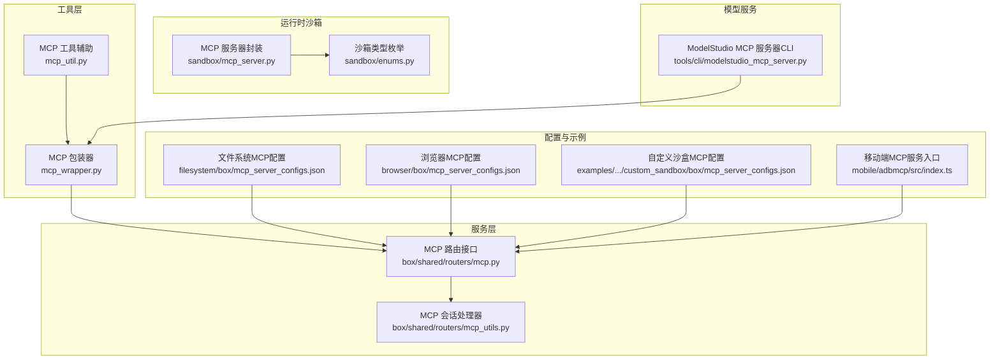
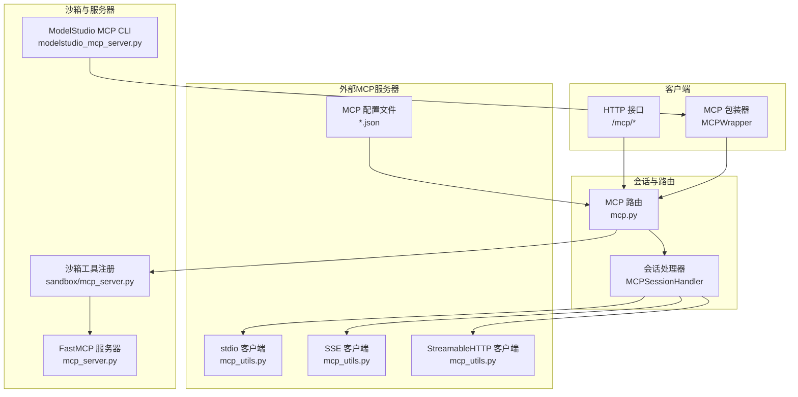
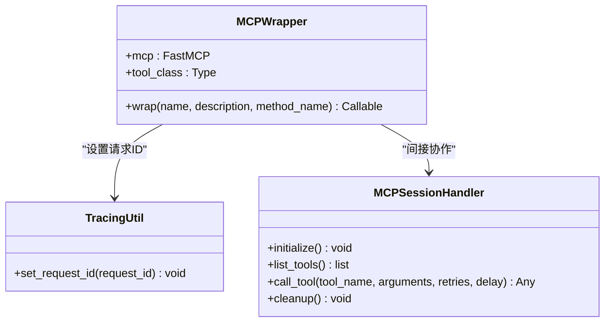
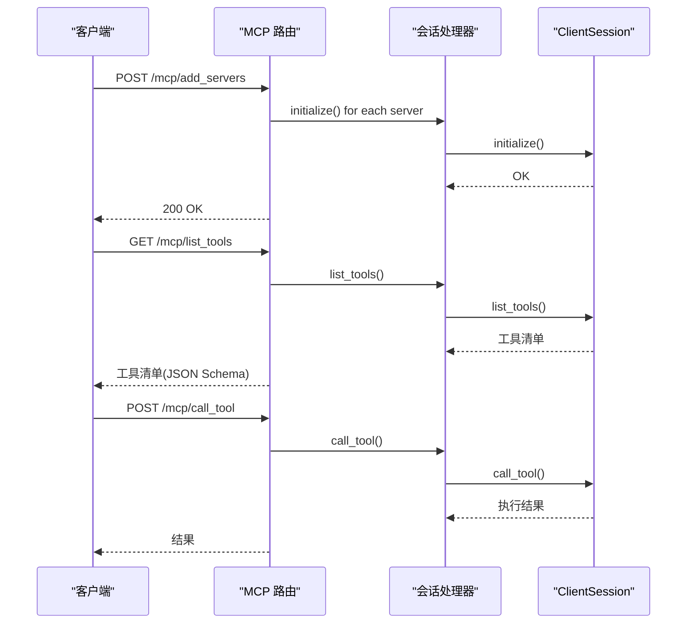
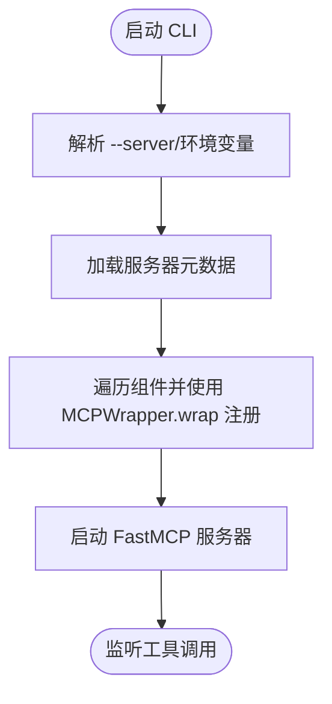
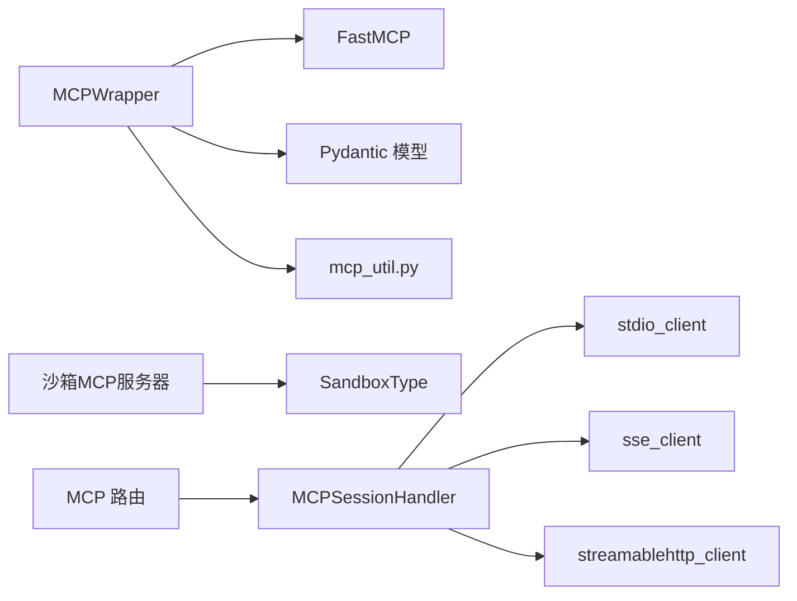

# MCP协议集成

<cite>
**本文引用的文件**
- [mcp_wrapper.py](file://src/agentscope_runtime/tools/mcp_wrapper.py)
- [mcp_server.py](file://src/agentscope_runtime/sandbox/mcp_server.py)
- [mcp.py](file://src/agentscope_runtime/sandbox/box/shared/routers/mcp.py)
- [mcp_utils.py](file://src/agentscope_runtime/sandbox/box/shared/routers/mcp_utils.py)
- [mcp_util.py](file://src/agentscope_runtime/tools/utils/mcp_util.py)
- [modelstudio_mcp_server.py](file://src/agentscope_runtime/tools/cli/modelstudio_mcp_server.py)
- [filesystem_mcp_server_configs.json](file://src/agentscope_runtime/sandbox/box/filesystem/box/mcp_server_configs.json)
- [browser_mcp_server_configs.json](file://src/agentscope_runtime/sandbox/box/browser/box/mcp_server_configs.json)
- [custom_sandbox_mcp_server_configs.json](file://examples/sandbox/custom_sandbox/box/mcp_server_configs.json)
- [enums.py](file://src/agentscope_runtime/sandbox/enums.py)
- [index.ts](file://src/agentscope_runtime/sandbox/box/mobile/adbmcp/src/index.ts)
</cite>

## 目录
1. [引言](#引言)
2. [项目结构](#项目结构)
3. [核心组件](#核心组件)
4. [架构总览](#架构总览)
5. [详细组件分析](#详细组件分析)
6. [依赖分析](#依赖分析)
7. [性能考虑](#性能考虑)
8. [故障排查指南](#故障排查指南)
9. [结论](#结论)
10. [附录](#附录)

## 引言
本技术文档围绕 AgentScope Runtime 的 MCP（Model Context Protocol）协议集成进行系统化梳理，覆盖协议工作原理、消息格式与通信机制；MCP 包装器的实现方式、工具适配与协议转换；ModelStudio MCP 服务器的启动配置、服务注册与客户端连接；MCP 工具的元数据管理、指令描述与组件发现机制；以及错误处理、重连机制与性能优化策略，并提供开发与调试指南。

## 项目结构
AgentScope Runtime 中与 MCP 相关的核心代码分布在以下模块：
- 工具层：MCP 包装器与工具适配
- 服务层：MCP 客户端会话管理与路由接口
- 运行时沙箱：MCP 服务器封装与工具注册
- 配置与示例：MCP 服务器配置文件与示例



图表来源
- [mcp_wrapper.py:1-216](file://src/agentscope_runtime/tools/mcp_wrapper.py#L1-L216)
- [mcp.py:1-208](file://src/agentscope_runtime/sandbox/box/shared/routers/mcp.py#L1-L208)
- [mcp_utils.py:1-188](file://src/agentscope_runtime/sandbox/box/shared/routers/mcp_utils.py#L1-L188)
- [mcp_server.py:1-192](file://src/agentscope_runtime/sandbox/mcp_server.py#L1-L192)
- [enums.py:61-79](file://src/agentscope_runtime/sandbox/enums.py#L61-L79)
- [filesystem_mcp_server_configs.json:1-12](file://src/agentscope_runtime/sandbox/box/filesystem/box/mcp_server_configs.json#L1-L12)
- [browser_mcp_server_configs.json:1-14](file://src/agentscope_runtime/sandbox/box/browser/box/mcp_server_configs.json#L1-L14)
- [custom_sandbox_mcp_server_configs.json:1-14](file://examples/sandbox/custom_sandbox/box/mcp_server_configs.json#L1-L14)
- [index.ts:1-21](file://src/agentscope_runtime/sandbox/box/mobile/adbmcp/src/index.ts#L1-L21)
- [modelstudio_mcp_server.py:1-79](file://src/agentscope_runtime/tools/cli/modelstudio_mcp_server.py#L1-L79)

章节来源
- [mcp_wrapper.py:1-216](file://src/agentscope_runtime/tools/mcp_wrapper.py#L1-L216)
- [mcp_server.py:1-192](file://src/agentscope_runtime/sandbox/mcp_server.py#L1-L192)
- [mcp.py:1-208](file://src/agentscope_runtime/sandbox/box/shared/routers/mcp.py#L1-L208)
- [mcp_utils.py:1-188](file://src/agentscope_runtime/sandbox/box/shared/routers/mcp_utils.py#L1-L188)
- [mcp_util.py:1-36](file://src/agentscope_runtime/tools/utils/mcp_util.py#L1-L36)
- [modelstudio_mcp_server.py:1-79](file://src/agentscope_runtime/tools/cli/modelstudio_mcp_server.py#L1-L79)
- [filesystem_mcp_server_configs.json:1-12](file://src/agentscope_runtime/sandbox/box/filesystem/box/mcp_server_configs.json#L1-L12)
- [browser_mcp_server_configs.json:1-14](file://src/agentscope_runtime/sandbox/box/browser/box/mcp_server_configs.json#L1-L14)
- [custom_sandbox_mcp_server_configs.json:1-14](file://examples/sandbox/custom_sandbox/box/mcp_server_configs.json#L1-L14)
- [enums.py:61-79](file://src/agentscope_runtime/sandbox/enums.py#L61-L79)
- [index.ts:1-21](file://src/agentscope_runtime/sandbox/box/mobile/adbmcp/src/index.ts#L1-L21)

## 核心组件
- MCP 包装器（MCPWrapper）
  - 将任意工具类包装为 MCP 工具，自动解析输入模型的字段类型与默认值，生成兼容 FastMCP 的异步函数签名，并注入请求追踪 ID。
- 沙箱 MCP 服务器（FastMCP）
  - 基于 FastMCP 提供工具注册能力，从沙箱实例动态生成工具函数签名，屏蔽 MCP 协议响应的外层包装，直接返回业务内容。
- MCP 客户端路由与会话管理
  - 提供 /mcp/add_servers、/mcp/list_tools、/mcp/call_tool 等接口，负责加载配置、初始化 MCP 服务器进程或 HTTP SSE/StreamableHTTP 客户端、列出工具、调用工具并支持重试。
- ModelStudio MCP 服务器 CLI
  - 通过环境变量与参数选择服务器名称，读取元数据中的组件列表，使用 MCPWrapper 注册为工具，支持指定传输类型（如 SSE）。
- 请求追踪与上下文
  - 从 MCP 上下文提取 DashScope 请求 ID，若不存在则生成新的 UUID，确保跨组件链路可追踪。

章节来源
- [mcp_wrapper.py:14-216](file://src/agentscope_runtime/tools/mcp_wrapper.py#L14-L216)
- [mcp_server.py:14-192](file://src/agentscope_runtime/sandbox/mcp_server.py#L14-L192)
- [mcp.py:24-208](file://src/agentscope_runtime/sandbox/box/shared/routers/mcp.py#L24-L208)
- [mcp_utils.py:32-188](file://src/agentscope_runtime/sandbox/box/shared/routers/mcp_utils.py#L32-L188)
- [modelstudio_mcp_server.py:15-79](file://src/agentscope_runtime/tools/cli/modelstudio_mcp_server.py#L15-L79)
- [mcp_util.py:10-36](file://src/agentscope_runtime/tools/utils/mcp_util.py#L10-L36)

## 架构总览
AgentScope Runtime 的 MCP 集成采用“工具适配 + 客户端路由 + 服务器封装”的分层设计：
- 工具适配层：将内部工具类转换为 MCP 工具，保证参数类型与默认值正确传递。
- 客户端路由层：统一暴露 HTTP 接口，负责 MCP 服务器的生命周期管理、工具发现与调用。
- 服务器封装层：在沙箱环境中以 FastMCP 或外部 MCP 服务器形式运行，提供工具注册与执行。
- 外部 MCP 服务器：通过 stdio、SSE 或 StreamableHTTP 与客户端交互，工具清单与调用结果由会话处理器统一管理。



图表来源
- [mcp.py:12-208](file://src/agentscope_runtime/sandbox/box/shared/routers/mcp.py#L12-L208)
- [mcp_utils.py:32-188](file://src/agentscope_runtime/sandbox/box/shared/routers/mcp_utils.py#L32-L188)
- [mcp_server.py:14-192](file://src/agentscope_runtime/sandbox/mcp_server.py#L14-L192)
- [modelstudio_mcp_server.py:15-79](file://src/agentscope_runtime/tools/cli/modelstudio_mcp_server.py#L15-L79)
- [filesystem_mcp_server_configs.json:1-12](file://src/agentscope_runtime/sandbox/box/filesystem/box/mcp_server_configs.json#L1-L12)
- [browser_mcp_server_configs.json:1-14](file://src/agentscope_runtime/sandbox/box/browser/box/mcp_server_configs.json#L1-L14)

## 详细组件分析

### MCP 包装器（MCPWrapper）
- 功能要点
  - 自动解析工具输入模型的字段类型与默认值，生成符合 FastMCP 签名的异步函数。
  - 对可选参数进行 None 值过滤，仅传递非空值给工具方法，避免覆盖默认值。
  - 在调用前从 MCP 上下文提取请求 ID 并注入到追踪系统，确保端到端可追踪。
  - 更新工具参数模式，移除内部上下文参数，避免对外暴露实现细节。
- 关键流程
  - 实例化工具类，基于输入模型字段构建函数签名。
  - 生成动态函数代码字符串并执行，得到可被 FastMCP 装饰器使用的异步函数。
  - 应用工具装饰器，更新工具参数模式，完成注册。



图表来源
- [mcp_wrapper.py:14-216](file://src/agentscope_runtime/tools/mcp_wrapper.py#L14-L216)
- [mcp_util.py:10-36](file://src/agentscope_runtime/tools/utils/mcp_util.py#L10-L36)
- [mcp_utils.py:32-188](file://src/agentscope_runtime/sandbox/box/shared/routers/mcp_utils.py#L32-L188)

章节来源
- [mcp_wrapper.py:27-216](file://src/agentscope_runtime/tools/mcp_wrapper.py#L27-L216)
- [mcp_util.py:10-36](file://src/agentscope_runtime/tools/utils/mcp_util.py#L10-L36)

### 沙箱 MCP 服务器（FastMCP）
- 功能要点
  - 从沙箱实例导出工具清单，动态生成函数签名并注册为 MCP 工具。
  - 将 MCP 协议响应中的 content/result/data 等字段抽取为实际内容，屏蔽协议包装。
  - 支持多种沙箱类型（基础、浏览器、文件系统），通过命令行参数选择。
- 关键流程
  - 解析命令行参数，确定沙箱类型与认证信息。
  - 初始化沙箱实例，遍历工具清单，为每个工具生成动态函数并应用装饰器。
  - 启动 FastMCP 服务器，等待客户端调用。

```mermaid
sequenceDiagram
participant CLI as "命令行"
participant Server as "沙箱MCP服务器"
participant Box as "沙箱实例"
participant MCP as "FastMCP"
CLI->>Server : 传入 --type/--base_url/--bearer_token
Server->>Box : 创建沙箱实例
Server->>Box : list_tools()
Box-->>Server : 返回工具清单
Server->>Server : 为每个工具生成动态函数
Server->>MCP : 注册工具装饰器
Server->>MCP : run()
MCP-->>CLI : 提供工具调用接口
```

图表来源
- [mcp_server.py:142-192](file://src/agentscope_runtime/sandbox/mcp_server.py#L142-L192)
- [mcp_server.py:109-140](file://src/agentscope_runtime/sandbox/mcp_server.py#L109-L140)

章节来源
- [mcp_server.py:14-192](file://src/agentscope_runtime/sandbox/mcp_server.py#L14-L192)
- [enums.py:61-79](file://src/agentscope_runtime/sandbox/enums.py#L61-L79)

### MCP 客户端路由与会话管理
- 功能要点
  - /mcp/add_servers：按配置启动 MCP 服务器（stdio/SSE/streamable_http），支持覆盖与失败清理。
  - /mcp/list_tools：聚合所有已注册服务器的工具清单，输出标准化 JSON Schema。
  - /mcp/call_tool：根据工具名在各服务器中定位并调用，支持重试与异常处理。
  - 生命周期事件：startup 自动加载配置并初始化服务器；shutdown 统一清理资源。
- 关键流程
  - 加载配置文件，构造 MCPSessionHandler 列表。
  - 逐个初始化会话，调用 list_tools 获取工具清单。
  - call_tool 时遍历工具集合，命中后通过对应会话执行工具并返回结果。



图表来源
- [mcp.py:24-170](file://src/agentscope_runtime/sandbox/box/shared/routers/mcp.py#L24-L170)
- [mcp_utils.py:43-172](file://src/agentscope_runtime/sandbox/box/shared/routers/mcp_utils.py#L43-L172)

章节来源
- [mcp.py:24-208](file://src/agentscope_runtime/sandbox/box/shared/routers/mcp.py#L24-L208)
- [mcp_utils.py:32-188](file://src/agentscope_runtime/sandbox/box/shared/routers/mcp_utils.py#L32-L188)

### ModelStudio MCP 服务器 CLI
- 功能要点
  - 通过 --server 或环境变量 SERVER_NAME 指定服务器名称，读取元数据中的组件列表。
  - 使用 MCPWrapper 将每个组件包装为 MCP 工具并注册。
  - 支持环境变量 OVERRIDE_NAME/OVERRIDE_DESCRIPTION 覆盖服务器名称与说明。
  - 支持 TRANSPORT 指定传输类型（如 SSE）。
- 关键流程
  - 解析参数与环境变量，获取服务器元数据。
  - 为每个组件创建 MCPWrapper 并调用 wrap 注册。
  - 启动 FastMCP 服务器并运行。



图表来源
- [modelstudio_mcp_server.py:15-79](file://src/agentscope_runtime/tools/cli/modelstudio_mcp_server.py#L15-L79)
- [mcp_wrapper.py:27-216](file://src/agentscope_runtime/tools/mcp_wrapper.py#L27-L216)

章节来源
- [modelstudio_mcp_server.py:15-79](file://src/agentscope_runtime/tools/cli/modelstudio_mcp_server.py#L15-L79)

### MCP 工具元数据与组件发现
- 元数据来源
  - 沙箱 MCP 服务器：通过沙箱实例的 list_tools 输出标准化 JSON Schema，包含工具名称、描述与参数模式。
  - 客户端路由：将各服务器工具聚合，去重并输出统一结构。
- 组件发现机制
  - 通过 FastMCP 装饰器注册的工具自动纳入发现范围。
  - 客户端路由在 startup 时自动加载配置文件并初始化相应服务器。

章节来源
- [mcp_server.py:109-140](file://src/agentscope_runtime/sandbox/mcp_server.py#L109-L140)
- [mcp.py:86-134](file://src/agentscope_runtime/sandbox/box/shared/routers/mcp.py#L86-L134)

### MCP 服务器配置与外部集成
- 配置文件
  - filesystem：通过 npx 启动 @modelcontextprotocol/server-filesystem，挂载工作区目录。
  - browser：通过 npx 启动 @playwright/mcp，加载 Playwright MCP 配置。
  - custom_sandbox：示例中展示如何为自定义沙盒添加 MCP 服务器配置。
- 外部 MCP 服务器接入
  - stdio：适用于本地可执行程序或 npm 包。
  - SSE/StreamableHTTP：适用于远程 HTTP 服务，支持超时与 SSE 读取超时配置。

章节来源
- [filesystem_mcp_server_configs.json:1-12](file://src/agentscope_runtime/sandbox/box/filesystem/box/mcp_server_configs.json#L1-L12)
- [browser_mcp_server_configs.json:1-14](file://src/agentscope_runtime/sandbox/box/browser/box/mcp_server_configs.json#L1-L14)
- [custom_sandbox_mcp_server_configs.json:1-14](file://examples/sandbox/custom_sandbox/box/mcp_server_configs.json#L1-L14)
- [mcp_utils.py:43-95](file://src/agentscope_runtime/sandbox/box/shared/routers/mcp_utils.py#L43-L95)

### 移动端 MCP 服务器（ADB）
- 通过 stdio 传输与 ADB 工具配合，启动 MCP 服务器并监听中断信号优雅退出。
- 适用于移动设备上的 MCP 服务场景。

章节来源
- [index.ts:7-21](file://src/agentscope_runtime/sandbox/box/mobile/adbmcp/src/index.ts#L7-L21)

## 依赖分析
- 组件耦合
  - MCPWrapper 依赖 FastMCP 与工具输入模型，同时通过 mcp_util 获取请求 ID 并注入追踪。
  - 沙箱 MCP 服务器依赖沙箱类型枚举与工具清单，动态生成函数签名。
  - 客户端路由依赖会话处理器，后者根据配置选择 stdio/SSE/StreamableHTTP 客户端。
- 外部依赖
  - mcp-sdk（FastMCP、ClientSession、stdio/SSE/streamable_http 客户端）。
  - Pydantic（用于模型字段解析与类型推断）。
  - FastAPI（路由与生命周期事件）。



图表来源
- [mcp_wrapper.py:6-12](file://src/agentscope_runtime/tools/mcp_wrapper.py#L6-L12)
- [mcp_server.py:6-10](file://src/agentscope_runtime/sandbox/mcp_server.py#L6-L10)
- [mcp.py:8-14](file://src/agentscope_runtime/sandbox/box/shared/routers/mcp.py#L8-L14)
- [mcp_utils.py:11-14](file://src/agentscope_runtime/sandbox/box/shared/routers/mcp_utils.py#L11-L14)

章节来源
- [mcp_wrapper.py:1-216](file://src/agentscope_runtime/tools/mcp_wrapper.py#L1-L216)
- [mcp_server.py:1-192](file://src/agentscope_runtime/sandbox/mcp_server.py#L1-L192)
- [mcp.py:1-208](file://src/agentscope_runtime/sandbox/box/shared/routers/mcp.py#L1-L208)
- [mcp_utils.py:1-188](file://src/agentscope_runtime/sandbox/box/shared/routers/mcp_utils.py#L1-L188)

## 性能考虑
- 参数传递优化
  - 仅传递非空可选参数，减少无效字段带来的序列化与网络开销。
- 超时与重试
  - SSE/StreamableHTTP 客户端支持超时与 SSE 读取超时配置，call_tool 支持重试次数与延迟，提升稳定性。
- 动态函数签名
  - 通过 inspect 生成精确签名，避免不必要的类型转换与反射成本。
- 日志与追踪
  - 在工具调用前注入请求 ID，便于定位性能瓶颈与问题根因。

章节来源
- [mcp_wrapper.py:137-167](file://src/agentscope_runtime/tools/mcp_wrapper.py#L137-L167)
- [mcp_utils.py:20-30](file://src/agentscope_runtime/sandbox/box/shared/routers/mcp_utils.py#L20-L30)
- [mcp_utils.py:132-172](file://src/agentscope_runtime/sandbox/box/shared/routers/mcp_utils.py#L132-L172)

## 故障排查指南
- 服务器初始化失败
  - 检查配置文件中的 command/args/url/type 是否正确，确认 npx 可用且网络可达。
  - 查看日志中“Failed to initialize server”定位具体原因。
- 工具未找到
  - 确认 /mcp/list_tools 返回中是否包含目标工具名，检查服务器是否成功注册。
- 调用异常与重试
  - 观察“Error executing tool”日志，确认 retries/delay 设置是否合理。
  - 若达到最大重试次数仍失败，检查远端 MCP 服务器状态与网络连通性。
- 生命周期清理
  - shutdown 事件应确保所有会话被正确关闭，避免资源泄漏。

章节来源
- [mcp.py:70-84](file://src/agentscope_runtime/sandbox/box/shared/routers/mcp.py#L70-L84)
- [mcp.py:165-169](file://src/agentscope_runtime/sandbox/box/shared/routers/mcp.py#L165-L169)
- [mcp_utils.py:174-188](file://src/agentscope_runtime/sandbox/box/shared/routers/mcp_utils.py#L174-L188)

## 结论
AgentScope Runtime 的 MCP 集成通过工具包装、客户端路由与服务器封装三层协同，实现了对本地与远程 MCP 服务器的统一接入与管理。其关键优势在于：
- 自动化的参数类型与默认值处理，降低协议适配复杂度；
- 统一的工具发现与调用接口，简化上层集成；
- 完善的生命周期管理与重试机制，保障稳定性；
- 可扩展的配置体系，支持多类 MCP 服务器与传输方式。

## 附录
- 开发指南
  - 新增 MCP 工具：实现工具类并提供输入模型，使用 MCPWrapper.wrap 注册。
  - 新增 MCP 服务器：在配置文件中添加服务器条目，或通过 /mcp/add_servers 动态注册。
  - 调试技巧：开启详细日志，结合请求 ID 追踪工具调用路径，利用重试参数定位瞬时故障。
- 参考路径
  - 工具包装器实现：[mcp_wrapper.py:27-216](file://src/agentscope_runtime/tools/mcp_wrapper.py#L27-L216)
  - 沙箱服务器封装：[mcp_server.py:109-192](file://src/agentscope_runtime/sandbox/mcp_server.py#L109-L192)
  - 客户端路由与会话：[mcp.py:24-208](file://src/agentscope_runtime/sandbox/box/shared/routers/mcp.py#L24-L208)、[mcp_utils.py:43-172](file://src/agentscope_runtime/sandbox/box/shared/routers/mcp_utils.py#L43-L172)
  - ModelStudio 服务器 CLI：[modelstudio_mcp_server.py:15-79](file://src/agentscope_runtime/tools/cli/modelstudio_mcp_server.py#L15-L79)
  - 配置文件示例：[filesystem_mcp_server_configs.json:1-12](file://src/agentscope_runtime/sandbox/box/filesystem/box/mcp_server_configs.json#L1-L12)、[browser_mcp_server_configs.json:1-14](file://src/agentscope_runtime/sandbox/box/browser/box/mcp_server_configs.json#L1-L14)、[custom_sandbox_mcp_server_configs.json:1-14](file://examples/sandbox/custom_sandbox/box/mcp_server_configs.json#L1-L14)