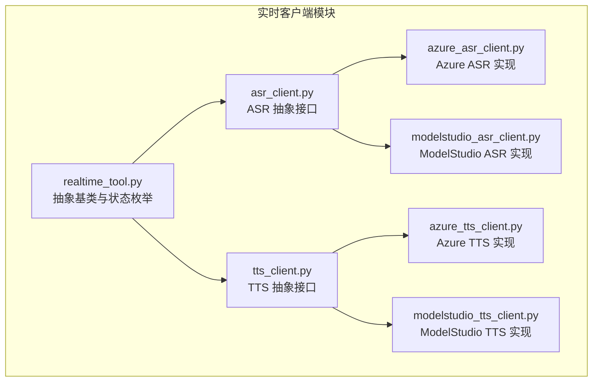
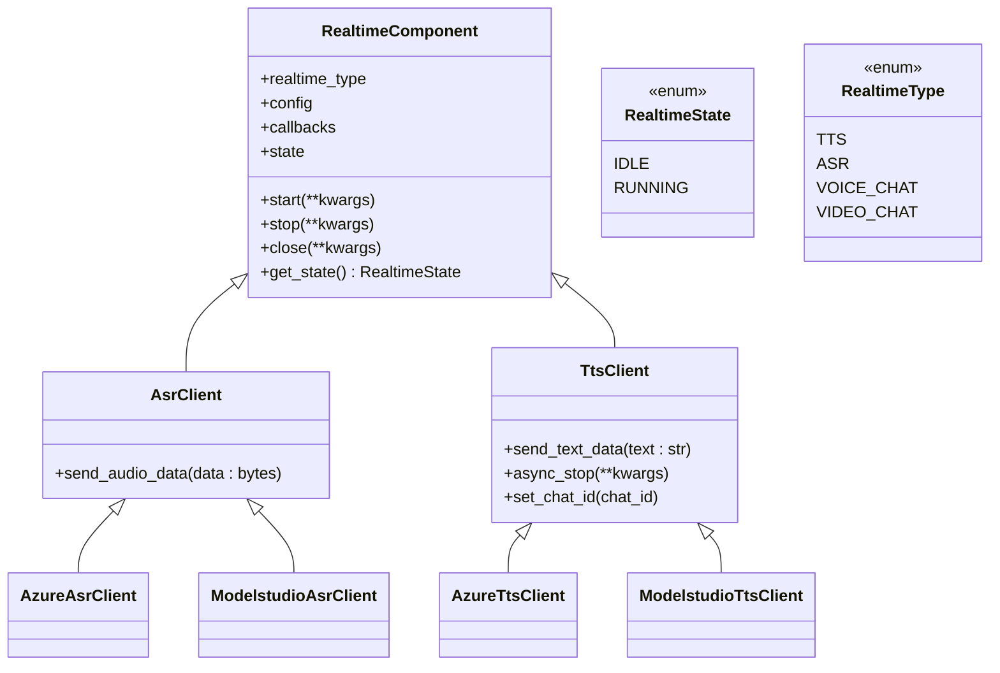
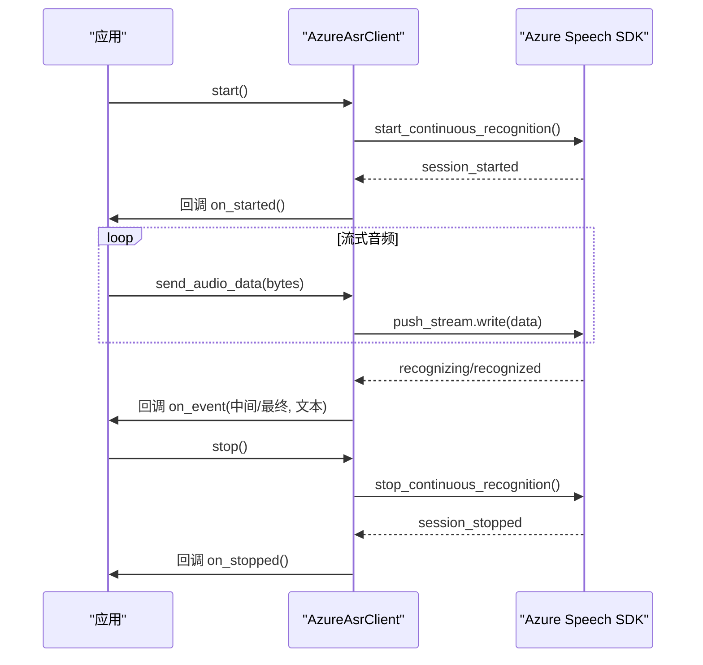
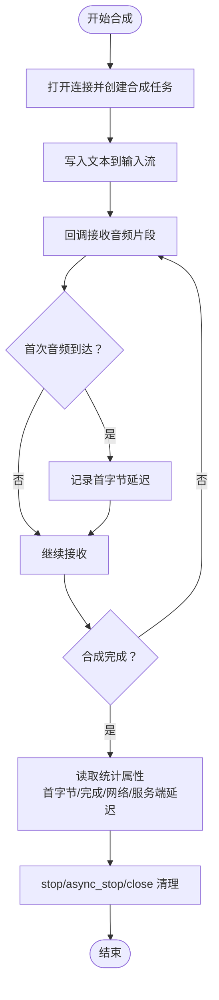
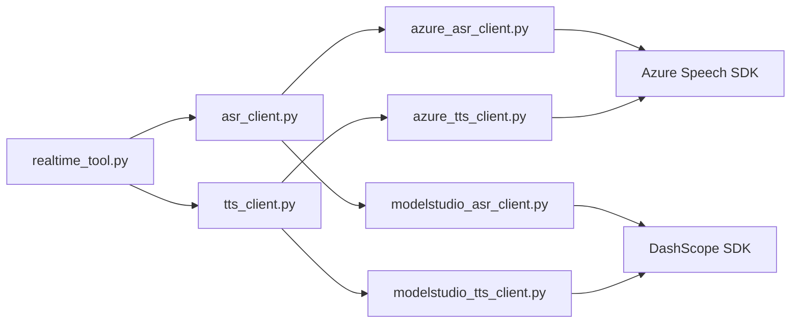

# 实时客户端工具

<cite>
**本文引用的文件**
- [src/agentscope_runtime/tools/realtime_clients/__init__.py](file://src/agentscope_runtime/tools/realtime_clients/__init__.py)
- [src/agentscope_runtime/tools/realtime_clients/realtime_tool.py](file://src/agentscope_runtime/tools/realtime_clients/realtime_tool.py)
- [src/agentscope_runtime/tools/realtime_clients/asr_client.py](file://src/agentscope_runtime/tools/realtime_clients/asr_client.py)
- [src/agentscope_runtime/tools/realtime_clients/tts_client.py](file://src/agentscope_runtime/tools/realtime_clients/tts_client.py)
- [src/agentscope_runtime/tools/realtime_clients/azure_asr_client.py](file://src/agentscope_runtime/tools/realtime_clients/azure_asr_client.py)
- [src/agentscope_runtime/tools/realtime_clients/azure_tts_client.py](file://src/agentscope_runtime/tools/realtime_clients/azure_tts_client.py)
- [src/agentscope_runtime/tools/realtime_clients/modelstudio_asr_client.py](file://src/agentscope_runtime/tools/realtime_clients/modelstudio_asr_client.py)
- [src/agentscope_runtime/tools/realtime_clients/modelstudio_tts_client.py](file://src/agentscope_runtime/tools/realtime_clients/modelstudio_tts_client.py)
- [src/agentscope_runtime/engine/schemas/realtime.py](file://src/agentscope_runtime/engine/schemas/realtime.py)
- [tests/tools/test_asr.py](file://tests/tools/test_asr.py)
- [tests/tools/test_tts.py](file://tests/tools/test_tts.py)
</cite>

## 目录
1. [简介](#简介)
2. [项目结构](#项目结构)
3. [核心组件](#核心组件)
4. [架构总览](#架构总览)
5. [详细组件分析](#详细组件分析)
6. [依赖分析](#依赖分析)
7. [性能考虑](#性能考虑)
8. [故障排查指南](#故障排查指南)
9. [结论](#结论)
10. [附录](#附录)

## 简介
本技术文档面向 AgentScope Runtime 的实时客户端工具，系统性阐述 ASR（自动语音识别）与 TTS（文本转语音）两类实时能力在本地与云端（Azure 与 ModelStudio）两种模式下的实现与使用方法。内容涵盖：
- ASR 客户端的音频处理、实时转录与流式传输机制
- TTS 客户端的语音合成、音频数据回调与质量控制
- Azure 云服务与 ModelStudio 本地服务在配置与行为上的差异
- 音频格式支持、采样率处理与网络优化策略
- 连接管理与错误恢复机制

## 项目结构
实时客户端工具位于 tools/realtime_clients 目录，采用“按供应商分模块”的组织方式：Azure 与 ModelStudio 各自提供独立的 ASR/TTS 客户端实现，并共享统一的抽象基类与状态机。

图表来源
- [src/agentscope_runtime/tools/realtime_clients/realtime_tool.py:21-56](file://src/agentscope_runtime/tools/realtime_clients/realtime_tool.py#L21-L56)
- [src/agentscope_runtime/tools/realtime_clients/asr_client.py:13-28](file://src/agentscope_runtime/tools/realtime_clients/asr_client.py#L13-L28)
- [src/agentscope_runtime/tools/realtime_clients/tts_client.py:13-34](file://src/agentscope_runtime/tools/realtime_clients/tts_client.py#L13-L34)
- [src/agentscope_runtime/tools/realtime_clients/azure_asr_client.py:33-196](file://src/agentscope_runtime/tools/realtime_clients/azure_asr_client.py#L33-L196)
- [src/agentscope_runtime/tools/realtime_clients/azure_tts_client.py:53-384](file://src/agentscope_runtime/tools/realtime_clients/azure_tts_client.py#L53-L384)
- [src/agentscope_runtime/tools/realtime_clients/modelstudio_asr_client.py:34-152](file://src/agentscope_runtime/tools/realtime_clients/modelstudio_asr_client.py#L34-L152)
- [src/agentscope_runtime/tools/realtime_clients/modelstudio_tts_client.py:34-200](file://src/agentscope_runtime/tools/realtime_clients/modelstudio_tts_client.py#L34-L200)

章节来源
- [src/agentscope_runtime/tools/realtime_clients/__init__.py:1-14](file://src/agentscope_runtime/tools/realtime_clients/__init__.py#L1-L14)

## 核心组件
- 抽象基类与状态机
  - RealtimeComponent：定义统一的生命周期方法（start/stop/close）与状态机（IDLE/RUNNING），以及类型标识（TTS/ASR/VOICE_CHAT/VIDEO_CHAT）。
  - RealtimeState：运行状态枚举。
  - RealtimeType：组件类型枚举。
- ASR 抽象接口：AsrClient 继承自 RealtimeComponent，提供 send_audio_data 接口。
- TTS 抽象接口：TtsClient 继承自 RealtimeComponent，提供 send_text_data 与可选 async_stop 接口，并支持设置 chat_id。

章节来源
- [src/agentscope_runtime/tools/realtime_clients/realtime_tool.py:9-56](file://src/agentscope_runtime/tools/realtime_clients/realtime_tool.py#L9-L56)
- [src/agentscope_runtime/tools/realtime_clients/asr_client.py:13-28](file://src/agentscope_runtime/tools/realtime_clients/asr_client.py#L13-L28)
- [src/agentscope_runtime/tools/realtime_clients/tts_client.py:13-34](file://src/agentscope_runtime/tools/realtime_clients/tts_client.py#L13-L34)

## 架构总览
实时客户端整体采用“抽象基类 + 供应商实现”的分层设计。Azure 与 ModelStudio 两套实现分别封装各自 SDK 的事件回调与流式接口，向上暴露一致的 start/stop/close/send_* 调用语义。

图表来源
- [src/agentscope_runtime/tools/realtime_clients/realtime_tool.py:21-56](file://src/agentscope_runtime/tools/realtime_clients/realtime_tool.py#L21-L56)
- [src/agentscope_runtime/tools/realtime_clients/asr_client.py:13-28](file://src/agentscope_runtime/tools/realtime_clients/asr_client.py#L13-L28)
- [src/agentscope_runtime/tools/realtime_clients/tts_client.py:13-34](file://src/agentscope_runtime/tools/realtime_clients/tts_client.py#L13-L34)
- [src/agentscope_runtime/tools/realtime_clients/azure_asr_client.py:33-196](file://src/agentscope_runtime/tools/realtime_clients/azure_asr_client.py#L33-L196)
- [src/agentscope_runtime/tools/realtime_clients/azure_tts_client.py:53-384](file://src/agentscope_runtime/tools/realtime_clients/azure_tts_client.py#L53-L384)
- [src/agentscope_runtime/tools/realtime_clients/modelstudio_asr_client.py:34-152](file://src/agentscope_runtime/tools/realtime_clients/modelstudio_asr_client.py#L34-L152)
- [src/agentscope_runtime/tools/realtime_clients/modelstudio_tts_client.py:34-200](file://src/agentscope_runtime/tools/realtime_clients/modelstudio_tts_client.py#L34-L200)

## 详细组件分析

### ASR 客户端：音频处理、实时转录与流式传输
- Azure ASR 客户端
  - 配置要点：通过 Azure Speech SDK 的 SpeechConfig/AudioConfig/StreamFormat 绑定采样率、位深、声道数等；支持初始静音超时与结束静音阈值（VAD）参数映射。
  - 流式输入：使用 PushAudioInputStream 写入 PCM 帧；连续识别 start/stop 控制生命周期。
  - 事件回调：会话开始/停止、语音开始/结束、识别中/已识别、取消等事件触发回调。
  - 关键路径参考：[AzureAsrClient.__init__:34-98](file://src/agentscope_runtime/tools/realtime_clients/azure_asr_client.py#L34-L98)、[start/stop/close/send_audio_data:100-131](file://src/agentscope_runtime/tools/realtime_clients/azure_asr_client.py#L100-L131)、[事件回调:132-196](file://src/agentscope_runtime/tools/realtime_clients/azure_asr_client.py#L132-L196)

- ModelStudio ASR 客户端
  - 配置要点：基于 DashScope 实时识别器，支持模型、格式、采样率、最大结束静音等参数；内部以回调接口驱动事件。
  - 流式输入：通过 send_audio_frame 推送音频帧；start/stop 控制识别会话。
  - 事件回调：on_open/on_complete/on_error/on_close/on_event，其中 on_event 携带是否句子结束与文本。
  - 关键路径参考：[ModelstudioAsrClient.__init__:35-54](file://src/agentscope_runtime/tools/realtime_clients/modelstudio_asr_client.py#L35-L54)、[start/stop/close/send_audio_data:56-94](file://src/agentscope_runtime/tools/realtime_clients/modelstudio_asr_client.py#L56-L94)、[回调处理:96-152](file://src/agentscope_runtime/tools/realtime_clients/modelstudio_asr_client.py#L96-L152)

- 事件流转时序（Azure ASR）

图表来源
- [src/agentscope_runtime/tools/realtime_clients/azure_asr_client.py:100-196](file://src/agentscope_runtime/tools/realtime_clients/azure_asr_client.py#L100-L196)

章节来源
- [src/agentscope_runtime/tools/realtime_clients/azure_asr_client.py:33-196](file://src/agentscope_runtime/tools/realtime_clients/azure_asr_client.py#L33-L196)
- [src/agentscope_runtime/tools/realtime_clients/modelstudio_asr_client.py:34-152](file://src/agentscope_runtime/tools/realtime_clients/modelstudio_asr_client.py#L34-L152)
- [tests/tools/test_asr.py:26-52](file://tests/tools/test_asr.py#L26-L52)

### TTS 客户端：语音合成、音频播放与质量控制
- Azure TTS 客户端
  - 配置要点：通过 SpeechConfig 设置语音名称与输出格式；使用 PushAudioOutputStream 将音频数据写入回调；支持 WebSocket endpoint 与长帧超时参数。
  - 生命周期：start 打开连接并创建异步合成任务；send_text_data 写入文本；stop/async_stop/close 分别进行同步等待或异步清理。
  - 质量指标：统计首字节延迟、完成延迟、网络延迟与服务端延迟属性。
  - 关键路径参考：[AzureTtsClient.__init__:54-109](file://src/agentscope_runtime/tools/realtime_clients/azure_tts_client.py#L54-L109)、[start/stop/async_stop/close:110-212](file://src/agentscope_runtime/tools/realtime_clients/azure_tts_client.py#L110-L212)、[send_text_data/回调:213-339](file://src/agentscope_runtime/tools/realtime_clients/azure_tts_client.py#L213-L339)、[格式映射:340-384](file://src/agentscope_runtime/tools/realtime_clients/azure_tts_client.py#L340-L384)

- ModelStudio TTS 客户端
  - 配置要点：基于 DashScope TTSv2 流式合成器，支持模型、声音、采样率与回调；通过 streaming_call 推送文本，通过 streaming_complete/async_streaming_complete/ streaming_cancel 控制结束。
  - 生命周期：start 初始化请求上下文；send_text_data 推送文本；on_data 回调返回音频片段与索引。
  - 关键路径参考：[ModelstudioTtsClient.__init__:35-56](file://src/agentscope_runtime/tools/realtime_clients/modelstudio_tts_client.py#L35-L56)、[start/stop/async_stop/close:58-93](file://src/agentscope_runtime/tools/realtime_clients/modelstudio_tts_client.py#L58-L93)、[send_text_data/on_data:94-182](file://src/agentscope_runtime/tools/realtime_clients/modelstudio_tts_client.py#L94-L182)、[格式映射:184-200](file://src/agentscope_runtime/tools/realtime_clients/modelstudio_tts_client.py#L184-L200)

- 质量控制流程（Azure TTS）

图表来源
- [src/agentscope_runtime/tools/realtime_clients/azure_tts_client.py:224-258](file://src/agentscope_runtime/tools/realtime_clients/azure_tts_client.py#L224-L258)
- [src/agentscope_runtime/tools/realtime_clients/azure_tts_client.py:141-212](file://src/agentscope_runtime/tools/realtime_clients/azure_tts_client.py#L141-L212)

章节来源
- [src/agentscope_runtime/tools/realtime_clients/azure_tts_client.py:53-384](file://src/agentscope_runtime/tools/realtime_clients/azure_tts_client.py#L53-L384)
- [src/agentscope_runtime/tools/realtime_clients/modelstudio_tts_client.py:34-200](file://src/agentscope_runtime/tools/realtime_clients/modelstudio_tts_client.py#L34-L200)
- [tests/tools/test_tts.py:26-55](file://tests/tools/test_tts.py#L26-L55)

### Azure 云服务与 ModelStudio 本地服务的实现差异
- 配置来源
  - Azure：通过环境变量或显式配置注入密钥与区域；ASR/TTS 均使用 Azure Speech SDK 的配置对象与流式接口。
  - ModelStudio：通过 DashScope SDK 的实时识别器与 TTSv2 合成器；支持 Workspace API Key 等连接参数。
- 事件模型
  - Azure：基于 SDK 的事件回调（session_started/stopped、speech_start/end、recognizing/recognized、synthesis_started/completed/canceled、viseme/word_boundary）。
  - ModelStudio：基于回调接口（on_open/on_complete/on_error/on_close/on_event/on_data）。
- 生命周期与流控
  - Azure：PushAudioInputStream/PushAudioOutputStream + start/stop_continuous_recognition/speak_async。
  - ModelStudio：TranslationRecognizerRealtime/SpeechSynthesizer + streaming_call/streaming_complete/async_streaming_complete。
- 格式与采样率
  - Azure：通过输出格式枚举映射到具体采样率/位深/声道组合。
  - ModelStudio：通过 AudioFormat 枚举映射采样率。

章节来源
- [src/agentscope_runtime/engine/schemas/realtime.py:231-255](file://src/agentscope_runtime/engine/schemas/realtime.py#L231-L255)
- [src/agentscope_runtime/tools/realtime_clients/azure_asr_client.py:34-98](file://src/agentscope_runtime/tools/realtime_clients/azure_asr_client.py#L34-L98)
- [src/agentscope_runtime/tools/realtime_clients/azure_tts_client.py:54-109](file://src/agentscope_runtime/tools/realtime_clients/azure_tts_client.py#L54-L109)
- [src/agentscope_runtime/tools/realtime_clients/modelstudio_asr_client.py:35-54](file://src/agentscope_runtime/tools/realtime_clients/modelstudio_asr_client.py#L35-L54)
- [src/agentscope_runtime/tools/realtime_clients/modelstudio_tts_client.py:35-56](file://src/agentscope_runtime/tools/realtime_clients/modelstudio_tts_client.py#L35-L56)

### ModelStudio 实时客户端配置与使用
- 配置项
  - ModelStudio 连接参数：base_url、api_key、workspace_id、user_agent、数据检查开关等。
  - ASR/TTS 通用参数：模型、语言/语音、采样率、格式、位深、声道数、聊天标识等。
  - ModelStudio 特有参数：对话模式、服务端 VAD 开关、模态、ASR/TTS 供应商选择与选项。
- 使用步骤
  - 初始化对应 Config 与 Callbacks。
  - 创建客户端实例并 start。
  - 对于 ASR：循环推送 PCM 帧；对于 TTS：发送文本；监听回调事件。
  - 结束时调用 stop/async_stop/close。
- 参考路径
  - [ModelstudioAsrConfig/ModelstudioTtsConfig:59-66](file://src/agentscope_runtime/engine/schemas/realtime.py#L59-L66)
  - [ModelstudioVoiceChatUpstream/Downstream:74-92](file://src/agentscope_runtime/engine/schemas/realtime.py#L74-L92)
  - [ModelstudioAsrClient:34-152](file://src/agentscope_runtime/tools/realtime_clients/modelstudio_asr_client.py#L34-L152)
  - [ModelstudioTtsClient:34-200](file://src/agentscope_runtime/tools/realtime_clients/modelstudio_tts_client.py#L34-L200)

章节来源
- [src/agentscope_runtime/engine/schemas/realtime.py:21-92](file://src/agentscope_runtime/engine/schemas/realtime.py#L21-L92)
- [src/agentscope_runtime/tools/realtime_clients/modelstudio_asr_client.py:34-152](file://src/agentscope_runtime/tools/realtime_clients/modelstudio_asr_client.py#L34-L152)
- [src/agentscope_runtime/tools/realtime_clients/modelstudio_tts_client.py:34-200](file://src/agentscope_runtime/tools/realtime_clients/modelstudio_tts_client.py#L34-L200)

### 音频格式支持、采样率处理与网络优化策略
- 格式与采样率
  - Azure：支持多种采样率与位深的 PCM 输出格式映射；默认 16kHz 单声道 16bit。
  - ModelStudio：支持常见采样率（8k/16k/22.05k/24k/44.1k/48k）的 16bit 单声道 PCM。
- 网络优化
  - Azure：设置较长帧超时与 RTF 超时阈值，降低网络抖动对实时性影响。
  - ModelStudio：通过回调分片输出，减少单包体积，提升首包延迟表现。
- 典型配置
  - Azure：采样率、位深、声道、语言、初始静音超时、结束静音阈值。
  - ModelStudio：采样率、最大结束静音、快速 VAD 参数范围。

章节来源
- [src/agentscope_runtime/tools/realtime_clients/azure_tts_client.py:340-384](file://src/agentscope_runtime/tools/realtime_clients/azure_tts_client.py#L340-L384)
- [src/agentscope_runtime/tools/realtime_clients/modelstudio_tts_client.py:184-200](file://src/agentscope_runtime/tools/realtime_clients/modelstudio_tts_client.py#L184-L200)
- [src/agentscope_runtime/engine/schemas/realtime.py:236-255](file://src/agentscope_runtime/engine/schemas/realtime.py#L236-L255)

## 依赖分析
- 组件耦合
  - 所有客户端均依赖抽象基类与状态机，保证统一生命周期管理。
  - Azure 客户端依赖 Azure Speech SDK；ModelStudio 客户端依赖 DashScope SDK。
- 外部依赖
  - Azure：speech_sdk（SpeechConfig/AudioConfig/SpeechRecognizer/SpeechSynthesizer/Connection）。
  - ModelStudio：dashscope.audio.asr、dashscope.audio.tts_v2。
- 可能的循环依赖
  - 当前文件间为单向依赖（抽象 -> 实现），未见循环导入。

图表来源
- [src/agentscope_runtime/tools/realtime_clients/realtime_tool.py:21-56](file://src/agentscope_runtime/tools/realtime_clients/realtime_tool.py#L21-L56)
- [src/agentscope_runtime/tools/realtime_clients/asr_client.py:13-28](file://src/agentscope_runtime/tools/realtime_clients/asr_client.py#L13-L28)
- [src/agentscope_runtime/tools/realtime_clients/tts_client.py:13-34](file://src/agentscope_runtime/tools/realtime_clients/tts_client.py#L13-L34)
- [src/agentscope_runtime/tools/realtime_clients/azure_asr_client.py:9-21](file://src/agentscope_runtime/tools/realtime_clients/azure_asr_client.py#L9-L21)
- [src/agentscope_runtime/tools/realtime_clients/azure_tts_client.py:10-23](file://src/agentscope_runtime/tools/realtime_clients/azure_tts_client.py#L10-L23)
- [src/agentscope_runtime/tools/realtime_clients/modelstudio_asr_client.py:9-21](file://src/agentscope_runtime/tools/realtime_clients/modelstudio_asr_client.py#L9-L21)
- [src/agentscope_runtime/tools/realtime_clients/modelstudio_tts_client.py:9-20](file://src/agentscope_runtime/tools/realtime_clients/modelstudio_tts_client.py#L9-L20)

## 性能考虑
- 帧大小与时延
  - 推荐使用较小帧（如 20–30ms）以降低端到端时延；同时避免过小导致网络开销增大。
- 采样率与带宽
  - 低采样率（8k/16k）适合语音场景，节省带宽；高采样率（24k/48k）提升音质但增加带宽压力。
- 并发与线程安全
  - Azure TTS 在 async_stop 中避免在新线程等待任务，防止 SDK 线程安全问题。
- 首包延迟
  - 通过回调记录首字节时间戳，结合日志统计评估网络与服务端性能。
- 缓冲与回环
  - ASR 侧合理设置初始静音与结束静音阈值，避免误唤醒与漏识别。

## 故障排查指南
- 常见错误与定位
  - Azure 取消事件：检查密钥、区域、网络连通性与配额限制；查看取消原因与错误详情日志。
  - ModelStudio 错误回调：关注 on_error 的消息内容，确认 API Key、Workspace ID 与模型可用性。
  - 状态异常：若状态未从 RUNNING 切换至 IDLE，检查 stop/close 是否被正确调用。
- 日志与指标
  - Azure：识别事件、取消详情、统计属性（首字节/完成/网络/服务端延迟）。
  - ModelStudio：on_event 中的任务 ID 变化、on_data 的数据索引与长度。
- 重试与恢复
  - 建议在应用层对网络瞬断进行指数退避重试；在 SDK 层确保 stop/close 正常收尾，避免资源泄漏。

章节来源
- [src/agentscope_runtime/tools/realtime_clients/azure_asr_client.py:162-176](file://src/agentscope_runtime/tools/realtime_clients/azure_asr_client.py#L162-L176)
- [src/agentscope_runtime/tools/realtime_clients/azure_tts_client.py:281-295](file://src/agentscope_runtime/tools/realtime_clients/azure_tts_client.py#L281-L295)
- [src/agentscope_runtime/tools/realtime_clients/modelstudio_asr_client.py:112-122](file://src/agentscope_runtime/tools/realtime_clients/modelstudio_asr_client.py#L112-L122)
- [src/agentscope_runtime/tools/realtime_clients/modelstudio_tts_client.py:125-135](file://src/agentscope_runtime/tools/realtime_clients/modelstudio_tts_client.py#L125-L135)

## 结论
本方案通过统一的抽象层与清晰的生命周期管理，实现了 Azure 与 ModelStudio 两大生态下 ASR/TTS 的一致化接入。Azure 侧重云端 SDK 的事件驱动与长帧优化，ModelStudio 强调本地化与回调分片输出。结合合理的采样率、帧大小与网络参数，可在不同场景下取得良好的实时性与稳定性。

## 附录
- 快速上手（示例参考）
  - ASR：初始化对应 Config 与 Callbacks，start 后循环推送 PCM 帧，监听 on_event 获取中间/最终文本，最后 stop/close。
  - TTS：start 后 send_text_data 推送文本，监听 on_data 获取音频片段，最后 stop/async_stop/close。
- 参考测试
  - [ASR 测试:26-52](file://tests/tools/test_asr.py#L26-L52)
  - [TTS 测试:26-55](file://tests/tools/test_tts.py#L26-L55)