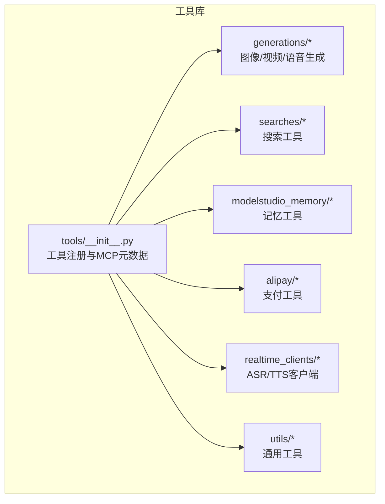
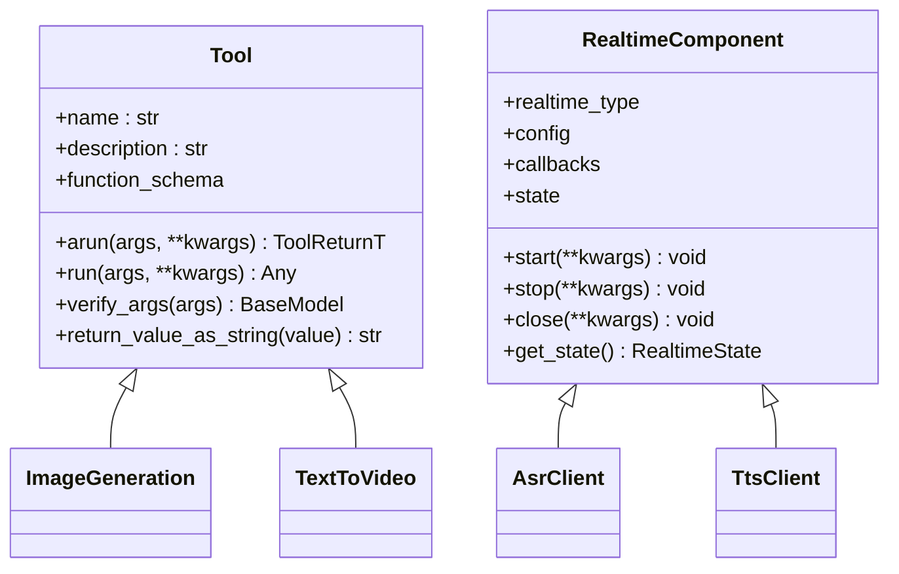
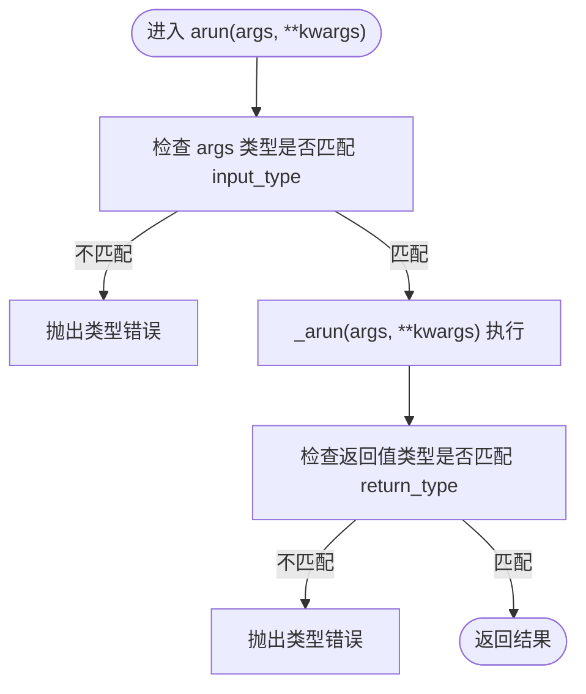
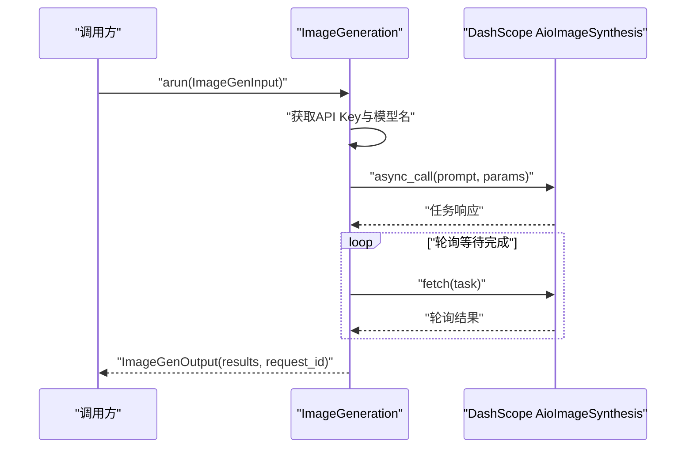
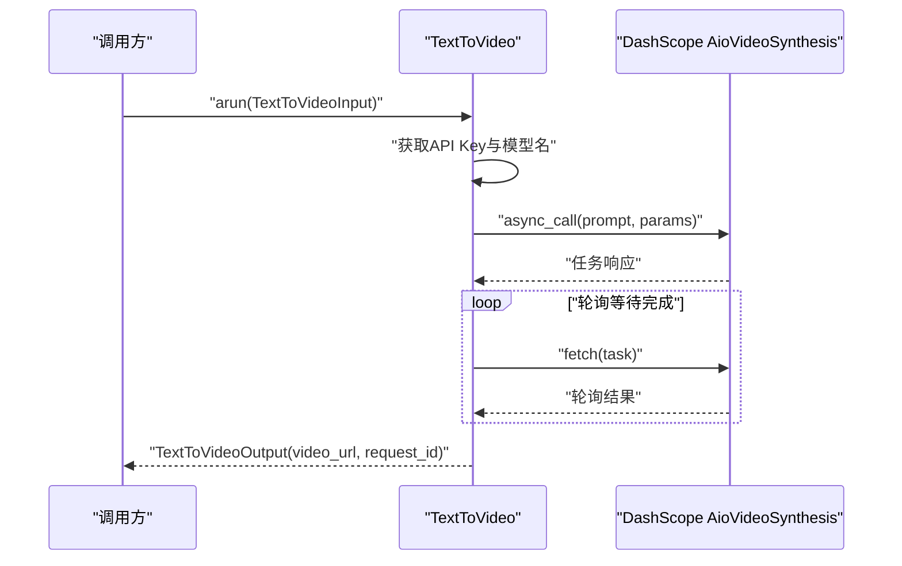
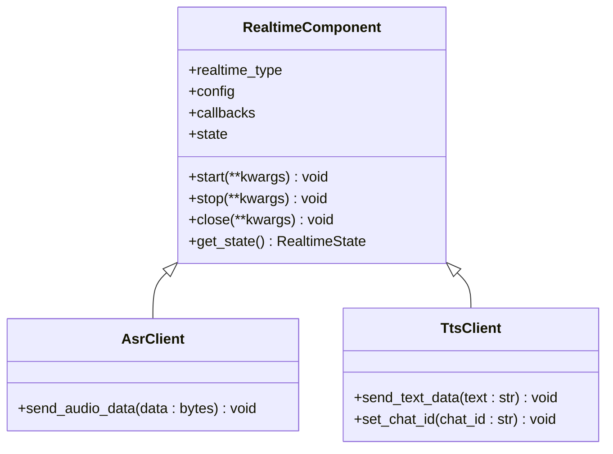
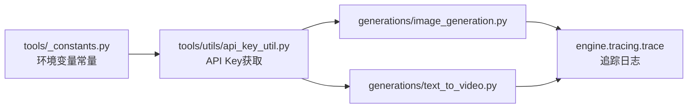

# 工具库系统

<cite>
**本文引用的文件**
- [tools/__init__.py](file://src/agentscope_runtime/tools/__init__.py)
- [tools/base.py](file://src/agentscope_runtime/tools/base.py)
- [tools/_constants.py](file://src/agentscope_runtime/tools/_constants.py)
- [tools/generations/image_generation.py](file://src/agentscope_runtime/tools/generations/image_generation.py)
- [tools/generations/text_to_video.py](file://src/agentscope_runtime/tools/generations/text_to_video.py)
- [tools/generations/__init__.py](file://src/agentscope_runtime/tools/generations/__init__.py)
- [tools/searches/__init__.py](file://src/agentscope_runtime/tools/searches/__init__.py)
- [tools/modelstudio_memory/__init__.py](file://src/agentscope_runtime/tools/modelstudio_memory/__init__.py)
- [tools/alipay/__init__.py](file://src/agentscope_runtime/tools/alipay/__init__.py)
- [tools/realtime_clients/realtime_tool.py](file://src/agentscope_runtime/tools/realtime_clients/realtime_tool.py)
- [tools/realtime_clients/asr_client.py](file://src/agentscope_runtime/tools/realtime_clients/asr_client.py)
- [tools/realtime_clients/tts_client.py](file://src/agentscope_runtime/tools/realtime_clients/tts_client.py)
- [tools/utils/api_key_util.py](file://src/agentscope_runtime/tools/utils/api_key_util.py)
</cite>

## 目录
1. [引言](#引言)
2. [项目结构](#项目结构)
3. [核心组件](#核心组件)
4. [架构总览](#架构总览)
5. [详细组件分析](#详细组件分析)
6. [依赖分析](#依赖分析)
7. [性能考虑](#性能考虑)
8. [故障排查指南](#故障排查指南)
9. [结论](#结论)
10. [附录](#附录)

## 引言
本文件面向AgentScope Runtime的工具库系统，系统性阐述工具架构设计理念、工具分类与统一接口规范，并深入解析生成类工具（图像生成、文本转语音、视频生成）、实时客户端工具（ASR、TTS）的实现原理与调用方式；同时说明搜索工具、记忆工具与支付工具的实现要点，覆盖工具注册机制、参数验证与错误处理策略，并给出扩展与自定义开发的最佳实践。

## 项目结构
工具库位于 src/agentscope_runtime/tools 下，按功能域划分为 generations（生成类）、searches（搜索）、modelstudio_memory（记忆）、alipay（支付）、realtime_clients（实时客户端）、utils（通用工具）等子包。入口文件通过聚合导出，形成统一的工具注册与分组元数据，便于运行时按“MCP服务器”维度组织工具集合。

图表来源
- [tools/__init__.py:76-119](file://src/agentscope_runtime/tools/__init__.py#L76-L119)

章节来源
- [tools/__init__.py:1-120](file://src/agentscope_runtime/tools/__init__.py#L1-L120)

## 核心组件
- 统一基类：Tool，提供异步/同步执行、泛型输入输出类型推断、参数Schema生成、参数校验与序列化等能力。
- 实时组件基类：RealtimeComponent，抽象ASR/TTS/Voice/Video等实时组件的生命周期与状态管理。
- 常量与配置：环境变量驱动的DashScope基础地址与API Key获取工具，保障工具调用的可配置性与安全性。
- MCP元数据：以“服务器名”为键的注册表，描述每组工具的服务说明与组件清单，便于运行时动态装配。

章节来源
- [tools/base.py:34-265](file://src/agentscope_runtime/tools/base.py#L34-L265)
- [tools/realtime_clients/realtime_tool.py:21-56](file://src/agentscope_runtime/tools/realtime_clients/realtime_tool.py#L21-L56)
- [tools/_constants.py:1-19](file://src/agentscope_runtime/tools/_constants.py#L1-L19)
- [tools/utils/api_key_util.py:13-46](file://src/agentscope_runtime/tools/utils/api_key_util.py#L13-L46)
- [tools/__init__.py:65-119](file://src/agentscope_runtime/tools/__init__.py#L65-L119)

## 架构总览
工具库采用“统一基类 + 功能域子包”的分层设计。所有具体工具继承自 Tool，遵循一致的输入/输出Schema与执行协议；实时工具继承自 RealtimeComponent，统一状态机与回调接口；通过工具注册表将不同功能域的工具聚合成MCP服务器，供上层引擎或适配器使用。

图表来源
- [tools/base.py:34-128](file://src/agentscope_runtime/tools/base.py#L34-L128)
- [tools/realtime_clients/realtime_tool.py:21-56](file://src/agentscope_runtime/tools/realtime_clients/realtime_tool.py#L21-L56)
- [tools/generations/image_generation.py:70-203](file://src/agentscope_runtime/tools/generations/image_generation.py#L70-L203)
- [tools/generations/text_to_video.py:73-222](file://src/agentscope_runtime/tools/generations/text_to_video.py#L73-L222)
- [tools/realtime_clients/asr_client.py:13-28](file://src/agentscope_runtime/tools/realtime_clients/asr_client.py#L13-L28)
- [tools/realtime_clients/tts_client.py:13-34](file://src/agentscope_runtime/tools/realtime_clients/tts_client.py#L13-L34)

## 详细组件分析

### 统一工具接口与参数校验
- 泛型约束：Tool 使用双泛型约束 ToolArgsT/ToolReturnT，确保输入输出类型在编译期与运行期均受控。
- 参数Schema：通过输入模型的 JSON Schema 自动提取属性与必填项，注入到 FunctionTool 的 parameters 字段，用于上层函数调用协议。
- 参数校验：支持字符串/字典/BaseModel三种输入形式，统一解析为字典后交由Pydantic模型校验，异常抛出为可读的ValueError。
- 返回值序列化：提供统一的字符串化方法，便于跨进程/网络传递。

图表来源
- [tools/base.py:94-127](file://src/agentscope_runtime/tools/base.py#L94-L127)
- [tools/base.py:162-194](file://src/agentscope_runtime/tools/base.py#L162-L194)
- [tools/base.py:214-246](file://src/agentscope_runtime/tools/base.py#L214-L246)

章节来源
- [tools/base.py:34-265](file://src/agentscope_runtime/tools/base.py#L34-L265)

### 生成类工具：图像生成（Text-to-Image）
- 输入模型：包含正向提示词、分辨率、反向提示词、是否启用智能改写、生成数量、水印等字段。
- 执行流程：从环境或参数获取API Key与模型名，提交异步任务并轮询状态，超时控制与失败处理完善，最终汇总结果URL列表。
- 输出模型：包含生成结果URL列表与请求ID。

图表来源
- [tools/generations/image_generation.py:79-203](file://src/agentscope_runtime/tools/generations/image_generation.py#L79-L203)

章节来源
- [tools/generations/image_generation.py:21-68](file://src/agentscope_runtime/tools/generations/image_generation.py#L21-L68)
- [tools/generations/image_generation.py:70-203](file://src/agentscope_runtime/tools/generations/image_generation.py#L70-L203)

### 生成类工具：文本转视频（Text-to-Video）
- 输入模型：包含正向/反向提示词、分辨率、时长、智能改写、水印等字段。
- 执行流程：与图像生成类似，采用异步提交+轮询模式，超时时间更长以适配视频生成耗时。
- 输出模型：包含视频URL与请求ID。

图表来源
- [tools/generations/text_to_video.py:86-222](file://src/agentscope_runtime/tools/generations/text_to_video.py#L86-L222)

章节来源
- [tools/generations/text_to_video.py:21-71](file://src/agentscope_runtime/tools/generations/text_to_video.py#L21-L71)
- [tools/generations/text_to_video.py:73-222](file://src/agentscope_runtime/tools/generations/text_to_video.py#L73-L222)

### 实时客户端工具：ASR与TTS
- 抽象基类：RealtimeComponent 定义了实时组件的统一状态（空闲/运行）与生命周期方法（start/stop/close），以及状态查询。
- 具体实现：AsrClient 与 TtsClient 继承自 RealtimeComponent，预留音频/文本数据发送接口，便于对接具体厂商SDK或本地引擎。
- 配置模型：分别使用 AsrConfig 与 TtsConfig，承载采样率、编码格式、回调事件等参数。

图表来源
- [tools/realtime_clients/realtime_tool.py:21-56](file://src/agentscope_runtime/tools/realtime_clients/realtime_tool.py#L21-L56)
- [tools/realtime_clients/asr_client.py:13-28](file://src/agentscope_runtime/tools/realtime_clients/asr_client.py#L13-L28)
- [tools/realtime_clients/tts_client.py:13-34](file://src/agentscope_runtime/tools/realtime_clients/tts_client.py#L13-L34)

章节来源
- [tools/realtime_clients/realtime_tool.py:1-56](file://src/agentscope_runtime/tools/realtime_clients/realtime_tool.py#L1-L56)
- [tools/realtime_clients/asr_client.py:1-28](file://src/agentscope_runtime/tools/realtime_clients/asr_client.py#L1-L28)
- [tools/realtime_clients/tts_client.py:1-34](file://src/agentscope_runtime/tools/realtime_clients/tts_client.py#L1-L34)

### 搜索工具
- 聚合导出：searches/__init__.py 将 ModelStudio 搜索相关工具集中导出，便于统一注册与使用。
- 应用场景：提供互联网实时搜索能力，支撑Agent的外部知识检索需求。

章节来源
- [tools/searches/__init__.py:1-4](file://src/agentscope_runtime/tools/searches/__init__.py#L1-L4)

### 记忆工具
- 聚合导出：modelstudio_memory/__init__.py 提供记忆节点的增删改查、实体删除、用户画像Schema管理等常用组件与Schema。
- 设计要点：围绕 MemoryNode、Message、UserProfile 等核心Schema构建输入输出，配合异常体系提升健壮性。

章节来源
- [tools/modelstudio_memory/__init__.py:1-155](file://src/agentscope_runtime/tools/modelstudio_memory/__init__.py#L1-L155)

### 支付工具
- 聚合导出：alipay/__init__.py 导出支付与订阅相关组件，便于在Agent工作流中集成支付能力。
- 安全性：API Key获取工具支持优先级策略，确保密钥安全可控。

章节来源
- [tools/alipay/__init__.py:1-5](file://src/agentscope_runtime/tools/alipay/__init__.py#L1-L5)
- [tools/utils/api_key_util.py:13-46](file://src/agentscope_runtime/tools/utils/api_key_util.py#L13-L46)

### 工具注册机制与MCP元数据
- 注册表：tools/__init__.py 中的 mcp_server_metas 以服务器名为键，记录服务说明与组件列表，用于运行时按组装配工具。
- 分组策略：按模型/能力域划分（如图像/视频/搜索/语音等），便于按需启用与隔离。

章节来源
- [tools/__init__.py:65-119](file://src/agentscope_runtime/tools/__init__.py#L65-L119)

## 依赖分析
- 运行时常量：通过环境变量控制DashScope访问端点与API Key，降低硬编码风险。
- API Key获取：统一的工具函数支持入参、关键字参数与环境变量的优先级合并，保证灵活性与安全性。
- 异步与追踪：生成类工具普遍采用异步调用与轮询，结合追踪工具记录关键事件，便于可观测性与排障。

图表来源
- [tools/_constants.py:4-18](file://src/agentscope_runtime/tools/_constants.py#L4-L18)
- [tools/utils/api_key_util.py:13-46](file://src/agentscope_runtime/tools/utils/api_key_util.py#L13-L46)
- [tools/generations/image_generation.py:106-132](file://src/agentscope_runtime/tools/generations/image_generation.py#L106-L132)
- [tools/generations/text_to_video.py:116-146](file://src/agentscope_runtime/tools/generations/text_to_video.py#L116-L146)

章节来源
- [tools/_constants.py:1-19](file://src/agentscope_runtime/tools/_constants.py#L1-L19)
- [tools/utils/api_key_util.py:13-46](file://src/agentscope_runtime/tools/utils/api_key_util.py#L13-L46)

## 性能考虑
- 异步轮询：图像/视频生成采用异步提交+轮询，避免阻塞主线程；合理设置轮询间隔与超时，平衡响应速度与资源占用。
- 超时与重试：为长耗时任务设置上限超时，防止资源泄露；对网络波动场景建议在上层封装重试策略。
- 参数裁剪：输入提示词长度等字段存在截断逻辑，应在调用侧尽量精简提示词，减少无效计算。
- 并发与限流：DashScope侧可能有限流策略，建议在上层做并发控制与退避重试。

## 故障排查指南
- 参数校验失败：当传入参数无法被Pydantic模型解析时，会抛出可读的校验错误；请核对输入类型与字段名称。
- API Key缺失：若未正确设置或传递API Key，工具会断言失败并提示；请检查环境变量或构造参数。
- 任务失败/取消：当DashScope返回失败或取消状态时，工具会抛出运行时错误；请查看返回消息与请求ID进行定位。
- 超时：图像/视频生成设置了最大等待时间，超时会抛出超时错误；可适当调整模型或优化提示词以缩短生成时间。
- 实时组件：Asr/Tts客户端当前为占位实现，需在子类中补充音频/文本数据发送与回调处理逻辑。

章节来源
- [tools/base.py:214-246](file://src/agentscope_runtime/tools/base.py#L214-L246)
- [tools/utils/api_key_util.py:42-45](file://src/agentscope_runtime/tools/utils/api_key_util.py#L42-L45)
- [tools/generations/image_generation.py:134-181](file://src/agentscope_runtime/tools/generations/image_generation.py#L134-L181)
- [tools/generations/text_to_video.py:148-193](file://src/agentscope_runtime/tools/generations/text_to_video.py#L148-L193)
- [tools/realtime_clients/asr_client.py:26-28](file://src/agentscope_runtime/tools/realtime_clients/asr_client.py#L26-L28)
- [tools/realtime_clients/tts_client.py:29-34](file://src/agentscope_runtime/tools/realtime_clients/tts_client.py#L29-L34)

## 结论
AgentScope Runtime的工具库系统以统一的Tool基类为核心，结合明确的参数Schema与严格的类型校验，实现了生成类、搜索、记忆、支付与实时客户端等多类工具的一致化接入。通过MCP元数据注册表，工具可按域分组、按需装配；借助环境变量与API Key工具，兼顾灵活性与安全性。建议在扩展新工具时严格遵循统一接口、参数Schema与错误处理规范，确保与整体架构的兼容性与可维护性。

## 附录
- 最佳实践
  - 新增工具：继承Tool并定义输入/输出Pydantic模型，确保字段描述完整；在tools/__init__.py中注册到对应MCP服务器。
  - 参数校验：优先使用Pydantic模型作为输入/输出Schema，避免手写校验逻辑；必要时在_arun内部补充业务规则校验。
  - 错误处理：区分业务错误与系统错误，抛出可读异常并附带请求ID；对可恢复错误建议封装重试。
  - 实时组件：在RealtimeComponent基础上实现start/stop/close与数据发送接口，确保状态机一致性。
  - 配置管理：统一通过环境变量与工具函数获取敏感配置，避免硬编码；为不同部署环境提供默认值与覆盖策略。