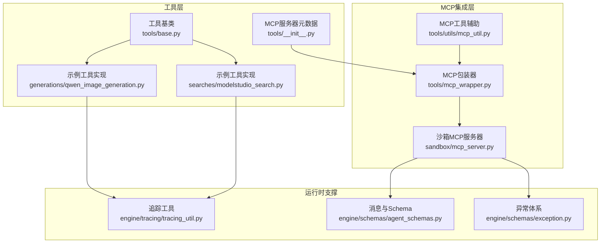
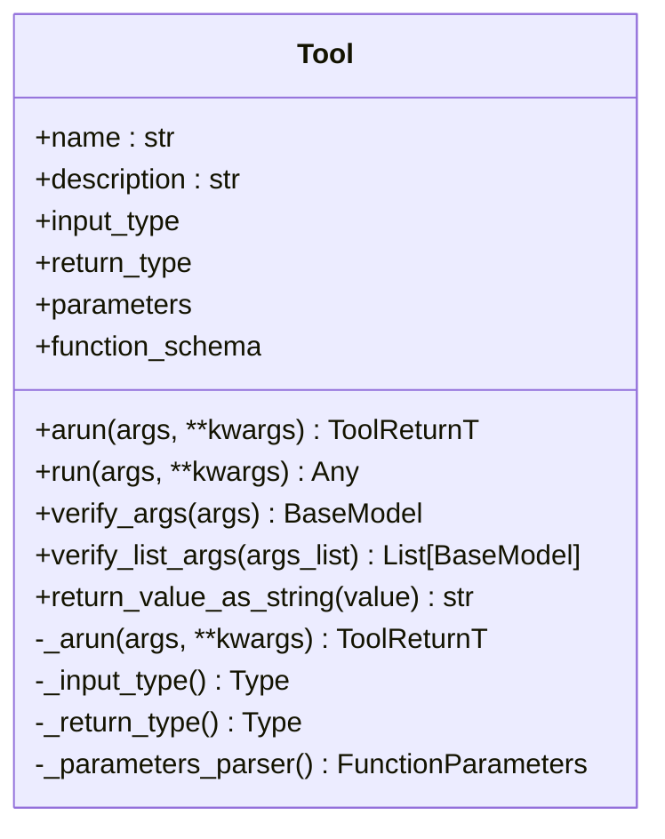
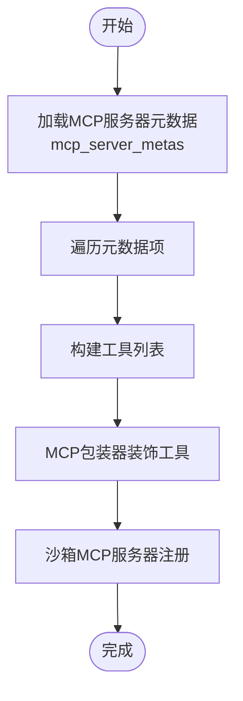
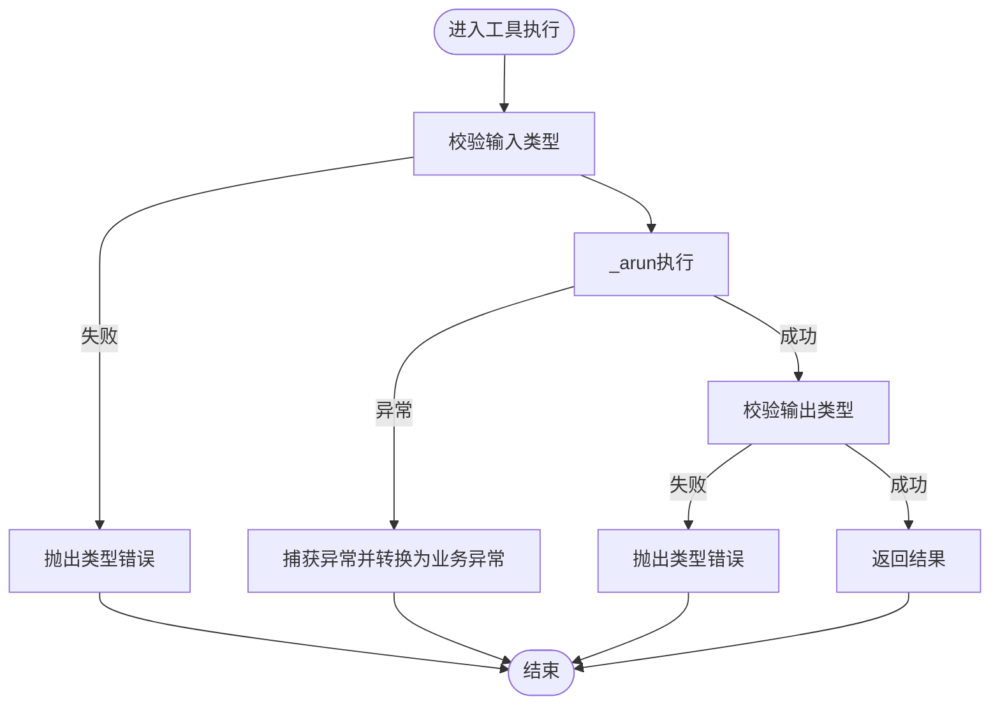
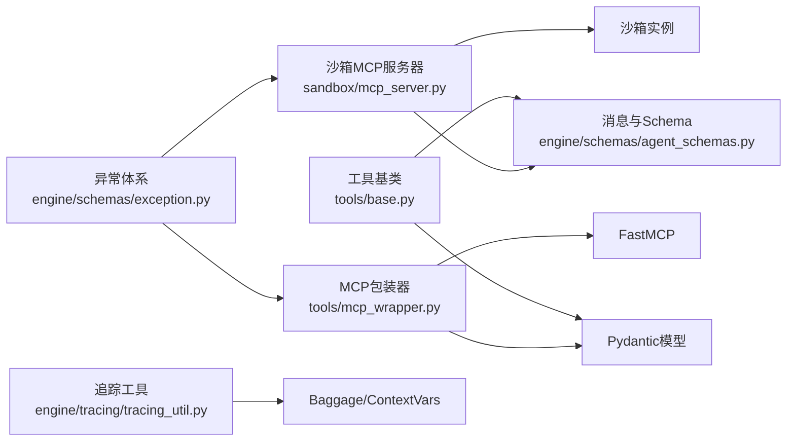

# 工具架构设计

<cite>
**本文档引用的文件**
- [base.py](file://src/agentscope_runtime/tools/base.py)
- [__init__.py](file://src/agentscope_runtime/tools/__init__.py)
- [mcp_wrapper.py](file://src/agentscope_runtime/tools/mcp_wrapper.py)
- [mcp_server.py](file://src/agentscope_runtime/sandbox/mcp_server.py)
- [mcp_util.py](file://src/agentscope_runtime/tools/utils/mcp_util.py)
- [tracing_util.py](file://src/agentscope_runtime/engine/tracing/tracing_util.py)
- [agent_schemas.py](file://src/agentscope_runtime/engine/schemas/agent_schemas.py)
- [exception.py](file://src/agentscope_runtime/engine/schemas/exception.py)
- [qwen_image_generation.py](file://src/agentscope_runtime/tools/generations/qwen_image_generation.py)
- [modelstudio_search.py](file://src/agentscope_runtime/tools/searches/modelstudio_search.py)
</cite>

## 目录
1. [引言](#引言)
2. [项目结构](#项目结构)
3. [核心组件](#核心组件)
4. [架构总览](#架构总览)
5. [详细组件分析](#详细组件分析)
6. [依赖关系分析](#依赖关系分析)
7. [性能考虑](#性能考虑)
8. [故障排查指南](#故障排查指南)
9. [结论](#结论)
10. [附录](#附录)

## 引言
本文件面向AgentScope Runtime的工具架构设计，系统性阐述工具基类的设计理念、统一接口规范与抽象方法定义；详解工具注册机制、MCP服务器元数据管理与工具发现流程；明确工具参数验证、错误处理与异常管理策略；覆盖工具生命周期管理、状态维护与资源清理机制；并总结工具扩展开发的最佳实践与设计模式。目标是帮助开发者在不改变上层调用方式的前提下，快速、安全地扩展与集成新的工具能力。

## 项目结构
工具体系位于运行时工程的tools子包中，围绕“工具基类 + 类型化输入输出 + MCP包装器 + MCP服务器”形成闭环。核心模块包括：
- 工具基类与通用能力：tools/base.py
- 工具集合与MCP服务器元数据：tools/__init__.py
- MCP工具包装器：tools/mcp_wrapper.py
- 沙箱MCP服务器：sandbox/mcp_server.py
- MCP工具辅助工具：tools/utils/mcp_util.py
- 追踪与上下文：engine/tracing/tracing_util.py
- 统一消息与Schema：engine/schemas/agent_schemas.py
- 异常体系：engine/schemas/exception.py
- 示例工具：generations/qwen_image_generation.py、searches/modelstudio_search.py



图表来源
- [base.py:34-265](file://src/agentscope_runtime/tools/base.py#L34-L265)
- [__init__.py:65-120](file://src/agentscope_runtime/tools/__init__.py#L65-L120)
- [mcp_wrapper.py:14-216](file://src/agentscope_runtime/tools/mcp_wrapper.py#L14-L216)
- [mcp_server.py:14-192](file://src/agentscope_runtime/sandbox/mcp_server.py#L14-L192)
- [mcp_util.py:10-36](file://src/agentscope_runtime/tools/utils/mcp_util.py#L10-L36)
- [tracing_util.py:23-136](file://src/agentscope_runtime/engine/tracing/tracing_util.py#L23-L136)
- [agent_schemas.py:80-218](file://src/agentscope_runtime/engine/schemas/agent_schemas.py#L80-L218)

章节来源
- [base.py:34-265](file://src/agentscope_runtime/tools/base.py#L34-L265)
- [__init__.py:65-120](file://src/agentscope_runtime/tools/__init__.py#L65-L120)
- [mcp_wrapper.py:14-216](file://src/agentscope_runtime/tools/mcp_wrapper.py#L14-L216)
- [mcp_server.py:14-192](file://src/agentscope_runtime/sandbox/mcp_server.py#L14-L192)
- [mcp_util.py:10-36](file://src/agentscope_runtime/tools/utils/mcp_util.py#L10-L36)
- [tracing_util.py:23-136](file://src/agentscope_runtime/engine/tracing/tracing_util.py#L23-L136)
- [agent_schemas.py:80-218](file://src/agentscope_runtime/engine/schemas/agent_schemas.py#L80-L218)

## 核心组件
- 工具基类：提供统一的异步执行入口、同步适配、类型校验、参数解析与字符串化输出等能力，确保所有工具具备一致的接口契约与行为边界。
- MCP包装器：将工具类动态包装为MCP工具，自动从输入模型推导签名、参数与默认值，注入追踪上下文，保证MCP协议兼容与类型安全。
- MCP服务器：从沙箱实例动态发现工具清单，按JSON Schema生成签名，装饰为MCP工具，完成工具发现与注册。
- 元数据与注册表：集中管理MCP服务器的指令说明与组件列表，便于按服务域聚合工具。
- 追踪与异常：提供跨线程的请求ID传递、通用属性设置与异常分类，保障可观测性与可诊断性。

章节来源
- [base.py:34-265](file://src/agentscope_runtime/tools/base.py#L34-L265)
- [mcp_wrapper.py:14-216](file://src/agentscope_runtime/tools/mcp_wrapper.py#L14-L216)
- [mcp_server.py:14-192](file://src/agentscope_runtime/sandbox/mcp_server.py#L14-L192)
- [__init__.py:65-120](file://src/agentscope_runtime/tools/__init__.py#L65-L120)
- [tracing_util.py:23-136](file://src/agentscope_runtime/engine/tracing/tracing_util.py#L23-L136)
- [exception.py:11-605](file://src/agentscope_runtime/engine/schemas/exception.py#L11-L605)

## 架构总览
工具架构遵循“类型驱动 + 协议解耦”的设计原则：
- 输入/输出严格使用Pydantic模型，自动推导JSON Schema作为函数参数规范；
- 工具执行统一走异步arun路径，run方法提供同步适配；
- MCP包装器与沙箱MCP服务器通过Schema驱动动态生成签名，避免手写样板代码；
- 追踪系统贯穿工具执行链路，确保请求ID与上下文在异步/多线程场景下一致。

```mermaid
sequenceDiagram
participant Client as "客户端"
participant Srv as "MCP服务器<br/>sandbox/mcp_server.py"
participant Box as "沙箱实例"
participant Wrap as "MCP包装器<br/>tools/mcp_wrapper.py"
participant Tool as "工具实例<br/>tools/base.py"
participant Trace as "追踪工具<br/>engine/tracing/tracing_util.py"
Client->>Srv : 列举工具/调用工具
Srv->>Box : list_tools()
Box-->>Srv : 工具清单(JSON Schema)
Srv->>Srv : 动态生成签名并装饰为MCP工具
Client->>Srv : 调用工具(带ctx)
Srv->>Wrap : 包装器接收参数
Wrap->>Trace : 设置请求ID/上下文
Wrap->>Tool : arun(输入模型)
Tool-->>Wrap : 返回输出模型
Wrap-->>Srv : 序列化为JSON字符串
Srv-->>Client : 返回结果
```

图表来源
- [mcp_server.py:109-139](file://src/agentscope_runtime/sandbox/mcp_server.py#L109-L139)
- [mcp_wrapper.py:37-216](file://src/agentscope_runtime/tools/mcp_wrapper.py#L37-L216)
- [base.py:75-127](file://src/agentscope_runtime/tools/base.py#L75-L127)
- [tracing_util.py:23-61](file://src/agentscope_runtime/engine/tracing/tracing_util.py#L23-L61)

## 详细组件分析

### 工具基类设计与统一接口
- 设计理念
  - 使用泛型约束输入/输出类型，结合Pydantic模型自动推导参数Schema；
  - 提供arun与run双入口，异步优先，同步通过async_to_sync桥接；
  - 在构造阶段生成function_schema，用于工具注册与展示。
- 统一接口规范
  - 必须实现异步执行方法_arun(args, **kwargs)->返回模型；
  - 支持verify_args/verify_list_args进行字符串/字典/模型混合输入校验；
  - 支持return_value_as_string进行结果序列化。
- 抽象方法定义
  - _arun为必须实现的抽象方法，子类需按输入模型处理业务逻辑并返回输出模型。



图表来源
- [base.py:34-74](file://src/agentscope_runtime/tools/base.py#L34-L74)
- [base.py:75-127](file://src/agentscope_runtime/tools/base.py#L75-L127)
- [base.py:144-194](file://src/agentscope_runtime/tools/base.py#L144-L194)

章节来源
- [base.py:34-265](file://src/agentscope_runtime/tools/base.py#L34-L265)

### 工具注册机制与MCP服务器元数据管理
- 注册机制
  - 工具类通过继承Tool并实现_arun完成注册；
  - MCP包装器将工具类实例化并装饰为MCP工具，自动提取输入模型字段生成签名；
  - 沙箱MCP服务器从沙箱实例动态列举工具清单，按JSON Schema生成签名并注册。
- 元数据管理
  - tools/__init__.py中定义McpServerMeta与mcp_server_metas字典，按服务域聚合工具组件；
  - 每个MCP服务器标签对应一组工具类，便于按域启用/禁用。
- 工具发现机制
  - 沙箱MCP服务器通过list_tools获取工具清单；
  - 对每个工具，解析其JSON Schema并动态生成函数签名；
  - 使用@mcp.tool装饰器注册，完成工具发现与暴露。



图表来源
- [__init__.py:65-120](file://src/agentscope_runtime/tools/__init__.py#L65-L120)
- [mcp_wrapper.py:27-60](file://src/agentscope_runtime/tools/mcp_wrapper.py#L27-L60)
- [mcp_server.py:109-139](file://src/agentscope_runtime/sandbox/mcp_server.py#L109-L139)

章节来源
- [__init__.py:65-120](file://src/agentscope_runtime/tools/__init__.py#L65-L120)
- [mcp_wrapper.py:14-216](file://src/agentscope_runtime/tools/mcp_wrapper.py#L14-L216)
- [mcp_server.py:14-192](file://src/agentscope_runtime/sandbox/mcp_server.py#L14-L192)

### 工具参数验证、错误处理与异常管理
- 参数验证
  - verify_args支持字符串/字典/BaseModel三种输入形式，统一转换为BaseModel并进行Pydantic校验；
  - _parameters_parser从输入模型生成FunctionParameters，自动处理$defs与required字段；
  - arun在执行前后分别校验输入类型与返回类型，确保契约一致。
- 错误处理
  - 工具内部抛出的业务异常通过异常体系映射为标准HTTP语义或业务码；
  - MCP包装器与沙箱MCP服务器捕获异常并返回标准化错误响应；
  - 追踪系统记录请求ID与上下文，便于定位问题。
- 异常管理策略
  - 使用AppBaseException及其子类，区分HTTP状态与业务码；
  - 工具执行异常、MCP连接异常、模型执行异常均有专门异常类型；
  - 建议在工具实现中捕获底层异常并转换为业务异常，保留原始错误以便追踪。



图表来源
- [base.py:111-127](file://src/agentscope_runtime/tools/base.py#L111-L127)
- [base.py:214-246](file://src/agentscope_runtime/tools/base.py#L214-L246)
- [exception.py:459-605](file://src/agentscope_runtime/engine/schemas/exception.py#L459-L605)

章节来源
- [base.py:111-246](file://src/agentscope_runtime/tools/base.py#L111-L246)
- [exception.py:11-605](file://src/agentscope_runtime/engine/schemas/exception.py#L11-L605)

### 工具生命周期管理、状态维护与资源清理
- 生命周期
  - 初始化：构造函数校验name/description并生成function_schema；
  - 执行：arun/run触发执行，支持同步/异步两种入口；
  - 结束：返回值序列化为字符串或JSON对象。
- 状态维护
  - 请求ID通过TracingUtil在上下文中传递，支持跨线程与异步场景；
  - 通用属性通过baggage传播，便于统一追踪维度。
- 资源清理
  - 工具实现应避免全局状态污染，必要时在上下文退出时清理临时资源；
  - MCP包装器与沙箱MCP服务器负责参数绑定与签名生成，不持有业务资源。

章节来源
- [base.py:42-74](file://src/agentscope_runtime/tools/base.py#L42-L74)
- [tracing_util.py:23-61](file://src/agentscope_runtime/engine/tracing/tracing_util.py#L23-L61)

### 示例工具：图像生成与搜索
- 图像生成工具
  - 输入模型包含提示词、尺寸、数量等字段，输出模型包含结果URL与请求ID；
  - arun通过异步API调用生成图像，解析响应并封装为输出模型；
  - 使用追踪装饰器记录关键事件与结果。
- 搜索工具
  - 输入模型包含消息历史、搜索选项、超时等，输出模型包含格式化后的搜索结果与附加信息；
  - arun组装DashScope搜索请求，异步获取结果并进行后处理；
  - 提供多种搜索策略与输出规则，支持引用标注与来源展示。

章节来源
- [qwen_image_generation.py:70-215](file://src/agentscope_runtime/tools/generations/qwen_image_generation.py#L70-L215)
- [modelstudio_search.py:102-221](file://src/agentscope_runtime/tools/searches/modelstudio_search.py#L102-L221)

## 依赖关系分析
- 工具基类依赖Pydantic进行类型校验与Schema生成；
- MCP包装器依赖FastMCP与Pydantic模型字段信息生成动态函数签名；
- 沙箱MCP服务器依赖沙箱实例的list_tools能力与JSON Schema；
- 追踪工具依赖contextvars与baggage实现跨线程上下文传递；
- 异常体系提供统一的错误分类与映射。



图表来源
- [base.py:18-25](file://src/agentscope_runtime/tools/base.py#L18-L25)
- [mcp_wrapper.py:6-11](file://src/agentscope_runtime/tools/mcp_wrapper.py#L6-L11)
- [mcp_server.py:6-10](file://src/agentscope_runtime/sandbox/mcp_server.py#L6-L10)
- [tracing_util.py:2-6](file://src/agentscope_runtime/engine/tracing/tracing_util.py#L2-L6)
- [exception.py:11-20](file://src/agentscope_runtime/engine/schemas/exception.py#L11-L20)

章节来源
- [base.py:18-25](file://src/agentscope_runtime/tools/base.py#L18-L25)
- [mcp_wrapper.py:6-11](file://src/agentscope_runtime/tools/mcp_wrapper.py#L6-L11)
- [mcp_server.py:6-10](file://src/agentscope_runtime/sandbox/mcp_server.py#L6-L10)
- [tracing_util.py:2-6](file://src/agentscope_runtime/engine/tracing/tracing_util.py#L2-L6)
- [exception.py:11-20](file://src/agentscope_runtime/engine/schemas/exception.py#L11-L20)

## 性能考虑
- 异步优先：工具执行采用异步IO，减少阻塞，提升并发吞吐；
- Schema驱动：通过Pydantic自动推导Schema，避免手工维护带来的开销；
- 动态签名生成：在MCP侧按Schema生成签名，降低重复代码与维护成本；
- 资源限制：沙箱配置支持CPU/内存限制，建议在部署时合理设置以避免资源争用。

## 故障排查指南
- 工具未注册/不可见
  - 检查MCP服务器是否正确调用list_tools并解析JSON Schema；
  - 确认工具类已继承Tool并实现_arun。
- 参数校验失败
  - 使用verify_args确认输入是否符合BaseModel定义；
  - 检查Schema中的required字段与类型注解。
- 追踪ID缺失
  - 确保MCP调用时携带ctx，包装器会从中提取请求ID并设置追踪上下文；
  - 检查TracingUtil的set/get逻辑是否被正确调用。
- 异常定位
  - 查看异常体系中的具体类型，区分HTTP语义与业务码；
  - 结合追踪日志定位工具执行链路中的问题节点。

章节来源
- [mcp_server.py:109-139](file://src/agentscope_runtime/sandbox/mcp_server.py#L109-L139)
- [mcp_wrapper.py:169-191](file://src/agentscope_runtime/tools/mcp_wrapper.py#L169-L191)
- [tracing_util.py:23-61](file://src/agentscope_runtime/engine/tracing/tracing_util.py#L23-L61)
- [exception.py:459-605](file://src/agentscope_runtime/engine/schemas/exception.py#L459-L605)

## 结论
AgentScope Runtime的工具架构以“类型驱动 + 协议解耦 + 追踪可观测”为核心，通过工具基类统一接口、MCP包装器与沙箱服务器实现自动化注册与发现，辅以完善的参数验证、错误处理与异常体系，确保工具在多引擎、多协议场景下的可移植性与可靠性。遵循本文档的最佳实践，可在不破坏现有契约的前提下快速扩展新工具能力。

## 附录
- 最佳实践
  - 输入/输出模型使用Pydantic，明确required与类型注解；
  - 工具实现中捕获并转换异常，保留原始错误信息；
  - 使用追踪装饰器记录关键事件，便于排障；
  - 在沙箱环境中测试工具的异步与并发行为。
- 设计模式
  - 工厂模式：通过MCP包装器动态生成工具函数；
  - 适配器模式：沙箱MCP服务器适配不同工具的Schema；
  - 装饰器模式：追踪装饰器与MCP装饰器增强工具能力。