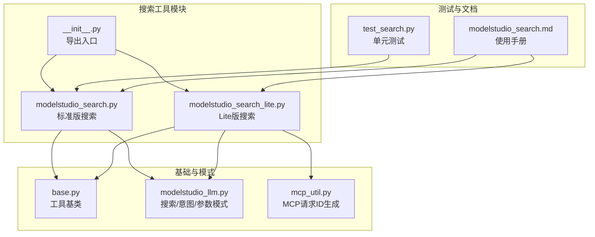
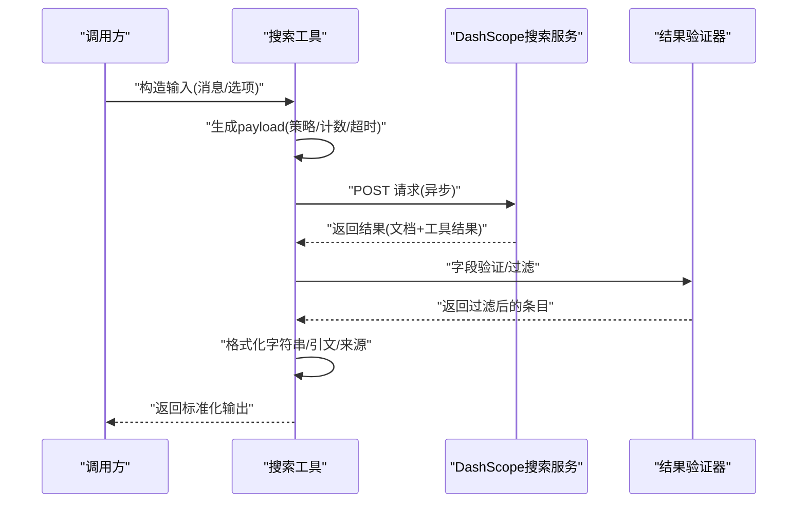
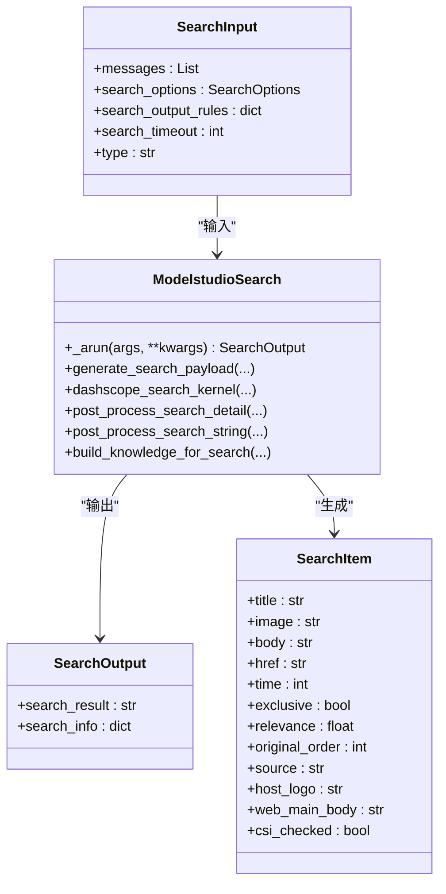
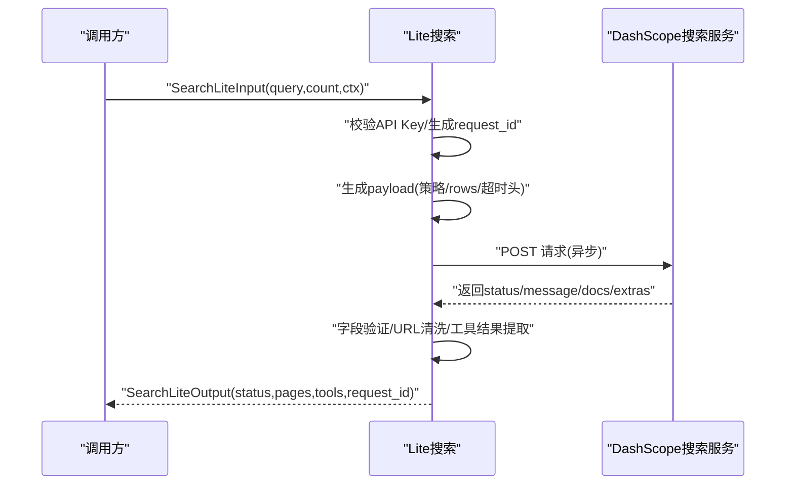
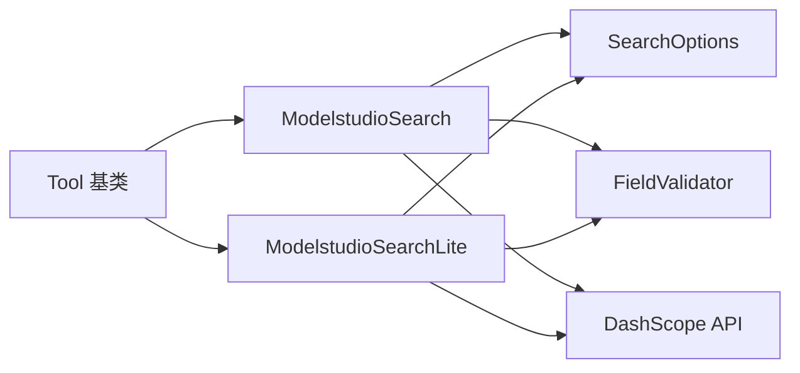

# 搜索工具

<cite>
**本文档引用的文件**
- [modelstudio_search.py](file://src/agentscope_runtime/tools/searches/modelstudio_search.py)
- [modelstudio_search_lite.py](file://src/agentscope_runtime/tools/searches/modelstudio_search_lite.py)
- [base.py](file://src/agentscope_runtime/tools/base.py)
- [modelstudio_llm.py](file://src/agentscope_runtime/engine/schemas/modelstudio_llm.py)
- [mcp_util.py](file://src/agentscope_runtime/tools/utils/mcp_util.py)
- [__init__.py](file://src/agentscope_runtime/tools/searches/__init__.py)
- [test_search.py](file://tests/tools/test_search.py)
- [modelstudio_search.md](file://cookbook/zh/tools/modelstudio_search.md)
</cite>

## 目录
1. [简介](#简介)
2. [项目结构](#项目结构)
3. [核心组件](#核心组件)
4. [架构总览](#架构总览)
5. [详细组件分析](#详细组件分析)
6. [依赖关系分析](#依赖关系分析)
7. [性能考量](#性能考量)
8. [故障排查指南](#故障排查指南)
9. [结论](#结论)
10. [附录](#附录)

## 简介
本文件面向 AgentScope Runtime 的搜索工具，聚焦于 ModelStudio 搜索工具的搜索算法、结果排序与相关性评分机制；同时阐述 Lite 版本的轻量实现与性能优化策略；说明搜索参数配置、过滤条件与结果限制；解释搜索结果数据结构、字段定义与格式化处理；并覆盖搜索历史记录、缓存策略与并发处理能力。最后提供集成使用示例与最佳实践。

## 项目结构
搜索工具位于 tools/searches 目录，包含标准版与 Lite 版两个实现，均基于统一的工具基类与 ModelStudio 平台的搜索接口。

图表来源
- [modelstudio_search.py:1-878](file://src/agentscope_runtime/tools/searches/modelstudio_search.py#L1-L878)
- [modelstudio_search_lite.py:1-311](file://src/agentscope_runtime/tools/searches/modelstudio_search_lite.py#L1-L311)
- [base.py:1-265](file://src/agentscope_runtime/tools/base.py#L1-L265)
- [modelstudio_llm.py:1-313](file://src/agentscope_runtime/engine/schemas/modelstudio_llm.py#L1-L313)
- [mcp_util.py:1-36](file://src/agentscope_runtime/tools/utils/mcp_util.py#L1-L36)
- [__init__.py:1-4](file://src/agentscope_runtime/tools/searches/__init__.py#L1-L4)
- [test_search.py:1-46](file://tests/tools/test_search.py#L1-L46)
- [modelstudio_search.md:1-253](file://cookbook/zh/tools/modelstudio_search.md#L1-L253)

章节来源
- [modelstudio_search.py:1-878](file://src/agentscope_runtime/tools/searches/modelstudio_search.py#L1-L878)
- [modelstudio_search_lite.py:1-311](file://src/agentscope_runtime/tools/searches/modelstudio_search_lite.py#L1-L311)
- [base.py:1-265](file://src/agentscope_runtime/tools/base.py#L1-L265)
- [modelstudio_llm.py:1-313](file://src/agentscope_runtime/engine/schemas/modelstudio_llm.py#L1-L313)
- [mcp_util.py:1-36](file://src/agentscope_runtime/tools/utils/mcp_util.py#L1-L36)
- [__init__.py:1-4](file://src/agentscope_runtime/tools/searches/__init__.py#L1-L4)
- [test_search.py:1-46](file://tests/tools/test_search.py#L1-L46)
- [modelstudio_search.md:1-253](file://cookbook/zh/tools/modelstudio_search.md#L1-L253)

## 核心组件
- 标准版搜索工具：ModelstudioSearch，面向复杂场景，支持多策略、多轮历史、绿网过滤、工具扩展、引文与来源展示、NLP 内容截断与格式化等。
- Lite 版搜索工具：ModelstudioSearchLite，面向 MCP/轻量化场景，简化参数与流程，保留核心检索与工具结果返回。
- 工具基类：Tool，提供统一的输入/输出校验、函数模式 schema 生成、异步执行与同步适配。
- 模式与选项：SearchOptions、IntentionOptions 等，定义搜索策略、引文格式、来源展示、扩展搜索、计数与 TopN 等。

章节来源
- [modelstudio_search.py:102-220](file://src/agentscope_runtime/tools/searches/modelstudio_search.py#L102-L220)
- [modelstudio_search_lite.py:78-194](file://src/agentscope_runtime/tools/searches/modelstudio_search_lite.py#L78-L194)
- [base.py:34-127](file://src/agentscope_runtime/tools/base.py#L34-L127)
- [modelstudio_llm.py:44-95](file://src/agentscope_runtime/engine/schemas/modelstudio_llm.py#L44-L95)

## 架构总览
标准版与 Lite 版均遵循“参数构建 → 异步请求 → 结果后处理 → 输出”的通用流程。二者差异在于参数复杂度、默认策略、输出结构与可选特性。

图表来源
- [modelstudio_search.py:114-220](file://src/agentscope_runtime/tools/searches/modelstudio_search.py#L114-L220)
- [modelstudio_search.py:321-370](file://src/agentscope_runtime/tools/searches/modelstudio_search.py#L321-L370)
- [modelstudio_search.py:373-498](file://src/agentscope_runtime/tools/searches/modelstudio_search.py#L373-L498)
- [modelstudio_search.py:501-650](file://src/agentscope_runtime/tools/searches/modelstudio_search.py#L501-L650)
- [modelstudio_search_lite.py:87-194](file://src/agentscope_runtime/tools/searches/modelstudio_search_lite.py#L87-L194)
- [modelstudio_search_lite.py:221-258](file://src/agentscope_runtime/tools/searches/modelstudio_search_lite.py#L221-L258)
- [modelstudio_search_lite.py:261-310](file://src/agentscope_runtime/tools/searches/modelstudio_search_lite.py#L261-L310)

## 详细组件分析

### 标准版搜索：ModelstudioSearch
- 输入/输出模型
  - SearchInput：包含消息列表、搜索选项、输出规则、超时、类型等。
  - SearchOutput：包含格式化后的搜索结果字符串与附加信息。
  - SearchItem：单条结果的结构化对象，含标题、正文、链接、时间、来源、主机图标、主内容、是否通过 CSI 检查、相关性分数、原始顺序等。
- 关键流程
  - 参数预处理与消息裁剪：提取用户最新一条消息作为查询，保留历史消息用于多轮上下文。
  - Payload 生成：依据搜索策略映射 scene 与超时头，注入 uid、uq、rid、page、rows、customConfigInfo（含 qpMultiQueryHistory、readpage、inspection、qpToolPlan 等），以及 type=image 时的特殊开关。
  - 异步请求：使用 aiohttp 客户端发起 POST，解析 status/data/docs/extras/toolResult。
  - 结果后处理：
    - 字段验证：FieldValidator 支持强制存在、排除、缺失整条丢弃、从列表过滤等策略。
    - 结构化封装：转换为 SearchItem 列表，修正 URL、替换特定域名、补充时间戳与 CSI 标记。
    - 来源与额外工具信息：可选返回原始结果列表与工具调用结果。
  - 字符串格式化：
    - 图片搜索：直接返回 JSON 数组形式的图片 URL 列表。
    - 文本搜索：按策略拼接标题与正文，去除 HTML 标签，插入时间戳模板，控制字符上限，支持引文编号与“其他互联网信息”区块。
- 搜索策略与超时
  - 策略映射：标准、pro、pro_max、pro_ultra、image、turbo、max 等对应不同 scene 与超时头。
  - 默认超时：全局常量 5 秒；策略头超时在映射表中定义。
- 相关性与排序
  - 排序依据：后处理中使用 _score 字段作为相关性分数；同时维护 original_order 以保证稳定排序。
  - 过滤：CSI 检查标记为 False 的条目会被放入“其他互联网信息”部分，不参与带引文的主文本。
- 输出规则
  - 引文格式：可配置 citation_format，默认 "[<number>]"，支持占位替换。
  - 来源展示：enable_source 控制是否返回原始结果列表。
  - 计数与长度：item_cnt 控制字符上限，top_n 控制图片 TopN 返回数量。
- 知识构建
  - build_knowledge_for_search：将搜索结果与工具调用结果拼接为知识片段，供后续 LLM 使用。

图表来源
- [modelstudio_search.py:47-84](file://src/agentscope_runtime/tools/searches/modelstudio_search.py#L47-L84)
- [modelstudio_search.py:87-100](file://src/agentscope_runtime/tools/searches/modelstudio_search.py#L87-L100)
- [modelstudio_search.py:102-220](file://src/agentscope_runtime/tools/searches/modelstudio_search.py#L102-L220)
- [modelstudio_search.py:223-319](file://src/agentscope_runtime/tools/searches/modelstudio_search.py#L223-L319)
- [modelstudio_search.py:322-370](file://src/agentscope_runtime/tools/searches/modelstudio_search.py#L322-L370)
- [modelstudio_search.py:373-498](file://src/agentscope_runtime/tools/searches/modelstudio_search.py#L373-L498)
- [modelstudio_search.py:501-650](file://src/agentscope_runtime/tools/searches/modelstudio_search.py#L501-L650)
- [modelstudio_search.py:664-784](file://src/agentscope_runtime/tools/searches/modelstudio_search.py#L664-L784)

章节来源
- [modelstudio_search.py:47-84](file://src/agentscope_runtime/tools/searches/modelstudio_search.py#L47-L84)
- [modelstudio_search.py:87-100](file://src/agentscope_runtime/tools/searches/modelstudio_search.py#L87-L100)
- [modelstudio_search.py:102-220](file://src/agentscope_runtime/tools/searches/modelstudio_search.py#L102-L220)
- [modelstudio_search.py:223-319](file://src/agentscope_runtime/tools/searches/modelstudio_search.py#L223-L319)
- [modelstudio_search.py:322-370](file://src/agentscope_runtime/tools/searches/modelstudio_search.py#L322-L370)
- [modelstudio_search.py:373-498](file://src/agentscope_runtime/tools/searches/modelstudio_search.py#L373-L498)
- [modelstudio_search.py:501-650](file://src/agentscope_runtime/tools/searches/modelstudio_search.py#L501-L650)
- [modelstudio_search.py:664-784](file://src/agentscope_runtime/tools/searches/modelstudio_search.py#L664-L784)

### Lite 版搜索：ModelstudioSearchLite
- 输入/输出模型
  - SearchLiteInput：query、count、ctx（MCP 上下文）。
  - SearchLiteOutput：status、pages（页面条目）、tools（工具结果）、request_id。
- 关键流程
  - API Key 校验：必须提供 DASHSCOPE_API_KEY。
  - 请求 ID：优先从 MCP 头部获取，否则生成 UUID。
  - Payload 生成：基于策略映射与 count 构造 scene、rid、rows、headers 超时头。
  - 异步请求：与标准版一致，解析 status/message/data/docs/extras。
  - 结果后处理：字段验证后返回 pages；将 extras 中的 tool/result 提取为 tools。
- 策略与环境变量
  - 默认策略由环境变量 SEARCH_STRATEGY 控制，默认 "turbo"。
  - 请求地址由 SEARCH_URL 控制，默认 DashScope MCP 搜索端点。
  - API Key 由 DASHSCOPE_API_KEY 控制。

图表来源
- [modelstudio_search_lite.py:87-194](file://src/agentscope_runtime/tools/searches/modelstudio_search_lite.py#L87-L194)
- [modelstudio_search_lite.py:197-218](file://src/agentscope_runtime/tools/searches/modelstudio_search_lite.py#L197-L218)
- [modelstudio_search_lite.py:221-258](file://src/agentscope_runtime/tools/searches/modelstudio_search_lite.py#L221-L258)
- [modelstudio_search_lite.py:261-310](file://src/agentscope_runtime/tools/searches/modelstudio_search_lite.py#L261-L310)
- [mcp_util.py:10-35](file://src/agentscope_runtime/tools/utils/mcp_util.py#L10-L35)

章节来源
- [modelstudio_search_lite.py:41-76](file://src/agentscope_runtime/tools/searches/modelstudio_search_lite.py#L41-L76)
- [modelstudio_search_lite.py:78-194](file://src/agentscope_runtime/tools/searches/modelstudio_search_lite.py#L78-L194)
- [modelstudio_search_lite.py:197-218](file://src/agentscope_runtime/tools/searches/modelstudio_search_lite.py#L197-L218)
- [modelstudio_search_lite.py:221-258](file://src/agentscope_runtime/tools/searches/modelstudio_search_lite.py#L221-L258)
- [modelstudio_search_lite.py:261-310](file://src/agentscope_runtime/tools/searches/modelstudio_search_lite.py#L261-L310)
- [mcp_util.py:10-35](file://src/agentscope_runtime/tools/utils/mcp_util.py#L10-L35)

### 搜索参数与过滤机制
- 搜索选项（SearchOptions）
  - enable_source：是否返回原始结果列表。
  - enable_citation：是否启用引文与来源展示。
  - search_strategy：策略枚举（standard/pro_ultra/pro/turbo/max/lite/image 等）。
  - item_cnt：文本搜索字符上限。
  - top_n：图片搜索返回数量。
  - enable_search_extension：是否启用工具扩展计划。
  - intention_options：意图识别相关配置。
- 字段验证器（FieldValidator）
  - 支持多种验证模式：强制存在、避免空值、整条丢弃、从列表过滤、排除键等。
  - 用于过滤无效或不合规的字段，确保后续处理安全。

章节来源
- [modelstudio_llm.py:44-95](file://src/agentscope_runtime/engine/schemas/modelstudio_llm.py#L44-L95)
- [modelstudio_search.py:787-864](file://src/agentscope_runtime/tools/searches/modelstudio_search.py#L787-L864)
- [modelstudio_search_lite.py:28-38](file://src/agentscope_runtime/tools/searches/modelstudio_search_lite.py#L28-L38)

### 结果数据结构与格式化
- 标准版输出
  - search_result：格式化后的字符串，包含标题、正文、时间戳、可选引文与“其他互联网信息”区块。
  - search_info：包含 extra_tool_info 与可选的 search_results（原始结果列表）。
- Lite 版输出
  - pages：清洗后的页面条目（snippet/title/url/hostname/hostlogo）。
  - tools：工具调用结果列表（tool/result）。
  - status/request_id：状态码与请求 ID。
- 格式化要点
  - 图片搜索：直接返回 JSON 数组形式的图片 URL。
  - 文本搜索：去除 HTML 标签、插入随机时间戳模板、按字符上限截断、按策略追加“参考大纲”。

章节来源
- [modelstudio_search.py:71-84](file://src/agentscope_runtime/tools/searches/modelstudio_search.py#L71-L84)
- [modelstudio_search.py:501-650](file://src/agentscope_runtime/tools/searches/modelstudio_search.py#L501-L650)
- [modelstudio_search_lite.py:54-76](file://src/agentscope_runtime/tools/searches/modelstudio_search_lite.py#L54-L76)
- [modelstudio_search_lite.py:261-310](file://src/agentscope_runtime/tools/searches/modelstudio_search_lite.py#L261-L310)

### 搜索历史记录、缓存策略与并发处理
- 历史记录
  - 标准版通过 customConfigInfo qpMultiQueryHistory 传递历史消息，支持多轮上下文。
- 缓存策略
  - 标准版未显式实现本地缓存逻辑；文档建议包含查询缓存、结果缓存与智能更新。
- 并发处理
  - 标准版使用 aiohttp 异步 HTTP 客户端；Lite 版同样采用异步请求。
  - RAG Lite 通过 asyncio.gather 并发拉取多个索引/管道的检索结果。

章节来源
- [modelstudio_search.py:271-278](file://src/agentscope_runtime/tools/searches/modelstudio_search.py#L271-L278)
- [modelstudio_search.md:201-205](file://cookbook/zh/tools/modelstudio_search.md#L201-L205)
- [modelstudio_rag_lite.py:60-70](file://src/agentscope_runtime/tools/RAGs/modelstudio_rag_lite.py#L60-L70)

## 依赖关系分析
- 组件耦合
  - 标准版与 Lite 版均继承自 Tool，共享输入/输出校验与函数 schema 生成。
  - Lite 版复用标准版的策略映射与验证器，减少重复代码。
- 外部依赖
  - aiohttp：异步 HTTP 客户端。
  - dashscope：DashScope SDK（通过环境变量 API Key）。
  - pydantic：模型定义与校验。
- 导出与入口
  - searches/__init__.py 统一导出两个搜索工具。

图表来源
- [base.py:34-127](file://src/agentscope_runtime/tools/base.py#L34-L127)
- [modelstudio_search.py:102-220](file://src/agentscope_runtime/tools/searches/modelstudio_search.py#L102-L220)
- [modelstudio_search_lite.py:78-194](file://src/agentscope_runtime/tools/searches/modelstudio_search_lite.py#L78-L194)
- [modelstudio_llm.py:44-95](file://src/agentscope_runtime/engine/schemas/modelstudio_llm.py#L44-L95)
- [modelstudio_search.py:787-864](file://src/agentscope_runtime/tools/searches/modelstudio_search.py#L787-L864)
- [modelstudio_search_lite.py:28-38](file://src/agentscope_runtime/tools/searches/modelstudio_search_lite.py#L28-L38)

章节来源
- [base.py:34-127](file://src/agentscope_runtime/tools/base.py#L34-L127)
- [modelstudio_search.py:102-220](file://src/agentscope_runtime/tools/searches/modelstudio_search.py#L102-L220)
- [modelstudio_search_lite.py:78-194](file://src/agentscope_runtime/tools/searches/modelstudio_search_lite.py#L78-L194)
- [modelstudio_llm.py:44-95](file://src/agentscope_runtime/engine/schemas/modelstudio_llm.py#L44-L95)
- [modelstudio_search.py:787-864](file://src/agentscope_runtime/tools/searches/modelstudio_search.py#L787-L864)
- [modelstudio_search_lite.py:28-38](file://src/agentscope_runtime/tools/searches/modelstudio_search_lite.py#L28-L38)

## 性能考量
- 异步请求：标准版与 Lite 版均使用 aiohttp，降低阻塞开销。
- 策略与超时：策略映射包含超时头，避免长尾请求；全局默认超时为 5 秒。
- 结果截断：通过 item_cnt 控制输出长度，防止大文本影响下游处理。
- 并发检索：RAG Lite 使用 gather 并发拉取多个索引，提升吞吐。
- 轻量化路径：Lite 版减少字段与流程，降低 CPU/内存占用。

章节来源
- [modelstudio_search.py:29-43](file://src/agentscope_runtime/tools/searches/modelstudio_search.py#L29-L43)
- [modelstudio_search.py:501-650](file://src/agentscope_runtime/tools/searches/modelstudio_search.py#L501-L650)
- [modelstudio_search_lite.py:22-27](file://src/agentscope_runtime/tools/searches/modelstudio_search_lite.py#L22-L27)
- [modelstudio_rag_lite.py:60-70](file://src/agentscope_runtime/tools/RAGs/modelstudio_rag_lite.py#L60-L70)

## 故障排查指南
- API Key 缺失
  - 标准版：缺少 user_id 会抛出异常。
  - Lite 版：缺少 DASHSCOPE_API_KEY 会抛出异常。
- 网络/超时
  - 异常捕获后返回空结果或错误状态；建议检查网络连通性与超时设置。
- 结果为空
  - 检查策略映射、字段验证规则与 URL 清洗逻辑；确认过滤条件是否过于严格。
- 引文与来源
  - 若启用引文但无来源，检查 enable_citation 与 enable_source 的组合；确认 citation_format 正确。

章节来源
- [modelstudio_search.py:140-148](file://src/agentscope_runtime/tools/searches/modelstudio_search.py#L140-L148)
- [modelstudio_search_lite.py:105-109](file://src/agentscope_runtime/tools/searches/modelstudio_search_lite.py#L105-L109)
- [modelstudio_search.py:367-370](file://src/agentscope_runtime/tools/searches/modelstudio_search.py#L367-L370)
- [modelstudio_search_lite.py:251-256](file://src/agentscope_runtime/tools/searches/modelstudio_search_lite.py#L251-L256)

## 结论
ModelStudio 搜索工具提供了从标准到 Lite 的完整能力矩阵：前者强调可配置性与丰富输出，后者强调轻量化与易集成。两者均通过异步请求与严格的字段验证保障稳定性，并支持策略化超时与结果截断以平衡性能与质量。结合 RAG 与意图识别，可进一步实现检索增强与智能路由。

## 附录

### 集成使用示例与最佳实践
- 示例来源
  - 标准版调用示例与高级配置参见使用手册。
  - 单元测试展示了基本调用与断言。
- 最佳实践
  - 明确搜索策略与超时：根据场景选择 turbo/pro_ultra 等策略，并设置合理超时。
  - 控制输出长度：通过 item_cnt 与 top_n 控制成本与可读性。
  - 启用引文与来源：在需要溯源时开启 enable_citation 与 enable_source。
  - 使用 MCP 上下文：Lite 版可通过 ctx 注入请求 ID，便于追踪。
  - 错误处理：捕获异常并降级返回，避免阻塞主流程。

章节来源
- [modelstudio_search.md:67-167](file://cookbook/zh/tools/modelstudio_search.md#L67-L167)
- [test_search.py:23-45](file://tests/tools/test_search.py#L23-L45)
- [modelstudio_search_lite.py:111-118](file://src/agentscope_runtime/tools/searches/modelstudio_search_lite.py#L111-L118)