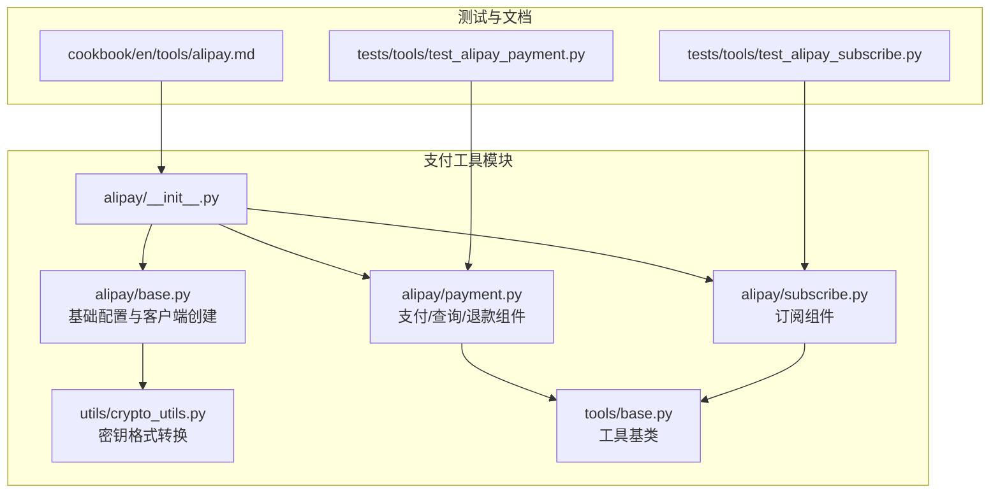
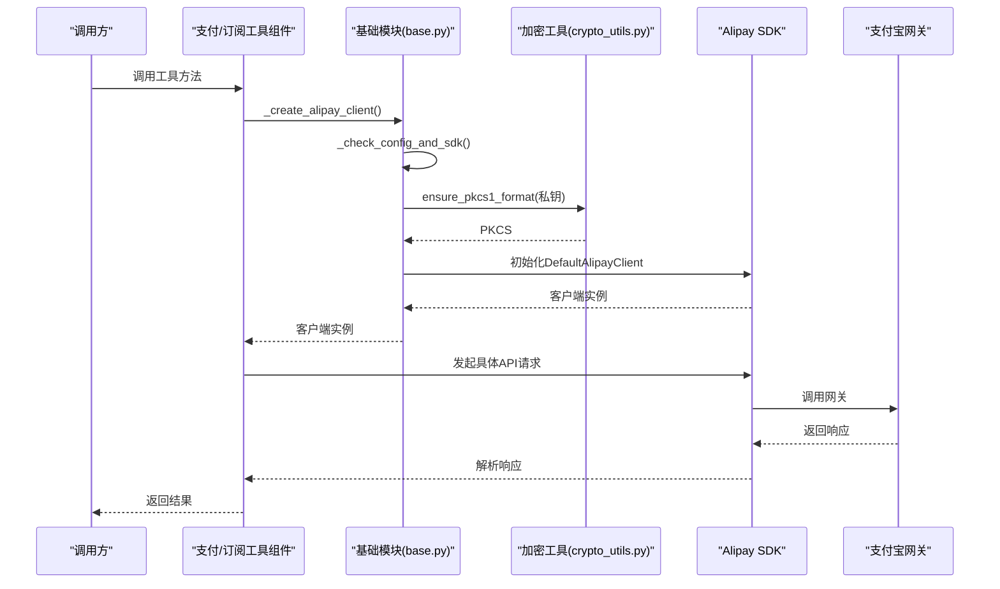
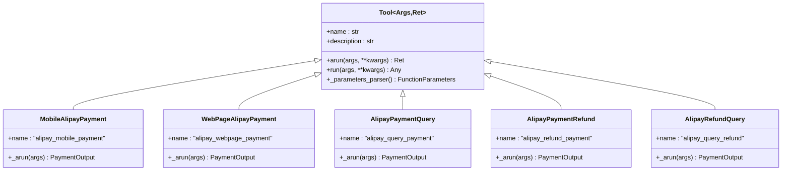
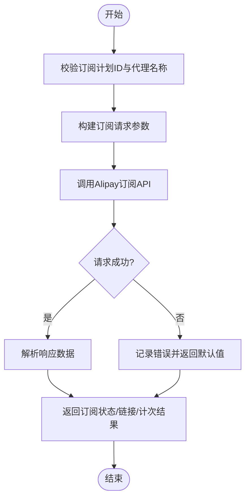
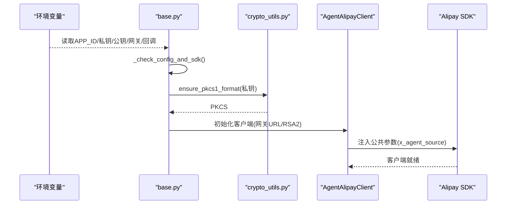
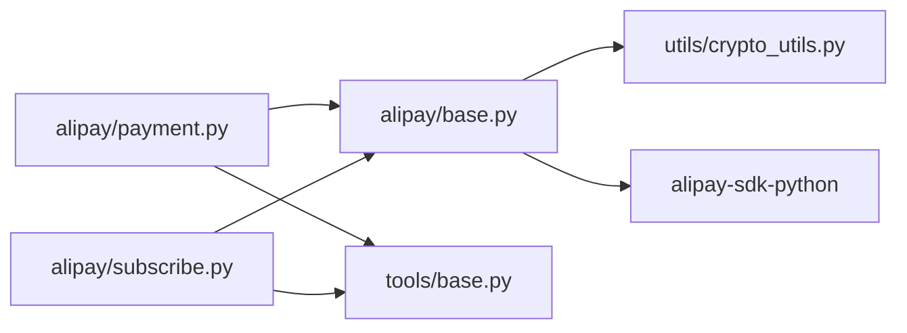

# 支付工具

<cite>
**本文档引用的文件**
- [src/agentscope_runtime/tools/alipay/__init__.py](file://src/agentscope_runtime/tools/alipay/__init__.py)
- [src/agentscope_runtime/tools/alipay/base.py](file://src/agentscope_runtime/tools/alipay/base.py)
- [src/agentscope_runtime/tools/alipay/payment.py](file://src/agentscope_runtime/tools/alipay/payment.py)
- [src/agentscope_runtime/tools/alipay/subscribe.py](file://src/agentscope_runtime/tools/alipay/subscribe.py)
- [src/agentscope_runtime/tools/utils/crypto_utils.py](file://src/agentscope_runtime/tools/utils/crypto_utils.py)
- [src/agentscope_runtime/tools/base.py](file://src/agentscope_runtime/tools/base.py)
- [tests/tools/test_alipay_payment.py](file://tests/tools/test_alipay_payment.py)
- [tests/tools/test_alipay_subscribe.py](file://tests/tools/test_alipay_subscribe.py)
- [cookbook/en/tools/alipay.md](file://cookbook/en/tools/alipay.md)
</cite>

## 目录
1. [简介](#简介)
2. [项目结构](#项目结构)
3. [核心组件](#核心组件)
4. [架构总览](#架构总览)
5. [详细组件分析](#详细组件分析)
6. [依赖关系分析](#依赖关系分析)
7. [性能考虑](#性能考虑)
8. [故障排除指南](#故障排除指南)
9. [结论](#结论)
10. [附录](#附录)

## 简介
本文件面向AgentScope Runtime中的支付工具，系统性地阐述支付宝支付接口的集成实现、API调用与参数处理、订阅支付功能的实现机制（周期性扣款与状态管理）、支付安全机制（签名验证与加密处理）、支付状态查询、回调通知与异常处理流程，以及支付配置管理、密钥管理与环境切换策略。同时提供测试方法、调试技巧与故障排除指南，帮助开发者快速上手并稳定运行支付能力。

## 项目结构
支付工具位于工具模块的支付宝子包中，采用“基础模块 + 业务组件”的分层设计：
- 基础模块负责SDK可用性检测、环境变量解析、客户端创建与密钥格式转换
- 支付模块提供移动端/网页端支付、交易查询、退款与退款查询
- 订阅模块提供订阅状态检查、订阅初始化、计次保存与一键检查/初始化
- 工具基类提供统一的工具接口与参数校验
- 测试用例覆盖各组件的典型行为与边界条件

图表来源
- [src/agentscope_runtime/tools/alipay/__init__.py:1-5](file://src/agentscope_runtime/tools/alipay/__init__.py#L1-L5)
- [src/agentscope_runtime/tools/alipay/base.py:1-335](file://src/agentscope_runtime/tools/alipay/base.py#L1-L335)
- [src/agentscope_runtime/tools/alipay/payment.py:1-836](file://src/agentscope_runtime/tools/alipay/payment.py#L1-L836)
- [src/agentscope_runtime/tools/alipay/subscribe.py:1-552](file://src/agentscope_runtime/tools/alipay/subscribe.py#L1-L552)
- [src/agentscope_runtime/tools/utils/crypto_utils.py:1-100](file://src/agentscope_runtime/tools/utils/crypto_utils.py#L1-L100)
- [src/agentscope_runtime/tools/base.py:1-265](file://src/agentscope_runtime/tools/base.py#L1-L265)
- [tests/tools/test_alipay_payment.py:1-156](file://tests/tools/test_alipay_payment.py#L1-L156)
- [tests/tools/test_alipay_subscribe.py:1-164](file://tests/tools/test_alipay_subscribe.py#L1-L164)
- [cookbook/en/tools/alipay.md:1-200](file://cookbook/en/tools/alipay.md#L1-L200)

章节来源
- [src/agentscope_runtime/tools/alipay/__init__.py:1-5](file://src/agentscope_runtime/tools/alipay/__init__.py#L1-L5)
- [src/agentscope_runtime/tools/alipay/base.py:1-335](file://src/agentscope_runtime/tools/alipay/base.py#L1-L335)
- [src/agentscope_runtime/tools/alipay/payment.py:1-836](file://src/agentscope_runtime/tools/alipay/payment.py#L1-L836)
- [src/agentscope_runtime/tools/alipay/subscribe.py:1-552](file://src/agentscope_runtime/tools/alipay/subscribe.py#L1-L552)
- [src/agentscope_runtime/tools/utils/crypto_utils.py:1-100](file://src/agentscope_runtime/tools/utils/crypto_utils.py#L1-L100)
- [src/agentscope_runtime/tools/base.py:1-265](file://src/agentscope_runtime/tools/base.py#L1-L265)
- [tests/tools/test_alipay_payment.py:1-156](file://tests/tools/test_alipay_payment.py#L1-L156)
- [tests/tools/test_alipay_subscribe.py:1-164](file://tests/tools/test_alipay_subscribe.py#L1-L164)
- [cookbook/en/tools/alipay.md:1-200](file://cookbook/en/tools/alipay.md#L1-L200)

## 核心组件
- 支付组件
  - 移动端支付：生成移动端支付链接，支持在浏览器或支付宝应用内完成支付
  - 网页端支付：生成二维码支付链接，桌面端扫码完成支付
  - 交易查询：根据商户订单号查询交易状态与金额等
  - 退款与退款查询：支持全退/部分退、幂等退款与退款状态查询
- 订阅组件
  - 订阅状态检查：判断用户是否有效订阅，返回套餐描述（按次/按时）
  - 订阅初始化：返回订阅购买链接
  - 计次保存：记录按次计费的使用次数
  - 一键检查/初始化：自动判断状态并返回订阅链接
- 基础能力
  - 环境变量配置与SDK可用性检查
  - 网关URL选择（沙箱/生产）
  - 自定义扩展参数注入（AI智能体渠道标识）
  - 密钥格式转换（PKCS#1兼容）

章节来源
- [src/agentscope_runtime/tools/alipay/payment.py:170-836](file://src/agentscope_runtime/tools/alipay/payment.py#L170-L836)
- [src/agentscope_runtime/tools/alipay/subscribe.py:144-552](file://src/agentscope_runtime/tools/alipay/subscribe.py#L144-L552)
- [src/agentscope_runtime/tools/alipay/base.py:148-335](file://src/agentscope_runtime/tools/alipay/base.py#L148-L335)
- [src/agentscope_runtime/tools/utils/crypto_utils.py:17-100](file://src/agentscope_runtime/tools/utils/crypto_utils.py#L17-L100)

## 架构总览
支付工具的整体架构围绕“基础配置与客户端创建”“业务组件封装”“SDK交互”三层展开。基础模块负责环境变量解析、SDK可用性检测、密钥格式转换与客户端实例化；业务组件基于基础模块提供的客户端，封装具体的Alipay API请求与响应解析；工具基类提供统一的输入/输出Schema与参数校验。

图表来源
- [src/agentscope_runtime/tools/alipay/base.py:172-335](file://src/agentscope_runtime/tools/alipay/base.py#L172-L335)
- [src/agentscope_runtime/tools/utils/crypto_utils.py:17-100](file://src/agentscope_runtime/tools/utils/crypto_utils.py#L17-L100)
- [src/agentscope_runtime/tools/alipay/payment.py:268-308](file://src/agentscope_runtime/tools/alipay/payment.py#L268-L308)
- [src/agentscope_runtime/tools/alipay/subscribe.py:192-267](file://src/agentscope_runtime/tools/alipay/subscribe.py#L192-L267)

## 详细组件分析

### 支付组件（移动端/网页端/查询/退款）
- 移动端支付
  - 产品码：QUICK_WAP_WAY
  - 注入扩展参数：AI智能体渠道标识
  - 回调地址：可选配置return_url与notify_url
  - 返回：Markdown格式的支付链接
- 网页端支付
  - 产品码：FAST_INSTANT_TRADE_PAY
  - 注入扩展参数：AI智能体渠道标识
  - 返回：Markdown格式的支付链接
- 交易查询
  - 输入：商户订单号
  - 输出：交易状态、金额、支付宝交易号等
- 退款与退款查询
  - 退款：支持全退/部分退，幂等控制（out_request_no）
  - 退款查询：根据out_trade_no与out_request_no查询退款状态

图表来源
- [src/agentscope_runtime/tools/base.py:34-200](file://src/agentscope_runtime/tools/base.py#L34-L200)
- [src/agentscope_runtime/tools/alipay/payment.py:170-836](file://src/agentscope_runtime/tools/alipay/payment.py#L170-L836)

章节来源
- [src/agentscope_runtime/tools/alipay/payment.py:170-836](file://src/agentscope_runtime/tools/alipay/payment.py#L170-L836)

### 订阅组件（状态检查/初始化/计次/一键检查）
- 订阅状态检查
  - 输入：uuid
  - 输出：subscribe_flag与subscribe_package描述
  - 支持按次/按时两种套餐类型
- 订阅初始化
  - 输入：uuid
  - 输出：subscribe_url（购买链接）
- 计次保存
  - 输入：uuid、out_request_no
  - 输出：success（是否计次成功）
- 一键检查/初始化
  - 自动检查订阅状态，未订阅则返回购买链接

图表来源
- [src/agentscope_runtime/tools/alipay/subscribe.py:144-552](file://src/agentscope_runtime/tools/alipay/subscribe.py#L144-L552)

章节来源
- [src/agentscope_runtime/tools/alipay/subscribe.py:144-552](file://src/agentscope_runtime/tools/alipay/subscribe.py#L144-L552)

### 基础模块与安全机制
- 环境变量与网关选择
  - AP_CURRENT_ENV：sandbox/production
  - ALIPAY_APP_ID、ALIPAY_PRIVATE_KEY、ALIPAY_PUBLIC_KEY
  - AP_RETURN_URL、AP_NOTIFY_URL
  - X_AGENT_CHANNEL：AI智能体渠道标识
- 客户端创建
  - _check_config_and_sdk：校验必填项与SDK可用性
  - ensure_pkcs1_format：将私钥转换为PKCS#1格式，确保SDK兼容
  - AgentAlipayClient：重写公共参数注入，加入x_agent_source
- 安全与签名
  - 签名算法：RSA2
  - 网关URL：根据环境变量动态选择
  - 回调安全：建议在业务侧对notify_url进行签名校验（由SDK内部处理，业务需保证回调端点正确）

图表来源
- [src/agentscope_runtime/tools/alipay/base.py:172-335](file://src/agentscope_runtime/tools/alipay/base.py#L172-L335)
- [src/agentscope_runtime/tools/utils/crypto_utils.py:17-100](file://src/agentscope_runtime/tools/utils/crypto_utils.py#L17-L100)

章节来源
- [src/agentscope_runtime/tools/alipay/base.py:148-335](file://src/agentscope_runtime/tools/alipay/base.py#L148-L335)
- [src/agentscope_runtime/tools/utils/crypto_utils.py:17-100](file://src/agentscope_runtime/tools/utils/crypto_utils.py#L17-L100)

## 依赖关系分析
- 组件耦合
  - 支付/订阅组件均依赖基础模块的客户端创建与密钥转换
  - 工具基类提供统一的输入/输出Schema与参数校验
- 外部依赖
  - alipay-sdk-python：官方SDK
  - cryptography：密钥格式转换
  - pydantic：输入/输出Schema校验
- 潜在循环依赖
  - 无直接循环依赖，模块间职责清晰

图表来源
- [src/agentscope_runtime/tools/alipay/base.py:1-335](file://src/agentscope_runtime/tools/alipay/base.py#L1-L335)
- [src/agentscope_runtime/tools/alipay/payment.py:1-836](file://src/agentscope_runtime/tools/alipay/payment.py#L1-L836)
- [src/agentscope_runtime/tools/alipay/subscribe.py:1-552](file://src/agentscope_runtime/tools/alipay/subscribe.py#L1-L552)
- [src/agentscope_runtime/tools/utils/crypto_utils.py:1-100](file://src/agentscope_runtime/tools/utils/crypto_utils.py#L1-L100)
- [src/agentscope_runtime/tools/base.py:1-265](file://src/agentscope_runtime/tools/base.py#L1-L265)

章节来源
- [src/agentscope_runtime/tools/alipay/base.py:1-335](file://src/agentscope_runtime/tools/alipay/base.py#L1-L335)
- [src/agentscope_runtime/tools/alipay/payment.py:1-836](file://src/agentscope_runtime/tools/alipay/payment.py#L1-L836)
- [src/agentscope_runtime/tools/alipay/subscribe.py:1-552](file://src/agentscope_runtime/tools/alipay/subscribe.py#L1-L552)
- [src/agentscope_runtime/tools/utils/crypto_utils.py:1-100](file://src/agentscope_runtime/tools/utils/crypto_utils.py#L1-L100)
- [src/agentscope_runtime/tools/base.py:1-265](file://src/agentscope_runtime/tools/base.py#L1-L265)

## 性能考虑
- SDK调用延迟
  - 支付/查询/退款均为网络请求，建议在业务侧做超时控制与重试策略
- 幂等性
  - 退款与计次保存均支持幂等，避免重复扣减或重复退款
- 日志与监控
  - 建议在回调与查询处增加埋点，统计成功率与耗时

[本节为通用指导，无需特定文件来源]

## 故障排除指南
- 环境变量缺失
  - 现象：启动时报错提示缺少APP_ID/私钥/公钥
  - 处理：补齐ALIPAY_APP_ID、ALIPAY_PRIVATE_KEY、ALIPAY_PUBLIC_KEY
- SDK未安装
  - 现象：ImportError提示未安装alipay-sdk-python
  - 处理：pip安装官方SDK
- 私钥格式不兼容
  - 现象：SDK报签名错误
  - 处理：使用ensure_pkcs1_format转换私钥格式
- 网关环境错误
  - 现象：沙箱/生产环境混用导致签名不匹配
  - 处理：正确设置AP_CURRENT_ENV并核对网关URL
- 回调未触发
  - 现象：前端显示支付完成但业务侧未收到通知
  - 处理：核对AP_NOTIFY_URL与平台配置一致，确保回调端点可达且能正确解析签名

章节来源
- [src/agentscope_runtime/tools/alipay/base.py:172-209](file://src/agentscope_runtime/tools/alipay/base.py#L172-L209)
- [src/agentscope_runtime/tools/utils/crypto_utils.py:17-100](file://src/agentscope_runtime/tools/utils/crypto_utils.py#L17-L100)
- [tests/tools/test_alipay_payment.py:20-22](file://tests/tools/test_alipay_payment.py#L20-L22)
- [tests/tools/test_alipay_subscribe.py:19-21](file://tests/tools/test_alipay_subscribe.py#L19-L21)

## 结论
AgentScope Runtime的支付工具通过清晰的分层设计与严格的参数校验，提供了移动端/网页端支付、交易查询、退款与订阅管理的完整能力。配合完善的环境配置与密钥转换机制，能够在沙箱与生产环境之间灵活切换，并具备良好的幂等性与可维护性。建议在生产环境中完善回调签名校验与监控埋点，确保支付链路的稳定性与可观测性。

[本节为总结，无需特定文件来源]

## 附录

### 支付配置管理与环境切换
- 必填环境变量
  - ALIPAY_APP_ID：应用ID
  - ALIPAY_PRIVATE_KEY：应用私钥（将自动转换为PKCS#1格式）
  - ALIPAY_PUBLIC_KEY：支付宝公钥
- 可选环境变量
  - AP_CURRENT_ENV：sandbox/production，默认production
  - AP_RETURN_URL：同步回跳地址
  - AP_NOTIFY_URL：异步回调地址
- 订阅相关
  - SUBSCRIBE_PLAN_ID：订阅计划ID
  - X_AGENT_NAME：代理名称
  - USE_TIMES：每次使用扣除次数，默认1

章节来源
- [src/agentscope_runtime/tools/alipay/base.py:50-68](file://src/agentscope_runtime/tools/alipay/base.py#L50-L68)
- [src/agentscope_runtime/tools/alipay/subscribe.py:51-57](file://src/agentscope_runtime/tools/alipay/subscribe.py#L51-L57)
- [cookbook/en/tools/alipay.md:197-219](file://cookbook/en/tools/alipay.md#L197-L219)

### 支付安全机制与签名验证
- 签名算法：RSA2
- 网关URL：根据AP_CURRENT_ENV选择沙箱或生产
- 扩展参数：x_agent_source注入至公共参数，便于追踪来源
- 回调安全：建议在业务侧对接收的回调进行签名校验（SDK内部处理签名，业务需确保回调端点正确）

章节来源
- [src/agentscope_runtime/tools/alipay/base.py:325-331](file://src/agentscope_runtime/tools/alipay/base.py#L325-L331)
- [src/agentscope_runtime/tools/alipay/base.py:220-278](file://src/agentscope_runtime/tools/alipay/base.py#L220-L278)

### 支付状态查询与回调通知
- 交易查询：根据out_trade_no查询状态
- 退款查询：根据out_trade_no与out_request_no查询退款状态
- 回调通知：通过AP_NOTIFY_URL接收异步通知，建议在业务侧实现签名校验与幂等处理

章节来源
- [src/agentscope_runtime/tools/alipay/payment.py:411-545](file://src/agentscope_runtime/tools/alipay/payment.py#L411-L545)
- [src/agentscope_runtime/tools/alipay/payment.py:782-836](file://src/agentscope_runtime/tools/alipay/payment.py#L782-L836)

### 订阅支付机制与周期性扣款
- 计次扣减：AlipaySubscribeTimesSave记录使用次数，USE_TIMES决定每次扣减数量
- 状态检查：AlipaySubscribeStatusCheck区分按次/按时两种套餐类型
- 初始化购买：AlipaySubscribePackageInitialize返回订阅链接
- 一键检查/初始化：AlipaySubscribeCheckOrInitialize自动判断并返回链接

章节来源
- [src/agentscope_runtime/tools/alipay/subscribe.py:144-552](file://src/agentscope_runtime/tools/alipay/subscribe.py#L144-L552)

### 测试方法与调试技巧
- 单元测试
  - 支付组件：覆盖移动端/网页端支付、交易查询、退款与退款查询
  - 订阅组件：覆盖状态检查、初始化、计次保存与一键检查/初始化
- 调试技巧
  - 在本地使用沙箱环境（AP_CURRENT_ENV=sandbox）进行联调
  - 通过日志定位SDK调用问题，关注配置校验与密钥转换
  - 对回调进行抓包与签名校验，确保通知链路稳定

章节来源
- [tests/tools/test_alipay_payment.py:1-156](file://tests/tools/test_alipay_payment.py#L1-L156)
- [tests/tools/test_alipay_subscribe.py:1-164](file://tests/tools/test_alipay_subscribe.py#L1-L164)