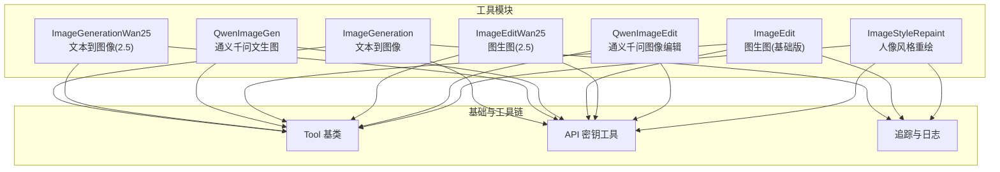
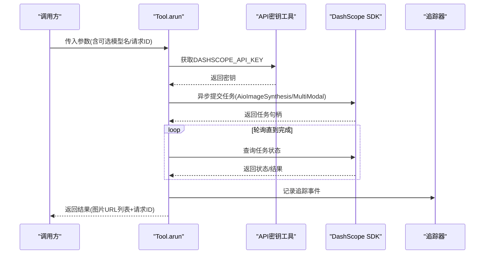
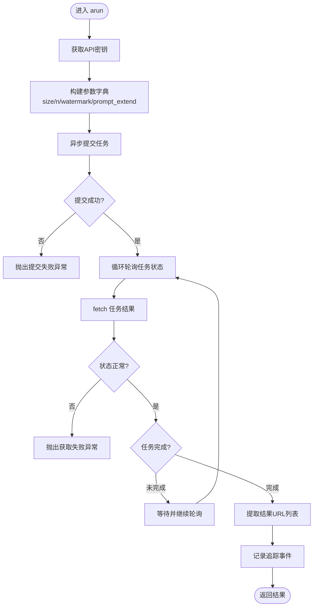
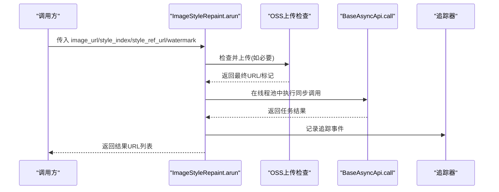
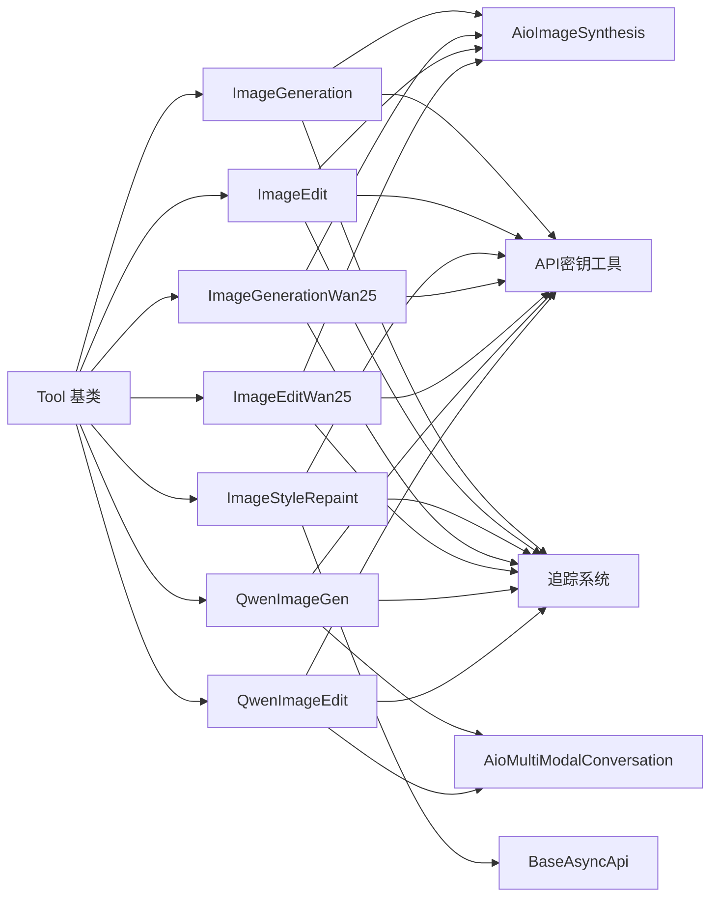

# 图像生成工具

<cite>
**本文引用的文件**
- [image_generation.py](file://src/agentscope_runtime/tools/generations/image_generation.py)
- [qwen_image_generation.py](file://src/agentscope_runtime/tools/generations/qwen_image_generation.py)
- [image_edit.py](file://src/agentscope_runtime/tools/generations/image_edit.py)
- [qwen_image_edit.py](file://src/agentscope_runtime/tools/generations/qwen_image_edit.py)
- [image_style_repaint.py](file://src/agentscope_runtime/tools/generations/image_style_repaint.py)
- [image_generation_wan25.py](file://src/agentscope_runtime/tools/generations/image_generation_wan25.py)
- [image_edit_wan25.py](file://src/agentscope_runtime/tools/generations/image_edit_wan25.py)
- [base.py](file://src/agentscope_runtime/tools/base.py)
- [api_key_util.py](file://src/agentscope_runtime/tools/utils/api_key_util.py)
- [test_generations.py](file://tests/tools/test_generations.py)
- [modelstudio_generations.md](file://cookbook/zh/tools/modelstudio_generations.md)
</cite>

## 目录
1. [简介](#简介)
2. [项目结构](#项目结构)
3. [核心组件](#核心组件)
4. [架构总览](#架构总览)
5. [详细组件分析](#详细组件分析)
6. [依赖关系分析](#依赖关系分析)
7. [性能考虑](#性能考虑)
8. [故障排查指南](#故障排查指南)
9. [结论](#结论)
10. [附录](#附录)

## 简介
本技术文档聚焦于 AgentScope Runtime 的图像生成与编辑工具，系统性解析以下能力：
- 文本到图像生成：ImageGeneration、ImageGenerationWan25、QwenImageGen
- 图像到图像编辑：ImageEdit、ImageEditWan25、QwenImageEdit
- 人像风格重绘：ImageStyleRepaint
- DashScope AioImageSynthesis 与多模态对话接口的集成方式
- 异步任务处理机制、参数配置、错误处理策略
- 通义千问模型的集成路径与性能特点
- 完整的 API 调用示例、参数说明、返回值格式与最佳实践

## 项目结构
图像生成相关代码位于 tools/generations 目录，围绕统一的 Tool 抽象基类构建，通过 Pydantic 模型定义输入输出参数，并通过 DashScope SDK 提供异步任务提交与轮询查询。

**图表来源**
- [image_generation.py:70-203](file://src/agentscope_runtime/tools/generations/image_generation.py#L70-L203)
- [image_generation_wan25.py:69-202](file://src/agentscope_runtime/tools/generations/image_generation_wan25.py#L69-L202)
- [qwen_image_generation.py:70-215](file://src/agentscope_runtime/tools/generations/qwen_image_generation.py#L70-L215)
- [image_edit.py:79-209](file://src/agentscope_runtime/tools/generations/image_edit.py#L79-L209)
- [image_edit_wan25.py:65-194](file://src/agentscope_runtime/tools/generations/image_edit_wan25.py#L65-L194)
- [qwen_image_edit.py:64-206](file://src/agentscope_runtime/tools/generations/qwen_image_edit.py#L64-L206)
- [image_style_repaint.py:69-209](file://src/agentscope_runtime/tools/generations/image_style_repaint.py#L69-L209)
- [base.py:34-142](file://src/agentscope_runtime/tools/base.py#L34-L142)
- [api_key_util.py:13-46](file://src/agentscope_runtime/tools/utils/api_key_util.py#L13-L46)

**章节来源**
- [image_generation.py:1-203](file://src/agentscope_runtime/tools/generations/image_generation.py#L1-L203)
- [image_edit.py:1-209](file://src/agentscope_runtime/tools/generations/image_edit.py#L1-L209)
- [image_style_repaint.py:1-209](file://src/agentscope_runtime/tools/generations/image_style_repaint.py#L1-L209)
- [base.py:1-265](file://src/agentscope_runtime/tools/base.py#L1-L265)
- [api_key_util.py:1-46](file://src/agentscope_runtime/tools/utils/api_key_util.py#L1-L46)

## 核心组件
- Tool 基类：提供统一的异步执行入口、参数校验、Schema 生成与同步适配。
- API 密钥工具：集中管理 DashScope API Key 获取逻辑。
- 各类图像工具：封装 DashScope 异步任务与多模态对话接口，完成参数映射、状态轮询、结果提取与追踪记录。

关键特性
- 统一的输入/输出 Pydantic 模型，确保参数合法性与文档化。
- 异步任务提交与轮询，支持超时控制与失败重试策略。
- 多模态对话接口适配，兼容不同响应结构，提升健壮性。
- 可插拔的模型名与环境变量配置，便于切换不同模型版本。

**章节来源**
- [base.py:34-142](file://src/agentscope_runtime/tools/base.py#L34-L142)
- [api_key_util.py:13-46](file://src/agentscope_runtime/tools/utils/api_key_util.py#L13-L46)

## 架构总览
整体流程分为“参数校验 → API 调用 → 异步轮询 → 结果提取 → 追踪记录”。

**图表来源**
- [image_generation.py:78-203](file://src/agentscope_runtime/tools/generations/image_generation.py#L78-L203)
- [qwen_image_generation.py:78-215](file://src/agentscope_runtime/tools/generations/qwen_image_generation.py#L78-L215)
- [image_edit.py:87-209](file://src/agentscope_runtime/tools/generations/image_edit.py#L87-L209)
- [qwen_image_edit.py:74-206](file://src/agentscope_runtime/tools/generations/qwen_image_edit.py#L74-L206)
- [image_style_repaint.py:87-209](file://src/agentscope_runtime/tools/generations/image_style_repaint.py#L87-L209)

## 详细组件分析

### ImageGeneration（文本到图像）
- 功能：基于文本描述生成图像，支持尺寸、数量、水印等参数，以及可选的提示词扩展。
- 关键点：
  - 参数映射：prompt、size、negative_prompt、prompt_extend、n、watermark → DashScope 异步任务参数。
  - 异步轮询：提交任务后以固定间隔轮询，直至成功或失败/取消，超时上限 300 秒。
  - 错误处理：状态码非 200、输出为空、任务状态异常或超时均抛出异常。
  - 追踪：通过装饰器记录请求ID与中间结果。

**图表来源**
- [image_generation.py:116-203](file://src/agentscope_runtime/tools/generations/image_generation.py#L116-L203)

**章节来源**
- [image_generation.py:70-203](file://src/agentscope_runtime/tools/generations/image_generation.py#L70-L203)

### ImageGenerationWan25（文本到图像，2.5 版本）
- 功能：与 ImageGeneration 类似，但默认模型名与参数集合略有差异，适用于 wan2.5-t2i-preview。
- 关键点：
  - 默认模型名优先从环境变量读取。
  - 参数映射与轮询策略一致，超时与错误处理同上。

**章节来源**
- [image_generation_wan25.py:69-202](file://src/agentscope_runtime/tools/generations/image_generation_wan25.py#L69-L202)

### QwenImageGen（通义千问文生图）
- 功能：通过 DashScope 多模态对话接口生成图像，适合复杂文本渲染与中英混合场景。
- 关键点：
  - 使用 AioMultiModalConversation.call，消息结构包含 text 内容。
  - 响应解析兼容多种内容结构（字符串、列表、字典），提升鲁棒性。
  - 支持 negative_prompt、size、n、prompt_extend、watermark 等参数。

**章节来源**
- [qwen_image_generation.py:70-215](file://src/agentscope_runtime/tools/generations/qwen_image_generation.py#L70-L215)

### ImageEdit（图生图，基础版）
- 功能：基于现有图像进行多种编辑（如去水印、风格化、局部修改等），支持批量生成。
- 关键点：
  - function 字段指定具体编辑类型；mask_image_url 仅在特定功能时必需。
  - 参数映射：n、watermark → 任务参数；其余参数透传至 DashScope。
  - 异步轮询与超时控制同上。

**章节来源**
- [image_edit.py:79-209](file://src/agentscope_runtime/tools/generations/image_edit.py#L79-L209)

### ImageEditWan25（图生图，2.5 版本）
- 功能：支持多图输入的图生图编辑，适用于跨图组合与场景融合。
- 关键点：
  - images 数组作为输入，prompt 与 negative_prompt 共同驱动编辑。
  - 参数映射与轮询策略一致。

**章节来源**
- [image_edit_wan25.py:65-194](file://src/agentscope_runtime/tools/generations/image_edit_wan25.py#L65-L194)

### QwenImageEdit（通义千问图像编辑）
- 功能：通过多模态对话接口对单张图像进行编辑，支持负向提示词与水印控制。
- 关键点：
  - 消息结构包含 image 与 text，便于自然语言指令驱动。
  - 响应解析兼容多种内容结构，确保结果提取稳定。

**章节来源**
- [qwen_image_edit.py:64-206](file://src/agentscope_runtime/tools/generations/qwen_image_edit.py#L64-L206)

### ImageStyleRepaint（人像风格重绘）
- 功能：为人像图像应用预设风格或参考风格进行重绘。
- 关键点：
  - 对本地/公网 URL 自动检测并上传（若需要），通过 OSS 资源解析头启用。
  - 采用线程池执行同步 BaseAsyncApi 调用，避免阻塞事件循环。
  - 支持 watermark 控制与结果 URL 提取。

**图表来源**
- [image_style_repaint.py:132-209](file://src/agentscope_runtime/tools/generations/image_style_repaint.py#L132-L209)

**章节来源**
- [image_style_repaint.py:69-209](file://src/agentscope_runtime/tools/generations/image_style_repaint.py#L69-L209)

## 依赖关系分析
- 统一继承自 Tool 基类，具备一致的参数校验、Schema 生成与运行模式。
- DashScope SDK：
  - AioImageSynthesis：异步任务提交与轮询。
  - AioMultiModalConversation：多模态对话接口。
  - BaseAsyncApi：同步调用封装（风格重绘）。
- 工具库：
  - Pydantic：参数模型与序列化。
  - asyncio：异步并发与轮询。
  - aiohttp：底层 HTTP 客户端（由 DashScope SDK 封装）。
  - 追踪系统：trace 装饰器与 TracingUtil。

**图表来源**
- [base.py:34-142](file://src/agentscope_runtime/tools/base.py#L34-L142)
- [image_generation.py:12](file://src/agentscope_runtime/tools/generations/image_generation.py#L12)
- [image_edit.py:12](file://src/agentscope_runtime/tools/generations/image_edit.py#L12)
- [image_style_repaint.py:12](file://src/agentscope_runtime/tools/generations/image_style_repaint.py#L12)
- [qwen_image_generation.py:9](file://src/agentscope_runtime/tools/generations/qwen_image_generation.py#L9)
- [qwen_image_edit.py:9](file://src/agentscope_runtime/tools/generations/qwen_image_edit.py#L9)
- [api_key_util.py:13-46](file://src/agentscope_runtime/tools/utils/api_key_util.py#L13-L46)

**章节来源**
- [base.py:34-142](file://src/agentscope_runtime/tools/base.py#L34-L142)
- [api_key_util.py:13-46](file://src/agentscope_runtime/tools/utils/api_key_util.py#L13-L46)

## 性能考虑
- 异步并发：所有任务均采用异步提交与轮询，避免阻塞主线程，适合高并发场景。
- 轮询策略：固定轮询间隔与超时上限，平衡响应速度与资源占用。
- 线程池优化：ImageStyleRepaint 使用线程池执行同步调用，降低事件循环阻塞风险。
- 模型选择：不同模型（如 wan2.2、wan2.5、qwen-image）在质量与速度上存在差异，可根据需求选择。
- 网络与存储：OSS 上传与资源解析可减少网络传输开销，提高稳定性。

## 故障排查指南
常见问题与定位方法
- API 密钥无效或缺失
  - 现象：初始化阶段即抛出异常。
  - 处理：确认环境变量 DASHSCOPE_API_KEY 设置正确，或在调用时显式传入。
  - 参考：[api_key_util.py:13-46](file://src/agentscope_runtime/tools/utils/api_key_util.py#L13-L46)
- 任务提交失败
  - 现象：提交返回状态码非 200 或输出为空。
  - 处理：检查网络连通性、模型可用性与参数合法性。
  - 参考：[image_generation.py:134-144](file://src/agentscope_runtime/tools/generations/image_generation.py#L134-L144)
- 任务轮询超时
  - 现象：超过 300 秒仍未完成。
  - 处理：适当增加等待时间或调整模型参数，关注服务端负载。
  - 参考：[image_generation.py:176-181](file://src/agentscope_runtime/tools/generations/image_generation.py#L176-L181)
- 任务状态异常（失败/取消）
  - 现象：fetch 返回 FAILED/CANCELED。
  - 处理：检查输入参数、图像 URL 可达性与格式。
  - 参考：[image_generation.py:161-171](file://src/agentscope_runtime/tools/generations/image_generation.py#L161-L171)
- 多模态响应解析失败
  - 现象：无法从响应中提取图片 URL。
  - 处理：确认消息结构与内容字段，必要时打印调试信息。
  - 参考：[qwen_image_generation.py:157-187](file://src/agentscope_runtime/tools/generations/qwen_image_generation.py#L157-L187)

**章节来源**
- [api_key_util.py:13-46](file://src/agentscope_runtime/tools/utils/api_key_util.py#L13-L46)
- [image_generation.py:134-181](file://src/agentscope_runtime/tools/generations/image_generation.py#L134-L181)
- [qwen_image_generation.py:157-187](file://src/agentscope_runtime/tools/generations/qwen_image_generation.py#L157-L187)

## 结论
AgentScope Runtime 的图像生成与编辑工具通过统一的 Tool 抽象、严谨的参数模型与 DashScope SDK 集成，提供了稳定、可扩展的异步图像处理能力。各组件在参数配置、异步轮询与错误处理方面保持一致性，同时针对不同模型（wan2.x、qwen-image）与场景（文本生成、图像编辑、风格重绘）提供了差异化实现。建议在生产环境中结合追踪系统与合理的超时策略，确保稳定性与可观测性。

## 附录

### API 调用示例与参数说明
- 文本到图像（ImageGeneration）
  - 输入参数要点：prompt、size、negative_prompt、prompt_extend、n、watermark
  - 输出：results（URL 列表）、request_id
  - 示例参考：[modelstudio_generations.md:68-90](file://cookbook/zh/tools/modelstudio_generations.md#L68-L90)
- 通义千问文生图（QwenImageGen）
  - 输入参数要点：prompt、negative_prompt、size、n、prompt_extend、watermark
  - 输出：results（URL 列表）、request_id
  - 示例参考：[test_generations.py:672-711](file://tests/tools/test_generations.py#L672-L711)
- 图像到图像编辑（ImageEdit）
  - 输入参数要点：function、base_image_url、mask_image_url（按需）、prompt、n、watermark
  - 输出：results（URL 列表）、request_id
  - 示例参考：[test_generations.py:448-467](file://tests/tools/test_generations.py#L448-L467)
- 通义千问图像编辑（QwenImageEdit）
  - 输入参数要点：image_url、prompt、negative_prompt、watermark
  - 输出：results（URL 列表）、request_id
  - 示例参考：[test_generations.py:612-655](file://tests/tools/test_generations.py#L612-L655)
- 人像风格重绘（ImageStyleRepaint）
  - 输入参数要点：image_url、style_index、style_ref_url（按需）、watermark
  - 输出：results（URL 列表）、request_id
  - 示例参考：[test_generations.py:514-531](file://tests/tools/test_generations.py#L514-L531)

### 最佳实践建议
- 明确模型选择：根据质量与速度需求选择合适模型（如 qwen-image、wan2.5）。
- 控制并发与超时：合理设置轮询间隔与最大等待时间，避免资源浪费。
- 参数校验与日志：利用 Pydantic 模型与追踪系统，确保输入合法与过程可观测。
- 网络与存储：优先使用公网可达且合规的图像 URL，必要时启用 OSS 上传与资源解析。
- 错误恢复：对超时与失败场景设计重试与降级策略，保障用户体验。