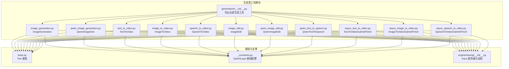
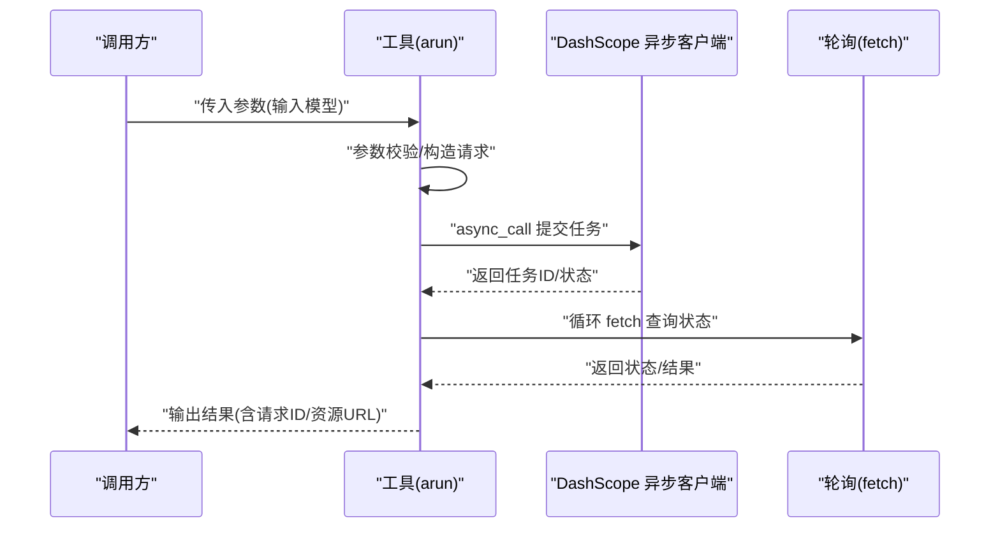
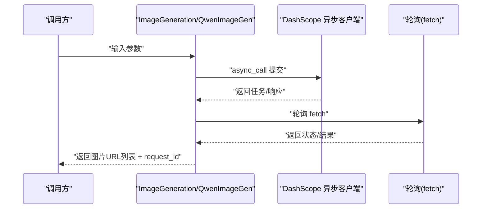
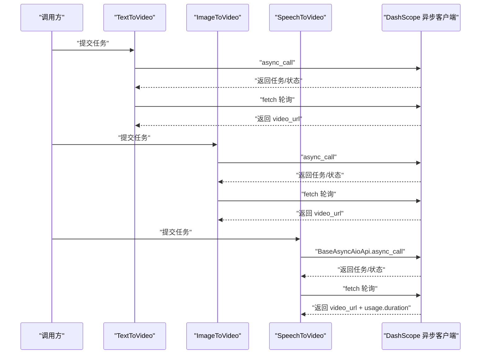
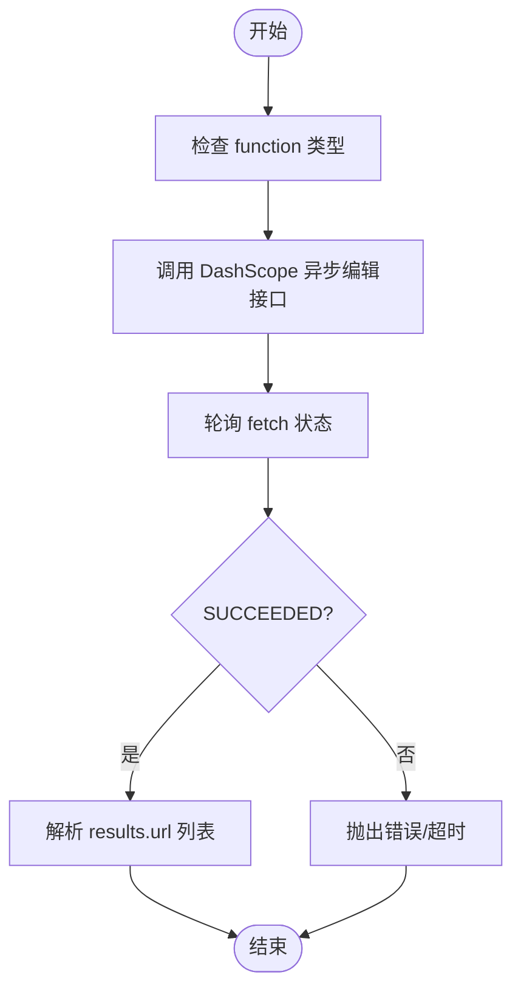
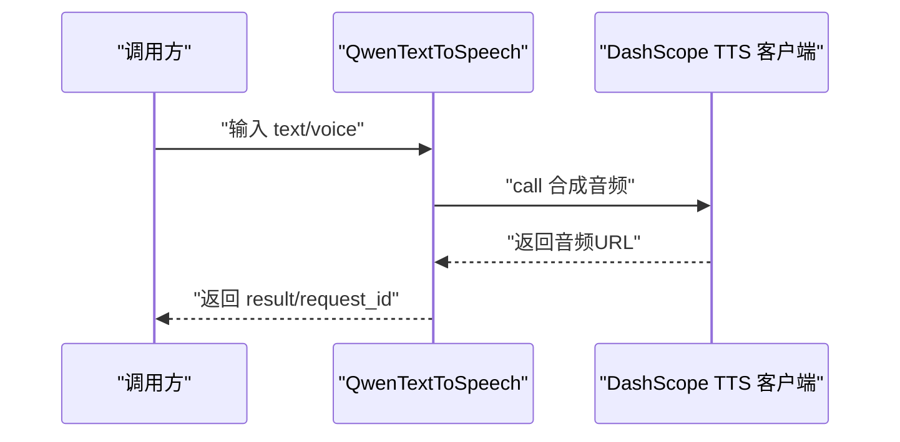
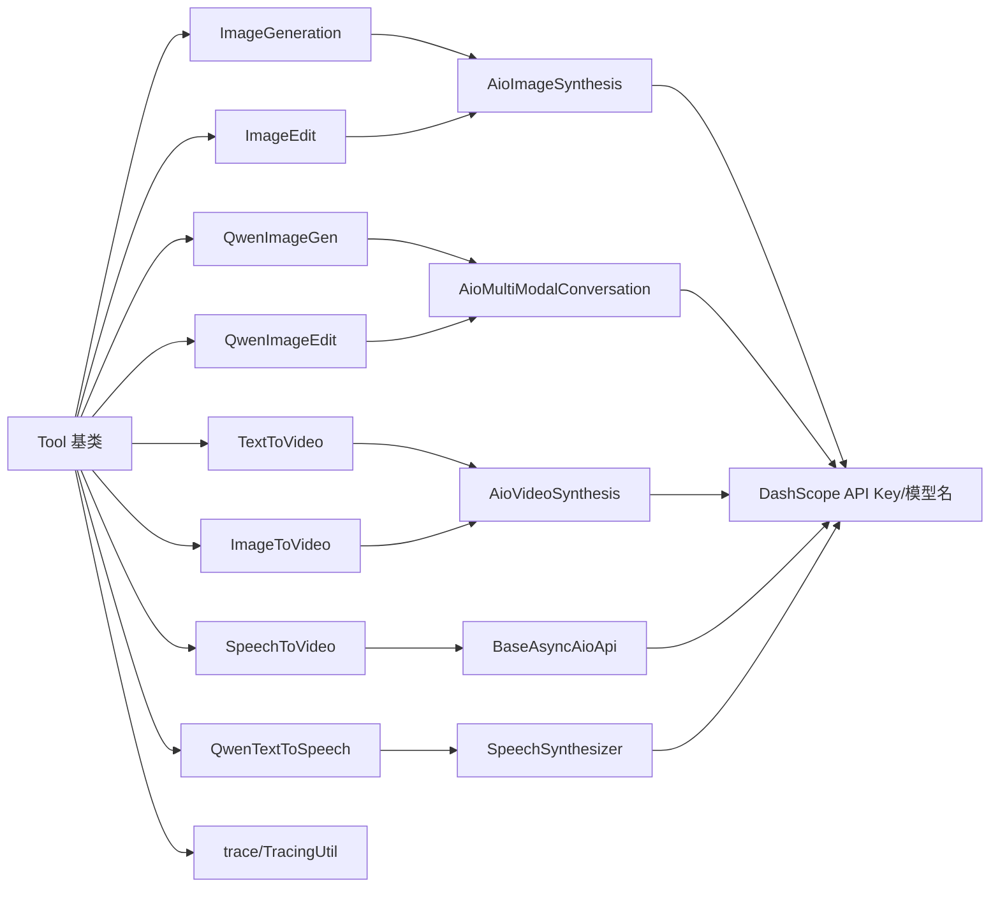

# 生成类工具

<cite>
**本文引用的文件**
- [src/agentscope_runtime/tools/generations/__init__.py](file://src/agentscope_runtime/tools/generations/__init__.py)
- [src/agentscope_runtime/tools/base.py](file://src/agentscope_runtime/tools/base.py)
- [src/agentscope_runtime/tools/generations/image_generation.py](file://src/agentscope_runtime/tools/generations/image_generation.py)
- [src/agentscope_runtime/tools/generations/qwen_image_generation.py](file://src/agentscope_runtime/tools/generations/qwen_image_generation.py)
- [src/agentscope_runtime/tools/generations/text_to_video.py](file://src/agentscope_runtime/tools/generations/text_to_video.py)
- [src/agentscope_runtime/tools/generations/image_to_video.py](file://src/agentscope_runtime/tools/generations/image_to_video.py)
- [src/agentscope_runtime/tools/generations/speech_to_video.py](file://src/agentscope_runtime/tools/generations/speech_to_video.py)
- [src/agentscope_runtime/tools/generations/image_edit.py](file://src/agentscope_runtime/tools/generations/image_edit.py)
- [src/agentscope_runtime/tools/generations/qwen_image_edit.py](file://src/agentscope_runtime/tools/generations/qwen_image_edit.py)
- [src/agentscope_runtime/tools/generations/qwen_text_to_speech.py](file://src/agentscope_runtime/tools/generations/qwen_text_to_speech.py)
- [src/agentscope_runtime/tools/generations/async_text_to_video.py](file://src/agentscope_runtime/tools/generations/async_text_to_video.py)
- [src/agentscope_runtime/tools/generations/async_image_to_video.py](file://src/agentscope_runtime/tools/generations/async_image_to_video.py)
- [src/agentscope_runtime/tools/generations/async_speech_to_video.py](file://src/agentscope_runtime/tools/generations/async_speech_to_video.py)
- [src/agentscope_runtime/tools/_constants.py](file://src/agentscope_runtime/tools/_constants.py)
- [src/agentscope_runtime/engine/tracing/__init__.py](file://src/agentscope_runtime/engine/tracing/__init__.py)
</cite>

## 目录
1. [简介](#简介)
2. [项目结构](#项目结构)
3. [核心组件](#核心组件)
4. [架构总览](#架构总览)
5. [详细组件分析](#详细组件分析)
6. [依赖分析](#依赖分析)
7. [性能考虑](#性能考虑)
8. [故障排查指南](#故障排查指南)
9. [结论](#结论)
10. [附录](#附录)

## 简介
本文件面向 AgentScope Runtime 的生成类工具，系统性梳理以下能力：
- 图像生成：ImageGeneration、QwenImageGen
- 视频生成：TextToVideo、ImageToVideo、SpeechToVideo 及其异步版本（TextToVideoSubmit/Fetch、ImageToVideoSubmit/Fetch、SpeechToVideoSubmit/Fetch）
- 图像编辑：ImageEdit、QwenImageEdit
- 文本转语音：QwenTextToSpeech
- 异步任务处理、进度跟踪与结果获取机制

文档从代码结构、数据流、处理逻辑、错误处理与性能特征等方面进行深入解析，并提供可视化图示帮助理解。

## 项目结构
生成类工具集中于 tools/generations 模块，统一继承自基础工具基类 Tool，采用 Pydantic 数据模型定义输入/输出参数，通过 DashScope 客户端异步调用实现高性能生成与异步轮询。

图表来源
- [src/agentscope_runtime/tools/generations/__init__.py:1-76](file://src/agentscope_runtime/tools/generations/__init__.py#L1-L76)
- [src/agentscope_runtime/tools/base.py:34-265](file://src/agentscope_runtime/tools/base.py#L34-L265)
- [src/agentscope_runtime/tools/_constants.py:1-19](file://src/agentscope_runtime/tools/_constants.py#L1-L19)
- [src/agentscope_runtime/engine/tracing/__init__.py:1-47](file://src/agentscope_runtime/engine/tracing/__init__.py#L1-L47)

章节来源
- [src/agentscope_runtime/tools/generations/__init__.py:1-76](file://src/agentscope_runtime/tools/generations/__init__.py#L1-L76)

## 核心组件
- 工具基类 Tool：提供统一的异步运行接口、参数校验、Schema 生成与字符串化返回值处理；支持同步包装与类型安全的输入/输出验证。
- DashScope 集成：通过 AioImageSynthesis、AioVideoSynthesis、AioMultiModalConversation、SpeechSynthesizer 等客户端进行异步调用与轮询。
- 追踪与日志：使用 trace 装饰器与 TracingUtil 统一记录请求 ID 与中间结果，便于问题定位与性能分析。
- 异常与超时：统一的异常抛出与超时控制，确保长时间任务的健壮性。

章节来源
- [src/agentscope_runtime/tools/base.py:34-265](file://src/agentscope_runtime/tools/base.py#L34-L265)
- [src/agentscope_runtime/engine/tracing/__init__.py:1-47](file://src/agentscope_runtime/engine/tracing/__init__.py#L1-L47)

## 架构总览
生成类工具遵循“参数校验 → 异步提交 → 轮询状态 → 提取结果”的通用流程。异步版本将“提交任务”和“获取结果”拆分为两个独立步骤，便于后台长时间任务与前端交互解耦。

图表来源
- [src/agentscope_runtime/tools/generations/text_to_video.py:85-222](file://src/agentscope_runtime/tools/generations/text_to_video.py#L85-L222)
- [src/agentscope_runtime/tools/generations/image_to_video.py:93-234](file://src/agentscope_runtime/tools/generations/image_to_video.py#L93-L234)
- [src/agentscope_runtime/tools/generations/speech_to_video.py:147-315](file://src/agentscope_runtime/tools/generations/speech_to_video.py#L147-L315)

## 详细组件分析

### 图像生成：ImageGeneration 与 QwenImageGen
- ImageGeneration（通义万相-文生图）
  - 输入参数：prompt、size、negative_prompt、prompt_extend、n、watermark 等
  - 实现要点：调用 AioImageSynthesis.async_call 提交任务，随后轮询 fetch 直到 SUCCEEDED；超时时间约 5 分钟；最终提取 results.url 列表
  - 输出：results（图片URL数组）、request_id
- QwenImageGen（通义千问-文生图）
  - 输入参数：prompt、negative_prompt、size、n、prompt_extend、watermark 等
  - 实现要点：使用 AioMultiModalConversation.call，消息结构为用户角色+文本内容；解析 response.output.choices[0].message.content 中的图片URL
  - 输出：results（图片URL数组）、request_id

图表来源
- [src/agentscope_runtime/tools/generations/image_generation.py:78-203](file://src/agentscope_runtime/tools/generations/image_generation.py#L78-L203)
- [src/agentscope_runtime/tools/generations/qwen_image_generation.py:78-215](file://src/agentscope_runtime/tools/generations/qwen_image_generation.py#L78-L215)

章节来源
- [src/agentscope_runtime/tools/generations/image_generation.py:21-203](file://src/agentscope_runtime/tools/generations/image_generation.py#L21-L203)
- [src/agentscope_runtime/tools/generations/qwen_image_generation.py:18-215](file://src/agentscope_runtime/tools/generations/qwen_image_generation.py#L18-L215)

### 视频生成：TextToVideo、ImageToVideo、SpeechToVideo 及异步版本
- TextToVideo（文生视频）
  - 输入：prompt、negative_prompt、size、duration、prompt_extend、watermark 等
  - 流程：AioVideoSynthesis.async_call 提交 → 轮询 fetch → 返回 video_url
  - 超时：约 10 分钟
- ImageToVideo（图生视频）
  - 输入：image_url、prompt、negative_prompt、template、resolution、duration、prompt_extend、watermark 等
  - 流程：同上，支持特效模板与分辨率控制
- SpeechToVideo（语音驱动视频）
  - 输入：image_url、audio_url、resolution
  - 流程：使用 BaseAsyncAioApi.async_call 提交，fetch 返回 results.video_url 与 usage.duration
  - 超时：约 10 分钟
- 异步版本
  - TextToVideoSubmit/Fetch：先提交任务获取 task_id 与 task_status，再通过 Fetch 获取 video_url
  - ImageToVideoSubmit/Fetch：同上，支持模板与分辨率
  - SpeechToVideoSubmit/Fetch：先提交任务，再轮询获取 video_url（仅成功时存在）

图表来源
- [src/agentscope_runtime/tools/generations/text_to_video.py:85-222](file://src/agentscope_runtime/tools/generations/text_to_video.py#L85-L222)
- [src/agentscope_runtime/tools/generations/image_to_video.py:93-234](file://src/agentscope_runtime/tools/generations/image_to_video.py#L93-L234)
- [src/agentscope_runtime/tools/generations/speech_to_video.py:147-315](file://src/agentscope_runtime/tools/generations/speech_to_video.py#L147-L315)

章节来源
- [src/agentscope_runtime/tools/generations/text_to_video.py:21-222](file://src/agentscope_runtime/tools/generations/text_to_video.py#L21-L222)
- [src/agentscope_runtime/tools/generations/image_to_video.py:21-234](file://src/agentscope_runtime/tools/generations/image_to_video.py#L21-L234)
- [src/agentscope_runtime/tools/generations/speech_to_video.py:21-315](file://src/agentscope_runtime/tools/generations/speech_to_video.py#L21-L315)
- [src/agentscope_runtime/tools/generations/async_text_to_video.py:77-321](file://src/agentscope_runtime/tools/generations/async_text_to_video.py#L77-L321)
- [src/agentscope_runtime/tools/generations/async_image_to_video.py:91-351](file://src/agentscope_runtime/tools/generations/async_image_to_video.py#L91-L351)
- [src/agentscope_runtime/tools/generations/async_speech_to_video.py:72-423](file://src/agentscope_runtime/tools/generations/async_speech_to_video.py#L72-L423)

### 图像编辑：ImageEdit 与 QwenImageEdit
- ImageEdit（通义万相-图生图）
  - 功能：支持风格化、局部风格化、描述性编辑、带遮罩描述性编辑、去水印、扩图、超分、上色、涂鸦、卡通化等
  - 参数：function、base_image_url、mask_image_url（按需）、prompt、n、watermark 等
  - 流程：AioImageSynthesis.async_call 提交 → 轮询 fetch → 返回 results.url 列表
- QwenImageEdit（通义千问-图像编辑）
  - 输入：image_url、prompt、negative_prompt、watermark
  - 流程：AioMultiModalConversation.call，消息包含 image 与 text；解析响应中的图片URL

图表来源
- [src/agentscope_runtime/tools/generations/image_edit.py:87-209](file://src/agentscope_runtime/tools/generations/image_edit.py#L87-L209)
- [src/agentscope_runtime/tools/generations/qwen_image_edit.py:74-206](file://src/agentscope_runtime/tools/generations/qwen_image_edit.py#L74-L206)

章节来源
- [src/agentscope_runtime/tools/generations/image_edit.py:21-209](file://src/agentscope_runtime/tools/generations/image_edit.py#L21-L209)
- [src/agentscope_runtime/tools/generations/qwen_image_edit.py:18-206](file://src/agentscope_runtime/tools/generations/qwen_image_edit.py#L18-L206)

### 文本转语音：QwenTextToSpeech
- 输入：text（最长 512 Token）、voice（音色）
- 实现：dashscope.audio.qwen_tts.SpeechSynthesizer.call 返回音频URL
- 输出：result（音频URL）、request_id

图表来源
- [src/agentscope_runtime/tools/generations/qwen_text_to_speech.py:63-155](file://src/agentscope_runtime/tools/generations/qwen_text_to_speech.py#L63-L155)

章节来源
- [src/agentscope_runtime/tools/generations/qwen_text_to_speech.py:17-155](file://src/agentscope_runtime/tools/generations/qwen_text_to_speech.py#L17-L155)

## 依赖分析
- 工具基类 Tool
  - 统一的泛型输入/输出类型约束、参数 Schema 生成、同步/异步运行封装、字符串化返回值
- DashScope 客户端
  - AioImageSynthesis、AioVideoSynthesis、AioMultiModalConversation、SpeechSynthesizer
  - BaseAsyncAioApi（部分异步视频工具）
- 追踪系统
  - trace 装饰器、TracingUtil.request_id、TraceType
- 环境变量
  - DASHSCOPE_API_KEY、各模型名称环境变量（如 IMAGE_GENERATION_MODEL_NAME 等）

图表来源
- [src/agentscope_runtime/tools/base.py:34-265](file://src/agentscope_runtime/tools/base.py#L34-L265)
- [src/agentscope_runtime/tools/_constants.py:1-19](file://src/agentscope_runtime/tools/_constants.py#L1-L19)
- [src/agentscope_runtime/engine/tracing/__init__.py:1-47](file://src/agentscope_runtime/engine/tracing/__init__.py#L1-L47)

章节来源
- [src/agentscope_runtime/tools/base.py:34-265](file://src/agentscope_runtime/tools/base.py#L34-L265)
- [src/agentscope_runtime/tools/_constants.py:1-19](file://src/agentscope_runtime/tools/_constants.py#L1-L19)

## 性能考虑
- 异步并发：所有生成工具均采用异步客户端与异步提交，避免阻塞线程，提升吞吐
- 轮询策略：合理设置轮询间隔与最大等待时间，平衡实时性与资源占用
- 超时控制：针对不同任务设定超时阈值（图像生成约 5 分钟，视频生成约 10 分钟），防止长时间挂起
- 结果解析：优先从标准字段提取结果，减少不必要的 JSON 解析开销
- 追踪日志：trace 事件仅在需要时记录，避免生产环境过度 IO

## 故障排查指南
- 认证失败
  - 现象：抛出“请设置有效的 DASHSCOPE_API_KEY”
  - 排查：确认环境变量 DASHSCOPE_API_KEY 是否正确设置
- 任务提交失败
  - 现象：提交阶段返回非 200 或 task_status 为 FAILED/CANCELED
  - 排查：检查输入参数合法性、网络连通性、模型可用性
- 轮询无进展
  - 现象：长时间处于 PENDING/RUNNING
  - 排查：查看轮询间隔与超时设置；确认 DashScope 侧任务队列负载
- 结果解析异常
  - 现象：无法从响应中提取 URL
  - 排查：核对响应结构差异（不同 API 返回结构可能不同），必要时增加容错分支
- 请求 ID 缺失
  - 现象：返回对象未包含 request_id
  - 排查：若响应未携带，工具会生成 UUID 作为 fallback

章节来源
- [src/agentscope_runtime/tools/generations/image_generation.py:106-180](file://src/agentscope_runtime/tools/generations/image_generation.py#L106-L180)
- [src/agentscope_runtime/tools/generations/text_to_video.py:148-192](file://src/agentscope_runtime/tools/generations/text_to_video.py#L148-L192)
- [src/agentscope_runtime/tools/generations/speech_to_video.py:203-260](file://src/agentscope_runtime/tools/generations/speech_to_video.py#L203-L260)
- [src/agentscope_runtime/tools/generations/qwen_text_to_speech.py:89-127](file://src/agentscope_runtime/tools/generations/qwen_text_to_speech.py#L89-L127)

## 结论
生成类工具在 AgentScope Runtime 中通过统一的 Tool 基类与 DashScope 异步客户端实现了高内聚、低耦合的多模态生成能力。同步与异步版本覆盖了从文本到图像、视频与语音的广泛场景，配合完善的参数校验、超时控制与追踪日志，能够满足生产级应用的稳定性与可观测性需求。

## 附录
- 常用环境变量
  - DASHSCOPE_API_KEY：DashScope API 密钥
  - IMAGE_GENERATION_MODEL_NAME、QWEN_IMAGE_GENERATION_MODEL_NAME、TEXT_TO_VIDEO_MODEL_NAME、IMAGE_TO_VIDEO_MODEL_NAME、SPEECH_TO_VIDEO_MODEL_NAME、QWEN_TEXT_TO_SPEECH_MODEL_NAME：各模型名称默认值
- 建议最佳实践
  - 使用异步提交/查询模式处理长耗时任务
  - 在调用前严格校验输入参数，减少无效请求
  - 为关键流程开启 trace，便于问题定位与性能分析