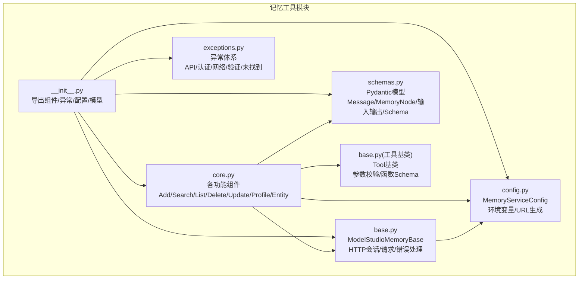
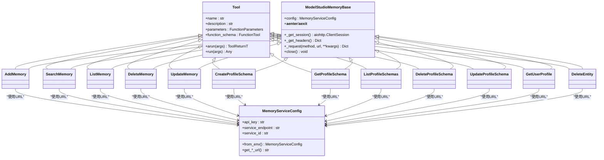
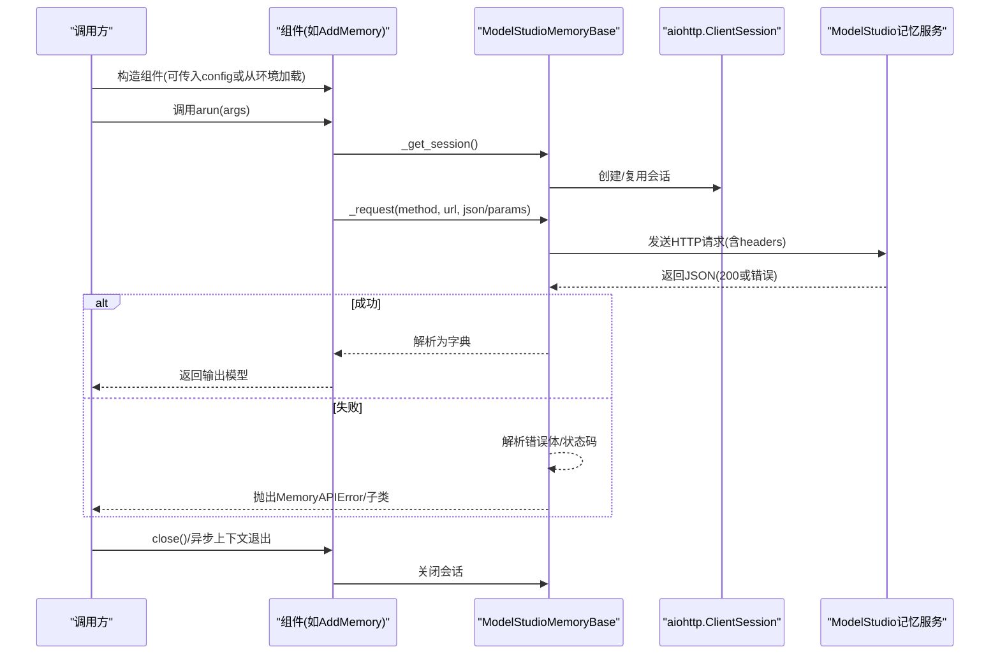
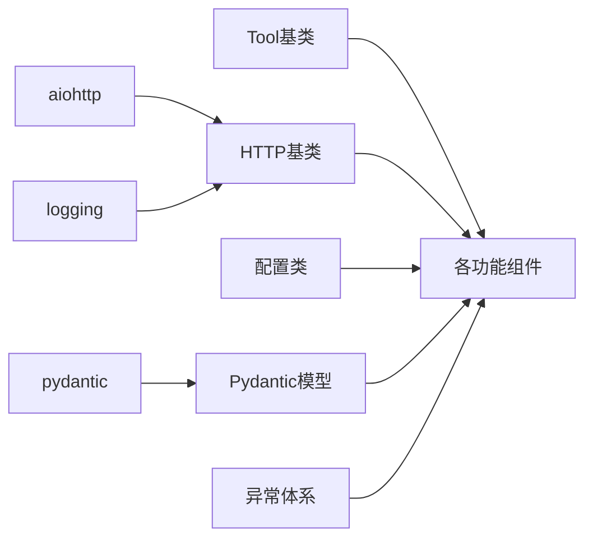

# 记忆工具

<cite>
**本文引用的文件**
- [__init__.py](file://src/agentscope_runtime/tools/modelstudio_memory/__init__.py)
- [base.py](file://src/agentscope_runtime/tools/modelstudio_memory/base.py)
- [core.py](file://src/agentscope_runtime/tools/modelstudio_memory/core.py)
- [config.py](file://src/agentscope_runtime/tools/modelstudio_memory/config.py)
- [schemas.py](file://src/agentscope_runtime/tools/modelstudio_memory/schemas.py)
- [exceptions.py](file://src/agentscope_runtime/tools/modelstudio_memory/exceptions.py)
- [base.py](file://src/agentscope_runtime/tools/base.py)
- [memory_demo.py](file://examples/modelstudio_memory/memory_demo.py)
- [test_modelstudio_memory.py](file://tests/tools/test_modelstudio_memory.py)
- [modelstudio_memory.md](file://cookbook/zh/tools/modelstudio_memory.md)
</cite>

## 目录
1. [简介](#简介)
2. [项目结构](#项目结构)
3. [核心组件](#核心组件)
4. [架构总览](#架构总览)
5. [详细组件分析](#详细组件分析)
6. [依赖分析](#依赖分析)
7. [性能考虑](#性能考虑)
8. [故障排查指南](#故障排查指南)
9. [结论](#结论)
10. [附录](#附录)

## 简介
本文件面向AgentScope Runtime中的ModelStudio记忆工具，系统性阐述其架构设计、数据模型、配置管理、异常体系、检索与过滤机制，以及扩展开发与自定义实现指南。该工具提供对话记忆存储、语义检索、用户画像Schema管理与提取等能力，支持异步调用与资源清理，适用于构建具备长期记忆与个性化能力的智能体应用。

## 项目结构
ModelStudio记忆工具位于src/agentscope_runtime/tools/modelstudio_memory目录，采用“组件+模式”的组织方式：
- 组件层：AddMemory、SearchMemory、ListMemory、DeleteMemory、UpdateMemory、CreateProfileSchema、GetProfileSchema、ListProfileSchemas、DeleteProfileSchema、UpdateProfileSchema、GetUserProfile、DeleteEntity
- 基类与通用逻辑：ModelStudioMemoryBase（HTTP会话、请求封装、错误处理）、Tool（函数式工具基类）
- 配置与URL生成：MemoryServiceConfig（从环境变量加载、URL拼接）
- 数据模型：Pydantic模型定义输入输出与实体结构
- 异常体系：MemoryAPIError及其子类
- 示例与测试：examples与tests目录下的演示与单元测试

图表来源
- [__init__.py:1-155](file://src/agentscope_runtime/tools/modelstudio_memory/__init__.py#L1-L155)
- [base.py:1-221](file://src/agentscope_runtime/tools/modelstudio_memory/base.py#L1-L221)
- [core.py:1-1150](file://src/agentscope_runtime/tools/modelstudio_memory/core.py#L1-L1150)
- [config.py:1-99](file://src/agentscope_runtime/tools/modelstudio_memory/config.py#L1-L99)
- [schemas.py:1-514](file://src/agentscope_runtime/tools/modelstudio_memory/schemas.py#L1-L514)
- [exceptions.py:1-61](file://src/agentscope_runtime/tools/modelstudio_memory/exceptions.py#L1-L61)
- [base.py:1-265](file://src/agentscope_runtime/tools/base.py#L1-L265)

章节来源
- [__init__.py:1-155](file://src/agentscope_runtime/tools/modelstudio_memory/__init__.py#L1-L155)
- [base.py:1-221](file://src/agentscope_runtime/tools/modelstudio_memory/base.py#L1-L221)
- [core.py:1-1150](file://src/agentscope_runtime/tools/modelstudio_memory/core.py#L1-L1150)
- [config.py:1-99](file://src/agentscope_runtime/tools/modelstudio_memory/config.py#L1-L99)
- [schemas.py:1-514](file://src/agentscope_runtime/tools/modelstudio_memory/schemas.py#L1-L514)
- [exceptions.py:1-61](file://src/agentscope_runtime/tools/modelstudio_memory/exceptions.py#L1-L61)
- [base.py:1-265](file://src/agentscope_runtime/tools/base.py#L1-L265)

## 核心组件
- ModelStudioMemoryBase：统一的HTTP客户端封装，负责会话管理、请求头生成、统一错误处理与资源关闭。
- Tool：通用工具基类，提供参数Schema解析、同步/异步执行、类型校验与字符串化返回值。
- MemoryServiceConfig：从环境变量加载配置，生成各端点URL。
- 各功能组件：AddMemory、SearchMemory、ListMemory、DeleteMemory、UpdateMemory、CreateProfileSchema、GetProfileSchema、ListProfileSchemas、DeleteProfileSchema、UpdateProfileSchema、GetUserProfile、DeleteEntity。
- Pydantic模型：Message、MemoryNode、各类输入输出模型、用户画像相关模型。
- 异常：MemoryAPIError、MemoryAuthenticationError、MemoryNotFoundError、MemoryValidationError、MemoryNetworkError。

章节来源
- [base.py:25-221](file://src/agentscope_runtime/tools/modelstudio_memory/base.py#L25-L221)
- [base.py:34-265](file://src/agentscope_runtime/tools/base.py#L34-L265)
- [config.py:15-99](file://src/agentscope_runtime/tools/modelstudio_memory/config.py#L15-L99)
- [core.py:55-1150](file://src/agentscope_runtime/tools/modelstudio_memory/core.py#L55-L1150)
- [schemas.py:10-514](file://src/agentscope_runtime/tools/modelstudio_memory/schemas.py#L10-L514)
- [exceptions.py:8-61](file://src/agentscope_runtime/tools/modelstudio_memory/exceptions.py#L8-L61)

## 架构总览
整体架构遵循“组件+基类+配置+模型+异常”的分层设计，组件通过继承基类获得统一的HTTP请求能力与生命周期管理；配置类负责环境变量解析与URL生成；模型定义输入输出契约；异常体系覆盖网络、认证、验证与业务错误。

图表来源
- [base.py:25-221](file://src/agentscope_runtime/tools/modelstudio_memory/base.py#L25-L221)
- [base.py:34-265](file://src/agentscope_runtime/tools/base.py#L34-L265)
- [config.py:15-99](file://src/agentscope_runtime/tools/modelstudio_memory/config.py#L15-L99)
- [core.py:55-1150](file://src/agentscope_runtime/tools/modelstudio_memory/core.py#L55-L1150)

## 详细组件分析

### 组件生命周期与状态管理
- 初始化：组件构造时可传入MemoryServiceConfig或从环境变量加载配置；内部持有config实例。
- 会话管理：首次发起请求时创建aiohttp.ClientSession，复用至close()；支持异步上下文管理器自动关闭。
- 请求与响应：统一通过_request方法发送HTTP请求，成功返回JSON，失败解析错误体并抛出自定义异常。
- 关闭：显式close()或异步上下文退出时关闭会话，释放资源。

图表来源
- [base.py:78-196](file://src/agentscope_runtime/tools/modelstudio_memory/base.py#L78-L196)
- [core.py:94-157](file://src/agentscope_runtime/tools/modelstudio_memory/core.py#L94-L157)

章节来源
- [base.py:40-221](file://src/agentscope_runtime/tools/modelstudio_memory/base.py#L40-L221)
- [core.py:94-157](file://src/agentscope_runtime/tools/modelstudio_memory/core.py#L94-L157)

### 配置管理与环境变量
- 必需环境变量：DASHSCOPE_API_KEY（认证）。
- 可选环境变量：MEMORY_SERVICE_ENDPOINT（默认值见源码）、MODELSTUDIO_SERVICE_ID（默认“memory_service”）。
- 配置类提供from_env()从环境变量加载，get_*_url()生成各端点URL。

章节来源
- [config.py:30-99](file://src/agentscope_runtime/tools/modelstudio_memory/config.py#L30-L99)
- [modelstudio_memory.md:88-94](file://cookbook/zh/tools/modelstudio_memory.md#L88-L94)

### 数据模型与字段定义
- Message：角色与内容。
- MemoryNode：记忆节点，包含ID、内容、事件类型、旧内容、时间戳、元数据等。
- 输入输出模型：AddMemoryInput/Output、SearchMemoryInput/Output、ListMemoryInput/Output、DeleteMemoryInput/Output、UpdateMemoryInput/Output、CreateProfileSchemaInput/Output、GetProfileSchemaInput/Output、ListProfileSchemasInput/Output、DeleteProfileSchemaInput/Output、UpdateProfileSchemaInput/Output、GetUserProfileInput/Output、DeleteEntityInput/Output。
- 用户画像相关：ProfileAttribute、ProfileSchemaAttribute、ProfileSchemaSummary、UserProfile、UserProfileAttribute、AttributeOperation。

章节来源
- [schemas.py:10-514](file://src/agentscope_runtime/tools/modelstudio_memory/schemas.py#L10-L514)

### 检索算法与相似度计算
- SearchMemory支持top_k与min_score参数，用于限制返回数量与最低相似度阈值。
- 文档说明强调“语义理解”“上下文感知”，表明服务端进行语义检索与相关性排序。
- 支持启用查询重写、相关性判断与二次重排等增强选项。

章节来源
- [schemas.py:98-142](file://src/agentscope_runtime/tools/modelstudio_memory/schemas.py#L98-L142)
- [modelstudio_memory.md:40-51](file://cookbook/zh/tools/modelstudio_memory.md#L40-L51)

### 结果过滤机制
- 分页：ListMemory支持page_num/page_size与total统计。
- 过滤条件：SearchMemory支持project_ids/source等过滤；DeleteMemory支持按memory_library_id过滤；ProfileSchema CRUD支持memory_library_id；UpdateMemory/DeleteMemory支持memory_library_id；DeleteEntity支持按实体类型与ID删除关联数据。

章节来源
- [schemas.py:154-174](file://src/agentscope_runtime/tools/modelstudio_memory/schemas.py#L154-L174)
- [schemas.py:98-142](file://src/agentscope_runtime/tools/modelstudio_memory/schemas.py#L98-L142)
- [schemas.py:190-205](file://src/agentscope_runtime/tools/modelstudio_memory/schemas.py#L190-L205)
- [schemas.py:492-514](file://src/agentscope_runtime/tools/modelstudio_memory/schemas.py#L492-L514)

### 扩展开发与自定义实现指南
- 新增组件步骤
  - 继承Tool[InputModel, OutputModel]与ModelStudioMemoryBase。
  - 在构造函数中调用两个父类的__init__。
  - 实现异步_run方法，使用self.config.get_*_url()与self._request()完成请求。
  - 在__init__.py中导出新组件与相关模型/异常。
- 参数校验与Schema
  - Tool基类会根据泛型输入模型生成FunctionParameters，确保参数Schema一致。
  - 可通过verify_args/verify_list_args对字符串化参数进行校验。
- 错误处理
  - 统一使用MemoryAPIError及其子类，便于上层捕获与处理。
- 资源管理
  - 通过异步上下文或显式close()确保会话关闭。

章节来源
- [core.py:55-1150](file://src/agentscope_runtime/tools/modelstudio_memory/core.py#L55-L1150)
- [base.py:25-221](file://src/agentscope_runtime/tools/modelstudio_memory/base.py#L25-L221)
- [base.py:34-265](file://src/agentscope_runtime/tools/base.py#L34-L265)
- [__init__.py:99-155](file://src/agentscope_runtime/tools/modelstudio_memory/__init__.py#L99-L155)

## 依赖分析
- 组件依赖关系
  - 所有组件均依赖Tool基类以获得参数Schema与执行框架。
  - 所有组件均依赖ModelStudioMemoryBase以获得HTTP会话与请求封装。
  - 所有组件依赖MemoryServiceConfig以生成端点URL。
  - 所有组件依赖schemas.py中的Pydantic模型作为输入输出契约。
  - 所有组件依赖exceptions.py中的异常类型。
- 外部依赖
  - aiohttp用于异步HTTP请求。
  - pydantic用于模型定义与校验。
  - logging用于日志记录。

图表来源
- [base.py:34-265](file://src/agentscope_runtime/tools/base.py#L34-L265)
- [base.py:25-221](file://src/agentscope_runtime/tools/modelstudio_memory/base.py#L25-L221)
- [config.py:15-99](file://src/agentscope_runtime/tools/modelstudio_memory/config.py#L15-L99)
- [schemas.py:10-514](file://src/agentscope_runtime/tools/modelstudio_memory/schemas.py#L10-L514)
- [exceptions.py:8-61](file://src/agentscope_runtime/tools/modelstudio_memory/exceptions.py#L8-L61)

章节来源
- [base.py:34-265](file://src/agentscope_runtime/tools/base.py#L34-L265)
- [base.py:25-221](file://src/agentscope_runtime/tools/modelstudio_memory/base.py#L25-L221)
- [config.py:15-99](file://src/agentscope_runtime/tools/modelstudio_memory/config.py#L15-L99)
- [schemas.py:10-514](file://src/agentscope_runtime/tools/modelstudio_memory/schemas.py#L10-L514)
- [exceptions.py:8-61](file://src/agentscope_runtime/tools/modelstudio_memory/exceptions.py#L8-L61)

## 性能考虑
- 异步I/O：使用aiohttp进行异步HTTP请求，降低阻塞，提升并发能力。
- 会话复用：单实例复用ClientSession，减少连接开销。
- 参数裁剪：使用model_dump(exclude_none=True)减少无效字段传输。
- 检索参数：合理设置top_k与min_score，避免过多无关结果影响性能。
- 一致性等待：示例中在新增/更新/删除后等待服务端一致性生效，避免过早查询导致空结果。

章节来源
- [base.py:67-76](file://src/agentscope_runtime/tools/modelstudio_memory/base.py#L67-L76)
- [core.py:116-124](file://src/agentscope_runtime/tools/modelstudio_memory/core.py#L116-L124)
- [memory_demo.py:628-632](file://examples/modelstudio_memory/memory_demo.py#L628-L632)

## 故障排查指南
- 认证失败（401/403）
  - 检查DASHSCOPE_API_KEY是否正确设置。
  - 确认MEMORY_SERVICE_ENDPOINT与MODELSTUDIO_SERVICE_ID配置。
- 资源不存在（404）
  - 检查memory_node_id、schema_id、entity_type/entity_id等路径参数。
- 输入验证错误（400）
  - 检查输入模型字段是否符合约束（如CreateProfileSchema要求至少一个属性）。
- 网络错误
  - 检查网络连通性与代理设置；确认超时与重试策略。
- 日志定位
  - 设置较低日志级别以获取请求/响应详情；关注请求ID以便追踪。

章节来源
- [base.py:142-196](file://src/agentscope_runtime/tools/modelstudio_memory/base.py#L142-L196)
- [exceptions.py:8-61](file://src/agentscope_runtime/tools/modelstudio_memory/exceptions.py#L8-L61)
- [test_modelstudio_memory.py:195-248](file://tests/tools/test_modelstudio_memory.py#L195-L248)

## 结论
ModelStudio记忆工具通过清晰的组件化设计、完善的配置与异常体系、严格的模型契约与异步HTTP封装，提供了稳定可靠的对话记忆与用户画像能力。开发者可基于现有基类快速扩展新功能，并遵循统一的参数校验与错误处理规范，确保系统的可维护性与一致性。

## 附录

### API与端点一览
- 添加记忆：POST /add
- 搜索记忆：POST /memory_nodes/search
- 列表记忆：GET /memory_nodes
- 删除记忆：DELETE /memory_nodes/{memory_node_id}
- 更新记忆：PATCH /memory_nodes/{memory_node_id}
- 获取用户画像：GET /profile_schemas/{schema_id}/user_profile
- 获取/更新/删除画像Schema：GET/PATCH/DELETE /profile_schemas/{schema_id}
- 列举画像Schema：GET /profile_schemas
- 删除实体：DELETE /entities/{entity_type}/{entity_id}

章节来源
- [config.py:62-99](file://src/agentscope_runtime/tools/modelstudio_memory/config.py#L62-L99)

### 示例与测试参考
- 完整演示脚本：examples/modelstudio_memory/memory_demo.py
- 单元测试：tests/tools/test_modelstudio_memory.py
- 使用手册：cookbook/zh/tools/modelstudio_memory.md

章节来源
- [memory_demo.py:1-742](file://examples/modelstudio_memory/memory_demo.py#L1-L742)
- [test_modelstudio_memory.py:1-615](file://tests/tools/test_modelstudio_memory.py#L1-L615)
- [modelstudio_memory.md:1-338](file://cookbook/zh/tools/modelstudio_memory.md#L1-L338)