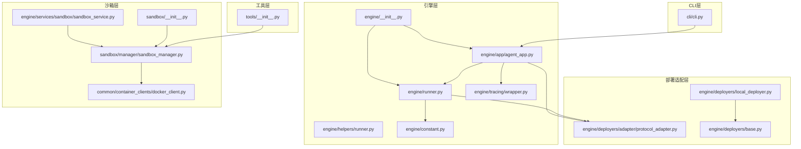
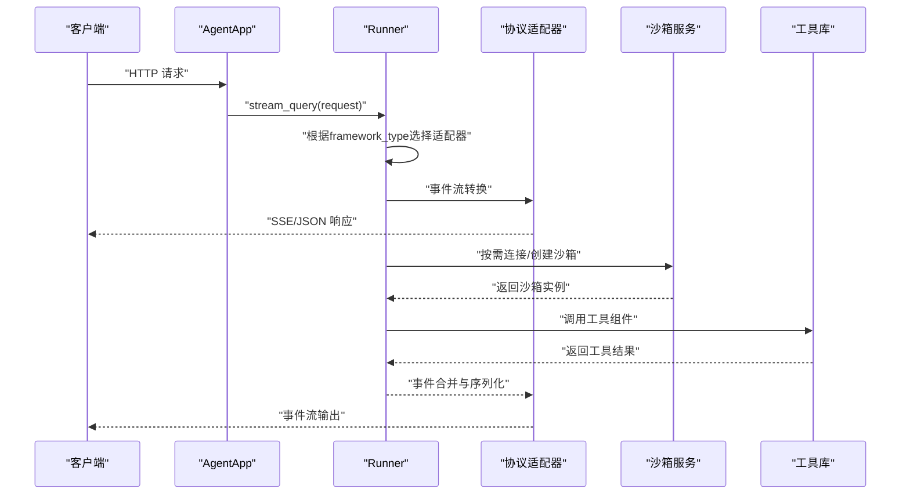
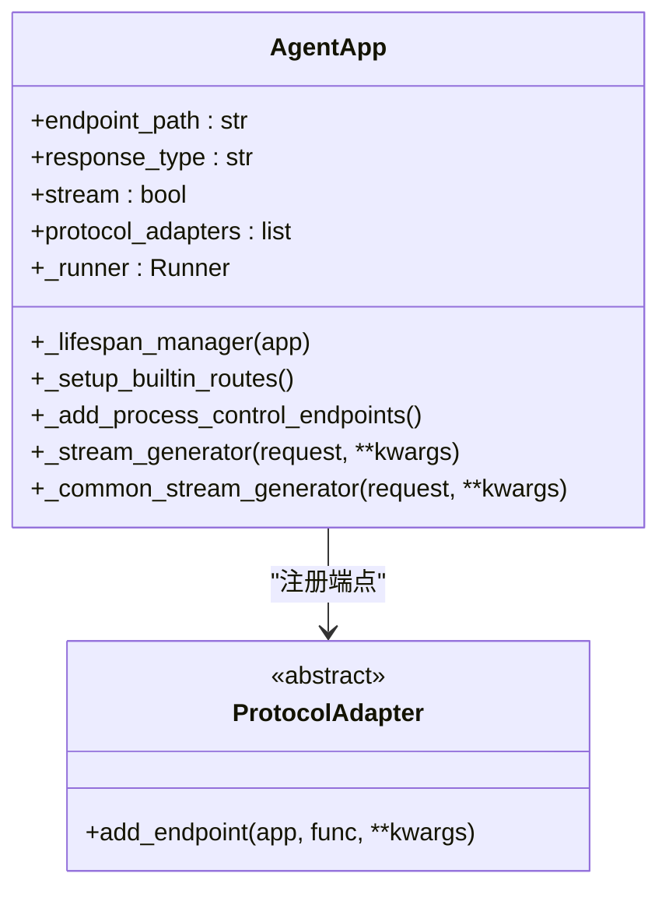
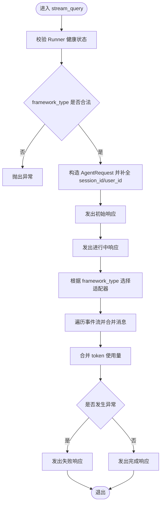
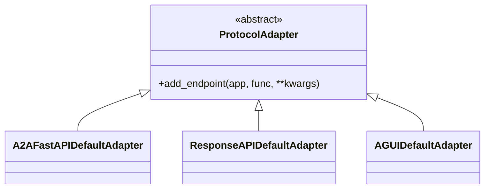
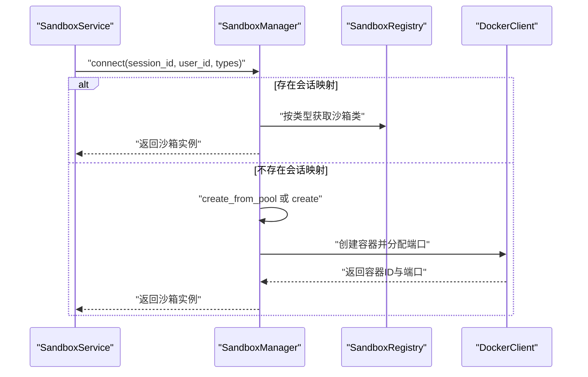
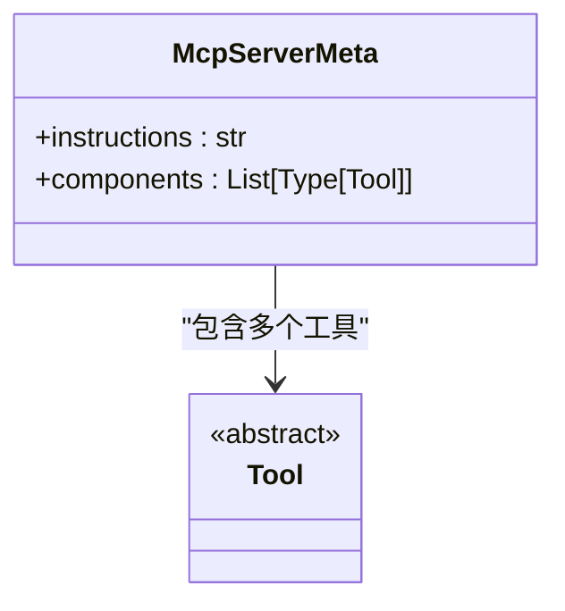
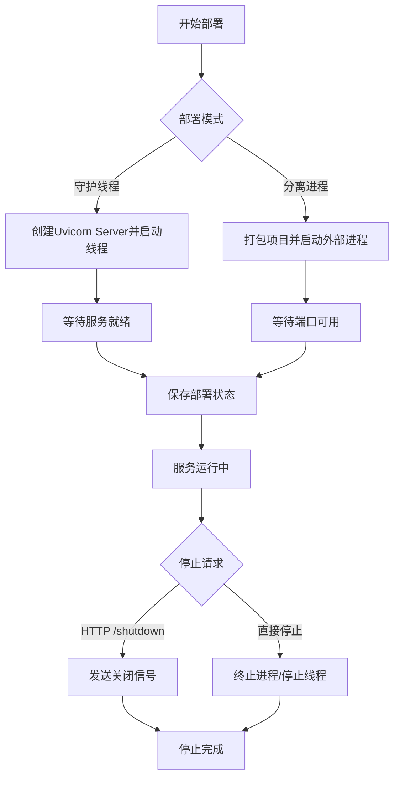
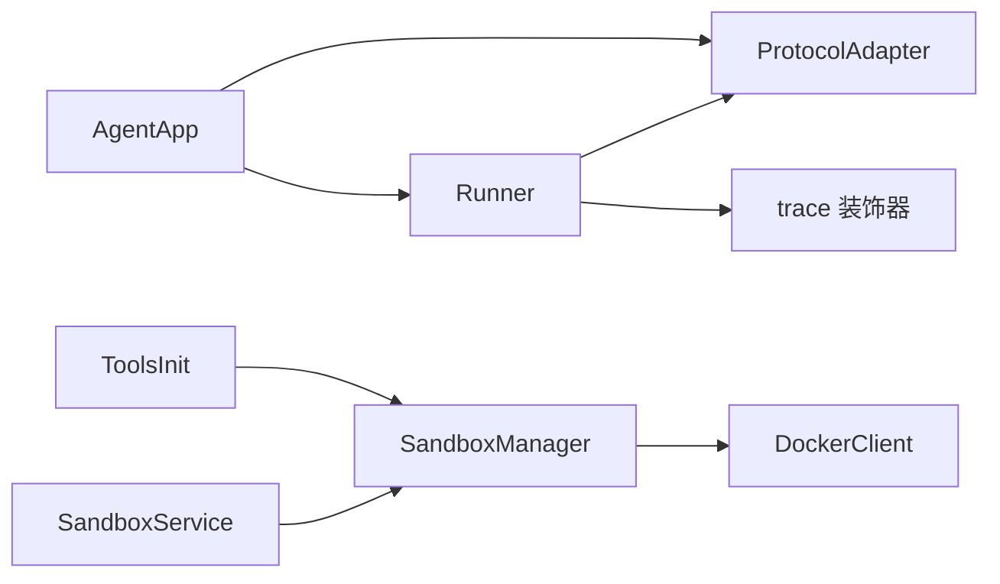

# 技术架构

<cite>
**本文引用的文件**
- [engine/app/agent_app.py](file://src/agentscope_runtime/engine/app/agent_app.py)
- [engine/runner.py](file://src/agentscope_runtime/engine/runner.py)
- [engine/deployers/base.py](file://src/agentscope_runtime/engine/deployers/base.py)
- [engine/deployers/local_deployer.py](file://src/agentscope_runtime/engine/deployers/local_deployer.py)
- [engine/deployers/adapter/protocol_adapter.py](file://src/agentscope_runtime/engine/deployers/adapter/protocol_adapter.py)
- [engine/services/sandbox/sandbox_service.py](file://src/agentscope_runtime/engine/services/sandbox/sandbox_service.py)
- [engine/tracing/wrapper.py](file://src/agentscope_runtime/engine/tracing/wrapper.py)
- [engine/helpers/runner.py](file://src/agentscope_runtime/engine/helpers/runner.py)
- [engine/constant.py](file://src/agentscope_runtime/engine/constant.py)
- [adapters/utils.py](file://src/agentscope_runtime/adapters/utils.py)
- [sandbox/__init__.py](file://src/agentscope_runtime/sandbox/__init__.py)
- [sandbox/manager/sandbox_manager.py](file://src/agentscope_runtime/sandbox/manager/sandbox_manager.py)
- [tools/__init__.py](file://src/agentscope_runtime/tools/__init__.py)
- [common/container_clients/docker_client.py](file://src/agentscope_runtime/common/container_clients/docker_client.py)
- [cli/cli.py](file://src/agentscope_runtime/cli/cli.py)
- [engine/__init__.py](file://src/agentscope_runtime/engine/__init__.py)
</cite>

## 目录
1. [引言](#引言)
2. [项目结构](#项目结构)
3. [核心组件](#核心组件)
4. [架构总览](#架构总览)
5. [详细组件分析](#详细组件分析)
6. [依赖分析](#依赖分析)
7. [性能考量](#性能考量)
8. [故障排查指南](#故障排查指南)
9. [结论](#结论)
10. [附录](#附录)

## 引言
本文件面向AgentScope Runtime项目的架构文档，系统化阐述整体设计、核心模块职责、组件交互与数据流，并结合代码实现给出可视化图示与演进建议。重点覆盖以下方面：
- 应用框架AgentApp与执行器Runner的设计理念与边界
- 协议适配器体系对多框架的支持策略
- 沙箱管理系统与容器编排能力
- 工具库系统与MCP服务器元数据组织
- 部署管理器与多平台部署模式
- 追踪与可观测性、错误处理与生命周期管理
- 可扩展性、可维护性与性能特征
- 架构演进历史与未来方向

## 项目结构
项目采用按“引擎-沙箱-工具-CLI”分层的模块化组织方式，核心入口位于engine子包，CLI通过命令组统一接入；沙箱与工具作为独立子系统被引擎与运行时集成。

**图表来源**
- [engine/__init__.py](file://src/agentscope_runtime/engine/__init__.py)
- [engine/app/agent_app.py](file://src/agentscope_runtime/engine/app/agent_app.py)
- [engine/runner.py](file://src/agentscope_runtime/engine/runner.py)
- [engine/deployers/adapter/protocol_adapter.py](file://src/agentscope_runtime/engine/deployers/adapter/protocol_adapter.py)
- [engine/deployers/local_deployer.py](file://src/agentscope_runtime/engine/deployers/local_deployer.py)
- [engine/deployers/base.py](file://src/agentscope_runtime/engine/deployers/base.py)
- [engine/services/sandbox/sandbox_service.py](file://src/agentscope_runtime/engine/services/sandbox/sandbox_service.py)
- [sandbox/manager/sandbox_manager.py](file://src/agentscope_runtime/sandbox/manager/sandbox_manager.py)
- [common/container_clients/docker_client.py](file://src/agentscope_runtime/common/container_clients/docker_client.py)
- [tools/__init__.py](file://src/agentscope_runtime/tools/__init__.py)
- [cli/cli.py](file://src/agentscope_runtime/cli/cli.py)

**章节来源**
- [engine/__init__.py](file://src/agentscope_runtime/engine/__init__.py)
- [cli/cli.py](file://src/agentscope_runtime/cli/cli.py)

## 核心组件
- AgentApp：以FastAPI为基础的Agent应用容器，负责路由注册、协议适配、生命周期管理、中断与任务清理等。
- Runner：统一的执行器，抽象query_handler并根据framework_type选择适配器，输出事件流并进行追踪包装。
- 协议适配器：定义统一接口，支持A2A、ResponseAPI、AGUI等协议端点注册。
- 沙箱服务与管理器：提供会话级沙箱连接、创建、释放与资源回收，支持嵌入式与远程模式。
- 工具库系统：以MCP服务器元数据组织各类生成、搜索、实时客户端等工具集合。
- 部署管理器：抽象部署接口，本地部署器支持守护线程与分离进程两种模式。
- CLI：统一命令入口，聚合chat、run、web、deploy、list、status、stop、invoke、sandbox等命令。

**章节来源**
- [engine/app/agent_app.py](file://src/agentscope_runtime/engine/app/agent_app.py)
- [engine/runner.py](file://src/agentscope_runtime/engine/runner.py)
- [engine/deployers/adapter/protocol_adapter.py](file://src/agentscope_runtime/engine/deployers/adapter/protocol_adapter.py)
- [engine/services/sandbox/sandbox_service.py](file://src/agentscope_runtime/engine/services/sandbox/sandbox_service.py)
- [sandbox/manager/sandbox_manager.py](file://src/agentscope_runtime/sandbox/manager/sandbox_manager.py)
- [tools/__init__.py](file://src/agentscope_runtime/tools/__init__.py)
- [engine/deployers/local_deployer.py](file://src/agentscope_runtime/engine/deployers/local_deployer.py)
- [cli/cli.py](file://src/agentscope_runtime/cli/cli.py)

## 架构总览
下图展示从请求进入AgentApp，经Runner适配不同框架消息，再通过协议适配器对外暴露端点，同时在需要时调用沙箱服务与工具库的总体流程。

**图表来源**
- [engine/app/agent_app.py](file://src/agentscope_runtime/engine/app/agent_app.py)
- [engine/runner.py](file://src/agentscope_runtime/engine/runner.py)
- [engine/deployers/adapter/protocol_adapter.py](file://src/agentscope_runtime/engine/deployers/adapter/protocol_adapter.py)
- [engine/services/sandbox/sandbox_service.py](file://src/agentscope_runtime/engine/services/sandbox/sandbox_service.py)
- [tools/__init__.py](file://src/agentscope_runtime/tools/__init__.py)

## 详细组件分析

### AgentApp 应用框架
- 设计要点
  - 继承FastAPI并混入UnifiedRoutingMixin与InterruptMixin，统一路由与分布式中断能力。
  - 支持多协议适配器自动注入OpenAPI Schema，增强跨协议兼容性。
  - 生命周期管理：通过lifespan组合内部Runner与用户自定义钩子，确保启动/关闭顺序可控。
  - 流式任务：支持后台任务提交与状态查询，结合Celery或内存队列。
  - 中断与健康检查：内置健康端点与进程控制端点，便于运维与调试。
- 关键流程
  - 初始化：构建Runner、初始化协议适配器、设置中间件与内置路由。
  - 启动：进入_internal_framework_lifespan，绑定query_handler，注册协议端点，可选启动嵌入式Celery worker与任务清理worker。
  - 请求处理：根据stream开关选择_sstream_generator或_common_stream_generator，输出SSE事件。
  - 关闭：执行after_finish钩子、清理Runner与中断服务。

**图表来源**
- [engine/app/agent_app.py](file://src/agentscope_runtime/engine/app/agent_app.py)
- [engine/deployers/adapter/protocol_adapter.py](file://src/agentscope_runtime/engine/deployers/adapter/protocol_adapter.py)

**章节来源**
- [engine/app/agent_app.py](file://src/agentscope_runtime/engine/app/agent_app.py)

### Runner 执行器
- 设计要点
  - 抽象query_handler，统一start/stop生命周期，支持同步/异步/生成器/异步生成器。
  - 根据framework_type动态选择消息适配器，将通用事件流转换为协议期望格式。
  - 使用trace装饰器包装，提供输入输出属性、首响应延迟、结束原因等可观测性指标。
  - 错误处理：捕获非AppBaseException并转换为UnknownAgentException，保证输出一致性。
- 关键流程
  - stream_query：校验健康状态与框架类型，分配session_id/user_id，生成初始与进行中响应，逐段产出事件，最终完成或失败。
  - 类型转换：in_type_converters/out_type_converters用于消息与事件的双向转换。
  - 适配器选择：agentscope/langgraph/agno/ms_agent_framework/text等框架的消息形态转换。

**图表来源**
- [engine/runner.py](file://src/agentscope_runtime/engine/runner.py)
- [engine/constant.py](file://src/agentscope_runtime/engine/constant.py)
- [engine/tracing/wrapper.py](file://src/agentscope_runtime/engine/tracing/wrapper.py)

**章节来源**
- [engine/runner.py](file://src/agentscope_runtime/engine/runner.py)
- [engine/helpers/runner.py](file://src/agentscope_runtime/engine/helpers/runner.py)
- [engine/constant.py](file://src/agentscope_runtime/engine/constant.py)
- [engine/tracing/wrapper.py](file://src/agentscope_runtime/engine/tracing/wrapper.py)

### 协议适配器
- 设计要点
  - ProtocolAdapter定义统一接口，由具体适配器实现add_endpoint，向AgentApp注册协议特定端点。
  - AgentApp在启动时初始化A2A、ResponseAPI、AGUI等默认适配器，并注入OpenAPI Schema。
- 适配器扩展
  - 新增协议时仅需实现add_endpoint并在AgentApp初始化阶段注入即可。

**图表来源**
- [engine/deployers/adapter/protocol_adapter.py](file://src/agentscope_runtime/engine/deployers/adapter/protocol_adapter.py)
- [engine/app/agent_app.py](file://src/agentscope_runtime/engine/app/agent_app.py)

**章节来源**
- [engine/deployers/adapter/protocol_adapter.py](file://src/agentscope_runtime/engine/deployers/adapter/protocol_adapter.py)
- [engine/app/agent_app.py](file://src/agentscope_runtime/engine/app/agent_app.py)

### 沙箱管理系统
- 设计要点
  - SandboxService封装会话到沙箱的映射，支持连接现有环境或创建新环境，支持AgentBay特殊会话识别。
  - SandboxManager提供池化容器管理、心跳扫描、资源回收、远程/本地模式切换。
  - 容器客户端DockerClient负责镜像拉取、容器创建/启动/停止/删除与端口分配。
- 关键流程
  - 连接：根据session_ctx_id查找已有环境，否则按类型创建并绑定元信息。
  - 创建：从池队列尝试复用，不满足则新建；支持版本与状态校验。
  - 释放：按会话映射逐个释放，AgentBay会话由对象销毁自动清理。
  - 清理：watcher线程周期扫描心跳、池与已释放资源，触发回收。

**图表来源**
- [engine/services/sandbox/sandbox_service.py](file://src/agentscope_runtime/engine/services/sandbox/sandbox_service.py)
- [sandbox/manager/sandbox_manager.py](file://src/agentscope_runtime/sandbox/manager/sandbox_manager.py)
- [common/container_clients/docker_client.py](file://src/agentscope_runtime/common/container_clients/docker_client.py)
- [sandbox/__init__.py](file://src/agentscope_runtime/sandbox/__init__.py)

**章节来源**
- [engine/services/sandbox/sandbox_service.py](file://src/agentscope_runtime/engine/services/sandbox/sandbox_service.py)
- [sandbox/manager/sandbox_manager.py](file://src/agentscope_runtime/sandbox/manager/sandbox_manager.py)
- [common/container_clients/docker_client.py](file://src/agentscope_runtime/common/container_clients/docker_client.py)
- [sandbox/__init__.py](file://src/agentscope_runtime/sandbox/__init__.py)

### 工具库系统与MCP服务器元数据
- 设计要点
  - 以McpServerMeta组织工具集合，按服务场景划分如图像生成、视频生成、Web搜索、语音识别与合成等。
  - 通过mcp_server_metas集中声明，便于工具发现与服务编排。
- 适配与扩展
  - 新增工具时在对应服务组内注册Tool类，并更新McpServerMeta的components列表。

**图表来源**
- [tools/__init__.py](file://src/agentscope_runtime/tools/__init__.py)

**章节来源**
- [tools/__init__.py](file://src/agentscope_runtime/tools/__init__.py)

### 部署管理器与多平台部署
- 设计要点
  - DeployManager抽象部署接口，LocalDeployManager实现本地守护线程与分离进程两种模式。
  - 支持Broker/Backend配置用于Celery任务队列，以及自定义端点与协议适配器注入。
- 关键流程
  - 守护线程：创建Uvicorn Server在后台线程运行，等待就绪后保存部署状态。
  - 分离进程：打包项目、启动外部进程、等待端口可用、记录PID与日志。
  - 停止：优先HTTP /shutdown，失败则直接终止进程或停止守护线程。

**图表来源**
- [engine/deployers/local_deployer.py](file://src/agentscope_runtime/engine/deployers/local_deployer.py)
- [engine/deployers/base.py](file://src/agentscope_runtime/engine/deployers/base.py)

**章节来源**
- [engine/deployers/local_deployer.py](file://src/agentscope_runtime/engine/deployers/local_deployer.py)
- [engine/deployers/base.py](file://src/agentscope_runtime/engine/deployers/base.py)

### CLI 与命令体系
- 设计要点
  - 通过Click定义统一入口，注册chat、run、web、deploy、list、status、stop、invoke、sandbox等命令组。
  - 默认设置TRACE_ENABLE_LOG环境变量，便于追踪日志输出。
- 使用建议
  - 通过命令行快速启动开发/测试/部署流程，结合AgentApp的lifespan钩子实现自定义初始化与清理逻辑。

**章节来源**
- [cli/cli.py](file://src/agentscope_runtime/cli/cli.py)

## 依赖分析
- 组件耦合
  - AgentApp与Runner强耦合：AgentApp持有Runner实例并绑定其处理器；Runner依赖协议适配器与常量。
  - Runner与适配器弱耦合：通过framework_type动态导入，降低静态依赖。
  - 沙箱服务与管理器：SandboxService依赖SandboxManager，后者依赖容器客户端与存储实现。
  - 工具库与沙箱：工具库通过MCP元数据组织，运行时可按需加载并注入到沙箱环境中。
- 外部依赖
  - FastAPI/Uvicorn：提供Web服务与ASGI运行时。
  - OpenTelemetry：提供追踪与导出能力。
  - Docker SDK：容器生命周期管理。
  - Redis/HTTP：分布式状态与远程调用。

**图表来源**
- [engine/app/agent_app.py](file://src/agentscope_runtime/engine/app/agent_app.py)
- [engine/runner.py](file://src/agentscope_runtime/engine/runner.py)
- [engine/tracing/wrapper.py](file://src/agentscope_runtime/engine/tracing/wrapper.py)
- [engine/deployers/adapter/protocol_adapter.py](file://src/agentscope_runtime/engine/deployers/adapter/protocol_adapter.py)
- [engine/services/sandbox/sandbox_service.py](file://src/agentscope_runtime/engine/services/sandbox/sandbox_service.py)
- [sandbox/manager/sandbox_manager.py](file://src/agentscope_runtime/sandbox/manager/sandbox_manager.py)
- [common/container_clients/docker_client.py](file://src/agentscope_runtime/common/container_clients/docker_client.py)
- [tools/__init__.py](file://src/agentscope_runtime/tools/__init__.py)

**章节来源**
- [engine/app/agent_app.py](file://src/agentscope_runtime/engine/app/agent_app.py)
- [engine/runner.py](file://src/agentscope_runtime/engine/runner.py)
- [engine/tracing/wrapper.py](file://src/agentscope_runtime/engine/tracing/wrapper.py)
- [engine/deployers/adapter/protocol_adapter.py](file://src/agentscope_runtime/engine/deployers/adapter/protocol_adapter.py)
- [engine/services/sandbox/sandbox_service.py](file://src/agentscope_runtime/engine/services/sandbox/sandbox_service.py)
- [sandbox/manager/sandbox_manager.py](file://src/agentscope_runtime/sandbox/manager/sandbox_manager.py)
- [common/container_clients/docker_client.py](file://src/agentscope_runtime/common/container_clients/docker_client.py)
- [tools/__init__.py](file://src/agentscope_runtime/tools/__init__.py)

## 性能考量
- 流式处理
  - Runner通过事件流与SSE输出，避免一次性缓冲大量中间结果，降低内存峰值。
  - AgentApp支持任务清理worker定期清理过期任务，防止内存泄漏。
- 并发与异步
  - Runner与适配器均支持异步生成器，配合trace装饰器对首响应延迟与合并输出进行观测。
- 资源池化
  - 沙箱管理器支持容器池化与心跳扫描，减少冷启动开销；DockerClient端口分配与缓存提升容器创建效率。
- 部署模式
  - 守护线程模式适合开发调试，分离进程模式适合生产环境隔离与稳定性保障。

[本节为通用指导，无需列出具体文件来源]

## 故障排查指南
- 启动失败
  - 检查AgentApp的lifespan钩子与before_start/after_finish回调是否抛出异常。
  - 查看Runner的start/stop生命周期日志与异常栈。
- 流式输出异常
  - 确认framework_type合法且适配器已正确导入；查看trace装饰器输出的首响应延迟与结束原因。
- 沙箱连接问题
  - 检查SandboxManager的容器状态与版本匹配；确认DockerClient可用与端口范围配置。
- 部署失败
  - 守护线程模式下避免在测试框架中直接调用HTTP /shutdown；分离进程模式下检查PID文件与日志输出。

**章节来源**
- [engine/app/agent_app.py](file://src/agentscope_runtime/engine/app/agent_app.py)
- [engine/runner.py](file://src/agentscope_runtime/engine/runner.py)
- [sandbox/manager/sandbox_manager.py](file://src/agentscope_runtime/sandbox/manager/sandbox_manager.py)
- [common/container_clients/docker_client.py](file://src/agentscope_runtime/common/container_clients/docker_client.py)
- [engine/deployers/local_deployer.py](file://src/agentscope_runtime/engine/deployers/local_deployer.py)

## 结论
AgentScope Runtime以AgentApp为核心容器，Runner提供统一执行与适配能力，配合协议适配器、沙箱系统与工具库，形成可扩展、可观测、可部署的Agent运行时。通过守护线程与分离进程两种部署模式，兼顾开发效率与生产稳定性。未来可在以下方向演进：
- 更多框架适配：扩展更多框架的消息与事件适配器。
- 自动扩缩容：结合Kubernetes/Kruise等平台实现弹性伸缩。
- 多租户与安全：引入鉴权、资源配额与网络隔离。
- 运维自动化：完善状态监控、告警与自愈机制。

[本节为总结性内容，无需列出具体文件来源]

## 附录
- 架构演进与历史
  - 早期版本以简单Runner与文本适配为主；后续引入多框架适配器、沙箱系统与MCP工具元数据，逐步完善生态。
- 未来方向
  - 增强可观测性与追踪导出；优化容器池化与资源调度；扩展更多部署平台与适配器。

[本节为概念性内容，无需列出具体文件来源]