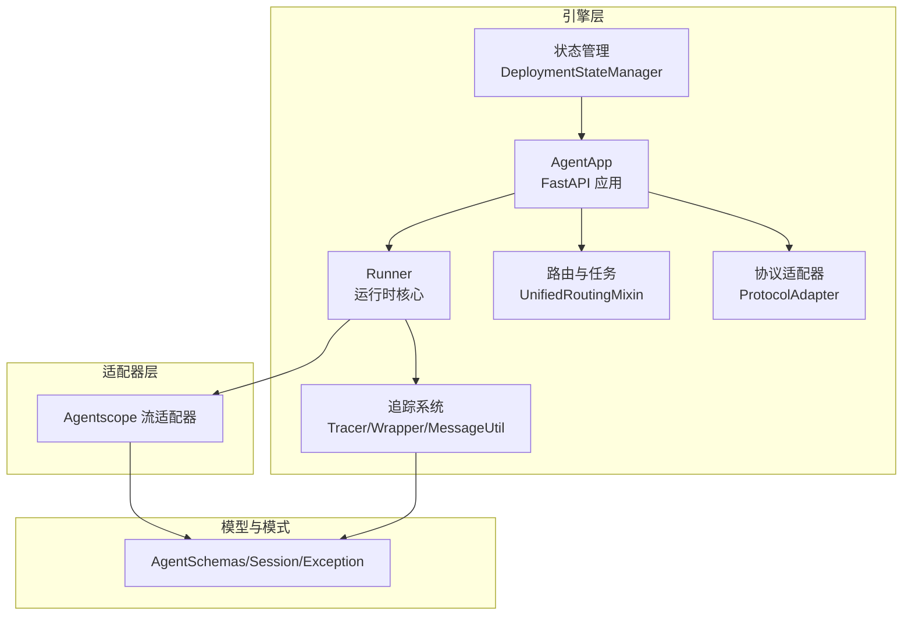
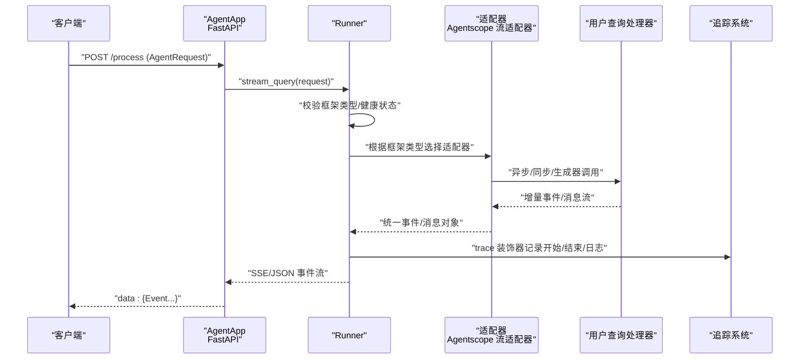
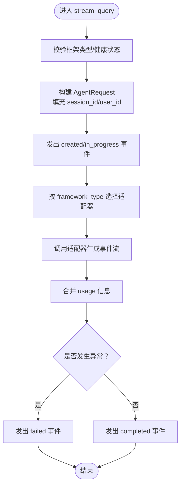
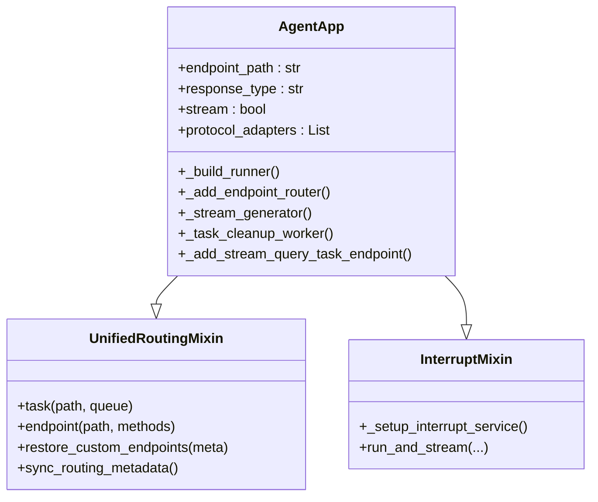
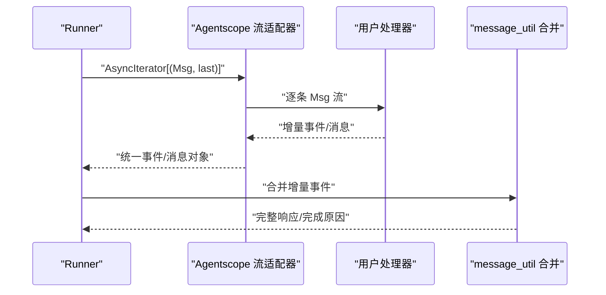
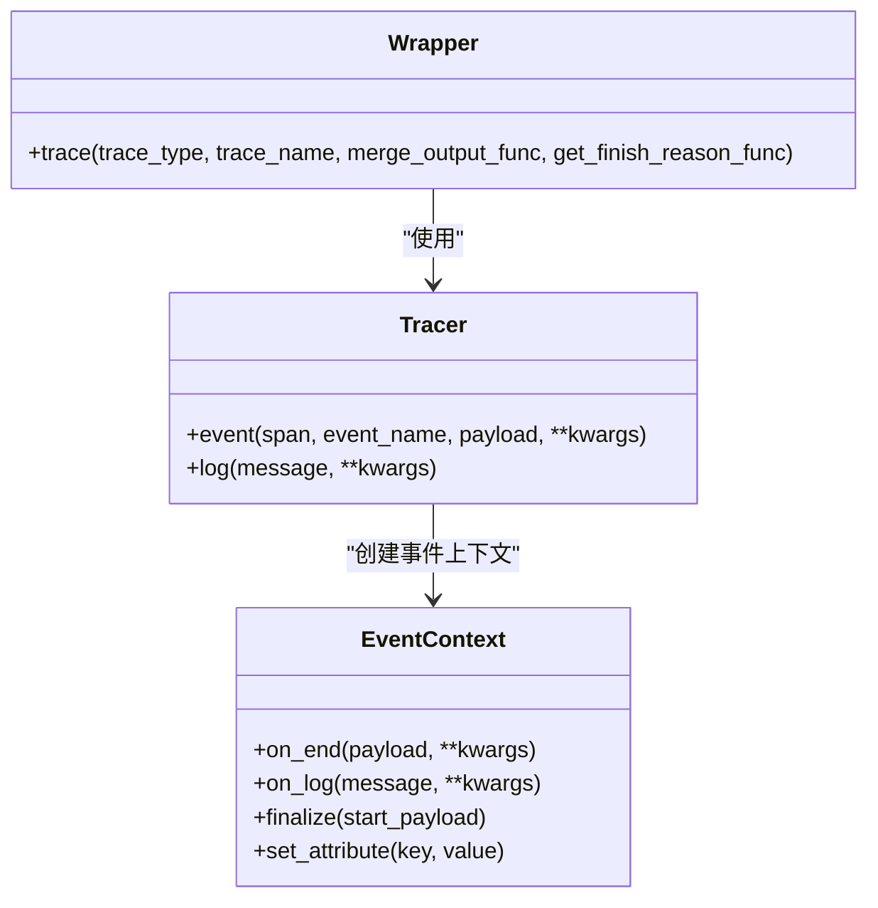
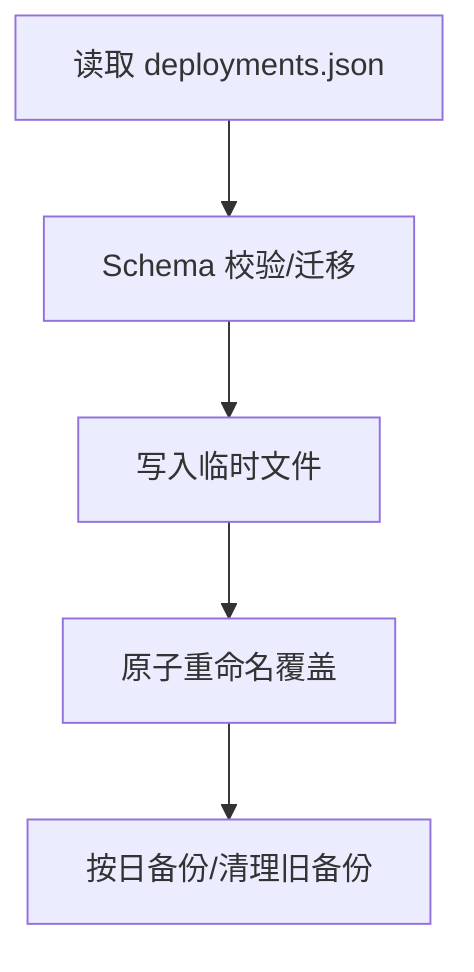
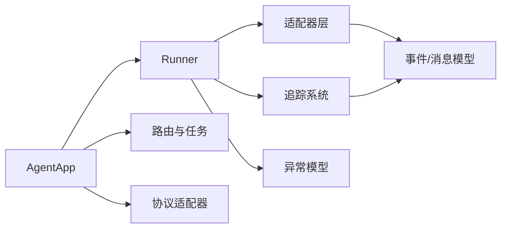

# 数据流架构

<cite>
**本文引用的文件**
- [engine/runner.py](file://src/agentscope_runtime/engine/runner.py)
- [engine/app/agent_app.py](file://src/agentscope_runtime/engine/app/agent_app.py)
- [engine/tracing/base.py](file://src/agentscope_runtime/engine/tracing/base.py)
- [engine/tracing/wrapper.py](file://src/agentscope_runtime/engine/tracing/wrapper.py)
- [engine/tracing/message_util.py](file://src/agentscope_runtime/engine/tracing/message_util.py)
- [engine/tracing/tracing_metric.py](file://src/agentscope_runtime/engine/tracing/tracing_metric.py)
- [engine/schemas/agent_schemas.py](file://src/agentscope_runtime/engine/schemas/agent_schemas.py)
- [engine/schemas/session.py](file://src/agentscope_runtime/engine/schemas/session.py)
- [engine/deployers/state/manager.py](file://src/agentscope_runtime/engine/deployers/state/manager.py)
- [engine/deployers/utils/service_utils/routing/unified_routing_mixin.py](file://src/agentscope_runtime/engine/deployers/utils/service_utils/routing/unified_routing_mixin.py)
- [engine/deployers/adapter/protocol_adapter.py](file://src/agentscope_runtime/engine/deployers/adapter/protocol_adapter.py)
- [adapters/agentscope/stream.py](file://src/agentscope_runtime/adapters/agentscope/stream.py)
- [engine/constant.py](file://src/agentscope_runtime/engine/constant.py)
- [engine/schemas/exception.py](file://src/agentscope_runtime/engine/schemas/exception.py)
</cite>

## 目录
1. [引言](#引言)
2. [项目结构](#项目结构)
3. [核心组件](#核心组件)
4. [架构总览](#架构总览)
5. [详细组件分析](#详细组件分析)
6. [依赖分析](#依赖分析)
7. [性能考虑](#性能考虑)
8. [故障排查指南](#故障排查指南)
9. [结论](#结论)
10. [附录](#附录)

## 引言
本技术文档围绕 AgentScope Runtime 的数据流架构展开，系统性阐述数据在系统中的流转路径、转换过程与存储机制；详解 Agent 请求处理流程、消息格式转换与响应生成机制；说明会话管理、状态跟踪与持久化策略；介绍追踪系统的设计原理、指标采集与性能监控；明确数据验证规则、错误传播与异常处理机制，并提供数据流优化与调试的实用技巧。

## 项目结构
AgentScope Runtime 采用分层与模块化设计：
- 引擎层（engine）：运行时核心（Runner）、应用入口（AgentApp）、协议适配器、追踪系统、状态管理与路由工具等。
- 适配器层（adapters）：针对不同框架的消息与流式输出适配。
- 模型与模式（schemas）：统一的事件、消息、会话与异常模型。
- 部署与状态（deployers）：部署状态持久化与任务路由能力。

图示来源
- [engine/app/agent_app.py:60-120](file://src/agentscope_runtime/engine/app/agent_app.py#L60-L120)
- [engine/runner.py:46-120](file://src/agentscope_runtime/engine/runner.py#L46-L120)
- [engine/tracing/wrapper.py:94-120](file://src/agentscope_runtime/engine/tracing/wrapper.py#L94-L120)
- [adapters/agentscope/stream.py:33-60](file://src/agentscope_runtime/adapters/agentscope/stream.py#L33-L60)
- [engine/deployers/state/manager.py:17-40](file://src/agentscope_runtime/engine/deployers/state/manager.py#L17-L40)
- [engine/deployers/adapter/protocol_adapter.py:6-25](file://src/agentscope_runtime/engine/deployers/adapter/protocol_adapter.py#L6-L25)

章节来源
- [engine/app/agent_app.py:60-120](file://src/agentscope_runtime/engine/app/agent_app.py#L60-L120)
- [engine/runner.py:46-120](file://src/agentscope_runtime/engine/runner.py#L46-L120)
- [engine/tracing/wrapper.py:94-120](file://src/agentscope_runtime/engine/tracing/wrapper.py#L94-L120)
- [adapters/agentscope/stream.py:33-60](file://src/agentscope_runtime/adapters/agentscope/stream.py#L33-L60)
- [engine/deployers/state/manager.py:17-40](file://src/agentscope_runtime/engine/deployers/state/manager.py#L17-L40)
- [engine/deployers/adapter/protocol_adapter.py:6-25](file://src/agentscope_runtime/engine/deployers/adapter/protocol_adapter.py#L6-L25)

## 核心组件
- Runner：统一的异步流式推理调度器，负责请求校验、框架类型选择、消息适配、事件序列化与错误包装。
- AgentApp：基于 FastAPI 的服务入口，集成生命周期管理、端点注册、中断与任务路由、健康检查与进程控制。
- 追踪系统：基于 OpenTelemetry 的装饰器与处理器，支持事件日志、首包延迟、合并输出、完成原因判定与属性注入。
- 适配器：将不同框架的中间流转换为统一的事件/消息模型，支持增量内容合并与完成态标记。
- 状态管理：本地 JSON 文件持久化部署元数据，提供备份、迁移、校验与原子写入保障。
- 协议适配器：抽象协议端点注册接口，便于扩展 A2A/ResponseAPI/AGUI 等协议。

章节来源
- [engine/runner.py:46-120](file://src/agentscope_runtime/engine/runner.py#L46-L120)
- [engine/app/agent_app.py:60-120](file://src/agentscope_runtime/engine/app/agent_app.py#L60-L120)
- [engine/tracing/base.py:12-83](file://src/agentscope_runtime/engine/tracing/base.py#L12-L83)
- [engine/tracing/wrapper.py:94-120](file://src/agentscope_runtime/engine/tracing/wrapper.py#L94-L120)
- [adapters/agentscope/stream.py:33-60](file://src/agentscope_runtime/adapters/agentscope/stream.py#L33-L60)
- [engine/deployers/state/manager.py:17-40](file://src/agentscope_runtime/engine/deployers/state/manager.py#L17-L40)
- [engine/deployers/adapter/protocol_adapter.py:6-25](file://src/agentscope_runtime/engine/deployers/adapter/protocol_adapter.py#L6-L25)

## 架构总览
下图展示从客户端请求到最终事件流输出的全链路：

图示来源
- [engine/app/agent_app.py:780-805](file://src/agentscope_runtime/engine/app/agent_app.py#L780-L805)
- [engine/runner.py:193-220](file://src/agentscope_runtime/engine/runner.py#L193-L220)
- [adapters/agentscope/stream.py:33-60](file://src/agentscope_runtime/adapters/agentscope/stream.py#L33-L60)
- [engine/tracing/wrapper.py:130-235](file://src/agentscope_runtime/engine/tracing/wrapper.py#L130-L235)

章节来源
- [engine/app/agent_app.py:780-805](file://src/agentscope_runtime/engine/app/agent_app.py#L780-L805)
- [engine/runner.py:193-220](file://src/agentscope_runtime/engine/runner.py#L193-L220)
- [adapters/agentscope/stream.py:33-60](file://src/agentscope_runtime/adapters/agentscope/stream.py#L33-L60)
- [engine/tracing/wrapper.py:130-235](file://src/agentscope_runtime/engine/tracing/wrapper.py#L130-L235)

## 详细组件分析

### Runner：请求处理与事件流
- 输入校验与初始化
  - 校验框架类型是否在允许列表中。
  - 校验 Runner 健康状态，确保已启动。
  - 将字典请求转为统一模型，自动填充 session_id 与 user_id。
- 事件序列与状态机
  - 初始返回“created”事件，随后进入“in_progress”，再由适配器产出增量事件。
  - 支持将最终事件合并为完整消息，设置 usage 并标记 completed 或 failed。
- 适配器与类型转换
  - 根据 framework_type 动态选择适配器（如 Agentscope/LangGraph/Agno 等）。
  - 支持自定义输入/输出类型转换器，实现跨框架消息桥接。
- 错误处理
  - 捕获未分类异常并包装为统一业务异常，记录错误码与消息，保证下游可感知。

图示来源
- [engine/runner.py:193-220](file://src/agentscope_runtime/engine/runner.py#L193-L220)
- [engine/runner.py:221-240](file://src/agentscope_runtime/engine/runner.py#L221-L240)
- [engine/runner.py:322-356](file://src/agentscope_runtime/engine/runner.py#L322-L356)
- [engine/constant.py:2-9](file://src/agentscope_runtime/engine/constant.py#L2-L9)

章节来源
- [engine/runner.py:193-220](file://src/agentscope_runtime/engine/runner.py#L193-L220)
- [engine/runner.py:221-240](file://src/agentscope_runtime/engine/runner.py#L221-L240)
- [engine/runner.py:322-356](file://src/agentscope_runtime/engine/runner.py#L322-L356)
- [engine/constant.py:2-9](file://src/agentscope_runtime/engine/constant.py#L2-L9)

### AgentApp：应用入口与路由
- 生命周期与钩子
  - 统一 lifespan 管理，支持 before_start/after_finish 钩子，绑定 Runner。
- 端点与协议适配
  - 注册 /process 主推理端点，支持 SSE/JSON 输出。
  - 默认注册 A2A/ResponseAPI/AGUI 协议适配器，扩展性强。
- 中断与任务
  - 内置分布式中断后端（Redis/本地），支持会话级中断与恢复。
  - 提供后台任务队列（Celery/内存），支持任务提交与状态轮询。
- 健康检查与进程控制
  - /health 健康检查；/shutdown 优雅关闭；/admin/status 进程状态。

图示来源
- [engine/app/agent_app.py:124-220](file://src/agentscope_runtime/engine/app/agent_app.py#L124-L220)
- [engine/app/agent_app.py:248-316](file://src/agentscope_runtime/engine/app/agent_app.py#L248-L316)
- [engine/app/agent_app.py:497-596](file://src/agentscope_runtime/engine/app/agent_app.py#L497-L596)
- [engine/deployers/utils/service_utils/routing/unified_routing_mixin.py:16-101](file://src/agentscope_runtime/engine/deployers/utils/service_utils/routing/unified_routing_mixin.py#L16-L101)

章节来源
- [engine/app/agent_app.py:124-220](file://src/agentscope_runtime/engine/app/agent_app.py#L124-L220)
- [engine/app/agent_app.py:248-316](file://src/agentscope_runtime/engine/app/agent_app.py#L248-L316)
- [engine/app/agent_app.py:497-596](file://src/agentscope_runtime/engine/app/agent_app.py#L497-L596)
- [engine/deployers/utils/service_utils/routing/unified_routing_mixin.py:16-101](file://src/agentscope_runtime/engine/deployers/utils/service_utils/routing/unified_routing_mixin.py#L16-L101)

### 适配器：消息格式转换与流式输出
- Agentscope 流适配器
  - 将框架内部 Msg 流转换为统一的 Message/Content 事件，支持文本、图像、音频、视频、文件与工具调用/结果等多模态块。
  - 支持增量内容合并（delta），并在消息末尾发出 completed 事件。
  - 支持自定义类型转换器，将特定块类型映射为标准内容类型。
- 合并与完成判定
  - 通过 message_util 的合并函数将增量事件合并为完整响应，识别完成原因（如 stop）。

图示来源
- [adapters/agentscope/stream.py:33-60](file://src/agentscope_runtime/adapters/agentscope/stream.py#L33-L60)
- [adapters/agentscope/stream.py:119-235](file://src/agentscope_runtime/adapters/agentscope/stream.py#L119-L235)
- [engine/tracing/message_util.py:136-354](file://src/agentscope_runtime/engine/tracing/message_util.py#L136-L354)

章节来源
- [adapters/agentscope/stream.py:33-60](file://src/agentscope_runtime/adapters/agentscope/stream.py#L33-L60)
- [adapters/agentscope/stream.py:119-235](file://src/agentscope_runtime/adapters/agentscope/stream.py#L119-L235)
- [engine/tracing/message_util.py:136-354](file://src/agentscope_runtime/engine/tracing/message_util.py#L136-L354)

### 追踪系统：设计原理与指标采集
- 装饰器 trace
  - 自动提取起始负载、设置根/子 Span、注入通用属性（如 input.value、output.value）。
  - 记录首包延迟、首个/最后响应与合并后的最终响应，便于性能分析。
- TracerHandler 与事件上下文
  - 提供 on_start/on_end/on_log/on_error 回调，支持本地日志与外部导出。
- TraceType
  - 定义 LLM、TOOL、AGENT_STEP 等追踪类型，便于分类统计与聚合。

图示来源
- [engine/tracing/base.py:166-250](file://src/agentscope_runtime/engine/tracing/base.py#L166-L250)
- [engine/tracing/base.py:252-343](file://src/agentscope_runtime/engine/tracing/base.py#L252-L343)
- [engine/tracing/wrapper.py:94-120](file://src/agentscope_runtime/engine/tracing/wrapper.py#L94-L120)
- [engine/tracing/tracing_metric.py:2-33](file://src/agentscope_runtime/engine/tracing/tracing_metric.py#L2-L33)

章节来源
- [engine/tracing/base.py:166-250](file://src/agentscope_runtime/engine/tracing/base.py#L166-L250)
- [engine/tracing/base.py:252-343](file://src/agentscope_runtime/engine/tracing/base.py#L252-L343)
- [engine/tracing/wrapper.py:94-120](file://src/agentscope_runtime/engine/tracing/wrapper.py#L94-L120)
- [engine/tracing/tracing_metric.py:2-33](file://src/agentscope_runtime/engine/tracing/tracing_metric.py#L2-L33)

### 会话管理、状态跟踪与持久化
- 会话模型
  - Session 包含 id、user_id 与消息列表，用于承载对话历史。
- 部署状态管理
  - DeploymentStateManager 使用本地 JSON 文件持久化部署元数据，提供备份、迁移、校验与原子写入，防止数据丢失。
  - 支持按状态/平台过滤、更新状态、删除记录、导入导出等操作。

图示来源
- [engine/deployers/state/manager.py:89-145](file://src/agentscope_runtime/engine/deployers/state/manager.py#L89-L145)
- [engine/deployers/state/manager.py:146-231](file://src/agentscope_runtime/engine/deployers/state/manager.py#L146-L231)
- [engine/deployers/state/manager.py:39-88](file://src/agentscope_runtime/engine/deployers/state/manager.py#L39-L88)

章节来源
- [engine/schemas/session.py:9-25](file://src/agentscope_runtime/engine/schemas/session.py#L9-L25)
- [engine/deployers/state/manager.py:89-145](file://src/agentscope_runtime/engine/deployers/state/manager.py#L89-L145)
- [engine/deployers/state/manager.py:146-231](file://src/agentscope_runtime/engine/deployers/state/manager.py#L146-L231)
- [engine/deployers/state/manager.py:39-88](file://src/agentscope_runtime/engine/deployers/state/manager.py#L39-L88)

### 协议适配器与路由
- 协议适配器
  - ProtocolAdapter 抽象端点注册接口，便于扩展 A2A/ResponseAPI/AGUI 等协议。
- 统一路由与任务
  - UnifiedRoutingMixin 提供 task/endpoint 装饰器，支持 Celery/内存队列的任务提交与状态轮询，以及自定义端点的注册与恢复。

章节来源
- [engine/deployers/adapter/protocol_adapter.py:6-25](file://src/agentscope_runtime/engine/deployers/adapter/protocol_adapter.py#L6-L25)
- [engine/deployers/utils/service_utils/routing/unified_routing_mixin.py:16-101](file://src/agentscope_runtime/engine/deployers/utils/service_utils/routing/unified_routing_mixin.py#L16-L101)
- [engine/deployers/utils/service_utils/routing/unified_routing_mixin.py:186-238](file://src/agentscope_runtime/engine/deployers/utils/service_utils/routing/unified_routing_mixin.py#L186-L238)

## 依赖分析
- Runner 依赖
  - 适配器层：根据 framework_type 动态导入具体适配器。
  - 追踪系统：trace 装饰器包裹 stream_query，增强可观测性。
  - 异常模型：捕获非业务异常并包装为统一异常。
- AgentApp 依赖
  - Runner：作为核心执行器。
  - 路由与任务：UnifiedRoutingMixin 提供任务与端点管理。
  - 协议适配器：注册默认协议端点。
- 适配器依赖
  - 事件/消息模型：统一的 Message/Content 结构。
  - 追踪工具：message_util 的合并与完成原因判定。

图示来源
- [engine/runner.py:20-40](file://src/agentscope_runtime/engine/runner.py#L20-L40)
- [engine/app/agent_app.py:31-52](file://src/agentscope_runtime/engine/app/agent_app.py#L31-L52)
- [adapters/agentscope/stream.py:14-29](file://src/agentscope_runtime/adapters/agentscope/stream.py#L14-L29)
- [engine/tracing/message_util.py:7-15](file://src/agentscope_runtime/engine/tracing/message_util.py#L7-L15)

章节来源
- [engine/runner.py:20-40](file://src/agentscope_runtime/engine/runner.py#L20-L40)
- [engine/app/agent_app.py:31-52](file://src/agentscope_runtime/engine/app/agent_app.py#L31-L52)
- [adapters/agentscope/stream.py:14-29](file://src/agentscope_runtime/adapters/agentscope/stream.py#L14-L29)
- [engine/tracing/message_util.py:7-15](file://src/agentscope_runtime/engine/tracing/message_util.py#L7-L15)

## 性能考虑
- 首包延迟与吞吐
  - 追踪系统记录 gen_ai.response.first_delay，便于定位慢启动问题。
  - trace 装饰器在首次响应与最终合并响应处打点，辅助性能分析。
- 流式处理
  - 采用增量事件与 delta 合并，减少大对象传输与内存占用。
- 任务与中断
  - 通过中断后端与任务队列解耦长耗时任务，提升并发与可用性。
- 存储与持久化
  - 状态文件原子写入与按日备份，避免数据损坏与丢失风险。

## 故障排查指南
- 常见错误与处理
  - 未知异常：捕获后包装为统一异常，记录错误码与堆栈，便于追踪。
  - 参数与配置：使用异常模型中的参数类（如 InvalidParameterException/MissingParameterException）进行显式校验与反馈。
  - 业务异常：如工具执行失败、模型超时、配额不足等，使用对应的业务异常类型，保持语义清晰。
- 调试建议
  - 开启 trace 日志，关注首包延迟与完成原因。
  - 在适配器中打印增量事件，确认消息合并逻辑正确。
  - 使用 /health 与 /admin/status 快速判断服务与进程状态。
  - 对于任务队列，检查任务提交与状态轮询接口返回值。

章节来源
- [engine/runner.py:338-356](file://src/agentscope_runtime/engine/runner.py#L338-L356)
- [engine/schemas/exception.py:302-342](file://src/agentscope_runtime/engine/schemas/exception.py#L302-L342)
- [engine/schemas/exception.py:458-605](file://src/agentscope_runtime/engine/schemas/exception.py#L458-L605)
- [engine/app/agent_app.py:385-422](file://src/agentscope_runtime/engine/app/agent_app.py#L385-L422)
- [engine/app/agent_app.py:628-641](file://src/agentscope_runtime/engine/app/agent_app.py#L628-L641)

## 结论
AgentScope Runtime 的数据流架构以 Runner 为核心，结合适配器层实现多框架消息统一与流式输出，配合 AgentApp 的路由与任务能力，形成高扩展、可观测、可运维的推理服务。追踪系统提供细粒度指标采集，状态管理保障部署元数据安全可靠。整体设计兼顾性能与稳定性，适合生产环境的复杂推理场景。

## 附录
- 数据模型概览（简化）
  - Event/Message/Content：统一事件与消息结构，支持增量与合并。
  - Session：会话容器，承载对话历史。
  - Error/AppBaseException：统一错误模型与业务异常体系。

章节来源
- [engine/schemas/agent_schemas.py:263-318](file://src/agentscope_runtime/engine/schemas/agent_schemas.py#L263-L318)
- [engine/schemas/agent_schemas.py:480-510](file://src/agentscope_runtime/engine/schemas/agent_schemas.py#L480-L510)
- [engine/schemas/session.py:9-25](file://src/agentscope_runtime/engine/schemas/session.py#L9-L25)
- [engine/schemas/exception.py:11-62](file://src/agentscope_runtime/engine/schemas/exception.py#L11-L62)