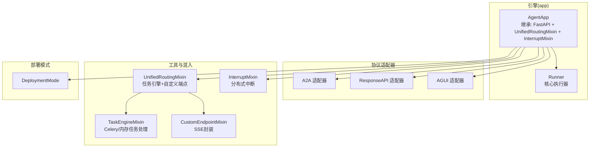
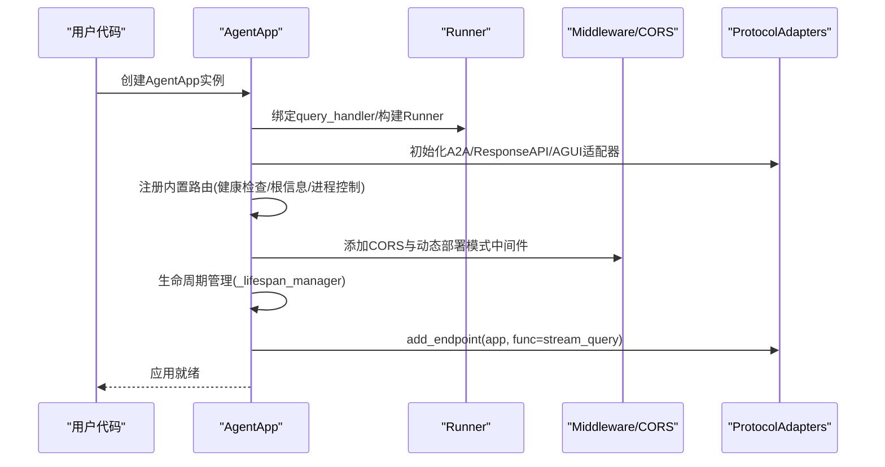
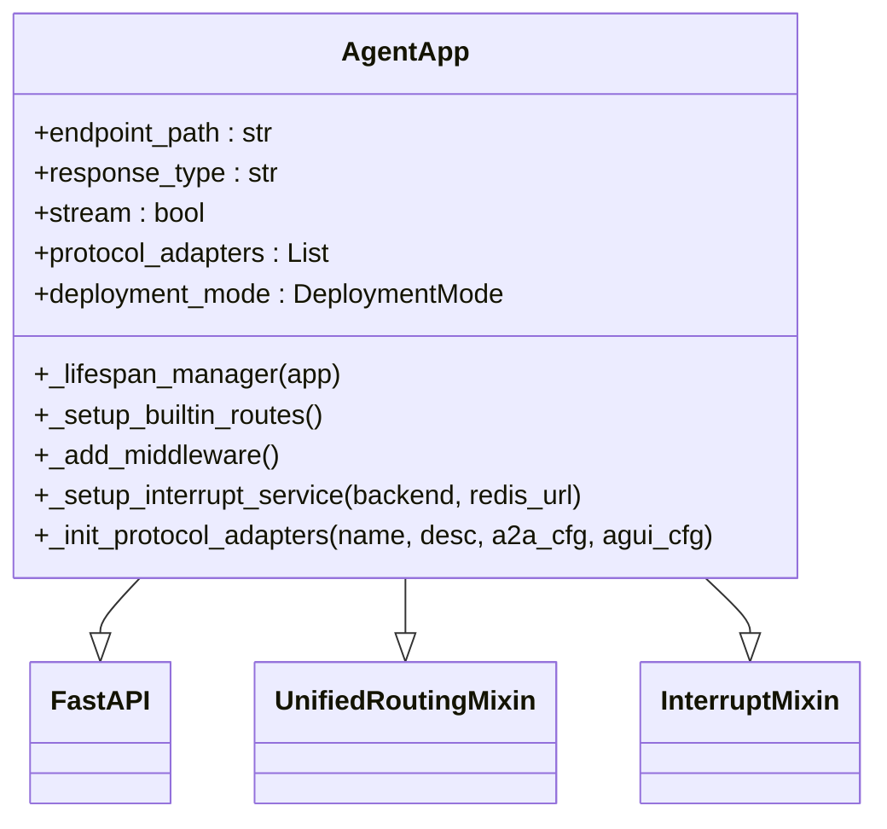
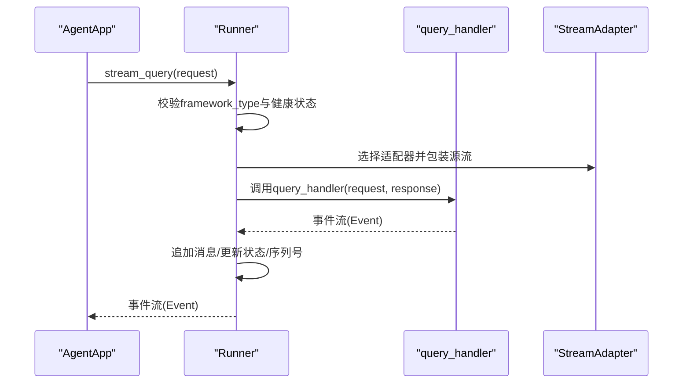
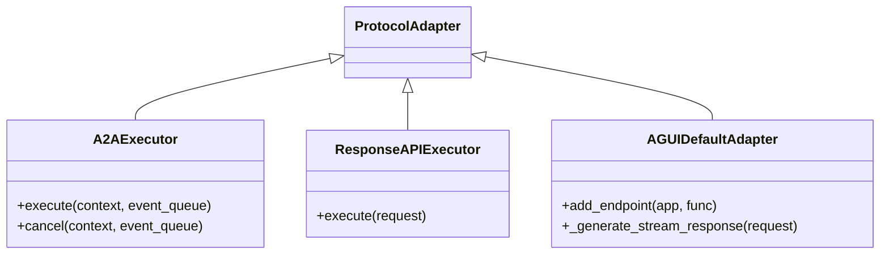
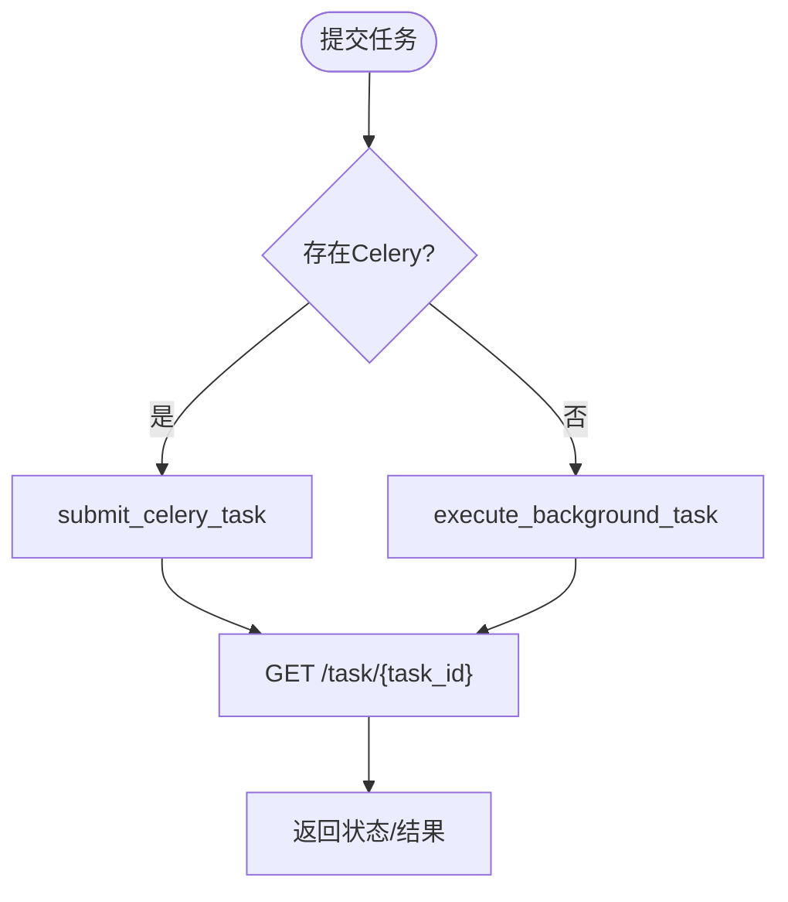
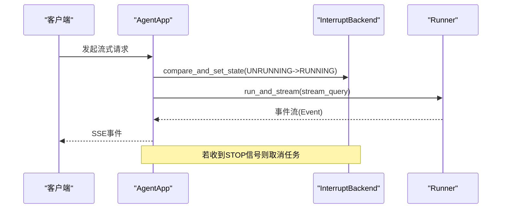
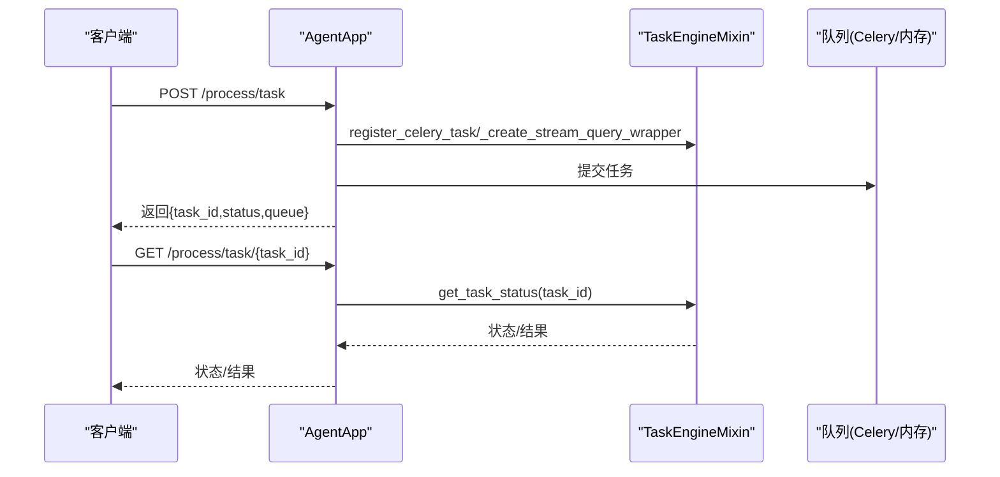
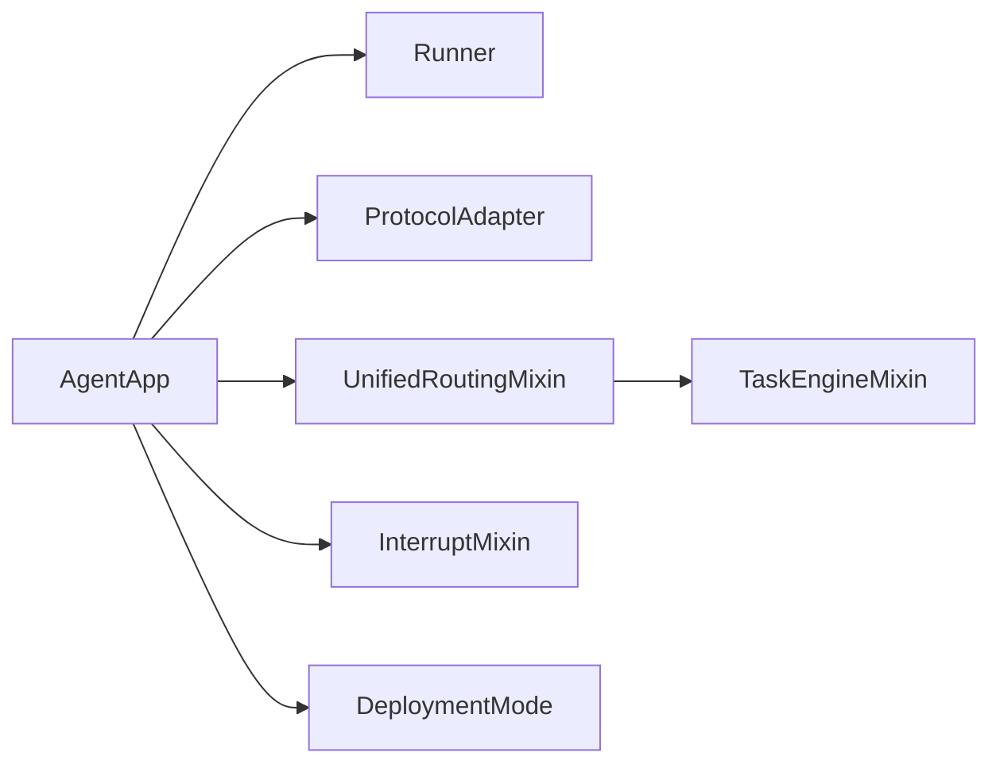

# AgentApp应用框架

<cite>
**本文档引用的文件**
- [agent_app.py](file://src/agentscope_runtime/engine/app/agent_app.py)
- [celery_mixin.py](file://src/agentscope_runtime/engine/app/celery_mixin.py)
- [base.py](file://src/agentscope_runtime/engine/deployers/base.py)
- [a2a_agent_adapter.py](file://src/agentscope_runtime/engine/deployers/adapter/a2a/a2a_agent_adapter.py)
- [response_api_agent_adapter.py](file://src/agentscope_runtime/engine/deployers/adapter/responses/response_api_agent_adapter.py)
- [agui_protocol_adapter.py](file://src/agentscope_runtime/engine/deployers/adapter/agui/agui_protocol_adapter.py)
- [unified_routing_mixin.py](file://src/agentscope_runtime/engine/deployers/utils/service_utils/routing/unified_routing_mixin.py)
- [task_engine_mixin.py](file://src/agentscope_runtime/engine/deployers/utils/service_utils/routing/task_engine_mixin.py)
- [custom_endpoint_mixin.py](file://src/agentscope_runtime/engine/deployers/utils/service_utils/routing/custom_endpoint_mixin.py)
- [interrupt_mixin.py](file://src/agentscope_runtime/engine/deployers/utils/service_utils/interrupt/interrupt_mixin.py)
- [deployment_modes.py](file://src/agentscope_runtime/engine/deployers/utils/deployment_modes.py)
- [runner.py](file://src/agentscope_runtime/engine/runner.py)
- [agent_schemas.py](file://src/agentscope_runtime/engine/schemas/agent_schemas.py)
</cite>

## 目录
1. [简介](#简介)
2. [项目结构](#项目结构)
3. [核心组件](#核心组件)
4. [架构总览](#架构总览)
5. [详细组件分析](#详细组件分析)
6. [依赖关系分析](#依赖关系分析)
7. [性能考量](#性能考量)
8. [故障排查指南](#故障排查指南)
9. [结论](#结论)
10. [附录：配置与使用示例](#附录配置与使用示例)

## 简介
AgentApp是基于FastAPI的应用框架扩展，用于快速构建可插拔、可流式输出的智能体服务。它通过统一的生命周期管理、协议适配器系统（A2A、ResponseAPI、AGUI）、内置中间件（CORS与动态部署模式检测）以及任务引擎（Celery与内存模式），为多框架智能体运行提供一致的HTTP接口与可观测性。

## 项目结构
AgentApp位于引擎模块的app子包中，围绕FastAPI进行扩展，同时引入路由、任务、中断等混合类以增强能力，并通过协议适配器对接外部系统。

**图表来源**
- [agent_app.py:60-220](file://src/agentscope_runtime/engine/app/agent_app.py#L60-L220)
- [unified_routing_mixin.py:16-101](file://src/agentscope_runtime/engine/deployers/utils/service_utils/routing/unified_routing_mixin.py#L16-L101)
- [task_engine_mixin.py:13-46](file://src/agentscope_runtime/engine/deployers/utils/service_utils/routing/task_engine_mixin.py#L13-L46)
- [custom_endpoint_mixin.py:15-58](file://src/agentscope_runtime/engine/deployers/utils/service_utils/routing/custom_endpoint_mixin.py#L15-L58)
- [interrupt_mixin.py:8-15](file://src/agentscope_runtime/engine/deployers/utils/service_utils/interrupt/interrupt_mixin.py#L8-L15)
- [deployment_modes.py:7-15](file://src/agentscope_runtime/engine/deployers/utils/deployment_modes.py#L7-L15)

**章节来源**
- [agent_app.py:60-220](file://src/agentscope_runtime/engine/app/agent_app.py#L60-L220)
- [unified_routing_mixin.py:16-101](file://src/agentscope_runtime/engine/deployers/utils/service_utils/routing/unified_routing_mixin.py#L16-L101)
- [task_engine_mixin.py:13-46](file://src/agentscope_runtime/engine/deployers/utils/service_utils/routing/task_engine_mixin.py#L13-L46)
- [custom_endpoint_mixin.py:15-58](file://src/agentscope_runtime/engine/deployers/utils/service_utils/routing/custom_endpoint_mixin.py#L15-L58)
- [interrupt_mixin.py:8-15](file://src/agentscope_runtime/engine/deployers/utils/service_utils/interrupt/interrupt_mixin.py#L8-L15)
- [deployment_modes.py:7-15](file://src/agentscope_runtime/engine/deployers/utils/deployment_modes.py#L7-L15)

## 核心组件
- AgentApp：继承FastAPI并融合统一路由与中断能力，负责生命周期管理、协议适配器初始化、内置路由注册与中间件装配。
- Runner：核心执行器，负责按框架类型选择消息流适配器，驱动query_handler并生成标准化事件序列。
- 协议适配器：将AgentApp内部事件转换为A2A、ResponseAPI或AGUI的对外格式。
- 路由与任务：UnifiedRoutingMixin整合TaskEngineMixin与CustomEndpointMixin，提供任务提交/状态轮询与自定义端点注册。
- 中断服务：InterruptMixin提供分布式中断能力，确保同一会话并发安全与可控取消。
- 部署模式：DeploymentMode枚举标识不同部署形态，影响中间件注入与响应头。

**章节来源**
- [agent_app.py:60-220](file://src/agentscope_runtime/engine/app/agent_app.py#L60-L220)
- [runner.py:46-121](file://src/agentscope_runtime/engine/runner.py#L46-L121)
- [unified_routing_mixin.py:16-101](file://src/agentscope_runtime/engine/deployers/utils/service_utils/routing/unified_routing_mixin.py#L16-L101)
- [task_engine_mixin.py:13-46](file://src/agentscope_runtime/engine/deployers/utils/service_utils/routing/task_engine_mixin.py#L13-L46)
- [interrupt_mixin.py:8-15](file://src/agentscope_runtime/engine/deployers/utils/service_utils/interrupt/interrupt_mixin.py#L8-L15)
- [deployment_modes.py:7-15](file://src/agentscope_runtime/engine/deployers/utils/deployment_modes.py#L7-L15)

## 架构总览
AgentApp在启动时完成以下关键步骤：
- 初始化Runner并绑定用户提供的query_handler。
- 初始化协议适配器集合（A2A、ResponseAPI、AGUI）。
- 注册内置路由（健康检查、根路径信息、进程控制）。
- 安装CORS与动态部署模式中间件。
- 在生命周期钩子中注册各协议适配器的端点。
- 可选启用嵌入式Celery工作线程与流式任务清理Worker。

**图表来源**
- [agent_app.py:124-220](file://src/agentscope_runtime/engine/app/agent_app.py#L124-L220)
- [agent_app.py:248-339](file://src/agentscope_runtime/engine/app/agent_app.py#L248-L339)
- [agent_app.py:340-357](file://src/agentscope_runtime/engine/app/agent_app.py#L340-L357)

**章节来源**
- [agent_app.py:124-220](file://src/agentscope_runtime/engine/app/agent_app.py#L124-L220)
- [agent_app.py:248-339](file://src/agentscope_runtime/engine/app/agent_app.py#L248-L339)
- [agent_app.py:340-357](file://src/agentscope_runtime/engine/app/agent_app.py#L340-L357)

## 详细组件分析

### AgentApp类与生命周期管理
- 继承关系：AgentApp继承FastAPI，并组合UnifiedRoutingMixin与InterruptMixin，从而具备统一路由、任务与中断能力。
- 构造参数：支持应用名称、描述、端点路径、响应类型、是否流式、请求模型、Runner实例、协议适配器列表、自定义端点元数据、部署模式等。
- 生命周期：通过FastAPI的lifespan参数统一管理内部Runner与用户逻辑；内部生命周期负责构建Runner、注册协议适配器端点、可选启动嵌入式Celery与任务清理Worker。
- 中断服务：根据传入的后端或Redis URL选择本地或Redis中断后端；否则回退到本地中断后端。
- 内置路由：/health（健康检查）、/（根路径信息，含process/stream/task等端点提示）、进程控制端点（/shutdown、/admin/shutdown、/admin/status）。
- 中间件：全局CORS；动态部署模式中间件在特定模式下设置响应头（如X-Process-Mode、X-Deployment-Mode）。

**图表来源**
- [agent_app.py:60-220](file://src/agentscope_runtime/engine/app/agent_app.py#L60-L220)

**章节来源**
- [agent_app.py:60-220](file://src/agentscope_runtime/engine/app/agent_app.py#L60-L220)
- [agent_app.py:222-316](file://src/agentscope_runtime/engine/app/agent_app.py#L222-L316)
- [agent_app.py:382-424](file://src/agentscope_runtime/engine/app/agent_app.py#L382-L424)
- [agent_app.py:359-381](file://src/agentscope_runtime/engine/app/agent_app.py#L359-L381)

### Runner与流式查询
- Runner负责启动/停止、部署管理、流式查询与事件序列化。
- 流式查询根据framework_type选择对应的消息流适配器，将query_handler的输出转换为标准化事件（Event），并维护序列号。
- 支持文本、AgentScope、LangGraph、AGNO、MS Agent Framework等多种框架类型的消息格式转换。

**图表来源**
- [runner.py:199-356](file://src/agentscope_runtime/engine/runner.py#L199-L356)

**章节来源**
- [runner.py:46-121](file://src/agentscope_runtime/engine/runner.py#L46-L121)
- [runner.py:199-356](file://src/agentscope_runtime/engine/runner.py#L199-L356)

### 协议适配器系统
- A2A适配器：将AgentApp内部事件转换为A2A消息，支持取消操作抛出错误。
- ResponseAPI适配器：将AgentApp事件转换为ResponseAPI事件序列，统一序列号。
- AGUI适配器：将AgentApp事件转换为AGUI事件，支持SSE流式输出与并发信号量控制。

**图表来源**
- [a2a_agent_adapter.py:23-70](file://src/agentscope_runtime/engine/deployers/adapter/a2a/a2a_agent_adapter.py#L23-L70)
- [response_api_agent_adapter.py:14-52](file://src/agentscope_runtime/engine/deployers/adapter/responses/response_api_agent_adapter.py#L14-L52)
- [agui_protocol_adapter.py:91-226](file://src/agentscope_runtime/engine/deployers/adapter/agui/agui_protocol_adapter.py#L91-L226)

**章节来源**
- [a2a_agent_adapter.py:23-70](file://src/agentscope_runtime/engine/deployers/adapter/a2a/a2a_agent_adapter.py#L23-L70)
- [response_api_agent_adapter.py:14-52](file://src/agentscope_runtime/engine/deployers/adapter/responses/response_api_agent_adapter.py#L14-L52)
- [agui_protocol_adapter.py:91-226](file://src/agentscope_runtime/engine/deployers/adapter/agui/agui_protocol_adapter.py#L91-L226)

### 路由与任务引擎
- UnifiedRoutingMixin：初始化TaskEngineMixin与自定义端点元数据同步，提供装饰器task与endpoint，支持任务提交/状态轮询与自定义端点恢复。
- TaskEngineMixin：根据broker/backend配置初始化Celery或回退内存模式；提供register_celery_task、submit_celery_task、execute_background_task、execute_stream_query_task等。
- CustomEndpointMixin：自动识别异步/同步/生成器函数，封装为SSE响应或普通响应，保留原函数签名以便FastAPI参数解析。

**图表来源**
- [unified_routing_mixin.py:25-101](file://src/agentscope_runtime/engine/deployers/utils/service_utils/routing/unified_routing_mixin.py#L25-L101)
- [task_engine_mixin.py:112-160](file://src/agentscope_runtime/engine/deployers/utils/service_utils/routing/task_engine_mixin.py#L112-L160)
- [task_engine_mixin.py:179-240](file://src/agentscope_runtime/engine/deployers/utils/service_utils/routing/task_engine_mixin.py#L179-L240)

**章节来源**
- [unified_routing_mixin.py:16-101](file://src/agentscope_runtime/engine/deployers/utils/service_utils/routing/unified_routing_mixin.py#L16-L101)
- [task_engine_mixin.py:13-46](file://src/agentscope_runtime/engine/deployers/utils/service_utils/routing/task_engine_mixin.py#L13-L46)
- [custom_endpoint_mixin.py:15-58](file://src/agentscope_runtime/engine/deployers/utils/service_utils/routing/custom_endpoint_mixin.py#L15-L58)

### 中断服务与分布式控制
- InterruptMixin：提供compare_and_set_state、publish_event、subscribe_listen等分布式中断能力；run_and_stream在给定user_id与session_id下保证单会话并发安全，支持取消与状态上报。
- AgentApp在有中断后端时，使用run_and_stream包装_stream_generator，实现可中断的流式输出。

**图表来源**
- [interrupt_mixin.py:38-147](file://src/agentscope_runtime/engine/deployers/utils/service_utils/interrupt/interrupt_mixin.py#L38-L147)
- [agent_app.py:643-703](file://src/agentscope_runtime/engine/app/agent_app.py#L643-L703)

**章节来源**
- [interrupt_mixin.py:8-15](file://src/agentscope_runtime/engine/deployers/utils/service_utils/interrupt/interrupt_mixin.py#L8-L15)
- [interrupt_mixin.py:38-147](file://src/agentscope_runtime/engine/deployers/utils/service_utils/interrupt/interrupt_mixin.py#L38-L147)
- [agent_app.py:643-703](file://src/agentscope_runtime/engine/app/agent_app.py#L643-L703)

### 健康检查、根路径信息与进程控制端点
- /health：返回服务健康状态与部署模式。
- /：返回process/stream/health等端点信息，若启用流式任务则包含/task与/task/{task_id}。
- /shutdown与/admin/shutdown：优雅关闭进程（延迟触发SIGTERM）。
- /admin/status：返回进程PID、状态、内存/CPU、启动时间等。

**章节来源**
- [agent_app.py:382-424](file://src/agentscope_runtime/engine/app/agent_app.py#L382-L424)
- [agent_app.py:598-642](file://src/agentscope_runtime/engine/app/agent_app.py#L598-L642)

### 流式查询任务端点（Celery与内存模式）
- /process/task：提交流式查询为后台任务，返回task_id；支持Celery与内存两种模式。
- /process/task/{task_id}：轮询任务状态，返回pending/running/finished/error。
- 设计要点：仅存储最终响应，忽略中间事件，降低内存占用；支持超时控制与失败重试策略（由Celery或内存实现决定）。

**图表来源**
- [agent_app.py:497-597](file://src/agentscope_runtime/engine/app/agent_app.py#L497-L597)
- [task_engine_mixin.py:241-348](file://src/agentscope_runtime/engine/deployers/utils/service_utils/routing/task_engine_mixin.py#L241-L348)

**章节来源**
- [agent_app.py:497-597](file://src/agentscope_runtime/engine/app/agent_app.py#L497-L597)
- [task_engine_mixin.py:241-348](file://src/agentscope_runtime/engine/deployers/utils/service_utils/routing/task_engine_mixin.py#L241-L348)

## 依赖关系分析
- AgentApp依赖Runner提供统一的流式执行能力；依赖ProtocolAdapter系列实现对外协议兼容；依赖UnifiedRoutingMixin与TaskEngineMixin提供任务与端点能力；依赖InterruptMixin提供中断控制。
- 协议适配器各自依赖AgentApp内部事件模型（Event/Message等）进行转换。
- 部署模式影响中间件行为与响应头注入。

**图表来源**
- [agent_app.py:60-220](file://src/agentscope_runtime/engine/app/agent_app.py#L60-L220)
- [unified_routing_mixin.py:16-24](file://src/agentscope_runtime/engine/deployers/utils/service_utils/routing/unified_routing_mixin.py#L16-L24)
- [task_engine_mixin.py:13-24](file://src/agentscope_runtime/engine/deployers/utils/service_utils/routing/task_engine_mixin.py#L13-L24)
- [interrupt_mixin.py:8-13](file://src/agentscope_runtime/engine/deployers/utils/service_utils/interrupt/interrupt_mixin.py#L8-L13)
- [deployment_modes.py:7-15](file://src/agentscope_runtime/engine/deployers/utils/deployment_modes.py#L7-L15)

**章节来源**
- [agent_app.py:60-220](file://src/agentscope_runtime/engine/app/agent_app.py#L60-L220)
- [unified_routing_mixin.py:16-24](file://src/agentscope_runtime/engine/deployers/utils/service_utils/routing/unified_routing_mixin.py#L16-L24)
- [task_engine_mixin.py:13-24](file://src/agentscope_runtime/engine/deployers/utils/service_utils/routing/task_engine_mixin.py#L13-L24)
- [interrupt_mixin.py:8-13](file://src/agentscope_runtime/engine/deployers/utils/service_utils/interrupt/interrupt_mixin.py#L8-L13)
- [deployment_modes.py:7-15](file://src/agentscope_runtime/engine/deployers/utils/deployment_modes.py#L7-L15)

## 性能考量
- 流式任务仅保存最终响应，避免中间事件占用内存；建议合理设置超时与清理周期。
- Celery模式下，嵌入式工作线程默认并发为1，可根据资源情况调整；未安装Celery时自动回退至内存模式。
- AGUI适配器使用信号量限制并发请求，避免过载。
- 中断后端在分布式场景下提供更优的并发控制与取消能力，减少重复执行风险。

[本节为通用指导，无需具体文件分析]

## 故障排查指南
- 启动失败：检查lifespan参数与before_start/after_finish钩子是否正确；确认Runner已启动且framework_type合法。
- 任务提交失败：确认broker_url与backend_url配置；若未安装Celery，将回退内存模式，注意任务持久化问题。
- 流式输出异常：检查query_handler是否正确实现；确认事件序列化与SSE封装正常。
- 中断无效：确认中断后端配置（本地/Redis）与通道命名一致；检查compare_and_set_state与publish_event调用。
- 健康检查不通过：查看Runner状态与部署模式；确认内置路由注册成功。

**章节来源**
- [agent_app.py:248-339](file://src/agentscope_runtime/engine/app/agent_app.py#L248-L339)
- [task_engine_mixin.py:112-160](file://src/agentscope_runtime/engine/deployers/utils/service_utils/routing/task_engine_mixin.py#L112-L160)
- [interrupt_mixin.py:38-147](file://src/agentscope_runtime/engine/deployers/utils/service_utils/interrupt/interrupt_mixin.py#L38-L147)

## 结论
AgentApp通过“协议适配器 + 统一路由 + 任务引擎 + 中断服务”的组合，为多框架智能体提供了统一、可观测、可扩展的运行时基础设施。其生命周期管理与中间件设计使得部署与运维更加简单，而Celery与内存模式的双轨支持满足了从开发到生产的多样化需求。

[本节为总结性内容，无需具体文件分析]

## 附录：配置与使用示例

### 基本AgentApp初始化
- 指定应用名称、描述、端点路径、是否流式、请求模型、Runner实例、协议适配器列表、部署模式等。
- 可选启用嵌入式Celery工作线程与流式任务清理Worker。

**章节来源**
- [agent_app.py:124-220](file://src/agentscope_runtime/engine/app/agent_app.py#L124-L220)

### 生命周期与钩子
- 使用lifespan参数统一管理启动/关闭逻辑；before_start/after_finish钩子支持同步/异步。
- Runner的start/stop与__aenter__/__aexit__生命周期需正确配合。

**章节来源**
- [agent_app.py:248-339](file://src/agentscope_runtime/engine/app/agent_app.py#L248-L339)
- [runner.py:76-121](file://src/agentscope_runtime/engine/runner.py#L76-L121)

### 协议适配器初始化与配置
- A2A：通过extract_a2a_config提取配置，初始化A2AFastAPIDefaultAdapter。
- ResponseAPI：初始化ResponseAPIDefaultAdapter。
- AGUI：通过AGUIAdaptorConfig指定路由路径，初始化AGUIDefaultAdapter。

**章节来源**
- [agent_app.py:340-357](file://src/agentscope_runtime/engine/app/agent_app.py#L340-L357)
- [agui_protocol_adapter.py:80-98](file://src/agentscope_runtime/engine/deployers/adapter/agui/agui_protocol_adapter.py#L80-L98)

### 自定义端点与任务
- 使用endpoint装饰器注册自定义端点；使用task装饰器提交任务，支持Celery与内存模式。
- 自定义端点支持异步/同步/生成器函数，自动封装为SSE或普通响应。

**章节来源**
- [unified_routing_mixin.py:103-120](file://src/agentscope_runtime/engine/deployers/utils/service_utils/routing/unified_routing_mixin.py#L103-L120)
- [unified_routing_mixin.py:25-101](file://src/agentscope_runtime/engine/deployers/utils/service_utils/routing/unified_routing_mixin.py#L25-L101)
- [custom_endpoint_mixin.py:15-58](file://src/agentscope_runtime/engine/deployers/utils/service_utils/routing/custom_endpoint_mixin.py#L15-L58)

### 中断服务配置
- 优先使用外部后端实例；否则使用Redis URL；否则回退本地后端。
- 通过run_and_stream在分布式场景下保证并发安全与可控取消。

**章节来源**
- [agent_app.py:222-247](file://src/agentscope_runtime/engine/app/agent_app.py#L222-L247)
- [interrupt_mixin.py:38-147](file://src/agentscope_runtime/engine/deployers/utils/service_utils/interrupt/interrupt_mixin.py#L38-L147)

### 部署模式与中间件
- DeploymentMode枚举支持daemon_thread、detached_process、standalone三种模式。
- 动态部署模式中间件在特定模式下设置响应头，便于客户端识别。

**章节来源**
- [deployment_modes.py:7-15](file://src/agentscope_runtime/engine/deployers/utils/deployment_modes.py#L7-L15)
- [agent_app.py:359-381](file://src/agentscope_runtime/engine/app/agent_app.py#L359-L381)

### 流式查询任务端点使用
- 提交任务：POST /process/task，返回task_id。
- 查询状态：GET /process/task/{task_id}，返回pending/running/finished/error。
- 超时与清理：execute_stream_query_task支持超时控制；定时清理过期任务。

**章节来源**
- [agent_app.py:497-597](file://src/agentscope_runtime/engine/app/agent_app.py#L497-L597)
- [task_engine_mixin.py:241-348](file://src/agentscope_runtime/engine/deployers/utils/service_utils/routing/task_engine_mixin.py#L241-L348)
- [agent_app.py:426-471](file://src/agentscope_runtime/engine/app/agent_app.py#L426-L471)