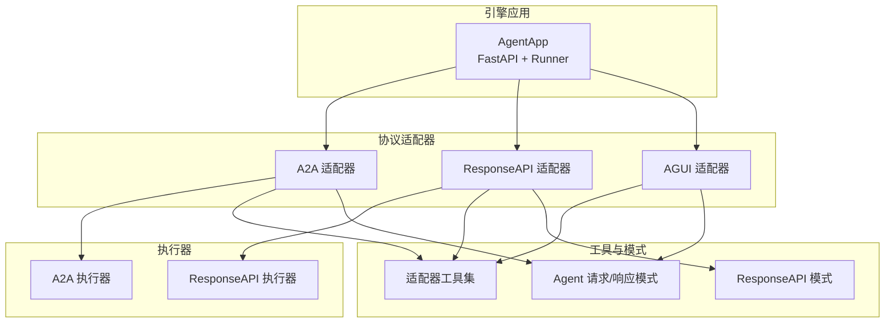
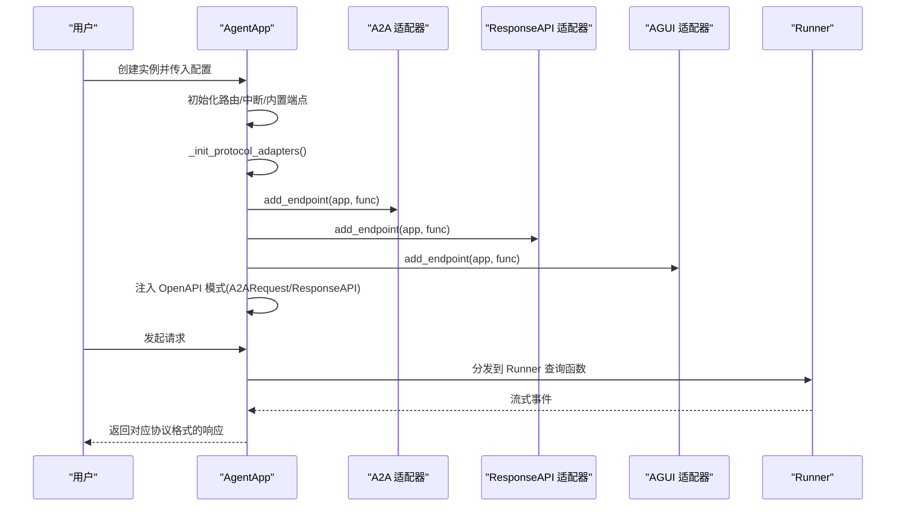
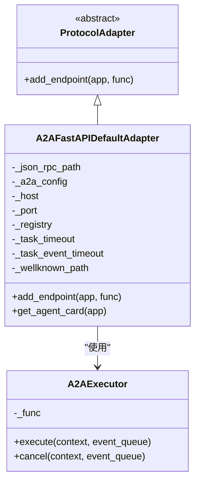
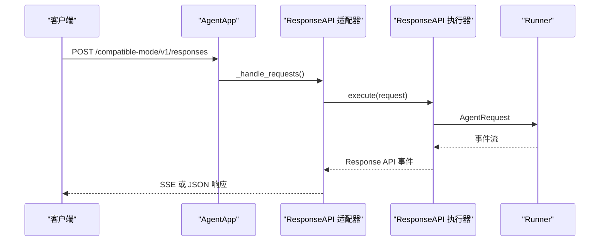
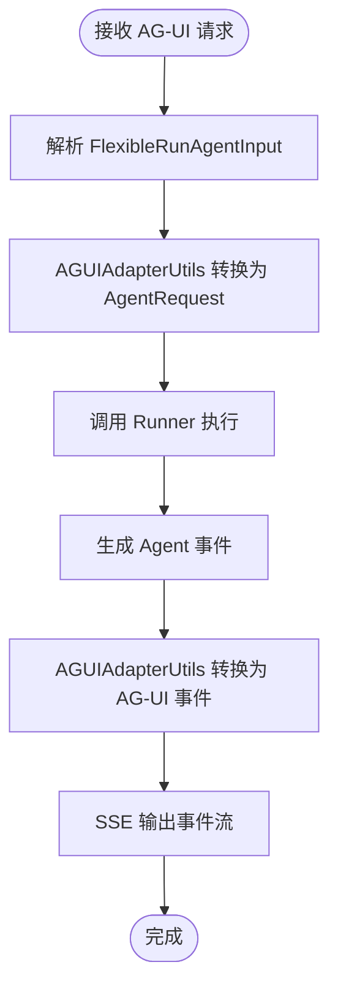
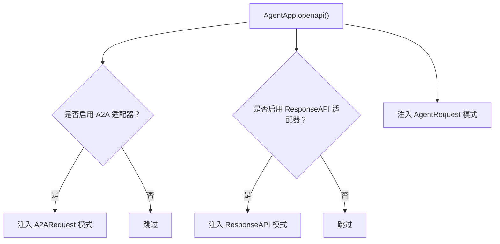
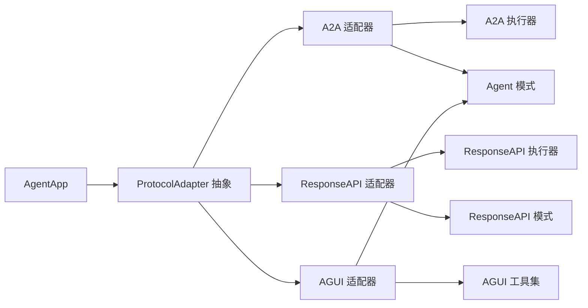

# 协议适配器系统

<cite>
**本文引用的文件**
- [agent_app.py](file://src/agentscope_runtime/engine/app/agent_app.py)
- [protocol_adapter.py](file://src/agentscope_runtime/engine/deployers/adapter/protocol_adapter.py)
- [a2a_protocol_adapter.py](file://src/agentscope_runtime/engine/deployers/adapter/a2a/a2a_protocol_adapter.py)
- [a2a_agent_adapter.py](file://src/agentscope_runtime/engine/deployers/adapter/a2a/a2a_agent_adapter.py)
- [response_api_protocol_adapter.py](file://src/agentscope_runtime/engine/deployers/adapter/responses/response_api_protocol_adapter.py)
- [response_api_agent_adapter.py](file://src/agentscope_runtime/engine/deployers/adapter/responses/response_api_agent_adapter.py)
- [agui_protocol_adapter.py](file://src/agentscope_runtime/engine/deployers/adapter/agui/agui_protocol_adapter.py)
- [agui_adapter_utils.py](file://src/agentscope_runtime/engine/deployers/adapter/agui/agui_adapter_utils.py)
- [response_api.py](file://src/agentscope_runtime/engine/schemas/response_api.py)
- [agent_schemas.py](file://src/agentscope_runtime/engine/schemas/agent_schemas.py)
- [__init__.py（A2A适配器）](file://src/agentscope_runtime/engine/deployers/adapter/a2a/__init__.py)
- [__init__.py（AGUI适配器）](file://src/agentscope_runtime/engine/deployers/adapter/agui/__init__.py)
- [agent.py（AGUI示例）](file://examples/integrations/ag-ui/agent.py)
</cite>

## 目录
1. [简介](#简介)
2. [项目结构](#项目结构)
3. [核心组件](#核心组件)
4. [架构总览](#架构总览)
5. [详细组件分析](#详细组件分析)
6. [依赖关系分析](#依赖关系分析)
7. [性能考量](#性能考量)
8. [故障排查指南](#故障排查指南)
9. [结论](#结论)
10. [附录：配置与集成示例](#附录配置与集成示例)

## 简介
本文件面向协议适配器系统，系统性阐述 AgentApp 如何通过协议适配器实现多框架兼容性，覆盖以下三类适配器：
- A2A 协议适配器：基于 Agent-to-Agent 协议，提供 JSON-RPC 路由、AgentCard 发现与任务管理能力
- ResponseAPI 适配器：兼容 OpenAI Response API 的兼容层，支持流式与非流式响应
- AGUI 适配器：面向 AG-UI 客户端的流式事件转换与路由

重点内容包括：
- 每个适配器的初始化流程、配置参数与路由注册机制
- 适配器之间的协作关系与优先级处理
- OpenAPI 模式注入机制（A2ARequest 与 ResponseAPI 模型的动态添加）
- 典型配置示例与扩展新协议适配器的集成模式

## 项目结构
协议适配器位于引擎部署层的适配器子模块中，AgentApp 在启动时统一初始化并注册各协议适配器的路由。

图示来源
- [agent_app.py:60-220](file://src/agentscope_runtime/engine/app/agent_app.py#L60-L220)
- [a2a_protocol_adapter.py:136-258](file://src/agentscope_runtime/engine/deployers/adapter/a2a/a2a_protocol_adapter.py#L136-L258)
- [response_api_protocol_adapter.py:33-315](file://src/agentscope_runtime/engine/deployers/adapter/responses/response_api_protocol_adapter.py#L33-L315)
- [agui_protocol_adapter.py:91-226](file://src/agentscope_runtime/engine/deployers/adapter/agui/agui_protocol_adapter.py#L91-L226)

章节来源
- [agent_app.py:60-220](file://src/agentscope_runtime/engine/app/agent_app.py#L60-L220)

## 核心组件
- 协议适配器抽象基类：定义统一的 add_endpoint 接口，确保不同协议以一致方式注册路由
- AgentApp：在生命周期内统一初始化适配器、注入 OpenAPI 模式、注册内置路由与中断服务，并将 Runner 的查询函数作为执行入口分发给各适配器
- 适配器执行器：将外部请求转换为 AgentRequest 并驱动 Runner 流式输出；同时将 Agent 事件转换为对应协议的事件或响应对象

章节来源
- [protocol_adapter.py:6-25](file://src/agentscope_runtime/engine/deployers/adapter/protocol_adapter.py#L6-L25)
- [agent_app.py:68-123](file://src/agentscope_runtime/engine/app/agent_app.py#L68-L123)
- [agent_app.py:273-274](file://src/agentscope_runtime/engine/app/agent_app.py#L273-L274)

## 架构总览
AgentApp 启动时按顺序完成：
- 初始化路由管理器与中断服务
- 构建 Runner 并绑定装饰器处理器
- 初始化协议适配器列表（默认包含 A2A、ResponseAPI、AGUI）
- 注册内置健康检查与信息发现端点
- 针对每个适配器调用 add_endpoint(app, func)，将 Runner 的查询函数注入到各协议路由中
- 注入 OpenAPI 组件：根据已启用的适配器动态注入 A2ARequest 与 ResponseAPI 模式

图示来源
- [agent_app.py:193-201](file://src/agentscope_runtime/engine/app/agent_app.py#L193-L201)
- [agent_app.py:273-274](file://src/agentscope_runtime/engine/app/agent_app.py#L273-L274)
- [agent_app.py:68-123](file://src/agentscope_runtime/engine/app/agent_app.py#L68-L123)

## 详细组件分析

### A2A 协议适配器
- 设计目标：为 Agent-to-Agent 场景提供 JSON-RPC 路由、Well-Known AgentCard 发布与任务管理
- 初始化流程
  - 规范化配置：从传入配置或环境变量提取 Registry 实例
  - 构建 AgentCard：自动填充 URL、技能、传输属性等字段
  - 注册路由：将 JSON-RPC 与 AgentCard 路由挂载到 FastAPI 应用
  - 服务注册：可选地向多个 Registry 注册 AgentCard
- 关键配置
  - agent_name / agent_description：回退到 AgentCard 字段缺失时的默认值
  - host/port：自动探测或从环境变量读取
  - registry：支持单个或列表，支持延迟导入 NacosRegistry
  - task_timeout / task_event_timeout：任务超时控制
  - wellknown_path：AgentCard 发布路径
- 路由注册机制
  - JSON-RPC 路径默认 “/a2a”
  - 使用 A2AFastAPIApplication 将请求处理器与任务存储挂载到应用
- 与 Runner 的协作
  - 通过 A2AExecutor 将 A2A 请求转换为 AgentRequest 并驱动 Runner
  - 仅在最终响应完成时将结果写入事件队列返回

图示来源
- [protocol_adapter.py:6-25](file://src/agentscope_runtime/engine/deployers/adapter/protocol_adapter.py#L6-L25)
- [a2a_protocol_adapter.py:136-258](file://src/agentscope_runtime/engine/deployers/adapter/a2a/a2a_protocol_adapter.py#L136-L258)
- [a2a_agent_adapter.py:23-70](file://src/agentscope_runtime/engine/deployers/adapter/a2a/a2a_agent_adapter.py#L23-L70)

章节来源
- [a2a_protocol_adapter.py:55-91](file://src/agentscope_runtime/engine/deployers/adapter/a2a/a2a_protocol_adapter.py#L55-L91)
- [a2a_protocol_adapter.py:136-258](file://src/agentscope_runtime/engine/deployers/adapter/a2a/a2a_protocol_adapter.py#L136-L258)
- [a2a_agent_adapter.py:23-70](file://src/agentscope_runtime/engine/deployers/adapter/a2a/a2a_agent_adapter.py#L23-L70)
- [__init__.py（A2A适配器）:14-32](file://src/agentscope_runtime/engine/deployers/adapter/a2a/__init__.py#L14-L32)

### ResponseAPI 适配器
- 设计目标：兼容 OpenAI Response API 的请求/响应格式，支持 SSE 流式与非流式响应
- 初始化流程
  - 构造 ResponseAPIExecutor，限制并发请求数量
  - 注册 POST /compatible-mode/v1/responses 路由
- 关键配置
  - timeout：请求超时控制
  - max_concurrent_requests：并发信号量
- 路由注册机制
  - 使用 openapi_extra 引用 ResponseAPI 模式定义
  - 支持 stream 参数决定是否返回 SSE
- 与 Runner 的协作
  - 通过 ResponsesAdapter 将 Response API 请求转换为 AgentRequest
  - 将 Runner 的事件序列转换为 Response API 事件并统一设置 sequence_number
  - 非流式模式下收集最终响应

图示来源
- [response_api_protocol_adapter.py:285-315](file://src/agentscope_runtime/engine/deployers/adapter/responses/response_api_protocol_adapter.py#L285-L315)
- [response_api_agent_adapter.py:14-52](file://src/agentscope_runtime/engine/deployers/adapter/responses/response_api_agent_adapter.py#L14-L52)

章节来源
- [response_api_protocol_adapter.py:33-315](file://src/agentscope_runtime/engine/deployers/adapter/responses/response_api_protocol_adapter.py#L33-L315)
- [response_api_agent_adapter.py:14-52](file://src/agentscope_runtime/engine/deployers/adapter/responses/response_api_agent_adapter.py#L14-L52)
- [response_api.py:35-66](file://src/agentscope_runtime/engine/schemas/response_api.py#L35-L66)

### AGUI 适配器
- 设计目标：将 AG-UI 客户端的运行输入转换为 Agent API 请求，并将 Runner 的事件转换为 AG-UI 事件流
- 初始化流程
  - 读取 AGUIAdaptorConfig，设置路由路径（默认 “/ag-ui”）
  - 构造 AGUIAdapterUtils，用于消息与工具的双向转换
  - 注册 POST 路由
- 关键配置
  - route_path：自定义 AGUI 路由路径
  - max_concurrent_requests：并发信号量
- 路由注册机制
  - 使用 FlexibleRunAgentInput 作为输入模型，支持 snake_case/camelCase 字段别名
  - 将 Runner 的异步事件流转换为 SSE 事件
- 与 Runner 的协作
  - 通过 AGUIAdapterUtils 将 AG-UI 输入转换为 AgentRequest
  - 将 Agent 事件转换为 AG-UI 事件（文本消息、工具调用、运行结束等）
  - 自动补充 RUN_STARTED/RUN_FINISHED 事件

图示来源
- [agui_protocol_adapter.py:108-226](file://src/agentscope_runtime/engine/deployers/adapter/agui/agui_protocol_adapter.py#L108-L226)
- [agui_adapter_utils.py:247-359](file://src/agentscope_runtime/engine/deployers/adapter/agui/agui_adapter_utils.py#L247-L359)

章节来源
- [agui_protocol_adapter.py:91-226](file://src/agentscope_runtime/engine/deployers/adapter/agui/agui_protocol_adapter.py#L91-L226)
- [agui_adapter_utils.py:219-658](file://src/agentscope_runtime/engine/deployers/adapter/agui/agui_adapter_utils.py#L219-L658)

### OpenAPI 模式注入机制
AgentApp 在生成 OpenAPI 时，会根据已启用的协议适配器动态注入相应模式：
- 若存在 A2AFastAPIDefaultAdapter，则注入 A2ARequest 模式
- 若存在 ResponseAPIDefaultAdapter，则注入 ResponseAPI 模式
- 总是注入 AgentRequest 模式

图示来源
- [agent_app.py:68-123](file://src/agentscope_runtime/engine/app/agent_app.py#L68-L123)

章节来源
- [agent_app.py:68-123](file://src/agentscope_runtime/engine/app/agent_app.py#L68-L123)

## 依赖关系分析
- AgentApp 对协议适配器的依赖：通过统一接口 add_endpoint 注册路由，解耦具体协议实现
- 适配器对 Runner 的依赖：所有适配器均以 Runner 的查询函数为执行入口，保证多框架一致性
- 适配器内部的执行器依赖：A2AExecutor、ResponseAPIExecutor、AGUIAdapterUtils 分别负责协议到 Agent API 的转换与事件映射
- 模式依赖：A2A 与 ResponseAPI 适配器在 OpenAPI 中引用各自模式定义

图示来源
- [protocol_adapter.py:6-25](file://src/agentscope_runtime/engine/deployers/adapter/protocol_adapter.py#L6-L25)
- [agent_app.py:273-274](file://src/agentscope_runtime/engine/app/agent_app.py#L273-L274)

章节来源
- [protocol_adapter.py:6-25](file://src/agentscope_runtime/engine/deployers/adapter/protocol_adapter.py#L6-L25)
- [agent_app.py:273-274](file://src/agentscope_runtime/engine/app/agent_app.py#L273-L274)

## 性能考量
- 并发控制：ResponseAPI 与 AGUI 适配器均使用 asyncio.Semaphore 控制最大并发请求，避免资源争用
- 超时策略：ResponseAPI 提供请求超时控制，超时后发送失败事件
- 流式传输：A2A/ResponseAPI/AGUI 均采用流式响应，降低首字节延迟并提升用户体验
- 任务清理：AgentApp 提供后台任务清理周期性扫描与移除过期任务，避免内存泄漏

章节来源
- [response_api_protocol_adapter.py:34-42](file://src/agentscope_runtime/engine/deployers/adapter/responses/response_api_protocol_adapter.py#L34-L42)
- [agui_protocol_adapter.py:102-106](file://src/agentscope_runtime/engine/deployers/adapter/agui/agui_protocol_adapter.py#L102-L106)
- [agent_app.py:460-471](file://src/agentscope_runtime/engine/app/agent_app.py#L460-L471)

## 故障排查指南
- A2A 适配器
  - 注册失败：检查 registry 配置与网络连通性；日志会记录失败原因但不阻断启动
  - AgentCard 缺失字段：适配器会自动填充 URL、版本、技能等字段，若提供冲突字段会被忽略
- ResponseAPI 适配器
  - 非流式响应为空：检查 Runner 是否产生最终响应；适配器会返回失败错误对象
  - 流式异常：捕获异常后发送失败事件，确认 Runner 事件序列完整性
- AGUI 适配器
  - 事件映射异常：检查 AGUIAdapterUtils 的消息/工具转换逻辑；必要时调整输入模型字段别名
  - 运行结束事件：适配器会在流结束后补充 RUN_FINISHED 事件，确保前端状态同步

章节来源
- [a2a_protocol_adapter.py:276-298](file://src/agentscope_runtime/engine/deployers/adapter/a2a/a2a_protocol_adapter.py#L276-L298)
- [response_api_protocol_adapter.py:119-159](file://src/agentscope_runtime/engine/deployers/adapter/responses/response_api_protocol_adapter.py#L119-L159)
- [agui_protocol_adapter.py:177-198](file://src/agentscope_runtime/engine/deployers/adapter/agui/agui_protocol_adapter.py#L177-L198)

## 结论
协议适配器系统通过统一的抽象接口与 OpenAPI 模式注入，实现了对 A2A、ResponseAPI 与 AGUI 多协议的无缝兼容。AgentApp 在生命周期内集中初始化与注册各适配器，结合 Runner 的流式执行能力，为多框架场景提供了稳定、可扩展的运行时基础。开发者可通过新增适配器快速扩展新协议，同时保持与现有模式与工具链的一致性。

## 附录：配置与集成示例

### A2A 适配器配置要点
- 配置项
  - agent_name / agent_description：回退到 AgentCard 字段缺失时的默认值
  - host/port：自动探测或从环境变量读取
  - registry：支持单个或列表，支持延迟导入 NacosRegistry
  - task_timeout / task_event_timeout：任务超时控制
  - wellknown_path：AgentCard 发布路径
- 初始化与注册
  - AgentApp 默认初始化 A2A 适配器并注册 JSON-RPC 与 AgentCard 路由
  - 可选地向多个 Registry 注册 AgentCard

章节来源
- [a2a_protocol_adapter.py:55-91](file://src/agentscope_runtime/engine/deployers/adapter/a2a/a2a_protocol_adapter.py#L55-L91)
- [a2a_protocol_adapter.py:136-258](file://src/agentscope_runtime/engine/deployers/adapter/a2a/a2a_protocol_adapter.py#L136-L258)

### ResponseAPI 适配器配置要点
- 配置项
  - timeout：请求超时控制
  - max_concurrent_requests：并发信号量
- 路由与模式
  - 路由：POST /compatible-mode/v1/responses
  - 模式：在 OpenAPI 中引用 ResponseAPI 模式定义

章节来源
- [response_api_protocol_adapter.py:33-315](file://src/agentscope_runtime/engine/deployers/adapter/responses/response_api_protocol_adapter.py#L33-L315)
- [response_api.py:35-66](file://src/agentscope_runtime/engine/schemas/response_api.py#L35-L66)

### AGUI 适配器配置要点
- 配置项
  - route_path：自定义 AGUI 路由路径（默认 “/ag-ui”）
  - max_concurrent_requests：并发信号量
- 示例集成
  - 参考示例脚本，创建 AgentApp 并传入 AGUIAdaptorConfig
  - 在 Runner 中实现查询函数，驱动 AGUI 事件流

章节来源
- [agui_protocol_adapter.py:91-226](file://src/agentscope_runtime/engine/deployers/adapter/agui/agui_protocol_adapter.py#L91-L226)
- [agent.py（AGUI示例）:21-25](file://examples/integrations/ag-ui/agent.py#L21-L25)
- [agent.py（AGUI示例）:88-156](file://examples/integrations/ag-ui/agent.py#L88-L156)

### 扩展新协议适配器的步骤
- 实现 ProtocolAdapter 子类
  - 实现 add_endpoint(app, func) 方法，注册路由并将 Runner 的查询函数注入
- 定义请求/响应模式
  - 在 schemas 下新增 Pydantic 模型，或复用现有模型
- 注入 OpenAPI 模式
  - 在 AgentApp.openapi() 中根据适配器类型动态注入模式定义
- 集成与测试
  - 在 AgentApp 的协议适配器列表中加入新适配器
  - 编写端到端测试验证路由与事件流

章节来源
- [protocol_adapter.py:6-25](file://src/agentscope_runtime/engine/deployers/adapter/protocol_adapter.py#L6-L25)
- [agent_app.py:68-123](file://src/agentscope_runtime/engine/app/agent_app.py#L68-L123)