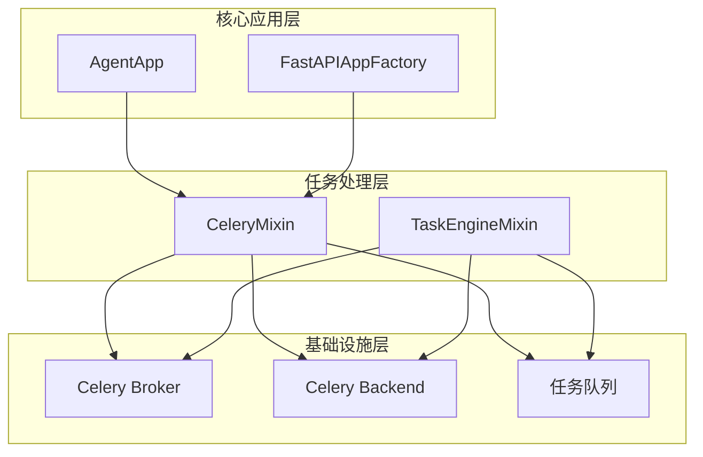
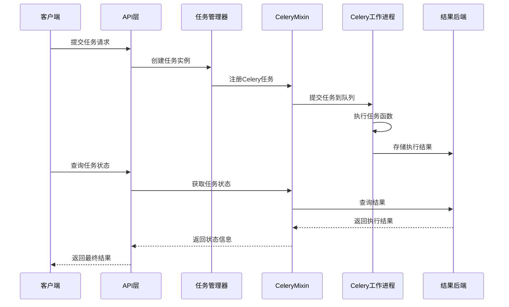
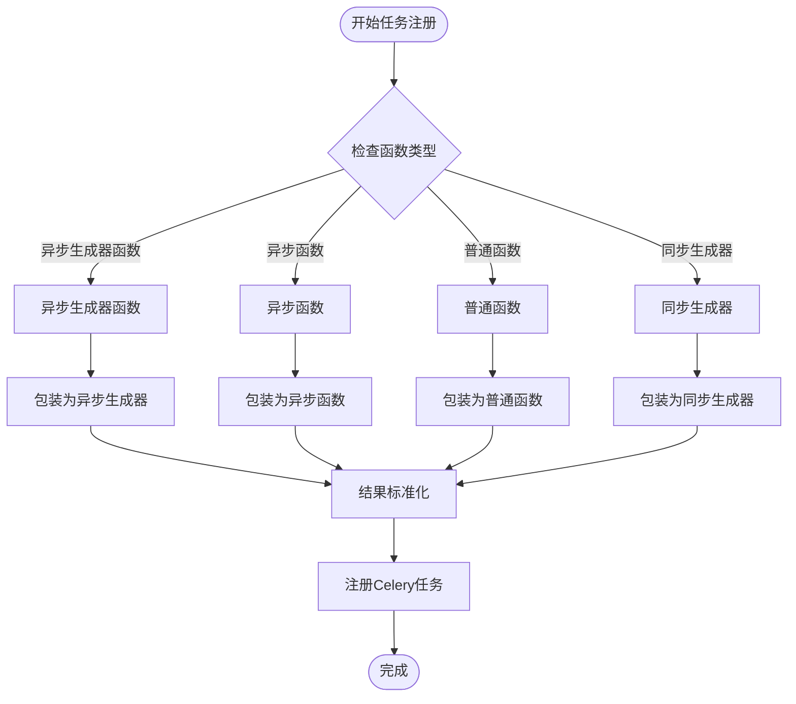
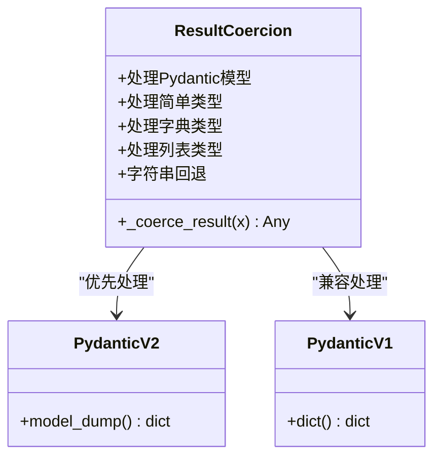
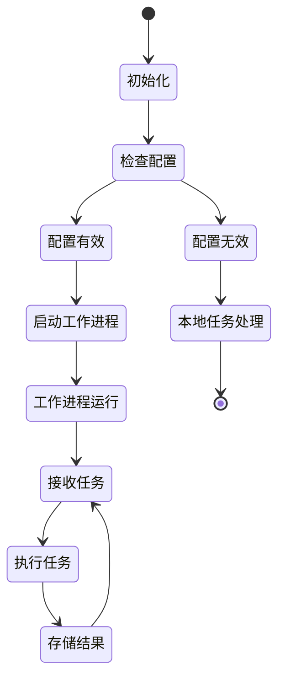
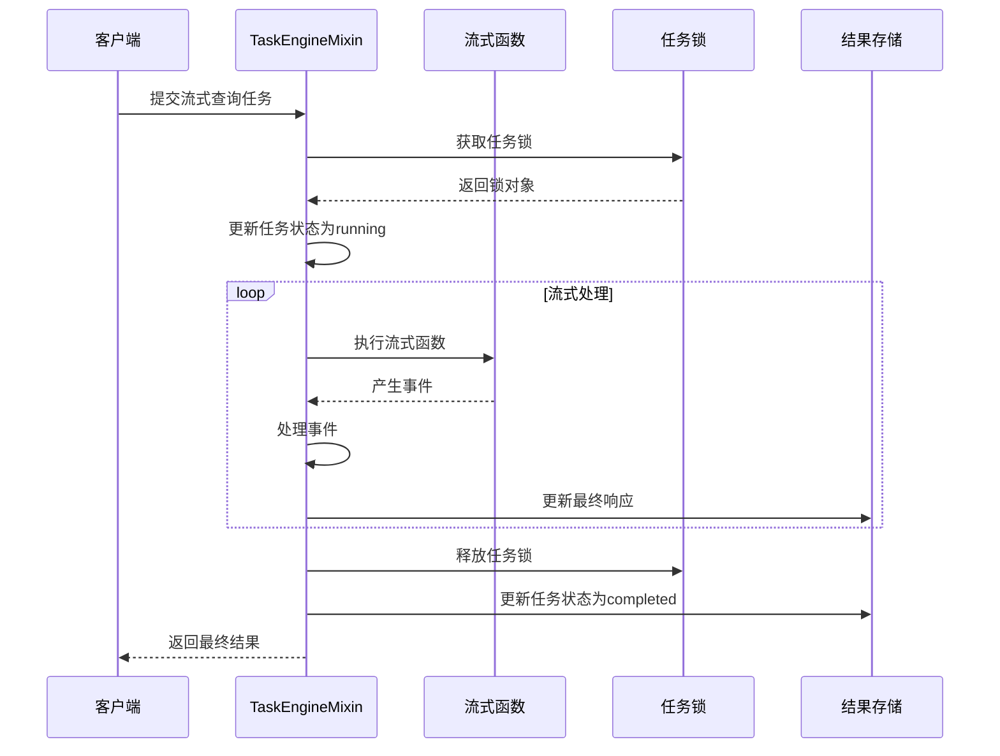
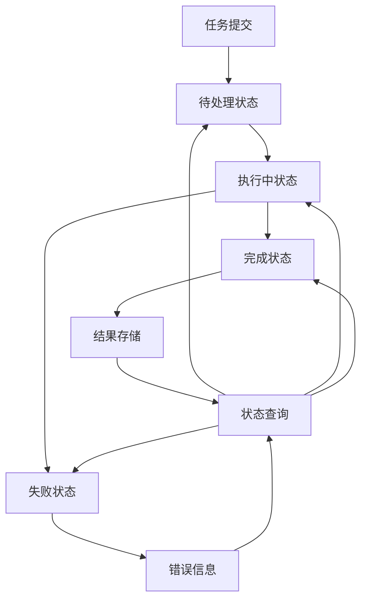
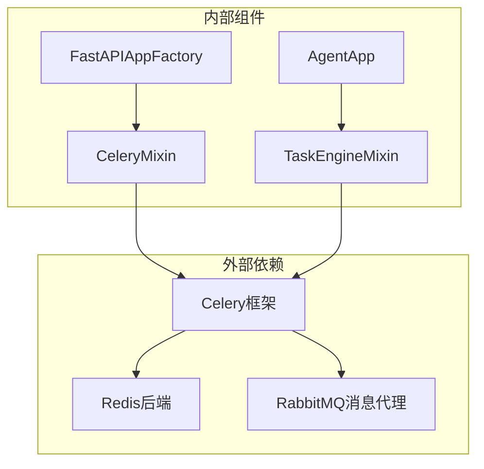

# CeleryMixin异步任务处理

<cite>
**本文档引用的文件**
- [celery_mixin.py](file://src/agentscope_runtime/engine/app/celery_mixin.py)
- [task_engine_mixin.py](file://src/agentscope_runtime/engine/deployers/utils/service_utils/routing/task_engine_mixin.py)
- [fastapi_factory.py](file://src/agentscope_runtime/engine/deployers/utils/service_utils/fastapi_factory.py)
- [agent_app.py](file://src/agentscope_runtime/engine/app/agent_app.py)
- [test_agent_app_stream_task.py](file://tests/integrated/test_agent_app_stream_task.py)
</cite>

## 目录
1. [简介](#简介)
2. [项目结构](#项目结构)
3. [核心组件](#核心组件)
4. [架构概览](#架构概览)
5. [详细组件分析](#详细组件分析)
6. [依赖关系分析](#依赖关系分析)
7. [性能考虑](#性能考虑)
8. [故障排除指南](#故障排除指南)
9. [结论](#结论)
10. [附录](#附录)

## 简介

CeleryMixin是AgentScope Runtime中用于处理异步任务的核心组件，基于Celery分布式任务队列系统构建。该模块提供了完整的异步任务处理能力，包括嵌入式Celery工作进程的启动和管理、流式查询任务的后台执行模式、任务队列管理、任务状态跟踪和结果存储策略。

本模块设计的核心目标是为AgentScope Runtime提供可扩展的异步任务处理能力，支持从简单的同步函数到复杂的异步生成器函数的统一处理。通过Celery集成，系统能够实现高可用的任务调度、负载均衡和容错机制。

## 项目结构

CeleryMixin相关组件在项目中的组织结构如下：



**图表来源**
- [celery_mixin.py:23-46](file://src/agentscope_runtime/engine/app/celery_mixin.py#L23-L46)
- [task_engine_mixin.py:13-46](file://src/agentscope_runtime/engine/deployers/utils/service_utils/routing/task_engine_mixin.py#L13-L46)

**章节来源**
- [celery_mixin.py:1-144](file://src/agentscope_runtime/engine/app/celery_mixin.py#L1-L144)
- [task_engine_mixin.py:1-391](file://src/agentscope_runtime/engine/deployers/utils/service_utils/routing/task_engine_mixin.py#L1-L391)

## 核心组件

### CeleryMixin类

CeleryMixin是异步任务处理的核心类，提供了以下主要功能：

1. **Celery应用初始化**：支持通过broker_url和backend_url配置Celery连接
2. **任务注册机制**：将Python函数转换为Celery任务，支持多种函数类型
3. **任务执行管理**：提供任务提交、状态查询和结果获取功能
4. **嵌入式工作进程**：支持在应用内部启动Celery worker进程

### TaskEngineMixin类

TaskEngineMixin提供了更高级的任务引擎功能，包括：

1. **统一的任务处理接口**：整合Celery和本地任务处理
2. **流式查询任务处理**：专门针对流式响应的后台任务执行
3. **任务状态管理**：维护活跃任务的状态信息
4. **并发控制**：通过锁机制确保任务执行的线程安全

**章节来源**
- [celery_mixin.py:29-144](file://src/agentscope_runtime/engine/app/celery_mixin.py#L29-L144)
- [task_engine_mixin.py:14-391](file://src/agentscope_runtime/engine/deployers/utils/service_utils/routing/task_engine_mixin.py#L14-L391)

## 架构概览

CeleryMixin的架构设计采用了分层架构模式，确保了系统的可扩展性和可维护性：



**图表来源**
- [fastapi_factory.py:932-1014](file://src/agentscope_runtime/engine/deployers/utils/service_utils/fastapi_factory.py#L932-L1014)
- [celery_mixin.py:136-144](file://src/agentscope_runtime/engine/app/celery_mixin.py#L136-L144)

## 详细组件分析

### 任务注册与包装机制

CeleryMixin实现了智能的任务包装机制，能够处理多种类型的函数：



**图表来源**
- [celery_mixin.py:82-101](file://src/agentscope_runtime/engine/app/celery_mixin.py#L82-L101)

#### 函数类型处理策略

1. **异步生成器函数**：自动收集所有生成的事件并返回列表
2. **异步函数**：使用asyncio.run()执行并等待完成
3. **同步生成器**：在单独的线程池中执行并收集结果
4. **普通函数**：直接执行并在需要时使用线程池

#### 结果标准化机制

CeleryMixin实现了智能的结果标准化，确保不同类型的数据都能正确序列化：



**图表来源**
- [celery_mixin.py:55-71](file://src/agentscope_runtime/engine/app/celery_mixin.py#L55-L71)

**章节来源**
- [celery_mixin.py:48-101](file://src/agentscope_runtime/engine/app/celery_mixin.py#L48-L101)

### 嵌入式Celery工作进程管理

CeleryMixin提供了灵活的工作进程管理模式：



**图表来源**
- [celery_mixin.py:103-119](file://src/agentscope_runtime/engine/app/celery_mixin.py#L103-L119)

#### 工作进程启动流程

1. **配置验证**：检查broker_url和backend_url的有效性
2. **命令构建**：根据参数构建Celery worker命令
3. **进程启动**：调用worker_main()启动工作进程
4. **队列管理**：支持多队列配置和动态队列添加

**章节来源**
- [celery_mixin.py:103-119](file://src/agentscope_runtime/engine/app/celery_mixin.py#L103-L119)

### 流式查询任务处理

TaskEngineMixin专门针对流式查询任务提供了优化的处理机制：



**图表来源**
- [task_engine_mixin.py:241-347](file://src/agentscope_runtime/engine/deployers/utils/service_utils/routing/task_engine_mixin.py#L241-L347)

#### 内存优化策略

TaskEngineMixin采用了创新的内存优化策略，仅存储最终响应而忽略中间事件：

1. **事件收集优化**：只保留最后一个事件作为最终响应
2. **内存使用监控**：通过elapsed_time字段监控任务执行时间
3. **异常处理**：提供详细的错误信息和错误类型标识

**章节来源**
- [task_engine_mixin.py:241-323](file://src/agentscope_runtime/engine/deployers/utils/service_utils/routing/task_engine_mixin.py#L241-L323)

### 任务状态跟踪与结果存储

CeleryMixin提供了完善的状态跟踪和结果存储机制：



**图表来源**
- [celery_mixin.py:121-134](file://src/agentscope_runtime/engine/app/celery_mixin.py#L121-L134)

#### 状态映射机制

CeleryMixin实现了Celery状态与统一状态格式之间的映射：

1. **Celery状态映射**：PENDING→pending, SUCCESS→finished, FAILURE→error
2. **本地状态映射**：submitted→pending, running→running, completed→finished
3. **错误状态处理**：提供详细的错误信息和错误类型

**章节来源**
- [celery_mixin.py:121-134](file://src/agentscope_runtime/engine/app/celery_mixin.py#L121-L134)

## 依赖关系分析

CeleryMixin模块的依赖关系相对简洁，主要依赖于Celery框架：



**图表来源**
- [celery_mixin.py:6](file://src/agentscope_runtime/engine/app/celery_mixin.py#L6)
- [task_engine_mixin.py:27](file://src/agentscope_runtime/engine/deployers/utils/service_utils/routing/task_engine_mixin.py#L27)

### 组件耦合度分析

1. **低耦合设计**：CeleryMixin独立于具体的应用框架
2. **高内聚功能**：所有Celery相关功能集中在单一类中
3. **清晰的职责分离**：TaskEngineMixin专注于任务执行，CeleryMixin专注于Celery集成

**章节来源**
- [celery_mixin.py:23-27](file://src/agentscope_runtime/engine/app/celery_mixin.py#L23-L27)
- [task_engine_mixin.py:13-13](file://src/agentscope_runtime/engine/deployers/utils/service_utils/routing/task_engine_mixin.py#L13-L13)

## 性能考虑

### 并发处理优化

CeleryMixin在设计时充分考虑了性能优化：

1. **异步生成器处理**：使用asyncio.run()高效处理异步生成器
2. **线程池管理**：对同步函数使用ThreadPoolExecutor避免阻塞
3. **内存优化**：流式任务仅存储最终响应减少内存占用

### 资源管理策略

1. **连接池复用**：Celery连接在整个应用生命周期内复用
2. **队列优化**：支持多队列配置实现任务分类处理
3. **错误恢复**：提供完善的错误处理和重试机制

## 故障排除指南

### 常见问题诊断

1. **Celery连接失败**：检查broker_url和backend_url配置
2. **任务注册错误**：确认函数已正确注册为celery_task属性
3. **状态查询异常**：验证任务ID的有效性和后端连接状态

### 调试建议

1. **启用详细日志**：设置loglevel为DEBUG获取更多调试信息
2. **监控队列状态**：使用Celery提供的命令行工具监控队列
3. **性能分析**：使用elapsed_time字段分析任务执行时间

**章节来源**
- [test_agent_app_stream_task.py:22-58](file://tests/integrated/test_agent_app_stream_task.py#L22-L58)

## 结论

CeleryMixin为AgentScope Runtime提供了强大而灵活的异步任务处理能力。通过智能的任务包装机制、高效的嵌入式工作进程管理和优化的流式任务处理，该模块能够满足各种复杂的异步处理需求。

模块设计的关键优势包括：
- **统一的接口设计**：支持多种函数类型的统一处理
- **灵活的部署模式**：既可独立部署也可嵌入应用
- **完善的错误处理**：提供详细的错误信息和恢复机制
- **性能优化策略**：内存和CPU使用的双重优化

对于开发者而言，CeleryMixin提供了清晰的API和丰富的配置选项，能够轻松集成到现有的应用架构中。

## 附录

### 配置示例

#### 基础配置
```python
# CeleryMixin基础配置
celery_mixin = CeleryMixin(
    broker_url="redis://localhost:6379/0",
    backend_url="redis://localhost:6379/0"
)
```

#### 任务注册示例
```python
# 注册异步函数为Celery任务
@celery_mixin.register_celery_task(queue="processing")
async def process_data(request):
    # 处理逻辑
    return result
```

#### 任务提交示例
```python
# 提交任务到Celery队列
result = celery_mixin.submit_task(process_data, request_data)
task_id = result.id
```

### 使用场景

1. **流式查询处理**：适用于需要长时间运行的流式任务
2. **批量数据处理**：支持大量数据的异步处理
3. **实时响应服务**：通过队列实现异步响应
4. **微服务集成**：与其他服务的异步通信

### 最佳实践

1. **队列设计**：为不同类型的任务创建专用队列
2. **错误处理**：实现完善的异常捕获和错误恢复机制
3. **监控告警**：建立任务执行状态的监控体系
4. **性能调优**：根据业务需求调整并发参数和队列配置