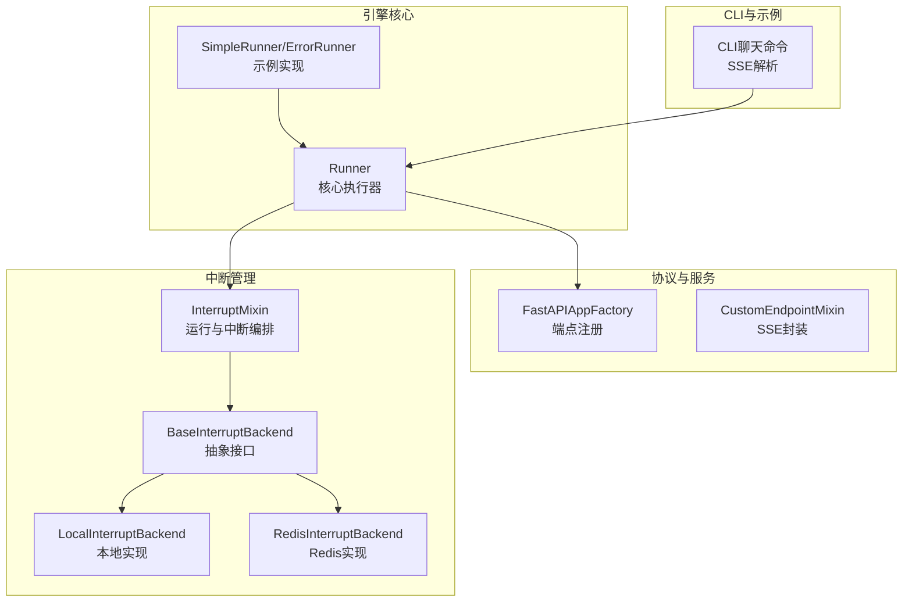
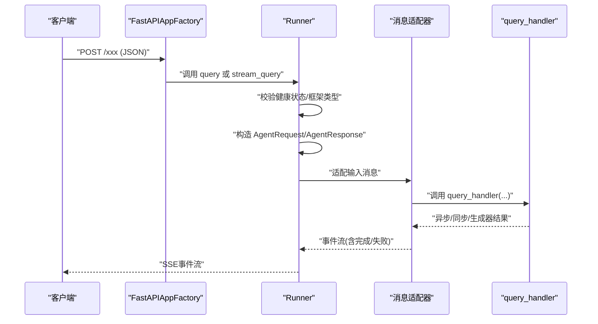
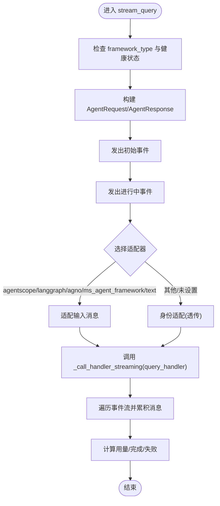
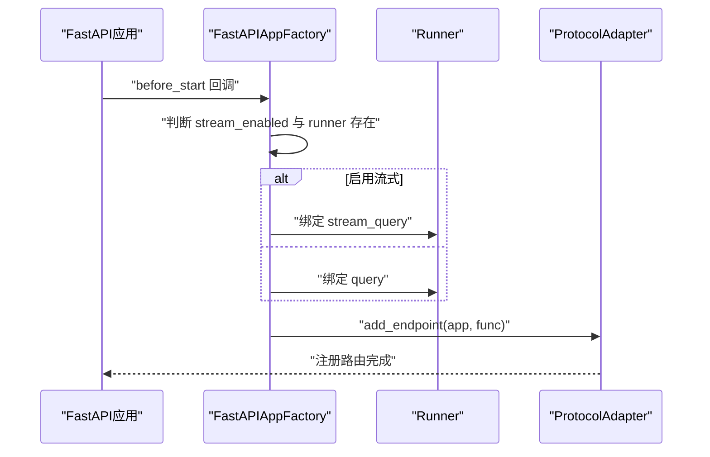
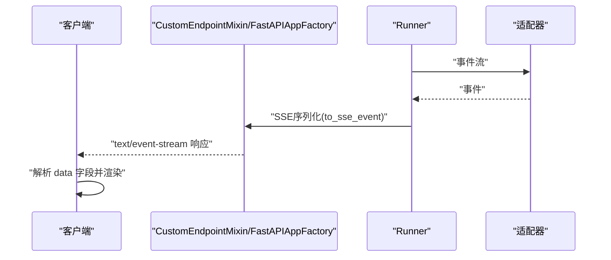
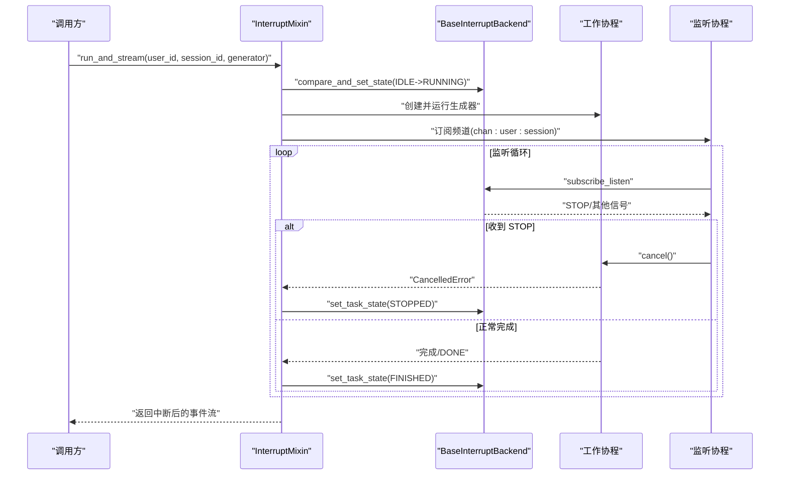
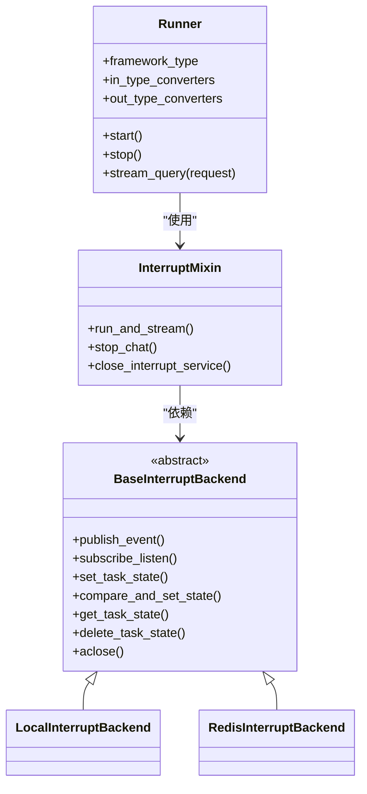
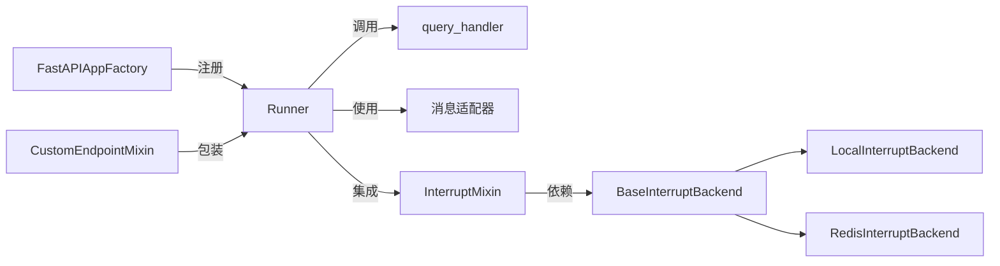

# Runner执行器

<cite>
**本文引用的文件**
- [runner.py](file://src/agentscope_runtime/engine/runner.py)
- [helpers/runner.py](file://src/agentscope_runtime/engine/helpers/runner.py)
- [fastapi_factory.py](file://src/agentscope_runtime/engine/deployers/utils/service_utils/fastapi_factory.py)
- [custom_endpoint_mixin.py](file://src/agentscope_runtime/engine/deployers/utils/service_utils/routing/custom_endpoint_mixin.py)
- [interrupt_mixin.py](file://src/agentscope_runtime/engine/deployers/utils/service_utils/interrupt/interrupt_mixin.py)
- [base_backend.py](file://src/agentscope_runtime/engine/deployers/utils/service_utils/interrupt/base_backend.py)
- [local_backend.py](file://src/agentscope_runtime/engine/deployers/utils/service_utils/interrupt/local_backend.py)
- [redis_backend.py](file://src/agentscope_runtime/engine/deployers/utils/service_utils/interrupt/redis_backend.py)
- [chat.py](file://src/agentscope_runtime/cli/commands/chat.py)
- [agent_app.md](file://cookbook/zh/agent_app.md)
</cite>

## 目录
1. [简介](#简介)
2. [项目结构](#项目结构)
3. [核心组件](#核心组件)
4. [架构总览](#架构总览)
5. [详细组件分析](#详细组件分析)
6. [依赖分析](#依赖分析)
7. [性能考虑](#性能考虑)
8. [故障排查指南](#故障排查指南)
9. [结论](#结论)
10. [附录](#附录)

## 简介
本文件面向开发者，系统性解析Runner执行器的内部架构与执行机制，重点覆盖以下主题：
- 查询处理器、初始化处理器与关闭处理器的绑定与生命周期管理
- 流式查询与非流式查询的执行流程，事件生成器与SSE格式化输出
- 中断处理机制：本地中断与Redis中断后端的选择与协作
- 与协议适配器的集成方式及多智能体框架类型的适配策略
- 错误处理策略、性能优化技巧与调试方法
- 使用示例与最佳实践

## 项目结构
Runner位于引擎模块中，围绕“请求-适配-处理器-响应”的流水线组织代码；同时通过FastAPI工厂与路由混入将Runner暴露为HTTP服务端点，并通过中断混入提供分布式任务中断能力。

**图表来源**
- [runner.py:46-356](file://src/agentscope_runtime/engine/runner.py#L46-L356)
- [helpers/runner.py:13-41](file://src/agentscope_runtime/engine/helpers/runner.py#L13-L41)
- [fastapi_factory.py:254-288](file://src/agentscope_runtime/engine/deployers/utils/service_utils/fastapi_factory.py#L254-L288)
- [custom_endpoint_mixin.py:145-174](file://src/agentscope_runtime/engine/deployers/utils/service_utils/routing/custom_endpoint_mixin.py#L145-L174)
- [interrupt_mixin.py:8-151](file://src/agentscope_runtime/engine/deployers/utils/service_utils/interrupt/interrupt_mixin.py#L8-L151)
- [base_backend.py:25-90](file://src/agentscope_runtime/engine/deployers/utils/service_utils/interrupt/base_backend.py#L25-L90)
- [local_backend.py:9-132](file://src/agentscope_runtime/engine/deployers/utils/service_utils/interrupt/local_backend.py#L9-L132)
- [redis_backend.py:7-107](file://src/agentscope_runtime/engine/deployers/utils/service_utils/interrupt/redis_backend.py#L7-L107)
- [chat.py:487-737](file://src/agentscope_runtime/cli/commands/chat.py#L487-L737)

**章节来源**
- [runner.py:46-356](file://src/agentscope_runtime/engine/runner.py#L46-L356)
- [fastapi_factory.py:254-288](file://src/agentscope_runtime/engine/deployers/utils/service_utils/fastapi_factory.py#L254-L288)

## 核心组件
- Runner：统一的执行器基类，负责启动/停止、查询与流式查询、事件序列化、错误包装与资源回收。
- SimpleRunner/ErrorRunner：示例实现，演示如何注入query_handler并返回流式片段。
- FastAPIAppFactory：在应用启动阶段根据Runner状态动态注册协议适配器端点，选择query或stream_query。
- InterruptMixin：提供分布式任务中断能力，协调状态机、监听通道与工作协程。
- 中断后端：BaseInterruptBackend抽象，LocalInterruptBackend与RedisInterruptBackend两种实现。

**章节来源**
- [runner.py:46-356](file://src/agentscope_runtime/engine/runner.py#L46-L356)
- [helpers/runner.py:13-41](file://src/agentscope_runtime/engine/helpers/runner.py#L13-L41)
- [fastapi_factory.py:254-288](file://src/agentscope_runtime/engine/deployers/utils/service_utils/fastapi_factory.py#L254-L288)
- [interrupt_mixin.py:8-151](file://src/agentscope_runtime/engine/deployers/utils/service_utils/interrupt/interrupt_mixin.py#L8-L151)
- [base_backend.py:25-90](file://src/agentscope_runtime/engine/deployers/utils/service_utils/interrupt/base_backend.py#L25-L90)

## 架构总览
Runner作为核心执行单元，贯穿以下关键路径：
- 生命周期：start/stop/init_handler/shutdown_handler
- 请求处理：query/stream_query + 适配器转换
- 事件序列：初始事件、进行中事件、最终完成/失败事件
- 协议适配：FastAPI端点按是否启用流式自动绑定query或stream_query
- 中断：通过InterruptMixin与后端协作，实现跨节点的优雅取消

**图表来源**
- [fastapi_factory.py:254-288](file://src/agentscope_runtime/engine/deployers/utils/service_utils/fastapi_factory.py#L254-L288)
- [runner.py:199-356](file://src/agentscope_runtime/engine/runner.py#L199-L356)

## 详细组件分析

### Runner执行器
- 生命周期管理：start调用init_handler（可选），stop调用shutdown_handler（可选），并确保退出栈资源释放。
- 查询入口：query_handler必须由子类实现；非流式query通过stream_query的适配层包装为单次事件。
- 事件序列：初始事件、in_progress事件、最终completed/failed事件，配合序列号生成器保证顺序一致性。
- 类型转换：支持输入/输出类型转换器，用于将通用消息转换为具体框架的消息格式。
- 错误处理：捕获所有异常并包装为统一错误对象，记录堆栈信息，最终以SSE错误事件返回。

**图表来源**
- [runner.py:199-356](file://src/agentscope_runtime/engine/runner.py#L199-L356)

**章节来源**
- [runner.py:60-121](file://src/agentscope_runtime/engine/runner.py#L60-L121)
- [runner.py:199-356](file://src/agentscope_runtime/engine/runner.py#L199-L356)

### 协议适配器与端点绑定
- 动态端点注册：在应用启动回调中，若存在Runner实例且已启用流式，则注册stream_query；否则注册query。
- 自定义端点：CustomEndpointMixin将任意生成器包装为SSE响应，自动捕获异常并输出错误事件。
- SSE序列化：FastAPIAppFactory提供to_sse_event工具，确保任意数据结构可被序列化为SSE可用的JSON。

**图表来源**
- [fastapi_factory.py:254-288](file://src/agentscope_runtime/engine/deployers/utils/service_utils/fastapi_factory.py#L254-L288)
- [custom_endpoint_mixin.py:145-174](file://src/agentscope_runtime/engine/deployers/utils/service_utils/routing/custom_endpoint_mixin.py#L145-L174)

**章节来源**
- [fastapi_factory.py:254-288](file://src/agentscope_runtime/engine/deployers/utils/service_utils/fastapi_factory.py#L254-L288)
- [custom_endpoint_mixin.py:145-174](file://src/agentscope_runtime/engine/deployers/utils/service_utils/routing/custom_endpoint_mixin.py#L145-L174)

### 流式查询与SSE输出
- 事件生成器：Runner在stream_query中逐段产出事件，适配器负责将底层query_handler的输出转换为标准事件。
- SSE格式化：CustomEndpointMixin与FastAPIAppFactory将每个事件序列化为SSE行，异常时输出包含错误类型与消息的事件。
- 客户端解析：CLI命令行工具演示了如何解析SSE事件，区分data字段并处理不同对象类型。

**图表来源**
- [custom_endpoint_mixin.py:145-174](file://src/agentscope_runtime/engine/deployers/utils/service_utils/routing/custom_endpoint_mixin.py#L145-L174)
- [fastapi_factory.py:696-801](file://src/agentscope_runtime/engine/deployers/utils/service_utils/fastapi_factory.py#L696-L801)
- [chat.py:717-737](file://src/agentscope_runtime/cli/commands/chat.py#L717-L737)

**章节来源**
- [custom_endpoint_mixin.py:145-174](file://src/agentscope_runtime/engine/deployers/utils/service_utils/routing/custom_endpoint_mixin.py#L145-L174)
- [fastapi_factory.py:696-801](file://src/agentscope_runtime/engine/deployers/utils/service_utils/fastapi_factory.py#L696-L801)
- [chat.py:717-737](file://src/agentscope_runtime/cli/commands/chat.py#L717-L737)

### 中断处理机制
- 任务状态机：IDLE/RUNNING/STOPPED/FINISHED/ERROR，通过compare_and_set_state保证原子更新。
- 分布式中断：InterruptMixin在run_and_stream中创建工作协程与监听协程，接收STOP信号后取消任务。
- 后端选择：优先Redis后端（分布式）；本地后端仅限单进程，内存队列广播。
- 优雅取消：捕获CancelledError，更新最终状态为STOPPED，清理资源并释放锁。

**图表来源**
- [interrupt_mixin.py:38-139](file://src/agentscope_runtime/engine/deployers/utils/service_utils/interrupt/interrupt_mixin.py#L38-L139)
- [base_backend.py:25-90](file://src/agentscope_runtime/engine/deployers/utils/service_utils/interrupt/base_backend.py#L25-L90)
- [local_backend.py:61-90](file://src/agentscope_runtime/engine/deployers/utils/service_utils/interrupt/local_backend.py#L61-L90)
- [redis_backend.py:44-90](file://src/agentscope_runtime/engine/deployers/utils/service_utils/interrupt/redis_backend.py#L44-L90)

**章节来源**
- [interrupt_mixin.py:8-151](file://src/agentscope_runtime/engine/deployers/utils/service_utils/interrupt/interrupt_mixin.py#L8-L151)
- [base_backend.py:25-90](file://src/agentscope_runtime/engine/deployers/utils/service_utils/interrupt/base_backend.py#L25-L90)
- [local_backend.py:9-132](file://src/agentscope_runtime/engine/deployers/utils/service_utils/interrupt/local_backend.py#L9-L132)
- [redis_backend.py:7-107](file://src/agentscope_runtime/engine/deployers/utils/service_utils/interrupt/redis_backend.py#L7-L107)
- [agent_app.md:642-670](file://cookbook/zh/agent_app.md#L642-L670)

### 与协议适配器的交互与多框架支持
- 框架类型：Runner支持text、agentscope、langgraph、agno、ms_agent_framework等，每种框架对应特定的输入消息转换与事件流适配器。
- 输入转换：根据in_type_converters将通用输入转换为具体框架的消息结构。
- 输出转换：通过out_type_converters对事件进行类型转换，便于下游消费。
- 兼容性：未识别框架时采用身份适配器，保证基本可用性。

**图表来源**
- [runner.py:46-356](file://src/agentscope_runtime/engine/runner.py#L46-L356)
- [interrupt_mixin.py:8-151](file://src/agentscope_runtime/engine/deployers/utils/service_utils/interrupt/interrupt_mixin.py#L8-L151)
- [base_backend.py:25-90](file://src/agentscope_runtime/engine/deployers/utils/service_utils/interrupt/base_backend.py#L25-L90)
- [local_backend.py:9-132](file://src/agentscope_runtime/engine/deployers/utils/service_utils/interrupt/local_backend.py#L9-L132)
- [redis_backend.py:7-107](file://src/agentscope_runtime/engine/deployers/utils/service_utils/interrupt/redis_backend.py#L7-L107)

**章节来源**
- [runner.py:246-320](file://src/agentscope_runtime/engine/runner.py#L246-L320)

## 依赖分析
- Runner依赖于协议适配器与消息转换器，以支持多框架类型。
- FastAPI工厂在应用启动时动态绑定端点，避免硬编码。
- 中断混入通过抽象后端解耦本地与Redis实现，便于在不同部署环境中切换。

**图表来源**
- [runner.py:199-356](file://src/agentscope_runtime/engine/runner.py#L199-L356)
- [fastapi_factory.py:254-288](file://src/agentscope_runtime/engine/deployers/utils/service_utils/fastapi_factory.py#L254-L288)
- [interrupt_mixin.py:8-151](file://src/agentscope_runtime/engine/deployers/utils/service_utils/interrupt/interrupt_mixin.py#L8-L151)
- [base_backend.py:25-90](file://src/agentscope_runtime/engine/deployers/utils/service_utils/interrupt/base_backend.py#L25-L90)

**章节来源**
- [runner.py:199-356](file://src/agentscope_runtime/engine/runner.py#L199-L356)
- [fastapi_factory.py:254-288](file://src/agentscope_runtime/engine/deployers/utils/service_utils/fastapi_factory.py#L254-L288)
- [interrupt_mixin.py:8-151](file://src/agentscope_runtime/engine/deployers/utils/service_utils/interrupt/interrupt_mixin.py#L8-L151)

## 性能考虑
- 流式聚合策略：后台任务仅保留最终事件，减少中间事件占用内存（参考任务执行相关实现）。
- 序列化开销：SSE序列化采用深度限制与基础类型判定，避免过深嵌套导致的序列化成本。
- 中断原子性：Redis后端使用Lua脚本实现CAS，保证状态变更的原子性与一致性。
- 资源回收：Runner在stop中确保退出栈与部署管理器资源释放，避免泄漏。

[本节为通用性能建议，不直接分析具体文件]

## 故障排查指南
- 启动/停止异常：检查init_handler/shutdown_handler是否为可调用对象；查看日志警告与异常堆栈。
- 流式输出异常：确认适配器是否正确包装事件；检查SSE序列化工具是否能处理复杂数据结构。
- 中断无效：核对task状态机是否从IDLE成功转为RUNNING；检查Redis连接与频道订阅是否正常。
- CLI解析问题：确认SSE响应头与data字段格式；参考CLI中的SSE解析逻辑。

**章节来源**
- [runner.py:88-103](file://src/agentscope_runtime/engine/runner.py#L88-L103)
- [fastapi_factory.py:696-801](file://src/agentscope_runtime/engine/deployers/utils/service_utils/fastapi_factory.py#L696-L801)
- [interrupt_mixin.py:140-151](file://src/agentscope_runtime/engine/deployers/utils/service_utils/interrupt/interrupt_mixin.py#L140-L151)
- [chat.py:717-737](file://src/agentscope_runtime/cli/commands/chat.py#L717-L737)

## 结论
Runner执行器通过清晰的生命周期管理、灵活的协议适配与强大的中断机制，为多智能体框架提供了统一的执行与服务化能力。结合SSE流式输出与CLI解析示例，开发者可以快速构建可观察、可观测、可中断的Agent服务。

[本节为总结性内容，不直接分析具体文件]

## 附录

### 使用示例与最佳实践
- 快速开始：继承Runner并实现query_handler，设置framework_type，使用async with Runner()管理生命周期。
- 流式查询：在适配器中将底层生成器转换为标准事件，确保最终事件包含完整消息与用量统计。
- 中断集成：在部署侧配置Redis或本地后端，使用InterruptMixin.run_and_stream包装长耗时任务。
- 协议适配：根据目标框架选择对应适配器，必要时提供输入/输出类型转换器以兼容数据结构。

**章节来源**
- [helpers/runner.py:13-41](file://src/agentscope_runtime/engine/helpers/runner.py#L13-L41)
- [runner.py:199-356](file://src/agentscope_runtime/engine/runner.py#L199-L356)
- [fastapi_factory.py:254-288](file://src/agentscope_runtime/engine/deployers/utils/service_utils/fastapi_factory.py#L254-L288)
- [interrupt_mixin.py:38-139](file://src/agentscope_runtime/engine/deployers/utils/service_utils/interrupt/interrupt_mixin.py#L38-L139)
- [agent_app.md:642-670](file://cookbook/zh/agent_app.md#L642-L670)