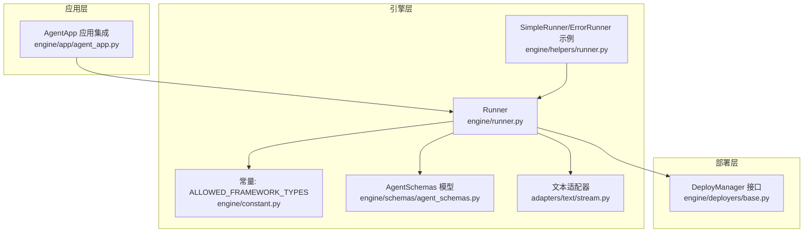
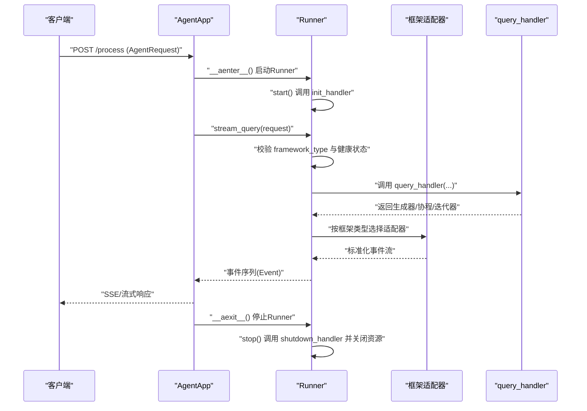
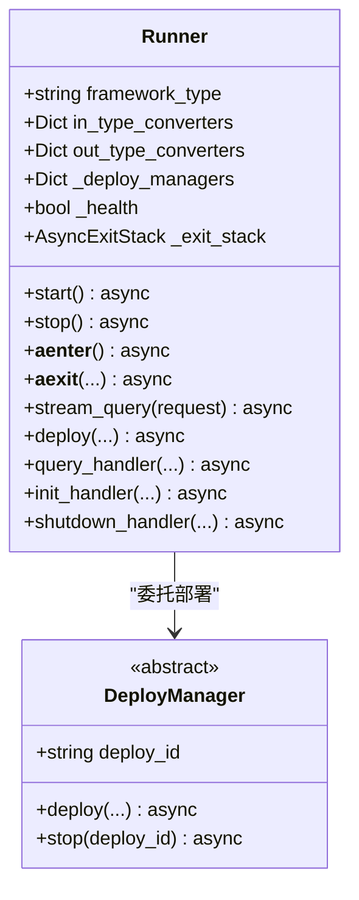
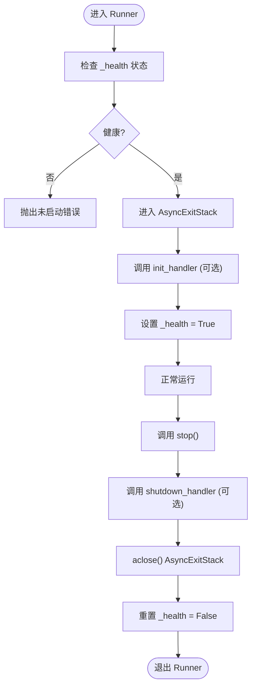
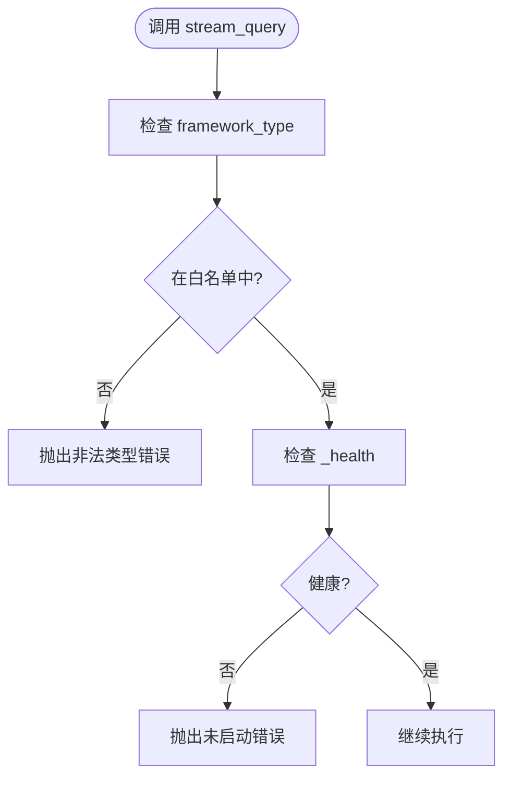
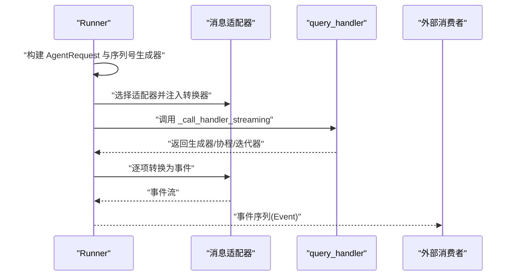
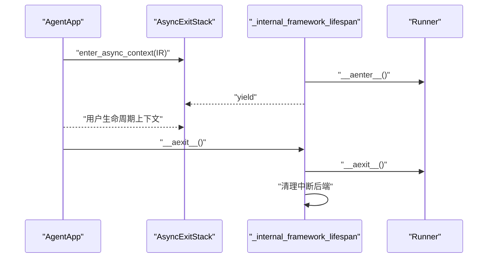
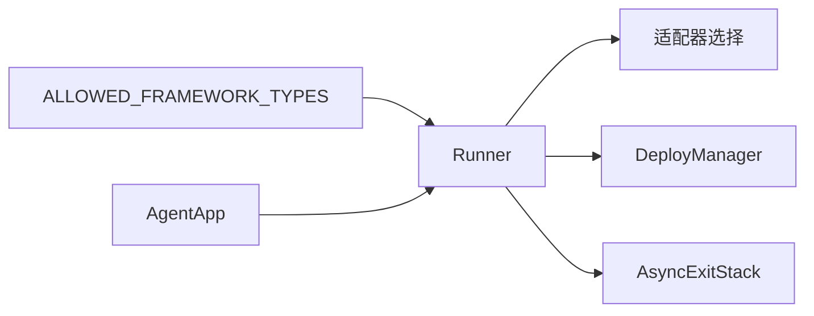

# Runner核心架构

<cite>
**本文引用的文件**
- [engine/runner.py](file://src/agentscope_runtime/engine/runner.py)
- [engine/constant.py](file://src/agentscope_runtime/engine/constant.py)
- [engine/helpers/runner.py](file://src/agentscope_runtime/engine/helpers/runner.py)
- [engine/app/agent_app.py](file://src/agentscope_runtime/engine/app/agent_app.py)
- [engine/deployers/base.py](file://src/agentscope_runtime/engine/deployers/base.py)
- [engine/schemas/agent_schemas.py](file://src/agentscope_runtime/engine/schemas/agent_schemas.py)
- [adapters/text/stream.py](file://src/agentscope_runtime/adapters/text/stream.py)
- [tests/unit/test_runner_stream.py](file://tests/unit/test_runner_stream.py)
- [tests/integrated/test_runner_stream_agentscope.py](file://tests/integrated/test_runner_stream_agentscope.py)
</cite>

## 目录
1. [引言](#引言)
2. [项目结构](#项目结构)
3. [核心组件](#核心组件)
4. [架构总览](#架构总览)
5. [详细组件分析](#详细组件分析)
6. [依赖分析](#依赖分析)
7. [性能考虑](#性能考虑)
8. [故障排查指南](#故障排查指南)
9. [结论](#结论)
10. [附录](#附录)

## 引言
本文件系统性梳理Runner核心架构，重点阐释其作为智能体执行核心的设计理念、生命周期管理（start/stop）、异步上下文管理与AsyncExitStack资源管理策略、框架类型检测机制及ALLOWED_FRAMEWORK_TYPES限制，并提供初始化与基本使用模式的代码示例路径，帮助读者快速理解并正确使用Runner。

## 项目结构
Runner位于引擎层的核心位置，负责统一调度不同框架类型的智能体执行流，向上承接AgentApp应用生命周期，向下对接协议适配器与部署管理器。关键模块关系如下：

图表来源
- [engine/runner.py:46-356](file://src/agentscope_runtime/engine/runner.py#L46-L356)
- [engine/constant.py:1-10](file://src/agentscope_runtime/engine/constant.py#L1-L10)
- [engine/helpers/runner.py:13-41](file://src/agentscope_runtime/engine/helpers/runner.py#L13-L41)
- [engine/app/agent_app.py:60-200](file://src/agentscope_runtime/engine/app/agent_app.py#L60-L200)
- [engine/deployers/base.py:9-44](file://src/agentscope_runtime/engine/deployers/base.py#L9-L44)
- [adapters/text/stream.py:12-31](file://src/agentscope_runtime/adapters/text/stream.py#L12-L31)

章节来源
- [engine/runner.py:46-356](file://src/agentscope_runtime/engine/runner.py#L46-L356)
- [engine/constant.py:1-10](file://src/agentscope_runtime/engine/constant.py#L1-L10)
- [engine/helpers/runner.py:13-41](file://src/agentscope_runtime/engine/helpers/runner.py#L13-L41)
- [engine/app/agent_app.py:60-200](file://src/agentscope_runtime/engine/app/agent_app.py#L60-L200)
- [engine/deployers/base.py:9-44](file://src/agentscope_runtime/engine/deployers/base.py#L9-L44)
- [adapters/text/stream.py:12-31](file://src/agentscope_runtime/adapters/text/stream.py#L12-L31)

## 核心组件
- Runner：智能体执行核心，负责生命周期管理、请求流式处理、框架类型校验、资源清理与部署集成。
- SimpleRunner/ErrorRunner：示例Runner子类，演示最小化实现与错误处理。
- AgentApp：FastAPI应用集成Runner，通过内部生命周期管理Runner与用户自定义逻辑。
- DeployManager：部署管理接口，Runner可委托其进行服务部署与停止。
- ALLOWED_FRAMEWORK_TYPES：框架类型白名单，Runner在执行前进行严格校验。
- AgentSchemas：事件、消息、状态等模型定义，支撑Runner的事件序列化与状态流转。
- 文本适配器：将同步/异步生成器输出转换为标准消息流。

章节来源
- [engine/runner.py:46-356](file://src/agentscope_runtime/engine/runner.py#L46-L356)
- [engine/helpers/runner.py:13-41](file://src/agentscope_runtime/engine/helpers/runner.py#L13-L41)
- [engine/app/agent_app.py:60-200](file://src/agentscope_runtime/engine/app/agent_app.py#L60-L200)
- [engine/deployers/base.py:9-44](file://src/agentscope_runtime/engine/deployers/base.py#L9-L44)
- [engine/constant.py:1-10](file://src/agentscope_runtime/engine/constant.py#L1-L10)
- [engine/schemas/agent_schemas.py:64-78](file://src/agentscope_runtime/engine/schemas/agent_schemas.py#L64-L78)
- [adapters/text/stream.py:12-31](file://src/agentscope_runtime/adapters/text/stream.py#L12-L31)

## 架构总览
Runner采用“适配器+协议适配”的解耦设计，根据framework_type选择对应的消息流适配器，将query_handler的任意返回形式统一流式输出。AgentApp通过AsyncExitStack与内部生命周期管理Runner，确保启动/停止与中断后端的一致性。

图表来源
- [engine/app/agent_app.py:248-337](file://src/agentscope_runtime/engine/app/agent_app.py#L248-L337)
- [engine/runner.py:76-121](file://src/agentscope_runtime/engine/runner.py#L76-L121)
- [engine/runner.py:199-356](file://src/agentscope_runtime/engine/runner.py#L199-L356)
- [adapters/text/stream.py:12-31](file://src/agentscope_runtime/adapters/text/stream.py#L12-L31)

## 详细组件分析

### Runner类设计与职责
- 设计理念
  - 作为智能体执行核心，统一抽象不同框架的消息流，屏蔽底层差异。
  - 通过框架类型检测与白名单限制，保证运行时一致性与安全性。
  - 提供异步上下文管理与资源栈（AsyncExitStack），确保异常场景下的资源回收。
- 关键属性
  - framework_type：框架类型标识，决定消息适配器与输入/输出转换器。
  - in_type_converters/out_type_converters：输入/输出类型转换器字典，用于消息序列化/反序列化。
  - _deploy_managers：已部署实例映射，支持多实例管理与停止。
  - _health：健康状态标志，用于stream_query前置检查。
  - _exit_stack：异步资源栈，用于start/stop阶段的资源注册与关闭。
- 生命周期管理
  - start()：可选调用init_handler，设置_health为True；不抛出异常。
  - stop()：可选调用shutdown_handler，捕获并记录异常；通过_async_exit_stack.aclose()关闭所有已注册资源；重置_health。
  - __aenter__/__aexit__：封装start/stop，便于with语义使用。
- 流式查询
  - stream_query()：校验framework_type是否在ALLOWED_FRAMEWORK_TYPES内；校验_health；构造AgentRequest与序列号生成器；根据framework_type选择适配器；将query_handler结果统一流式输出；异常时包装为Error并结束。
- 部署能力
  - deploy()：委托DeployManager执行部署，记录deploy_id并返回部署结果URL；Runner停止时会遍历停止各DeployManager实例（如存在）。

图表来源
- [engine/runner.py:46-171](file://src/agentscope_runtime/engine/runner.py#L46-L171)
- [engine/deployers/base.py:9-44](file://src/agentscope_runtime/engine/deployers/base.py#L9-L44)

章节来源
- [engine/runner.py:46-171](file://src/agentscope_runtime/engine/runner.py#L46-L171)
- [engine/deployers/base.py:9-44](file://src/agentscope_runtime/engine/deployers/base.py#L9-L44)

### 生命周期管理与异步上下文
- 启动流程
  - 通过__aenter__或显式start()进入健康态；init_handler可选实现，支持同步/异步。
- 停止流程
  - 通过__aexit__或显式stop()退出；shutdown_handler可选实现；通过AsyncExitStack统一关闭资源；遍历并停止已注册的DeployManager实例。
- 资源管理策略
  - 使用AsyncExitStack注册资源，确保即使发生异常也能完整释放；stop()中对异常进行日志告警但不中断关闭流程。

图表来源
- [engine/runner.py:76-121](file://src/agentscope_runtime/engine/runner.py#L76-L121)

章节来源
- [engine/runner.py:76-121](file://src/agentscope_runtime/engine/runner.py#L76-L121)

### 框架类型检测与ALLOWED_FRAMEWORK_TYPES
- 检测机制
  - stream_query在开始阶段检查self.framework_type是否在ALLOWED_FRAMEWORK_TYPES中；若不在则抛出运行时错误，提示合法值列表。
- 允许类型
  - 当前白名单包含："text"、"agentscope"、"autogen"、"langgraph"、"agno"、"ms_agent_framework"。
- 使用建议
  - 在子类中显式设置framework_type，确保与实际消息适配器一致；避免使用未声明的类型导致执行失败。

图表来源
- [engine/runner.py:207-219](file://src/agentscope_runtime/engine/runner.py#L207-L219)
- [engine/constant.py:2-9](file://src/agentscope_runtime/engine/constant.py#L2-L9)

章节来源
- [engine/runner.py:207-219](file://src/agentscope_runtime/engine/runner.py#L207-L219)
- [engine/constant.py:2-9](file://src/agentscope_runtime/engine/constant.py#L2-L9)

### 流式查询与适配器链路
- 输入处理
  - 支持传入AgentRequest对象或字典，自动封装为AgentRequest；为缺失的session_id/user_id自动补全。
- 适配器选择
  - 根据framework_type动态导入并绑定对应适配器；text框架使用文本适配器；agentscope/langgraph/agno/ms_agent_framework分别使用对应适配器；未匹配时使用身份适配器透传。
- 输出处理
  - 统一通过SequenceNumberGenerator生成有序事件；聚合消息内容并计算token用量；异常时包装为Error并标记失败；最终发送Completed事件。

图表来源
- [engine/runner.py:199-356](file://src/agentscope_runtime/engine/runner.py#L199-L356)
- [adapters/text/stream.py:12-31](file://src/agentscope_runtime/adapters/text/stream.py#L12-L31)

章节来源
- [engine/runner.py:199-356](file://src/agentscope_runtime/engine/runner.py#L199-L356)
- [adapters/text/stream.py:12-31](file://src/agentscope_runtime/adapters/text/stream.py#L12-L31)

### AgentApp中的Runner集成
- 内部生命周期
  - AgentApp通过_asynccontextmanager管理内部Runner与钩子函数；在每次构建Runner前尝试先退出旧实例，确保幂等。
- 用户生命周期
  - 通过AsyncExitStack组合用户提供的生命周期上下文，实现应用启动/停止与Runner生命周期的协同。
- 关闭流程
  - 应用关闭时，优先调用用户after_finish回调，再清理内部Runner与中断后端。

图表来源
- [engine/app/agent_app.py:248-337](file://src/agentscope_runtime/engine/app/agent_app.py#L248-L337)

章节来源
- [engine/app/agent_app.py:248-337](file://src/agentscope_runtime/engine/app/agent_app.py#L248-L337)

### 示例与基本使用模式
- 最简Runner（文本）
  - 参考SimpleRunner，设置framework_type为"text"，实现query_handler并返回字符串片段，即可通过stream_query获得SSE风格的增量输出。
  - 示例路径：[engine/helpers/runner.py:13-27](file://src/agentscope_runtime/engine/helpers/runner.py#L13-L27)
- 错误处理示例
  - ErrorRunner在query_handler中抛出异常，Runner捕获并包装为Error事件，最终以Failed状态结束。
  - 示例路径：[engine/helpers/runner.py:29-41](file://src/agentscope_runtime/engine/helpers/runner.py#L29-L41)
- 完整集成示例（Agentscope）
  - 自定义Runner继承Runner，设置framework_type为"agentscope"，在init_handler中初始化会话与沙箱服务，在query_handler中组织Agent并流式输出消息，最后在shutdown_handler中停止沙箱服务。
  - 示例路径：[tests/integrated/test_runner_stream_agentscope.py:25-114](file://tests/integrated/test_runner_stream_agentscope.py#L25-L114)
- 单元测试用法
  - 使用pytest异步测试，通过async with Runner()获取Runner实例，调用stream_query收集事件，断言最终消息内容或状态。
  - 示例路径：[tests/unit/test_runner_stream.py:30-78](file://tests/unit/test_runner_stream.py#L30-L78)

章节来源
- [engine/helpers/runner.py:13-41](file://src/agentscope_runtime/engine/helpers/runner.py#L13-L41)
- [tests/integrated/test_runner_stream_agentscope.py:25-114](file://tests/integrated/test_runner_stream_agentscope.py#L25-L114)
- [tests/unit/test_runner_stream.py:30-78](file://tests/unit/test_runner_stream.py#L30-L78)

## 依赖分析
- Runner与框架类型
  - 通过ALLOWED_FRAMEWORK_TYPES约束，避免未知类型导致的执行失败。
- Runner与适配器
  - 根据framework_type动态导入适配器，形成“适配器-处理器”链路，解耦不同框架的消息格式。
- Runner与部署管理
  - deploy()委托DeployManager执行部署，Runner负责生命周期内的资源管理与停止。
- Runner与AgentApp
  - AgentApp通过AsyncExitStack协调Runner与用户生命周期，确保资源释放顺序正确。

图表来源
- [engine/runner.py:207-219](file://src/agentscope_runtime/engine/runner.py#L207-L219)
- [engine/constant.py:2-9](file://src/agentscope_runtime/engine/constant.py#L2-L9)
- [engine/deployers/base.py:24-43](file://src/agentscope_runtime/engine/deployers/base.py#L24-L43)
- [engine/app/agent_app.py:322-337](file://src/agentscope_runtime/engine/app/agent_app.py#L322-L337)

章节来源
- [engine/runner.py:207-219](file://src/agentscope_runtime/engine/runner.py#L207-L219)
- [engine/constant.py:2-9](file://src/agentscope_runtime/engine/constant.py#L2-L9)
- [engine/deployers/base.py:24-43](file://src/agentscope_runtime/engine/deployers/base.py#L24-L43)
- [engine/app/agent_app.py:322-337](file://src/agentscope_runtime/engine/app/agent_app.py#L322-L337)

## 性能考虑
- 事件序列化与聚合
  - 使用SequenceNumberGenerator保证事件有序，减少前端解析复杂度；仅在完成时聚合消息，避免频繁序列化开销。
- 适配器选择
  - 动态导入适配器发生在首次stream_query，后续复用已导入模块；建议在应用启动阶段预热常用适配器。
- 资源回收
  - AsyncExitStack在异常场景仍能完整关闭资源，避免泄漏；建议在shutdown_handler中尽量缩短阻塞操作，提升停机速度。
- 部署与并发
  - deploy()返回部署结果URL，Runner自身不直接处理高并发；建议结合外部负载均衡与限流策略。

## 故障排查指南
- 运行时错误
  - 非法框架类型：检查framework_type是否在ALLOWED_FRAMEWORK_TYPES中；参考路径：[engine/runner.py:207-212](file://src/agentscope_runtime/engine/runner.py#L207-L212)、[engine/constant.py:2-9](file://src/agentscope_runtime/engine/constant.py#L2-L9)
  - 未启动：在调用stream_query前确保已start或使用async with Runner()；参考路径：[engine/runner.py:214-219](file://src/agentscope_runtime/engine/runner.py#L214-L219)
  - 异常处理：非AppBaseException会被包装为UnknownAgentException并记录堆栈；参考路径：[engine/runner.py:338-342](file://src/agentscope_runtime/engine/runner.py#L338-L342)
- 生命周期问题
  - 资源未释放：确认stop()被调用且未吞掉异常；参考路径：[engine/runner.py:88-103](file://src/agentscope_runtime/engine/runner.py#L88-L103)
  - 多实例冲突：AgentApp内部会先退出旧Runner再进入新Runner，避免重复实例；参考路径：[engine/app/agent_app.py:259](file://src/agentscope_runtime/engine/app/agent_app.py#L259)

章节来源
- [engine/runner.py:207-219](file://src/agentscope_runtime/engine/runner.py#L207-L219)
- [engine/runner.py:338-342](file://src/agentscope_runtime/engine/runner.py#L338-L342)
- [engine/runner.py:88-103](file://src/agentscope_runtime/engine/runner.py#L88-L103)
- [engine/app/agent_app.py:259](file://src/agentscope_runtime/engine/app/agent_app.py#L259)

## 结论
Runner以清晰的生命周期管理、严格的框架类型校验与灵活的适配器机制，构建了跨框架的智能体执行核心。配合AgentApp的AsyncExitStack与内部生命周期管理，实现了从启动到停止的可靠闭环。通过DeployManager接口，Runner进一步扩展到多平台部署场景。遵循本文的使用模式与最佳实践，可在保证稳定性的同时最大化开发效率。

## 附录
- 常用代码示例路径
  - 最简Runner（文本）：[engine/helpers/runner.py:13-27](file://src/agentscope_runtime/engine/helpers/runner.py#L13-L27)
  - 错误处理示例：[engine/helpers/runner.py:29-41](file://src/agentscope_runtime/engine/helpers/runner.py#L29-L41)
  - Agentscope集成示例：[tests/integrated/test_runner_stream_agentscope.py:25-114](file://tests/integrated/test_runner_stream_agentscope.py#L25-L114)
  - 单元测试用法：[tests/unit/test_runner_stream.py:30-78](file://tests/unit/test_runner_stream.py#L30-L78)