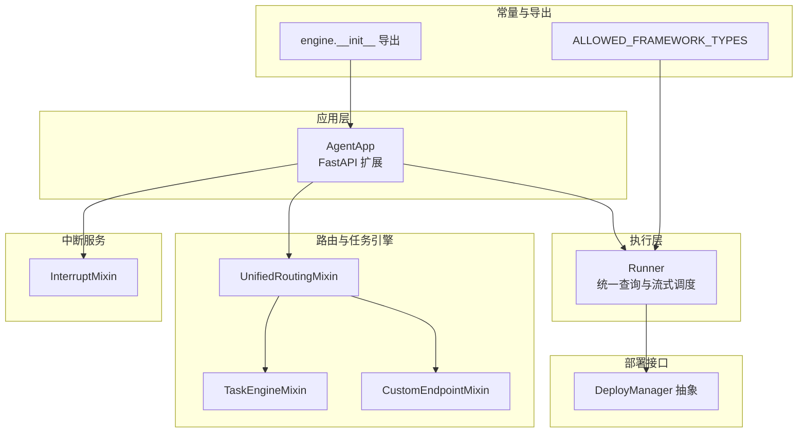
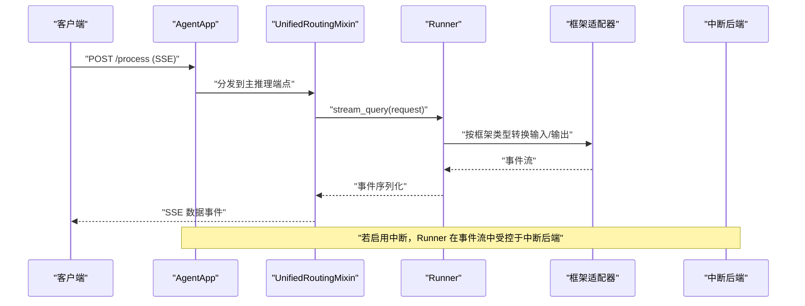
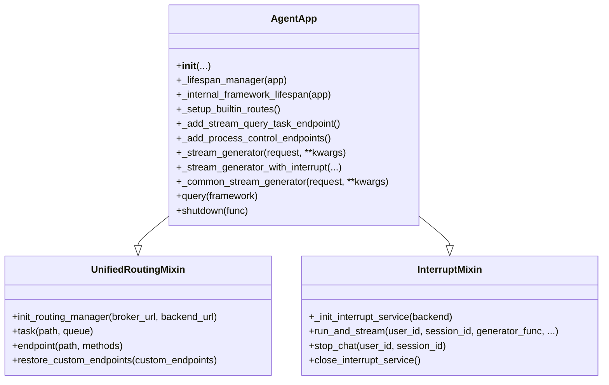
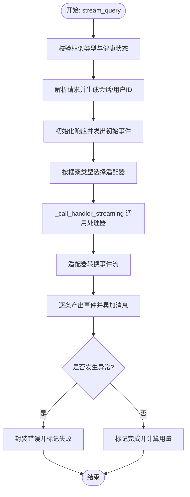
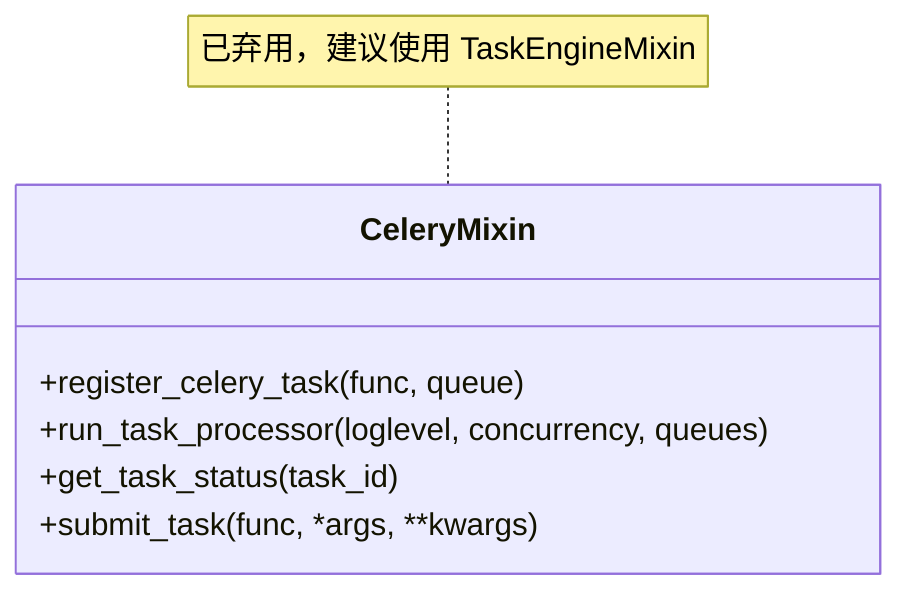
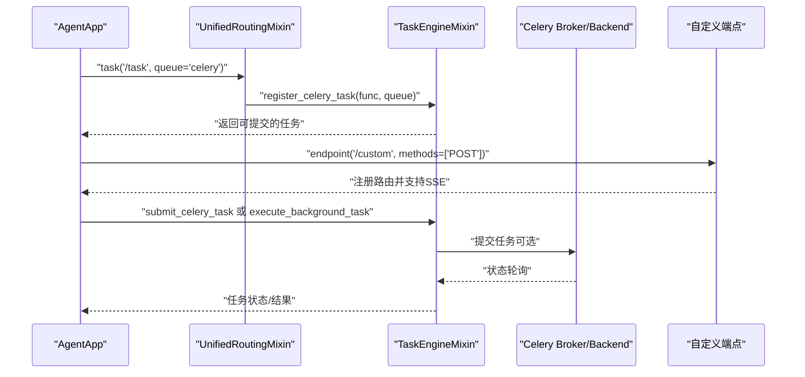
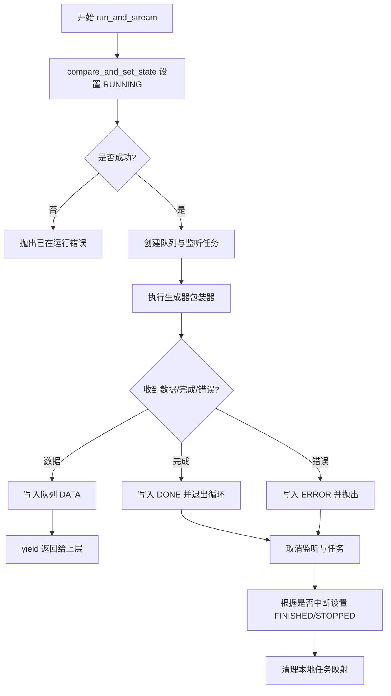
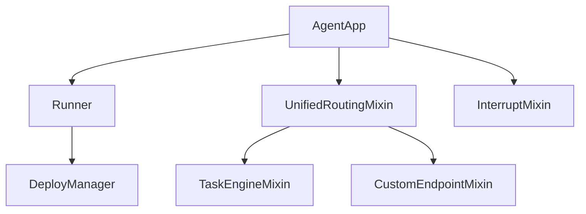

# 核心组件

<cite>
**本文引用的文件**
- [agent_app.py](file://src/agentscope_runtime/engine/app/agent_app.py)
- [celery_mixin.py](file://src/agentscope_runtime/engine/app/celery_mixin.py)
- [runner.py](file://src/agentscope_runtime/engine/helpers/runner.py)
- [runner.py](file://src/agentscope_runtime/engine/runner.py)
- [interrupt_mixin.py](file://src/agentscope_runtime/engine/deployers/utils/service_utils/interrupt/interrupt_mixin.py)
- [unified_routing_mixin.py](file://src/agentscope_runtime/engine/deployers/utils/service_utils/routing/unified_routing_mixin.py)
- [task_engine_mixin.py](file://src/agentscope_runtime/engine/deployers/utils/service_utils/routing/task_engine_mixin.py)
- [custom_endpoint_mixin.py](file://src/agentscope_runtime/engine/deployers/utils/service_utils/routing/custom_endpoint_mixin.py)
- [base.py](file://src/agentscope_runtime/engine/deployers/base.py)
- [constant.py](file://src/agentscope_runtime/engine/constant.py)
- [__init__.py（engine）](file://src/agentscope_runtime/engine/__init__.py)
- [__init__.py（app）](file://src/agentscope_runtime/engine/app/__init__.py)
- [run_langgraph_agent.py](file://examples/integrations/langgraph/run_langgraph_agent.py)
- [test_agent_app.py](file://tests/integrated/test_agent_app.py)
</cite>

## 目录
1. [简介](#简介)
2. [项目结构](#项目结构)
3. [核心组件](#核心组件)
4. [架构总览](#架构总览)
5. [详细组件分析](#详细组件分析)
6. [依赖分析](#依赖分析)
7. [性能考虑](#性能考虑)
8. [故障排查指南](#故障排查指南)
9. [结论](#结论)
10. [附录](#附录)

## 简介
本文件聚焦于 AgentScope Runtime 的核心组件：AgentApp 应用框架、Runner 执行器与 CeleryMixin 异步任务处理能力。文档系统性阐述以下内容：
- AgentApp 的设计原理、生命周期管理与配置机制
- Runner 的架构设计、执行流程与中断处理机制
- CeleryMixin 的异步任务处理与分布式执行模式
- 组件间交互关系、数据流与错误处理策略
- 提供可操作的使用模式与最佳实践参考路径

## 项目结构
围绕核心组件，相关模块分布如下：
- 应用层：AgentApp（FastAPI 扩展，集成路由、中断、协议适配）
- 执行层：Runner（统一的查询与流式输出调度器）
- 路由与任务引擎：UnifiedRoutingMixin、TaskEngineMixin、CustomEndpointMixin
- 中断服务：InterruptMixin（支持本地/Redis 分布式中断）
- 部署接口：DeployManager 抽象基类
- 常量与导出：允许的框架类型、包导出

图表来源
- [agent_app.py](file://src/agentscope_runtime/engine/app/agent_app.py)
- [runner.py](file://src/agentscope_runtime/engine/runner.py)
- [unified_routing_mixin.py](file://src/agentscope_runtime/engine/deployers/utils/service_utils/routing/unified_routing_mixin.py)
- [task_engine_mixin.py](file://src/agentscope_runtime/engine/deployers/utils/service_utils/routing/task_engine_mixin.py)
- [custom_endpoint_mixin.py](file://src/agentscope_runtime/engine/deployers/utils/service_utils/routing/custom_endpoint_mixin.py)
- [interrupt_mixin.py](file://src/agentscope_runtime/engine/deployers/utils/service_utils/interrupt/interrupt_mixin.py)
- [base.py](file://src/agentscope_runtime/engine/deployers/base.py)
- [constant.py](file://src/agentscope_runtime/engine/constant.py)
- [__init__.py（engine）](file://src/agentscope_runtime/engine/__init__.py)

章节来源
- [agent_app.py](file://src/agentscope_runtime/engine/app/agent_app.py)
- [runner.py](file://src/agentscope_runtime/engine/runner.py)
- [unified_routing_mixin.py](file://src/agentscope_runtime/engine/deployers/utils/service_utils/routing/unified_routing_mixin.py)
- [task_engine_mixin.py](file://src/agentscope_runtime/engine/deployers/utils/service_utils/routing/task_engine_mixin.py)
- [custom_endpoint_mixin.py](file://src/agentscope_runtime/engine/deployers/utils/service_utils/routing/custom_endpoint_mixin.py)
- [interrupt_mixin.py](file://src/agentscope_runtime/engine/deployers/utils/service_utils/interrupt/interrupt_mixin.py)
- [base.py](file://src/agentscope_runtime/engine/deployers/base.py)
- [constant.py](file://src/agentscope_runtime/engine/constant.py)
- [__init__.py（engine）](file://src/agentscope_runtime/engine/__init__.py)

## 核心组件
- AgentApp：基于 FastAPI 的应用容器，集成统一路由、中断服务、协议适配器与内置健康检查端点；通过生命周期钩子与 Runner 协作，支持流式与非流式推理。
- Runner：统一的查询执行器，负责根据框架类型选择适配器、生成会话与序列号、封装事件、追踪与错误包装，并提供部署接口。
- CeleryMixin：提供 Celery 任务注册、嵌入式工作进程、状态查询等能力（已标记为弃用，建议使用 TaskEngineMixin）。
- UnifiedRoutingMixin/TaskEngineMixin/CustomEndpointMixin：统一路由与任务引擎，支持自定义端点、异步/同步/生成器函数自动包装、SSE 流式响应、任务队列与状态管理。
- InterruptMixin：分布式中断管理，基于后端状态机与通道订阅，实现跨实例的会话级中断控制。

章节来源
- [agent_app.py](file://src/agentscope_runtime/engine/app/agent_app.py)
- [runner.py](file://src/agentscope_runtime/engine/runner.py)
- [celery_mixin.py](file://src/agentscope_runtime/engine/app/celery_mixin.py)
- [unified_routing_mixin.py](file://src/agentscope_runtime/engine/deployers/utils/service_utils/routing/unified_routing_mixin.py)
- [task_engine_mixin.py](file://src/agentscope_runtime/engine/deployers/utils/service_utils/routing/task_engine_mixin.py)
- [custom_endpoint_mixin.py](file://src/agentscope_runtime/engine/deployers/utils/service_utils/routing/custom_endpoint_mixin.py)
- [interrupt_mixin.py](file://src/agentscope_runtime/engine/deployers/utils/service_utils/interrupt/interrupt_mixin.py)

## 架构总览
AgentApp 将 Runner 作为核心执行器，结合路由与任务引擎，提供统一的推理入口与扩展点。当启用中断服务时，AgentApp 通过 InterruptMixin 在运行时对特定用户-会话任务进行分布式中断控制。

图表来源
- [agent_app.py](file://src/agentscope_runtime/engine/app/agent_app.py)
- [runner.py](file://src/agentscope_runtime/engine/runner.py)
- [unified_routing_mixin.py](file://src/agentscope_runtime/engine/deployers/utils/service_utils/routing/unified_routing_mixin.py)
- [interrupt_mixin.py](file://src/agentscope_runtime/engine/deployers/utils/service_utils/interrupt/interrupt_mixin.py)

## 详细组件分析

### AgentApp 应用框架
- 设计要点
  - 继承 FastAPI 并混入 UnifiedRoutingMixin 与 InterruptMixin，统一路由与中断能力。
  - 支持多协议适配器（A2A、ResponseAPI、AGUI），在 OpenAPI 中注入模型定义。
  - 生命周期管理：内部生命周期管理器负责 Runner 初始化、钩子调用、清理与中断服务关闭。
  - 内置健康检查与信息发现端点，支持任务清理后台任务与进程控制端点。
- 配置机制
  - 支持通过构造参数设置应用名称、描述、端点路径、响应类型、流式开关、请求模型、协议适配器、自定义中间件与部署模式。
  - 中断后端可选外部实例或 Redis/本地回退。
  - 可选嵌入式 Celery 工作进程与流式任务队列。
- 生命周期
  - 使用 FastAPI 的 lifespan 管理器，组合用户自定义生命周期与内部逻辑，确保 Runner 正确进入/退出、钩子正确执行、资源释放与中断服务关闭。
- 路由与任务
  - 注册主推理端点与流式任务端点；支持自定义端点装饰器与元数据同步恢复。
- 错误处理
  - 内部生命周期异常记录并抛出；中断监听与任务执行异常分别处理并更新状态。

图表来源
- [agent_app.py](file://src/agentscope_runtime/engine/app/agent_app.py)
- [unified_routing_mixin.py](file://src/agentscope_runtime/engine/deployers/utils/service_utils/routing/unified_routing_mixin.py)
- [interrupt_mixin.py](file://src/agentscope_runtime/engine/deployers/utils/service_utils/interrupt/interrupt_mixin.py)

章节来源
- [agent_app.py](file://src/agentscope_runtime/engine/app/agent_app.py)
- [unified_routing_mixin.py](file://src/agentscope_runtime/engine/deployers/utils/service_utils/routing/unified_routing_mixin.py)
- [interrupt_mixin.py](file://src/agentscope_runtime/engine/deployers/utils/service_utils/interrupt/interrupt_mixin.py)

### Runner 执行器
- 设计要点
  - 以框架类型为入口，动态选择适配器（文本、AgentScope、LangGraph、AGNO、MS Agent Framework），统一封装消息与事件。
  - 生成会话 ID 与用户 ID，维护序列号生成器，产出标准化事件流。
  - 提供部署接口，支持多种部署管理器（本地/容器/Kubernetes 等）。
- 执行流程
  - stream_query：校验框架类型与健康状态，解析请求，初始化响应，按框架类型注入消息，调用适配器生成事件流，最终完成/失败状态封装。
  - _call_handler_streaming：兼容异步生成器、同步生成器、协程与普通返回，统一产出。
- 中断处理
  - 通过 InterruptMixin 的 run_and_stream 包裹，实现分布式中断控制与状态机切换（RUNNING/FINISHED/STOPPED/ERROR）。
- 错误处理
  - 捕获异常并包装为统一错误对象，记录堆栈，保证事件流完整性。

图表来源
- [runner.py](file://src/agentscope_runtime/engine/runner.py)

章节来源
- [runner.py](file://src/agentscope_runtime/engine/runner.py)
- [constant.py](file://src/agentscope_runtime/engine/constant.py)

### CeleryMixin 异步任务处理与分布式执行
- 能力概述
  - 提供 Celery 任务注册、结果状态查询、嵌入式工作进程启动等能力。
  - 兼容异步生成器、异步函数、同步生成器与普通返回，统一结果归一化。
- 分布式执行模式
  - 当配置 broker 与 backend 时，使用 Celery 进行分布式任务执行；否则回退到内存模式（in-memory）。
  - 支持嵌入式 Celery Worker 后台线程，自动注册队列与任务。
- 弃用提示
  - 该 Mixin 已标记弃用，建议直接使用 TaskEngineMixin 完成任务注册与执行。

图表来源
- [celery_mixin.py](file://src/agentscope_runtime/engine/app/celery_mixin.py)

章节来源
- [celery_mixin.py](file://src/agentscope_runtime/engine/app/celery_mixin.py)

### UnifiedRoutingMixin/TaskEngineMixin/CustomEndpointMixin
- UnifiedRoutingMixin
  - 统一路由与任务引擎初始化，提供 task 装饰器与 endpoint 装饰器，支持自定义端点注册与元数据同步。
  - 支持任务提交与状态轮询，兼容 Celery 与内存模式。
- TaskEngineMixin
  - 任务引擎核心：Celery 初始化、任务注册与嵌入式 Worker、任务锁、后台任务执行、流式任务收集最终响应。
  - 提供 execute_stream_query_task，仅保留最终事件，降低内存占用。
- CustomEndpointMixin
  - 自动识别并包装异步/同步/生成器函数，生成 SSE 流式响应，保持 FastAPI 参数解析能力。

图表来源
- [unified_routing_mixin.py](file://src/agentscope_runtime/engine/deployers/utils/service_utils/routing/unified_routing_mixin.py)
- [task_engine_mixin.py](file://src/agentscope_runtime/engine/deployers/utils/service_utils/routing/task_engine_mixin.py)
- [custom_endpoint_mixin.py](file://src/agentscope_runtime/engine/deployers/utils/service_utils/routing/custom_endpoint_mixin.py)

章节来源
- [unified_routing_mixin.py](file://src/agentscope_runtime/engine/deployers/utils/service_utils/routing/unified_routing_mixin.py)
- [task_engine_mixin.py](file://src/agentscope_runtime/engine/deployers/utils/service_utils/routing/task_engine_mixin.py)
- [custom_endpoint_mixin.py](file://src/agentscope_runtime/engine/deployers/utils/service_utils/routing/custom_endpoint_mixin.py)

### 中断处理机制（InterruptMixin）
- 关键机制
  - 以 user_id:session_id 为键，通过后端 compare-and-set 确保同一会话并发安全。
  - 通过通道订阅监听 STOP 信号，触发任务取消与状态更新。
  - 任务完成后根据是否被中断更新最终状态（FINISHED/STOPPED），并清理本地任务映射。
- 分布式模式
  - 支持 Redis/本地后端，默认本地后端用于单节点执行；配置 Redis URL 启用分布式中断。

图表来源
- [interrupt_mixin.py](file://src/agentscope_runtime/engine/deployers/utils/service_utils/interrupt/interrupt_mixin.py)

章节来源
- [interrupt_mixin.py](file://src/agentscope_runtime/engine/deployers/utils/service_utils/interrupt/interrupt_mixin.py)

### 使用模式与示例
- 基础 AgentApp 使用
  - 参考示例：LangGraph 集成示例展示了如何通过 @agent_app.query(framework="langgraph") 注册查询处理器，并通过 @agent_app.endpoint 注册自定义端点。
- 测试验证
  - 集成测试覆盖了 /process 流式端点、OpenAI 兼容模式与多轮对话场景，验证事件流与会话记忆。
- Runner 简单示例
  - 提供 SimpleRunner 与 ErrorRunner 示例，展示最小化实现与错误事件产生。

章节来源
- [run_langgraph_agent.py](file://examples/integrations/langgraph/run_langgraph_agent.py)
- [test_agent_app.py](file://tests/integrated/test_agent_app.py)
- [runner.py](file://src/agentscope_runtime/engine/helpers/runner.py)

## 依赖分析
- 组件耦合
  - AgentApp 依赖 Runner、UnifiedRoutingMixin、InterruptMixin、协议适配器与部署管理器。
  - Runner 依赖适配器与追踪工具，同时暴露部署接口。
  - TaskEngineMixin 与 CustomEndpointMixin 为路由与任务提供基础设施。
- 外部依赖
  - Celery（可选）、FastAPI、SSE、Redis（可选）。
- 循环依赖
  - 未见直接循环依赖；各 Mixin 通过组合方式协作。

图表来源
- [agent_app.py](file://src/agentscope_runtime/engine/app/agent_app.py)
- [runner.py](file://src/agentscope_runtime/engine/runner.py)
- [unified_routing_mixin.py](file://src/agentscope_runtime/engine/deployers/utils/service_utils/routing/unified_routing_mixin.py)
- [task_engine_mixin.py](file://src/agentscope_runtime/engine/deployers/utils/service_utils/routing/task_engine_mixin.py)
- [custom_endpoint_mixin.py](file://src/agentscope_runtime/engine/deployers/utils/service_utils/routing/custom_endpoint_mixin.py)
- [base.py](file://src/agentscope_runtime/engine/deployers/base.py)

章节来源
- [agent_app.py](file://src/agentscope_runtime/engine/app/agent_app.py)
- [runner.py](file://src/agentscope_runtime/engine/runner.py)
- [unified_routing_mixin.py](file://src/agentscope_runtime/engine/deployers/utils/service_utils/routing/unified_routing_mixin.py)
- [task_engine_mixin.py](file://src/agentscope_runtime/engine/deployers/utils/service_utils/routing/task_engine_mixin.py)
- [custom_endpoint_mixin.py](file://src/agentscope_runtime/engine/deployers/utils/service_utils/routing/custom_endpoint_mixin.py)
- [base.py](file://src/agentscope_runtime/engine/deployers/base.py)

## 性能考虑
- 流式任务优化
  - 流式任务仅收集最终响应，避免中间事件占用内存，适合长时间运行的流式推理。
- 任务锁与并发
  - 通过任务锁与 compare-and-set 确保同一会话并发安全，避免重复执行。
- 中断与资源回收
  - 中断监听与任务取消在 finally 中清理，减少资源泄漏风险。
- 路由与适配器
  - 适配器按框架类型动态加载，注意首次导入开销；建议在生产环境预热关键适配器。

## 故障排查指南
- Runner 未启动
  - 症状：调用 stream_query 抛出“未启动”错误。
  - 排查：确认通过 async with Runner() 或先调用 start()，并在 AgentApp 生命周期内正确初始化。
- 框架类型不合法
  - 症状：抛出非法框架类型错误。
  - 排查：设置 Runner.framework_type 为允许值之一（text、agentscope、autogen、langgraph、agno、ms_agent_framework）。
- 中断未生效
  - 症状：调用 stop_chat 无法中断。
  - 排查：确认中断后端已初始化（Redis 或本地），且用户-会话键一致；检查通道订阅是否正常。
- 任务超时或无事件
  - 症状：execute_stream_query_task 抛出超时或“无事件”错误。
  - 排查：检查流式处理器是否实际产出事件；适当增大超时时间或优化处理器性能。
- 自定义端点无参数解析
  - 症状：FastAPI 无法正确解析参数。
  - 排查：确保使用 endpoint 装饰器注册；对于生成器端点，遵循内部包装规则。

章节来源
- [runner.py](file://src/agentscope_runtime/engine/runner.py)
- [interrupt_mixin.py](file://src/agentscope_runtime/engine/deployers/utils/service_utils/interrupt/interrupt_mixin.py)
- [task_engine_mixin.py](file://src/agentscope_runtime/engine/deployers/utils/service_utils/routing/task_engine_mixin.py)
- [custom_endpoint_mixin.py](file://src/agentscope_runtime/engine/deployers/utils/service_utils/routing/custom_endpoint_mixin.py)

## 结论
AgentScope Runtime 的核心组件通过清晰的职责分离与可插拔设计，实现了从应用容器到执行器再到任务与中断管理的完整链路。AgentApp 以 FastAPI 为基础，结合统一路由与中断能力，Runner 则提供跨框架的统一执行与适配，TaskEngineMixin 与 CustomEndpointMixin 保障了任务与端点的灵活性。在生产环境中，建议优先使用 TaskEngineMixin 替代已弃用的 CeleryMixin，并合理配置中断后端与任务队列，以获得更好的可扩展性与稳定性。

## 附录
- 允许的框架类型
  - text、agentscope、autogen、langgraph、agno、ms_agent_framework
- 包导出
  - engine 包导出 AgentApp 与 Runner，并延迟加载各类 DeployManager 实现。

章节来源
- [constant.py](file://src/agentscope_runtime/engine/constant.py)
- [__init__.py（engine）](file://src/agentscope_runtime/engine/__init__.py)
- [__init__.py（app）](file://src/agentscope_runtime/engine/app/__init__.py)