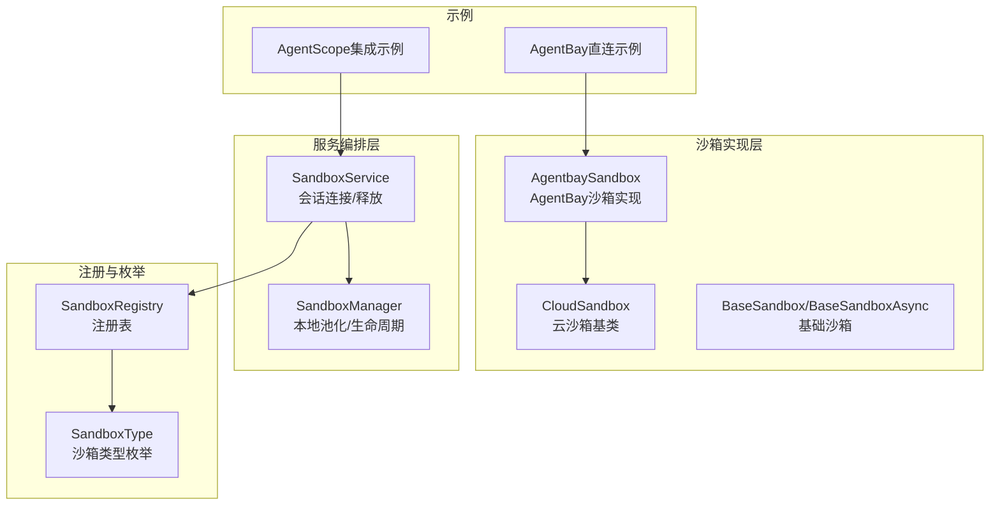
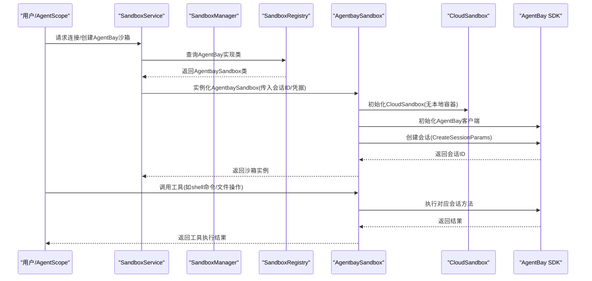
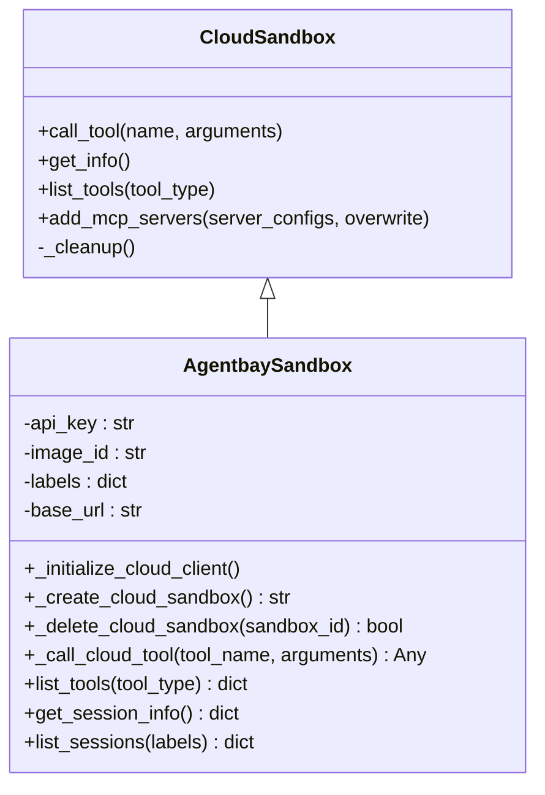
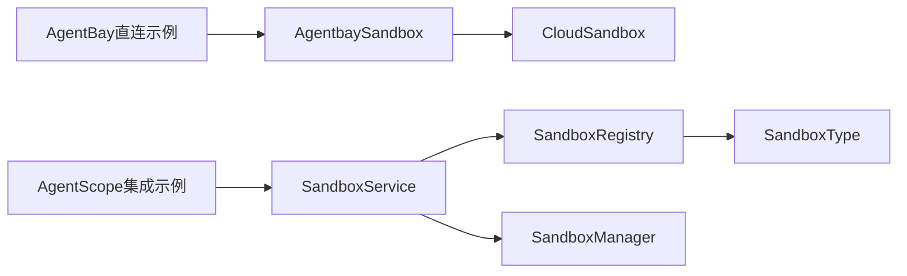

# AgentBay沙箱

<cite>
**本文档引用的文件**
- [agentbay_sandbox.py](file://src/agentscope_runtime/sandbox/box/agentbay/agentbay_sandbox.py)
- [cloud_sandbox.py](file://src/agentscope_runtime/sandbox/box/cloud/cloud_sandbox.py)
- [base_sandbox.py](file://src/agentscope_runtime/sandbox/box/base/base_sandbox.py)
- [sandbox_service.py](file://src/agentscope_runtime/engine/services/sandbox/sandbox_service.py)
- [enums.py](file://src/agentscope_runtime/sandbox/enums.py)
- [registry.py](file://src/agentscope_runtime/sandbox/registry.py)
- [sandbox_manager.py](file://src/agentscope_runtime/sandbox/manager/sandbox_manager.py)
- [agentbay_sandbox_demo.py](file://examples/sandbox/agentbay_sandbox/agentbay_sandbox_demo.py)
- [agentscope_use_agentbay_sandbox.py](file://examples/sandbox/agentbay_sandbox/agentscope_use_agentbay_sandbox.py)
- [base.py](file://src/agentscope_runtime/engine/services/base.py)
</cite>

## 目录
1. [简介](#简介)
2. [项目结构](#项目结构)
3. [核心组件](#核心组件)
4. [架构总览](#架构总览)
5. [详细组件分析](#详细组件分析)
6. [依赖关系分析](#依赖关系分析)
7. [性能考虑](#性能考虑)
8. [故障排查指南](#故障排查指南)
9. [结论](#结论)
10. [附录](#附录)

## 简介
本文件面向AgentScope Runtime中的AgentBay沙箱，系统化阐述其在多Agent协作、多实例协调与分布式执行方面的设计与实现。AgentBay沙箱通过云原生API直接访问远程沙箱环境，提供与传统容器沙箱一致的调用体验，并支持工具链映射、会话管理、资源清理等关键能力。本文将从架构、组件、数据流、错误处理、性能优化到使用示例进行全面解析。

## 项目结构
AgentBay沙箱位于运行时代码库中，主要涉及以下模块：
- 沙箱实现层：AgentBay沙箱实现、云沙箱基类、基础沙箱基类
- 服务编排层：SandboxService（会话连接/释放）、SandboxManager（本地池化/生命周期）
- 注册与枚举：SandboxType枚举、SandboxRegistry注册表
- 示例与测试：AgentScope集成示例、AgentBay直连示例



**图表来源**
- [agentbay_sandbox.py:27-558](file://src/agentscope_runtime/sandbox/box/agentbay/agentbay_sandbox.py#L27-L558)
- [cloud_sandbox.py:19-251](file://src/agentscope_runtime/sandbox/box/cloud/cloud_sandbox.py#L19-L251)
- [base_sandbox.py:18-102](file://src/agentscope_runtime/sandbox/box/base/base_sandbox.py#L18-L102)
- [sandbox_service.py:11-238](file://src/agentscope_runtime/engine/services/sandbox/sandbox_service.py#L11-L238)
- [sandbox_manager.py:140-800](file://src/agentscope_runtime/sandbox/manager/sandbox_manager.py#L140-L800)
- [enums.py:61-80](file://src/agentscope_runtime/sandbox/enums.py#L61-L80)
- [registry.py:33-131](file://src/agentscope_runtime/sandbox/registry.py#L33-L131)
- [agentbay_sandbox_demo.py:1-240](file://examples/sandbox/agentbay_sandbox/agentbay_sandbox_demo.py#L1-L240)
- [agentscope_use_agentbay_sandbox.py:1-418](file://examples/sandbox/agentbay_sandbox/agentscope_use_agentbay_sandbox.py#L1-L418)

**章节来源**
- [agentbay_sandbox.py:1-558](file://src/agentscope_runtime/sandbox/box/agentbay/agentbay_sandbox.py#L1-L558)
- [sandbox_service.py:1-238](file://src/agentscope_runtime/engine/services/sandbox/sandbox_service.py#L1-L238)
- [enums.py:1-80](file://src/agentscope_runtime/sandbox/enums.py#L1-L80)
- [registry.py:1-131](file://src/agentscope_runtime/sandbox/registry.py#L1-L131)

## 核心组件
- AgentbaySandbox：AgentBay云沙箱的具体实现，负责初始化AgentBay客户端、创建/删除会话、工具调用映射、信息查询与会话列表管理。
- CloudSandbox：云沙箱抽象基类，定义云沙箱通用接口（初始化云客户端、创建/删除云沙箱、工具调用、信息查询、MCP服务器接入、清理）。
- SandboxService：服务编排入口，负责根据会话上下文连接或创建沙箱，识别AgentBay会话并进行特殊处理，支持释放与健康检查。
- SandboxManager：本地沙箱池化与生命周期管理，提供创建/释放/清理等能力；在远程模式下通过HTTP与远端交互。
- SandboxType/SandboxRegistry：枚举与注册表，统一管理沙箱类型与实现类映射，支持动态扩展。

**章节来源**
- [agentbay_sandbox.py:27-558](file://src/agentscope_runtime/sandbox/box/agentbay/agentbay_sandbox.py#L27-L558)
- [cloud_sandbox.py:19-251](file://src/agentscope_runtime/sandbox/box/cloud/cloud_sandbox.py#L19-L251)
- [sandbox_service.py:11-238](file://src/agentscope_runtime/engine/services/sandbox/sandbox_service.py#L11-L238)
- [sandbox_manager.py:140-800](file://src/agentscope_runtime/sandbox/manager/sandbox_manager.py#L140-L800)
- [enums.py:61-80](file://src/agentscope_runtime/sandbox/enums.py#L61-L80)
- [registry.py:33-131](file://src/agentscope_runtime/sandbox/registry.py#L33-L131)

## 架构总览
AgentBay沙箱采用“云原生API直连”架构，避免本地容器依赖，通过SandboxService统一接入，既可直接使用AgentBay SDK，也可通过SandboxService进行会话管理与资源清理。



**图表来源**
- [sandbox_service.py:104-142](file://src/agentscope_runtime/engine/services/sandbox/sandbox_service.py#L104-L142)
- [agentbay_sandbox.py:88-147](file://src/agentscope_runtime/sandbox/box/agentbay/agentbay_sandbox.py#L88-L147)
- [cloud_sandbox.py:34-82](file://src/agentscope_runtime/sandbox/box/cloud/cloud_sandbox.py#L34-L82)

## 详细组件分析

### AgentbaySandbox组件分析
- 初始化与认证：优先从参数/环境变量读取AgentBay API Key，构造AgentBay客户端；支持image_id与标签选择。
- 会话生命周期：创建会话、删除会话、获取会话信息、列出会话；异常与失败路径均有日志记录。
- 工具调用映射：将标准工具名映射到AgentBay会话对象的方法（如shell命令、Python代码、文件操作、浏览器操作、截图等），并提供通用回退调用。
- 工具分类：按文件、命令、浏览器、系统四类组织工具清单，便于上层Agent选择与展示。
- 会话识别：通过会话ID前缀判断是否为AgentBay会话，以便SandboxService进行差异化处理。



**图表来源**
- [cloud_sandbox.py:19-251](file://src/agentscope_runtime/sandbox/box/cloud/cloud_sandbox.py#L19-L251)
- [agentbay_sandbox.py:27-558](file://src/agentscope_runtime/sandbox/box/agentbay/agentbay_sandbox.py#L27-L558)

**章节来源**
- [agentbay_sandbox.py:43-558](file://src/agentscope_runtime/sandbox/box/agentbay/agentbay_sandbox.py#L43-L558)

### SandboxService组件分析
- 会话连接：根据session_id与user_id生成复合键，若已有环境则复用，否则按类型创建新环境；对AgentBay会话ID进行特殊识别与连接。
- 会话释放：在非AgentBay会话上执行释放；AgentBay会话由沙箱对象销毁时自动清理。
- 生命周期：支持drain_on_stop策略，停止时遍历会话映射并释放非AgentBay会话；嵌入模式下执行清理。

```mermaid
sequenceDiagram
participant Client as "调用方"
participant Service as "SandboxService"
participant Manager as "SandboxManager"
participant Registry as "SandboxRegistry"
participant Box as "AgentbaySandbox"
Client->>Service : connect(session_id, user_id, [AGENTBAY])
Service->>Manager : get_session_mapping(session_ctx_id)
alt 已存在环境
Service->>Service : _connect_existing_environment(env_ids)
opt AgentBay会话ID
Service->>Box : 实例化AgentbaySandbox(带sandbox_id)
Box-->>Service : 返回沙箱
end
else 不存在环境
Service->>Registry : get_classes_by_type(AGENTBAY)
Registry-->>Service : AgentbaySandbox类
Service->>Box : 实例化AgentbaySandbox(无sandbox_id)
Box-->>Service : 返回沙箱
end
Service-->>Client : 返回沙箱列表
```

**图表来源**
- [sandbox_service.py:82-200](file://src/agentscope_runtime/engine/services/sandbox/sandbox_service.py#L82-L200)
- [registry.py:105-108](file://src/agentscope_runtime/sandbox/registry.py#L105-L108)

**章节来源**
- [sandbox_service.py:82-238](file://src/agentscope_runtime/engine/services/sandbox/sandbox_service.py#L82-L238)

### CloudSandbox基类分析
- 无本地容器依赖：通过cloud_client直接与云API交互，统一了不同云提供商的接入方式。
- 工具调用封装：提供统一的call_tool入口，屏蔽底层差异。
- 清理策略：在析构时调用_delete_cloud_sandbox，确保云资源释放。

**章节来源**
- [cloud_sandbox.py:19-251](file://src/agentscope_runtime/sandbox/box/cloud/cloud_sandbox.py#L19-L251)

### SandboxType与SandboxRegistry分析
- 动态枚举扩展：SandboxType支持动态添加成员，便于扩展新的沙箱类型（如AGENTBAY）。
- 注册表：以装饰器形式注册沙箱实现类与其配置，提供按类型查找与镜像名称解析。

**章节来源**
- [enums.py:19-80](file://src/agentscope_runtime/sandbox/enums.py#L19-L80)
- [registry.py:33-131](file://src/agentscope_runtime/sandbox/registry.py#L33-L131)

### 使用示例与AgentScope集成
- 直连AgentBay：演示如何直接创建AgentbaySandbox并执行工具调用，包含环境变量与.env文件加载逻辑。
- 与AgentScope集成：通过SandboxService连接AgentBay沙箱，构建ReActAgent并注册工具函数，实现多步骤任务编排。

**章节来源**
- [agentbay_sandbox_demo.py:1-240](file://examples/sandbox/agentbay_sandbox/agentbay_sandbox_demo.py#L1-L240)
- [agentscope_use_agentbay_sandbox.py:1-418](file://examples/sandbox/agentbay_sandbox/agentscope_use_agentbay_sandbox.py#L1-L418)

## 依赖关系分析
- 组件耦合：AgentbaySandbox强依赖AgentBay SDK；SandboxService依赖SandboxRegistry与SandboxManager；CloudSandbox为AgentbaySandbox的抽象父类。
- 外部依赖：AgentBay SDK导入与API调用；requests/httpx用于远程模式请求；Redis/内存集合用于会话映射与池化。
- 循环依赖：未发现循环依赖迹象，模块职责清晰。



**图表来源**
- [agentbay_sandbox.py:27-558](file://src/agentscope_runtime/sandbox/box/agentbay/agentbay_sandbox.py#L27-L558)
- [cloud_sandbox.py:19-251](file://src/agentscope_runtime/sandbox/box/cloud/cloud_sandbox.py#L19-L251)
- [sandbox_service.py:11-238](file://src/agentscope_runtime/engine/services/sandbox/sandbox_service.py#L11-L238)
- [registry.py:33-131](file://src/agentscope_runtime/sandbox/registry.py#L33-L131)
- [enums.py:61-80](file://src/agentscope_runtime/sandbox/enums.py#L61-L80)
- [agentbay_sandbox_demo.py:1-240](file://examples/sandbox/agentbay_sandbox/agentbay_sandbox_demo.py#L1-L240)
- [agentscope_use_agentbay_sandbox.py:1-418](file://examples/sandbox/agentbay_sandbox/agentscope_use_agentbay_sandbox.py#L1-L418)

**章节来源**
- [sandbox_manager.py:140-800](file://src/agentscope_runtime/sandbox/manager/sandbox_manager.py#L140-L800)
- [base.py:1-78](file://src/agentscope_runtime/engine/services/base.py#L1-L78)

## 性能考虑
- 云原生直连：避免本地容器启动与网络桥接开销，降低冷启动延迟。
- 工具调用批量化：建议在上层聚合多个小工具调用，减少往返次数。
- 会话复用：通过SandboxService复用现有会话，避免频繁创建/销毁。
- 异步支持：CloudSandbox提供异步基类能力，可在高并发场景下提升吞吐。
- 资源限制：通过SandboxRegistry配置资源限制与超时，防止单次调用占用过多资源。

## 故障排查指南
- SDK缺失：AgentBay SDK未安装会导致初始化失败，需按提示安装相应包。
- 凭据问题：未设置AGENTBAY_API_KEY或bearer_token无效，初始化阶段会抛出异常。
- 会话不存在：工具调用前需确认会话已创建且有效；可通过get_session_info核验。
- 远程模式网络：在远程模式下，检查base_url与bearer_token配置，确保网络可达与鉴权正确。
- 释放策略：停止服务时启用drain_on_stop可自动释放非AgentBay会话，避免资源泄漏。

**章节来源**
- [agentbay_sandbox.py:67-113](file://src/agentscope_runtime/sandbox/box/agentbay/agentbay_sandbox.py#L67-L113)
- [sandbox_service.py:56-78](file://src/agentscope_runtime/engine/services/sandbox/sandbox_service.py#L56-L78)

## 结论
AgentBay沙箱通过CloudSandbox抽象与SandboxService编排，实现了与传统容器沙箱一致的使用体验，同时具备云原生的高扩展性与低运维成本。其工具映射、会话管理与清理策略为多Agent协作提供了稳定基础，适合在需要跨语言、跨平台与浏览器交互的复杂任务中应用。

## 附录
- 使用场景建议
  - 需要跨平台执行与文件系统操作的任务
  - 需要浏览器自动化与截图能力的场景
  - 多Agent协同编排与状态共享
- 部署配置要点
  - 设置AGENTBAY_API_KEY或在构造函数传入api_key
  - 选择合适的image_id（如linux_latest/windows_latest等）
  - 在远程模式下配置base_url与bearer_token
- 调试技巧
  - 启用详细日志，关注会话创建/删除与工具调用返回值
  - 使用list_tools与get_session_info快速验证可用性
  - 在AgentScope集成中，先以直连方式验证功能，再接入SandboxService