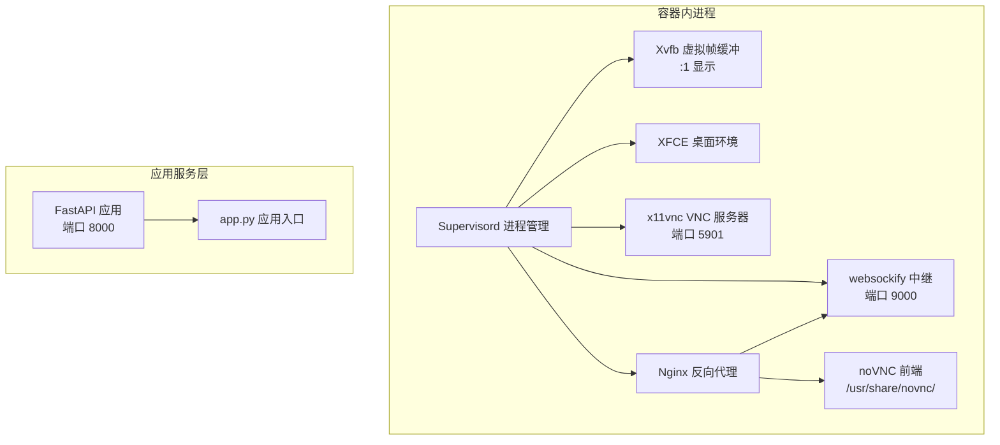
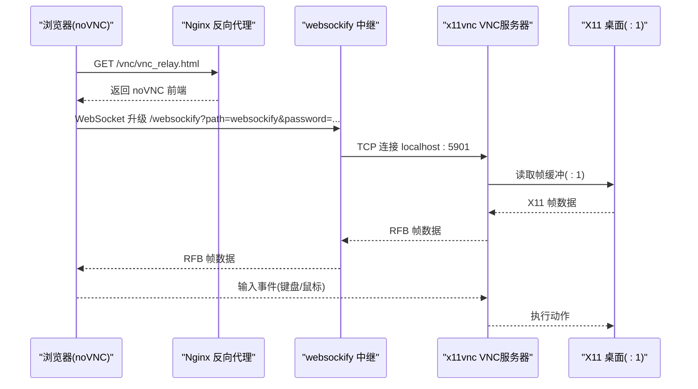
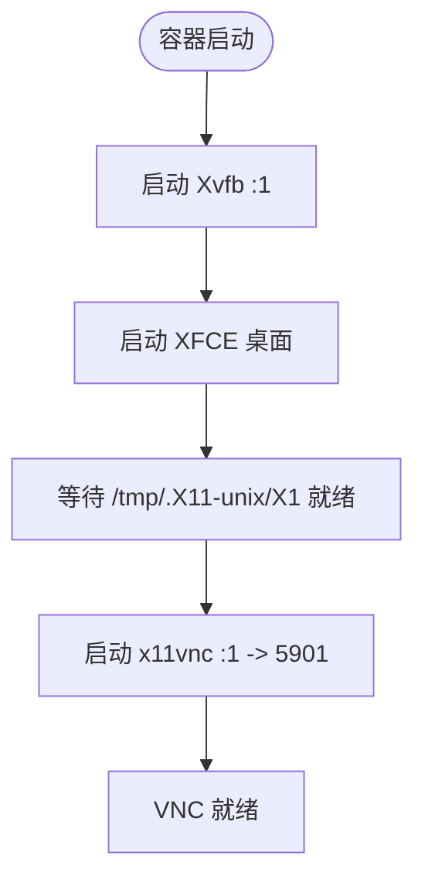
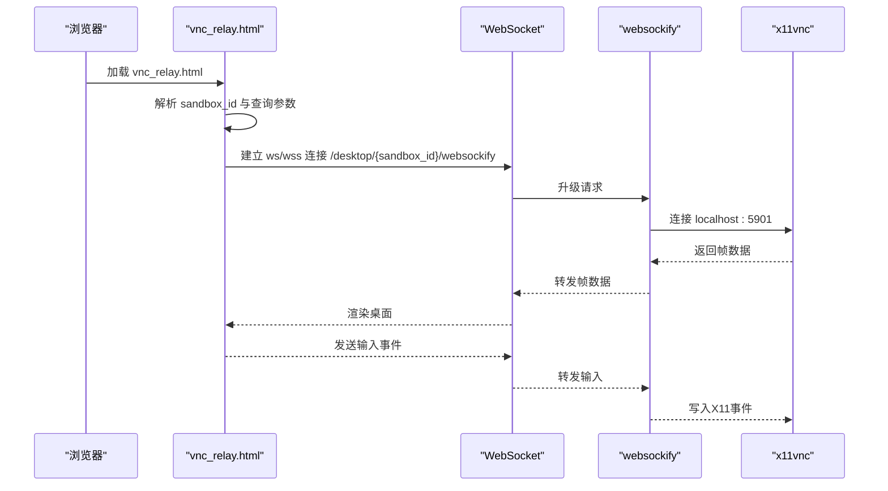
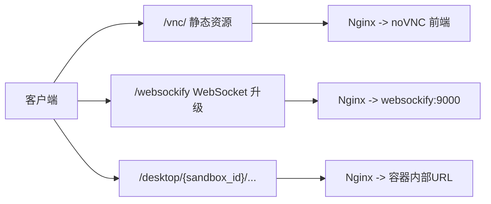
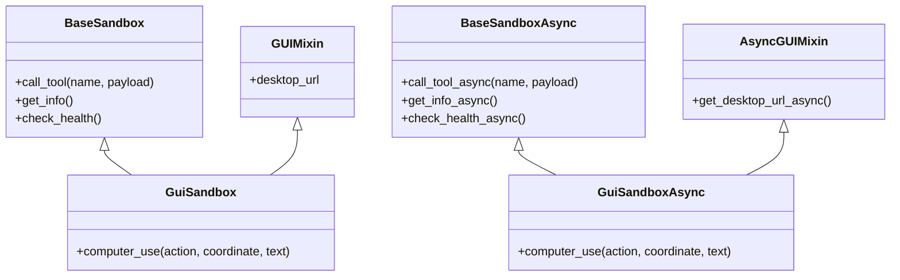
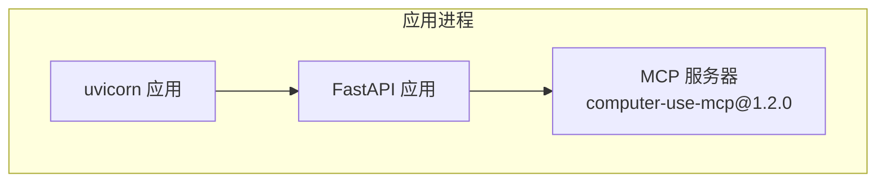
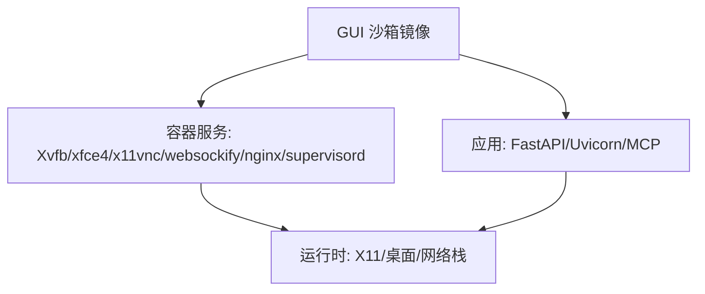

# GUI沙箱

<cite>
**本文引用的文件**
- [gui_sandbox.py](file://src/agentscope_runtime/sandbox/box/gui/gui_sandbox.py)
- [Dockerfile](file://src/agentscope_runtime/sandbox/box/gui/Dockerfile)
- [vnc_relay.html](file://src/agentscope_runtime/sandbox/box/gui/box/vnc_relay.html)
- [supervisord.conf](file://src/agentscope_runtime/sandbox/box/gui/box/config/supervisord.conf)
- [nginx.conf.template](file://src/agentscope_runtime/sandbox/box/gui/box/config/nginx.conf.template)
- [start.sh](file://src/agentscope_runtime/sandbox/box/gui/box/scripts/start.sh)
- [requirements.txt](file://src/agentscope_runtime/sandbox/box/gui/box/requirements.txt)
- [mcp_server_configs.json](file://src/agentscope_runtime/sandbox/box/gui/box/mcp_server_configs.json)
- [app.py](file://src/agentscope_runtime/sandbox/box/shared/app.py)
- [base_sandbox.py](file://src/agentscope_runtime/sandbox/box/base/base_sandbox.py)
</cite>

## 目录
1. [简介](#简介)
2. [项目结构](#项目结构)
3. [核心组件](#核心组件)
4. [架构总览](#架构总览)
5. [详细组件分析](#详细组件分析)
6. [依赖关系分析](#依赖关系分析)
7. [性能考虑](#性能考虑)
8. [故障排查指南](#故障排查指南)
9. [结论](#结论)
10. [附录](#附录)

## 简介
本技术文档面向AgentScope Runtime的GUI沙箱，系统性阐述其基于VNC的远程桌面实现、浏览器中继机制与图形界面渲染流程；详解VNC服务器配置、浏览器中继页面与WebSocket连接建立；说明GUI沙箱的显示控制、输入事件处理与屏幕截图能力；并覆盖Docker容器内的X11虚拟帧缓冲、音频支持与GPU加速配置建议。最后提供使用场景、性能优化与安全配置指南，帮助读者在生产环境中稳定、安全地部署与运行。

## 项目结构
GUI沙箱由“容器镜像层”和“应用服务层”两部分构成：
- 容器镜像层：包含Xvfb虚拟帧缓冲、XFCE桌面环境、x11vnc VNC服务器、noVNC前端与websockify中继，以及Nginx反向代理。
- 应用服务层：FastAPI应用负责沙箱管理、路由分发与工具调用（如computer-use）。

图表来源
- [Dockerfile:1-81](file://src/agentscope_runtime/sandbox/box/gui/Dockerfile#L1-L81)
- [supervisord.conf:1-65](file://src/agentscope_runtime/sandbox/box/gui/box/config/supervisord.conf#L1-L65)
- [nginx.conf.template:1-47](file://src/agentscope_runtime/sandbox/box/gui/box/config/nginx.conf.template#L1-L47)
- [start.sh:1-5](file://src/agentscope_runtime/sandbox/box/gui/box/scripts/start.sh#L1-L5)

章节来源
- [Dockerfile:1-81](file://src/agentscope_runtime/sandbox/box/gui/Dockerfile#L1-L81)
- [supervisord.conf:1-65](file://src/agentscope_runtime/sandbox/box/gui/box/config/supervisord.conf#L1-L65)
- [nginx.conf.template:1-47](file://src/agentscope_runtime/sandbox/box/gui/box/config/nginx.conf.template#L1-L47)
- [start.sh:1-5](file://src/agentscope_runtime/sandbox/box/gui/box/scripts/start.sh#L1-L5)

## 核心组件
- GUI沙箱类与混入：提供桌面URL生成、异步桌面URL生成与computer-use工具接口。
- VNC中继页面：浏览器侧noVNC前端，负责WebSocket连接、显示控制与输入事件转发。
- 容器服务编排：Supervisord统一管理Xvfb、XFCE、x11vnc、websockify与Nginx。
- 反向代理：Nginx将/vnc/静态资源与/websockify升级路径转发至对应后端。
- FastAPI应用：提供沙箱管理、健康检查与工具调用（通过MCP）。

章节来源
- [gui_sandbox.py:17-62](file://src/agentscope_runtime/sandbox/box/gui/gui_sandbox.py#L17-L62)
- [vnc_relay.html:60-185](file://src/agentscope_runtime/sandbox/box/gui/box/vnc_relay.html#L60-L185)
- [supervisord.conf:30-64](file://src/agentscope_runtime/sandbox/box/gui/box/config/supervisord.conf#L30-L64)
- [nginx.conf.template:27-45](file://src/agentscope_runtime/sandbox/box/gui/box/config/nginx.conf.template#L27-L45)
- [requirements.txt:1-9](file://src/agentscope_runtime/sandbox/box/gui/box/requirements.txt#L1-L9)

## 架构总览
GUI沙箱的远程桌面访问链路如下：
- 浏览器加载noVNC前端，解析URL中的sandbox_id与参数。
- noVNC通过WebSocket连接到websockify中继（/websockify），携带密码与可选路径参数。
- websockify将WebSocket升级为TCP流，转发至本地x11vnc VNC服务器（5901端口）。
- x11vnc将X11帧缓冲内容编码并通过RFB协议回传给浏览器，完成远程桌面渲染。
- 用户输入（鼠标/键盘）由noVNC捕获并通过RFB发送至x11vnc，再作用于虚拟桌面。

图表来源
- [vnc_relay.html:145-174](file://src/agentscope_runtime/sandbox/box/gui/box/vnc_relay.html#L145-L174)
- [nginx.conf.template:38-45](file://src/agentscope_runtime/sandbox/box/gui/box/config/nginx.conf.template#L38-L45)
- [supervisord.conf:48-58](file://src/agentscope_runtime/sandbox/box/gui/box/config/supervisord.conf#L48-L58)

## 详细组件分析

### VNC服务器与桌面环境
- Xvfb虚拟帧缓冲：在容器内创建无头显示设备:1，供桌面环境与应用程序使用。
- XFCE桌面：在Xvfb之上启动轻量桌面环境，提供窗口管理与基础UI。
- x11vnc：监听:1显示，将X11事件与帧缓冲暴露为VNC服务，端口5901。
- Supervisord：确保上述进程按优先级顺序启动，并在异常时自动重启。

图表来源
- [supervisord.conf:30-55](file://src/agentscope_runtime/sandbox/box/gui/box/config/supervisord.conf#L30-L55)

章节来源
- [supervisord.conf:30-55](file://src/agentscope_runtime/sandbox/box/gui/box/config/supervisord.conf#L30-L55)

### 浏览器中继与WebSocket连接
- noVNC前端：加载RFB模块，解析URL查询参数（host/port/password/path/view_only/scale等）。
- WebSocket路径：根据当前路径动态拼接“/desktop/{sandbox_id}”，以适配反向代理前缀。
- 连接建立：根据协议选择ws/wss，连接到websockify中继，携带密码认证。
- 事件处理：监听connect/disconnect/credentialsrequired/desktopname事件，设置视图模式与缩放。

图表来源
- [vnc_relay.html:97-184](file://src/agentscope_runtime/sandbox/box/gui/box/vnc_relay.html#L97-L184)

章节来源
- [vnc_relay.html:97-184](file://src/agentscope_runtime/sandbox/box/gui/box/vnc_relay.html#L97-L184)

### 反向代理与路径映射
- /vnc/：静态资源别名指向/usr/share/novnc/，用于noVNC前端。
- /websockify：将WebSocket升级请求转发至本地9000端口的websockify。
- FastAPI路由：/desktop/{sandbox_id}/... 由沙箱管理器代理到容器内部URL。

图表来源
- [nginx.conf.template:27-45](file://src/agentscope_runtime/sandbox/box/gui/box/config/nginx.conf.template#L27-L45)

章节来源
- [nginx.conf.template:27-45](file://src/agentscope_runtime/sandbox/box/gui/box/config/nginx.conf.template#L27-L45)

### GUI沙箱类与工具接口
- 同步GUI沙箱：提供desktop_url属性与computer_use同步接口，通过工具调用执行动作与截图。
- 异步GUI沙箱：提供get_desktop_url_async与computer_use异步接口，适合高并发场景。
- 工具调用：computer-use工具封装了截图、鼠标键盘操作、光标位置获取等能力。

图表来源
- [gui_sandbox.py:17-62](file://src/agentscope_runtime/sandbox/box/gui/gui_sandbox.py#L17-L62)
- [gui_sandbox.py:161-240](file://src/agentscope_runtime/sandbox/box/gui/gui_sandbox.py#L161-L240)
- [base_sandbox.py:18-33](file://src/agentscope_runtime/sandbox/box/base/base_sandbox.py#L18-L33)

章节来源
- [gui_sandbox.py:17-62](file://src/agentscope_runtime/sandbox/box/gui/gui_sandbox.py#L17-L62)
- [gui_sandbox.py:161-240](file://src/agentscope_runtime/sandbox/box/gui/gui_sandbox.py#L161-L240)
- [base_sandbox.py:18-33](file://src/agentscope_runtime/sandbox/box/base/base_sandbox.py#L18-L33)

### 应用服务与MCP集成
- FastAPI应用：作为沙箱管理与工具调用的后端服务，监听8000端口。
- MCP服务器：通过mcp_server_configs.json声明computer-use MCP服务器，版本为1.2.0。
- 启动脚本：start.sh启动uvicorn应用，常驻后台。

图表来源
- [start.sh:3-3](file://src/agentscope_runtime/sandbox/box/gui/box/scripts/start.sh#L3-L3)
- [mcp_server_configs.json:1-11](file://src/agentscope_runtime/sandbox/box/gui/box/mcp_server_configs.json#L1-L11)
- [requirements.txt:6-6](file://src/agentscope_runtime/sandbox/box/gui/box/requirements.txt#L6-L6)

章节来源
- [start.sh:1-5](file://src/agentscope_runtime/sandbox/box/gui/box/scripts/start.sh#L1-L5)
- [mcp_server_configs.json:1-11](file://src/agentscope_runtime/sandbox/box/gui/box/mcp_server_configs.json#L1-L11)
- [requirements.txt:1-9](file://src/agentscope_runtime/sandbox/box/gui/box/requirements.txt#L1-L9)

## 依赖关系分析
- 容器镜像依赖：Node.js、Python3、supervisord、nginx、xfce4、x11vnc、novnc、websockify、chromium等。
- 应用依赖：FastAPI、Uvicorn、Pydantic、requests、mcp、aiofiles、uv、gitpython等。
- 运行时依赖：Xvfb、x11vnc、websockify、noVNC前端、Nginx、Supervisord。

图表来源
- [Dockerfile:9-47](file://src/agentscope_runtime/sandbox/box/gui/Dockerfile#L9-L47)
- [requirements.txt:1-9](file://src/agentscope_runtime/sandbox/box/gui/box/requirements.txt#L1-L9)

章节来源
- [Dockerfile:9-47](file://src/agentscope_runtime/sandbox/box/gui/Dockerfile#L9-L47)
- [requirements.txt:1-9](file://src/agentscope_runtime/sandbox/box/gui/box/requirements.txt#L1-L9)

## 性能考虑
- 显示分辨率与帧率：可通过Xvfb启动参数调整分辨率（如1280x800x24），在保证体验的前提下降低带宽占用。
- 缩放与视图模式：noVNC支持scale与view_only参数，可在移动设备或低带宽环境下提升交互流畅度。
- 连接超时：Nginx模板提供NGINX_TIMEOUT变量，可根据网络状况调整代理超时时间。
- 并发与异步：使用GuiSandboxAsync与异步工具调用，减少阻塞，提高多用户场景下的吞吐。
- 资源隔离：Supervisord按优先级启动进程，避免资源竞争导致的启动失败。

## 故障排查指南
- VNC无法连接
  - 检查x11vnc是否就绪：确认容器日志中x11vnc已启动且监听5901端口。
  - 校验密码：确保URL中的password与容器内SECRET_TOKEN一致。
  - 端口连通性：验证websockify是否成功连接到127.0.0.1:5901。
- noVNC前端空白或加载失败
  - 检查/vnc/静态资源路径映射是否正确。
  - 确认noVNC前端文件已复制到/usr/share/novnc/。
- WebSocket升级失败
  - 查看Nginx对/websockify的代理配置是否生效。
  - 确认浏览器协议(ws/wss)与目标主机/端口匹配。
- 桌面无响应或卡顿
  - 降低分辨率或关闭不必要的桌面程序。
  - 检查Supervisord各进程状态与日志。
- 架构兼容性
  - ARM64平台可能因缺少某些指令集导致Chromium崩溃，建议使用Rosetta或更换平台。

章节来源
- [supervisord.conf:48-55](file://src/agentscope_runtime/sandbox/box/gui/box/config/supervisord.conf#L48-L55)
- [nginx.conf.template:38-45](file://src/agentscope_runtime/sandbox/box/gui/box/config/nginx.conf.template#L38-L45)
- [vnc_relay.html:145-174](file://src/agentscope_runtime/sandbox/box/gui/box/vnc_relay.html#L145-L174)
- [gui_sandbox.py:88-96](file://src/agentscope_runtime/sandbox/box/gui/gui_sandbox.py#L88-L96)

## 结论
GUI沙箱通过容器内X11虚拟帧缓冲与桌面环境、VNC服务器与noVNC前端、以及Nginx与websockify中继，构建了完整的远程桌面体系。结合FastAPI与MCP工具链，实现了对图形界面的输入控制与屏幕截图能力。通过合理的资源配置、反向代理与WebSocket连接策略，可在多种部署环境下稳定运行。建议在生产中关注安全令牌、超时配置与架构兼容性，并根据业务需求进行性能调优。

## 附录

### 使用场景
- 自动化测试与验收：在无头环境中模拟用户操作，进行UI回归测试。
- 人机协作与演示：通过浏览器远程查看与控制沙箱桌面，便于演示与培训。
- AI代理交互：结合computer-use工具，让AI在图形界面上完成复杂任务。

### 安全配置指南
- 密码保护：通过SECRET_TOKEN与x11vnc密码共同保护VNC会话。
- 反向代理：在边缘网关或Ingress中启用TLS与访问控制，限制/sdesktop路径的访问范围。
- 最小权限：容器内进程尽量使用非root用户运行（如需），并限制挂载目录。
- 审计日志：开启Supervisord与Nginx日志，定期审计连接与错误。

### Docker容器配置要点
- X11转发：容器内DISPLAY=:1，Supervisord统一注入环境变量。
- 音频支持：如需音频，需在容器内安装PulseAudio并在宿主与容器间正确挂载音频设备。
- GPU加速：如需GPU直通或虚拟化，需在Docker/Kubernetes中启用相应设备映射与驱动。

章节来源
- [supervisord.conf:21-21](file://src/agentscope_runtime/sandbox/box/gui/box/config/supervisord.conf#L21-L21)
- [Dockerfile:49-49](file://src/agentscope_runtime/sandbox/box/gui/Dockerfile#L49-L49)