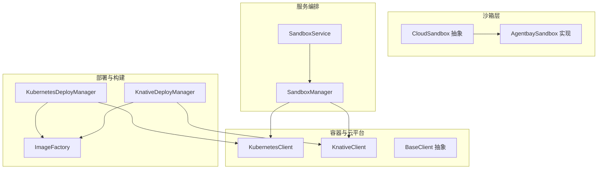
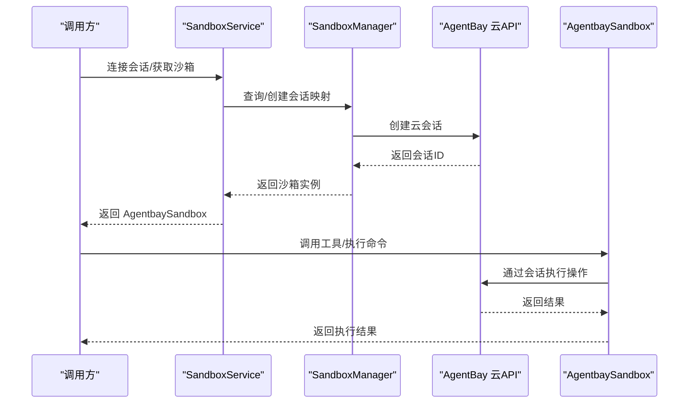
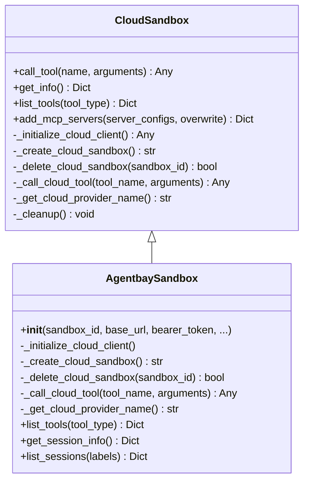
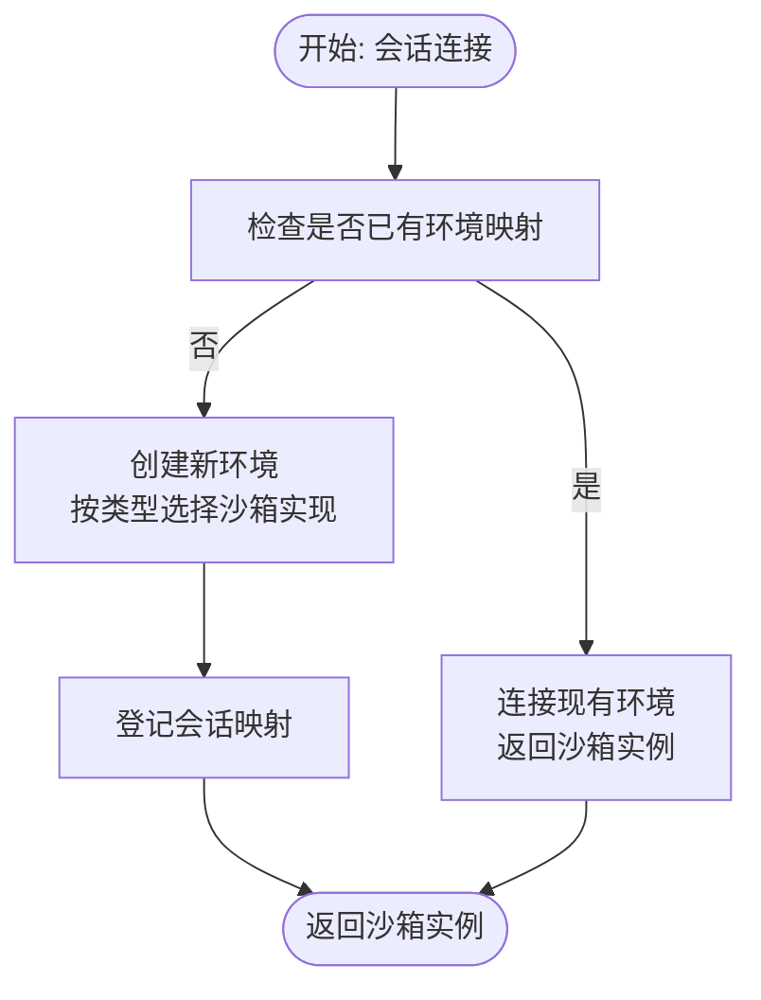
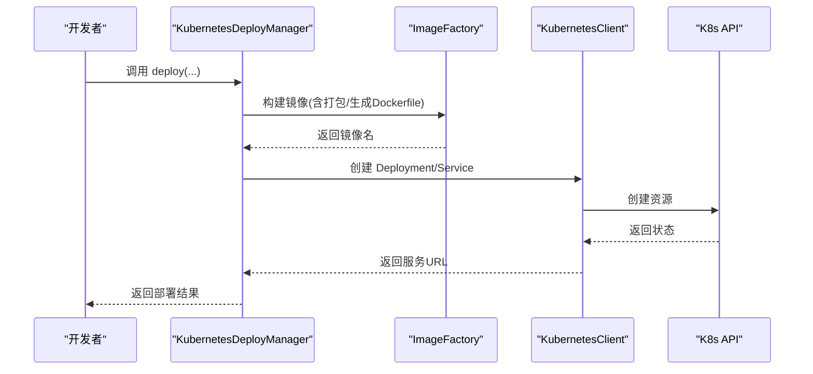
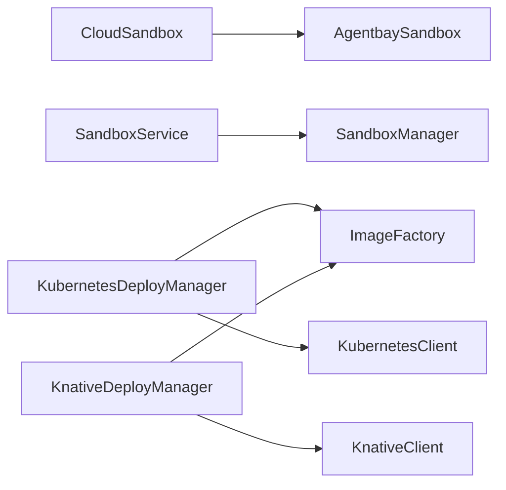

# 云沙箱

<cite>
**本文引用的文件**
- [cloud_sandbox.py](file://src/agentscope_runtime/sandbox/box/cloud/cloud_sandbox.py)
- [agentbay_sandbox.py](file://src/agentscope_runtime/sandbox/box/agentbay/agentbay_sandbox.py)
- [sandbox_service.py](file://src/agentscope_runtime/engine/services/sandbox/sandbox_service.py)
- [sandbox_manager.py](file://src/agentscope_runtime/sandbox/manager/sandbox_manager.py)
- [knative_client.py](file://src/agentscope_runtime/common/container_clients/knative_client.py)
- [kubernetes_client.py](file://src/agentscope_runtime/common/container_clients/kubernetes_client.py)
- [knative_deployer.py](file://src/agentscope_runtime/engine/deployers/knative_deployer.py)
- [kubernetes_deployer.py](file://src/agentscope_runtime/engine/deployers/kubernetes_deployer.py)
- [image_factory.py](file://src/agentscope_runtime/engine/deployers/utils/docker_image_utils/image_factory.py)
- [knative_deploy_config.yaml](file://examples/deployments/knative_deploy/knative_deploy_config.yaml)
- [k8s_deploy_config.yaml](file://examples/deployments/k8s_deploy/k8s_deploy_config.yaml)
- [base_client.py](file://src/agentscope_runtime/common/container_clients/base_client.py)
- [enums.py](file://src/agentscope_runtime/sandbox/enums.py)
- [registry.py](file://src/agentscope_runtime/sandbox/registry.py)
- [constant.py](file://src/agentscope_runtime/engine/constant.py)
</cite>

## 目录
1. [简介](#简介)
2. [项目结构](#项目结构)
3. [核心组件](#核心组件)
4. [架构总览](#架构总览)
5. [详细组件分析](#详细组件分析)
6. [依赖分析](#依赖分析)
7. [性能考虑](#性能考虑)
8. [故障排查指南](#故障排查指南)
9. [结论](#结论)
10. [附录](#附录)

## 简介
本技术文档聚焦于 AgentScope Runtime 的“云沙箱”能力，系统阐述其在云端的执行模型、资源管理与弹性扩展机制，以及与云平台（Kubernetes/Knative）的集成方式、资源配置与成本控制策略。同时覆盖自动扩缩容、负载均衡与高可用设计、安全隔离、网络访问与数据持久化策略，并提供部署配置、监控告警与故障恢复指南。

## 项目结构
围绕云沙箱的关键代码分布在以下模块：
- 沙箱抽象与云实现：cloud_sandbox.py、agentbay_sandbox.py
- 服务编排与生命周期：sandbox_service.py、sandbox_manager.py
- 容器与云平台客户端：kubernetes_client.py、knative_client.py、base_client.py
- 部署器与镜像构建：kubernetes_deployer.py、knative_deployer.py、image_factory.py
- 枚举与注册表：enums.py、registry.py
- 示例配置：knative_deploy_config.yaml、k8s_deploy_config.yaml

图表来源
- [cloud_sandbox.py:19-251](file://src/agentscope_runtime/sandbox/box/cloud/cloud_sandbox.py#L19-L251)
- [agentbay_sandbox.py:27-558](file://src/agentscope_runtime/sandbox/box/agentbay/agentbay_sandbox.py#L27-L558)
- [sandbox_service.py:11-238](file://src/agentscope_runtime/engine/services/sandbox/sandbox_service.py#L11-L238)
- [sandbox_manager.py:140-800](file://src/agentscope_runtime/sandbox/manager/sandbox_manager.py#L140-L800)
- [kubernetes_client.py:19-800](file://src/agentscope_runtime/common/container_clients/kubernetes_client.py#L19-L800)
- [knative_client.py:16-468](file://src/agentscope_runtime/common/container_clients/knative_client.py#L16-L468)
- [kubernetes_deployer.py:48-391](file://src/agentscope_runtime/engine/deployers/kubernetes_deployer.py#L48-L391)
- [knative_deployer.py:43-291](file://src/agentscope_runtime/engine/deployers/knative_deployer.py#L43-L291)
- [image_factory.py:67-400](file://src/agentscope_runtime/engine/deployers/utils/docker_image_utils/image_factory.py#L67-L400)

章节来源
- [cloud_sandbox.py:19-251](file://src/agentscope_runtime/sandbox/box/cloud/cloud_sandbox.py#L19-L251)
- [agentbay_sandbox.py:27-558](file://src/agentscope_runtime/sandbox/box/agentbay/agentbay_sandbox.py#L27-L558)
- [sandbox_service.py:11-238](file://src/agentscope_runtime/engine/services/sandbox/sandbox_service.py#L11-L238)
- [sandbox_manager.py:140-800](file://src/agentscope_runtime/sandbox/manager/sandbox_manager.py#L140-L800)

## 核心组件
- 云沙箱抽象：CloudSandbox 提供统一接口，屏蔽本地容器依赖，直接通过云 API 管理远程环境，支持多云提供商扩展。
- AgentBay 实现：AgentbaySandbox 将 CloudSandbox 与 AgentBay 云服务对接，负责会话创建/删除、工具调用映射与信息查询。
- 服务编排：SandboxService 负责会话连接、环境分配与释放；SandboxManager 提供资源池、心跳扫描与清理等运行时管理能力。
- 云平台客户端：KubernetesClient/KnativeClient 提供对 Kubernetes/Knative 的资源编排能力，包括 Pod/Deployment/Service 与 KService 生命周期管理。
- 部署器与镜像工厂：KubernetesDeployManager/KnativeDeployManager 负责将 Runner 打包为镜像并部署到集群；ImageFactory 统一生成 Dockerfile、打包项目并构建镜像。
- 注册表与枚举：SandboxRegistry/SandboxType 管理沙箱类型与镜像映射，便于按类型选择具体实现。

章节来源
- [cloud_sandbox.py:19-251](file://src/agentscope_runtime/sandbox/box/cloud/cloud_sandbox.py#L19-L251)
- [agentbay_sandbox.py:27-558](file://src/agentscope_runtime/sandbox/box/agentbay/agentbay_sandbox.py#L27-L558)
- [sandbox_service.py:11-238](file://src/agentscope_runtime/engine/services/sandbox/sandbox_service.py#L11-L238)
- [sandbox_manager.py:140-800](file://src/agentscope_runtime/sandbox/manager/sandbox_manager.py#L140-L800)
- [kubernetes_client.py:19-800](file://src/agentscope_runtime/common/container_clients/kubernetes_client.py#L19-L800)
- [knative_client.py:16-468](file://src/agentscope_runtime/common/container_clients/knative_client.py#L16-L468)
- [kubernetes_deployer.py:48-391](file://src/agentscope_runtime/engine/deployers/kubernetes_deployer.py#L48-L391)
- [knative_deployer.py:43-291](file://src/agentscope_runtime/engine/deployers/knative_deployer.py#L43-L291)
- [image_factory.py:67-400](file://src/agentscope_runtime/engine/deployers/utils/docker_image_utils/image_factory.py#L67-L400)
- [registry.py:33-131](file://src/agentscope_runtime/sandbox/registry.py#L33-L131)
- [enums.py:61-80](file://src/agentscope_runtime/sandbox/enums.py#L61-L80)

## 架构总览
云沙箱采用“服务编排 + 云平台客户端 + 部署器”的分层架构：
- 上层：SandboxService 以会话为中心进行环境分配与连接，兼容嵌入式模式与远程模式。
- 中层：SandboxManager 负责资源池、心跳与回收，支持多类型沙箱的统一管理。
- 下层：Kubernetes/Knative 客户端封装云原生资源生命周期；部署器负责镜像构建与发布；镜像工厂统一封装构建流程。

图表来源
- [sandbox_service.py:82-200](file://src/agentscope_runtime/engine/services/sandbox/sandbox_service.py#L82-L200)
- [agentbay_sandbox.py:115-147](file://src/agentscope_runtime/sandbox/box/agentbay/agentbay_sandbox.py#L115-L147)
- [cloud_sandbox.py:140-158](file://src/agentscope_runtime/sandbox/box/cloud/cloud_sandbox.py#L140-L158)

## 详细组件分析

### 云沙箱抽象与实现
- CloudSandbox
  - 角色：定义云沙箱统一接口，不依赖本地容器，直接与云 API 交互。
  - 关键点：构造函数中初始化云客户端、创建/删除云会话、工具调用转发、信息查询与清理。
  - 生命周期：上下文管理器自动清理，确保异常退出也能释放云资源。
- AgentbaySandbox
  - 角色：CloudSandbox 的具体实现，对接 AgentBay 云服务。
  - 关键点：API Key 认证、会话创建/删除、工具方法映射（文件系统、浏览器、命令执行等）、会话信息查询与列表。
  - 工具分类：按功能划分为文件、命令、浏览器、系统等类别，便于按需使用。

图表来源
- [cloud_sandbox.py:19-251](file://src/agentscope_runtime/sandbox/box/cloud/cloud_sandbox.py#L19-L251)
- [agentbay_sandbox.py:27-558](file://src/agentscope_runtime/sandbox/box/agentbay/agentbay_sandbox.py#L27-L558)

章节来源
- [cloud_sandbox.py:19-251](file://src/agentscope_runtime/sandbox/box/cloud/cloud_sandbox.py#L19-L251)
- [agentbay_sandbox.py:27-558](file://src/agentscope_runtime/sandbox/box/agentbay/agentbay_sandbox.py#L27-L558)

### 服务编排与生命周期
- SandboxService
  - 角色：面向会话的服务入口，负责连接现有环境或创建新环境，支持多类型沙箱。
  - 关键点：会话上下文键生成、AgentBay 会话识别、环境映射与释放、停止时可选释放资源。
- SandboxManager
  - 角色：运行时资源管理核心，支持资源池、心跳扫描、回收与清理。
  - 关键点：远程/本地双模、装饰器包装远程调用、池化创建与校验、实例上限控制、文件系统与存储抽象。

图表来源
- [sandbox_service.py:82-200](file://src/agentscope_runtime/engine/services/sandbox/sandbox_service.py#L82-L200)

章节来源
- [sandbox_service.py:11-238](file://src/agentscope_runtime/engine/services/sandbox/sandbox_service.py#L11-L238)
- [sandbox_manager.py:140-800](file://src/agentscope_runtime/sandbox/manager/sandbox_manager.py#L140-L800)

### 云平台客户端与部署器
- KubernetesClient/KnativeClient
  - 角色：封装 Kubernetes/Knative 资源生命周期，支持 Pod/Deployment/KService 的创建、状态查询与删除。
  - 关键点：本地/远端集群识别、端口暴露、节点 IP 获取、资源限制与安全上下文配置。
- KubernetesDeployManager/KnativeDeployManager
  - 角色：将 Runner 打包为镜像并部署到集群，支持副本数、卷挂载、环境变量与运行时配置。
  - 关键点：镜像构建缓存、推送注册表、资源命名规范、状态查询与回滚。
- ImageFactory
  - 角色：统一镜像构建流程，生成 Dockerfile、打包项目、构建与推送。
  - 关键点：启动命令生成、平台与镜像仓库配置、缓存与清理。

图表来源
- [kubernetes_deployer.py:126-312](file://src/agentscope_runtime/engine/deployers/kubernetes_deployer.py#L126-L312)
- [image_factory.py:298-384](file://src/agentscope_runtime/engine/deployers/utils/docker_image_utils/image_factory.py#L298-L384)
- [kubernetes_client.py:263-441](file://src/agentscope_runtime/common/container_clients/kubernetes_client.py#L263-L441)

章节来源
- [kubernetes_client.py:19-800](file://src/agentscope_runtime/common/container_clients/kubernetes_client.py#L19-L800)
- [knative_client.py:16-468](file://src/agentscope_runtime/common/container_clients/knative_client.py#L16-L468)
- [kubernetes_deployer.py:48-391](file://src/agentscope_runtime/engine/deployers/kubernetes_deployer.py#L48-L391)
- [knative_deployer.py:43-291](file://src/agentscope_runtime/engine/deployers/knative_deployer.py#L43-L291)
- [image_factory.py:67-400](file://src/agentscope_runtime/engine/deployers/utils/docker_image_utils/image_factory.py#L67-L400)

### 配置与示例
- Knative 部署配置示例：knative_deploy_config.yaml
  - 包含名称、命名空间、端口、镜像名/标签、基础镜像、依赖、环境变量、标签、运行时资源配置与部署超时等。
- Kubernetes 部署配置示例：k8s_deploy_config.yaml
  - 包含副本数、资源请求/限制、镜像策略、健康检查与部署超时等。

章节来源
- [knative_deploy_config.yaml:1-56](file://examples/deployments/knative_deploy/knative_deploy_config.yaml#L1-L56)
- [k8s_deploy_config.yaml:1-53](file://examples/deployments/k8s_deploy/k8s_deploy_config.yaml#L1-L53)

## 依赖分析
- 组件耦合
  - CloudSandbox 与 AgentbaySandbox：继承关系，前者提供统一接口，后者实现云 API 适配。
  - SandboxService 与 SandboxManager：服务层与运行时管理层协作，前者负责会话与环境分配，后者负责资源池与回收。
  - 部署器与客户端：部署器依赖镜像工厂与云客户端，完成从镜像构建到资源发布的闭环。
- 外部依赖
  - Kubernetes/Knative API：通过客户端库进行资源编排。
  - AgentBay SDK：用于 AgentBay 云会话管理与工具调用。
- 可能的循环依赖
  - 当前模块间通过接口与注册表解耦，未见明显循环导入。

图表来源
- [cloud_sandbox.py:19-251](file://src/agentscope_runtime/sandbox/box/cloud/cloud_sandbox.py#L19-L251)
- [agentbay_sandbox.py:27-558](file://src/agentscope_runtime/sandbox/box/agentbay/agentbay_sandbox.py#L27-L558)
- [sandbox_service.py:11-238](file://src/agentscope_runtime/engine/services/sandbox/sandbox_service.py#L11-L238)
- [kubernetes_deployer.py:48-391](file://src/agentscope_runtime/engine/deployers/kubernetes_deployer.py#L48-L391)
- [knative_deployer.py:43-291](file://src/agentscope_runtime/engine/deployers/knative_deployer.py#L43-L291)
- [image_factory.py:67-400](file://src/agentscope_runtime/engine/deployers/utils/docker_image_utils/image_factory.py#L67-L400)

章节来源
- [registry.py:33-131](file://src/agentscope_runtime/sandbox/registry.py#L33-L131)
- [enums.py:61-80](file://src/agentscope_runtime/sandbox/enums.py#L61-L80)

## 性能考虑
- 资源池化与预热：SandboxManager 支持池队列，优先从池中取出已就绪容器，降低冷启动延迟。
- 实例上限控制：在创建阶段统计活跃实例数量，超过阈值则拒绝创建，避免资源耗尽。
- 构建缓存：ImageFactory 支持构建缓存与增量更新，减少重复构建时间。
- 本地/远端环境差异：KubernetesDeployManager 提供本地集群回退策略（如使用 127.0.0.1），避免外部 IP 不可达导致的额外延迟。
- 日志与可观测性：客户端与部署器均记录关键事件与错误堆栈，便于定位性能瓶颈。

[本节为通用指导，无需特定文件来源]

## 故障排查指南
- 云会话创建失败
  - 检查 AgentBay API Key 是否正确设置；确认网络连通性与 SDK 安装。
  - 查看 AgentbaySandbox 的创建日志与错误返回。
- 工具调用异常
  - 核对工具名称映射是否正确；查看具体工具方法的返回结构与错误字段。
- 资源清理问题
  - CloudSandbox 在退出时自动清理；若失败，检查云 API 权限与会话状态。
- 部署失败
  - 检查镜像构建日志、注册表推送权限、K8s/Knative 资源创建状态与事件。
  - 使用部署器的状态查询接口获取当前状态，必要时执行回滚或重建。

章节来源
- [agentbay_sandbox.py:115-147](file://src/agentscope_runtime/sandbox/box/agentbay/agentbay_sandbox.py#L115-L147)
- [cloud_sandbox.py:222-251](file://src/agentscope_runtime/sandbox/box/cloud/cloud_sandbox.py#L222-L251)
- [kubernetes_deployer.py:313-391](file://src/agentscope_runtime/engine/deployers/kubernetes_deployer.py#L313-L391)
- [knative_deployer.py:227-291](file://src/agentscope_runtime/engine/deployers/knative_deployer.py#L227-L291)

## 结论
AgentScope Runtime 的云沙箱通过“云沙箱抽象 + 云平台客户端 + 部署器”的架构，实现了对多云环境的统一接入与资源编排。结合服务编排与运行时管理，可实现按需弹性扩展、高可用与成本可控的云端执行环境。配合完善的配置与监控告警体系，能够满足复杂场景下的稳定性与可维护性要求。

[本节为总结性内容，无需特定文件来源]

## 附录

### 云沙箱与云平台集成要点
- 认证与授权
  - 云 API 认证（如 AgentBay API Key）需安全存储与轮换。
  - Kubernetes/Knative 客户端需正确加载 kubeconfig 或 in-cluster 配置。
- 资源配置
  - 通过 runtime_config 设置 CPU/内存请求/限制、镜像拉取策略、安全上下文与容忍度。
- 成本控制
  - 合理设置副本数与资源配额；利用池化与预热减少冷启动；启用构建缓存降低重复开销。
- 自动扩缩容与高可用
  - 建议在 Kubernetes 上使用 Deployment/HPA，在 Knative 上利用服务自动伸缩；结合健康检查与探针保障可用性。
- 网络与持久化
  - 通过 Service/Ingress 对外暴露；卷挂载实现数据持久化；注意跨节点一致性与备份策略。
- 监控与告警
  - 结合部署器状态查询与客户端日志，建立指标采集与告警规则；对关键路径（构建、部署、会话创建）设置告警。

[本节为通用指导，无需特定文件来源]