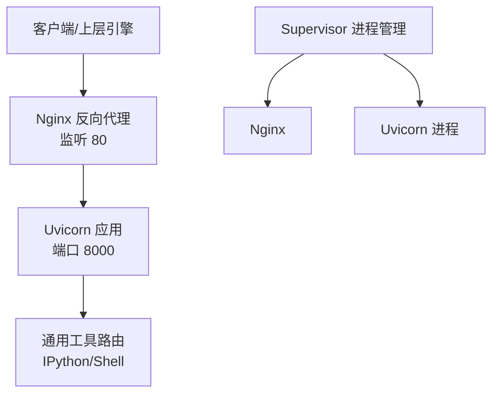
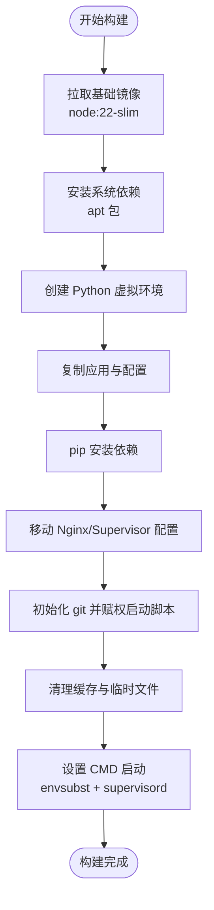
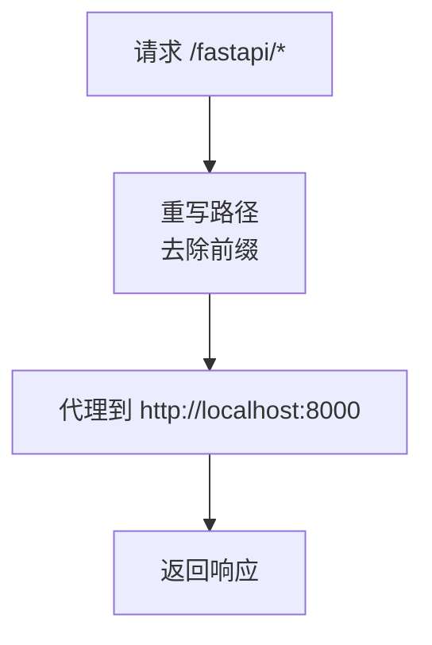
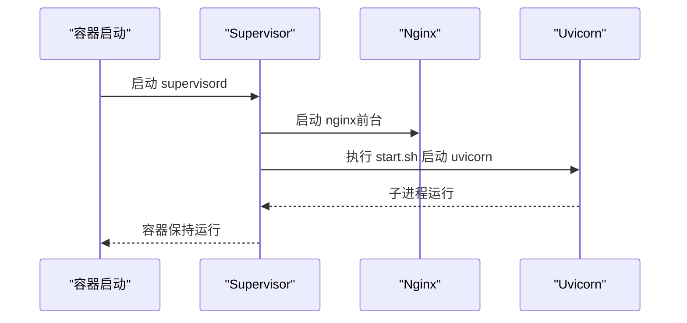
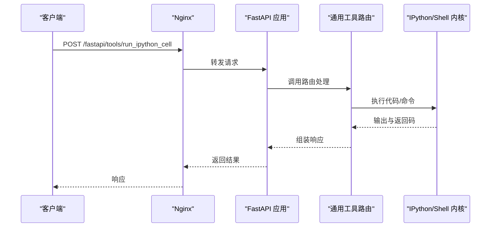
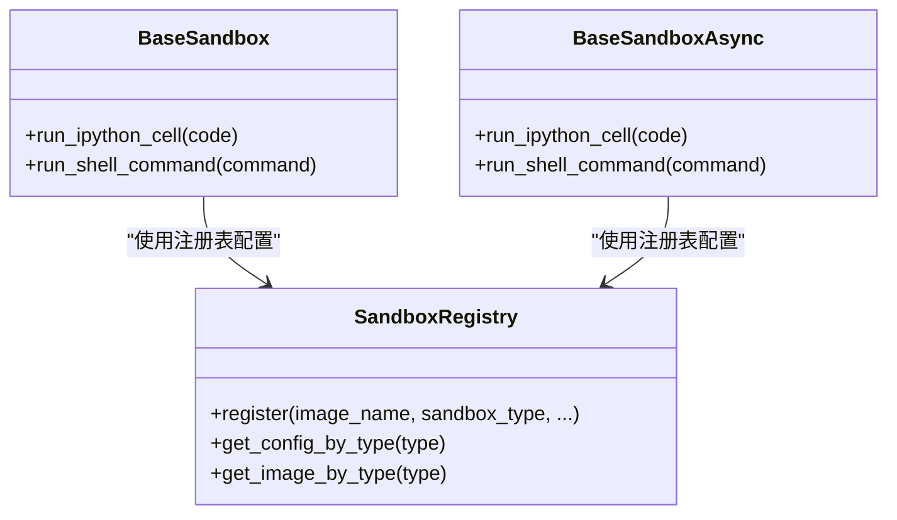
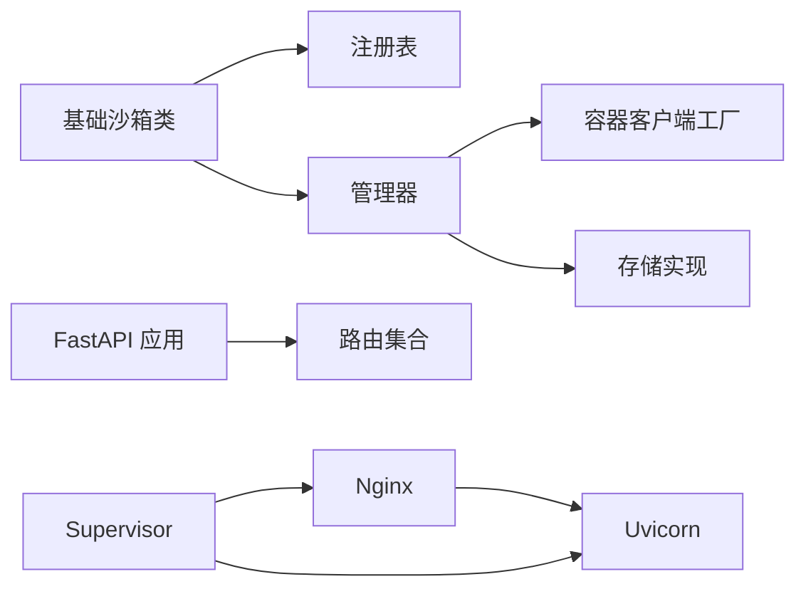

# 基础沙箱

<cite>
**本文引用的文件**
- [Dockerfile（基础沙箱）](file://src/agentscope_runtime/sandbox/box/base/Dockerfile)
- [基础沙箱类定义](file://src/agentscope_runtime/sandbox/box/base/base_sandbox.py)
- [Nginx 配置模板](file://src/agentscope_runtime/sandbox/box/base/box/config/nginx.conf.template)
- [Supervisor 配置](file://src/agentscope_runtime/sandbox/box/base/box/config/supervisord.conf)
- [启动脚本](file://src/agentscope_runtime/sandbox/box/base/box/scripts/start.sh)
- [依赖清单 requirements.txt](file://src/agentscope_runtime/sandbox/box/base/box/requirements.txt)
- [共享应用入口 app.py](file://src/agentscope_runtime/sandbox/box/shared/app.py)
- [通用工具路由 generic.py](file://src/agentscope_runtime/sandbox/box/shared/routers/generic.py)
- [沙箱基类 sandbox.py](file://src/agentscope_runtime/sandbox/box/sandbox.py)
- [沙箱注册表 registry.py](file://src/agentscope_runtime/sandbox/registry.py)
- [沙箱管理器 sandbox_manager.py](file://src/agentscope_runtime/sandbox/manager/sandbox_manager.py)
- [沙箱服务 sandbox_service.py](file://src/agentscope_runtime/engine/services/sandbox/sandbox_service.py)
- [沙箱服务工厂 sandbox_service_factory.py](file://src/agentscope_runtime/engine/services/sandbox/sandbox_service_factory.py)
- [示例自定义沙箱 Dockerfile](file://examples/sandbox/custom_sandbox/Dockerfile)
</cite>

## 目录
1. [简介](#简介)
2. [项目结构](#项目结构)
3. [核心组件](#核心组件)
4. [架构总览](#架构总览)
5. [详细组件分析](#详细组件分析)
6. [依赖关系分析](#依赖关系分析)
7. [性能与安全考量](#性能与安全考量)
8. [使用示例与配置参数](#使用示例与配置参数)
9. [故障排除指南](#故障排除指南)
10. [结论](#结论)

## 简介
本文件面向 AgentScope Runtime 的“基础沙箱”，系统性阐述其设计理念、Docker 容器配置与启动脚本机制、Nginx 反向代理、Supervisor 进程管理与启动脚本执行流程、网络与文件系统挂载策略、环境变量设置、Dockerfile 构建与依赖管理、镜像优化策略，并提供使用示例、配置参数与故障排除建议。目标是帮助开发者在本地或远端环境中快速理解并正确使用基础沙箱。

## 项目结构
基础沙箱由以下关键部分组成：
- Dockerfile：定义运行时基础镜像、安装依赖、复制应用与配置、设置 CMD 启动命令。
- Nginx 模板：定义反向代理规则，将 /fastapi 路径转发至后端服务。
- Supervisor 配置：统一管理 FastAPI 应用与 Nginx 的生命周期。
- 启动脚本：启动 Uvicorn 服务，供 Supervisor 管理。
- 共享应用与路由：FastAPI 应用与通用工具接口（如 IPython 执行、Shell 命令执行）。
- 沙箱类与注册表：定义基础沙箱类型、注册镜像与默认配置。
- 管理器与服务：负责容器生命周期、会话绑定、资源池化与健康检查。

```mermaid
graph TB
subgraph "容器镜像层"
D["Dockerfile<br/>基础镜像与安装"]
NginxCfg["nginx.conf.template<br/>反向代理规则"]
SupCfg["supervisord.conf<br/>进程管理"]
StartSh["start.sh<br/>启动 Uvicorn"]
Req["requirements.txt<br/>Python 依赖"]
end
subgraph "应用层"
AppPy["app.py<br/>FastAPI 应用"]
GenericR["generic.py<br/>通用工具路由"]
end
subgraph "运行时控制"
SBBox["base_sandbox.py<br/>基础沙箱类"]
Registry["registry.py<br/>沙箱注册表"]
SBMgr["sandbox_manager.py<br/>沙箱管理器"]
SBService["sandbox_service.py<br/>沙箱服务"]
SBFactory["sandbox_service_factory.py<br/>服务工厂"]
end
D --> NginxCfg
D --> SupCfg
D --> StartSh
D --> Req
Req --> AppPy
AppPy --> GenericR
SBBox --> Registry
SBMgr --> SBBox
SBService --> SBMgr
SBFactory --> SBService
```



**图表来源**
- [Dockerfile（基础沙箱）:1-51](file://src/agentscope_runtime/sandbox/box/base/Dockerfile#L1-L51)
- [Nginx 配置模板:1-19](file://src/agentscope_runtime/sandbox/box/base/box/config/nginx.conf.template#L1-L19)
- [Supervisor 配置:1-19](file://src/agentscope_runtime/sandbox/box/base/box/config/supervisord.conf#L1-L19)
- [启动脚本:1-5](file://src/agentscope_runtime/sandbox/box/base/box/scripts/start.sh#L1-L5)
- [依赖清单 requirements.txt:1-9](file://src/agentscope_runtime/sandbox/box/base/box/requirements.txt#L1-L9)
- [共享应用入口 app.py:1-46](file://src/agentscope_runtime/sandbox/box/shared/app.py#L1-L46)
- [通用工具路由 generic.py:1-200](file://src/agentscope_runtime/sandbox/box/shared/routers/generic.py#L1-L200)
- [基础沙箱类定义:1-102](file://src/agentscope_runtime/sandbox/box/base/base_sandbox.py#L1-L102)
- [沙箱注册表 registry.py:1-131](file://src/agentscope_runtime/sandbox/registry.py#L1-L131)
- [沙箱管理器 sandbox_manager.py:1-800](file://src/agentscope_runtime/sandbox/manager/sandbox_manager.py#L1-L800)
- [沙箱服务 sandbox_service.py:1-200](file://src/agentscope_runtime/engine/services/sandbox/sandbox_service.py#L1-L200)
- [沙箱服务工厂 sandbox_service_factory.py:1-50](file://src/agentscope_runtime/engine/services/sandbox/sandbox_service_factory.py#L1-L50)

**章节来源**
- [Dockerfile（基础沙箱）:1-51](file://src/agentscope_runtime/sandbox/box/base/Dockerfile#L1-L51)
- [基础沙箱类定义:1-102](file://src/agentscope_runtime/sandbox/box/base/base_sandbox.py#L1-L102)
- [Nginx 配置模板:1-19](file://src/agentscope_runtime/sandbox/box/base/box/config/nginx.conf.template#L1-L19)
- [Supervisor 配置:1-19](file://src/agentscope_runtime/sandbox/box/base/box/config/supervisord.conf#L1-L19)
- [启动脚本:1-5](file://src/agentscope_runtime/sandbox/box/base/box/scripts/start.sh#L1-L5)
- [共享应用入口 app.py:1-46](file://src/agentscope_runtime/sandbox/box/shared/app.py#L1-L46)
- [通用工具路由 generic.py:1-200](file://src/agentscope_runtime/sandbox/box/shared/routers/generic.py#L1-L200)
- [沙箱注册表 registry.py:1-131](file://src/agentscope_runtime/sandbox/registry.py#L1-L131)
- [沙箱管理器 sandbox_manager.py:1-800](file://src/agentscope_runtime/sandbox/manager/sandbox_manager.py#L1-L800)
- [沙箱服务 sandbox_service.py:1-200](file://src/agentscope_runtime/engine/services/sandbox/sandbox_service.py#L1-L200)
- [沙箱服务工厂 sandbox_service_factory.py:1-50](file://src/agentscope_runtime/engine/services/sandbox/sandbox_service_factory.py#L1-L50)

## 核心组件
- 基础沙箱类：提供同步与异步两种接口，封装调用工具方法（如运行 IPython 单元格、执行 Shell 命令），并通过注册表与管理器协作完成容器生命周期管理。
- 注册表：以装饰器方式注册沙箱类型与镜像信息，支持资源限制、超时、安全等级等配置。
- 管理器：负责创建/释放容器、连接池、心跳扫描、会话映射、存储与文件系统挂载策略。
- 服务与工厂：对外暴露统一的沙箱服务接口，支持远程模式与嵌入式模式，便于集成到上层引擎。

**章节来源**
- [基础沙箱类定义:1-102](file://src/agentscope_runtime/sandbox/box/base/base_sandbox.py#L1-L102)
- [沙箱注册表 registry.py:1-131](file://src/agentscope_runtime/sandbox/registry.py#L1-L131)
- [沙箱管理器 sandbox_manager.py:1-800](file://src/agentscope_runtime/sandbox/manager/sandbox_manager.py#L1-L800)
- [沙箱服务 sandbox_service.py:1-200](file://src/agentscope_runtime/engine/services/sandbox/sandbox_service.py#L1-L200)
- [沙箱服务工厂 sandbox_service_factory.py:1-50](file://src/agentscope_runtime/engine/services/sandbox/sandbox_service_factory.py#L1-L50)

## 架构总览
基础沙箱采用“容器内多进程协同”的架构：Supervisor 同时管理 Nginx 与 FastAPI 应用；Nginx 将 /fastapi 路径转发至本地 8000 端口的 Uvicorn 服务；应用通过路由提供通用工具能力（IPython 执行、Shell 命令执行）；上层通过沙箱服务与管理器完成容器编排与会话绑定。



**图表来源**
- [Nginx 配置模板:1-19](file://src/agentscope_runtime/sandbox/box/base/box/config/nginx.conf.template#L1-L19)
- [Supervisor 配置:1-19](file://src/agentscope_runtime/sandbox/box/base/box/config/supervisord.conf#L1-L19)
- [启动脚本:1-5](file://src/agentscope_runtime/sandbox/box/base/box/scripts/start.sh#L1-L5)
- [共享应用入口 app.py:1-46](file://src/agentscope_runtime/sandbox/box/shared/app.py#L1-L46)
- [通用工具路由 generic.py:1-200](file://src/agentscope_runtime/sandbox/box/shared/routers/generic.py#L1-L200)

## 详细组件分析

### 设计理念
- 最小可用原则：仅包含运行时所需组件（Nginx、Supervisor、FastAPI、IPython、Shell 工具），避免冗余。
- 安全与隔离：通过容器隔离与只读挂载策略（在管理器中实现）降低风险。
- 可扩展性：通过注册表与服务工厂支持不同后端与配置，便于接入其他沙箱类型。

### Dockerfile 构建与镜像优化
- 基础镜像与环境变量：基于 Node slim 镜像，设置生产环境变量与工作目录。
- 系统依赖：安装 Python3、pip、venv、build-essential、curl、git、supervisor、vim、nginx、gettext-base 等。
- Python 环境：创建虚拟环境并安装 requirements.txt 中的依赖。
- 配置与脚本：复制共享应用、路由、依赖模块与沙箱配置；移动 Nginx 模板与 Supervisor 配置；赋予启动脚本可执行权限。
- 清理与优化：清理 pip、apt、npm 缓存与临时文件，减小镜像体积。
- 启动命令：使用 envsubst 替换模板中的环境变量（如 SECRET_TOKEN、NGINX_TIMEOUT），生成最终 Nginx 配置，然后启动 Supervisor。



**图表来源**
- [Dockerfile（基础沙箱）:1-51](file://src/agentscope_runtime/sandbox/box/base/Dockerfile#L1-L51)

**章节来源**
- [Dockerfile（基础沙箱）:1-51](file://src/agentscope_runtime/sandbox/box/base/Dockerfile#L1-L51)
- [依赖清单 requirements.txt:1-9](file://src/agentscope_runtime/sandbox/box/base/box/requirements.txt#L1-L9)

### Nginx 反向代理配置
- 监听 80 端口，将 /fastapi 路径重写后转发至本地 8000 端口的 FastAPI 应用。
- 支持通过环境变量 NGINX_TIMEOUT 控制连接、发送与读取超时时间，便于适配不同场景。



**图表来源**
- [Nginx 配置模板:1-19](file://src/agentscope_runtime/sandbox/box/base/box/config/nginx.conf.template#L1-L19)

**章节来源**
- [Nginx 配置模板:1-19](file://src/agentscope_runtime/sandbox/box/base/box/config/nginx.conf.template#L1-L19)

### Supervisor 进程管理与启动脚本
- Supervisor 管理两个主进程：
  - agentscope_runtime：执行启动脚本，启动 Uvicorn 应用。
  - nginx：以前台守护模式运行。
- 启动脚本：后台启动 Uvicorn，等待子进程，确保容器不退出。
- 日志：分别输出到独立日志文件，便于排查。



**图表来源**
- [Supervisor 配置:1-19](file://src/agentscope_runtime/sandbox/box/base/box/config/supervisord.conf#L1-L19)
- [启动脚本:1-5](file://src/agentscope_runtime/sandbox/box/base/box/scripts/start.sh#L1-L5)

**章节来源**
- [Supervisor 配置:1-19](file://src/agentscope_runtime/sandbox/box/base/box/config/supervisord.conf#L1-L19)
- [启动脚本:1-5](file://src/agentscope_runtime/sandbox/box/base/box/scripts/start.sh#L1-L5)

### 网络配置
- 外部访问：Nginx 监听 80 端口，通过 /fastapi 路由访问后端服务。
- 内部通信：后端服务监听 8000 端口，Supervisor 管理进程间关系。
- 超时控制：通过 NGINX_TIMEOUT 环境变量统一控制代理层超时。

**章节来源**
- [Nginx 配置模板:1-19](file://src/agentscope_runtime/sandbox/box/base/box/config/nginx.conf.template#L1-L19)
- [Supervisor 配置:1-19](file://src/agentscope_runtime/sandbox/box/base/box/config/supervisord.conf#L1-L19)

### 文件系统挂载与环境变量
- 文件系统挂载：管理器根据配置决定是否允许挂载目录、默认挂载目录、只读挂载策略等；基础沙箱支持在嵌入式模式下指定工作目录挂载。
- 环境变量：
  - SECRET_TOKEN：用于 FastAPI 路由鉴权。
  - NGINX_TIMEOUT：Nginx 代理超时秒数。
  - Dockerfile 中还包含示例自定义沙箱所需的第三方 API 密钥（如 TAVILY_API_KEY、AMAP_MAPS_API_KEY），基础沙箱未强制要求。

**章节来源**
- [沙箱管理器 sandbox_manager.py:1-800](file://src/agentscope_runtime/sandbox/manager/sandbox_manager.py#L1-L800)
- [Dockerfile（基础沙箱）:1-51](file://src/agentscope_runtime/sandbox/box/base/Dockerfile#L1-L51)
- [示例自定义沙箱 Dockerfile:1-84](file://examples/sandbox/custom_sandbox/Dockerfile#L1-L84)

### 通用工具接口（IPython 与 Shell）
- IPython 单元格执行：在状态化 IPython 内核中执行代码，分离捕获 stdout/stderr，按配置返回内容列表与错误标记。
- Shell 命令执行：异步执行命令，收集标准输出、标准错误与返回码，按配置返回内容列表与错误标记。
- 鉴权：所有路由均依赖 SECRET_TOKEN 校验。



**图表来源**
- [共享应用入口 app.py:1-46](file://src/agentscope_runtime/sandbox/box/shared/app.py#L1-L46)
- [通用工具路由 generic.py:1-200](file://src/agentscope_runtime/sandbox/box/shared/routers/generic.py#L1-L200)

**章节来源**
- [共享应用入口 app.py:1-46](file://src/agentscope_runtime/sandbox/box/shared/app.py#L1-L46)
- [通用工具路由 generic.py:1-200](file://src/agentscope_runtime/sandbox/box/shared/routers/generic.py#L1-L200)

### 沙箱类与注册表
- 基础沙箱类：提供 run_ipython_cell 与 run_shell_command 方法，封装工具调用。
- 注册表：以装饰器注册镜像名称、类型、资源限制、超时、安全等级、环境变量与运行时配置，支持按类型查询与映射。



**图表来源**
- [基础沙箱类定义:1-102](file://src/agentscope_runtime/sandbox/box/base/base_sandbox.py#L1-L102)
- [沙箱注册表 registry.py:1-131](file://src/agentscope_runtime/sandbox/registry.py#L1-L131)

**章节来源**
- [基础沙箱类定义:1-102](file://src/agentscope_runtime/sandbox/box/base/base_sandbox.py#L1-L102)
- [沙箱注册表 registry.py:1-131](file://src/agentscope_runtime/sandbox/registry.py#L1-L131)

### 管理器与服务
- 管理器：支持远程与嵌入式模式，负责容器创建/释放、会话映射、心跳扫描、资源池化与存储选择（本地/OSS）。
- 服务：对外提供连接/断开、健康检查、会话生命周期管理；支持在停止时释放关联沙箱。

```mermaid
sequenceDiagram
participant Engine as "上层引擎"
participant Service as "SandboxService"
participant Manager as "SandboxManager"
participant Box as "Sandbox 实例"
Engine->>Service : connect(session_id, user_id, types)
Service->>Manager : 创建/获取会话映射
Manager-->>Service : 返回容器标识
Service->>Box : 构造沙箱实例
Box-->>Engine : 提供工具调用接口
```

**图表来源**
- [沙箱服务 sandbox_service.py:1-200](file://src/agentscope_runtime/engine/services/sandbox/sandbox_service.py#L1-L200)
- [沙箱管理器 sandbox_manager.py:1-800](file://src/agentscope_runtime/sandbox/manager/sandbox_manager.py#L1-L800)
- [沙箱基类 sandbox.py:1-200](file://src/agentscope_runtime/sandbox/box/sandbox.py#L1-L200)

**章节来源**
- [沙箱服务 sandbox_service.py:1-200](file://src/agentscope_runtime/engine/services/sandbox/sandbox_service.py#L1-L200)
- [沙箱管理器 sandbox_manager.py:1-800](file://src/agentscope_runtime/sandbox/manager/sandbox_manager.py#L1-L800)
- [沙箱基类 sandbox.py:1-200](file://src/agentscope_runtime/sandbox/box/sandbox.py#L1-L200)

## 依赖关系分析
- 组件耦合：
  - 基础沙箱类依赖注册表与管理器；管理器依赖容器客户端工厂与存储实现。
  - 应用层路由依赖 FastAPI 与 IPython 内核；Nginx 与 Supervisor 作为基础设施层。
- 外部依赖：
  - Docker 引擎（用于容器创建/管理）。
  - Redis（可选，用于会话映射与队列）。
  - OSS（可选，用于文件存储）。



**图表来源**
- [基础沙箱类定义:1-102](file://src/agentscope_runtime/sandbox/box/base/base_sandbox.py#L1-L102)
- [沙箱注册表 registry.py:1-131](file://src/agentscope_runtime/sandbox/registry.py#L1-L131)
- [沙箱管理器 sandbox_manager.py:1-800](file://src/agentscope_runtime/sandbox/manager/sandbox_manager.py#L1-L800)
- [共享应用入口 app.py:1-46](file://src/agentscope_runtime/sandbox/box/shared/app.py#L1-L46)
- [通用工具路由 generic.py:1-200](file://src/agentscope_runtime/sandbox/box/shared/routers/generic.py#L1-L200)
- [Supervisor 配置:1-19](file://src/agentscope_runtime/sandbox/box/base/box/config/supervisord.conf#L1-L19)
- [Nginx 配置模板:1-19](file://src/agentscope_runtime/sandbox/box/base/box/config/nginx.conf.template#L1-L19)

**章节来源**
- [基础沙箱类定义:1-102](file://src/agentscope_runtime/sandbox/box/base/base_sandbox.py#L1-L102)
- [沙箱注册表 registry.py:1-131](file://src/agentscope_runtime/sandbox/registry.py#L1-L131)
- [沙箱管理器 sandbox_manager.py:1-800](file://src/agentscope_runtime/sandbox/manager/sandbox_manager.py#L1-L800)
- [共享应用入口 app.py:1-46](file://src/agentscope_runtime/sandbox/box/shared/app.py#L1-L46)
- [通用工具路由 generic.py:1-200](file://src/agentscope_runtime/sandbox/box/shared/routers/generic.py#L1-L200)
- [Supervisor 配置:1-19](file://src/agentscope_runtime/sandbox/box/base/box/config/supervisord.conf#L1-L19)
- [Nginx 配置模板:1-19](file://src/agentscope_runtime/sandbox/box/base/box/config/nginx.conf.template#L1-L19)

## 性能与安全考量
- 性能：
  - 使用 Supervisor 统一管理进程，减少进程碎片与资源浪费。
  - Nginx 代理层可复用连接，结合 NGINX_TIMEOUT 控制超时，平衡吞吐与稳定性。
  - Uvicorn 默认单 worker，适合轻量场景；如需并发可调整。
- 安全：
  - 通过 SECRET_TOKEN 对路由进行鉴权，避免未授权访问。
  - 容器内最小权限安装依赖，避免不必要的系统包。
  - 文件系统挂载策略可在管理器中配置为只读或指定目录，降低持久化风险。

[本节为通用指导，无需列出具体文件来源]

## 使用示例与配置参数

### 快速开始（嵌入式模式）
- 在本地直接创建基础沙箱，自动从池中获取或新建容器，进入上下文后即可调用工具方法。
- 示例步骤（不含代码片段）：
  1) 初始化沙箱服务工厂，默认后端为 default。
  2) 通过服务连接会话，获取基础沙箱实例。
  3) 在沙箱上下文中调用 run_ipython_cell 或 run_shell_command。
  4) 退出上下文或显式关闭，释放容器。

**章节来源**
- [沙箱服务 sandbox_service.py:1-200](file://src/agentscope_runtime/engine/services/sandbox/sandbox_service.py#L1-L200)
- [沙箱基类 sandbox.py:1-200](file://src/agentscope_runtime/sandbox/box/sandbox.py#L1-L200)
- [基础沙箱类定义:1-102](file://src/agentscope_runtime/sandbox/box/base/base_sandbox.py#L1-L102)

### 远程模式
- 通过 base_url 指向远端沙箱管理器，使用 bearer_token 进行鉴权。
- 适用于分布式部署与多租户场景。

**章节来源**
- [沙箱基类 sandbox.py:1-200](file://src/agentscope_runtime/sandbox/box/sandbox.py#L1-L200)
- [沙箱服务 sandbox_service.py:1-200](file://src/agentscope_runtime/engine/services/sandbox/sandbox_service.py#L1-L200)

### 关键配置参数
- SECRET_TOKEN：用于鉴权，Dockerfile 中通过 envsubst 注入。
- NGINX_TIMEOUT：代理超时秒数，影响连接、发送与读取超时。
- 环境变量（示例自定义沙箱）：TAVILY_API_KEY、AMAP_MAPS_API_KEY（基础沙箱未强制要求）。
- 管理器配置（示例字段）：allow_mount_dir、default_mount_dir、readonly_mounts、storage_folder、redis_enabled、container_deployment、pool_size 等。

**章节来源**
- [Dockerfile（基础沙箱）:1-51](file://src/agentscope_runtime/sandbox/box/base/Dockerfile#L1-L51)
- [Nginx 配置模板:1-19](file://src/agentscope_runtime/sandbox/box/base/box/config/nginx.conf.template#L1-L19)
- [示例自定义沙箱 Dockerfile:1-84](file://examples/sandbox/custom_sandbox/Dockerfile#L1-L84)
- [沙箱管理器 sandbox_manager.py:1-800](file://src/agentscope_runtime/sandbox/manager/sandbox_manager.py#L1-L800)

## 故障排除指南
- 容器无法启动或进程退出：
  - 检查 Supervisor 配置与日志文件（agentscope_runtime.out.log、nginx.out.log）。
  - 确认启动脚本已赋权且 Uvicorn 可正常启动。
- 代理超时或连接失败：
  - 调整 NGINX_TIMEOUT，确认 Nginx 模板替换成功。
- 鉴权失败：
  - 确认请求头携带正确的 Bearer Token，或 SECRET_TOKEN 设置正确。
- 工具调用异常：
  - 查看通用工具路由返回的错误详情，关注 stdout/stderr 与返回码。
- 资源不足或池耗尽：
  - 检查 max_sandbox_instances 限制与池大小，必要时扩容或释放资源。

**章节来源**
- [Supervisor 配置:1-19](file://src/agentscope_runtime/sandbox/box/base/box/config/supervisord.conf#L1-L19)
- [启动脚本:1-5](file://src/agentscope_runtime/sandbox/box/base/box/scripts/start.sh#L1-L5)
- [Nginx 配置模板:1-19](file://src/agentscope_runtime/sandbox/box/base/box/config/nginx.conf.template#L1-L19)
- [通用工具路由 generic.py:1-200](file://src/agentscope_runtime/sandbox/box/shared/routers/generic.py#L1-L200)
- [沙箱管理器 sandbox_manager.py:1-800](file://src/agentscope_runtime/sandbox/manager/sandbox_manager.py#L1-L800)

## 结论
基础沙箱通过“容器 + Nginx + Supervisor + FastAPI”的组合，提供了稳定、可扩展且易于集成的运行时环境。其设计强调最小化依赖、清晰的进程边界与统一的鉴权机制，配合管理器与服务层实现灵活的生命周期与会话管理。遵循本文的配置参数与故障排除建议，可在本地或远端环境中高效部署与维护基础沙箱。