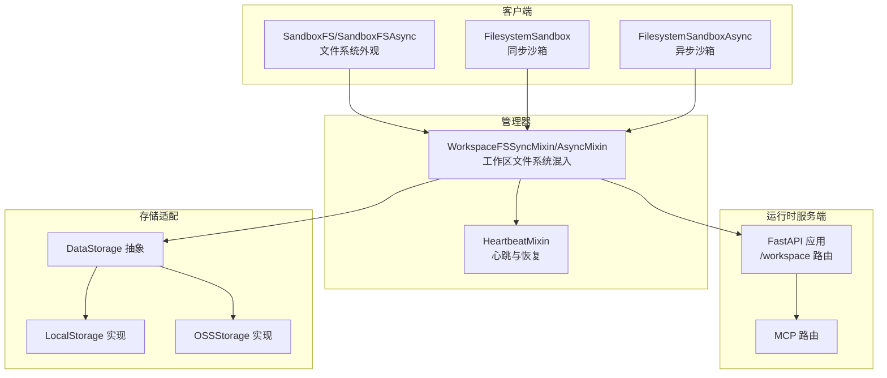
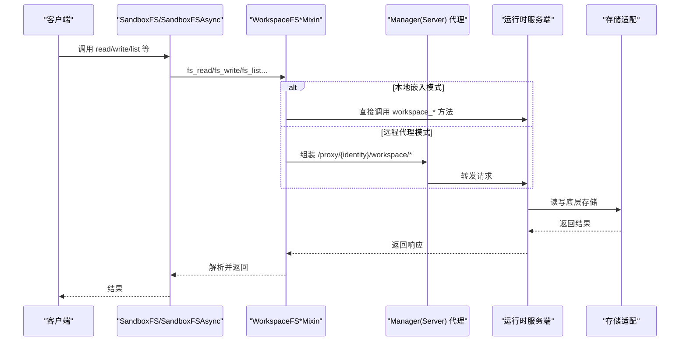
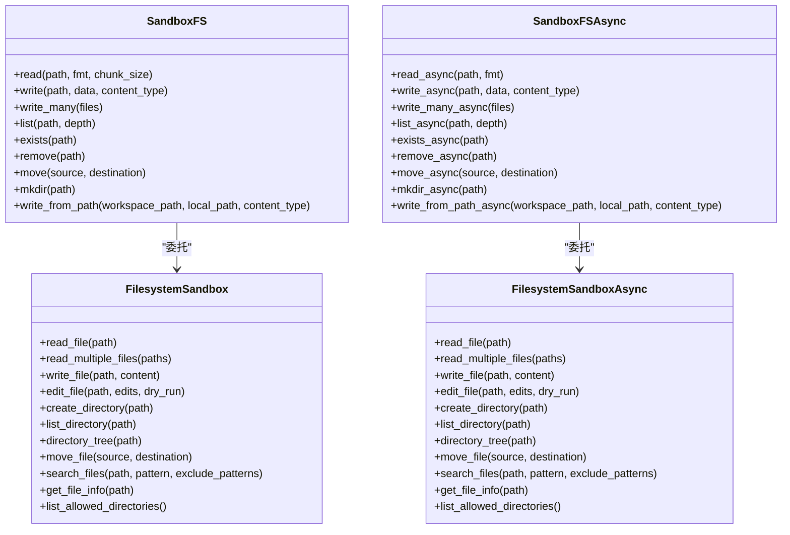
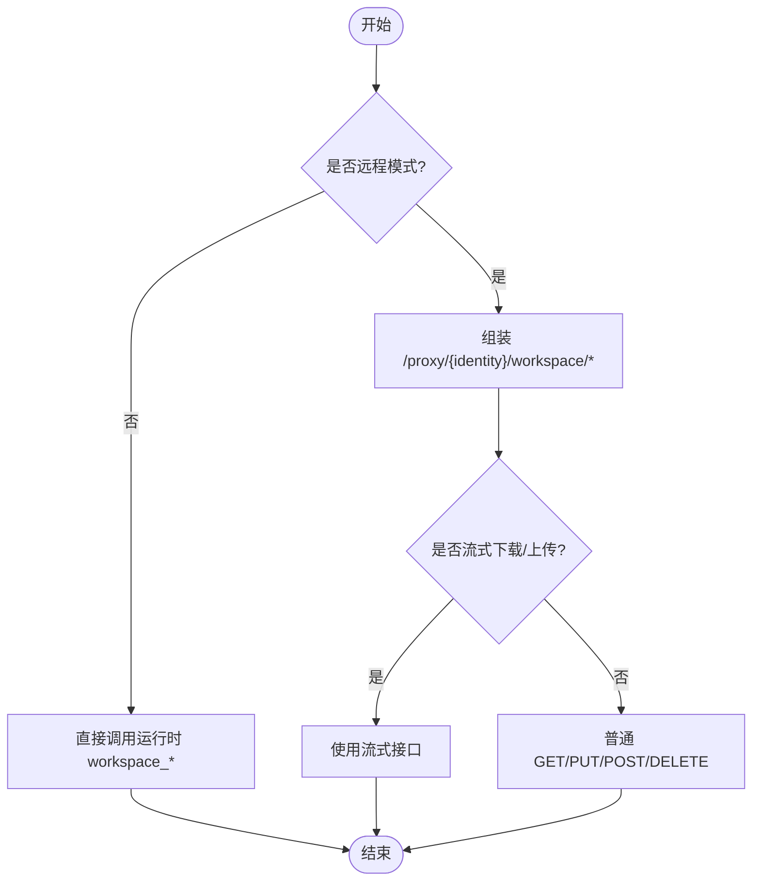
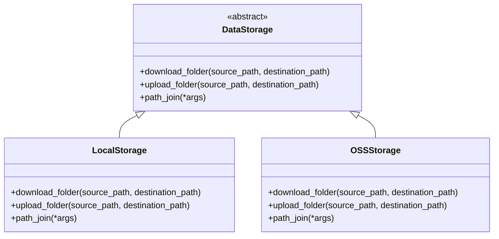
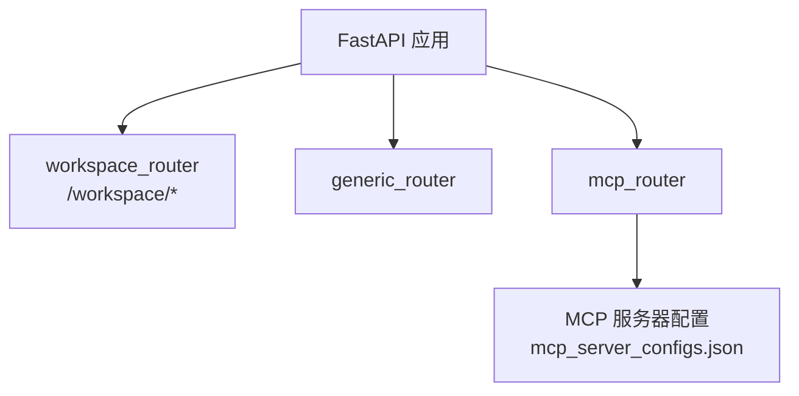
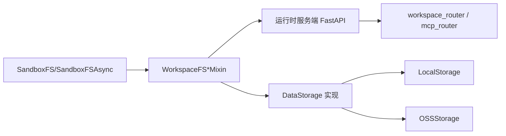

# 文件系统沙箱

<cite>
**本文引用的文件**
- [filesystem_sandbox.py](file://src/agentscope_runtime/sandbox/box/filesystem/filesystem_sandbox.py)
- [fs.py](file://src/agentscope_runtime/sandbox/box/components/fs.py)
- [workspace_mixin.py](file://src/agentscope_runtime/sandbox/manager/workspace_mixin.py)
- [data_storage.py](file://src/agentscope_runtime/sandbox/manager/storage/data_storage.py)
- [local_storage.py](file://src/agentscope_runtime/sandbox/manager/storage/local_storage.py)
- [oss_storage.py](file://src/agentscope_runtime/sandbox/manager/storage/oss_storage.py)
- [app.py](file://src/agentscope_runtime/sandbox/box/shared/app.py)
- [mcp_server_configs.json](file://src/agentscope_runtime/sandbox/box/filesystem/box/mcp_server_configs.json)
- [mcp_server_configs.json（示例）](file://examples/sandbox/custom_sandbox/box/mcp_server_configs.json)
- [heartbeat_mixin.py](file://src/agentscope_runtime/sandbox/manager/heartbeat_mixin.py)
</cite>

## 目录
1. [简介](#简介)
2. [项目结构](#项目结构)
3. [核心组件](#核心组件)
4. [架构总览](#架构总览)
5. [详细组件分析](#详细组件分析)
6. [依赖分析](#依赖分析)
7. [性能考虑](#性能考虑)
8. [故障排查指南](#故障排查指南)
9. [结论](#结论)
10. [附录](#附录)

## 简介
本技术文档围绕 AgentScope Runtime 的“文件系统沙箱”展开，系统性阐述其文件操作能力、MCP 协议支持与存储管理机制，覆盖文件读写、目录操作、权限控制、MCP 服务器配置、文件传输协议与数据同步、安全隔离与访问控制、数据保护策略，并提供使用场景、性能优化与故障恢复建议。

## 项目结构
文件系统沙箱由“客户端封装层 + 运行时服务端 + 管理器混入层 + 存储适配层”构成，形成从上到下的清晰分层：
- 客户端封装：面向用户的同步/异步文件系统接口，统一调用工具方法或管理器 API。
- 运行时服务端：FastAPI 应用，暴露工作区文件系统路由与 MCP 路由。
- 管理器混入：在本地嵌入模式与远程代理模式之间切换，实现统一的文件系统 API。
- 存储适配：抽象存储接口与本地/对象存储实现，支撑跨环境的数据持久化与同步。

图表来源
- [filesystem_sandbox.py:13-254](file://src/agentscope_runtime/sandbox/box/filesystem/filesystem_sandbox.py#L13-L254)
- [fs.py:17-279](file://src/agentscope_runtime/sandbox/box/components/fs.py#L17-L279)
- [workspace_mixin.py:113-702](file://src/agentscope_runtime/sandbox/manager/workspace_mixin.py#L113-L702)
- [app.py:1-46](file://src/agentscope_runtime/sandbox/box/shared/app.py#L1-L46)
- [data_storage.py:1-17](file://src/agentscope_runtime/sandbox/manager/storage/data_storage.py#L1-L17)
- [local_storage.py:1-45](file://src/agentscope_runtime/sandbox/manager/storage/local_storage.py#L1-L45)
- [oss_storage.py:1-90](file://src/agentscope_runtime/sandbox/manager/storage/oss_storage.py#L1-L90)
- [heartbeat_mixin.py:91-489](file://src/agentscope_runtime/sandbox/manager/heartbeat_mixin.py#L91-L489)

章节来源
- [filesystem_sandbox.py:13-254](file://src/agentscope_runtime/sandbox/box/filesystem/filesystem_sandbox.py#L13-L254)
- [fs.py:17-279](file://src/agentscope_runtime/sandbox/box/components/fs.py#L17-L279)
- [workspace_mixin.py:113-702](file://src/agentscope_runtime/sandbox/manager/workspace_mixin.py#L113-L702)
- [app.py:1-46](file://src/agentscope_runtime/sandbox/box/shared/app.py#L1-L46)
- [data_storage.py:1-17](file://src/agentscope_runtime/sandbox/manager/storage/data_storage.py#L1-L17)
- [local_storage.py:1-45](file://src/agentscope_runtime/sandbox/manager/storage/local_storage.py#L1-L45)
- [oss_storage.py:1-90](file://src/agentscope_runtime/sandbox/manager/storage/oss_storage.py#L1-L90)
- [heartbeat_mixin.py:91-489](file://src/agentscope_runtime/sandbox/manager/heartbeat_mixin.py#L91-L489)

## 核心组件
- 同步/异步沙箱类：提供统一的文件读写、目录操作、搜索与信息查询等能力，内部通过工具调用或管理器 API 访问运行时。
- 文件系统外观：对用户暴露简洁的 read/write/list/mkdir/move 等方法，支持文本/字节/流式读取与批量上传。
- 工作区文件系统混入：在本地嵌入与远程代理两种模式下，统一对接运行时的 /workspace 接口，支持流式下载/上传、批量上传、存在性检查、移动/删除、目录创建等。
- 存储适配：抽象 DataStorage 接口，提供 LocalStorage 与 OSSStorage 实现，分别用于本地复制与对象存储同步。
- 运行时服务端：FastAPI 应用，挂载 /workspace 前缀路由与 MCP 路由，受密钥令牌保护。
- 心跳与恢复：通过分布式锁与心跳时间戳，实现容器回收标记与自动恢复。

章节来源
- [filesystem_sandbox.py:37-156](file://src/agentscope_runtime/sandbox/box/filesystem/filesystem_sandbox.py#L37-L156)
- [fs.py:38-136](file://src/agentscope_runtime/sandbox/box/components/fs.py#L38-L136)
- [workspace_mixin.py:137-403](file://src/agentscope_runtime/sandbox/manager/workspace_mixin.py#L137-L403)
- [data_storage.py:5-17](file://src/agentscope_runtime/sandbox/manager/storage/data_storage.py#L5-L17)
- [local_storage.py:8-45](file://src/agentscope_runtime/sandbox/manager/storage/local_storage.py#L8-L45)
- [oss_storage.py:18-90](file://src/agentscope_runtime/sandbox/manager/storage/oss_storage.py#L18-L90)
- [app.py:16-41](file://src/agentscope_runtime/sandbox/box/shared/app.py#L16-L41)
- [heartbeat_mixin.py:180-371](file://src/agentscope_runtime/sandbox/manager/heartbeat_mixin.py#L180-L371)

## 架构总览
文件系统沙箱采用“客户端外观 + 管理器混入 + 运行时服务端 + 存储适配”的分层设计。客户端通过外观类发起请求；管理器混入根据当前模式选择直连运行时或经由代理转发；运行时服务端提供 /workspace 文件系统接口与 MCP 支持；存储适配负责本地与对象存储之间的数据同步。

图表来源
- [fs.py:38-136](file://src/agentscope_runtime/sandbox/box/components/fs.py#L38-L136)
- [workspace_mixin.py:137-403](file://src/agentscope_runtime/sandbox/manager/workspace_mixin.py#L137-L403)
- [app.py:33-40](file://src/agentscope_runtime/sandbox/box/shared/app.py#L33-L40)
- [data_storage.py:5-17](file://src/agentscope_runtime/sandbox/manager/storage/data_storage.py#L5-L17)

章节来源
- [fs.py:17-279](file://src/agentscope_runtime/sandbox/box/components/fs.py#L17-L279)
- [workspace_mixin.py:113-702](file://src/agentscope_runtime/sandbox/manager/workspace_mixin.py#L113-L702)
- [app.py:16-41](file://src/agentscope_runtime/sandbox/box/shared/app.py#L16-L41)

## 详细组件分析

### 文件系统外观与沙箱类
- 外观类 SandboxFS/SandboxFSAsync 提供统一的文件系统操作入口，包括读取（文本/字节/流）、写入（支持文件句柄流式上传）、批量上传、列表、存在性检查、移动/删除、目录创建、从本地路径写入等。
- 沙箱类 FilesystemSandbox/FilesystemSandboxAsync 将高层操作映射为工具调用或管理器 API，支持同步与异步两种形态。

图表来源
- [fs.py:17-279](file://src/agentscope_runtime/sandbox/box/components/fs.py#L17-L279)
- [filesystem_sandbox.py:20-254](file://src/agentscope_runtime/sandbox/box/filesystem/filesystem_sandbox.py#L20-L254)

章节来源
- [fs.py:17-279](file://src/agentscope_runtime/sandbox/box/components/fs.py#L17-L279)
- [filesystem_sandbox.py:20-254](file://src/agentscope_runtime/sandbox/box/filesystem/filesystem_sandbox.py#L20-L254)

### 工作区文件系统混入（本地/远程模式）
- 在本地嵌入模式：管理器直接建立到运行时的连接，调用其 workspace_* 方法。
- 在远程代理模式：管理器通过 /proxy/{identity}/workspace/* 代理请求，支持流式下载/上传、批量上传、存在性检查、移动/删除、目录创建等。
- 异步版本提供对应的 async API，使用 httpx 流式客户端与线程池避免阻塞事件循环。

图表来源
- [workspace_mixin.py:129-403](file://src/agentscope_runtime/sandbox/manager/workspace_mixin.py#L129-L403)

章节来源
- [workspace_mixin.py:113-702](file://src/agentscope_runtime/sandbox/manager/workspace_mixin.py#L113-L702)

### 存储管理机制（本地与对象存储）
- 抽象接口 DataStorage 定义下载/上传/路径拼接规范。
- LocalStorage 实现本地目录复制，支持绝对路径与相对路径处理。
- OSSStorage 实现基于 OSS 的目录同步，按前缀遍历对象，维护目录结构与文件内容一致性，利用 MD5 去重避免重复上传。

图表来源
- [data_storage.py:5-17](file://src/agentscope_runtime/sandbox/manager/storage/data_storage.py#L5-L17)
- [local_storage.py:8-45](file://src/agentscope_runtime/sandbox/manager/storage/local_storage.py#L8-L45)
- [oss_storage.py:18-90](file://src/agentscope_runtime/sandbox/manager/storage/oss_storage.py#L18-L90)

章节来源
- [data_storage.py:1-17](file://src/agentscope_runtime/sandbox/manager/storage/data_storage.py#L1-L17)
- [local_storage.py:1-45](file://src/agentscope_runtime/sandbox/manager/storage/local_storage.py#L1-L45)
- [oss_storage.py:1-90](file://src/agentscope_runtime/sandbox/manager/storage/oss_storage.py#L1-L90)

### 运行时服务端与 MCP 支持
- 运行时服务端通过 FastAPI 暴露 /workspace 前缀路由与通用路由、MCP 路由，并以依赖校验密钥令牌的方式进行访问控制。
- 文件系统沙箱的运行时容器配置中包含 MCP 服务器配置文件，用于启动浏览器自动化等能力；示例中展示了如何通过 npx 启动 playwright-mcp 并加载配置。

图表来源
- [app.py:16-41](file://src/agentscope_runtime/sandbox/box/shared/app.py#L16-L41)
- [mcp_server_configs.json](file://src/agentscope_runtime/sandbox/box/filesystem/box/mcp_server_configs.json)
- [mcp_server_configs.json（示例）:1-14](file://examples/sandbox/custom_sandbox/box/mcp_server_configs.json#L1-L14)

章节来源
- [app.py:1-46](file://src/agentscope_runtime/sandbox/box/shared/app.py#L1-L46)
- [mcp_server_configs.json](file://src/agentscope_runtime/sandbox/box/filesystem/box/mcp_server_configs.json)
- [mcp_server_configs.json（示例）:1-14](file://examples/sandbox/custom_sandbox/box/mcp_server_configs.json#L1-L14)

### 权限控制与安全隔离
- 访问控制：运行时服务端的路由均依赖密钥令牌校验，未通过校验的请求无法访问 /workspace 或 MCP 路由。
- 允许访问目录：沙箱类提供列出允许访问目录的能力，便于限制 Agent 的文件系统可见范围。
- 隔离策略：通过容器/沙箱边界与工作区命名空间隔离，结合心跳与回收标记，确保长时间无活动的会话被回收并可恢复。

章节来源
- [app.py:24-40](file://src/agentscope_runtime/sandbox/box/shared/app.py#L24-L40)
- [filesystem_sandbox.py:152-156](file://src/agentscope_runtime/sandbox/box/filesystem/filesystem_sandbox.py#L152-L156)
- [heartbeat_mixin.py:256-371](file://src/agentscope_runtime/sandbox/manager/heartbeat_mixin.py#L256-L371)

## 依赖分析
- 客户端外观与沙箱类依赖管理器混入提供的统一 API。
- 管理器混入在远程模式下依赖代理 URL 与 HTTP/HTTPX 客户端。
- 运行时服务端依赖 FastAPI 与路由模块，MCP 路由依赖 MCP 服务器配置。
- 存储适配独立于运行时，通过抽象接口解耦具体实现。

图表来源
- [fs.py:17-279](file://src/agentscope_runtime/sandbox/box/components/fs.py#L17-L279)
- [workspace_mixin.py:113-702](file://src/agentscope_runtime/sandbox/manager/workspace_mixin.py#L113-L702)
- [app.py:16-41](file://src/agentscope_runtime/sandbox/box/shared/app.py#L16-L41)
- [data_storage.py:5-17](file://src/agentscope_runtime/sandbox/manager/storage/data_storage.py#L5-L17)
- [local_storage.py:8-45](file://src/agentscope_runtime/sandbox/manager/storage/local_storage.py#L8-L45)
- [oss_storage.py:18-90](file://src/agentscope_runtime/sandbox/manager/storage/oss_storage.py#L18-L90)

章节来源
- [fs.py:17-279](file://src/agentscope_runtime/sandbox/box/components/fs.py#L17-L279)
- [workspace_mixin.py:113-702](file://src/agentscope_runtime/sandbox/manager/workspace_mixin.py#L113-L702)
- [app.py:16-41](file://src/agentscope_runtime/sandbox/box/shared/app.py#L16-L41)
- [data_storage.py:1-17](file://src/agentscope_runtime/sandbox/manager/storage/data_storage.py#L1-L17)
- [local_storage.py:1-45](file://src/agentscope_runtime/sandbox/manager/storage/local_storage.py#L1-L45)
- [oss_storage.py:1-90](file://src/agentscope_runtime/sandbox/manager/storage/oss_storage.py#L1-L90)

## 性能考虑
- 流式传输：远程模式支持流式下载/上传，减少内存占用，适合大文件传输。
- 批量上传：提供批量上传接口，降低网络往返次数。
- 异步 I/O：异步外观与混入使用线程池读取本地文件，避免阻塞事件循环。
- 对象存储去重：OSS 同步基于 MD5 校验，避免重复上传，提升带宽利用率。
- 心跳与回收：通过心跳维持活跃状态，及时回收闲置资源，保障整体性能稳定。

章节来源
- [workspace_mixin.py:163-178](file://src/agentscope_runtime/sandbox/manager/workspace_mixin.py#L163-L178)
- [workspace_mixin.py:516-517](file://src/agentscope_runtime/sandbox/manager/workspace_mixin.py#L516-L517)
- [oss_storage.py:69-85](file://src/agentscope_runtime/sandbox/manager/storage/oss_storage.py#L69-L85)
- [heartbeat_mixin.py:180-224](file://src/agentscope_runtime/sandbox/manager/heartbeat_mixin.py#L180-L224)

## 故障排查指南
- 访问被拒绝：确认运行时路由已启用密钥令牌校验，且请求头携带有效令牌。
- 远程模式不可用：检查 Manager(Server) 是否提供 /proxy/{identity}/workspace/* 代理端点。
- 文件不存在或路径错误：核对工作区路径与允许访问目录列表，确保路径合法且在白名单内。
- 上传失败：检查内容类型与大小限制，确认代理端点可达且超时设置合理。
- 回收与恢复：若出现长时间无响应导致回收，可通过心跳更新与恢复流程恢复会话。

章节来源
- [app.py:24-40](file://src/agentscope_runtime/sandbox/box/shared/app.py#L24-L40)
- [workspace_mixin.py:88-111](file://src/agentscope_runtime/sandbox/manager/workspace_mixin.py#L88-L111)
- [filesystem_sandbox.py:152-156](file://src/agentscope_runtime/sandbox/box/filesystem/filesystem_sandbox.py#L152-L156)
- [heartbeat_mixin.py:344-371](file://src/agentscope_runtime/sandbox/manager/heartbeat_mixin.py#L344-L371)

## 结论
文件系统沙箱通过外观类与管理器混入实现了统一、可移植的文件系统操作接口；在本地与远程模式间无缝切换；结合运行时服务端的路由与 MCP 支持，以及存储适配层的本地/对象存储能力，提供了安全、高效、可扩展的文件系统访问方案。配合心跳与回收机制，能够稳定地支撑多 Agent 的并发工作负载。

## 附录
- 使用场景建议
  - 代码生成与编辑：通过异步外观进行流式读写，提升交互体验。
  - 数据采集与归档：利用批量上传与对象存储同步，降低网络开销。
  - 可视化与自动化：结合 MCP 服务器配置，启用浏览器自动化等能力。
- 最佳实践
  - 明确允许访问目录，限制 Agent 的文件系统可见范围。
  - 大文件优先使用流式传输与批量上传。
  - 在远程模式下合理设置超时与重试策略。
  - 定期清理回收的会话，释放资源。