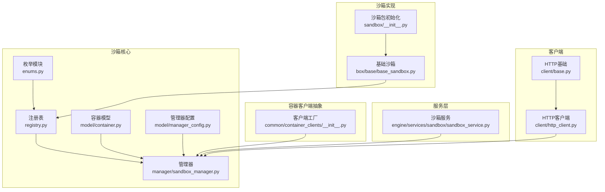
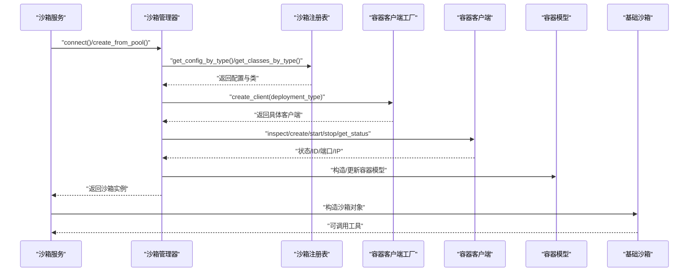
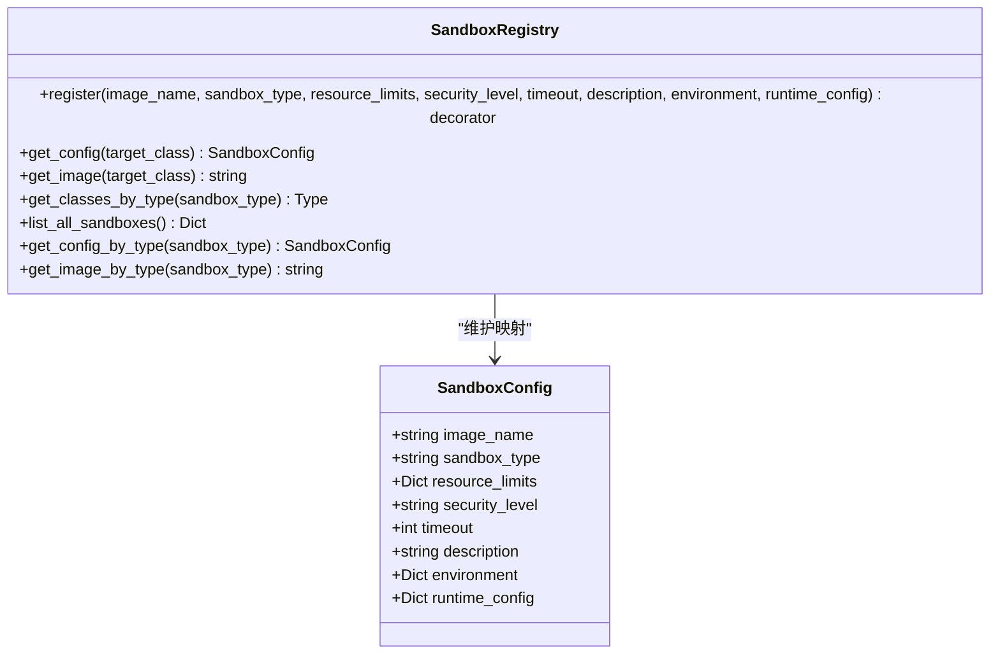
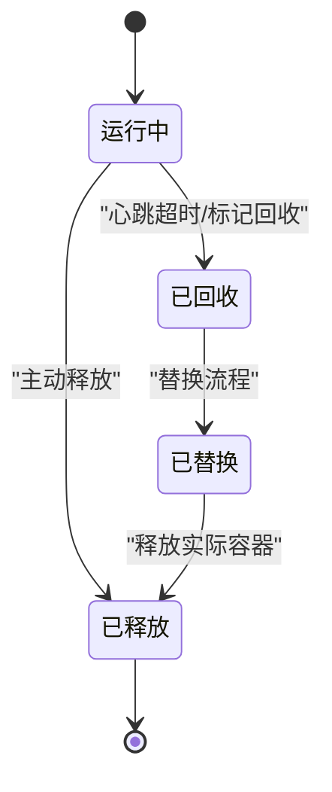
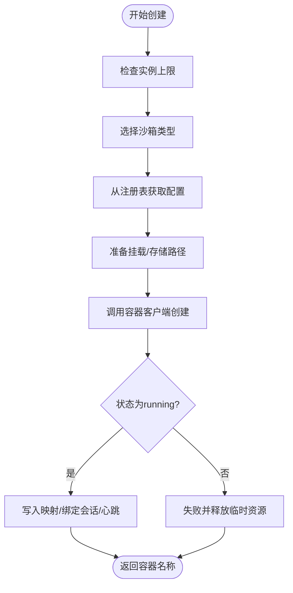
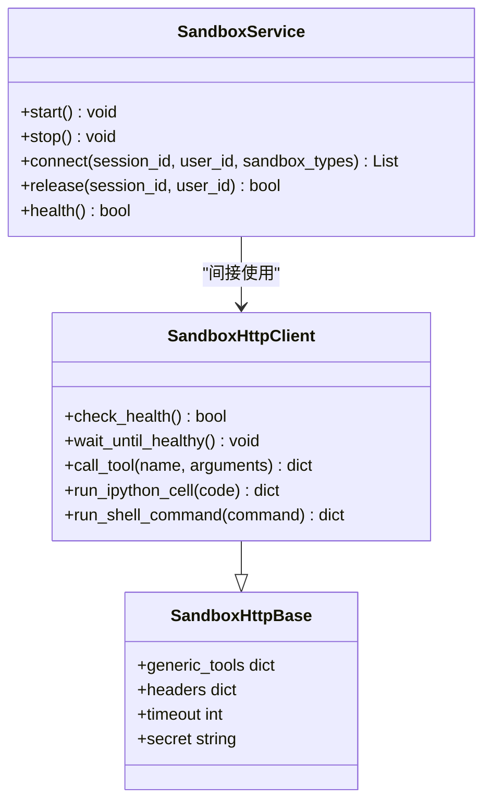
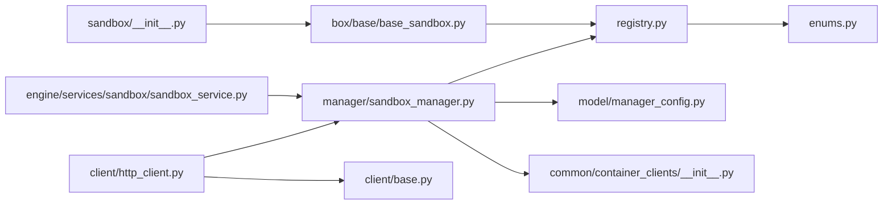

# 沙箱核心架构

<cite>
**本文档引用的文件**
- [src/agentscope_runtime/sandbox/__init__.py](file://src/agentscope_runtime/sandbox/__init__.py)
- [src/agentscope_runtime/sandbox/enums.py](file://src/agentscope_runtime/sandbox/enums.py)
- [src/agentscope_runtime/sandbox/registry.py](file://src/agentscope_runtime/sandbox/registry.py)
- [src/agentscope_runtime/sandbox/model/container.py](file://src/agentscope_runtime/sandbox/model/container.py)
- [src/agentscope_runtime/sandbox/model/manager_config.py](file://src/agentscope_runtime/sandbox/model/manager_config.py)
- [src/agentscope_runtime/sandbox/manager/sandbox_manager.py](file://src/agentscope_runtime/sandbox/manager/sandbox_manager.py)
- [src/agentscope_runtime/common/container_clients/__init__.py](file://src/agentscope_runtime/common/container_clients/__init__.py)
- [src/agentscope_runtime/engine/services/sandbox/sandbox_service.py](file://src/agentscope_runtime/engine/services/sandbox/sandbox_service.py)
- [src/agentscope_runtime/sandbox/client/base.py](file://src/agentscope_runtime/sandbox/client/base.py)
- [src/agentscope_runtime/sandbox/client/http_client.py](file://src/agentscope_runtime/sandbox/client/http_client.py)
- [src/agentscope_runtime/sandbox/box/base/base_sandbox.py](file://src/agentscope_runtime/sandbox/box/base/base_sandbox.py)
</cite>

## 目录
1. [简介](#简介)
2. [项目结构](#项目结构)
3. [核心组件](#核心组件)
4. [架构总览](#架构总览)
5. [详细组件分析](#详细组件分析)
6. [依赖关系分析](#依赖关系分析)
7. [性能考虑](#性能考虑)
8. [故障排查指南](#故障排查指南)
9. [结论](#结论)

## 简介
本文件面向AgentScope Runtime的沙箱核心架构，系统性阐述沙箱管理器的设计原理、注册机制与容器模型；详解沙箱类型枚举、构建流程与生命周期管理；解析沙箱注册表的类型发现与动态加载机制；并给出容器模型的数据结构、状态管理与资源分配策略。同时提供关键组件的交互关系图与扩展接口说明，帮助开发者在不直接阅读源码的情况下快速理解并扩展沙箱能力。

## 项目结构
AgentScope Runtime的沙箱子系统主要位于src/agentscope_runtime/sandbox目录下，围绕“类型枚举 → 注册表 → 管理器 → 客户端 → 具体沙箱实现”的层次化组织展开，并通过通用容器客户端工厂对接多种后端（Docker、K8s、AgentRun等）。

图表来源
- [src/agentscope_runtime/sandbox/enums.py:61-80](file://src/agentscope_runtime/sandbox/enums.py#L61-L80)
- [src/agentscope_runtime/sandbox/registry.py:33-131](file://src/agentscope_runtime/sandbox/registry.py#L33-L131)
- [src/agentscope_runtime/sandbox/model/container.py:19-158](file://src/agentscope_runtime/sandbox/model/container.py#L19-L158)
- [src/agentscope_runtime/sandbox/model/manager_config.py:11-376](file://src/agentscope_runtime/sandbox/model/manager_config.py#L11-L376)
- [src/agentscope_runtime/sandbox/manager/sandbox_manager.py:140-342](file://src/agentscope_runtime/sandbox/manager/sandbox_manager.py#L140-L342)
- [src/agentscope_runtime/common/container_clients/__init__.py:32-56](file://src/agentscope_runtime/common/container_clients/__init__.py#L32-L56)
- [src/agentscope_runtime/engine/services/sandbox/sandbox_service.py:11-238](file://src/agentscope_runtime/engine/services/sandbox/sandbox_service.py#L11-L238)
- [src/agentscope_runtime/sandbox/box/base/base_sandbox.py:11-102](file://src/agentscope_runtime/sandbox/box/base/base_sandbox.py#L11-L102)
- [src/agentscope_runtime/sandbox/__init__.py:1-33](file://src/agentscope_runtime/sandbox/__init__.py#L1-L33)
- [src/agentscope_runtime/sandbox/client/base.py:10-74](file://src/agentscope_runtime/sandbox/client/base.py#L10-L74)
- [src/agentscope_runtime/sandbox/client/http_client.py:20-207](file://src/agentscope_runtime/sandbox/client/http_client.py#L20-L207)

章节来源
- [src/agentscope_runtime/sandbox/__init__.py:1-33](file://src/agentscope_runtime/sandbox/__init__.py#L1-L33)
- [src/agentscope_runtime/sandbox/enums.py:61-80](file://src/agentscope_runtime/sandbox/enums.py#L61-L80)
- [src/agentscope_runtime/sandbox/registry.py:33-131](file://src/agentscope_runtime/sandbox/registry.py#L33-L131)
- [src/agentscope_runtime/sandbox/model/container.py:19-158](file://src/agentscope_runtime/sandbox/model/container.py#L19-L158)
- [src/agentscope_runtime/sandbox/model/manager_config.py:11-376](file://src/agentscope_runtime/sandbox/model/manager_config.py#L11-L376)
- [src/agentscope_runtime/sandbox/manager/sandbox_manager.py:140-342](file://src/agentscope_runtime/sandbox/manager/sandbox_manager.py#L140-L342)
- [src/agentscope_runtime/common/container_clients/__init__.py:32-56](file://src/agentscope_runtime/common/container_clients/__init__.py#L32-L56)
- [src/agentscope_runtime/engine/services/sandbox/sandbox_service.py:11-238](file://src/agentscope_runtime/engine/services/sandbox/sandbox_service.py#L11-L238)
- [src/agentscope_runtime/sandbox/client/base.py:10-74](file://src/agentscope_runtime/sandbox/client/base.py#L10-L74)
- [src/agentscope_runtime/sandbox/client/http_client.py:20-207](file://src/agentscope_runtime/sandbox/client/http_client.py#L20-L207)
- [src/agentscope_runtime/sandbox/box/base/base_sandbox.py:11-102](file://src/agentscope_runtime/sandbox/box/base/base_sandbox.py#L11-L102)

## 核心组件
- 类型枚举与动态扩展：通过自定义枚举元类支持内置与动态成员区分，提供运行时动态添加沙箱类型的机制。
- 注册表：集中管理沙箱类与其镜像、资源限制、超时、环境变量等配置，支持按类型查找与列表。
- 容器模型：以Pydantic模型描述容器实例的关键字段、状态与时间戳，提供兼容性与默认值处理。
- 管理器：负责池化复用、创建销毁、心跳扫描、回收标记、会话映射、存储上传下载等生命周期管理。
- 客户端工厂：按部署后端选择具体容器客户端，屏蔽不同平台差异。
- 服务层：对外暴露连接/释放/健康检查等API，协调管理器与沙箱实例。
- 基础沙箱实现：通过装饰器注册到注册表，提供通用工具调用入口。

章节来源
- [src/agentscope_runtime/sandbox/enums.py:5-80](file://src/agentscope_runtime/sandbox/enums.py#L5-L80)
- [src/agentscope_runtime/sandbox/registry.py:33-131](file://src/agentscope_runtime/sandbox/registry.py#L33-L131)
- [src/agentscope_runtime/sandbox/model/container.py:19-158](file://src/agentscope_runtime/sandbox/model/container.py#L19-L158)
- [src/agentscope_runtime/sandbox/manager/sandbox_manager.py:140-342](file://src/agentscope_runtime/sandbox/manager/sandbox_manager.py#L140-L342)
- [src/agentscope_runtime/common/container_clients/__init__.py:32-56](file://src/agentscope_runtime/common/container_clients/__init__.py#L32-L56)
- [src/agentscope_runtime/engine/services/sandbox/sandbox_service.py:11-238](file://src/agentscope_runtime/engine/services/sandbox/sandbox_service.py#L11-L238)
- [src/agentscope_runtime/sandbox/box/base/base_sandbox.py:11-102](file://src/agentscope_runtime/sandbox/box/base/base_sandbox.py#L11-L102)

## 架构总览
下图展示从服务层到管理器、注册表、容器模型与客户端工厂的整体交互路径，以及沙箱实现如何通过注册表被发现与实例化。

图表来源
- [src/agentscope_runtime/engine/services/sandbox/sandbox_service.py:82-201](file://src/agentscope_runtime/engine/services/sandbox/sandbox_service.py#L82-L201)
- [src/agentscope_runtime/sandbox/registry.py:93-131](file://src/agentscope_runtime/sandbox/registry.py#L93-L131)
- [src/agentscope_runtime/sandbox/manager/sandbox_manager.py:592-948](file://src/agentscope_runtime/sandbox/manager/sandbox_manager.py#L592-L948)
- [src/agentscope_runtime/common/container_clients/__init__.py:32-56](file://src/agentscope_runtime/common/container_clients/__init__.py#L32-L56)
- [src/agentscope_runtime/sandbox/model/container.py:19-158](file://src/agentscope_runtime/sandbox/model/container.py#L19-L158)
- [src/agentscope_runtime/sandbox/box/base/base_sandbox.py:11-34](file://src/agentscope_runtime/sandbox/box/base/base_sandbox.py#L11-L34)

## 详细组件分析

### 沙箱类型枚举与动态扩展
- 设计要点
  - 自定义元类在枚举创建时为每个成员打上builtin标记，便于区分内置与动态添加的类型。
  - 提供add_member方法在运行时向枚举中添加新成员，用于支持非内置类型（如自定义沙箱类型）。
  - 提供查询内置/动态成员的方法，便于注册表与管理器进行类型筛选与兼容处理。
- 关键字段
  - 内置类型覆盖基础、浏览器、文件系统、GUI、移动端、训练场景、AgentBay等。
  - 同步/异步类型成对出现，满足不同执行模式需求。
- 复杂度
  - 动态添加操作为O(n)（n为当前成员数），查询为O(1)。

章节来源
- [src/agentscope_runtime/sandbox/enums.py:5-80](file://src/agentscope_runtime/sandbox/enums.py#L5-L80)

### 沙箱注册表：类型发现与动态加载
- 职责
  - 维护“沙箱类 → 配置”与“类型 → 类”的双映射。
  - 支持装饰器式注册，自动完成类型标准化与映射建立。
  - 提供按类型/类查询配置、镜像名、列表所有沙箱等能力。
- 动态加载
  - 通过包初始化时导入各沙箱模块，触发装饰器注册，确保类型在应用启动时就位。
- 数据结构
  - _registry: 字典，键为类，值为SandboxConfig。
  - _type_registry: 字典，键为SandboxType，值为类。
- 配置转换
  - SandboxConfig在__post_init__中将资源限制映射到runtime_config，便于容器客户端使用。

图表来源
- [src/agentscope_runtime/sandbox/registry.py:33-131](file://src/agentscope_runtime/sandbox/registry.py#L33-L131)

章节来源
- [src/agentscope_runtime/sandbox/registry.py:33-131](file://src/agentscope_runtime/sandbox/registry.py#L33-L131)
- [src/agentscope_runtime/sandbox/__init__.py:1-33](file://src/agentscope_runtime/sandbox/__init__.py#L1-L33)

### 容器模型：数据结构、状态管理与资源分配
- 数据结构
  - 关键字段：session_id、container_id、container_name、url、ports、mount_dir、storage_path、runtime_token、version、meta、timeout、sandbox_type、state、session_ctx_id、last_active_at、recycled_at、released_at、updated_at、recycle_reason、redirect_to。
- 状态机
  - ContainerState包含WARM、RUNNING、RECYCLED、REPLACED、ERROR、RELEASED等状态，贯穿容器全生命周期。
- 兼容性与默认值
  - 通过model_validator确保meta与session_ctx_id双向同步、默认updated_at填充等。
- 资源分配
  - SandboxConfig将内存/CPU限制转换为runtime_config，供容器客户端使用。

图表来源
- [src/agentscope_runtime/sandbox/model/container.py:10-17](file://src/agentscope_runtime/sandbox/model/container.py#L10-L17)
- [src/agentscope_runtime/sandbox/model/container.py:82-124](file://src/agentscope_runtime/sandbox/model/container.py#L82-L124)

章节来源
- [src/agentscope_runtime/sandbox/model/container.py:19-158](file://src/agentscope_runtime/sandbox/model/container.py#L19-L158)

### 沙箱管理器：构建流程与生命周期管理
- 初始化与远程/本地模式
  - 支持远程模式（通过base_url与Bearer Token）与本地嵌入模式；本地模式下启动后台看门狗线程。
- 池化与预热
  - 通过Redis或内存队列维护多类型容器池，优先从池中取出可用容器；若池为空或不合规则新建。
- 创建流程
  - 选择目标类型 → 查询注册表 → 下载工作区 → 创建容器 → 校验状态 → 写入映射 → 绑定会话 → 记录心跳。
- 释放与回收
  - 支持REPLACED重定向释放、回收标记清理、会话映射解除、存储上传等。
- 异步/远程包装器
  - 通过装饰器统一处理本地执行与远程HTTP调用，保持接口一致性。

图表来源
- [src/agentscope_runtime/sandbox/manager/sandbox_manager.py:707-948](file://src/agentscope_runtime/sandbox/manager/sandbox_manager.py#L707-L948)
- [src/agentscope_runtime/sandbox/registry.py:93-131](file://src/agentscope_runtime/sandbox/registry.py#L93-L131)

章节来源
- [src/agentscope_runtime/sandbox/manager/sandbox_manager.py:140-342](file://src/agentscope_runtime/sandbox/manager/sandbox_manager.py#L140-L342)
- [src/agentscope_runtime/sandbox/manager/sandbox_manager.py:592-948](file://src/agentscope_runtime/sandbox/manager/sandbox_manager.py#L592-L948)
- [src/agentscope_runtime/sandbox/manager/sandbox_manager.py:956-1096](file://src/agentscope_runtime/sandbox/manager/sandbox_manager.py#L956-L1096)

### 客户端与服务层：扩展接口说明
- HTTP基础客户端
  - 提供通用工具schema、请求头注入、健康检查等待等能力。
- HTTP客户端
  - 封装/mcp/*与/tools/*等API，支持工具调用、IPython执行、Shell命令等。
- 沙箱服务
  - 对外提供connect/release/health等接口；在嵌入模式下直接持有管理器实例；支持AgentBay会话识别与特殊处理。

图表来源
- [src/agentscope_runtime/sandbox/client/base.py:10-74](file://src/agentscope_runtime/sandbox/client/base.py#L10-L74)
- [src/agentscope_runtime/sandbox/client/http_client.py:20-207](file://src/agentscope_runtime/sandbox/client/http_client.py#L20-L207)
- [src/agentscope_runtime/engine/services/sandbox/sandbox_service.py:11-238](file://src/agentscope_runtime/engine/services/sandbox/sandbox_service.py#L11-L238)

章节来源
- [src/agentscope_runtime/sandbox/client/base.py:10-74](file://src/agentscope_runtime/sandbox/client/base.py#L10-L74)
- [src/agentscope_runtime/sandbox/client/http_client.py:20-207](file://src/agentscope_runtime/sandbox/client/http_client.py#L20-L207)
- [src/agentscope_runtime/engine/services/sandbox/sandbox_service.py:11-238](file://src/agentscope_runtime/engine/services/sandbox/sandbox_service.py#L11-L238)

### 基础沙箱实现：注册与工具调用
- 通过装饰器注册到注册表，声明镜像名、类型、安全级别、超时与描述。
- 提供run_ipython_cell与run_shell_command等工具调用封装，统一走Sandbox基类的call_tool接口。

章节来源
- [src/agentscope_runtime/sandbox/box/base/base_sandbox.py:11-102](file://src/agentscope_runtime/sandbox/box/base/base_sandbox.py#L11-L102)
- [src/agentscope_runtime/sandbox/registry.py:33-131](file://src/agentscope_runtime/sandbox/registry.py#L33-L131)

## 依赖关系分析
- 包初始化导入
  - 通过显式导入各沙箱类，确保其注册装饰器在模块加载时执行，避免延迟导致类型未注册。
- 客户端工厂
  - 依据配置的container_deployment选择具体容器客户端，支持Docker、K8s、AgentRun、FC、GVisor、Boxlite等。
- 管理器配置
  - SandboxManagerEnvConfig集中定义文件系统、Redis、端口范围、池大小、最大实例数、心跳与回收策略等参数。

图表来源
- [src/agentscope_runtime/sandbox/__init__.py:1-33](file://src/agentscope_runtime/sandbox/__init__.py#L1-L33)
- [src/agentscope_runtime/sandbox/box/base/base_sandbox.py:11-34](file://src/agentscope_runtime/sandbox/box/base/base_sandbox.py#L11-L34)
- [src/agentscope_runtime/sandbox/registry.py:33-131](file://src/agentscope_runtime/sandbox/registry.py#L33-L131)
- [src/agentscope_runtime/sandbox/enums.py:61-80](file://src/agentscope_runtime/sandbox/enums.py#L61-L80)
- [src/agentscope_runtime/sandbox/manager/sandbox_manager.py:140-342](file://src/agentscope_runtime/sandbox/manager/sandbox_manager.py#L140-L342)
- [src/agentscope_runtime/sandbox/model/manager_config.py:11-376](file://src/agentscope_runtime/sandbox/model/manager_config.py#L11-L376)
- [src/agentscope_runtime/common/container_clients/__init__.py:32-56](file://src/agentscope_runtime/common/container_clients/__init__.py#L32-L56)
- [src/agentscope_runtime/engine/services/sandbox/sandbox_service.py:11-238](file://src/agentscope_runtime/engine/services/sandbox/sandbox_service.py#L11-L238)
- [src/agentscope_runtime/sandbox/client/base.py:10-74](file://src/agentscope_runtime/sandbox/client/base.py#L10-L74)
- [src/agentscope_runtime/sandbox/client/http_client.py:20-207](file://src/agentscope_runtime/sandbox/client/http_client.py#L20-L207)

章节来源
- [src/agentscope_runtime/sandbox/__init__.py:1-33](file://src/agentscope_runtime/sandbox/__init__.py#L1-L33)
- [src/agentscope_runtime/common/container_clients/__init__.py:32-56](file://src/agentscope_runtime/common/container_clients/__init__.py#L32-L56)
- [src/agentscope_runtime/sandbox/model/manager_config.py:11-376](file://src/agentscope_runtime/sandbox/model/manager_config.py#L11-L376)

## 性能考虑
- 池化复用
  - 通过pool_size与Redis/内存队列减少频繁创建销毁开销；版本校验与状态检查避免无效容器占用。
- 心跳与回收
  - watcher_scan_interval控制后台扫描频率；heartbeat_timeout与released_key_ttl平衡资源回收及时性与开销。
- 存储与网络
  - OSS/本地文件系统切换需关注I/O吞吐；容器网络协议（HTTP/HTTPS）与端口范围影响访问延迟。
- 实例上限
  - max_sandbox_instances防止资源耗尽；建议结合监控指标动态调整。

## 故障排查指南
- 常见问题定位
  - 容器未运行：检查client.get_status与日志输出，确认创建后状态是否为running。
  - 释放失败：查看停止/删除异常日志，确认容器ID与名称映射正确。
  - 回收标记：使用clear_container_recycle_marker清除回收标记，必要时手动设置状态。
  - 远程模式：确认base_url与Bearer Token配置，检查HTTP请求响应中的错误详情。
- 关键接口参考
  - release/stop/start/get_status/get_info等均提供详细错误日志与回退逻辑。

章节来源
- [src/agentscope_runtime/sandbox/manager/sandbox_manager.py:956-1168](file://src/agentscope_runtime/sandbox/manager/sandbox_manager.py#L956-L1168)
- [src/agentscope_runtime/sandbox/manager/sandbox_manager.py:1180-1200](file://src/agentscope_runtime/sandbox/manager/sandbox_manager.py#L1180-L1200)

## 结论
AgentScope Runtime的沙箱核心架构以类型枚举与注册表为核心，配合容器模型与管理器实现完整的生命周期编排，并通过客户端工厂与服务层提供统一的扩展接口。该设计既保证了内置沙箱的即插即用，又允许通过装饰器与动态类型扩展自定义沙箱，具备良好的可维护性与可扩展性。建议在生产环境中结合池化、心跳与实例上限策略，确保资源利用效率与稳定性。