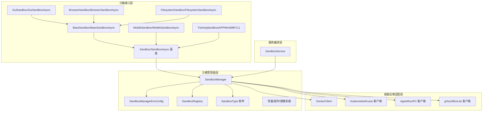
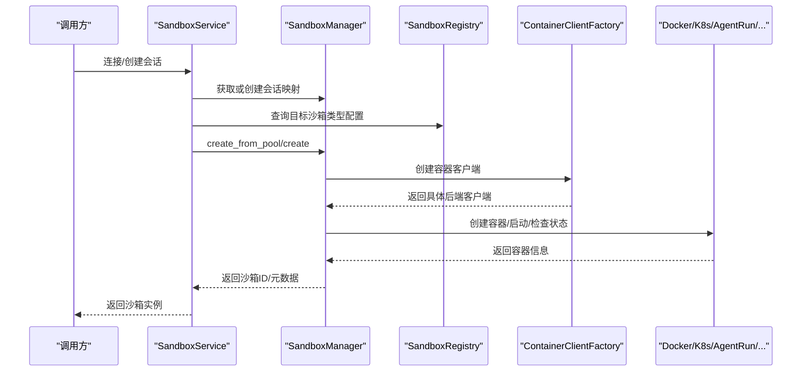
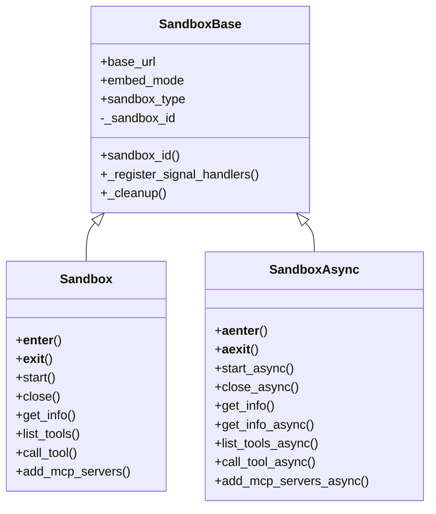
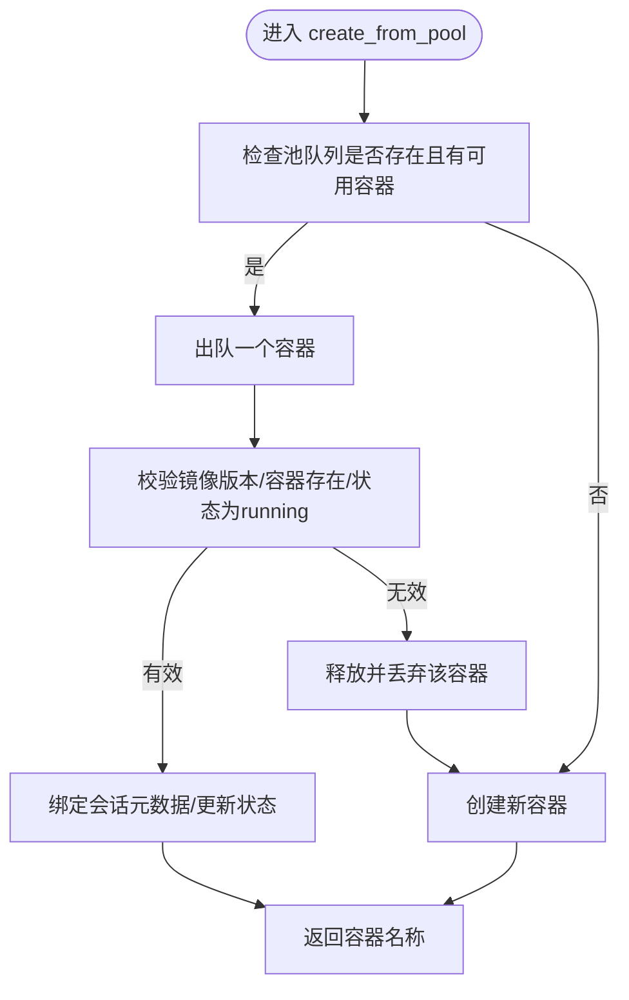
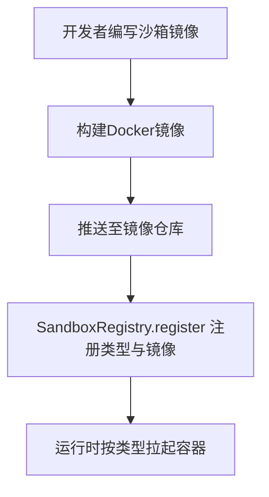
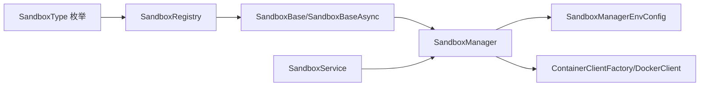

# 沙箱管理系统

<cite>
**本文档引用的文件**
- [sandbox/__init__.py](file://src/agentscope_runtime/sandbox/__init__.py)
- [sandbox/box/sandbox.py](file://src/agentscope_runtime/sandbox/box/sandbox.py)
- [sandbox/box/base/base_sandbox.py](file://src/agentscope_runtime/sandbox/box/base/base_sandbox.py)
- [sandbox/box/gui/gui_sandbox.py](file://src/agentscope_runtime/sandbox/box/gui/gui_sandbox.py)
- [sandbox/box/browser/browser_sandbox.py](file://src/agentscope_runtime/sandbox/box/browser/browser_sandbox.py)
- [sandbox/box/filesystem/filesystem_sandbox.py](file://src/agentscope_runtime/sandbox/box/filesystem/filesystem_sandbox.py)
- [sandbox/box/mobile/mobile_sandbox.py](file://src/agentscope_runtime/sandbox/box/mobile/mobile_sandbox.py)
- [sandbox/box/training_box/training_box.py](file://src/agentscope_runtime/sandbox/box/training_box/training_box.py)
- [sandbox/manager/sandbox_manager.py](file://src/agentscope_runtime/sandbox/manager/sandbox_manager.py)
- [sandbox/model/container.py](file://src/agentscope_runtime/sandbox/model/container.py)
- [sandbox/model/manager_config.py](file://src/agentscope_runtime/sandbox/model/manager_config.py)
- [sandbox/enums.py](file://src/agentscope_runtime/sandbox/enums.py)
- [sandbox/constant.py](file://src/agentscope_runtime/sandbox/constant.py)
- [sandbox/registry.py](file://src/agentscope_runtime/sandbox/registry.py)
- [engine/services/sandbox/sandbox_service.py](file://src/agentscope_runtime/engine/services/sandbox/sandbox_service.py)
- [common/container_clients/docker_client.py](file://src/agentscope_runtime/common/container_clients/docker_client.py)
- [examples/sandbox/custom_sandbox/Dockerfile](file://examples/sandbox/custom_sandbox/Dockerfile)
</cite>

## 目录
1. [简介](#简介)
2. [项目结构](#项目结构)
3. [核心组件](#核心组件)
4. [架构总览](#架构总览)
5. [详细组件分析](#详细组件分析)
6. [依赖分析](#依赖分析)
7. [性能考虑](#性能考虑)
8. [故障排查指南](#故障排查指南)
9. [结论](#结论)
10. [附录](#附录)

## 简介
本技术文档面向AgentScope Runtime的沙箱管理系统，系统性阐述沙箱架构设计原理、容器化执行环境与安全隔离机制，详解沙箱管理器的生命周期管理、资源分配与状态监控，并对比不同类型的沙箱（基础沙箱、GUI沙箱、浏览器沙箱、文件系统沙箱、移动沙箱、训练沙箱）在实现差异与使用场景上的区别。同时，文档覆盖沙箱构建流程、镜像管理与网络配置策略，并提供扩展与自定义的安全最佳实践。

## 项目结构
AgentScope Runtime的沙箱体系由“沙箱接口层”“沙箱类型实现层”“沙箱管理器层”“容器后端适配层”“服务编排层”等多层构成，采用注册表驱动的可扩展模式，支持多种容器后端与部署形态。

图示来源
- [sandbox/box/sandbox.py:18-313](file://src/agentscope_runtime/sandbox/box/sandbox.py#L18-L313)
- [sandbox/manager/sandbox_manager.py:140-520](file://src/agentscope_runtime/sandbox/manager/sandbox_manager.py#L140-L520)
- [sandbox/model/manager_config.py:11-376](file://src/agentscope_runtime/sandbox/model/manager_config.py#L11-L376)
- [engine/services/sandbox/sandbox_service.py:11-238](file://src/agentscope_runtime/engine/services/sandbox/sandbox_service.py#L11-L238)

章节来源
- [sandbox/__init__.py:1-33](file://src/agentscope_runtime/sandbox/__init__.py#L1-L33)
- [sandbox/box/sandbox.py:18-313](file://src/agentscope_runtime/sandbox/box/sandbox.py#L18-L313)
- [sandbox/manager/sandbox_manager.py:140-520](file://src/agentscope_runtime/sandbox/manager/sandbox_manager.py#L140-L520)
- [sandbox/model/manager_config.py:11-376](file://src/agentscope_runtime/sandbox/model/manager_config.py#L11-L376)
- [engine/services/sandbox/sandbox_service.py:11-238](file://src/agentscope_runtime/engine/services/sandbox/sandbox_service.py#L11-L238)

## 核心组件
- 沙箱基类与接口：统一同步/异步沙箱的生命周期、工具调用与文件系统抽象，支持嵌入式与远程模式。
- 沙箱类型实现：针对不同运行场景提供专用沙箱，如基础、GUI、浏览器、文件系统、移动、训练等。
- 沙箱管理器：负责容器生命周期、池化复用、心跳扫描、资源回收、会话绑定与远程/本地模式切换。
- 配置模型：集中管理容器部署后端、存储后端、端口范围、池大小、心跳策略、实例上限等。
- 注册表与枚举：以装饰器注册各沙箱类型及其镜像信息，枚举定义可用沙箱类型集合。
- 容器客户端：对Docker、Kubernetes、AgentRun、FC、gVisor、BoxLite等后端进行统一封装。
- 服务编排：对外暴露SandboxService，按会话维度创建/连接/释放沙箱环境。

章节来源
- [sandbox/box/sandbox.py:18-313](file://src/agentscope_runtime/sandbox/box/sandbox.py#L18-L313)
- [sandbox/box/base/base_sandbox.py:11-102](file://src/agentscope_runtime/sandbox/box/base/base_sandbox.py#L11-L102)
- [sandbox/box/gui/gui_sandbox.py:17-240](file://src/agentscope_runtime/sandbox/box/gui/gui_sandbox.py#L17-L240)
- [sandbox/box/browser/browser_sandbox.py:31-498](file://src/agentscope_runtime/sandbox/box/browser/browser_sandbox.py#L31-L498)
- [sandbox/box/filesystem/filesystem_sandbox.py:13-254](file://src/agentscope_runtime/sandbox/box/filesystem/filesystem_sandbox.py#L13-L254)
- [sandbox/box/mobile/mobile_sandbox.py:17-342](file://src/agentscope_runtime/sandbox/box/mobile/mobile_sandbox.py#L17-L342)
- [sandbox/box/training_box/training_box.py:18-295](file://src/agentscope_runtime/sandbox/box/training_box/training_box.py#L18-L295)
- [sandbox/manager/sandbox_manager.py:140-520](file://src/agentscope_runtime/sandbox/manager/sandbox_manager.py#L140-L520)
- [sandbox/model/manager_config.py:11-376](file://src/agentscope_runtime/sandbox/model/manager_config.py#L11-L376)
- [sandbox/registry.py:9-47](file://src/agentscope_runtime/sandbox/registry.py#L9-L47)
- [sandbox/enums.py:61-80](file://src/agentscope_runtime/sandbox/enums.py#L61-L80)
- [engine/services/sandbox/sandbox_service.py:11-238](file://src/agentscope_runtime/engine/services/sandbox/sandbox_service.py#L11-L238)

## 架构总览
沙箱系统采用“接口抽象 + 类型注册 + 管理器编排 + 后端适配”的分层架构。上层通过统一接口调用沙箱工具，下层由管理器选择合适的容器后端创建与维护容器，同时提供池化、心跳、回收与会话映射等能力。

图示来源
- [engine/services/sandbox/sandbox_service.py:82-142](file://src/agentscope_runtime/engine/services/sandbox/sandbox_service.py#L82-L142)
- [sandbox/manager/sandbox_manager.py:592-800](file://src/agentscope_runtime/sandbox/manager/sandbox_manager.py#L592-L800)
- [sandbox/registry.py:39-47](file://src/agentscope_runtime/sandbox/registry.py#L39-L47)
- [common/container_clients/docker_client.py:20-231](file://src/agentscope_runtime/common/container_clients/docker_client.py#L20-L231)

## 详细组件分析

### 沙箱基类与生命周期
- 统一基类：SandboxBase/SandboxBaseAsync封装嵌入式/远程模式、信号处理、清理逻辑与文件系统抽象。
- 生命周期：支持with上下文与显式start/close；异步版本提供aenter/aexit与async start/close。
- 工具调用：通过manager_api转发call_tool/list_tools/add_mcp_servers等操作。

图示来源
- [sandbox/box/sandbox.py:18-313](file://src/agentscope_runtime/sandbox/box/sandbox.py#L18-L313)

章节来源
- [sandbox/box/sandbox.py:18-313](file://src/agentscope_runtime/sandbox/box/sandbox.py#L18-L313)

### 沙箱管理器（SandboxManager）
- 模式切换：根据是否传入base_url决定远程或嵌入式模式；远程模式使用HTTP客户端，嵌入式模式直接调用本地方法。
- 池化与预热：支持多类型沙箱池队列，从池中取出可用容器或创建新容器；校验镜像版本与运行状态。
- 资源限制：最大实例数限制、心跳扫描、回收标记与释放记录清理。
- 存储与文件系统：支持本地存储与OSS存储，结合工作目录挂载策略。
- 容器后端：通过ContainerClientFactory创建Docker/K8s/AgentRun/FC/gVisor/BoxLite等客户端。

图示来源
- [sandbox/manager/sandbox_manager.py:592-700](file://src/agentscope_runtime/sandbox/manager/sandbox_manager.py#L592-L700)

章节来源
- [sandbox/manager/sandbox_manager.py:140-520](file://src/agentscope_runtime/sandbox/manager/sandbox_manager.py#L140-L520)
- [sandbox/model/container.py:10-158](file://src/agentscope_runtime/sandbox/model/container.py#L10-L158)
- [sandbox/model/manager_config.py:11-376](file://src/agentscope_runtime/sandbox/model/manager_config.py#L11-L376)

### 不同类型沙箱的实现差异与使用场景

- 基础沙箱（BaseSandbox/BaseSandboxAsync）
  - 特点：最小可用环境，提供IPython单元执行与Shell命令能力。
  - 使用场景：通用脚本执行、轻量工具链集成。
  章节来源
  - [sandbox/box/base/base_sandbox.py:11-102](file://src/agentscope_runtime/sandbox/box/base/base_sandbox.py#L11-L102)

- GUI沙箱（GuiSandbox/GuiSandboxAsync）
  - 特点：提供VNC/桌面访问能力，支持鼠标键盘交互与截图；异步版本提供相同能力。
  - 使用场景：需要图形界面交互的任务，如桌面应用自动化。
  章节来源
  - [sandbox/box/gui/gui_sandbox.py:17-240](file://src/agentscope_runtime/sandbox/box/gui/gui_sandbox.py#L17-L240)

- 浏览器沙箱（BrowserSandbox/BrowserSandboxAsync）
  - 特点：基于GUI沙箱扩展，提供导航、点击、输入、截图、PDF保存、网络请求等浏览器操作。
  - 使用场景：网页自动化、UI测试、内容抓取与分析。
  章节来源
  - [sandbox/box/browser/browser_sandbox.py:31-498](file://src/agentscope_runtime/sandbox/box/browser/browser_sandbox.py#L31-L498)

- 文件系统沙箱（FilesystemSandbox/FilesystemSandboxAsync）
  - 特点：提供读写文件、编辑、目录树、搜索、移动、权限与允许目录列表等文件系统操作。
  - 使用场景：代码编辑、日志分析、批量文件处理。
  章节来源
  - [sandbox/box/filesystem/filesystem_sandbox.py:13-254](file://src/agentscope_runtime/sandbox/box/filesystem/filesystem_sandbox.py#L13-L254)

- 移动沙箱（MobileSandbox/MobileSandboxAsync）
  - 特点：通过ADB协议控制移动设备，提供点击、滑动、输入文本、按键事件、截图等能力；支持websockify/VNC访问。
  - 使用场景：移动端自动化、真机测试、跨平台交互。
  章节来源
  - [sandbox/box/mobile/mobile_sandbox.py:17-342](file://src/agentscope_runtime/sandbox/box/mobile/mobile_sandbox.py#L17-L342)

- 训练沙箱（TrainingSandbox/APPWorld/BFCL）
  - 特点：面向强化学习/仿真训练的专用沙箱，提供实例创建、任务ID查询、环境配置、单步执行、评估与释放。
  - 使用场景：大规模训练任务、仿真环境管理。
  章节来源
  - [sandbox/box/training_box/training_box.py:18-295](file://src/agentscope_runtime/sandbox/box/training_box/training_box.py#L18-L295)

### 沙箱构建流程与镜像管理
- 镜像命名与注册：通过装饰器注册各沙箱类型对应的镜像URI、安全等级、超时与描述。
- 构建与打包：示例自定义沙箱镜像基于Node/Chromium/Xfce等组件，使用supervisor/nginx/novnc/websockify组合提供GUI与MCP服务。
- 环境变量与网络：示例镜像设置MCP所需API密钥、Nginx超时等参数，CMD启动时通过envsubst注入运行时变量。

图示来源
- [sandbox/registry.py:39-47](file://src/agentscope_runtime/sandbox/registry.py#L39-L47)
- [examples/sandbox/custom_sandbox/Dockerfile:1-84](file://examples/sandbox/custom_sandbox/Dockerfile#L1-L84)

章节来源
- [sandbox/registry.py:9-47](file://src/agentscope_runtime/sandbox/registry.py#L9-L47)
- [examples/sandbox/custom_sandbox/Dockerfile:1-84](file://examples/sandbox/custom_sandbox/Dockerfile#L1-L84)

### 网络配置与访问方式
- GUI/浏览器：通过VNC/novnc或websockify提供远程桌面访问，支持密码令牌鉴权。
- 移动：通过websockify提供移动设备的VNC接入。
- 浏览器：支持HTTP到WS的URL转换，适配本地/远程访问路径。
- 端口管理：管理器内置端口范围与占用检测，确保容器端口映射唯一性。

章节来源
- [sandbox/box/gui/gui_sandbox.py:17-63](file://src/agentscope_runtime/sandbox/box/gui/gui_sandbox.py#L17-L63)
- [sandbox/box/browser/browser_sandbox.py:14-29](file://src/agentscope_runtime/sandbox/box/browser/browser_sandbox.py#L14-L29)
- [sandbox/box/mobile/mobile_sandbox.py:17-78](file://src/agentscope_runtime/sandbox/box/mobile/mobile_sandbox.py#L17-L78)
- [common/container_clients/docker_client.py:204-231](file://src/agentscope_runtime/common/container_clients/docker_client.py#L204-L231)

### 容器后端适配
- DockerClient：负责镜像拉取、容器创建/启动/停止/删除、端口分配与状态查询。
- 其他后端：Kubernetes/Kruise、AgentRun、阿里云FC、gVisor、BoxLite等通过ContainerClientFactory统一创建与调用。

章节来源
- [common/container_clients/docker_client.py:20-231](file://src/agentscope_runtime/common/container_clients/docker_client.py#L20-L231)
- [sandbox/manager/sandbox_manager.py:246-251](file://src/agentscope_runtime/sandbox/manager/sandbox_manager.py#L246-L251)

## 依赖分析
- 组件耦合：沙箱类型实现依赖SandboxBase与SandboxManager；SandboxManager依赖注册表、配置模型与容器客户端工厂。
- 外部依赖：Docker SDK、Redis（可选）、Kubernetes/AgentRun/FC客户端库。
- 可能的循环依赖：当前结构通过模块导入避免循环，SandboxService在运行时动态创建SandboxManager实例。

图示来源
- [sandbox/enums.py:61-80](file://src/agentscope_runtime/sandbox/enums.py#L61-L80)
- [sandbox/registry.py:39-47](file://src/agentscope_runtime/sandbox/registry.py#L39-L47)
- [sandbox/box/sandbox.py:18-313](file://src/agentscope_runtime/sandbox/box/sandbox.py#L18-L313)
- [sandbox/manager/sandbox_manager.py:140-251](file://src/agentscope_runtime/sandbox/manager/sandbox_manager.py#L140-L251)
- [engine/services/sandbox/sandbox_service.py:11-81](file://src/agentscope_runtime/engine/services/sandbox/sandbox_service.py#L11-L81)

章节来源
- [sandbox/enums.py:61-80](file://src/agentscope_runtime/sandbox/enums.py#L61-L80)
- [sandbox/registry.py:39-47](file://src/agentscope_runtime/sandbox/registry.py#L39-L47)
- [sandbox/box/sandbox.py:18-313](file://src/agentscope_runtime/sandbox/box/sandbox.py#L18-L313)
- [sandbox/manager/sandbox_manager.py:140-251](file://src/agentscope_runtime/sandbox/manager/sandbox_manager.py#L140-L251)
- [engine/services/sandbox/sandbox_service.py:11-81](file://src/agentscope_runtime/engine/services/sandbox/sandbox_service.py#L11-L81)

## 性能考虑
- 池化复用：通过池队列减少容器冷启动开销，提升并发响应速度。
- 心跳与回收：定期扫描空闲会话并回收，避免资源泄漏；合理设置watcher间隔与超时阈值。
- 端口管理：严格的端口占用检测与缓存，避免端口冲突导致的失败重试。
- 存储策略：本地存储适合开发调试，生产建议使用OSS以提升可靠性与可扩展性。
- 后端选择：Docker适合本地开发，Kubernetes/AgentRun/FC适合生产弹性与隔离需求。

## 故障排查指南
- 容器启动失败：检查镜像是否存在、后端服务可用性、端口范围是否被占用。
- 远程模式鉴权失败：确认base_url与Bearer Token配置正确。
- 超时与健康检查：调整TIMEOUT与心跳超时参数，确保网络稳定。
- 资源上限：当达到max_sandbox_instances时，系统将拒绝新建容器，需释放或扩容。
- 日志与追踪：启用服务端日志与追踪，定位工具调用异常与容器状态问题。

章节来源
- [sandbox/constant.py:30-32](file://src/agentscope_runtime/sandbox/constant.py#L30-L32)
- [sandbox/manager/sandbox_manager.py:508-589](file://src/agentscope_runtime/sandbox/manager/sandbox_manager.py#L508-L589)
- [sandbox/model/manager_config.py:279-284](file://src/agentscope_runtime/sandbox/model/manager_config.py#L279-L284)

## 结论
AgentScope Runtime的沙箱管理系统通过清晰的分层设计与注册表驱动的扩展机制，实现了从接口抽象到容器后端适配的完整闭环。系统在保证功能多样性的同时，兼顾了安全性、可移植性与可运维性。通过池化、心跳与回收等机制，系统能够高效地支撑多类型任务的容器化执行，并为后续扩展新的沙箱类型与后端提供良好基础。

## 附录
- 安全最佳实践
  - 默认使用只读挂载与受限环境变量，避免敏感路径暴露。
  - 优先使用受管后端（K8s/AgentRun/FC）以获得更强隔离与审计能力。
  - 对外暴露的GUI/浏览器服务应启用鉴权令牌与TLS。
  - 定期轮换Secret与Token，限制容器特权运行。
- 扩展与自定义
  - 新增沙箱类型：通过装饰器注册镜像与配置，继承对应基类并实现工具方法。
  - 自定义后端：实现ContainerClient接口并通过工厂注册，保持与管理器解耦。
  - 镜像优化：精简基础镜像、缓存清理、最小化安装包，缩短构建与启动时间。