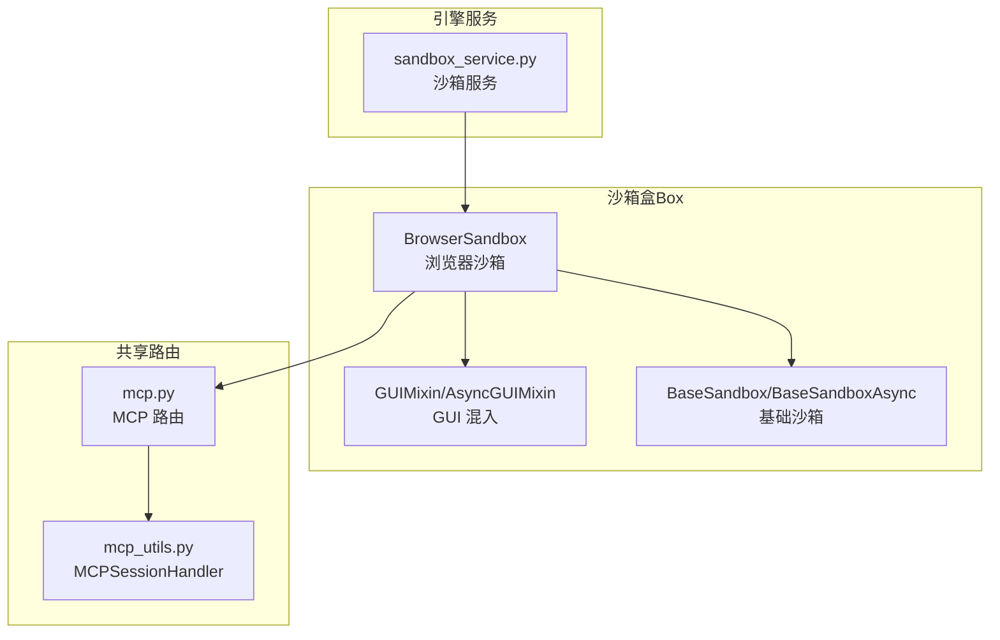
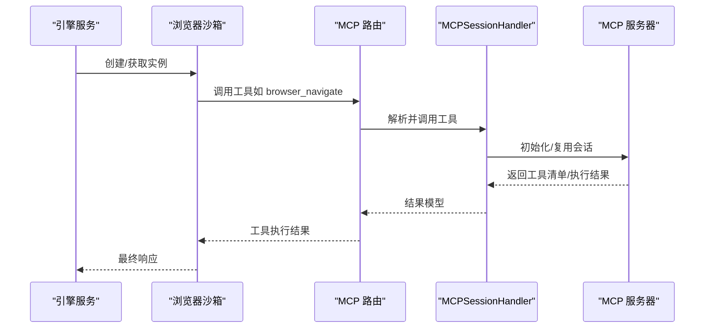
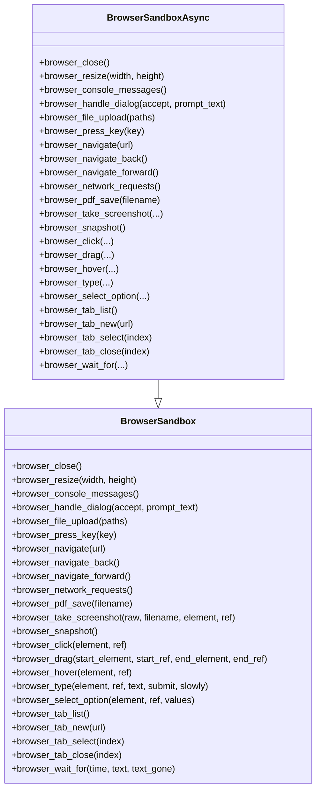
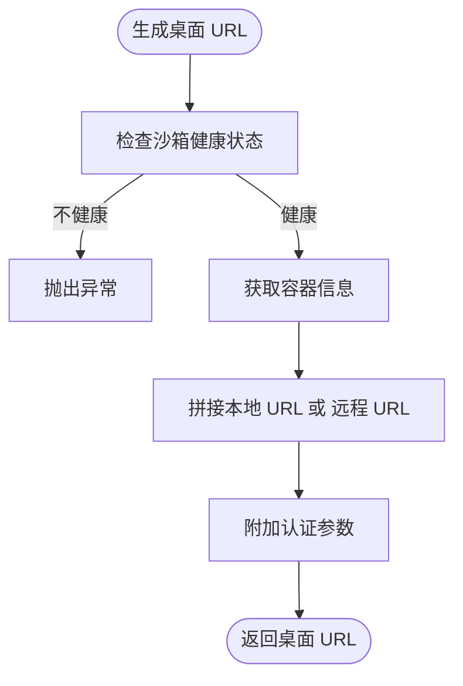
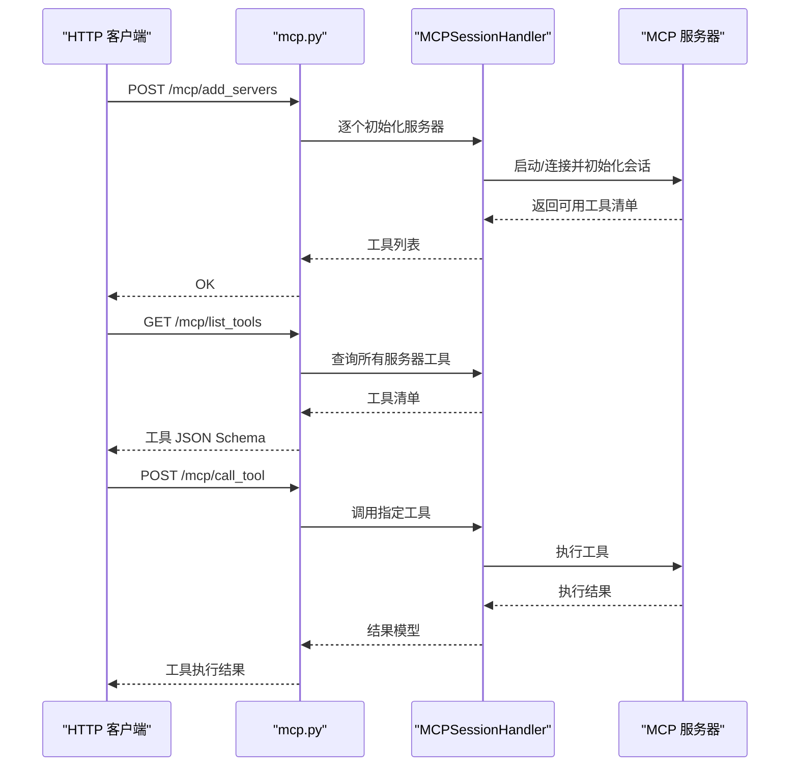
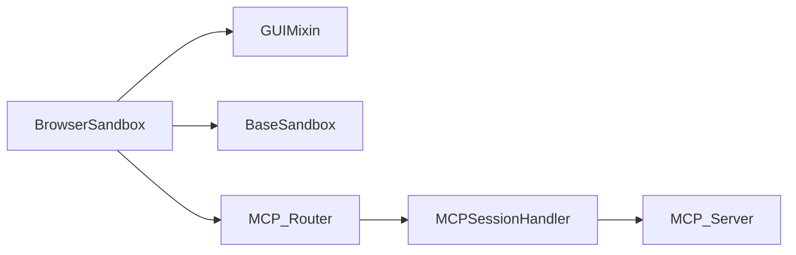

# 浏览器沙箱

<cite>
**本文引用的文件**
- [browser_sandbox.py](file://src/agentscope_runtime/sandbox/box/browser/browser_sandbox.py)
- [playwright_mcp_config.json（示例）](file://examples/sandbox/custom_sandbox/box/playwright_mcp_config.json)
- [mcp_server_configs.json（示例）](file://examples/sandbox/custom_sandbox/box/mcp_server_configs.json)
- [mcp.py](file://src/agentscope_runtime/sandbox/box/shared/routers/mcp.py)
- [mcp_utils.py](file://src/agentscope_runtime/sandbox/box/shared/routers/mcp_utils.py)
- [gui_sandbox.py](file://src/agentscope_runtime/sandbox/box/gui/gui_sandbox.py)
- [base_sandbox.py](file://src/agentscope_runtime/sandbox/box/base/base_sandbox.py)
- [sandbox_service.py](file://src/agentscope_runtime/engine/services/sandbox/sandbox_service.py)
</cite>

## 目录
1. [简介](#简介)
2. [项目结构](#项目结构)
3. [核心组件](#核心组件)
4. [架构总览](#架构总览)
5. [详细组件分析](#详细组件分析)
6. [依赖分析](#依赖分析)
7. [性能考虑](#性能考虑)
8. [故障排查指南](#故障排查指南)
9. [结论](#结论)
10. [附录](#附录)

## 简介
本技术文档面向 AgentScope Runtime 的浏览器沙箱，系统性阐述其基于 Playwright 的自动化框架、MCP 协议支持与网页交互能力。内容覆盖浏览器启动配置、页面导航与元素操作、MCP 服务器配置与协议适配、外部工具集成、会话管理与 Cookie 处理、跨域访问控制，以及使用示例、自动化脚本编写与调试技巧。目标读者包括需要在受控环境中执行网页自动化任务的工程师与研究者。

## 项目结构
浏览器沙箱位于沙箱盒（box）体系中，采用“功能分层 + 组件复用”的组织方式：
- 浏览器沙箱实现：封装 Playwright 工具调用接口，统一暴露浏览器相关能力。
- 共享 MCP 路由与工具：提供 MCP 服务器注册、工具列表查询与调用、生命周期管理。
- GUI 混入：为具备图形界面能力的沙箱提供桌面访问 URL 生成逻辑。
- 基础沙箱：提供通用工具调用能力，浏览器沙箱在此基础上扩展。
- 引擎服务：在运行时通过服务层编排沙箱实例与工具调用。

图表来源
- [browser_sandbox.py:38-498](file://src/agentscope_runtime/sandbox/box/browser/browser_sandbox.py#L38-L498)
- [gui_sandbox.py:17-63](file://src/agentscope_runtime/sandbox/box/gui/gui_sandbox.py#L17-L63)
- [base_sandbox.py:18-102](file://src/agentscope_runtime/sandbox/box/base/base_sandbox.py#L18-L102)
- [mcp.py:12-208](file://src/agentscope_runtime/sandbox/box/shared/routers/mcp.py#L12-L208)
- [mcp_utils.py:32-188](file://src/agentscope_runtime/sandbox/box/shared/routers/mcp_utils.py#L32-L188)
- [sandbox_service.py](file://src/agentscope_runtime/engine/services/sandbox/sandbox_service.py)

章节来源
- [browser_sandbox.py:38-498](file://src/agentscope_runtime/sandbox/box/browser/browser_sandbox.py#L38-L498)
- [gui_sandbox.py:17-63](file://src/agentscope_runtime/sandbox/box/gui/gui_sandbox.py#L17-L63)
- [base_sandbox.py:18-102](file://src/agentscope_runtime/sandbox/box/base/base_sandbox.py#L18-L102)
- [mcp.py:12-208](file://src/agentscope_runtime/sandbox/box/shared/routers/mcp.py#L12-L208)
- [mcp_utils.py:32-188](file://src/agentscope_runtime/sandbox/box/shared/routers/mcp_utils.py#L32-L188)
- [sandbox_service.py](file://src/agentscope_runtime/engine/services/sandbox/sandbox_service.py)

## 核心组件
- 浏览器沙箱类：提供窗口尺寸调整、页面导航、历史前进后退、网络请求追踪、PDF 导出、截图、可访问性快照、元素点击/拖拽/悬停、文本输入、下拉选择、标签页管理、等待策略等方法；同时提供异步版本以适配并发场景。
- GUI 混入：为具备图形界面能力的沙箱生成桌面访问 URL，便于远程查看与调试。
- 基础沙箱：提供通用工具调用能力，浏览器沙箱在此之上扩展 Playwright 工具集。
- MCP 路由与会话处理器：负责加载 MCP 服务器配置、初始化连接、列出工具、调用工具并进行生命周期清理。

章节来源
- [browser_sandbox.py:38-498](file://src/agentscope_runtime/sandbox/box/browser/browser_sandbox.py#L38-L498)
- [gui_sandbox.py:17-63](file://src/agentscope_runtime/sandbox/box/gui/gui_sandbox.py#L17-L63)
- [base_sandbox.py:18-102](file://src/agentscope_runtime/sandbox/box/base/base_sandbox.py#L18-L102)
- [mcp.py:24-208](file://src/agentscope_runtime/sandbox/box/shared/routers/mcp.py#L24-L208)
- [mcp_utils.py:32-188](file://src/agentscope_runtime/sandbox/box/shared/routers/mcp_utils.py#L32-L188)

## 架构总览
浏览器沙箱通过工具调用机制与 MCP 服务器对接，实现 Playwright 自动化能力的外部化与标准化。典型流程如下：
- 引擎服务创建或获取浏览器沙箱实例。
- 浏览器沙箱将用户指令转换为工具名称与参数，调用底层工具执行。
- MCP 路由根据配置启动/复用 MCP 服务器，解析工具清单并执行具体动作。
- 执行结果返回给浏览器沙箱，再由引擎服务对外输出。

图表来源
- [sandbox_service.py](file://src/agentscope_runtime/engine/services/sandbox/sandbox_service.py)
- [browser_sandbox.py:104-110](file://src/agentscope_runtime/sandbox/box/browser/browser_sandbox.py#L104-L110)
- [mcp.py:136-169](file://src/agentscope_runtime/sandbox/box/shared/routers/mcp.py#L136-L169)
- [mcp_utils.py:43-105](file://src/agentscope_runtime/sandbox/box/shared/routers/mcp_utils.py#L43-L105)

## 详细组件分析

### 浏览器沙箱类与异步变体
浏览器沙箱类提供丰富的网页自动化能力，涵盖窗口管理、导航、交互、截图与 PDF 导出等。异步版本用于高并发场景，保证非阻塞执行。

图表来源
- [browser_sandbox.py:38-498](file://src/agentscope_runtime/sandbox/box/browser/browser_sandbox.py#L38-L498)

章节来源
- [browser_sandbox.py:38-498](file://src/agentscope_runtime/sandbox/box/browser/browser_sandbox.py#L38-L498)

### GUI 混入与桌面访问
GUI 混入负责生成桌面访问 URL，支持本地与远程两种模式，并携带认证令牌参数，便于安全访问。

图表来源
- [gui_sandbox.py:17-63](file://src/agentscope_runtime/sandbox/box/gui/gui_sandbox.py#L17-L63)

章节来源
- [gui_sandbox.py:17-63](file://src/agentscope_runtime/sandbox/box/gui/gui_sandbox.py#L17-L63)

### MCP 路由与会话处理器
MCP 路由提供添加服务器、列出工具、调用工具等接口；会话处理器负责服务器初始化、工具列举与调用、重试与清理。

图表来源
- [mcp.py:24-208](file://src/agentscope_runtime/sandbox/box/shared/routers/mcp.py#L24-L208)
- [mcp_utils.py:32-188](file://src/agentscope_runtime/sandbox/box/shared/routers/mcp_utils.py#L32-L188)

章节来源
- [mcp.py:24-208](file://src/agentscope_runtime/sandbox/box/shared/routers/mcp.py#L24-L208)
- [mcp_utils.py:32-188](file://src/agentscope_runtime/sandbox/box/shared/routers/mcp_utils.py#L32-L188)

### 浏览器启动配置与页面交互
- 浏览器启动配置：示例配置展示了浏览器类型、启动参数、上下文视口等关键项，可据此定制浏览器行为与渲染环境。
- 页面交互：通过工具调用实现导航、等待、元素操作、截图与 PDF 导出等。

章节来源
- [playwright_mcp_config.json（示例）:1-23](file://examples/sandbox/custom_sandbox/box/playwright_mcp_config.json#L1-L23)
- [browser_sandbox.py:104-301](file://src/agentscope_runtime/sandbox/box/browser/browser_sandbox.py#L104-L301)

### MCP 服务器配置与外部工具集成
- MCP 服务器配置：示例配置定义了命令行启动参数与配置文件路径，确保 MCP 服务器按预期加载 Playwright 驱动。
- 工具集成：通过路由层统一管理工具清单与调用，屏蔽底层差异，便于扩展新的工具或服务器。

章节来源
- [mcp_server_configs.json（示例）:1-14](file://examples/sandbox/custom_sandbox/box/mcp_server_configs.json#L1-L14)
- [mcp.py:86-169](file://src/agentscope_runtime/sandbox/box/shared/routers/mcp.py#L86-L169)
- [mcp_utils.py:128-172](file://src/agentscope_runtime/sandbox/box/shared/routers/mcp_utils.py#L128-L172)

### 会话管理、Cookie 处理与跨域访问控制
- 会话管理：MCP 会话处理器负责会话初始化、工具调用与清理，避免资源泄漏。
- Cookie 处理：可通过浏览器工具链提供的 API 实现 Cookie 的读取、设置与删除，结合沙箱上下文进行会话隔离。
- 跨域访问控制：通过浏览器上下文配置与工具调用策略，限制或允许特定域名的访问，保障沙箱边界安全。

章节来源
- [mcp_utils.py:43-105](file://src/agentscope_runtime/sandbox/box/shared/routers/mcp_utils.py#L43-L105)
- [browser_sandbox.py:104-301](file://src/agentscope_runtime/sandbox/box/browser/browser_sandbox.py#L104-L301)

### 使用示例、自动化脚本编写与调试技巧
- 使用示例：通过浏览器沙箱类的方法组合完成常见网页自动化任务，如登录、表单填写、截图与 PDF 导出。
- 自动化脚本编写：建议将复杂流程拆分为步骤函数，使用等待策略确保页面状态稳定，合理使用元素定位与可访问性快照。
- 调试技巧：利用控制台消息收集、网络请求追踪与截图回放定位问题；通过桌面访问 URL 进行可视化验证。

章节来源
- [browser_sandbox.py:55-301](file://src/agentscope_runtime/sandbox/box/browser/browser_sandbox.py#L55-L301)
- [gui_sandbox.py:17-63](file://src/agentscope_runtime/sandbox/box/gui/gui_sandbox.py#L17-L63)

## 依赖分析
浏览器沙箱依赖于 GUI 混入与基础沙箱提供的通用工具调用能力，同时通过 MCP 路由与会话处理器与外部 Playwright 服务器解耦。整体耦合度低、内聚性强，便于扩展与维护。

图表来源
- [browser_sandbox.py:38-498](file://src/agentscope_runtime/sandbox/box/browser/browser_sandbox.py#L38-L498)
- [gui_sandbox.py:17-63](file://src/agentscope_runtime/sandbox/box/gui/gui_sandbox.py#L17-L63)
- [base_sandbox.py:18-102](file://src/agentscope_runtime/sandbox/box/base/base_sandbox.py#L18-L102)
- [mcp.py:12-208](file://src/agentscope_runtime/sandbox/box/shared/routers/mcp.py#L12-L208)
- [mcp_utils.py:32-188](file://src/agentscope_runtime/sandbox/box/shared/routers/mcp_utils.py#L32-L188)

章节来源
- [browser_sandbox.py:38-498](file://src/agentscope_runtime/sandbox/box/browser/browser_sandbox.py#L38-L498)
- [gui_sandbox.py:17-63](file://src/agentscope_runtime/sandbox/box/gui/gui_sandbox.py#L17-L63)
- [base_sandbox.py:18-102](file://src/agentscope_runtime/sandbox/box/base/base_sandbox.py#L18-L102)
- [mcp.py:12-208](file://src/agentscope_runtime/sandbox/box/shared/routers/mcp.py#L12-L208)
- [mcp_utils.py:32-188](file://src/agentscope_runtime/sandbox/box/shared/routers/mcp_utils.py#L32-L188)

## 性能考虑
- 并发与异步：优先使用异步版本的浏览器沙箱方法，提升多任务执行效率。
- 工具重试：MCP 工具调用内置重试机制，降低瞬时失败对流程的影响。
- 资源清理：在应用关闭或异常情况下，确保会话处理器正确释放资源，避免内存与进程泄漏。
- 视口与截图：合理设置视口大小与截图质量，平衡性能与精度。

## 故障排查指南
- MCP 服务器初始化失败：检查服务器命令、参数与配置文件路径是否正确，确认运行环境具备所需依赖。
- 工具未找到：确认工具清单已成功加载，核对工具名称与参数格式。
- 超时与重试：适当增加超时时间与重试次数，观察日志定位瓶颈。
- 资源清理：关注关闭事件中的清理逻辑，避免残留会话影响后续启动。

章节来源
- [mcp.py:172-184](file://src/agentscope_runtime/sandbox/box/shared/routers/mcp.py#L172-L184)
- [mcp_utils.py:174-188](file://src/agentscope_runtime/sandbox/box/shared/routers/mcp_utils.py#L174-L188)

## 结论
AgentScope Runtime 的浏览器沙箱通过 Playwright 与 MCP 协议实现了强大的网页自动化能力，配合 GUI 混入与会话管理，能够在受控环境中高效、安全地执行复杂交互任务。借助统一的工具调用与路由层抽象，系统具备良好的扩展性与可维护性，适合在多 Agent 场景中作为通用的网页交互基础设施。

## 附录
- 示例配置文件路径参考：
  - [playwright_mcp_config.json（示例）:1-23](file://examples/sandbox/custom_sandbox/box/playwright_mcp_config.json#L1-L23)
  - [mcp_server_configs.json（示例）:1-14](file://examples/sandbox/custom_sandbox/box/mcp_server_configs.json#L1-L14)
- 关键实现文件参考：
  - [browser_sandbox.py:38-498](file://src/agentscope_runtime/sandbox/box/browser/browser_sandbox.py#L38-L498)
  - [mcp.py:24-208](file://src/agentscope_runtime/sandbox/box/shared/routers/mcp.py#L24-L208)
  - [mcp_utils.py:32-188](file://src/agentscope_runtime/sandbox/box/shared/routers/mcp_utils.py#L32-L188)
  - [gui_sandbox.py:17-63](file://src/agentscope_runtime/sandbox/box/gui/gui_sandbox.py#L17-L63)
  - [base_sandbox.py:18-102](file://src/agentscope_runtime/sandbox/box/base/base_sandbox.py#L18-L102)
  - [sandbox_service.py](file://src/agentscope_runtime/engine/services/sandbox/sandbox_service.py)