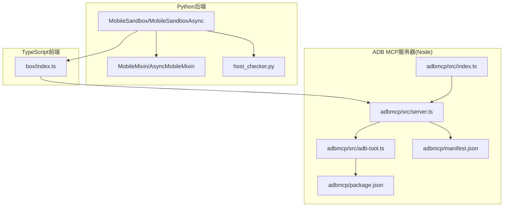
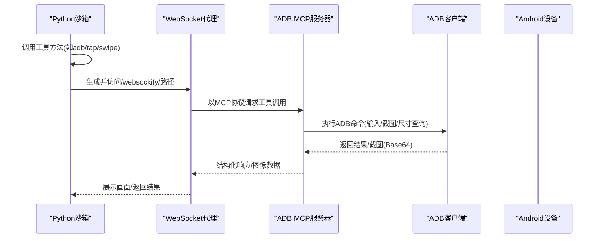
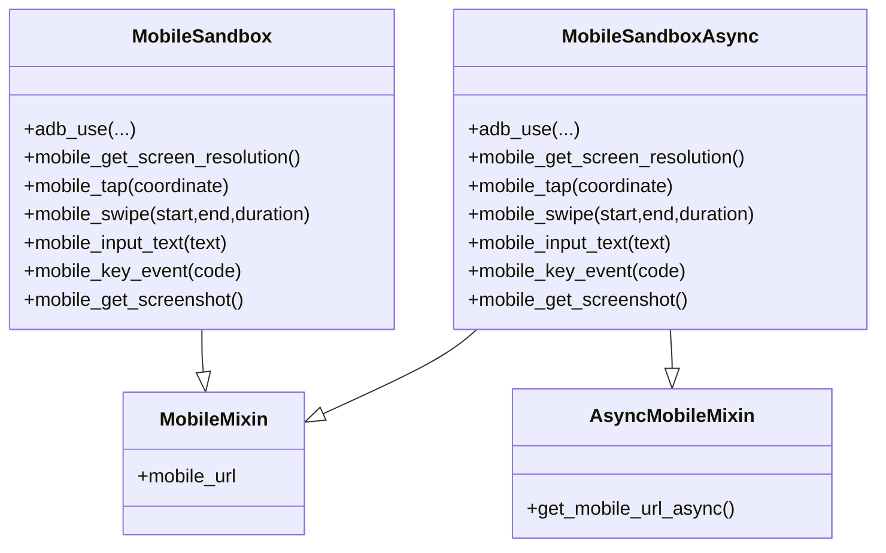
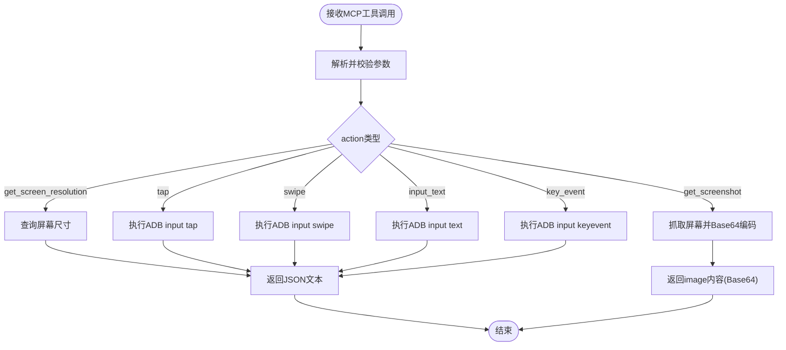
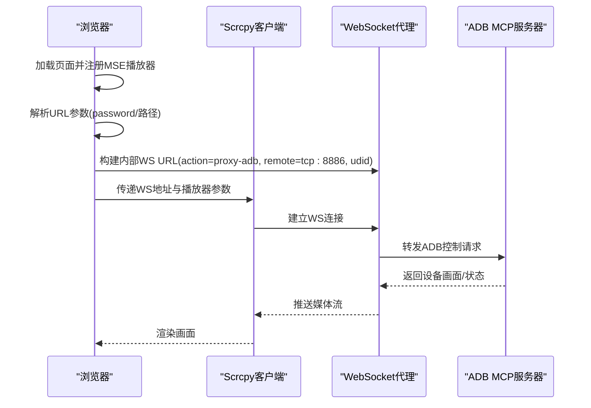
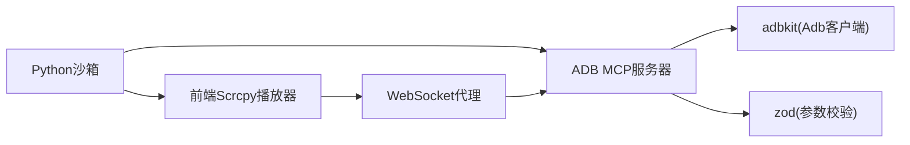

# 移动沙箱

<cite>
**本文引用的文件**
- [mobile_sandbox.py](file://src/agentscope_runtime/sandbox/box/mobile/mobile_sandbox.py)
- [index.ts（前端入口）](file://src/agentscope_runtime/sandbox/box/mobile/box/index.ts)
- [mcp_server_configs.json（MCP服务配置）](file://src/agentscope_runtime/sandbox/box/mobile/box/mcp_server_configs.json)
- [host_checker.py（主机前置检查）](file://src/agentscope_runtime/sandbox/box/mobile/box/host_checker.py)
- [index.ts（ADB MCP入口）](file://src/agentscope_runtime/sandbox/box/mobile/adbmcp/src/index.ts)
- [server.ts（ADB MCP服务器）](file://src/agentscope_runtime/sandbox/box/mobile/adbmcp/src/server.ts)
- [adb-tool.ts（ADB工具实现）](file://src/agentscope_runtime/sandbox/box/mobile/adbmcp/src/adb-tool.ts)
- [package.json（ADB MCP依赖）](file://src/agentscope_runtime/sandbox/box/mobile/adbmcp/package.json)
- [manifest.json（ADB MCP清单）](file://src/agentscope_runtime/sandbox/box/mobile/adbmcp/manifest.json)
</cite>

## 目录
1. [简介](#简介)
2. [项目结构](#项目结构)
3. [核心组件](#核心组件)
4. [架构总览](#架构总览)
5. [详细组件分析](#详细组件分析)
6. [依赖关系分析](#依赖关系分析)
7. [性能考虑](#性能考虑)
8. [故障排除指南](#故障排除指南)
9. [结论](#结论)
10. [附录](#附录)

## 简介
本技术文档面向AgentScope Runtime的移动沙箱，系统性阐述其基于ADB工具集成、MCP协议支持以及移动端自动化测试的完整能力。文档覆盖Android设备连接、应用安装与界面交互、ADB MCP服务器配置、设备发现与连接管理、屏幕录制、触摸事件模拟、应用状态监控等关键主题，并提供设备配置、测试脚本编写与调试工具使用的实践指南。

## 项目结构
移动沙箱在代码库中的组织方式采用“功能模块化 + 多语言栈”的分层设计：
- Python后端：负责沙箱生命周期管理、工具调用桥接、健康检查与URL生成
- TypeScript前端：负责移动端UI展示、Scrcpy流媒体播放、WebSocket代理
- ADB MCP服务器：通过Node.js实现，提供标准化的ADB工具接口
- 配置与依赖：Docker镜像构建、MCP服务注册、主机前置条件校验

图表来源
- [mobile_sandbox.py:17-342](file://src/agentscope_runtime/sandbox/box/mobile/mobile_sandbox.py#L17-L342)
- [index.ts（前端入口）:1-69](file://src/agentscope_runtime/sandbox/box/mobile/box/index.ts#L1-L69)
- [index.ts（ADB MCP入口）:1-22](file://src/agentscope_runtime/sandbox/box/mobile/adbmcp/src/index.ts#L1-L22)
- [server.ts（ADB MCP服务器）:1-222](file://src/agentscope_runtime/sandbox/box/mobile/adbmcp/src/server.ts#L1-L222)
- [adb-tool.ts（ADB工具实现）:1-121](file://src/agentscope_runtime/sandbox/box/mobile/adbmcp/src/adb-tool.ts#L1-L121)
- [package.json（ADB MCP依赖）:1-48](file://src/agentscope_runtime/sandbox/box/mobile/adbmcp/package.json#L1-L48)
- [manifest.json（ADB MCP清单）:1-37](file://src/agentscope_runtime/sandbox/box/mobile/adbmcp/manifest.json#L1-L37)

章节来源
- [mobile_sandbox.py:1-342](file://src/agentscope_runtime/sandbox/box/mobile/mobile_sandbox.py#L1-L342)
- [host_checker.py:1-113](file://src/agentscope_runtime/sandbox/box/mobile/box/host_checker.py#L1-L113)
- [index.ts（前端入口）:1-69](file://src/agentscope_runtime/sandbox/box/mobile/box/index.ts#L1-L69)
- [index.ts（ADB MCP入口）:1-22](file://src/agentscope_runtime/sandbox/box/mobile/adbmcp/src/index.ts#L1-L22)
- [server.ts（ADB MCP服务器）:1-222](file://src/agentscope_runtime/sandbox/box/mobile/adbmcp/src/server.ts#L1-L222)
- [adb-tool.ts（ADB工具实现）:1-121](file://src/agentscope_runtime/sandbox/box/mobile/adbmcp/src/adb-tool.ts#L1-L121)
- [package.json（ADB MCP依赖）:1-48](file://src/agentscope_runtime/sandbox/box/mobile/adbmcp/package.json#L1-L48)
- [manifest.json（ADB MCP清单）:1-37](file://src/agentscope_runtime/sandbox/box/mobile/adbmcp/manifest.json#L1-L37)

## 核心组件
- 移动混合类与沙箱类
  - 提供移动端VNC/WS连接URL生成、健康检查、异步/同步工具调用封装
  - 支持屏幕分辨率查询、点击、滑动、文本输入、按键事件、截图等ADB动作
- 主机前置检查器
  - 在Linux/Windows(Win+WSL2)环境下校验binder_linux内核模块加载情况，确保移动沙箱可用
- ADB MCP服务器
  - 基于Model Context Protocol(MCP)标准，提供统一的ADB工具接口
  - 使用Zod进行参数校验，返回结构化结果或Base64图像
- 前端Scrcpy播放器
  - 通过WebSocket代理到内部ADB通道，实现移动端实时画面与控制

章节来源
- [mobile_sandbox.py:17-342](file://src/agentscope_runtime/sandbox/box/mobile/mobile_sandbox.py#L17-L342)
- [host_checker.py:15-113](file://src/agentscope_runtime/sandbox/box/mobile/box/host_checker.py#L15-L113)
- [server.ts（ADB MCP服务器）:138-222](file://src/agentscope_runtime/sandbox/box/mobile/adbmcp/src/server.ts#L138-L222)
- [index.ts（前端入口）:6-69](file://src/agentscope_runtime/sandbox/box/mobile/box/index.ts#L6-L69)

## 架构总览
移动沙箱的整体架构由“Python沙箱管理 + Node MCP服务器 + 浏览器Scrcpy播放”三层组成，数据流从Python侧发起工具调用，经由MCP服务器执行ADB命令，最终通过WebSocket将设备画面回传至浏览器。

图表来源
- [mobile_sandbox.py:17-342](file://src/agentscope_runtime/sandbox/box/mobile/mobile_sandbox.py#L17-L342)
- [index.ts（前端入口）:34-69](file://src/agentscope_runtime/sandbox/box/mobile/box/index.ts#L34-L69)
- [server.ts（ADB MCP服务器）:150-222](file://src/agentscope_runtime/sandbox/box/mobile/adbmcp/src/server.ts#L150-L222)
- [adb-tool.ts（ADB工具实现）:43-121](file://src/agentscope_runtime/sandbox/box/mobile/adbmcp/src/adb-tool.ts#L43-L121)

## 详细组件分析

### 组件A：Python移动沙箱与混合类
- 职责
  - 生成移动端连接URL，支持本地与远程模式
  - 封装ADB工具调用，提供同步与异步版本
  - 进行主机环境预检，确保binder_linux等内核模块可用
- 关键流程
  - URL生成：根据健康检查结果与运行时令牌拼接/websockify/路径
  - 工具调用：将动作参数序列化后通过call_tool/call_tool_async转发
  - 异常处理：不健康沙箱直接抛出错误，避免无效操作

图表来源
- [mobile_sandbox.py:17-342](file://src/agentscope_runtime/sandbox/box/mobile/mobile_sandbox.py#L17-L342)

章节来源
- [mobile_sandbox.py:17-342](file://src/agentscope_runtime/sandbox/box/mobile/mobile_sandbox.py#L17-L342)

### 组件B：ADB MCP服务器（Node）
- 职责
  - 实现MCP协议的工具列表与调用处理器
  - 对输入参数进行严格校验，执行对应ADB动作
  - 返回结构化内容（文本/图像），图像以Base64编码传输
- 关键流程
  - 初始化：建立ADB客户端，扫描设备并选择首个可用设备
  - 参数校验：使用Zod联合类型约束action及参数
  - 动作执行：根据action路由到具体函数（tap/swipe/input_text/key_event/get_screenshot）
  - 错误处理：捕获Zod校验失败与运行时异常，抛出InvalidToolError

图表来源
- [server.ts（ADB MCP服务器）:14-81](file://src/agentscope_runtime/sandbox/box/mobile/adbmcp/src/server.ts#L14-L81)
- [server.ts（ADB MCP服务器）:156-222](file://src/agentscope_runtime/sandbox/box/mobile/adbmcp/src/server.ts#L156-L222)
- [adb-tool.ts（ADB工具实现）:43-121](file://src/agentscope_runtime/sandbox/box/mobile/adbmcp/src/adb-tool.ts#L43-L121)

章节来源
- [server.ts（ADB MCP服务器）:138-222](file://src/agentscope_runtime/sandbox/box/mobile/adbmcp/src/server.ts#L138-L222)
- [adb-tool.ts（ADB工具实现）:9-32](file://src/agentscope_runtime/sandbox/box/mobile/adbmcp/src/adb-tool.ts#L9-L32)

### 组件C：前端Scrcpy播放器与WebSocket代理
- 职责
  - 注册MSE播放器，启动Scrcpy流媒体客户端
  - 解析URL参数，构造内部WebSocket代理，转发ADB控制指令
  - 支持/desktop/路径下的多级路由解析与密码鉴权透传
- 关键流程
  - 页面加载：注册播放器，解析主URL参数与路径
  - 代理构建：根据协议与主机生成内部WS URL，附加udid与密码
  - 启动播放：以参数形式启动Scrcpy客户端，建立实时画面通道

图表来源
- [index.ts（前端入口）:6-69](file://src/agentscope_runtime/sandbox/box/mobile/box/index.ts#L6-L69)

章节来源
- [index.ts（前端入口）:6-69](file://src/agentscope_runtime/sandbox/box/mobile/box/index.ts#L6-L69)

### 组件D：主机前置检查与环境要求
- 职责
  - 在Linux/WIN+WSL2环境下检测binder_linux内核模块是否加载
  - 对ARM64架构发出兼容性警告
  - 提供修复建议（安装额外内核模块、加载binder_linux/ashmem）
- 关键流程
  - 平台识别：区分Linux与Windows(Win+WSL2)
  - 模块检测：执行lsmod/wsl lsmod并解析输出
  - 异常处理：未满足条件时抛出HostPrerequisiteError并打印修复步骤

章节来源
- [host_checker.py:15-113](file://src/agentscope_runtime/sandbox/box/mobile/box/host_checker.py#L15-L113)

## 依赖关系分析
- Python沙箱依赖
  - 通过Sandbox/SandboxAsync基类与工具调用机制，将adb工具请求转发给MCP服务器
  - 依赖主机前置检查器确保运行环境满足要求
- MCP服务器依赖
  - 使用adbkit作为ADB客户端，依赖Node生态的Model Context Protocol SDK
  - 使用zod进行参数校验，保证输入安全与一致性
- 前端依赖
  - 依赖Scrcpy客户端与MSE播放器，通过WebSocket与MCP服务器通信

图表来源
- [mobile_sandbox.py:17-342](file://src/agentscope_runtime/sandbox/box/mobile/mobile_sandbox.py#L17-L342)
- [server.ts（ADB MCP服务器）:138-222](file://src/agentscope_runtime/sandbox/box/mobile/adbmcp/src/server.ts#L138-L222)
- [adb-tool.ts（ADB工具实现）:3-6](file://src/agentscope_runtime/sandbox/box/mobile/adbmcp/src/adb-tool.ts#L3-L6)
- [package.json（ADB MCP依赖）:29-36](file://src/agentscope_runtime/sandbox/box/mobile/adbmcp/package.json#L29-L36)

章节来源
- [package.json（ADB MCP依赖）:1-48](file://src/agentscope_runtime/sandbox/box/mobile/adbmcp/package.json#L1-L48)
- [manifest.json（ADB MCP清单）:16-23](file://src/agentscope_runtime/sandbox/box/mobile/adbmcp/manifest.json#L16-L23)

## 性能考虑
- 设备连接与命令延迟
  - ADB命令执行存在固有延迟，建议在关键交互后进行截图确认状态变化
- 图像传输开销
  - 截图采用Base64编码，体积较大；建议按需截图，避免频繁抓取
- 并发与队列
  - 工具调用应避免并发冲突，必要时引入队列或锁机制
- 环境适配
  - ARM64架构可能存在兼容性问题，优先使用x86_64主机以获得最佳性能

## 故障排除指南
- 主机前置检查失败
  - 症状：启动沙箱时报错提示缺少binder_linux或内核模块未加载
  - 处理：在Linux上安装额外内核模块并加载binder_linux/ashmem；在Windows上确保Docker Desktop使用WSL2后端并更新内核
- 无设备连接
  - 症状：MCP服务器初始化失败，提示未找到Android设备
  - 处理：确保至少连接一个物理设备或启动模拟器，并允许ADB调试
- 权限与令牌
  - 症状：无法访问/websockify/路径或播放器无法连接
  - 处理：确认沙箱运行时令牌有效，且前端URL中包含password参数
- 性能与兼容性
  - 症状：画面卡顿或交互延迟大
  - 处理：降低截图频率，避免高并发操作；优先使用x86_64主机

章节来源
- [host_checker.py:50-67](file://src/agentscope_runtime/sandbox/box/mobile/box/host_checker.py#L50-L67)
- [host_checker.py:84-110](file://src/agentscope_runtime/sandbox/box/mobile/box/host_checker.py#L84-L110)
- [adb-tool.ts（ADB工具实现）:13-17](file://src/agentscope_runtime/sandbox/box/mobile/adbmcp/src/adb-tool.ts#L13-L17)
- [index.ts（前端入口）:48-55](file://src/agentscope_runtime/sandbox/box/mobile/box/index.ts#L48-L55)

## 结论
移动沙箱通过Python后端、Node MCP服务器与前端Scrcpy播放器的协同，实现了对Android设备的全链路自动化控制与可视化监控。其基于MCP协议的工具接口具备良好的扩展性与安全性，结合严格的参数校验与环境前置检查，能够稳定支撑移动端自动化测试与应用状态监控场景。

## 附录

### A. 设备配置与连接管理
- 物理设备
  - 开启开发者选项与USB调试，授权当前PC
- 模拟器
  - 启动Android模拟器，确保可通过adb devices列出
- 网络与代理
  - 确保沙箱容器可访问宿主机网络，WebSocket代理端口可达

章节来源
- [adb-tool.ts（ADB工具实现）:13-17](file://src/agentscope_runtime/sandbox/box/mobile/adbmcp/src/adb-tool.ts#L13-L17)

### B. 应用安装与界面交互
- 安装应用
  - 使用adb install或包管理器安装APK
- 界面交互
  - 先获取屏幕分辨率与截图，确定目标元素坐标
  - 使用tap/swipe精确点击，必要时先聚焦输入框再输入文本
  - 使用key_event执行系统导航（返回、主页、进入）

章节来源
- [server.ts（ADB MCP服务器）:168-212](file://src/agentscope_runtime/sandbox/box/mobile/adbmcp/src/server.ts#L168-L212)
- [mobile_sandbox.py:166-229](file://src/agentscope_runtime/sandbox/box/mobile/mobile_sandbox.py#L166-L229)

### C. 屏幕录制与截图
- 截图
  - 通过get_screenshot获取当前画面，返回Base64图像
- 录制
  - 可通过ADB screencap流式传输实现录制（需在MCP层扩展）

章节来源
- [adb-tool.ts（ADB工具实现）:98-111](file://src/agentscope_runtime/sandbox/box/mobile/adbmcp/src/adb-tool.ts#L98-L111)
- [server.ts（ADB MCP服务器）:200-211](file://src/agentscope_runtime/sandbox/box/mobile/adbmcp/src/server.ts#L200-L211)

### D. MCP服务器配置与部署
- 服务注册
  - 在mcp_server_configs.json中定义adb-control MCP服务器
  - 指定Node入口脚本与参数
- 清单与兼容性
  - manifest.json声明MCP服务器元信息与兼容平台

章节来源
- [mcp_server_configs.json:1-10](file://src/agentscope_runtime/sandbox/box/mobile/box/mcp_server_configs.json#L1-L10)
- [manifest.json（ADB MCP清单）:16-23](file://src/agentscope_runtime/sandbox/box/mobile/adbmcp/manifest.json#L16-L23)

### E. 测试脚本编写与调试
- 测试脚本建议
  - 先获取分辨率与截图，再执行交互动作
  - 每次关键操作后截图验证状态变化
- 调试工具
  - 使用adb logcat查看设备日志
  - 在前端控制台观察WebSocket代理与Scrcpy连接状态

章节来源
- [server.ts（ADB MCP服务器）:168-212](file://src/agentscope_runtime/sandbox/box/mobile/adbmcp/src/server.ts#L168-L212)
- [index.ts（前端入口）:64-67](file://src/agentscope_runtime/sandbox/box/mobile/box/index.ts#L64-L67)